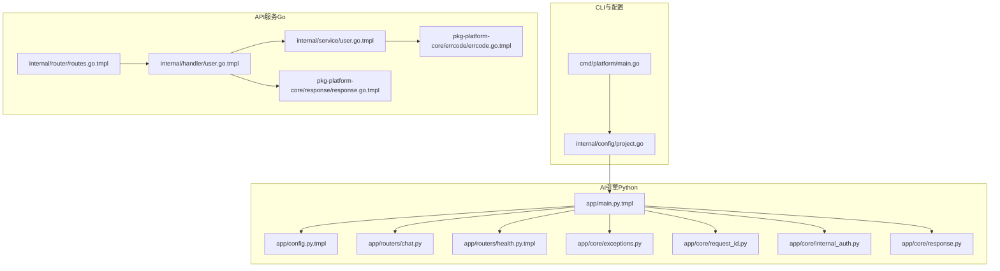
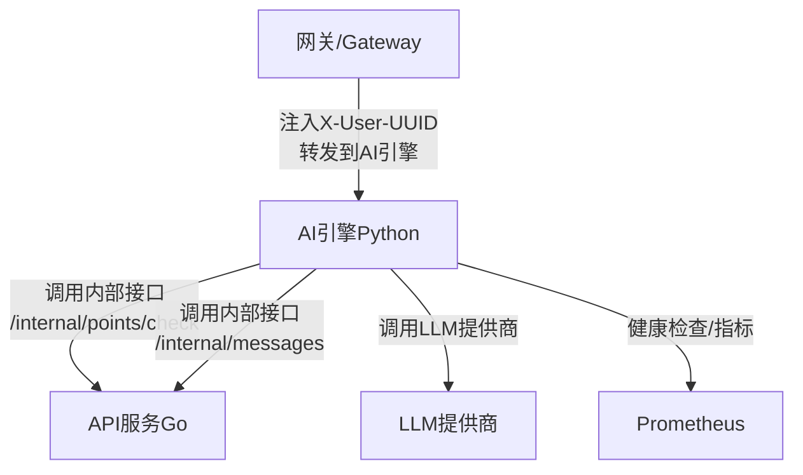
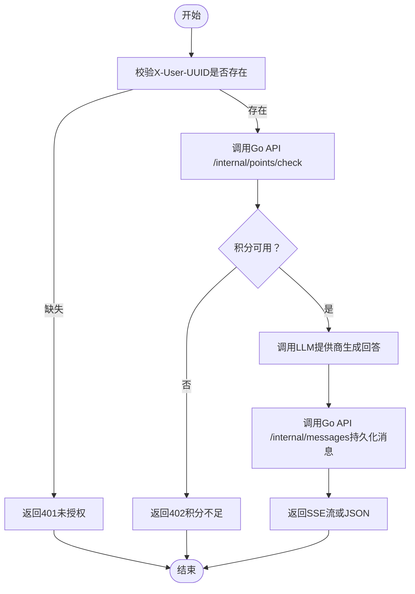
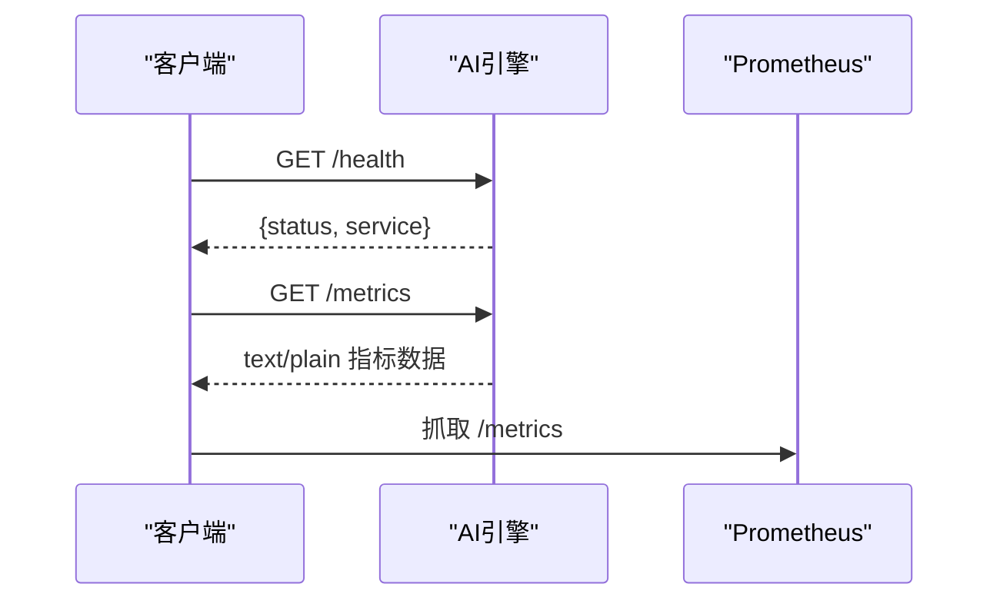
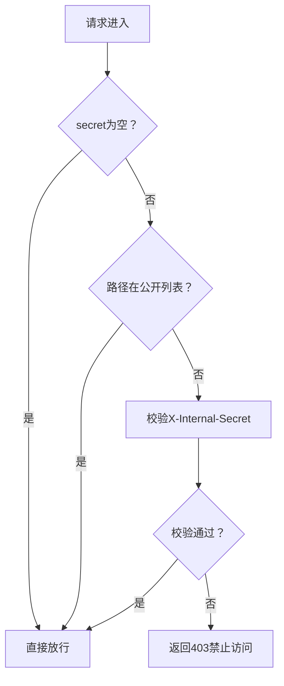
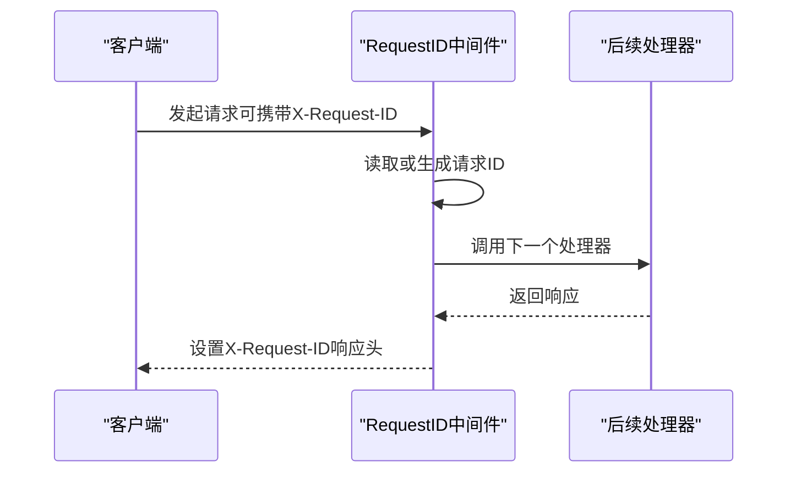
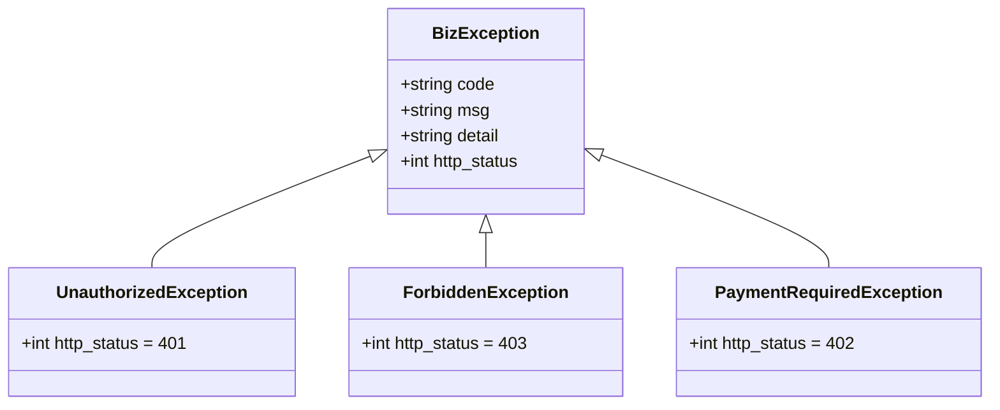
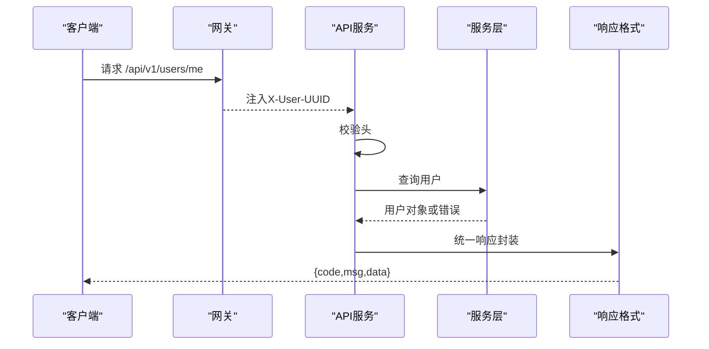
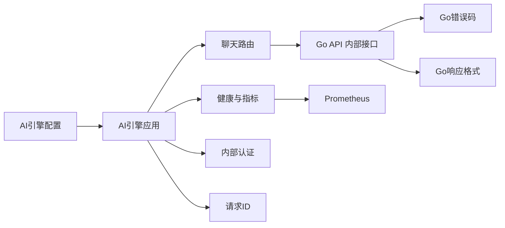

# AI引擎API

<cite>
**本文引用的文件**
- [cmd/platform/main.go](file://cmd/platform/main.go)
- [internal/config/project.go](file://internal/config/project.go)
- [templates/files/backend-ai-engine/app/routers/chat.py](file://templates/files/backend-ai-engine/app/routers/chat.py)
- [templates/files/backend-ai-engine/app/routers/health.py.tmpl](file://templates/files/backend-ai-engine/app/routers/health.py.tmpl)
- [templates/files/backend-ai-engine/app/core/exceptions.py](file://templates/files/backend-ai-engine/app/core/exceptions.py)
- [templates/files/backend-ai-engine/app/main.py.tmpl](file://templates/files/backend-ai-engine/app/main.py.tmpl)
- [templates/files/backend-ai-engine/app/config.py.tmpl](file://templates/files/backend-ai-engine/app/config.py.tmpl)
- [templates/files/backend-ai-engine/app/core/request_id.py](file://templates/files/backend-ai-engine/app/core/request_id.py)
- [templates/files/backend-ai-engine/app/core/internal_auth.py](file://templates/files/backend-ai-engine/app/core/internal_auth.py)
- [templates/files/backend-ai-engine/app/core/response.py](file://templates/files/backend-ai-engine/app/core/response.py)
- [templates/files/pkg-platform-core/errcode/errcode.go.tmpl](file://templates/files/pkg-platform-core/errcode/errcode.go.tmpl)
- [templates/files/pkg-platform-core/response/response.go.tmpl](file://templates/files/pkg-platform-core/response/response.go.tmpl)
- [templates/files/backend-api/internal/router/routes.go.tmpl](file://templates/files/backend-api/internal/router/routes.go.tmpl)
- [templates/files/backend-api/internal/handler/user.go.tmpl](file://templates/files/backend-api/internal/handler/user.go.tmpl)
- [templates/files/backend-api/internal/service/user.go.tmpl](file://templates/files/backend-api/internal/service/user.go.tmpl)
</cite>

## 目录
1. [简介](#简介)
2. [项目结构](#项目结构)
3. [核心组件](#核心组件)
4. [架构总览](#架构总览)
5. [详细组件分析](#详细组件分析)
6. [依赖分析](#依赖分析)
7. [性能考虑](#性能考虑)
8. [故障排查指南](#故障排查指南)
9. [结论](#结论)
10. [附录](#附录)

## 简介
本文件为“AI引擎API”的技术文档，聚焦于聊天服务API的完整规范，涵盖消息发送、会话管理与上下文维护的设计原则；同时说明健康检查端点、内部认证与请求追踪机制，以及AI模型调用接口、参数配置与响应处理方法。文档还包含错误处理机制、异常类型定义与故障恢复策略，并提供客户端集成示例与最佳实践指南。

该工程采用多语言协作：Go网关与API服务负责用户身份、权限与数据持久化；Python AI引擎负责对外只读的LLM调用与流式返回；公共组件库提供统一错误码与响应格式，确保前后端契约一致。

## 项目结构
- CLI入口与脚手架：提供项目初始化、版本查询与模板渲染能力。
- AI引擎（Python FastAPI）：提供聊天补全端点、健康检查与指标导出、内部认证与请求ID追踪、统一异常与响应格式。
- API服务（Go Gin）：提供用户信息等业务接口，配合网关注入用户标识。
- 公共组件库（Go）：统一错误码与响应格式，支撑跨语言一致性。

图表来源
- [cmd/platform/main.go:1-98](file://cmd/platform/main.go#L1-L98)
- [internal/config/project.go:1-121](file://internal/config/project.go#L1-L121)
- [templates/files/backend-ai-engine/app/main.py.tmpl:1-67](file://templates/files/backend-ai-engine/app/main.py.tmpl#L1-L67)
- [templates/files/backend-ai-engine/app/config.py.tmpl:1-31](file://templates/files/backend-ai-engine/app/config.py.tmpl#L1-L31)
- [templates/files/backend-ai-engine/app/routers/chat.py:1-28](file://templates/files/backend-ai-engine/app/routers/chat.py#L1-L28)
- [templates/files/backend-ai-engine/app/routers/health.py.tmpl:1-17](file://templates/files/backend-ai-engine/app/routers/health.py.tmpl#L1-L17)
- [templates/files/backend-ai-engine/app/core/exceptions.py:1-31](file://templates/files/backend-ai-engine/app/core/exceptions.py#L1-L31)
- [templates/files/backend-ai-engine/app/core/request_id.py:1-31](file://templates/files/backend-ai-engine/app/core/request_id.py#L1-L31)
- [templates/files/backend-ai-engine/app/core/internal_auth.py:1-34](file://templates/files/backend-ai-engine/app/core/internal_auth.py#L1-L34)
- [templates/files/backend-ai-engine/app/core/response.py:1-19](file://templates/files/backend-ai-engine/app/core/response.py#L1-L19)
- [templates/files/backend-api/internal/router/routes.go.tmpl:1-29](file://templates/files/backend-api/internal/router/routes.go.tmpl#L1-L29)
- [templates/files/backend-api/internal/handler/user.go.tmpl:1-47](file://templates/files/backend-api/internal/handler/user.go.tmpl#L1-L47)
- [templates/files/backend-api/internal/service/user.go.tmpl:1-38](file://templates/files/backend-api/internal/service/user.go.tmpl#L1-L38)
- [templates/files/pkg-platform-core/response/response.go.tmpl:1-78](file://templates/files/pkg-platform-core/response/response.go.tmpl#L1-L78)
- [templates/files/pkg-platform-core/errcode/errcode.go.tmpl:1-84](file://templates/files/pkg-platform-core/errcode/errcode.go.tmpl#L1-L84)

章节来源
- [cmd/platform/main.go:1-98](file://cmd/platform/main.go#L1-L98)
- [internal/config/project.go:1-121](file://internal/config/project.go#L1-L121)

## 核心组件
- 聊天补全端点（Python AI引擎）：接收消息负载，校验用户身份，调用上游API进行积分校验与消费、调用LLM生成回答、持久化消息，并返回SSE或普通JSON。
- 健康检查与指标端点（Python AI引擎）：提供服务健康状态与Prometheus指标导出。
- 内部认证中间件（Python AI引擎）：通过X-Internal-Secret保护内部接口，支持开发环境跳过校验。
- 请求ID中间件（Python AI引擎）：注入/透传X-Request-ID，便于跨服务追踪。
- 统一异常与响应（Python AI引擎）：将业务异常映射为统一JSON格式，与Go侧保持一致。
- Go API服务：提供用户信息等业务接口，配合网关注入X-User-UUID。
- Go公共组件：统一错误码与响应格式，保证前后端契约一致。

章节来源
- [templates/files/backend-ai-engine/app/routers/chat.py:1-28](file://templates/files/backend-ai-engine/app/routers/chat.py#L1-L28)
- [templates/files/backend-ai-engine/app/routers/health.py.tmpl:1-17](file://templates/files/backend-ai-engine/app/routers/health.py.tmpl#L1-L17)
- [templates/files/backend-ai-engine/app/core/internal_auth.py:1-34](file://templates/files/backend-ai-engine/app/core/internal_auth.py#L1-L34)
- [templates/files/backend-ai-engine/app/core/request_id.py:1-31](file://templates/files/backend-ai-engine/app/core/request_id.py#L1-L31)
- [templates/files/backend-ai-engine/app/core/exceptions.py:1-31](file://templates/files/backend-ai-engine/app/core/exceptions.py#L1-L31)
- [templates/files/backend-ai-engine/app/core/response.py:1-19](file://templates/files/backend-ai-engine/app/core/response.py#L1-L19)
- [templates/files/backend-api/internal/router/routes.go.tmpl:1-29](file://templates/files/backend-api/internal/router/routes.go.tmpl#L1-L29)
- [templates/files/pkg-platform-core/response/response.go.tmpl:1-78](file://templates/files/pkg-platform-core/response/response.go.tmpl#L1-L78)
- [templates/files/pkg-platform-core/errcode/errcode.go.tmpl:1-84](file://templates/files/pkg-platform-core/errcode/errcode.go.tmpl#L1-L84)

## 架构总览
AI引擎API遵循“只读请求、写操作委托”的设计原则：Python端只负责接收请求、调用LLM并返回SSE流，任何写操作（如积分校验/扣减、消息持久化）均由Go API完成。网关负责注入用户身份头（X-User-UUID）与内部密钥（X-Internal-Secret），并转发到相应服务。

图表来源
- [templates/files/backend-ai-engine/app/routers/chat.py:1-28](file://templates/files/backend-ai-engine/app/routers/chat.py#L1-L28)
- [templates/files/backend-ai-engine/app/routers/health.py.tmpl:1-17](file://templates/files/backend-ai-engine/app/routers/health.py.tmpl#L1-L17)
- [templates/files/backend-ai-engine/app/config.py.tmpl:1-31](file://templates/files/backend-ai-engine/app/config.py.tmpl#L1-L31)

## 详细组件分析

### 聊天补全端点（POST /completions）
- 设计原则
  - Python端只读：收到请求 → 调用LLM → 返回SSE流。
  - 写操作（扣积分、记录消息）必须委托给Go API（POST /internal/...）。
  - 通过X-User-UUID头识别登录用户（由gateway注入）。
- 请求与响应
  - 请求头：X-User-UUID（必填，否则返回401）。
  - 请求体：任意字典负载（由上游模板注释说明）。
  - 响应：统一JSON格式（code/msg/data），当前占位返回echo与user信息。
- 流程图（占位实现）

图表来源
- [templates/files/backend-ai-engine/app/routers/chat.py:13-27](file://templates/files/backend-ai-engine/app/routers/chat.py#L13-L27)

章节来源
- [templates/files/backend-ai-engine/app/routers/chat.py:1-28](file://templates/files/backend-ai-engine/app/routers/chat.py#L1-L28)

### 健康检查与指标端点
- /health：返回服务健康状态与服务名。
- /metrics：导出Prometheus指标文本。

图表来源
- [templates/files/backend-ai-engine/app/routers/health.py.tmpl:9-16](file://templates/files/backend-ai-engine/app/routers/health.py.tmpl#L9-L16)

章节来源
- [templates/files/backend-ai-engine/app/routers/health.py.tmpl:1-17](file://templates/files/backend-ai-engine/app/routers/health.py.tmpl#L1-L17)

### 内部认证中间件（X-Internal-Secret）
- 当secret为空时跳过校验（开发环境）。
- 对特定公开路径（/health、/metrics、/docs、/redoc、/openapi.json）放行。
- 使用恒等比较校验提供的密钥，不匹配则返回403。

图表来源
- [templates/files/backend-ai-engine/app/core/internal_auth.py:16-33](file://templates/files/backend-ai-engine/app/core/internal_auth.py#L16-L33)

章节来源
- [templates/files/backend-ai-engine/app/core/internal_auth.py:1-34](file://templates/files/backend-ai-engine/app/core/internal_auth.py#L1-L34)

### 请求ID中间件（X-Request-ID）
- 从请求头读取X-Request-ID（由网关注入），若不存在则生成新的UUID。
- 将请求ID放入上下文，透传到响应头，便于跨服务日志关联。

图表来源
- [templates/files/backend-ai-engine/app/core/request_id.py:17-30](file://templates/files/backend-ai-engine/app/core/request_id.py#L17-L30)

章节来源
- [templates/files/backend-ai-engine/app/core/request_id.py:1-31](file://templates/files/backend-ai-engine/app/core/request_id.py#L1-L31)

### 统一异常与响应（Python侧）
- 异常基类BizException，支持自定义HTTP状态码。
- 全局异常处理器将BizException映射为统一JSON格式：{code, msg, data}。
- 与Go侧响应格式保持一致，便于前端统一处理。

图表来源
- [templates/files/backend-ai-engine/app/core/exceptions.py:9-31](file://templates/files/backend-ai-engine/app/core/exceptions.py#L9-L31)

章节来源
- [templates/files/backend-ai-engine/app/core/exceptions.py:1-31](file://templates/files/backend-ai-engine/app/core/exceptions.py#L1-L31)
- [templates/files/backend-ai-engine/app/core/response.py:1-19](file://templates/files/backend-ai-engine/app/core/response.py#L1-L19)

### Go API服务与用户接口
- 路由注册：/api/v1/users/me，依赖网关注入的X-User-UUID。
- 处理器：校验头是否存在，调用服务层查询用户，返回统一响应格式。
- 服务层：根据UUID查询用户，必要时结合缓存与数据库。

图表来源
- [templates/files/backend-api/internal/router/routes.go.tmpl:17-25](file://templates/files/backend-api/internal/router/routes.go.tmpl#L17-L25)
- [templates/files/backend-api/internal/handler/user.go.tmpl:30-46](file://templates/files/backend-api/internal/handler/user.go.tmpl#L30-L46)
- [templates/files/backend-api/internal/service/user.go.tmpl:31-37](file://templates/files/backend-api/internal/service/user.go.tmpl#L31-L37)
- [templates/files/pkg-platform-core/response/response.go.tmpl:26-77](file://templates/files/pkg-platform-core/response/response.go.tmpl#L26-L77)

章节来源
- [templates/files/backend-api/internal/router/routes.go.tmpl:1-29](file://templates/files/backend-api/internal/router/routes.go.tmpl#L1-L29)
- [templates/files/backend-api/internal/handler/user.go.tmpl:1-47](file://templates/files/backend-api/internal/handler/user.go.tmpl#L1-L47)
- [templates/files/backend-api/internal/service/user.go.tmpl:1-38](file://templates/files/backend-api/internal/service/user.go.tmpl#L1-L38)
- [templates/files/pkg-platform-core/response/response.go.tmpl:1-78](file://templates/files/pkg-platform-core/response/response.go.tmpl#L1-L78)

### 配置与部署
- Python AI引擎配置：端口、环境、内部密钥、上游API基础地址、CORS白名单等。
- Go API服务路由前缀统一为/api/v1，便于网关转发与治理。

章节来源
- [templates/files/backend-ai-engine/app/config.py.tmpl:1-31](file://templates/files/backend-ai-engine/app/config.py.tmpl#L1-L31)
- [templates/files/backend-api/internal/router/routes.go.tmpl:17-25](file://templates/files/backend-api/internal/router/routes.go.tmpl#L17-L25)

## 依赖分析
- Python AI引擎依赖Go API进行写操作（积分校验/扣减、消息持久化），并通过X-Internal-Secret进行内部认证。
- Go API依赖公共组件库提供统一错误码与响应格式，保证跨语言一致性。
- CLI脚手架负责生成上述模板与配置，确保端口、模块开关与项目名称的一致性。

图表来源
- [templates/files/backend-ai-engine/app/config.py.tmpl:14-25](file://templates/files/backend-ai-engine/app/config.py.tmpl#L14-L25)
- [templates/files/backend-ai-engine/app/core/internal_auth.py:16-33](file://templates/files/backend-ai-engine/app/core/internal_auth.py#L16-L33)
- [templates/files/backend-ai-engine/app/routers/chat.py:22-26](file://templates/files/backend-ai-engine/app/routers/chat.py#L22-L26)
- [templates/files/pkg-platform-core/errcode/errcode.go.tmpl:11-38](file://templates/files/pkg-platform-core/errcode/errcode.go.tmpl#L11-L38)
- [templates/files/pkg-platform-core/response/response.go.tmpl:26-77](file://templates/files/pkg-platform-core/response/response.go.tmpl#L26-L77)

章节来源
- [internal/config/project.go:43-59](file://internal/config/project.go#L43-L59)
- [cmd/platform/main.go:40-86](file://cmd/platform/main.go#L40-L86)

## 性能考虑
- 连接复用：AI引擎在生命周期内创建异步HTTP客户端，减少连接开销。
- 中间件顺序：CORS、内部认证、请求ID按自外向内顺序加载，避免重复处理。
- 指标导出：健康检查与指标端点便于Prometheus抓取，辅助容量规划与告警。
- 写操作委托：将积分与消息持久化委托给Go API，降低Python端IO复杂度。

章节来源
- [templates/files/backend-ai-engine/app/main.py.tmpl:27-36](file://templates/files/backend-ai-engine/app/main.py.tmpl#L27-L36)
- [templates/files/backend-ai-engine/app/main.py.tmpl:42-53](file://templates/files/backend-ai-engine/app/main.py.tmpl#L42-L53)
- [templates/files/backend-ai-engine/app/routers/health.py.tmpl:9-16](file://templates/files/backend-ai-engine/app/routers/health.py.tmpl#L9-L16)

## 故障排查指南
- 401未授权：检查X-User-UUID是否由网关正确注入。
- 403禁止访问：确认X-Internal-Secret是否正确且未在开发环境跳过。
- 402积分不足：检查Go API /internal/points/check返回与扣减逻辑。
- 5xx服务端错误：查看AI引擎日志中的X-Request-ID，定位具体请求链路。
- 指标异常：确认Prometheus抓取/health与/metrics端点可达。

章节来源
- [templates/files/backend-ai-engine/app/routers/chat.py:19-20](file://templates/files/backend-ai-engine/app/routers/chat.py#L19-L20)
- [templates/files/backend-ai-engine/app/core/internal_auth.py:27-32](file://templates/files/backend-ai-engine/app/core/internal_auth.py#L27-L32)
- [templates/files/pkg-platform-core/errcode/errcode.go.tmpl:76-79](file://templates/files/pkg-platform-core/errcode/errcode.go.tmpl#L76-L79)

## 结论
AI引擎API通过清晰的职责划分与统一的中间件与响应格式，实现了高内聚、低耦合的服务架构。聊天补全端点遵循“只读请求、写操作委托”的原则，结合Go API完成积分与消息的持久化，既保证了业务一致性，也提升了系统的可维护性与可观测性。

## 附录

### API规范摘要
- 聊天补全
  - 方法：POST
  - 路径：/completions
  - 请求头：X-User-UUID（必填）
  - 请求体：任意字典负载
  - 响应：统一JSON格式（code/msg/data）
- 健康检查
  - 方法：GET
  - 路径：/health
  - 响应：{status, service}
- 指标导出
  - 方法：GET
  - 路径：/metrics
  - 响应：text/plain

章节来源
- [templates/files/backend-ai-engine/app/routers/chat.py:13-27](file://templates/files/backend-ai-engine/app/routers/chat.py#L13-L27)
- [templates/files/backend-ai-engine/app/routers/health.py.tmpl:9-16](file://templates/files/backend-ai-engine/app/routers/health.py.tmpl#L9-L16)

### 错误码与响应格式对照
- 统一响应格式：{code, msg, data}
- HTTP状态码语义：200成功；400业务错误；401未登录；402需付费；403禁止；406需订阅；500服务端错误
- 错误码示例（AI相关）：105006（AI服务请求失败）、105017（锁获取失败）

章节来源
- [templates/files/pkg-platform-core/response/response.go.tmpl:9-17](file://templates/files/pkg-platform-core/response/response.go.tmpl#L9-L17)
- [templates/files/pkg-platform-core/errcode/errcode.go.tmpl:80-83](file://templates/files/pkg-platform-core/errcode/errcode.go.tmpl#L80-L83)

### 客户端集成示例与最佳实践
- 集成步骤
  - 通过网关发起请求，确保X-User-UUID与X-Internal-Secret正确注入。
  - 调用/health与/metrics端点进行健康检查与监控接入。
  - 调用/completions发送消息，解析SSE或JSON响应。
- 最佳实践
  - 使用X-Request-ID进行端到端追踪。
  - 对401/402/403等业务异常进行前端友好提示与重试策略。
  - 在开发环境可临时跳过内部认证，但生产务必启用X-Internal-Secret。

章节来源
- [templates/files/backend-ai-engine/app/core/request_id.py:17-30](file://templates/files/backend-ai-engine/app/core/request_id.py#L17-L30)
- [templates/files/backend-ai-engine/app/core/internal_auth.py:22-25](file://templates/files/backend-ai-engine/app/core/internal_auth.py#L22-L25)
- [templates/files/backend-ai-engine/app/routers/health.py.tmpl:9-16](file://templates/files/backend-ai-engine/app/routers/health.py.tmpl#L9-L16)