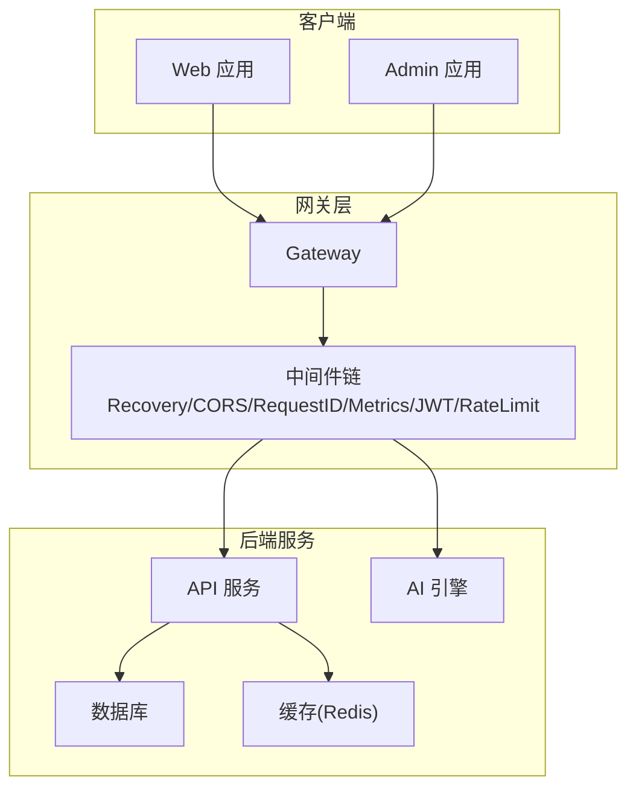
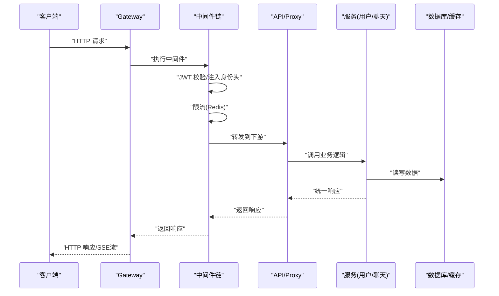
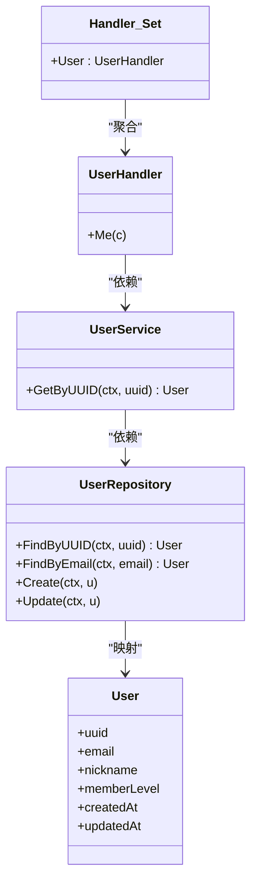
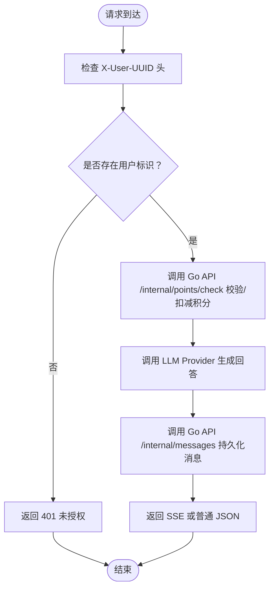
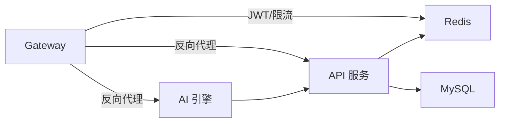

# API文档

<cite>
**本文档引用的文件**
- [cmd/platform/main.go](file://cmd/platform/main.go)
- [internal/config/project.go](file://internal/config/project.go)
- [templates/files/backend-api/cmd/api/main.go.tmpl](file://templates/files/backend-api/cmd/api/main.go.tmpl)
- [templates/files/backend-api/internal/app/bootstrap.go.tmpl](file://templates/files/backend-api/internal/app/bootstrap.go.tmpl)
- [templates/files/backend-api/internal/router/routes.go.tmpl](file://templates/files/backend-api/internal/router/routes.go.tmpl)
- [templates/files/backend-api/internal/handler/user.go.tmpl](file://templates/files/backend-api/internal/handler/user.go.tmpl)
- [templates/files/backend-api/internal/service/user.go.tmpl](file://templates/files/backend-api/internal/service/user.go.tmpl)
- [templates/files/backend-api/internal/model/user.go.tmpl](file://templates/files/backend-api/internal/model/user.go.tmpl)
- [templates/files/backend-api/internal/repository/user_repo.go.tmpl](file://templates/files/backend-api/internal/repository/user_repo.go.tmpl)
- [templates/files/backend-ai-engine/app/routers/chat.py](file://templates/files/backend-ai-engine/app/routers/chat.py)
- [templates/files/backend-ai-engine/app/routers/health.py.tmpl](file://templates/files/backend-ai-engine/app/routers/health.py.tmpl)
- [templates/files/backend-gateway/cmd/gateway/main.go.tmpl](file://templates/files/backend-gateway/cmd/gateway/main.go.tmpl)
- [templates/files/backend-gateway/internal/proxy/proxy.go.tmpl](file://templates/files/backend-gateway/internal/proxy/proxy.go.tmpl)
- [templates/files/pkg-platform-core/middleware/middleware.go.tmpl](file://templates/files/pkg-platform-core/middleware/middleware.go.tmpl)
- [templates/files/pkg-platform-core/response/response.go.tmpl](file://templates/files/pkg-platform-core/response/response.go.tmpl)
- [templates/files/pkg-platform-core/errcode/errcode.go.tmpl](file://templates/files/pkg-platform-core/errcode/errcode.go.tmpl)
</cite>

## 目录
1. [简介](#简介)
2. [项目结构](#项目结构)
3. [核心组件](#核心组件)
4. [架构总览](#架构总览)
5. [详细组件分析](#详细组件分析)
6. [依赖分析](#依赖分析)
7. [性能考虑](#性能考虑)
8. [故障排查指南](#故障排查指南)
9. [结论](#结论)
10. [附录](#附录)

## 简介
本指南面向使用该脚手架生成的微服务系统，提供完整的API文档规范，覆盖以下内容：
- RESTful API端点清单与请求/响应格式
- 认证与授权机制（JWT与内部密钥校验）
- 版本控制策略与错误码体系
- 健康检查与指标端点
- 客户端实现建议、SDK使用与性能优化

系统采用“网关 + API服务 + AI引擎”的分层架构，网关负责统一鉴权、限流与路由转发，API服务承载用户域业务，AI引擎提供推理与流式能力。

## 项目结构
- CLI入口与项目初始化：CLI命令、交互式配置与模板渲染
- 网关（Gateway）：全局中间件链、JWT鉴权、限流、CORS、SSE/二进制流透传
- API服务（Go）：三层架构（Handler/Service/Repository）、统一响应、内部密钥校验
- AI引擎（Python FastAPI）：只读推理、SSE流式输出、与API服务协作
- 平台公共库（pkg-platform-core）：中间件、统一响应、错误码、速率限制等

图表来源
- [templates/files/backend-gateway/cmd/gateway/main.go.tmpl:30-61](file://templates/files/backend-gateway/cmd/gateway/main.go.tmpl#L30-L61)
- [templates/files/backend-api/internal/app/bootstrap.go.tmpl:46-98](file://templates/files/backend-api/internal/app/bootstrap.go.tmpl#L46-L98)
- [templates/files/backend-ai-engine/app/routers/chat.py:13-27](file://templates/files/backend-ai-engine/app/routers/chat.py#L13-L27)

章节来源
- [cmd/platform/main.go:22-38](file://cmd/platform/main.go#L22-L38)
- [internal/config/project.go:61-89](file://internal/config/project.go#L61-L89)

## 核心组件
- 网关中间件链：Recovery → CORS → RequestID → Metrics → JWT → RateLimit
- API服务中间件链：Recovery → RequestID → PrometheusMetrics → InternalAuth
- 统一响应格式：{code, msg, data}，HTTP状态码与业务错误码分离
- 错误码注册表：六位字符串错误码，按业务域分段
- 速率限制：基于Redis固定窗口限流，fail-open
- SSE/二进制流透传：支持text/event-stream与音频/二进制流

章节来源
- [templates/files/pkg-platform-core/middleware/middleware.go.tmpl:24-100](file://templates/files/pkg-platform-core/middleware/middleware.go.tmpl#L24-L100)
- [templates/files/pkg-platform-core/response/response.go.tmpl:26-77](file://templates/files/pkg-platform-core/response/response.go.tmpl#L26-L77)
- [templates/files/pkg-platform-core/errcode/errcode.go.tmpl:11-83](file://templates/files/pkg-platform-core/errcode/errcode.go.tmpl#L11-L83)
- [templates/files/backend-gateway/internal/proxy/proxy.go.tmpl:68-96](file://templates/files/backend-gateway/internal/proxy/proxy.go.tmpl#L68-L96)

## 架构总览
下图展示了从客户端到后端服务的典型调用链，包含鉴权、限流、内部密钥校验与SSE流式响应的关键节点。

图表来源
- [templates/files/backend-gateway/cmd/gateway/main.go.tmpl:48-61](file://templates/files/backend-gateway/cmd/gateway/main.go.tmpl#L48-L61)
- [templates/files/backend-gateway/internal/proxy/proxy.go.tmpl:26-66](file://templates/files/backend-gateway/internal/proxy/proxy.go.tmpl#L26-L66)
- [templates/files/pkg-platform-core/middleware/middleware.go.tmpl:102-163](file://templates/files/pkg-platform-core/middleware/middleware.go.tmpl#L102-L163)

## 详细组件分析

### 网关（Gateway）
- 中间件顺序与职责
  - Recovery：异常恢复
  - CORS：白名单与凭证允许
  - RequestID：全链路追踪
  - PrometheusMetrics：指标采集
  - JWT：Bearer Token校验，注入X-User-UUID/X-Member-Level
  - RateLimit：Redis固定窗口限流（fail-open）
- 路由与转发
  - 业务路由通过反向代理转发至下游API/AI Engine
  - 自动注入X-Internal-Secret保护内部私域路由
  - 支持SSE与二进制流透传
- 健康检查与指标
  - /health：返回服务状态
  - /metrics：Prometheus指标

章节来源
- [templates/files/backend-gateway/cmd/gateway/main.go.tmpl:30-67](file://templates/files/backend-gateway/cmd/gateway/main.go.tmpl#L30-L67)
- [templates/files/backend-gateway/internal/proxy/proxy.go.tmpl:26-66](file://templates/files/backend-gateway/internal/proxy/proxy.go.tmpl#L26-L66)
- [templates/files/pkg-platform-core/middleware/middleware.go.tmpl:102-163](file://templates/files/pkg-platform-core/middleware/middleware.go.tmpl#L102-L163)

### API服务（Go）
- 三层架构
  - Handler：解析请求、调用Service、统一响应
  - Service：编排Repository、缓存与外部调用
  - Repository：数据访问层，依赖GORM
- 路由与版本
  - 路由前缀：/api/v1
  - 当前用户端点：GET /api/v1/users/me
- 认证与授权
  - 内部密钥校验：X-Internal-Secret，保护内部私域路由
  - 身份注入：X-User-UUID（由网关注入）
- 统一响应与错误码
  - 响应格式：{code, msg, data}
  - HTTP状态码与业务错误码分离
  - 错误码注册表按业务域分段

图表来源
- [templates/files/backend-api/internal/router/routes.go.tmpl:17-25](file://templates/files/backend-api/internal/router/routes.go.tmpl#L17-L25)
- [templates/files/backend-api/internal/handler/user.go.tmpl:14-46](file://templates/files/backend-api/internal/handler/user.go.tmpl#L14-L46)
- [templates/files/backend-api/internal/service/user.go.tmpl:17-37](file://templates/files/backend-api/internal/service/user.go.tmpl#L17-L37)
- [templates/files/backend-api/internal/repository/user_repo.go.tmpl:14-54](file://templates/files/backend-api/internal/repository/user_repo.go.tmpl#L14-L54)
- [templates/files/backend-api/internal/model/user.go.tmpl:13-25](file://templates/files/backend-api/internal/model/user.go.tmpl#L13-L25)

章节来源
- [templates/files/backend-api/internal/app/bootstrap.go.tmpl:46-98](file://templates/files/backend-api/internal/app/bootstrap.go.tmpl#L46-L98)
- [templates/files/backend-api/internal/router/routes.go.tmpl:17-25](file://templates/files/backend-api/internal/router/routes.go.tmpl#L17-L25)
- [templates/files/backend-api/internal/handler/user.go.tmpl:28-46](file://templates/files/backend-api/internal/handler/user.go.tmpl#L28-L46)
- [templates/files/backend-api/internal/service/user.go.tmpl:31-37](file://templates/files/backend-api/internal/service/user.go.tmpl#L31-L37)
- [templates/files/backend-api/internal/repository/user_repo.go.tmpl:30-54](file://templates/files/backend-api/internal/repository/user_repo.go.tmpl#L30-L54)
- [templates/files/backend-api/internal/model/user.go.tmpl:13-25](file://templates/files/backend-api/internal/model/user.go.tmpl#L13-L25)
- [templates/files/pkg-platform-core/response/response.go.tmpl:26-77](file://templates/files/pkg-platform-core/response/response.go.tmpl#L26-L77)
- [templates/files/pkg-platform-core/errcode/errcode.go.tmpl:11-83](file://templates/files/pkg-platform-core/errcode/errcode.go.tmpl#L11-L83)

### AI引擎（Python FastAPI）
- 设计原则
  - 只读推理：接收请求 → 调用LLM → 返回SSE流
  - 写操作委托给Go API（POST /internal/...）
  - 通过X-User-UUID识别登录用户
- 当前端点
  - POST /completions：占位实现，返回用户与请求回显
- 健康检查与指标
  - /health：返回服务状态
  - /metrics：Prometheus指标

图表来源
- [templates/files/backend-ai-engine/app/routers/chat.py:13-27](file://templates/files/backend-ai-engine/app/routers/chat.py#L13-L27)

章节来源
- [templates/files/backend-ai-engine/app/routers/chat.py:13-27](file://templates/files/backend-ai-engine/app/routers/chat.py#L13-L27)
- [templates/files/backend-ai-engine/app/routers/health.py.tmpl:9-16](file://templates/files/backend-ai-engine/app/routers/health.py.tmpl#L9-L16)

### 健康检查与指标
- 网关健康：GET /health
- 网关指标：GET /metrics
- API健康：GET /health
- API指标：GET /metrics
- AI引擎健康：GET /health
- AI引擎指标：GET /metrics

章节来源
- [templates/files/backend-gateway/cmd/gateway/main.go.tmpl:63-66](file://templates/files/backend-gateway/cmd/gateway/main.go.tmpl#L63-L66)
- [templates/files/backend-api/internal/app/bootstrap.go.tmpl:92-95](file://templates/files/backend-api/internal/app/bootstrap.go.tmpl#L92-L95)
- [templates/files/backend-ai-engine/app/routers/health.py.tmpl:9-16](file://templates/files/backend-ai-engine/app/routers/health.py.tmpl#L9-L16)

## 依赖分析
- 组件耦合
  - 网关依赖Redis进行限流，依赖JWT管理器进行鉴权
  - API服务依赖MySQL与Redis，通过Repository抽象隔离数据访问
  - AI引擎通过HTTP调用API服务的内部接口
- 外部依赖
  - Gin：Web框架
  - GORM/MySQL：ORM与关系型数据库
  - Redis：缓存与限流
  - Prometheus：指标采集
  - FastAPI：AI引擎推理服务

图表来源
- [templates/files/backend-gateway/cmd/gateway/main.go.tmpl:33-44](file://templates/files/backend-gateway/cmd/gateway/main.go.tmpl#L33-L44)
- [templates/files/backend-api/internal/app/bootstrap.go.tmpl:49-70](file://templates/files/backend-api/internal/app/bootstrap.go.tmpl#L49-L70)
- [templates/files/backend-ai-engine/app/routers/chat.py:22-26](file://templates/files/backend-ai-engine/app/routers/chat.py#L22-L26)

章节来源
- [templates/files/backend-gateway/cmd/gateway/main.go.tmpl:33-44](file://templates/files/backend-gateway/cmd/gateway/main.go.tmpl#L33-L44)
- [templates/files/backend-api/internal/app/bootstrap.go.tmpl:49-70](file://templates/files/backend-api/internal/app/bootstrap.go.tmpl#L49-L70)

## 性能考虑
- 限流策略
  - Redis固定窗口限流，fail-open，避免上游雪崩
  - 建议根据业务峰值设置合理的窗口大小与阈值
- 连接池与超时
  - 网关反向代理使用共享HTTP客户端，配置最大空闲连接与超时
  - 建议结合上游服务的并发能力调整MaxIdleConns与Timeout
- 指标监控
  - 使用Prometheus指标采集HTTP请求数、耗时与并发
  - 结合日志与追踪ID定位性能瓶颈
- SSE/二进制流
  - 确保启用无缓冲模式与逐块刷新，避免大延迟
  - 控制上游响应体大小与超时时间

章节来源
- [templates/files/pkg-platform-core/middleware/middleware.go.tmpl:8-9](file://templates/files/pkg-platform-core/middleware/middleware.go.tmpl#L8-L9)
- [templates/files/backend-gateway/internal/proxy/proxy.go.tmpl:13-23](file://templates/files/backend-gateway/internal/proxy/proxy.go.tmpl#L13-L23)
- [templates/files/backend-gateway/internal/proxy/proxy.go.tmpl:68-96](file://templates/files/backend-gateway/internal/proxy/proxy.go.tmpl#L68-L96)

## 故障排查指南
- 401 未授权
  - 网关：缺少或无效的Authorization头；或RefreshToken缺失导致过期
  - API：X-User-UUID缺失
- 403 禁止访问
  - 网关：JWT过期；或内部私域路由缺少X-Internal-Secret
  - API：内部密钥校验失败
- 400 业务错误
  - 使用统一响应中的业务错误码定位问题
- 500 服务器错误
  - 检查服务日志与追踪ID，确认数据库/缓存连通性
- 健康检查
  - 通过/health与/health确认服务可用性
- 指标与日志
  - 通过/metrics与日志定位性能与错误趋势

章节来源
- [templates/files/pkg-platform-core/middleware/middleware.go.tmpl:140-162](file://templates/files/pkg-platform-core/middleware/middleware.go.tmpl#L140-L162)
- [templates/files/backend-api/internal/handler/user.go.tmpl:31-35](file://templates/files/backend-api/internal/handler/user.go.tmpl#L31-L35)
- [templates/files/pkg-platform-core/response/response.go.tmpl:51-77](file://templates/files/pkg-platform-core/response/response.go.tmpl#L51-L77)
- [templates/files/pkg-platform-core/errcode/errcode.go.tmpl:51-83](file://templates/files/pkg-platform-core/errcode/errcode.go.tmpl#L51-L83)

## 结论
本指南提供了从网关到API与AI引擎的完整API规范，明确了认证、版本控制、错误处理与安全策略。建议在生产环境中：
- 正确配置JWT与内部密钥，严格区分公开与私域路由
- 使用统一响应与错误码体系，便于前端与监控系统消费
- 结合限流与指标监控，保障系统稳定性与可观测性

## 附录

### API端点规范

- 版本控制
  - 路由前缀：/api/v1
  - 内部私域路由：/internal/*
  - 健康检查：/health
  - 指标：/metrics

- 用户管理API（Go API）
  - 方法与路径
    - GET /api/v1/users/me
  - 请求头
    - Authorization: Bearer <token>（网关注入X-User-UUID）
    - X-Request-ID：可选，用于追踪
  - 成功响应
    - 状态码：200
    - 载荷：统一响应{code, msg, data}，data为用户对象
  - 失败响应
    - 401 未授权：缺失或无效身份头
    - 404 用户不存在
    - 500 服务器错误：内部异常

- 聊天服务API（AI引擎）
  - 方法与路径
    - POST /completions
  - 请求头
    - X-User-UUID：由网关注入
    - Content-Type：application/json
  - 请求体
    - 任意JSON对象（示例占位）
  - 成功响应
    - 200：普通JSON或SSE流
  - 失败响应
    - 401 未授权：缺失X-User-UUID
    - 500 服务器错误：内部异常

- 健康检查与指标
  - GET /health：返回服务状态
  - GET /metrics：返回Prometheus指标

章节来源
- [templates/files/backend-api/internal/router/routes.go.tmpl:17-25](file://templates/files/backend-api/internal/router/routes.go.tmpl#L17-L25)
- [templates/files/backend-api/internal/handler/user.go.tmpl:28-46](file://templates/files/backend-api/internal/handler/user.go.tmpl#L28-L46)
- [templates/files/backend-ai-engine/app/routers/chat.py:13-27](file://templates/files/backend-ai-engine/app/routers/chat.py#L13-L27)
- [templates/files/backend-ai-engine/app/routers/health.py.tmpl:9-16](file://templates/files/backend-ai-engine/app/routers/health.py.tmpl#L9-L16)

### 认证与授权机制
- 网关层
  - JWT：Bearer Token校验，注入X-User-UUID与X-Member-Level
  - 公开路径白名单：匿名可访问但仍尝试解析token
  - 过期行为：返回403并提示刷新
- 内部私域
  - X-Internal-Secret：校验通过后方可访问/INTERNAL/*路由
- AI引擎
  - 通过X-User-UUID识别用户，写操作委托API服务

章节来源
- [templates/files/pkg-platform-core/middleware/middleware.go.tmpl:102-163](file://templates/files/pkg-platform-core/middleware/middleware.go.tmpl#L102-L163)
- [templates/files/pkg-platform-core/middleware/middleware.go.tmpl:49-68](file://templates/files/pkg-platform-core/middleware/middleware.go.tmpl#L49-L68)
- [templates/files/backend-ai-engine/app/routers/chat.py:13-20](file://templates/files/backend-ai-engine/app/routers/chat.py#L13-L20)

### 统一响应与错误码
- 统一响应格式
  - {code, msg, data}
  - HTTP状态码与业务错误码分离
- 错误码分段
  - 系统层：000xxx
  - 鉴权与注册：100xxx
  - 文件与资源：103xxx
  - 支付与积分：104xxx
  - AI与外部服务：105xxx

章节来源
- [templates/files/pkg-platform-core/response/response.go.tmpl:26-77](file://templates/files/pkg-platform-core/response/response.go.tmpl#L26-L77)
- [templates/files/pkg-platform-core/errcode/errcode.go.tmpl:47-83](file://templates/files/pkg-platform-core/errcode/errcode.go.tmpl#L47-L83)

### 客户端实现示例与SDK使用
- 客户端建议
  - 使用Bearer Token访问公开API，自动注入X-User-UUID
  - 处理401/403场景，触发前端刷新流程
  - SSE流式响应：逐块读取并渲染
- SDK使用
  - 统一响应解析：优先依据code判断业务结果
  - 错误码映射：前端按code进行本地化展示

章节来源
- [templates/files/pkg-platform-core/middleware/middleware.go.tmpl:140-162](file://templates/files/pkg-platform-core/middleware/middleware.go.tmpl#L140-L162)
- [templates/files/pkg-platform-core/response/response.go.tmpl:33-44](file://templates/files/pkg-platform-core/response/response.go.tmpl#L33-L44)