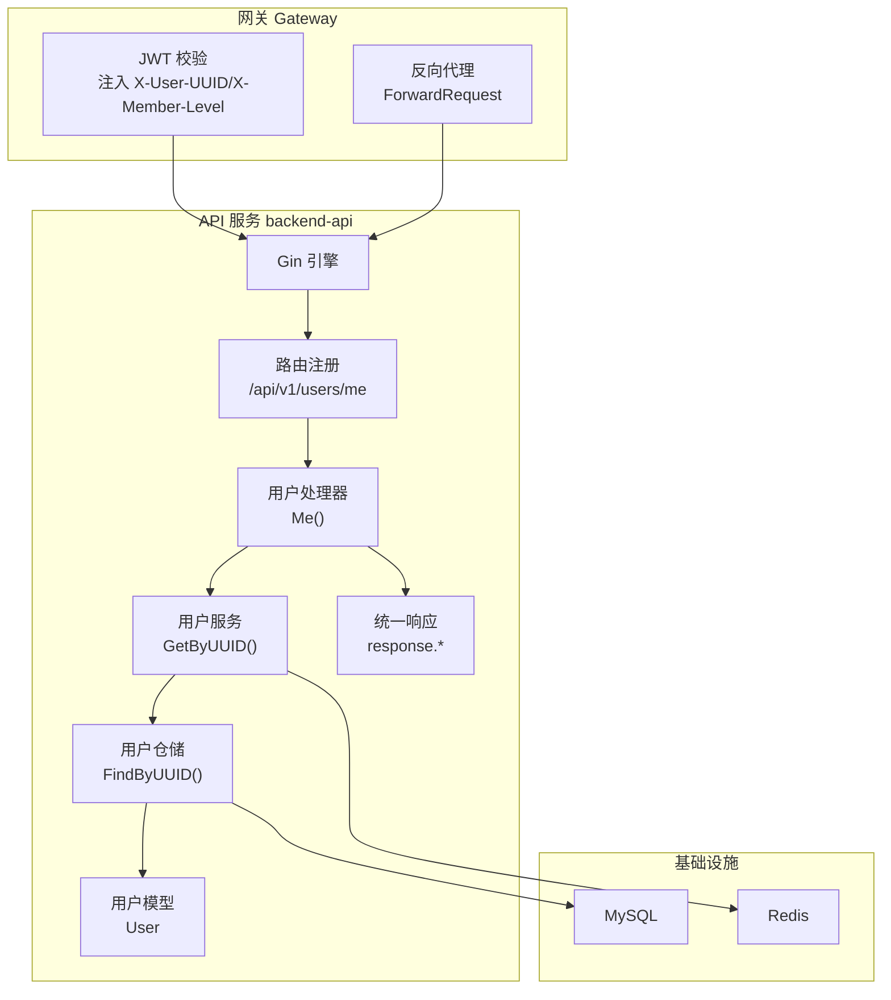
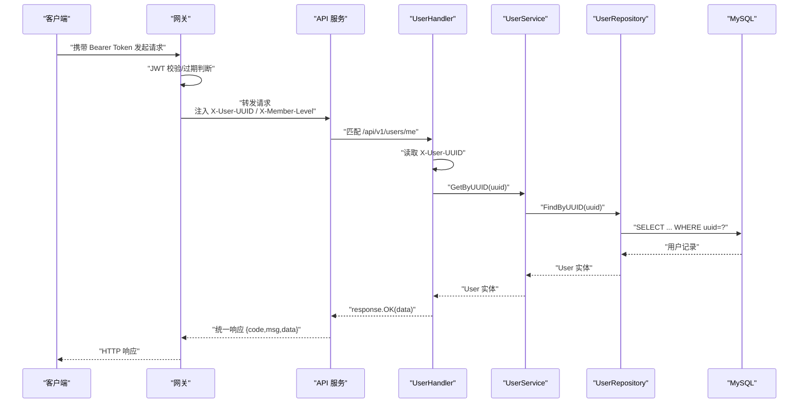
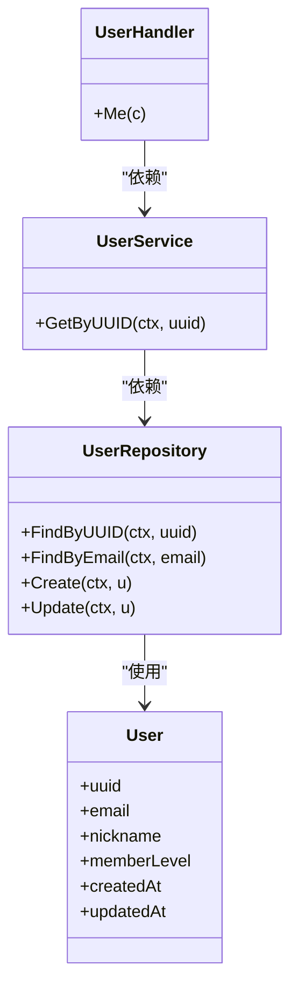

# 后端API端点

<cite>
**本文引用的文件**
- [cmd/api/main.go.tmpl](file://cmd/api/main.go.tmpl)
- [internal/app/bootstrap.go.tmpl](file://internal/app/bootstrap.go.tmpl)
- [internal/config/config.go.tmpl](file://internal/config/config.go.tmpl)
- [internal/router/routes.go.tmpl](file://internal/router/routes.go.tmpl)
- [internal/handler/user.go.tmpl](file://internal/handler/user.go.tmpl)
- [internal/service/user.go.tmpl](file://internal/service/user.go.tmpl)
- [internal/repository/user_repo.go.tmpl](file://internal/repository/user_repo.go.tmpl)
- [internal/model/user.go.tmpl](file://internal/model/user.go.tmpl)
- [pkg-platform-core/response/response.go.tmpl](file://pkg-platform-core/response/response.go.tmpl)
- [pkg-platform-core/docs/response.md](file://pkg-platform-core/docs/response.md)
- [pkg-platform-core/middleware/middleware.go.tmpl](file://pkg-platform-core/middleware/middleware.go.tmpl)
- [backend-gateway/pkg/jwt/jwt.go.tmpl](file://backend-gateway/pkg/jwt/jwt.go.tmpl)
- [backend-gateway/internal/proxy/proxy.go.tmpl](file://backend-gateway/internal/proxy/proxy.go.tmpl)
- [database/init.sql.tmpl](file://database/init.sql.tmpl)
</cite>

## 目录
1. [简介](#简介)
2. [项目结构](#项目结构)
3. [核心组件](#核心组件)
4. [架构总览](#架构总览)
5. [详细组件分析](#详细组件分析)
6. [依赖关系分析](#依赖关系分析)
7. [性能考量](#性能考量)
8. [故障排查指南](#故障排查指南)
9. [结论](#结论)
10. [附录](#附录)

## 简介
本文件为后端API的RESTful端点文档，聚焦用户管理相关接口，覆盖用户注册、登录、信息查询与更新等场景。当前代码库已实现“获取当前登录用户信息”端点，其余如注册、登录、更新资料等端点处于待实现状态（模板中留有注释）。本文将基于现有实现与模板约定，给出端点设计规范、认证机制、权限控制、数据验证规则、错误码说明与常见问题解决方案。

## 项目结构
后端API采用三层架构：Handler（处理HTTP请求/响应）、Service（业务编排）、Repository（数据访问）。路由前缀统一为 /api/v1，由网关进行转发与鉴权注入。内部服务通过 X-Internal-Secret 校验，用户身份由网关注入 X-User-UUID 头传递。

图表来源
- [internal/router/routes.go.tmpl:16-28](file://internal/router/routes.go.tmpl#L16-L28)
- [internal/handler/user.go.tmpl:28-46](file://internal/handler/user.go.tmpl#L28-L46)
- [internal/service/user.go.tmpl:16-37](file://internal/service/user.go.tmpl#L16-L37)
- [internal/repository/user_repo.go.tmpl:13-54](file://internal/repository/user_repo.go.tmpl#L13-L54)
- [internal/model/user.go.tmpl:13-25](file://internal/model/user.go.tmpl#L13-L25)
- [pkg-platform-core/response/response.go.tmpl:26-77](file://pkg-platform-core/response/response.go.tmpl#L26-L77)
- [backend-gateway/internal/proxy/proxy.go.tmpl:25-66](file://backend-gateway/internal/proxy/proxy.go.tmpl#L25-L66)

章节来源
- [internal/app/bootstrap.go.tmpl:45-98](file://internal/app/bootstrap.go.tmpl#L45-L98)
- [internal/router/routes.go.tmpl:16-28](file://internal/router/routes.go.tmpl#L16-L28)

## 核心组件
- 路由层：注册 /api/v1/users/me GET，用于获取当前登录用户信息。
- 处理器层：UserHandler.Me 从请求头读取 X-User-UUID，调用服务层查询用户。
- 服务层：UserService.GetByUUID 校验UUID并委托仓储查询。
- 仓储层：UserRepository.FindByUUID 通过GORM执行数据库查询。
- 统一响应：response 包输出 {code, msg, data}，并映射HTTP状态码。
- 中间件：InternalAuth 校验 X-Internal-Secret；JWT 注入 X-User-UUID/X-Member-Level；CORS、RequestID、PrometheusMetrics。

章节来源
- [internal/router/routes.go.tmpl:16-28](file://internal/router/routes.go.tmpl#L16-L28)
- [internal/handler/user.go.tmpl:14-46](file://internal/handler/user.go.tmpl#L14-L46)
- [internal/service/user.go.tmpl:16-37](file://internal/service/user.go.tmpl#L16-L37)
- [internal/repository/user_repo.go.tmpl:13-54](file://internal/repository/user_repo.go.tmpl#L13-L54)
- [pkg-platform-core/response/response.go.tmpl:26-77](file://pkg-platform-core/response/response.go.tmpl#L26-L77)
- [pkg-platform-core/middleware/middleware.go.tmpl:49-163](file://pkg-platform-core/middleware/middleware.go.tmpl#L49-L163)

## 架构总览
下图展示从客户端到API再到数据库的完整调用链，以及网关侧JWT校验与代理转发的关键环节。

图表来源
- [backend-gateway/pkg/jwt/jwt.go.tmpl:68-87](file://backend-gateway/pkg/jwt/jwt.go.tmpl#L68-L87)
- [pkg-platform-core/middleware/middleware.go.tmpl:124-163](file://pkg-platform-core/middleware/middleware.go.tmpl#L124-L163)
- [internal/handler/user.go.tmpl:30-45](file://internal/handler/user.go.tmpl#L30-L45)
- [internal/service/user.go.tmpl:32-36](file://internal/service/user.go.tmpl#L32-L36)
- [internal/repository/user_repo.go.tmpl:30-36](file://internal/repository/user_repo.go.tmpl#L30-L36)

## 详细组件分析

### 用户信息查询端点
- 端点名称：获取当前登录用户信息
- 方法：GET
- 路径：/api/v1/users/me
- 认证机制：依赖网关注入的 X-User-UUID 头；若缺失则返回未授权
- 权限控制：无角色限制，仅要求已登录
- 请求参数：无路径/查询参数
- 请求头：
  - Authorization: Bearer <access_token>（网关侧JWT校验）
  - X-User-UUID: 由网关注入（当前登录用户UUID）
- 请求体：无
- 成功响应：HTTP 200，返回统一响应 {code:"200", msg:"OK", data:{...}}
- 失败响应：
  - 401 未授权：缺少或无效的授权头
  - 403 禁止：令牌过期或无效
  - 404 资源不存在：用户不存在
  - 500 服务器错误：内部异常
- 数据模型：User（包含 uuid、email、nickname、memberLevel、createdAt、updatedAt）

请求示例（成功）
- 请求
  - GET /api/v1/users/me
  - 头部：Authorization: Bearer <token>, X-User-UUID: <uuid>
- 响应
  - 200 { "code": "200", "msg": "OK", "data": { "uuid": "...", "email": "...", "nickname": "...", "memberLevel": "...", "createdAt": "...", "updatedAt": "..." } }

请求示例（失败：用户不存在）
- 请求
  - GET /api/v1/users/me
  - 头部：Authorization: Bearer <token>, X-User-UUID: <uuid>
- 响应
  - 404 { "code": "100404", "msg": "user not found", "data": null }

请求示例（失败：未登录）
- 请求
  - GET /api/v1/users/me
  - 头部：Authorization: Bearer <token>
  - 注意：缺少 X-User-UUID
- 响应
  - 401 { "code": "100001", "msg": "missing user identity", "data": null }

章节来源
- [internal/router/routes.go.tmpl:20-25](file://internal/router/routes.go.tmpl#L20-L25)
- [internal/handler/user.go.tmpl:28-46](file://internal/handler/user.go.tmpl#L28-L46)
- [pkg-platform-core/response/response.go.tmpl:33-77](file://pkg-platform-core/response/response.go.tmpl#L33-L77)
- [pkg-platform-core/middleware/middleware.go.tmpl:124-163](file://pkg-platform-core/middleware/middleware.go.tmpl#L124-L163)

### 用户注册端点（待实现）
- 端点名称：用户注册
- 方法：POST
- 路径：/api/v1/users/register
- 认证机制：匿名可访问（公共路径前缀）
- 权限控制：无角色限制
- 请求参数：无路径/查询参数
- 请求体：
  - email: string（必填，唯一）
  - password: string（必填，bcrypt哈希存储）
  - nickname: string（可选）
- 成功响应：HTTP 200，返回统一响应 {code:"200", msg:"OK", data:{uuid, email, nickname, memberLevel, createdAt, updatedAt}}
- 失败响应：
  - 400 业务错误：参数缺失、邮箱格式错误、邮箱已存在
  - 500 服务器错误：内部异常
- 数据验证规则：
  - email 唯一且符合邮箱格式
  - password 需经bcrypt哈希
  - memberLevel 默认为 FREE
- 数据模型：User（同上）

章节来源
- [internal/repository/user_repo.go.tmpl:14-19](file://internal/repository/user_repo.go.tmpl#L14-L19)
- [internal/model/user.go.tmpl:13-22](file://internal/model/user.go.tmpl#L13-L22)
- [database/init.sql.tmpl:13-35](file://database/init.sql.tmpl#L13-L35)

### 用户登录端点（待实现）
- 端点名称：用户登录
- 方法：POST
- 路径：/api/v1/users/login
- 认证机制：匿名可访问（公共路径前缀）
- 权限控制：无角色限制
- 请求参数：无路径/查询参数
- 请求体：
  - email: string（必填）
  - password: string（必填）
- 成功响应：HTTP 200，返回统一响应 {code:"200", msg:"OK", data:{token, user:{...}}}
- 失败响应：
  - 400 业务错误：邮箱或密码错误
  - 500 服务器错误：内部异常
- 数据验证规则：
  - 邮箱存在且有效
  - 密码经bcrypt校验
- JWT签发：网关侧签发短期访问令牌与长期刷新令牌

章节来源
- [backend-gateway/pkg/jwt/jwt.go.tmpl:39-66](file://backend-gateway/pkg/jwt/jwt.go.tmpl#L39-L66)
- [pkg-platform-core/middleware/middleware.go.tmpl:102-163](file://pkg-platform-core/middleware/middleware.go.tmpl#L102-L163)

### 用户信息更新端点（待实现）
- 端点名称：更新当前登录用户信息
- 方法：PUT
- 路径：/api/v1/users/me
- 认证机制：依赖网关注入的 X-User-UUID 头
- 权限控制：仅当前登录用户可更新自身信息
- 请求参数：无路径/查询参数
- 请求体：
  - nickname: string（可选）
  - avatar: string（可选）
  - signature: string（可选）
- 成功响应：HTTP 200，返回统一响应 {code:"200", msg:"OK", data:{...}}
- 失败响应：
  - 401 未授权：缺少或无效的授权头
  - 403 禁止：令牌过期或无效
  - 404 资源不存在：用户不存在
  - 500 服务器错误：内部异常
- 数据验证规则：
  - 仅允许更新允许的字段
  - 更新后返回最新用户信息

章节来源
- [internal/handler/user.go.tmpl:28-46](file://internal/handler/user.go.tmpl#L28-L46)
- [internal/service/user.go.tmpl:31-37](file://internal/service/user.go.tmpl#L31-L37)
- [internal/repository/user_repo.go.tmpl:17-18](file://internal/repository/user_repo.go.tmpl#L17-L18)

## 依赖关系分析
- 组件耦合与内聚：
  - Handler 仅依赖 Service 接口，低耦合高内聚
  - Service 依赖 Repository 接口与 Redis 客户端，编排业务流程
  - Repository 依赖 GORM 与 model，专注数据访问
- 直接与间接依赖：
  - Handler -> Service -> Repository -> GORM/DB
  - Service -> Redis（可选，优雅降级）
  - API -> Middleware -> Gateway（JWT/内部校验/CORS）
- 外部依赖与集成点：
  - MySQL：用户表结构与索引
  - Redis：可选缓存（服务启动时尝试Ping）
  - 网关：JWT校验、X-User-UUID注入、反向代理

图表来源
- [internal/handler/user.go.tmpl:14-26](file://internal/handler/user.go.tmpl#L14-L26)
- [internal/service/user.go.tmpl:16-29](file://internal/service/user.go.tmpl#L16-L29)
- [internal/repository/user_repo.go.tmpl:13-28](file://internal/repository/user_repo.go.tmpl#L13-L28)
- [internal/model/user.go.tmpl:13-22](file://internal/model/user.go.tmpl#L13-L22)

章节来源
- [internal/app/bootstrap.go.tmpl:72-90](file://internal/app/bootstrap.go.tmpl#L72-L90)
- [internal/repository/user_repo.go.tmpl:13-54](file://internal/repository/user_repo.go.tmpl#L13-L54)

## 性能考量
- Redis 缓存：服务启动时尝试连接 Redis，失败会记录告警并继续运行（缓存优雅降级）
- 查询路径：GetByUUID 直接命中 users.uuid 唯一索引，查询成本低
- 统一响应：减少前端分支判断，提升交互一致性
- 中间件链路：Recovery -> RequestID -> Metrics -> InternalAuth，避免重复计算

章节来源
- [internal/app/bootstrap.go.tmpl:58-71](file://internal/app/bootstrap.go.tmpl#L58-L71)
- [internal/service/user.go.tmpl:32-36](file://internal/service/user.go.tmpl#L32-L36)
- [pkg-platform-core/response/response.go.tmpl:26-77](file://pkg-platform-core/response/response.go.tmpl#L26-L77)
- [pkg-platform-core/middleware/middleware.go.tmpl:8-22](file://pkg-platform-core/middleware/middleware.go.tmpl#L8-L22)

## 故障排查指南
- 401 未授权（100001）
  - 现象：缺少或无效的 Authorization 头
  - 处理：确认前端携带 Bearer token；检查网关JWT配置
- 403 禁止（100002）
  - 现象：令牌过期或无效
  - 处理：前端刷新令牌；检查网关JWT过期策略
- 404 资源不存在（100404）
  - 现象：用户不存在
  - 处理：确认 X-User-UUID 正确；检查用户是否被删除
- 500 服务器错误
  - 现象：内部异常
  - 处理：查看服务日志；检查数据库/Redis连通性

章节来源
- [pkg-platform-core/response/response.go.tmpl:51-77](file://pkg-platform-core/response/response.go.tmpl#L51-L77)
- [pkg-platform-core/middleware/middleware.go.tmpl:140-162](file://pkg-platform-core/middleware/middleware.go.tmpl#L140-L162)
- [internal/handler/user.go.tmpl:32-45](file://internal/handler/user.go.tmpl#L32-L45)

## 结论
当前代码库已具备用户信息查询端点与完善的鉴权、响应与中间件基础设施。后续可按模板约定快速补齐注册、登录与信息更新端点，统一遵循“Handler -> Service -> Repository”的分层设计与“统一响应 + 业务错误码”的契约风格，确保前后端一致的交互体验与可维护性。

## 附录

### 统一响应格式与HTTP状态码映射
- 成功：HTTP 200 + {code:"200", msg:"OK", data:...}
- 业务错误：HTTP 400 + {code:"104001", ...}
- 未登录：HTTP 401 + {code:"100001", ...}
- 禁止/过期：HTTP 403 + {code:"100002", ...}
- 需付费：HTTP 402 + {code:"104003", ...}
- 需订阅：HTTP 406 + {code:"104004", ...}
- 服务器错误：HTTP 500 + {code:"500", ...}

章节来源
- [pkg-platform-core/response/response.go.tmpl:9-18](file://pkg-platform-core/response/response.go.tmpl#L9-L18)
- [pkg-platform-core/docs/response.md:46-53](file://pkg-platform-core/docs/response.md#L46-L53)

### JWT与网关集成
- 网关负责：
  - 校验 Bearer token 并注入 X-User-UUID / X-Member-Level
  - 当 access token 缺失或过期时返回 403，触发前端刷新
- API 服务：
  - 通过 InternalAuth 校验 X-Internal-Secret
  - 通过 X-User-UUID 获取当前用户身份

章节来源
- [pkg-platform-core/middleware/middleware.go.tmpl:124-163](file://pkg-platform-core/middleware/middleware.go.tmpl#L124-L163)
- [backend-gateway/pkg/jwt/jwt.go.tmpl:68-87](file://backend-gateway/pkg/jwt/jwt.go.tmpl#L68-L87)
- [backend-gateway/internal/proxy/proxy.go.tmpl:25-66](file://backend-gateway/internal/proxy/proxy.go.tmpl#L25-L66)

### 数据模型与数据库初始化
- 用户表结构包含 uuid、email、nickname、memberLevel、createdAt、updatedAt 等字段
- 初始化SQL创建用户主表及索引，确保查询效率

章节来源
- [internal/model/user.go.tmpl:13-22](file://internal/model/user.go.tmpl#L13-L22)
- [database/init.sql.tmpl:13-35](file://database/init.sql.tmpl#L13-L35)