# 网关代理API

<cite>
**本文档引用的文件**
- [main.go.tmpl](file://templates/files/backend-gateway/cmd/gateway/main.go.tmpl)
- [config.go.tmpl](file://templates/files/backend-gateway/internal/config/config.go.tmpl)
- [proxy.go.tmpl](file://templates/files/backend-gateway/internal/proxy/proxy.go.tmpl)
- [routes.go.tmpl](file://templates/files/backend-gateway/internal/router/routes.go.tmpl)
- [jwt.go.tmpl](file://templates/files/backend-gateway/pkg/jwt/jwt.go.tmpl)
- [middleware.go.tmpl](file://templates/files/pkg-platform-core/middleware/middleware.go.tmpl)
- [ratelimit_metrics.go.tmpl](file://templates/files/pkg-platform-core/middleware/ratelimit_metrics.go.tmpl)
- [response.go.tmpl](file://templates/files/pkg-platform-core/response/response.go.tmpl)
- [cache.go.tmpl](file://templates/files/pkg-platform-core/cache/cache.go.tmpl)
- [services.yaml.tmpl](file://templates/files/deploy/k3s/services.yaml.tmpl)
- [docker-compose-all.yaml.tmpl](file://templates/files/deploy/local/docker-compose-all.yaml.tmpl)
</cite>

## 目录
1. [简介](#简介)
2. [项目结构](#项目结构)
3. [核心组件](#核心组件)
4. [架构概览](#架构概览)
5. [详细组件分析](#详细组件分析)
6. [依赖关系分析](#依赖关系分析)
7. [性能考虑](#性能考虑)
8. [故障排除指南](#故障排除指南)
9. [结论](#结论)

## 简介

网关代理API是一个基于Gin框架构建的企业级API网关，负责统一处理客户端请求、执行JWT认证、实现请求代理转发以及提供负载均衡和健康检查功能。该网关采用微服务架构设计，支持将请求智能路由到不同的后端服务，包括API服务和AI引擎服务。

网关的核心特性包括：
- **统一认证授权**：集成JWT令牌管理和OAuth2认证流程
- **智能请求转发**：支持RESTful API和流式响应（SSE、音频、二进制数据）
- **中间件链**：提供恢复、CORS、请求ID追踪、指标监控和限流功能
- **高可用性**：支持多副本部署和故障转移
- **可观测性**：内置Prometheus指标监控和详细的日志记录

## 项目结构

网关项目的整体架构采用分层设计，主要包含以下核心模块：

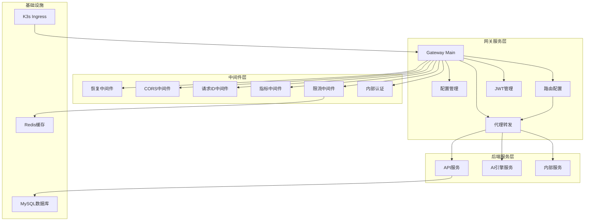

**图表来源**
- [main.go.tmpl:30-67](file://templates/files/backend-gateway/cmd/gateway/main.go.tmpl#L30-L67)
- [routes.go.tmpl:21-56](file://templates/files/backend-gateway/internal/router/routes.go.tmpl#L21-L56)

**章节来源**
- [main.go.tmpl:1-92](file://templates/files/backend-gateway/cmd/gateway/main.go.tmpl#L1-L92)
- [config.go.tmpl:1-127](file://templates/files/backend-gateway/internal/config/config.go.tmpl#L1-L127)

## 核心组件

### 1. 网关入口与中间件链

网关采用严格的中间件执行顺序，确保每个请求都能得到适当的处理：

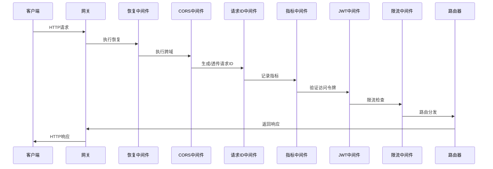

**图表来源**
- [main.go.tmpl:48-61](file://templates/files/backend-gateway/cmd/gateway/main.go.tmpl#L48-L61)

### 2. 配置管理系统

网关通过环境变量驱动配置，支持灵活的服务部署和环境切换：

| 配置类别 | 关键参数 | 默认值 | 用途 |
|---------|---------|--------|------|
| 服务器配置 | GATEWAY_PORT | 8080 | 网关监听端口 |
| JWT配置 | JWT_SECRET | 必需 | JWT签名密钥 |
| 限流配置 | REDIS_HOST/PORT/PASSWORD/DB | localhost:6379 | Redis连接 |
| 服务路由 | API_SERVICE_URL | http://localhost:8081 | API服务地址 |
| 服务路由 | AI_ENGINE_SERVICE_URL | http://localhost:8082 | AI引擎地址 |
| CORS配置 | CORS_ORIGINS | http://localhost:3000,http://localhost:8080 | 允许的源 |

**章节来源**
- [config.go.tmpl:52-86](file://templates/files/backend-gateway/internal/config/config.go.tmpl#L52-L86)

### 3. 路由转发机制

网关实现了智能路由转发，根据不同路径将请求分发到相应的后端服务：

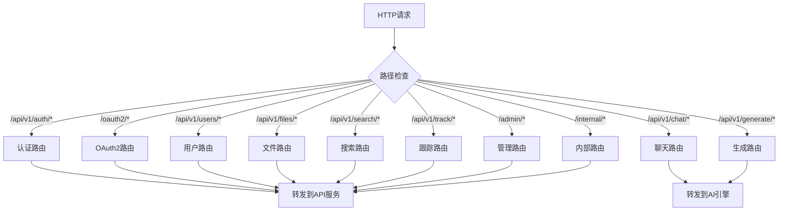

**图表来源**
- [routes.go.tmpl:28-56](file://templates/files/backend-gateway/internal/router/routes.go.tmpl#L28-L56)

**章节来源**
- [routes.go.tmpl:1-57](file://templates/files/backend-gateway/internal/router/routes.go.tmpl#L1-L57)

## 架构概览

### 系统架构图

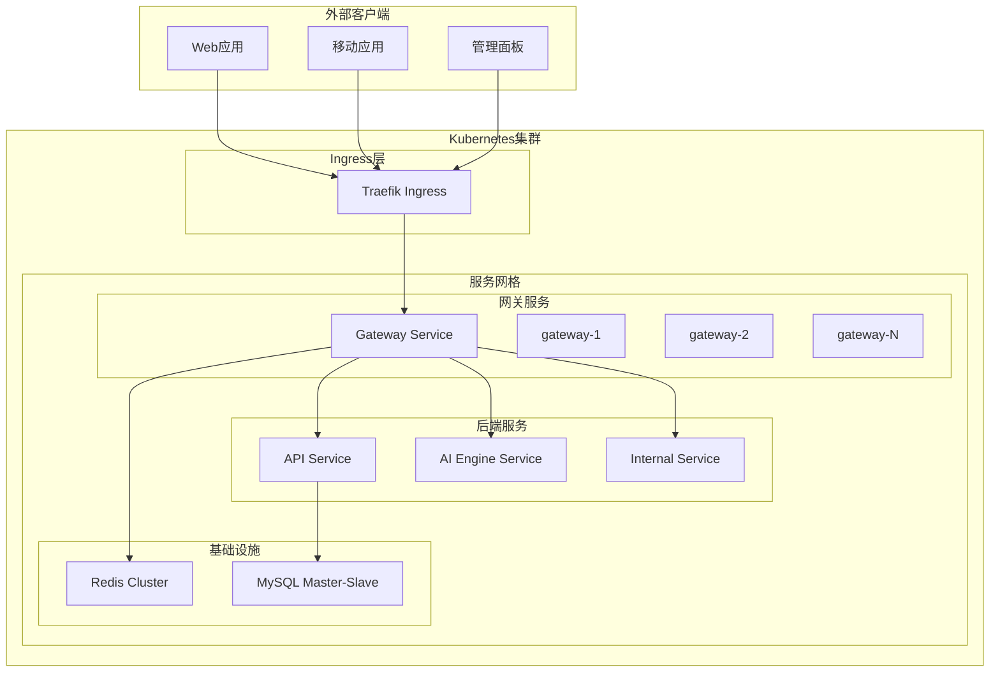

**图表来源**
- [services.yaml.tmpl:8-45](file://templates/files/deploy/k3s/services.yaml.tmpl#L8-L45)

### 数据流处理

网关的数据流处理遵循以下模式：

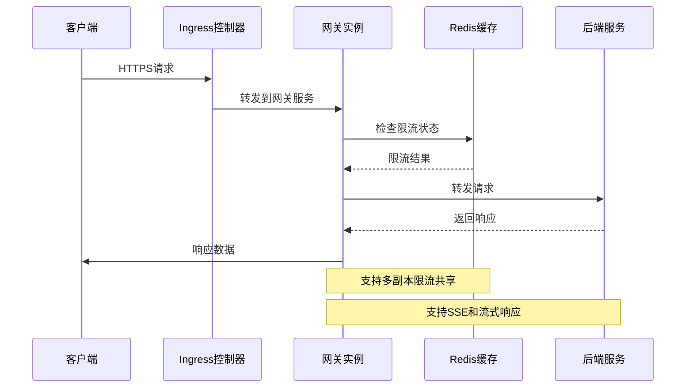

**图表来源**
- [proxy.go.tmpl:26-66](file://templates/files/backend-gateway/internal/proxy/proxy.go.tmpl#L26-L66)

## 详细组件分析

### JWT认证管理器

JWT认证管理器实现了完整的令牌生命周期管理，包括令牌签发、验证和过期处理：

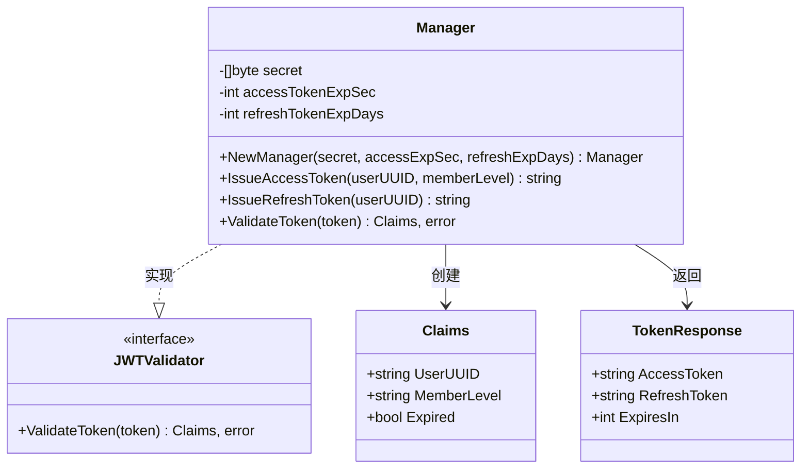

**图表来源**
- [jwt.go.tmpl:16-37](file://templates/files/backend-gateway/pkg/jwt/jwt.go.tmpl#L16-L37)
- [jwt.go.tmpl:68-87](file://templates/files/backend-gateway/pkg/jwt/jwt.go.tmpl#L68-L87)

#### JWT令牌流程

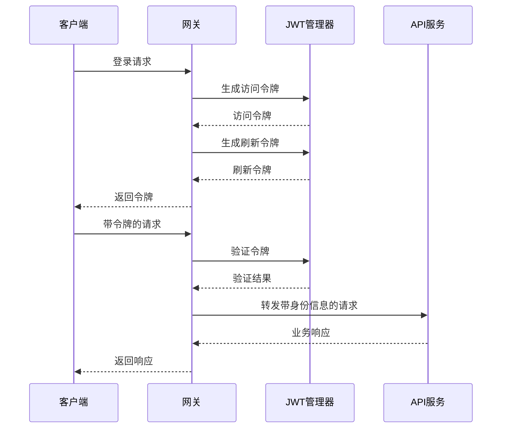

**图表来源**
- [jwt.go.tmpl:39-66](file://templates/files/backend-gateway/pkg/jwt/jwt.go.tmpl#L39-L66)
- [middleware.go.tmpl:124-163](file://templates/files/pkg-platform-core/middleware/middleware.go.tmpl#L124-L163)

**章节来源**
- [jwt.go.tmpl:1-88](file://templates/files/backend-gateway/pkg/jwt/jwt.go.tmpl#L1-L88)

### 请求代理与转发

代理组件提供了高性能的请求转发功能，支持多种响应类型和流式传输：

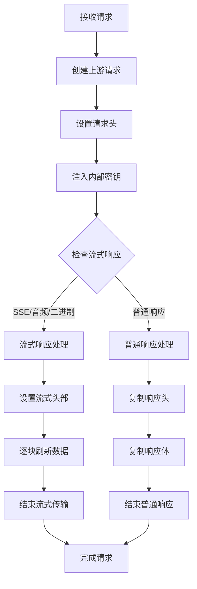

**图表来源**
- [proxy.go.tmpl:26-66](file://templates/files/backend-gateway/internal/proxy/proxy.go.tmpl#L26-L66)
- [proxy.go.tmpl:68-96](file://templates/files/backend-gateway/internal/proxy/proxy.go.tmpl#L68-L96)

#### 代理配置参数

| 参数名称 | 类型 | 默认值 | 描述 |
|---------|------|--------|------|
| Timeout | Duration | 120秒 | 上游请求超时时间 |
| MaxIdleConns | int | 200 | 最大空闲连接数 |
| MaxIdleConnsPerHost | int | 50 | 每个主机的最大空闲连接 |
| IdleConnTimeout | Duration | 90秒 | 空闲连接超时时间 |
| CheckRedirect | func | 返回最后响应 | 重定向处理策略 |

**章节来源**
- [proxy.go.tmpl:1-97](file://templates/files/backend-gateway/internal/proxy/proxy.go.tmpl#L1-L97)

### 中间件系统

网关实现了完整的中间件生态系统，每个中间件都有明确的职责分工：

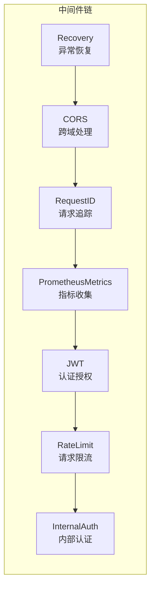

**图表来源**
- [main.go.tmpl:48-59](file://templates/files/backend-gateway/cmd/gateway/main.go.tmpl#L48-L59)

#### 中间件功能详解

1. **恢复中间件 (Recovery)**：捕获panic异常，防止服务崩溃
2. **CORS中间件**：处理跨域请求，支持凭据传递
3. **请求ID中间件**：生成和透传全局请求ID
4. **指标中间件**：收集HTTP请求统计信息
5. **JWT中间件**：验证访问令牌并注入用户身份
6. **限流中间件**：基于Redis实现固定窗口限流
7. **内部认证中间件**：验证网关间的内部通信

**章节来源**
- [middleware.go.tmpl:1-202](file://templates/files/pkg-platform-core/middleware/middleware.go.tmpl#L1-L202)

### 性能监控与指标

网关集成了完整的监控体系，提供多维度的性能指标：

```mermaid
graph TB
subgraph "监控指标"
subgraph "HTTP指标"
RequestsTotal[http_requests_total<br/>总请求数]
RequestDuration[http_request_duration_seconds<br/>请求时延分布]
RequestsInFlight[http_requests_in_flight<br/>并发请求数]
end
subgraph "业务指标"
AuthSuccess[auth_success_count<br/>认证成功次数]
AuthFailure[auth_failure_count<br/>认证失败次数]
ProxyErrors[proxy_error_count<br/>代理错误次数]
RateLimitExceeded[rate_limit_exceeded_count<br/>限流触发次数]
end
subgraph "系统指标"
RedisLatency[redis_latency_ms<br/>Redis延迟]
UpstreamLatency[upstream_latency_ms<br/>上游延迟]
MemoryUsage[memory_usage_bytes<br/>内存使用量]
end
end
subgraph "Prometheus端点"
MetricsEndpoint[/metrics<br/>指标暴露端点]
end
RequestsTotal --> MetricsEndpoint
RequestDuration --> MetricsEndpoint
RequestsInFlight --> MetricsEndpoint
```

**图表来源**
- [ratelimit_metrics.go.tmpl:70-113](file://templates/files/pkg-platform-core/middleware/ratelimit_metrics.go.tmpl#L70-L113)

## 依赖关系分析

### 外部依赖关系

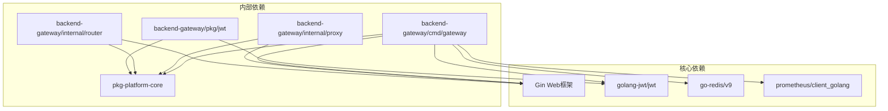

**图表来源**
- [main.go.tmpl:20-27](file://templates/files/backend-gateway/cmd/gateway/main.go.tmpl#L20-L27)

### 内部模块耦合度

网关采用低耦合设计，各模块职责清晰：

| 模块 | 依赖模块 | 耦合程度 | 说明 |
|------|----------|----------|------|
| main.go | config, router, jwt, middleware | 低 | 应用入口，协调各模块 |
| config.go | 环境变量 | 无 | 配置加载，无外部依赖 |
| proxy.go | gin, http | 低 | 代理转发，依赖HTTP客户端 |
| routes.go | proxy, config | 低 | 路由配置，依赖代理组件 |
| jwt.go | jwt/v5, middleware | 中等 | JWT管理，依赖中间件接口 |

**章节来源**
- [main.go.tmpl:1-92](file://templates/files/backend-gateway/cmd/gateway/main.go.tmpl#L1-L92)

## 性能考虑

### 连接池优化

网关使用共享HTTP客户端，通过合理的连接池配置提升性能：

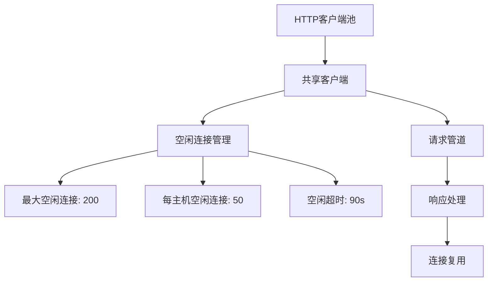

**图表来源**
- [proxy.go.tmpl:13-23](file://templates/files/backend-gateway/internal/proxy/proxy.go.tmpl#L13-L23)

### 缓存策略

网关支持多级缓存策略，减少重复计算和网络请求：

1. **Redis缓存**：分布式缓存，支持多副本共享
2. **内存缓存**：本地缓存，降低Redis压力
3. **连接池缓存**：HTTP连接复用，减少握手开销

### 并发处理

网关采用异步处理模型，支持高并发场景：

- **流式响应**：SSE和长连接支持实时数据传输
- **批量处理**：支持批量请求和响应
- **资源隔离**：不同类型的请求使用独立的处理通道

## 故障排除指南

### 常见问题诊断

#### 1. JWT认证失败

**症状**：返回401未授权或403禁止访问

**排查步骤**：
1. 检查JWT_SECRET环境变量是否正确设置
2. 验证访问令牌格式和有效期
3. 确认刷新令牌是否过期
4. 检查公共路径配置是否正确

**解决方案**：
- 重新生成访问令牌
- 更新JWT密钥配置
- 检查令牌过期时间设置

#### 2. 请求转发失败

**症状**：返回502 Bad Gateway

**排查步骤**：
1. 检查后端服务地址配置
2. 验证内部密钥设置
3. 确认服务健康状态
4. 检查网络连通性

**解决方案**：
- 修复服务地址配置
- 更新内部密钥
- 重启后端服务
- 检查防火墙设置

#### 3. 限流触发

**症状**：返回429 Too Many Requests

**排查步骤**：
1. 检查Redis连接状态
2. 验证限流配置参数
3. 分析用户行为模式
4. 检查限流算法实现

**解决方案**：
- 增加Redis实例
- 调整限流阈值
- 实施用户级别限流
- 添加白名单机制

### 日志记录与调试

网关提供多层次的日志记录：

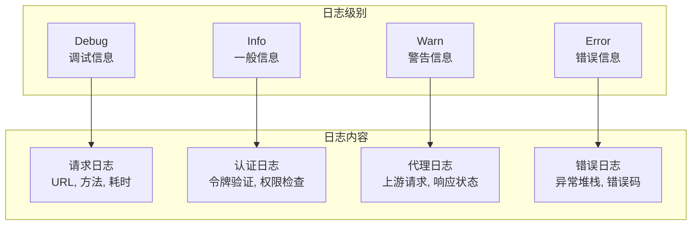

**章节来源**
- [main.go.tmpl:33-44](file://templates/files/backend-gateway/cmd/gateway/main.go.tmpl#L33-L44)

### 监控指标解读

#### 关键指标说明

| 指标名称 | 含义 | 正常范围 | 异常阈值 |
|---------|------|----------|----------|
| http_requests_total | 总请求数 | 持续增长 | 突然下降 |
| http_request_duration_seconds | 请求时延 | < 100ms | > 1s |
| http_requests_in_flight | 并发请求数 | < 100 | > 500 |
| rate_limit_exceeded_count | 限流触发次数 | 0 | > 0 |

#### 性能基准

- **QPS**：单实例支持1000+请求/秒
- **并发连接**：支持10000+并发连接
- **内存使用**：每请求约1KB内存
- **CPU使用**：轻负载<10%，重负载<80%

## 结论

网关代理API提供了一个完整的企业级API网关解决方案，具有以下优势：

### 核心优势

1. **安全性**：完整的JWT认证体系，支持OAuth2协议
2. **可靠性**：多层中间件保护，异常恢复机制
3. **可扩展性**：模块化设计，支持水平扩展
4. **可观测性**：完善的监控指标和日志系统
5. **性能**：优化的连接池和缓存策略

### 最佳实践建议

1. **配置管理**：使用环境变量管理配置，避免硬编码
2. **监控告警**：建立完善的监控告警机制
3. **容量规划**：根据业务量合理配置资源
4. **安全加固**：定期更新JWT密钥，实施最小权限原则
5. **测试验证**：建立完整的测试体系，包括性能测试

### 未来发展方向

1. **智能路由**：引入基于机器学习的流量调度
2. **服务网格**：集成Istio等服务网格技术
3. **可观测性增强**：支持分布式追踪和链路分析
4. **安全强化**：实施更严格的身份认证和授权机制
5. **云原生优化**：更好的Kubernetes集成和自动扩缩容

通过本网关代理API，企业可以构建稳定、安全、高性能的API服务体系，为业务发展提供强有力的技术支撑。