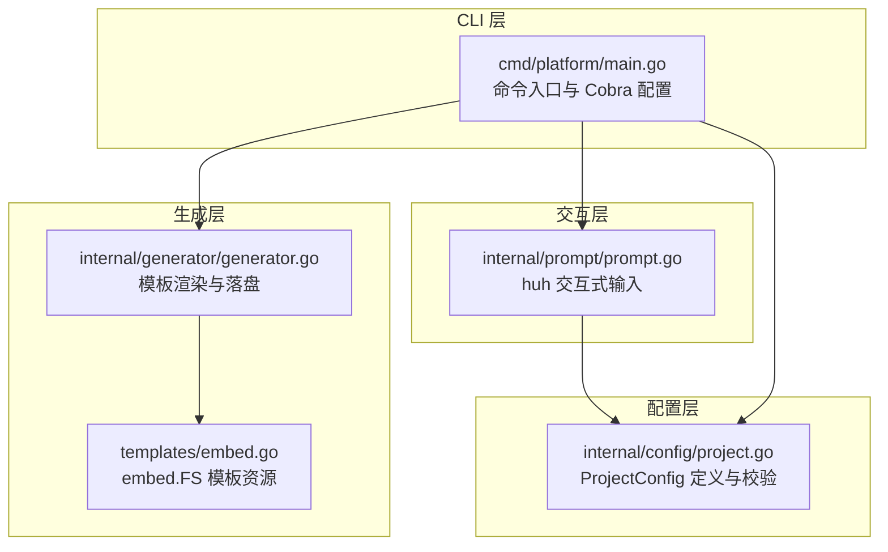
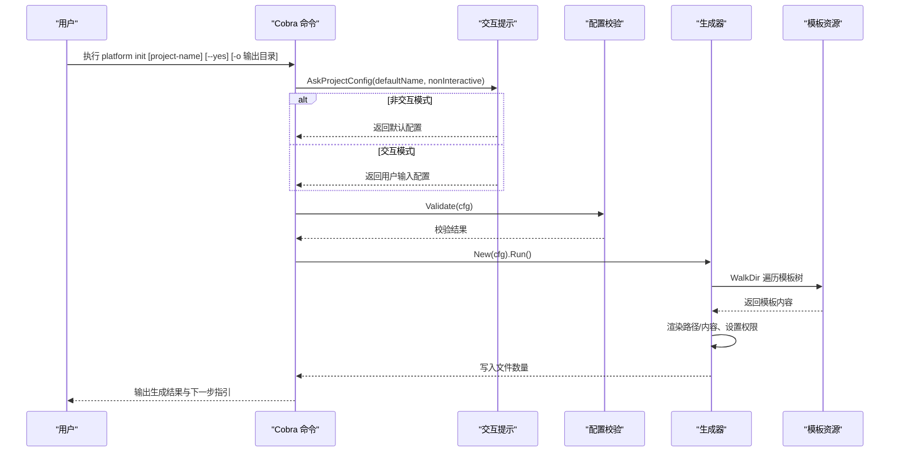
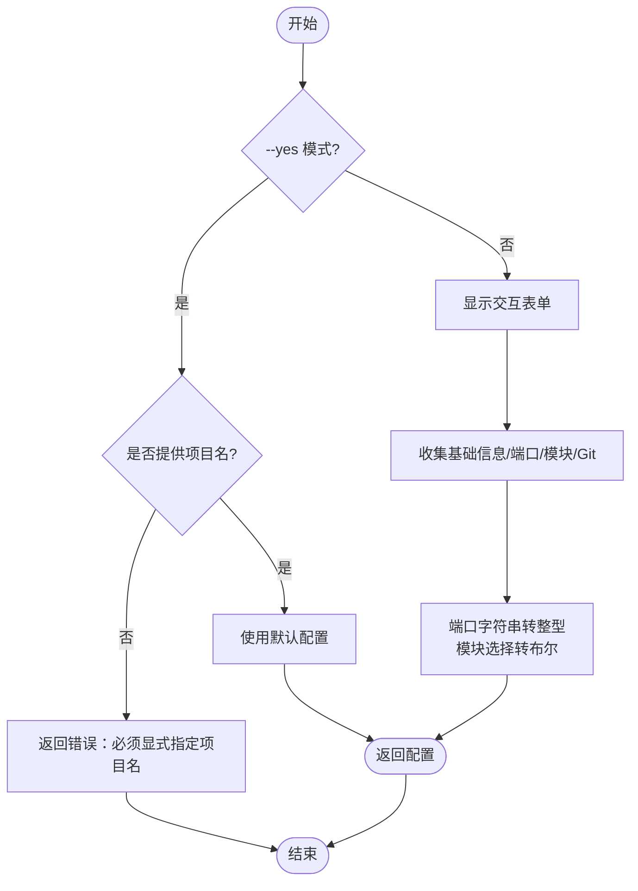
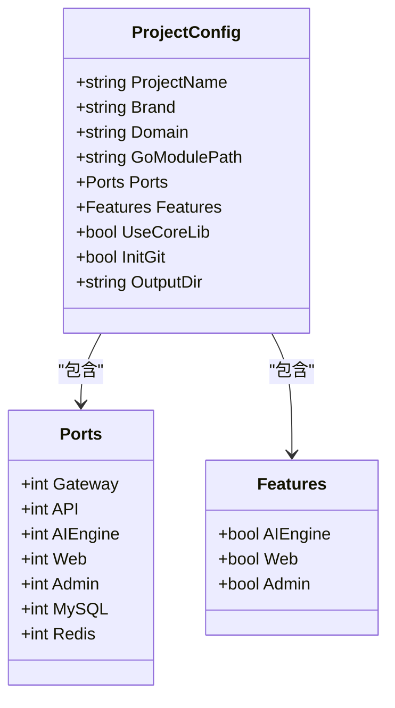
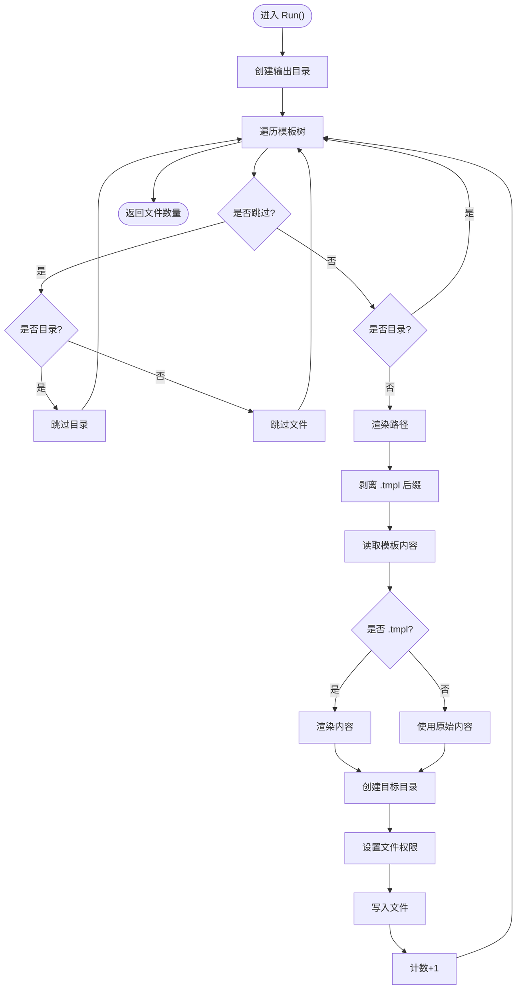
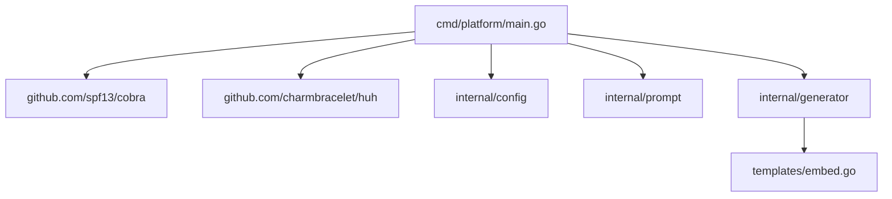

# 命令行工具参考

<cite>
**本文档引用的文件**
- [main.go](file://cmd/platform/main.go)
- [project.go](file://internal/config/project.go)
- [generator.go](file://internal/generator/generator.go)
- [prompt.go](file://internal/prompt/prompt.go)
- [embed.go](file://templates/embed.go)
- [go.mod](file://go.mod)
- [README.md](file://README.md)
- [backend-api/main.go.tmpl](file://templates/files/backend-api/cmd/api/main.go.tmpl)
- [frontend-web/package.json.tmpl](file://templates/files/frontend-web/package.json.tmpl)
- [deploy/local/start.sh.tmpl](file://templates/files/deploy/local/start.sh.tmpl)
</cite>

## 目录
1. [简介](#简介)
2. [项目结构](#项目结构)
3. [核心组件](#核心组件)
4. [架构概览](#架构概览)
5. [详细组件分析](#详细组件分析)
6. [依赖分析](#依赖分析)
7. [性能考虑](#性能考虑)
8. [故障排除指南](#故障排除指南)
9. [结论](#结论)
10. [附录](#附录)

## 简介
本工具是一个基于 Go 语言开发的命令行脚手架，用于快速生成包含「Go 网关 + Go API + Python AI 引擎 + Next.js 前端 + 部署」的微服务项目骨架。通过交互式提示系统收集项目配置，结合模板渲染与文件系统写入，实现一键生成完整项目结构。

## 项目结构
该仓库采用模块化设计，主要分为以下层次：
- CLI 入口：负责命令定义、参数解析与控制流程
- 交互式提示：收集用户输入并构建配置对象
- 配置校验：对用户输入进行格式与业务规则校验
- 模板生成：遍历嵌入模板树，按规则渲染并写入磁盘
- 模板资源：通过 embed.FS 将 templates/files 下的模板内嵌至二进制

**图表来源**
- [main.go:22-38](file://cmd/platform/main.go#L22-L38)
- [prompt.go:13-105](file://internal/prompt/prompt.go#L13-L105)
- [project.go:12-106](file://internal/config/project.go#L12-L106)
- [generator.go:23-103](file://internal/generator/generator.go#L23-L103)
- [embed.go:6-11](file://templates/embed.go#L6-L11)

**章节来源**
- [main.go:1-98](file://cmd/platform/main.go#L1-L98)
- [go.mod:1-37](file://go.mod#L1-L37)

## 核心组件
- 平台命令入口：定义 root 命令、init 子命令与 version 子命令，并集成 Cobra 的命令解析与错误处理。
- 交互式提示系统：使用 huh 构建多组表单，收集项目名、品牌名、域名、Go 模块路径、端口、模块开关与 Git 初始化等配置。
- 配置模型与校验：ProjectConfig 结构体承载所有模板变量，包含端口、特性开关、核心库引用与输出目录等字段；Validate 函数执行格式与业务规则校验。
- 模板生成器：遍历 embed.FS 模板树，按 Features 与 UseCoreLib 决定跳过子树，渲染路径与内容，剥离 .tmpl 后缀，设置执行权限并写入磁盘。

**章节来源**
- [main.go:40-97](file://cmd/platform/main.go#L40-L97)
- [prompt.go:13-105](file://internal/prompt/prompt.go#L13-L105)
- [project.go:12-121](file://internal/config/project.go#L12-L121)
- [generator.go:23-158](file://internal/generator/generator.go#L23-L158)

## 架构概览
下图展示了 CLI 从命令解析到模板生成的整体流程：

**图表来源**
- [main.go:48-81](file://cmd/platform/main.go#L48-L81)
- [prompt.go:14-104](file://internal/prompt/prompt.go#L14-L104)
- [project.go:91-106](file://internal/config/project.go#L91-L106)
- [generator.go:34-103](file://internal/generator/generator.go#L34-L103)
- [embed.go:6-11](file://templates/embed.go#L6-L11)

## 详细组件分析

### 命令与参数详解
- platform init
  - 语法：platform init [project-name] [--yes] [-o 输出目录]
  - 参数说明：
    - project-name：项目名称（可选，默认使用交互式输入）
    - --yes 或 -y：非交互模式，使用默认值生成
    - -o 或 --output：指定输出目录（默认与项目名一致）
  - 行为描述：根据参数决定交互模式，收集配置，执行校验，调用生成器渲染模板并写入磁盘，最后输出下一步操作指引。
  - 使用示例：
    - 交互式：platform init my-app
    - 非交互：platform init my-app --yes
    - 指定输出：platform init my-app -o ./projects/my-app

- platform version
  - 语法：platform version
  - 行为描述：打印当前 CLI 版本信息。

**章节来源**
- [main.go:40-97](file://cmd/platform/main.go#L40-L97)

### 交互式提示系统
- 输入分组：
  - 基础信息组：项目名、品牌名、域名、Go 模块路径
  - 端口组：Gateway、API、AI Engine、Web、Admin 端口
  - 功能组：启用模块（ai-engine、web、admin、core-lib）、初始化 Git 仓库
- 非交互模式限制：当 --yes 模式且未显式提供项目名时，返回错误提示，要求用户提供项目名。
- 数据转换：端口输入字符串转为整型，模块选择转换为布尔开关。

**图表来源**
- [prompt.go:16-21](file://internal/prompt/prompt.go#L16-L21)
- [prompt.go:43-104](file://internal/prompt/prompt.go#L43-L104)

**章节来源**
- [prompt.go:13-131](file://internal/prompt/prompt.go#L13-L131)

### 配置模型与校验
- 配置结构：ProjectConfig 包含项目名、品牌名、域名、Go 模块路径、端口集合、功能开关、核心库引用、Git 初始化与输出目录等字段。
- 默认值：Defaults 函数提供合理的默认值，包括端口、模块开关与核心库引用。
- 校验规则：
  - ProjectName 必须符合 kebab-case 规范
  - Brand 与 GoModulePath 不能为空
  - Gateway 与 API 端口必须大于 0

**图表来源**
- [project.go:13-41](file://internal/config/project.go#L13-L41)
- [project.go:43-52](file://internal/config/project.go#L43-L52)
- [project.go:54-59](file://internal/config/project.go#L54-L59)

**章节来源**
- [project.go:12-121](file://internal/config/project.go#L12-L121)

### 模板生成器
- 模板来源：通过 embed.FS 将 templates/files 下的模板内嵌至二进制，遍历时去除 "files/" 前缀。
- 渲染规则：
  - 路径渲染：若路径包含模板变量则进行渲染，剥离 .tmpl 后缀
  - 内容渲染：以 .tmpl 结尾的文件进行模板渲染，否则直接写入
  - 权限设置：以 .sh 结尾的文件赋予执行权限
- 跳过规则：根据 Features 与 UseCoreLib 决定是否跳过对应模板子树
- 错误处理：对渲染失败、写入失败等情况返回详细错误信息

**图表来源**
- [generator.go:34-103](file://internal/generator/generator.go#L34-L103)
- [generator.go:105-120](file://internal/generator/generator.go#L105-L120)
- [generator.go:122-147](file://internal/generator/generator.go#L122-L147)
- [embed.go:6-11](file://templates/embed.go#L6-L11)

**章节来源**
- [generator.go:23-158](file://internal/generator/generator.go#L23-L158)
- [embed.go:1-12](file://templates/embed.go#L1-L12)

### 常见使用模式与最佳实践
- 快速初始化：platform init <项目名>，随后根据提示完成交互
- CI/CD 自动化：platform init <项目名> --yes，避免交互阻塞流水线
- 自定义输出目录：platform init <项目名> -o <路径>，便于组织多项目
- 按需启用模块：通过交互式选择关闭不需要的模块（如 AI Engine、Web、Admin），减少生成文件数量
- 核心库复用：启用 core-lib 可引入 pkg-platform-core 公共组件库，提升一致性

**章节来源**
- [main.go:48-81](file://cmd/platform/main.go#L48-L81)
- [prompt.go:73-87](file://internal/prompt/prompt.go#L73-L87)
- [project.go:61-89](file://internal/config/project.go#L61-L89)

## 依赖分析
- 外部依赖：
  - spf13/cobra：命令行框架，负责命令定义与参数解析
  - charmbracelet/huh：交互式 TUI，用于构建表单与收集用户输入
- 内部模块：
  - internal/config：配置模型与校验
  - internal/prompt：交互式提示系统
  - internal/generator：模板渲染与文件写入
  - templates：嵌入式模板资源

**图表来源**
- [go.mod:5-8](file://go.mod#L5-L8)
- [main.go:9-18](file://cmd/platform/main.go#L9-L18)
- [generator.go:10-21](file://internal/generator/generator.go#L10-L21)

**章节来源**
- [go.mod:1-37](file://go.mod#L1-L37)

## 性能考虑
- 模板内嵌：通过 embed.FS 将模板内嵌至二进制，避免运行时文件系统访问，提升启动与渲染效率
- 路径渲染优化：仅对包含模板变量的路径进行渲染，减少不必要的计算
- 权限设置：仅对 .sh 文件设置执行权限，避免频繁系统调用
- 并发安全：当前实现为顺序遍历与渲染，适合中小型模板集；大规模模板建议评估并发渲染策略

## 故障排除指南
- 非交互模式缺少项目名：--yes 模式必须显式提供项目名，否则返回错误提示
- 配置校验失败：
  - ProjectName 不符合 kebab-case 规范
  - Brand 或 GoModulePath 为空
  - Gateway 或 API 端口小于等于 0
- 生成失败：
  - 模板渲染失败：检查模板中使用的变量是否在 ProjectConfig 中定义
  - 文件写入失败：确认输出目录权限与磁盘空间
- 端口冲突：启动本地开发环境前，确保指定端口未被占用
- 模块未启用：若关闭了 AI Engine/Web/Admin，相关模板不会生成，需手动启用以获得完整功能

**章节来源**
- [prompt.go:16-21](file://internal/prompt/prompt.go#L16-L21)
- [project.go:91-106](file://internal/config/project.go#L91-L106)
- [generator.go:64-85](file://internal/generator/generator.go#L64-L85)
- [deploy/local/start.sh.tmpl:60-66](file://templates/files/deploy/local/start.sh.tmpl#L60-L66)

## 结论
本 CLI 工具通过清晰的命令结构、直观的交互提示与严谨的配置校验，实现了从零到一的微服务项目骨架生成。其模块化设计便于扩展与维护，模板内嵌机制提升了可移植性与性能。遵循本文档的使用模式与最佳实践，开发者可以高效地创建符合规范的项目结构，并快速进入开发阶段。

## 附录

### 命令语法速查
- platform init [project-name] [--yes] [-o 输出目录]
- platform version

**章节来源**
- [main.go:40-97](file://cmd/platform/main.go#L40-L97)

### 生成的项目结构示例（基于模板）
- backend-gateway：Go Gin 网关（JWT/限流/CORS/proxy）
- backend-api：Go API（handler→service→repository）
- backend-ai-engine：Python FastAPI（AI 编排，只读）
- frontend-web：Next.js 15 App Router
- frontend-admin：Vite + React 19 后台
- pkg-platform-core：通用组件库（errcode/lock/cache/crypto/middleware）
- deploy/local：docker-compose + start.sh
- deploy/k3s：K3s manifests + 部署脚本
- database：初始化 SQL
- README.md / CLAUDE.md / .gitignore

**章节来源**
- [README.md:30-42](file://README.md#L30-L42)

### 关键模板变量说明
- ProjectName：项目名（kebab-case），用于目录名、Docker 服务名、K8s 命名空间
- Brand：展示用品牌名，用于 README、UI 标题等
- Domain：服务域名，用于 CORS 白名单与 Cookie domain
- GoModulePath：Go 服务的 module 路径前缀
- Ports：各服务监听端口（Gateway、API、AIEngine、Web、Admin、MySQL、Redis）
- Features：模块开关（AIEngine、Web、Admin）
- UseCoreLib：是否引用 pkg-platform-core
- InitGit：生成完成后是否执行 git init
- OutputDir：实际写入的目标目录

**章节来源**
- [project.go:13-41](file://internal/config/project.go#L13-L41)
- [project.go:43-59](file://internal/config/project.go#L43-L59)
- [project.go:61-89](file://internal/config/project.go#L61-L89)