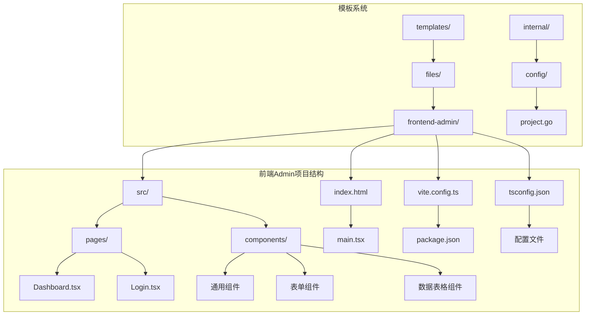
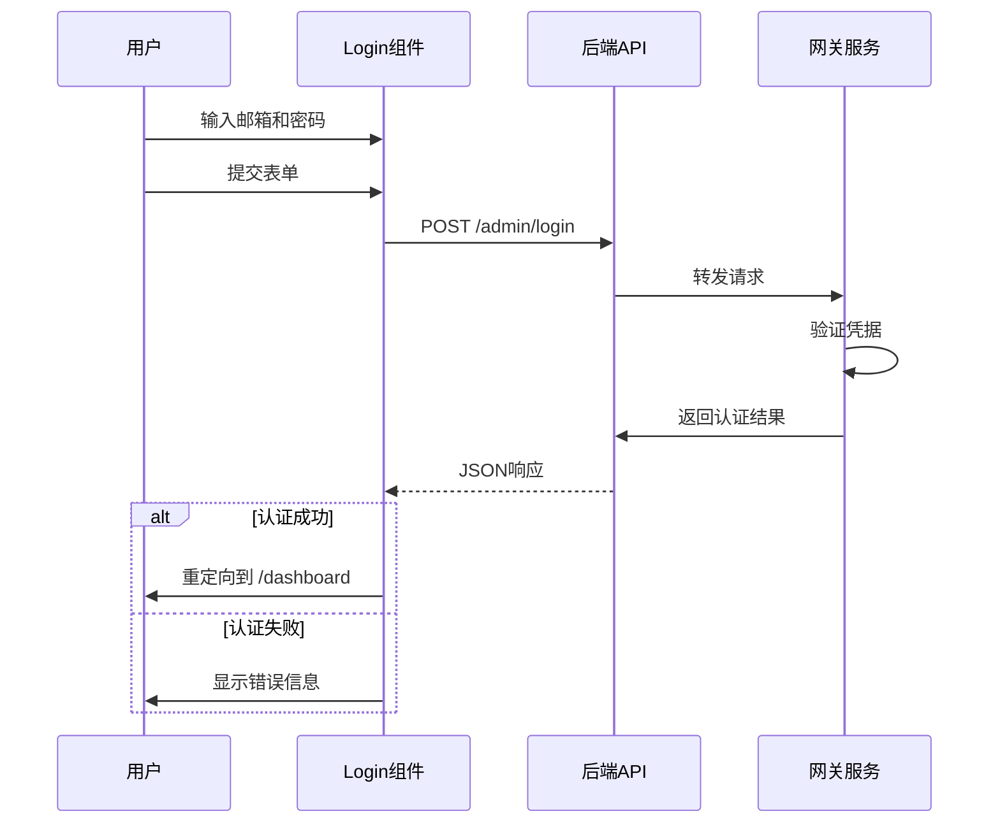
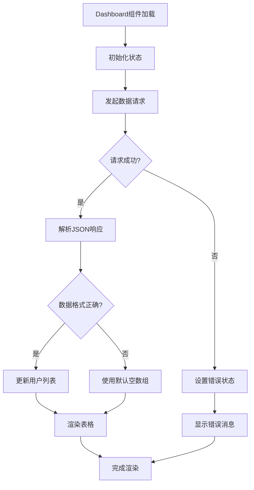
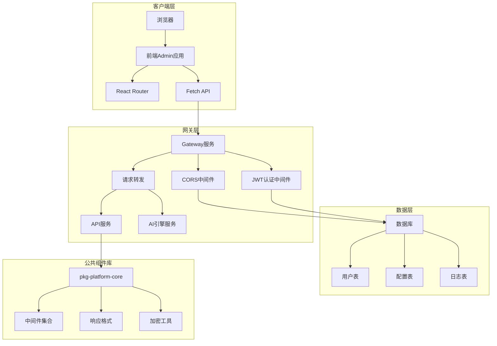
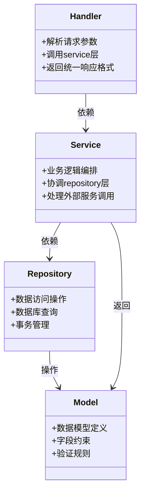
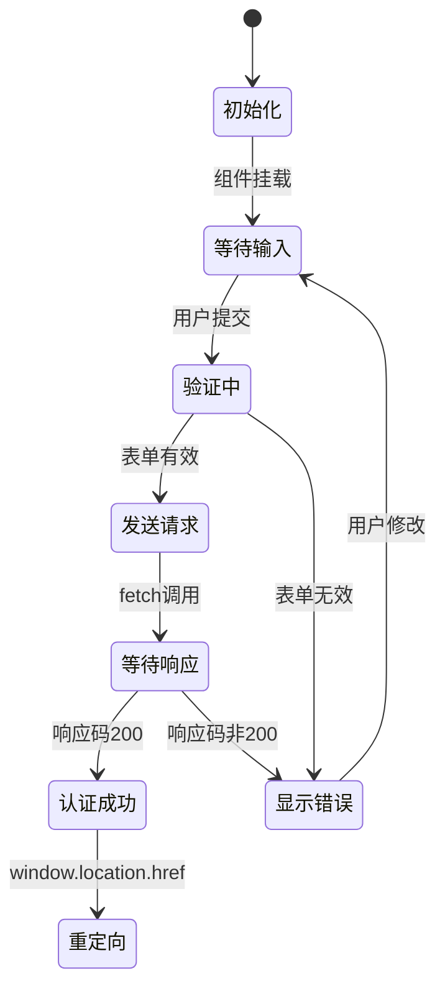
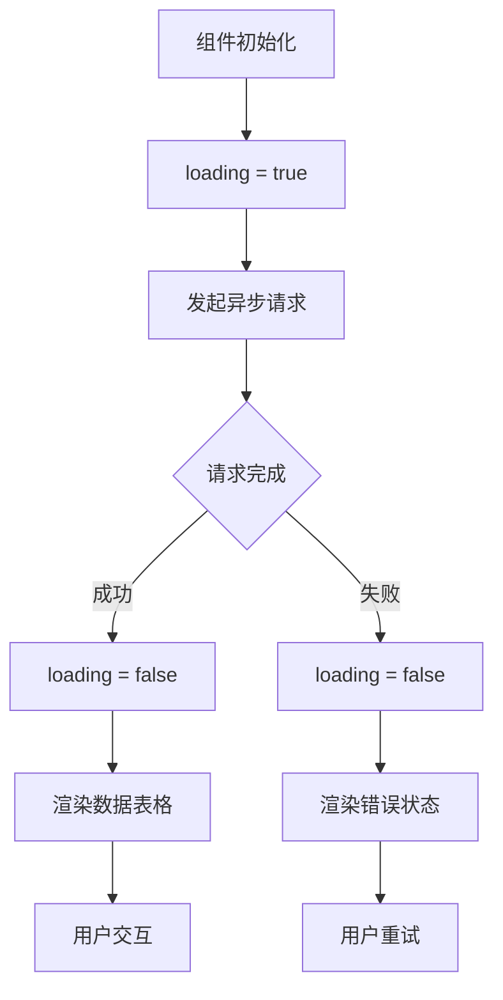
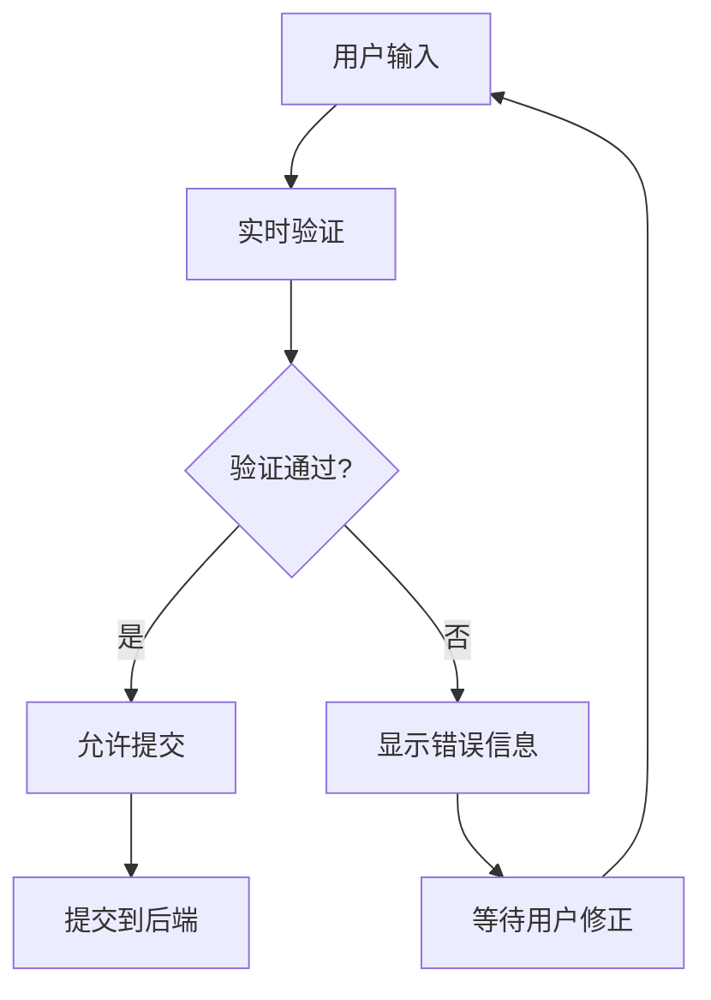
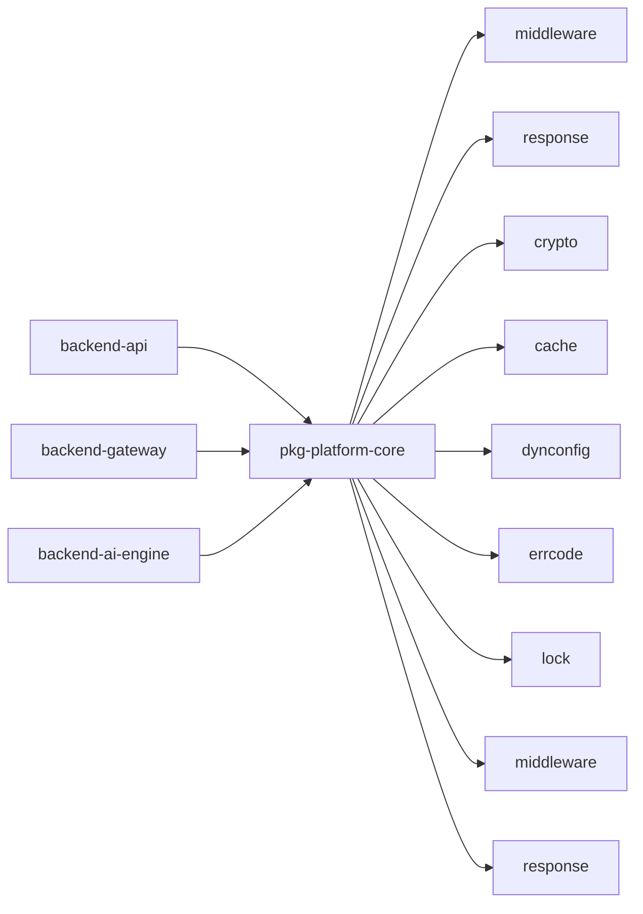

# 前端Admin管理界面

<cite>
**本文档引用的文件**
- [main.tsx](file://templates/files/frontend-admin/src/main.tsx)
- [Dashboard.tsx.tmpl](file://templates/files/frontend-admin/src/pages/Dashboard.tsx.tmpl)
- [Login.tsx.tmpl](file://templates/files/frontend-admin/src/pages/Login.tsx.tmpl)
- [index.html.tmpl](file://templates/files/frontend-admin/index.html.tmpl)
- [package.json.tmpl](file://templates/files/frontend-admin/package.json.tmpl)
- [vite.config.ts.tmpl](file://templates/files/frontend-admin/vite.config.ts.tmpl)
- [tsconfig.json](file://templates/files/frontend-admin/tsconfig.json)
- [project.go](file://internal/config/project.go)
- [prompt.go](file://internal/prompt/prompt.go)
- [routes.go.tmpl](file://templates/files/backend-gateway/internal/router/routes.go.tmpl)
- [middleware.md](file://templates/files/pkg-platform-core/docs/middleware.md)
- [user.go.tmpl](file://templates/files/backend-api/internal/handler/user.go.tmpl)
- [user.go.tmpl](file://templates/files/backend-api/internal/service/user.go.tmpl)
- [user_repo.go.tmpl](file://templates/files/backend-api/internal/repository/user_repo.go.tmpl)
</cite>

## 目录
1. [简介](#简介)
2. [项目结构](#项目结构)
3. [核心组件](#核心组件)
4. [架构概览](#架构概览)
5. [详细组件分析](#详细组件分析)
6. [依赖关系分析](#依赖关系分析)
7. [性能考虑](#性能考虑)
8. [故障排除指南](#故障排除指南)
9. [结论](#结论)
10. [附录](#附录)

## 简介

本项目是一个基于React Admin的管理面板脚手架，采用现代化的前端技术栈构建。该系统提供了完整的管理员界面，包括登录认证、仪表盘展示、用户管理等功能模块。项目采用模板化生成方式，支持高度定制化的配置选项，能够快速搭建企业级管理后台。

系统的核心特点包括：
- 基于React 19和TypeScript的现代前端架构
- Vite构建工具提供快速开发体验
- 内置路由管理和状态管理
- 与后端网关服务的无缝集成
- 支持响应式设计和移动端适配

## 项目结构

前端Admin管理界面采用清晰的分层架构，主要包含以下核心目录和文件：



**图表来源**
- [main.tsx:1-18](file://templates/files/frontend-admin/src/main.tsx#L1-L18)
- [index.html.tmpl:1-13](file://templates/files/frontend-admin/index.html.tmpl#L1-L13)
- [vite.config.ts.tmpl:1-14](file://templates/files/frontend-admin/vite.config.ts.tmpl#L1-L14)

**章节来源**
- [main.tsx:1-18](file://templates/files/frontend-admin/src/main.tsx#L1-L18)
- [index.html.tmpl:1-13](file://templates/files/frontend-admin/index.html.tmpl#L1-L13)
- [package.json.tmpl:1-24](file://templates/files/frontend-admin/package.json.tmpl#L1-L24)
- [vite.config.ts.tmpl:1-14](file://templates/files/frontend-admin/vite.config.ts.tmpl#L1-L14)
- [tsconfig.json:1-21](file://templates/files/frontend-admin/tsconfig.json#L1-L21)

## 核心组件

### 路由系统

应用采用React Router进行页面路由管理，支持基础的导航功能和重定向机制：

```mermaid
flowchart TD
A[根路由 /] --> B[重定向到 /dashboard]
C[/login 登录页] --> D[用户认证]
E[/dashboard 仪表盘] --> F[用户数据展示]
D --> G{认证成功?}
G --> |是| H[跳转到 /dashboard]
G --> |否| I[显示错误信息]
F --> J[加载用户数据]
J --> K[渲染表格]
```

**图表来源**
- [main.tsx:10-15](file://templates/files/frontend-admin/src/main.tsx#L10-L15)

### 登录组件

登录页面实现了基础的身份验证功能，支持邮箱和密码输入，并通过fetch API与后端进行通信：



**图表来源**
- [Login.tsx.tmpl:8-23](file://templates/files/frontend-admin/src/pages/Login.tsx.tmpl#L8-L23)
- [routes.go.tmpl:9-9](file://templates/files/backend-gateway/internal/router/routes.go.tmpl#L9-L9)

### 仪表盘组件

仪表盘页面负责展示用户数据，采用异步数据加载和表格渲染机制：



**图表来源**
- [Dashboard.tsx.tmpl:14-24](file://templates/files/frontend-admin/src/pages/Dashboard.tsx.tmpl#L14-L24)

**章节来源**
- [main.tsx:1-18](file://templates/files/frontend-admin/src/main.tsx#L1-L18)
- [Login.tsx.tmpl:1-63](file://templates/files/frontend-admin/src/pages/Login.tsx.tmpl#L1-L63)
- [Dashboard.tsx.tmpl:1-59](file://templates/files/frontend-admin/src/pages/Dashboard.tsx.tmpl#L1-L59)

## 架构概览

整个系统采用前后端分离的微服务架构，前端Admin管理界面通过网关服务与后端API进行通信：



**图表来源**
- [routes.go.tmpl:1-34](file://templates/files/backend-gateway/internal/router/routes.go.tmpl#L1-L34)
- [middleware.md:1-118](file://templates/files/pkg-platform-core/docs/middleware.md#L1-L118)

### 后端服务架构

后端采用三层架构设计，确保代码的可维护性和可扩展性：



**图表来源**
- [user.go.tmpl:1-47](file://templates/files/backend-api/internal/handler/user.go.tmpl#L1-L47)
- [user.go.tmpl:1-38](file://templates/files/backend-api/internal/service/user.go.tmpl#L1-L38)
- [user_repo.go.tmpl:1-55](file://templates/files/backend-api/internal/repository/user_repo.go.tmpl#L1-L55)

**章节来源**
- [routes.go.tmpl:1-34](file://templates/files/backend-gateway/internal/router/routes.go.tmpl#L1-L34)
- [middleware.md:1-118](file://templates/files/pkg-platform-core/docs/middleware.md#L1-L118)
- [user.go.tmpl:1-47](file://templates/files/backend-api/internal/handler/user.go.tmpl#L1-L47)
- [user.go.tmpl:1-38](file://templates/files/backend-api/internal/service/user.go.tmpl#L1-L38)
- [user_repo.go.tmpl:1-55](file://templates/files/backend-api/internal/repository/user_repo.go.tmpl#L1-L55)

## 详细组件分析

### 登录认证流程

登录组件实现了完整的身份验证流程，包括表单验证、网络请求和错误处理：

#### 表单组件设计

登录表单采用受控组件模式，使用React的状态管理来处理用户输入：



**图表来源**
- [Login.tsx.tmpl:8-23](file://templates/files/frontend-admin/src/pages/Login.tsx.tmpl#L8-L23)

#### 安全机制

系统采用了多层安全防护措施：

1. **CORS配置**：网关服务配置了严格的跨域策略，只允许指定的源进行访问
2. **凭证传输**：使用`credentials: "include"`确保Cookie在跨域请求中正确传输
3. **中间件链**：网关服务执行完整的中间件链，包括JWT验证和速率限制
4. **请求头注入**：成功认证后，网关会向下游服务注入用户身份信息

**章节来源**
- [Login.tsx.tmpl:1-63](file://templates/files/frontend-admin/src/pages/Login.tsx.tmpl#L1-L63)
- [routes.go.tmpl:1-34](file://templates/files/backend-gateway/internal/router/routes.go.tmpl#L1-L34)
- [middleware.md:1-118](file://templates/files/pkg-platform-core/docs/middleware.md#L1-L118)

### 仪表盘数据可视化

仪表盘组件展示了用户管理的核心功能，采用表格形式呈现用户信息：

#### 数据模型设计

用户数据模型包含了必要的字段信息：

| 字段名 | 类型 | 描述 | 必填 |
|--------|------|------|------|
| uuid | string | 用户唯一标识符 | 是 |
| email | string | 用户邮箱地址 | 是 |
| nickname | string | 用户昵称 | 否 |
| memberLevel | string | 会员等级 | 是 |

#### 加载状态管理

仪表盘实现了完整的加载状态管理机制：



**图表来源**
- [Dashboard.tsx.tmpl:14-24](file://templates/files/frontend-admin/src/pages/Dashboard.tsx.tmpl#L14-L24)

**章节来源**
- [Dashboard.tsx.tmpl:1-59](file://templates/files/frontend-admin/src/pages/Dashboard.tsx.tmpl#L1-L59)

### 路由配置与权限控制

应用的路由系统支持基本的权限控制和页面导航：

#### 路由配置

```mermaid
graph LR
A[根路由 /] --> B[重定向到 /dashboard]
C[/login] --> D[登录页面]
E[/dashboard] --> F[仪表盘页面]
subgraph "权限控制"
G[未认证用户] --> H[强制跳转到 /login]
I[已认证用户] --> J[正常访问]
end
H --> D
J --> F
```

**图表来源**
- [main.tsx:10-15](file://templates/files/frontend-admin/src/main.tsx#L10-L15)

#### 权限控制最佳实践

虽然当前版本的前端Admin只包含两个页面，但可以轻松扩展权限控制机制：

1. **路由级别保护**：为每个受保护的路由添加认证检查
2. **组件级别保护**：在组件内部进行权限验证
3. **功能级别保护**：根据用户角色动态显示功能按钮
4. **数据级别保护**：在API层面进行数据访问控制

**章节来源**
- [main.tsx:1-18](file://templates/files/frontend-admin/src/main.tsx#L1-L18)

### 表单组件开发

系统提供了基础的表单组件开发框架，支持常见的CRUD操作：

#### 表单验证

表单组件实现了基本的验证功能：



#### CRUD操作实现

虽然当前版本主要展示用户列表，但可以轻松扩展CRUD功能：

1. **创建操作**：添加新的用户记录
2. **读取操作**：展示用户列表和详情
3. **更新操作**：编辑现有用户信息
4. **删除操作**：移除用户记录

**章节来源**
- [Login.tsx.tmpl:1-63](file://templates/files/frontend-admin/src/pages/Login.tsx.tmpl#L1-L63)
- [Dashboard.tsx.tmpl:1-59](file://templates/files/frontend-admin/src/pages/Dashboard.tsx.tmpl#L1-L59)

## 依赖关系分析

### 前端依赖

前端项目采用现代化的技术栈，主要依赖包括：

```mermaid
graph TB
subgraph "核心依赖"
A[react ^19.0.0] --> B[React核心库]
C[react-dom ^19.0.0] --> D[DOM操作]
E[react-router-dom ^6.27.0] --> F[路由管理]
end
subgraph "开发依赖"
G[@types/react ^19] --> H[类型定义]
I[@types/react-dom ^19] --> J[DOM类型]
K[@vitejs/plugin-react ^4.3.3] --> L[Vite插件]
M[typescript ^5.6.0] --> N[类型检查]
O[vite ^5.4.10] --> P[构建工具]
end
subgraph "构建配置"
Q[vite.config.ts] --> R[代理配置]
S[tsconfig.json] --> T[编译选项]
U[package.json] --> V[脚本命令]
end
```

**图表来源**
- [package.json.tmpl:11-22](file://templates/files/frontend-admin/package.json.tmpl#L11-L22)
- [vite.config.ts.tmpl:1-14](file://templates/files/frontend-admin/vite.config.ts.tmpl#L1-L14)
- [tsconfig.json:2-18](file://templates/files/frontend-admin/tsconfig.json#L2-L18)

### 后端依赖

后端服务依赖于公共组件库，提供了统一的中间件和工具函数：



**图表来源**
- [middleware.md:1-118](file://templates/files/pkg-platform-core/docs/middleware.md#L1-L118)

**章节来源**
- [package.json.tmpl:1-24](file://templates/files/frontend-admin/package.json.tmpl#L1-L24)
- [vite.config.ts.tmpl:1-14](file://templates/files/frontend-admin/vite.config.ts.tmpl#L1-L14)
- [tsconfig.json:1-21](file://templates/files/frontend-admin/tsconfig.json#L1-L21)
- [middleware.md:1-118](file://templates/files/pkg-platform-core/docs/middleware.md#L1-L118)

## 性能考虑

### 构建优化

Vite提供了快速的开发体验和高效的生产构建：

1. **Tree Shaking**：自动移除未使用的代码
2. **代码分割**：按需加载模块
3. **预构建依赖**：加速开发服务器启动
4. **热模块替换**：提升开发效率

### 运行时优化

前端应用采用了多项性能优化策略：

1. **懒加载**：大型组件按需加载
2. **虚拟滚动**：大数据量表格的性能优化
3. **缓存策略**：合理使用浏览器缓存
4. **资源压缩**：生产环境自动压缩静态资源

### 网络优化

通过网关服务实现的请求优化：

1. **请求合并**：减少HTTP请求数量
2. **缓存穿透**：防止重复请求相同数据
3. **超时控制**：避免长时间阻塞
4. **重试机制**：提高请求成功率

## 故障排除指南

### 常见问题诊断

#### 登录失败问题

当用户遇到登录失败时，可以按照以下步骤进行排查：

1. **检查网络连接**：确认前端能够访问网关服务
2. **验证凭据格式**：确保邮箱和密码格式正确
3. **查看浏览器控制台**：检查是否有JavaScript错误
4. **检查CORS配置**：确认跨域请求被正确处理

#### 数据加载问题

如果仪表盘无法加载用户数据：

1. **检查API端点**：确认`/admin/users`端点可用
2. **验证认证状态**：确认用户已成功登录
3. **查看响应格式**：检查后端返回的数据格式
4. **检查网络代理**：确认Vite代理配置正确

#### 构建问题

开发环境中遇到构建问题：

1. **清理缓存**：删除node_modules和dist目录
2. **重新安装依赖**：执行npm install
3. **检查TypeScript配置**：确认tsconfig.json正确
4. **查看Vite配置**：确认vite.config.ts正确

**章节来源**
- [Login.tsx.tmpl:1-63](file://templates/files/frontend-admin/src/pages/Login.tsx.tmpl#L1-L63)
- [Dashboard.tsx.tmpl:1-59](file://templates/files/frontend-admin/src/pages/Dashboard.tsx.tmpl#L1-L59)
- [vite.config.ts.tmpl:1-14](file://templates/files/frontend-admin/vite.config.ts.tmpl#L1-L14)

## 结论

前端Admin管理界面项目提供了一个完整的企业级管理后台解决方案。通过采用现代化的前端技术和清晰的架构设计，系统具备了良好的可扩展性和可维护性。

### 主要优势

1. **技术先进**：采用React 19、TypeScript和Vite等最新技术
2. **架构清晰**：前后端分离，职责明确
3. **安全可靠**：内置多层安全防护机制
4. **易于扩展**：模块化设计支持功能扩展
5. **开发友好**：完善的开发工具链和构建配置

### 改进建议

1. **增强用户体验**：添加更多的交互反馈和动画效果
2. **完善权限系统**：实现更细粒度的权限控制
3. **数据可视化**：集成图表库提供更好的数据展示
4. **国际化支持**：添加多语言支持功能
5. **测试覆盖**：增加单元测试和集成测试

该项目为后续的功能扩展奠定了坚实的基础，可以根据具体需求进行定制化开发。

## 附录

### 配置选项

系统支持多种配置选项，可以通过模板变量进行定制：

| 配置项 | 默认值 | 描述 |
|--------|--------|------|
| ProjectName | my-app | 项目名称（kebab-case） |
| Brand | MyApp | 品牌名称 |
| Domain | myapp.ai | 服务域名 |
| Gateway端口 | 8080 | 网关服务端口 |
| API端口 | 8001 | API服务端口 |
| Admin端口 | 5174 | 管理界面端口 |
| Web端口 | 3000 | Web前端端口 |

### 开发指南

#### 环境要求

- Node.js 16+
- npm 8+
- Git

#### 快速开始

```bash
# 安装依赖
npm install

# 开发模式
npm run dev

# 生产构建
npm run build

# 预览构建
npm run preview
```

#### 代码规范

- 使用TypeScript编写代码
- 遵循React Hooks最佳实践
- 使用语义化HTML标签
- 添加适当的CSS类名
- 编写单元测试