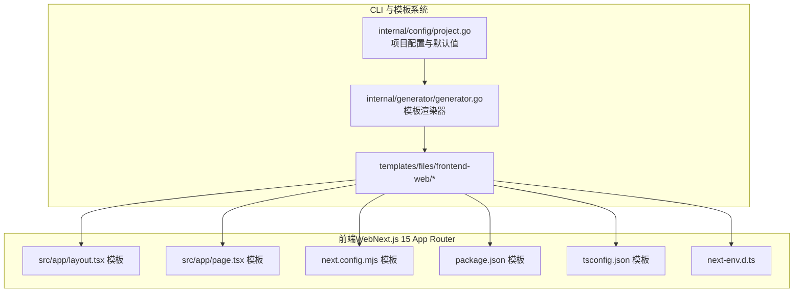
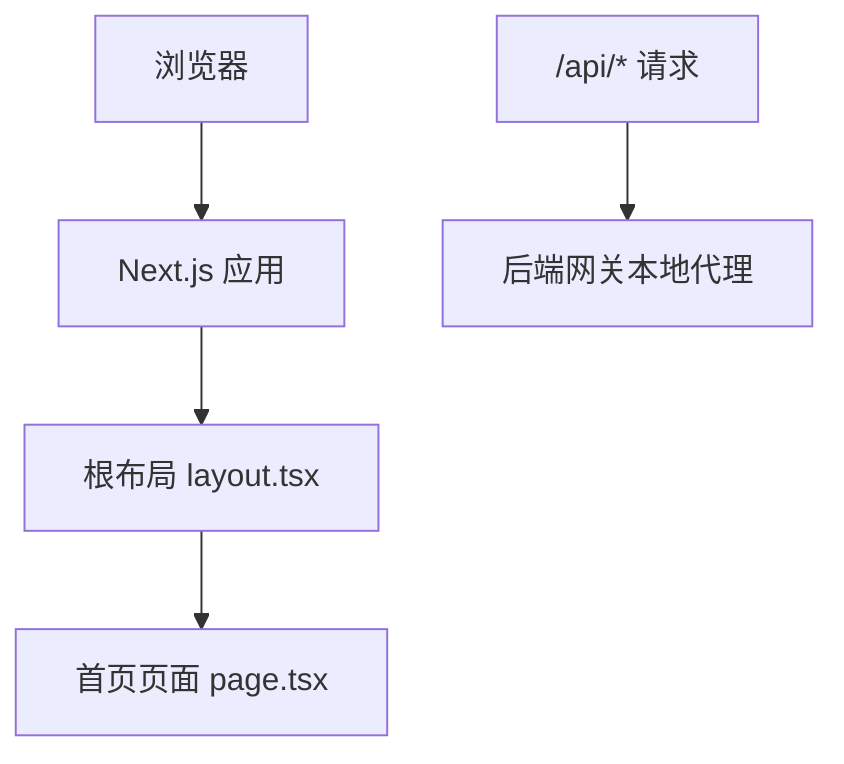
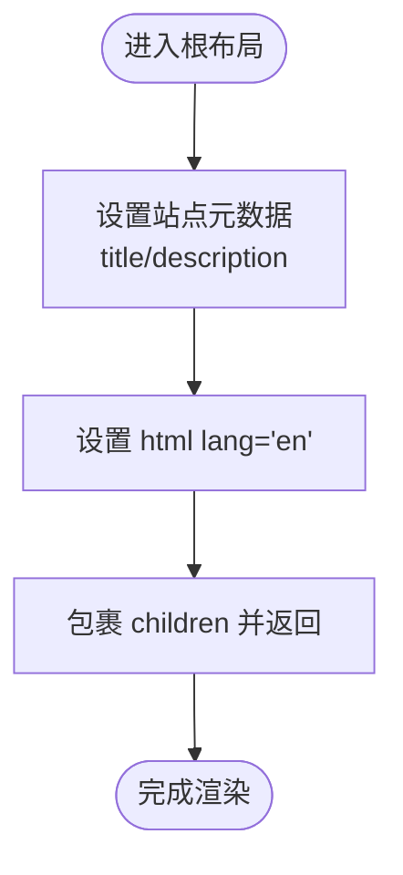
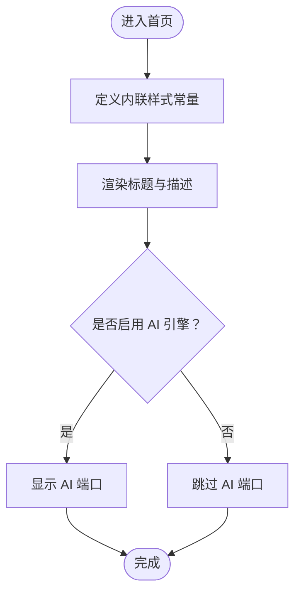
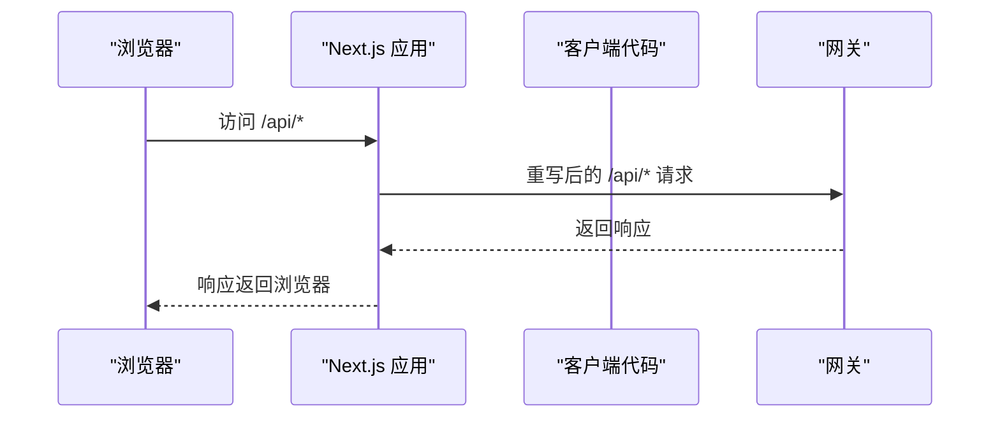
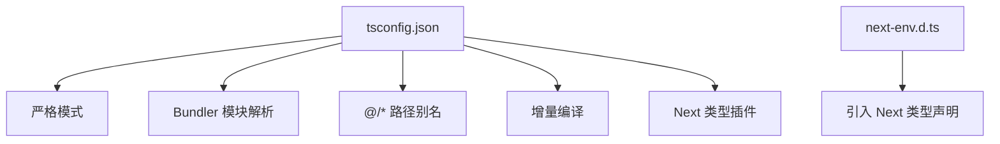
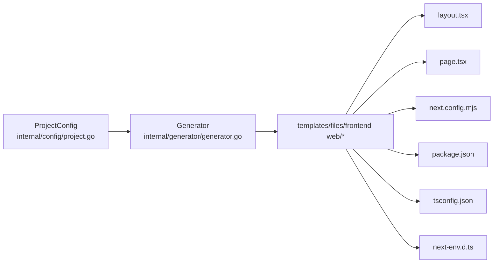

# 前端Web应用

<cite>
**本文引用的文件**
- [layout.tsx 模板](file://templates/files/frontend-web/src/app/layout.tsx.tmpl)
- [page.tsx 模板](file://templates/files/frontend-web/src/app/page.tsx.tmpl)
- [next.config.mjs 模板](file://templates/files/frontend-web/next.config.mjs.tmpl)
- [package.json 模板](file://templates/files/frontend-web/package.json.tmpl)
- [tsconfig.json 模板](file://templates/files/frontend-web/tsconfig.json)
- [next-env.d.ts](file://templates/files/frontend-web/next-env.d.ts)
- [项目配置定义](file://internal/config/project.go)
- [模板渲染器](file://internal/generator/generator.go)
- [前端管理端主入口（Vite）](file://templates/files/frontend-admin/src/main.tsx)
- [前端管理端登录页（Vite）](file://templates/files/frontend-admin/src/pages/Login.tsx.tmpl)
- [前端管理端仪表盘（Vite）](file://templates/files/frontend-admin/src/pages/Dashboard.tsx.tmpl)
- [Vite 配置（Admin）](file://templates/files/frontend-admin/vite.config.ts.tmpl)
- [本地一键启动脚本](file://templates/files/deploy/local/start.sh.tmpl)
- [Docker Compose 本地编排](file://templates/files/deploy/local/docker-compose-all.yaml.tmpl)
- [平台脚手架说明](file://README.md)
</cite>

## 目录
1. [引言](#引言)
2. [项目结构](#项目结构)
3. [核心组件](#核心组件)
4. [架构总览](#架构总览)
5. [组件与路由详解](#组件与路由详解)
6. [依赖关系分析](#依赖关系分析)
7. [性能与优化](#性能与优化)
8. [故障排查指南](#故障排查指南)
9. [结论](#结论)
10. [附录](#附录)

## 引言
本文件面向使用 Next.js App Router 模式的前端Web应用开发者，结合脚手架模板与生成产物，系统性阐述应用架构、布局与页面组件、路由配置、TypeScript 类型体系、组件开发模式、状态管理策略、页面渲染优化、SEO 配置、性能调优、样式系统与主题定制、响应式设计、构建配置、环境变量管理以及部署优化等工程化实践。文档以“模板渲染 + 生成产物”的视角，帮助读者快速理解并扩展该前端骨架。

## 项目结构
前端Web应用位于 templates/files/frontend-web，采用 Next.js 15 App Router 结构，核心文件包括根布局、首页页面、Next 配置、包管理与 TypeScript 配置等。同时，CLI 通过模板渲染机制将变量注入生成最终项目。

**图表来源**
- [layout.tsx 模板:1-13](file://templates/files/frontend-web/src/app/layout.tsx.tmpl#L1-L13)
- [page.tsx 模板:1-18](file://templates/files/frontend-web/src/app/page.tsx.tmpl#L1-L18)
- [next.config.mjs 模板:1-13](file://templates/files/frontend-web/next.config.mjs.tmpl#L1-L13)
- [package.json 模板:1-25](file://templates/files/frontend-web/package.json.tmpl#L1-L25)
- [tsconfig.json 模板:1-22](file://templates/files/frontend-web/tsconfig.json#L1-L22)
- [next-env.d.ts:1-3](file://templates/files/frontend-web/next-env.d.ts#L1-L3)
- [项目配置定义:1-121](file://internal/config/project.go#L1-L121)
- [模板渲染器:1-158](file://internal/generator/generator.go#L1-L158)

**章节来源**
- [平台脚手架说明:1-98](file://README.md#L1-L98)
- [项目配置定义:1-121](file://internal/config/project.go#L1-L121)
- [模板渲染器:1-158](file://internal/generator/generator.go#L1-L158)

## 核心组件
- 根布局与元数据：根布局负责设置站点标题、描述与语言，并包裹子组件树。
- 首页页面：展示品牌信息与后端服务地址，支持条件渲染 AI 引擎端口。
- Next 配置：开启严格模式与开发期重写，将 /api/* 代理至网关，避免本地跨域。
- 包与类型：Next 15、React 19、TypeScript 5，配合 ESLint Next 规则与类型声明。
- TypeScript 配置：严格模式、Bundler 模块解析、路径别名、增量编译与插件集成。

**章节来源**
- [layout.tsx 模板:1-13](file://templates/files/frontend-web/src/app/layout.tsx.tmpl#L1-L13)
- [page.tsx 模板:1-18](file://templates/files/frontend-web/src/app/page.tsx.tmpl#L1-L18)
- [next.config.mjs 模板:1-13](file://templates/files/frontend-web/next.config.mjs.tmpl#L1-L13)
- [package.json 模板:1-25](file://templates/files/frontend-web/package.json.tmpl#L1-L25)
- [tsconfig.json 模板:1-22](file://templates/files/frontend-web/tsconfig.json#L1-L22)
- [next-env.d.ts:1-3](file://templates/files/frontend-web/next-env.d.ts#L1-L3)

## 架构总览
前端Web应用采用 Next.js App Router，根布局统一注入元数据与语言，页面组件负责内容渲染。开发期通过重写将 /api/* 直接代理到网关，简化本地联调。CLI 通过模板系统注入变量，生成最终项目。

**图表来源**
- [layout.tsx 模板:1-13](file://templates/files/frontend-web/src/app/layout.tsx.tmpl#L1-L13)
- [page.tsx 模板:1-18](file://templates/files/frontend-web/src/app/page.tsx.tmpl#L1-L18)
- [next.config.mjs 模板:1-13](file://templates/files/frontend-web/next.config.mjs.tmpl#L1-L13)

## 组件与路由详解

### 根布局与元数据
- 元数据：title 与 description 由模板变量注入，确保品牌一致性。
- 语言：html lang 设置为 en。
- 子树：body 包裹 children，形成 App Router 的根节点。

**图表来源**
- [layout.tsx 模板:1-13](file://templates/files/frontend-web/src/app/layout.tsx.tmpl#L1-L13)

**章节来源**
- [layout.tsx 模板:1-13](file://templates/files/frontend-web/src/app/layout.tsx.tmpl#L1-L13)

### 首页页面
- 样式：通过局部常量定义内联样式，保证类型安全与可维护性。
- 内容：展示品牌标题与后端服务地址；根据特性开关条件渲染 AI 引擎端口。
- 交互：当前为静态展示，后续可接入数据请求与状态管理。

**图表来源**
- [page.tsx 模板:1-18](file://templates/files/frontend-web/src/app/page.tsx.tmpl#L1-L18)

**章节来源**
- [page.tsx 模板:1-18](file://templates/files/frontend-web/src/app/page.tsx.tmpl#L1-L18)

### 路由与导航
- App Router：采用 App 目录结构，页面组件位于 src/app 下。
- 导航：根路由指向首页；可扩展多页面与嵌套路由。
- 代理：开发期通过 next.config.mjs 将 /api/* 代理到网关，避免跨域。

**图表来源**
- [next.config.mjs 模板:1-13](file://templates/files/frontend-web/next.config.mjs.tmpl#L1-L13)

**章节来源**
- [next.config.mjs 模板:1-13](file://templates/files/frontend-web/next.config.mjs.tmpl#L1-L13)

### TypeScript 类型体系
- 编译选项：严格模式、Bundler 模块解析、路径别名、增量编译。
- 插件：集成 Next 类型插件，提升 DX。
- 声明：next-env.d.ts 引入 Next 与图片类型声明。

**图表来源**
- [tsconfig.json 模板:1-22](file://templates/files/frontend-web/tsconfig.json#L1-L22)
- [next-env.d.ts:1-3](file://templates/files/frontend-web/next-env.d.ts#L1-L3)

**章节来源**
- [tsconfig.json 模板:1-22](file://templates/files/frontend-web/tsconfig.json#L1-L22)
- [next-env.d.ts:1-3](file://templates/files/frontend-web/next-env.d.ts#L1-L3)

### 组件开发模式与状态管理
- 当前页面：静态展示，适合演示与起步。
- 推荐模式：
  - 使用 React 19 的并发特性与 Suspense。
  - 页面级状态集中于页面组件，共享状态上移至布局或根上下文。
  - 数据请求建议封装为自定义 Hook，统一处理加载、错误与缓存。
  - 对于复杂场景，可引入轻量状态库或 Context 管理全局状态。

[本节为通用开发建议，不直接分析具体文件，故无“章节来源”]

### SEO 配置与页面渲染优化
- 元数据：根布局提供 title 与 description，满足基础 SEO。
- 静态生成：可利用 Next.js 的静态导出或 SSG/SSR 生成页面，提升首屏性能。
- 图片优化：使用 next/image，自动优化尺寸与格式。
- 预加载与预取：通过 Link 预加载关键资源，减少白屏时间。
- 代码分割：App Router 默认按路由拆分，保持页面体积最小化。

[本节为通用优化建议，不直接分析具体文件，故无“章节来源”]

### 样式系统、主题定制与响应式设计
- 内联样式：当前页面使用内联样式常量，简单直观。
- CSS-in-JS：可引入 styled-components 或 Emotion，实现主题化与动态样式。
- CSS Modules：按页面或组件划分样式文件，避免命名冲突。
- 响应式：使用媒体查询或 CSS Grid/Flex 布局，适配移动端与桌面端。
- 主题：通过 CSS 变量或 Context 管理主题切换，保证一致性。

[本节为通用样式建议，不直接分析具体文件，故无“章节来源”]

## 依赖关系分析
模板渲染器根据 ProjectConfig 决定是否渲染前端Web模板树；根布局与页面组件构成 App Router 的核心；Next 配置与包管理决定开发体验与构建行为。

**图表来源**
- [项目配置定义:1-121](file://internal/config/project.go#L1-L121)
- [模板渲染器:1-158](file://internal/generator/generator.go#L1-L158)
- [layout.tsx 模板:1-13](file://templates/files/frontend-web/src/app/layout.tsx.tmpl#L1-L13)
- [page.tsx 模板:1-18](file://templates/files/frontend-web/src/app/page.tsx.tmpl#L1-L18)
- [next.config.mjs 模板:1-13](file://templates/files/frontend-web/next.config.mjs.tmpl#L1-L13)
- [package.json 模板:1-25](file://templates/files/frontend-web/package.json.tmpl#L1-L25)
- [tsconfig.json 模板:1-22](file://templates/files/frontend-web/tsconfig.json#L1-L22)
- [next-env.d.ts:1-3](file://templates/files/frontend-web/next-env.d.ts#L1-L3)

**章节来源**
- [模板渲染器:105-120](file://internal/generator/generator.go#L105-L120)
- [项目配置定义:54-59](file://internal/config/project.go#L54-L59)

## 性能与优化
- 开发期代理：next.config.mjs 将 /api/* 代理到网关，避免跨域与本地调试成本。
- 严格模式：reactStrictMode 提升开发期稳定性与早期问题发现。
- 构建与启动：package.json 定义 dev/build/start/lint 脚本，统一开发流程。
- TypeScript：严格模式与增量编译提升类型检查效率与编辑器体验。
- 部署优化：可结合静态导出、CDN 与缓存策略，进一步提升加载速度。

**章节来源**
- [next.config.mjs 模板:1-13](file://templates/files/frontend-web/next.config.mjs.tmpl#L1-L13)
- [package.json 模板:1-25](file://templates/files/frontend-web/package.json.tmpl#L1-L25)
- [tsconfig.json 模板:1-22](file://templates/files/frontend-web/tsconfig.json#L1-L22)

## 故障排查指南
- 本地启动顺序：使用本地一键启动脚本，先启动后端（gateway、api、ai-engine），再启动前端（web）。
- 端口占用：脚本会检测端口占用并尝试清理，若仍失败，检查端口映射与防火墙。
- 日志定位：通过脚本 logs 子命令查看各服务日志，快速定位问题。
- 依赖缺失：确保已复制 .env 示例并安装依赖；后端服务需 Go 与 Python 环境。

**章节来源**
- [本地一键启动脚本:1-242](file://templates/files/deploy/local/start.sh.tmpl#L1-L242)
- [Docker Compose 本地编排:1-48](file://templates/files/deploy/local/docker-compose-all.yaml.tmpl#L1-L48)

## 结论
该前端Web骨架以 Next.js 15 App Router 为核心，结合 CLI 模板系统，提供了可定制、可扩展的开发基座。通过根布局与页面组件的清晰职责划分、严格的 TypeScript 配置、开发期代理与统一脚本管理，能够快速搭建现代化前端应用。后续可在现有基础上引入状态管理、主题系统、SEO 优化与性能监控，持续提升开发体验与用户体验。

## 附录
- 与后端协作：前端通过 /api/* 代理访问网关，确保本地联调顺畅。
- 环境变量：通过 .env 文件注入，脚本中统一加载，便于多环境管理。
- 部署建议：结合静态导出与 CDN，配合后端服务进行灰度发布与回滚。

[本节为通用工程化建议，不直接分析具体文件，故无“章节来源”]