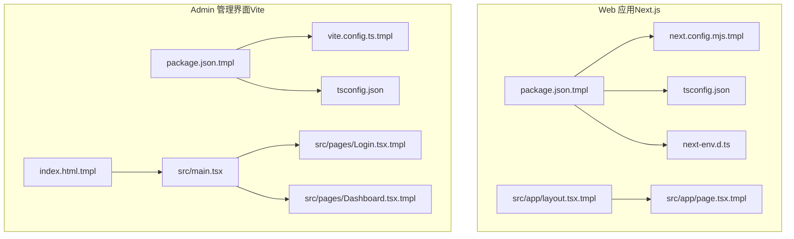
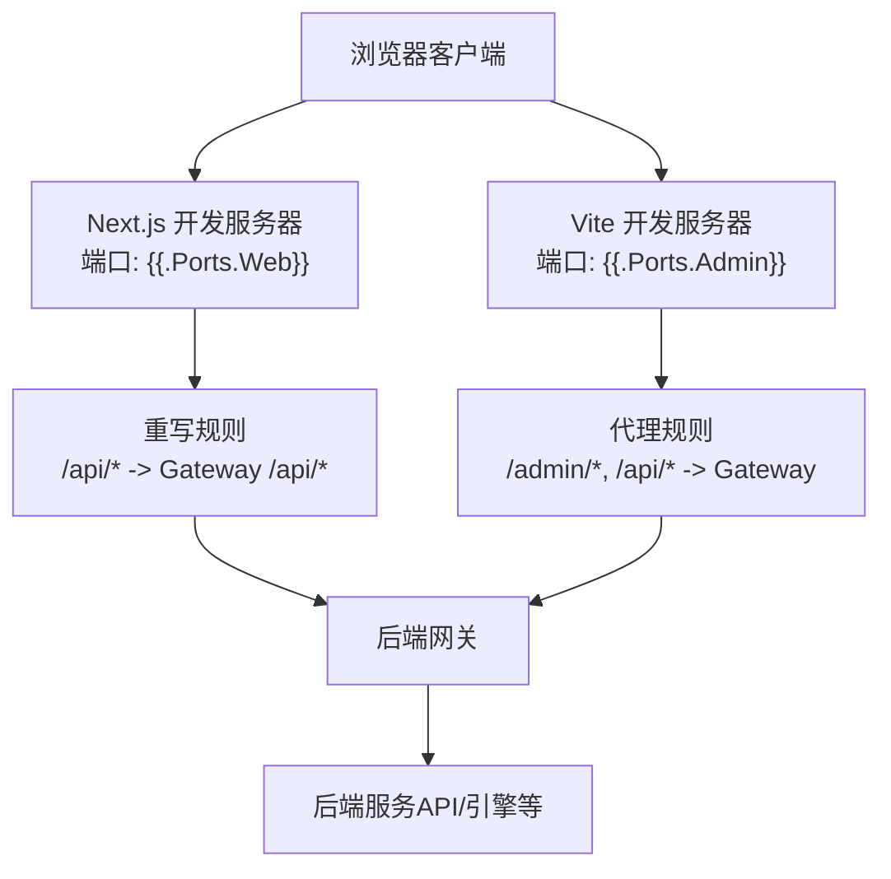
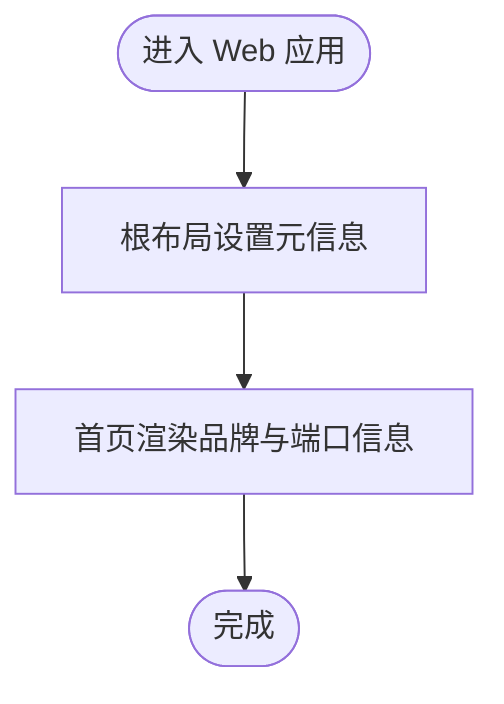
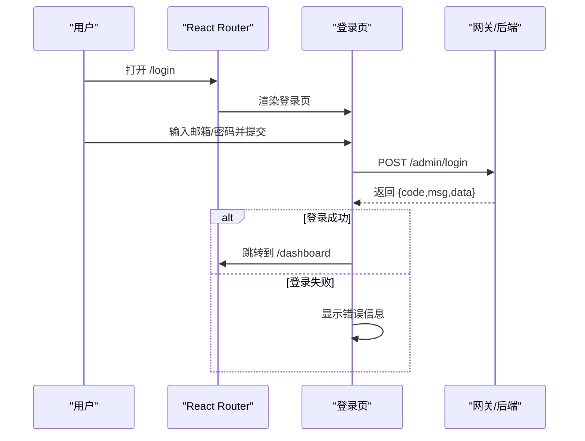
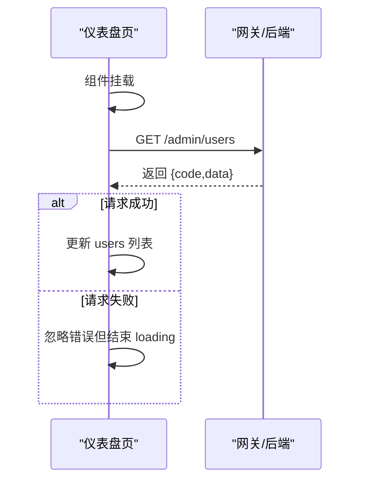
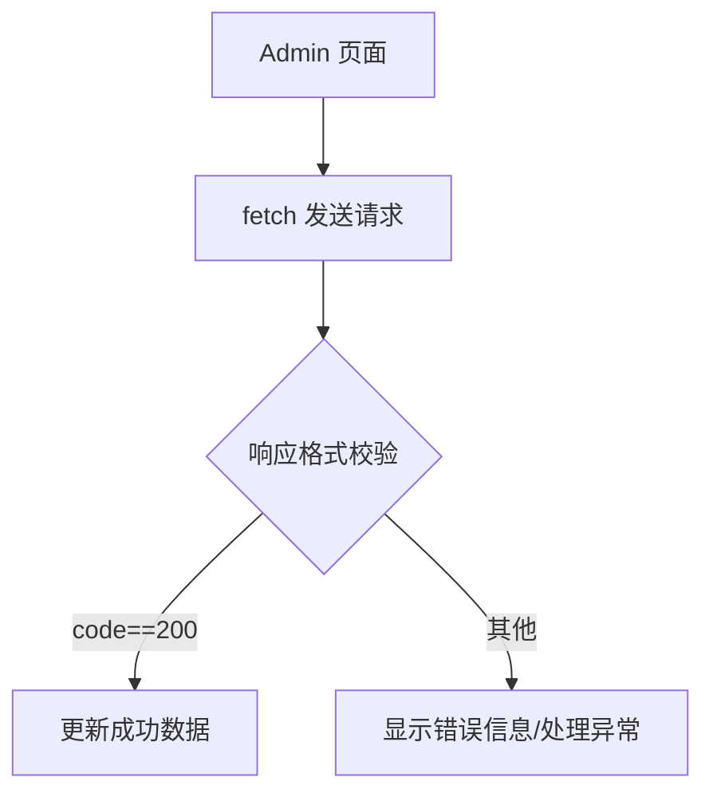
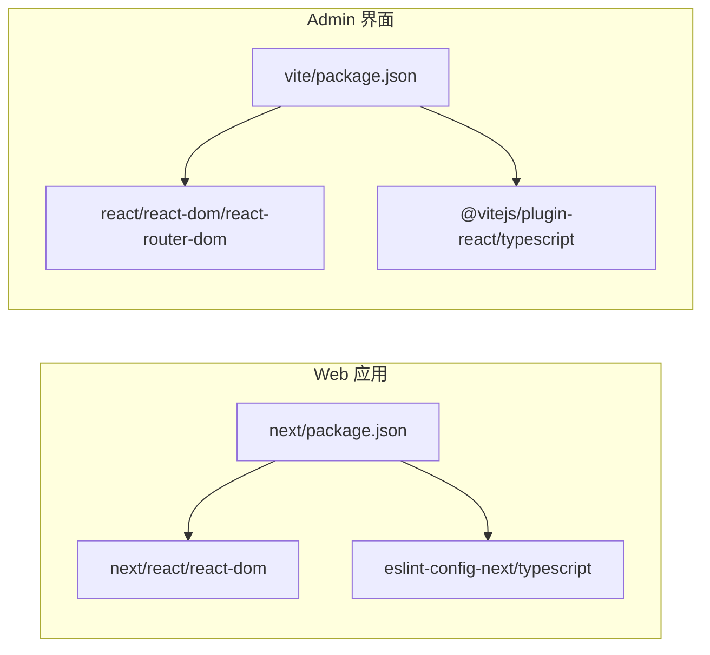

# 前端开发

<cite>
**本文引用的文件**
- [frontend-web/src/app/layout.tsx.tmpl](file://templates/files/frontend-web/src/app/layout.tsx.tmpl)
- [frontend-web/src/app/page.tsx.tmpl](file://templates/files/frontend-web/src/app/page.tsx.tmpl)
- [frontend-web/next.config.mjs.tmpl](file://templates/files/frontend-web/next.config.mjs.tmpl)
- [frontend-web/tsconfig.json](file://templates/files/frontend-web/tsconfig.json)
- [frontend-web/package.json.tmpl](file://templates/files/frontend-web/package.json.tmpl)
- [frontend-web/next-env.d.ts](file://templates/files/frontend-web/next-env.d.ts)
- [frontend-admin/src/main.tsx](file://templates/files/frontend-admin/src/main.tsx)
- [frontend-admin/src/pages/Login.tsx.tmpl](file://templates/files/frontend-admin/src/pages/Login.tsx.tmpl)
- [frontend-admin/src/pages/Dashboard.tsx.tmpl](file://templates/files/frontend-admin/src/pages/Dashboard.tsx.tmpl)
- [frontend-admin/package.json.tmpl](file://templates/files/frontend-admin/package.json.tmpl)
- [frontend-admin/vite.config.ts.tmpl](file://templates/files/frontend-admin/vite.config.ts.tmpl)
- [frontend-admin/tsconfig.json](file://templates/files/frontend-admin/tsconfig.json)
- [frontend-admin/index.html.tmpl](file://templates/files/frontend-admin/index.html.tmpl)
- [.gitignore](file://.gitignore)
- [pkg-platform-core/response/response.go.tmpl](file://templates/files/pkg-platform-core/response/response.go.tmpl)
- [backend-gateway/internal/proxy/proxy.go.tmpl](file://templates/files/backend-gateway/internal/proxy/proxy.go.tmpl)
</cite>

## 目录
1. [简介](#简介)
2. [项目结构](#项目结构)
3. [核心组件](#核心组件)
4. [架构总览](#架构总览)
5. [详细组件分析](#详细组件分析)
6. [依赖关系分析](#依赖关系分析)
7. [性能考虑](#性能考虑)
8. [故障排查指南](#故障排查指南)
9. [结论](#结论)
10. [附录](#附录)

## 简介
本文件面向前端开发者，围绕平台脚手架中的前端模板进行系统化说明，覆盖以下主题：
- 开发环境搭建与配置：Next.js 与 Vite 工程的 TypeScript、路由、构建与代理配置
- 组件开发模式：函数组件、表单处理、状态管理与数据获取
- 架构设计：Web 应用与 Admin 管理界面的页面组织与交互流程
- 最佳实践：路由配置、状态管理、数据获取、样式与主题、响应式设计
- 测试策略：基于现有 fetch 与路由行为的可测试性建议
- 性能优化：构建产物、代理与流式响应的注意事项
- 用户体验：登录态、错误提示与加载状态的设计原则

## 项目结构
该仓库采用“模板生成器”方式提供前端工程骨架，包含两套前端应用模板：
- Web 应用（Next.js App Router）：位于 templates/files/frontend-web
- Admin 管理界面（Vite + React Router）：位于 templates/files/frontend-admin

图表来源
- [frontend-web/package.json.tmpl:1-24](file://templates/files/frontend-web/package.json.tmpl#L1-L24)
- [frontend-web/next.config.mjs.tmpl:1-13](file://templates/files/frontend-web/next.config.mjs.tmpl#L1-L13)
- [frontend-web/tsconfig.json:1-22](file://templates/files/frontend-web/tsconfig.json#L1-L22)
- [frontend-web/next-env.d.ts:1-3](file://templates/files/frontend-web/next-env.d.ts#L1-L3)
- [frontend-web/src/app/layout.tsx.tmpl:1-13](file://templates/files/frontend-web/src/app/layout.tsx.tmpl#L1-L13)
- [frontend-web/src/app/page.tsx.tmpl:1-18](file://templates/files/frontend-web/src/app/page.tsx.tmpl#L1-L18)
- [frontend-admin/package.json.tmpl:1-24](file://templates/files/frontend-admin/package.json.tmpl#L1-L24)
- [frontend-admin/vite.config.ts.tmpl:1-14](file://templates/files/frontend-admin/vite.config.ts.tmpl#L1-L14)
- [frontend-admin/tsconfig.json:1-20](file://templates/files/frontend-admin/tsconfig.json#L1-L20)
- [frontend-admin/index.html.tmpl:1-12](file://templates/files/frontend-admin/index.html.tmpl#L1-L12)
- [frontend-admin/src/main.tsx:1-18](file://templates/files/frontend-admin/src/main.tsx#L1-L18)
- [frontend-admin/src/pages/Login.tsx.tmpl:1-63](file://templates/files/frontend-admin/src/pages/Login.tsx.tmpl#L1-L63)
- [frontend-admin/src/pages/Dashboard.tsx.tmpl:1-59](file://templates/files/frontend-admin/src/pages/Dashboard.tsx.tmpl#L1-L59)

章节来源
- [frontend-web/package.json.tmpl:1-24](file://templates/files/frontend-web/package.json.tmpl#L1-L24)
- [frontend-admin/package.json.tmpl:1-24](file://templates/files/frontend-admin/package.json.tmpl#L1-L24)

## 核心组件
- Web 应用（Next.js）
  - 入口布局与元信息：根布局负责站点标题与语言设置；首页展示品牌信息与后端服务端口信息。
  - 构建与开发：通过 Next.js 提供开发服务器、构建与启动命令；配置了开发期重写规则以代理 /api* 到网关，避免本地跨域。
  - 类型配置：启用严格类型检查、路径别名、Bundler 模块解析等。

- Admin 管理界面（Vite + React Router）
  - 路由与入口：BrowserRouter 定义登录与仪表盘路由；默认重定向至仪表盘。
  - 登录页：表单收集邮箱与密码，提交到 /admin/login，使用同源 Cookie 认证；根据返回码判断登录结果并跳转。
  - 仪表盘：首次挂载拉取 /admin/users，展示用户列表；包含基础加载态与错误提示预留。

章节来源
- [frontend-web/src/app/layout.tsx.tmpl:1-13](file://templates/files/frontend-web/src/app/layout.tsx.tmpl#L1-L13)
- [frontend-web/src/app/page.tsx.tmpl:1-18](file://templates/files/frontend-web/src/app/page.tsx.tmpl#L1-L18)
- [frontend-web/next.config.mjs.tmpl:1-13](file://templates/files/frontend-web/next.config.mjs.tmpl#L1-L13)
- [frontend-web/tsconfig.json:1-22](file://templates/files/frontend-web/tsconfig.json#L1-L22)
- [frontend-admin/src/main.tsx:1-18](file://templates/files/frontend-admin/src/main.tsx#L1-L18)
- [frontend-admin/src/pages/Login.tsx.tmpl:1-63](file://templates/files/frontend-admin/src/pages/Login.tsx.tmpl#L1-L63)
- [frontend-admin/src/pages/Dashboard.tsx.tmpl:1-59](file://templates/files/frontend-admin/src/pages/Dashboard.tsx.tmpl#L1-L59)

## 架构总览
前端与后端通过网关进行统一代理与鉴权，Admin 与 Web 两条路径分别承载不同职责：
- Web 应用：面向终端用户的展示与引导页面，通过 Next.js App Router 组织页面。
- Admin 管理界面：面向管理员的登录与数据管理页面，通过 Vite 构建与 React Router 路由组织。

图表来源
- [frontend-web/next.config.mjs.tmpl:4-9](file://templates/files/frontend-web/next.config.mjs.tmpl#L4-L9)
- [frontend-admin/vite.config.ts.tmpl:6-12](file://templates/files/frontend-admin/vite.config.ts.tmpl#L6-L12)

章节来源
- [frontend-web/next.config.mjs.tmpl:1-13](file://templates/files/frontend-web/next.config.mjs.tmpl#L1-L13)
- [frontend-admin/vite.config.ts.tmpl:1-14](file://templates/files/frontend-admin/vite.config.ts.tmpl#L1-L14)

## 详细组件分析

### Web 应用（Next.js）组件
- 根布局与元信息
  - 设置站点标题与描述，包裹所有子节点。
- 首页
  - 展示品牌名称与由脚手架注入的服务端口信息；支持条件渲染 AI 引擎端口。
- TypeScript 配置
  - 使用 ES2022 目标、严格模式、路径别名、Bundler 解析、保留 JSX 等选项。
- Next 配置
  - 开启严格模式；开发期将 /api/* 重写到网关，简化本地联调。

图表来源
- [frontend-web/src/app/layout.tsx.tmpl:1-13](file://templates/files/frontend-web/src/app/layout.tsx.tmpl#L1-L13)
- [frontend-web/src/app/page.tsx.tmpl:1-18](file://templates/files/frontend-web/src/app/page.tsx.tmpl#L1-L18)

章节来源
- [frontend-web/src/app/layout.tsx.tmpl:1-13](file://templates/files/frontend-web/src/app/layout.tsx.tmpl#L1-L13)
- [frontend-web/src/app/page.tsx.tmpl:1-18](file://templates/files/frontend-web/src/app/page.tsx.tmpl#L1-L18)
- [frontend-web/next.config.mjs.tmpl:1-13](file://templates/files/frontend-web/next.config.mjs.tmpl#L1-L13)
- [frontend-web/tsconfig.json:1-22](file://templates/files/frontend-web/tsconfig.json#L1-L22)

### Admin 管理界面组件
- 路由入口
  - 默认重定向至 /dashboard；提供 /login 与 /dashboard 两个页面。
- 登录页
  - 表单状态：邮箱、密码、错误信息。
  - 提交流程：阻止默认提交、发送 POST /admin/login、根据返回码更新错误或跳转。
- 仪表盘
  - 生命周期：组件挂载时拉取 /admin/users，设置 loading 状态，最终渲染用户表格。

图表来源
- [frontend-admin/src/main.tsx:1-18](file://templates/files/frontend-admin/src/main.tsx#L1-L18)
- [frontend-admin/src/pages/Login.tsx.tmpl:8-23](file://templates/files/frontend-admin/src/pages/Login.tsx.tmpl#L8-L23)

图表来源
- [frontend-admin/src/pages/Dashboard.tsx.tmpl:14-24](file://templates/files/frontend-admin/src/pages/Dashboard.tsx.tmpl#L14-L24)

章节来源
- [frontend-admin/src/main.tsx:1-18](file://templates/files/frontend-admin/src/main.tsx#L1-L18)
- [frontend-admin/src/pages/Login.tsx.tmpl:1-63](file://templates/files/frontend-admin/src/pages/Login.tsx.tmpl#L1-L63)
- [frontend-admin/src/pages/Dashboard.tsx.tmpl:1-59](file://templates/files/frontend-admin/src/pages/Dashboard.tsx.tmpl#L1-L59)

### 数据获取与响应格式
- Admin 页面使用 fetch 发起同源请求，依赖网关代理与 Cookie 认证。
- 后端统一响应格式包含 code、msg、data；HTTP 状态码用于区分业务错误、未登录、权限等问题。

图表来源
- [frontend-admin/src/pages/Login.tsx.tmpl:11-22](file://templates/files/frontend-admin/src/pages/Login.tsx.tmpl#L11-L22)
- [frontend-admin/src/pages/Dashboard.tsx.tmpl:17-22](file://templates/files/frontend-admin/src/pages/Dashboard.tsx.tmpl#L17-L22)
- [pkg-platform-core/response/response.go.tmpl:26-52](file://templates/files/pkg-platform-core/response/response.go.tmpl#L26-L52)

章节来源
- [frontend-admin/src/pages/Login.tsx.tmpl:1-63](file://templates/files/frontend-admin/src/pages/Login.tsx.tmpl#L1-L63)
- [frontend-admin/src/pages/Dashboard.tsx.tmpl:1-59](file://templates/files/frontend-admin/src/pages/Dashboard.tsx.tmpl#L1-L59)
- [pkg-platform-core/response/response.go.tmpl:1-52](file://templates/files/pkg-platform-core/response/response.go.tmpl#L1-L52)

## 依赖关系分析
- Web 应用
  - 依赖 next、react、react-dom；开发工具链包含 ESLint 与 TypeScript。
  - TypeScript 通过路径别名 @/* 指向 src 目录，便于模块导入。
- Admin 管理界面
  - 依赖 react、react-dom、react-router-dom；Vite 提供开发与构建能力。
  - TypeScript 严格模式与无副作用编译，确保类型安全与最小化产物。

图表来源
- [frontend-web/package.json.tmpl:11-22](file://templates/files/frontend-web/package.json.tmpl#L11-L22)
- [frontend-admin/package.json.tmpl:11-22](file://templates/files/frontend-admin/package.json.tmpl#L11-L22)

章节来源
- [frontend-web/package.json.tmpl:1-24](file://templates/files/frontend-web/package.json.tmpl#L1-L24)
- [frontend-admin/package.json.tmpl:1-24](file://templates/files/frontend-admin/package.json.tmpl#L1-L24)

## 性能考虑
- 构建与打包
  - Next.js 与 Vite 均支持按需构建与代码分割；建议开启压缩与 Tree Shaking。
- 代理与跨域
  - Next 开发期重写 /api* 到网关，减少本地 CORS 配置复杂度；Vite 代理 /admin 与 /api* 到网关，便于统一调试。
- 流式响应
  - 网关对 SSE、音频与二进制流进行特殊处理与刷新控制，前端在使用流式接口时应关注连接与缓冲策略。

章节来源
- [frontend-web/next.config.mjs.tmpl:4-9](file://templates/files/frontend-web/next.config.mjs.tmpl#L4-L9)
- [frontend-admin/vite.config.ts.tmpl:8-11](file://templates/files/frontend-admin/vite.config.ts.tmpl#L8-L11)
- [backend-gateway/internal/proxy/proxy.go.tmpl:68-96](file://templates/files/backend-gateway/internal/proxy/proxy.go.tmpl#L68-L96)

## 故障排查指南
- 本地无法访问 /api*
  - 确认 Next 开发服务器已启用重写规则；确认 Vite 代理已配置 /api 与 /admin。
- 登录失败或无错误提示
  - 检查 /admin/login 返回的 code 与 msg；确认 Cookie 是否携带（credentials: include）。
- 仪表盘空白或加载不结束
  - 检查 /admin/users 返回结构与 code；确认 loading 状态逻辑是否正确收尾。
- TypeScript 报错
  - 校验 tsconfig 中 strict、jsx、moduleResolution 等选项；确保路径别名 @/* 正确映射。

章节来源
- [frontend-web/next.config.mjs.tmpl:4-9](file://templates/files/frontend-web/next.config.mjs.tmpl#L4-L9)
- [frontend-admin/vite.config.ts.tmpl:8-11](file://templates/files/frontend-admin/vite.config.ts.tmpl#L8-L11)
- [frontend-admin/src/pages/Login.tsx.tmpl:11-22](file://templates/files/frontend-admin/src/pages/Login.tsx.tmpl#L11-L22)
- [frontend-admin/src/pages/Dashboard.tsx.tmpl:17-22](file://templates/files/frontend-admin/src/pages/Dashboard.tsx.tmpl#L17-L22)
- [frontend-web/tsconfig.json:1-22](file://templates/files/frontend-web/tsconfig.json#L1-L22)
- [frontend-admin/tsconfig.json:1-20](file://templates/files/frontend-admin/tsconfig.json#L1-L20)

## 结论
本脚手架提供了清晰的前端工程模板与一致的开发体验：
- Next.js 适合构建面向用户的 Web 应用，具备良好的路由与开发体验。
- Vite 适合构建 Admin 管理界面，具备快速热更新与代理能力。
- 统一的响应格式与网关代理为前后端协作提供稳定契约。
建议在此基础上扩展样式系统、主题与响应式设计，并结合现有 fetch 与路由模式完善测试与性能优化策略。

## 附录
- 开发与构建命令
  - Web 应用：dev/build/start/lint
  - Admin 管理界面：dev/build/preview
- 关键配置要点
  - Next.js：重写 /api* 到网关；严格类型与路径别名
  - Vite：代理 /admin 与 /api* 到网关；React 插件与 TypeScript
- 忽略文件
  - 前端通用忽略项：node_modules、.next、dist/build 等

章节来源
- [frontend-web/package.json.tmpl:5-9](file://templates/files/frontend-web/package.json.tmpl#L5-L9)
- [frontend-admin/package.json.tmpl:6-9](file://templates/files/frontend-admin/package.json.tmpl#L6-L9)
- [.gitignore:35-39](file://.gitignore#L35-L39)