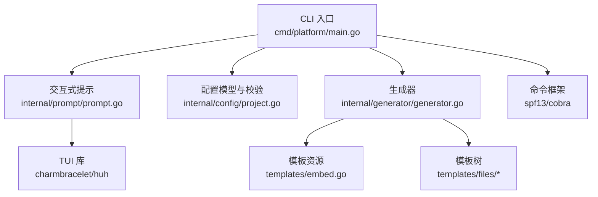
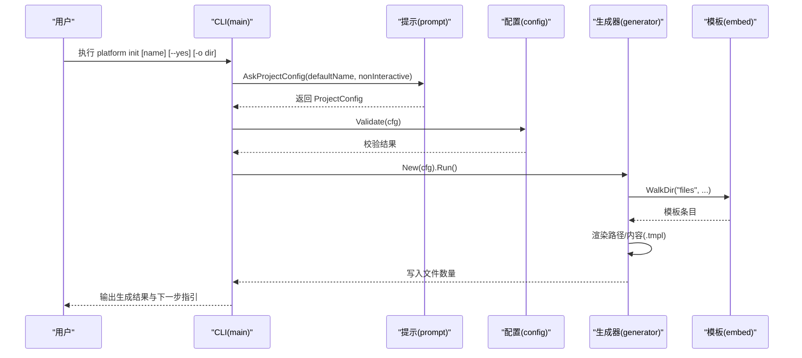
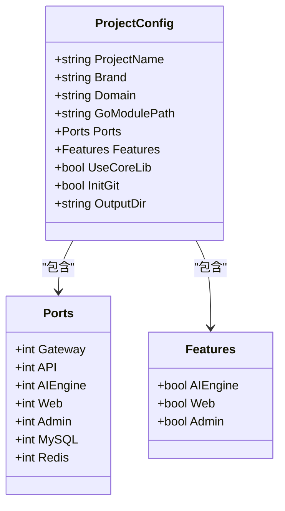
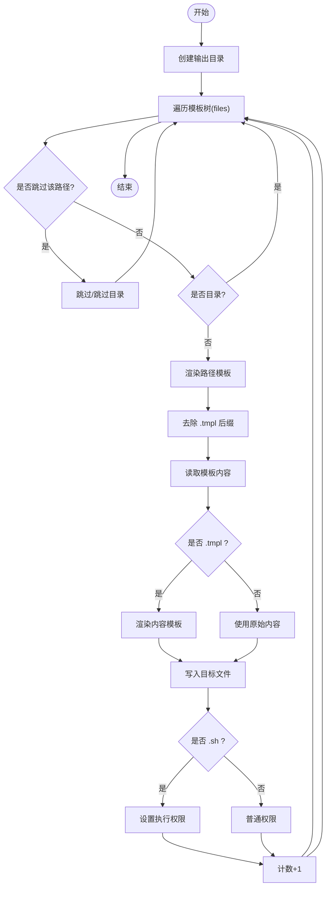
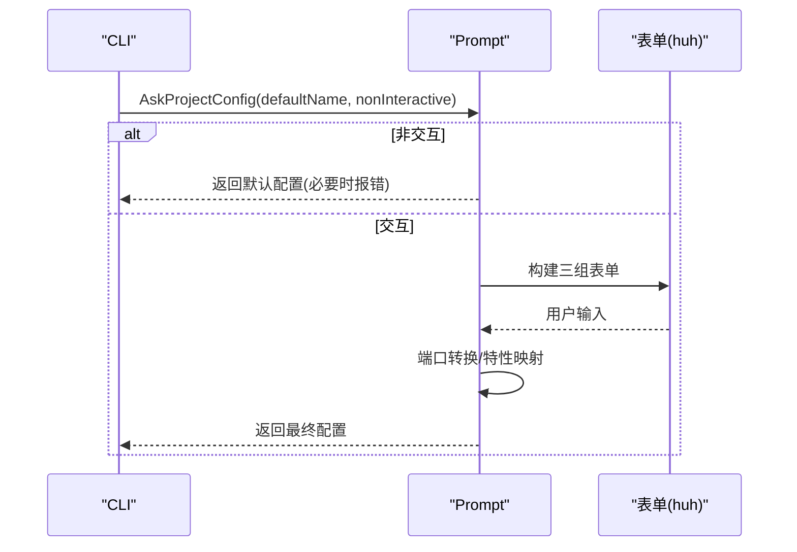
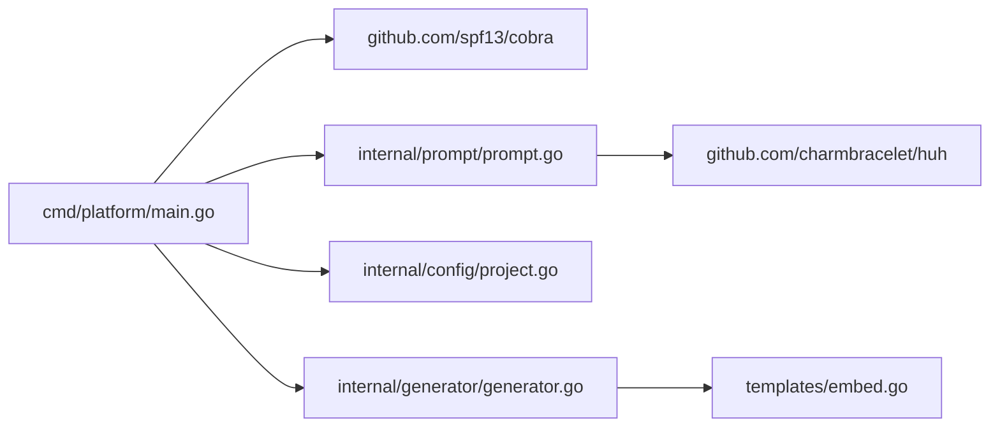

# 后端开发

<cite>
**本文引用的文件**
- [cmd/platform/main.go](file://cmd/platform/main.go)
- [internal/config/project.go](file://internal/config/project.go)
- [internal/generator/generator.go](file://internal/generator/generator.go)
- [internal/prompt/prompt.go](file://internal/prompt/prompt.go)
- [templates/embed.go](file://templates/embed.go)
- [go.mod](file://go.mod)
- [README.md](file://README.md)
- [templates/files/backend-api/cmd/api/main.go.tmpl](file://templates/files/backend-api/cmd/api/main.go.tmpl)
- [templates/files/pkg-platform-core/crypto/aes_gcm_test.go.tmpl](file://templates/files/pkg-platform-core/crypto/aes_gcm_test.go.tmpl)
- [templates/files/deploy/local/docker-compose-all.yaml.tmpl](file://templates/files/deploy/local/docker-compose-all.yaml.tmpl)
</cite>

## 目录
1. [简介](#简介)
2. [项目结构](#项目结构)
3. [核心组件](#核心组件)
4. [架构总览](#架构总览)
5. [组件详解](#组件详解)
6. [依赖关系分析](#依赖关系分析)
7. [性能与并发](#性能与并发)
8. [错误处理与日志](#错误处理与日志)
9. [测试策略](#测试策略)
10. [代码格式化与静态分析](#代码格式化与静态分析)
11. [故障排查指南](#故障排查指南)
12. [结论](#结论)

## 简介
本项目是一个多语言微服务脚手架 CLI，通过交互式提示收集项目配置，结合模板渲染与内嵌资源，一键生成包含 Go 网关、Go API、Python AI 引擎、Next.js 前端以及部署脚本的完整工程骨架。其核心围绕“配置管理 + 生成器逻辑 + 交互式提示系统”三大模块展开，辅以统一的模板渲染与内嵌资源机制，确保生成物可复用、可扩展且易于维护。

## 项目结构
- CLI 入口位于 cmd/platform/main.go，负责命令解析与生命周期控制。
- 配置模型与校验位于 internal/config/project.go，定义生成所需的关键字段及默认值。
- 交互式提示位于 internal/prompt/prompt.go，基于 charmbracelet/huh 构建 TUI 表单。
- 生成器位于 internal/generator/generator.go，负责遍历模板树、渲染文本与路径、写入磁盘。
- 模板资源通过 templates/embed.go 使用 embed.FS 内嵌至二进制，减少运行时依赖。
- go.mod 定义模块与依赖版本，README.md 提供整体背景与技术栈说明。

图表来源
- [cmd/platform/main.go:22-38](file://cmd/platform/main.go#L22-L38)
- [internal/prompt/prompt.go:13-105](file://internal/prompt/prompt.go#L13-L105)
- [internal/config/project.go:12-106](file://internal/config/project.go#L12-L106)
- [internal/generator/generator.go:33-103](file://internal/generator/generator.go#L33-L103)
- [templates/embed.go:6-11](file://templates/embed.go#L6-L11)

章节来源
- [cmd/platform/main.go:22-38](file://cmd/platform/main.go#L22-L38)
- [go.mod:1-37](file://go.mod#L1-L37)
- [README.md:1-19](file://README.md#L1-L19)

## 核心组件
- 配置管理：定义 ProjectConfig 结构体及其默认值与校验规则；提供 kebab-case 校验、端口合法性检查等。
- 生成器逻辑：遍历嵌入模板树，按 Features 与 UseCoreLib 开关决定是否渲染特定子树；支持路径模板与内容模板渲染；自动设置可执行权限。
- 交互式提示系统：基于 huh 构建三组表单（基础信息、端口、特性与选项），非交互模式下直接采用默认值。
- 模板与资源：通过 embed.FS 将 templates/files 整棵树内嵌进二进制，保证自包含与可移植性。

章节来源
- [internal/config/project.go:12-121](file://internal/config/project.go#L12-L121)
- [internal/generator/generator.go:23-158](file://internal/generator/generator.go#L23-L158)
- [internal/prompt/prompt.go:13-131](file://internal/prompt/prompt.go#L13-L131)
- [templates/embed.go:6-11](file://templates/embed.go#L6-L11)

## 架构总览
CLI 作为单一入口，串联“配置收集 → 校验 → 生成”的主流程。生成器负责将模板树渲染为实际文件，期间根据 Features 与 UseCoreLib 决定跳过部分子树；模板中的 .tmpl 后缀会被剥离，路径与内容均可通过 text/template 渲染。

图表来源
- [cmd/platform/main.go:48-81](file://cmd/platform/main.go#L48-L81)
- [internal/prompt/prompt.go:14-104](file://internal/prompt/prompt.go#L14-L104)
- [internal/config/project.go:92-106](file://internal/config/project.go#L92-L106)
- [internal/generator/generator.go:34-103](file://internal/generator/generator.go#L34-L103)
- [templates/embed.go:10](file://templates/embed.go#L10)

## 组件详解

### 配置管理（ProjectConfig）
- 字段职责：项目名、品牌名、域名、Go Module 路径、各服务端口、功能开关、是否使用公共库、是否初始化 Git、输出目录等。
- 默认值：提供合理的默认值，如端口、特性开关、GoModulePath 等。
- 校验规则：强制 kebab-case 校验、Brand 与 GoModulePath 非空、Gateway/API 端口必须大于 0。
- 工具函数：toBrand 将 kebab-case 转换为展示用 Brand 名称。

图表来源
- [internal/config/project.go:13-60](file://internal/config/project.go#L13-L60)

章节来源
- [internal/config/project.go:62-121](file://internal/config/project.go#L62-L121)

### 生成器（Generator）
- 职责：遍历 templates.FS，按 Features 与 UseCoreLib 决定跳过路径；渲染路径与内容模板；写入磁盘并设置权限。
- 关键流程：
  - 初始化输出目录。
  - 遍历模板树，跳过不满足开关条件的路径。
  - 对 .tmpl 后缀进行内容渲染，否则直接写入。
  - 路径模板渲染后去除 .tmpl 后缀。
  - 可执行文件（.sh）自动赋予执行权限。
- 错误传播：遇到渲染或写入错误时，返回带上下文的错误。

图表来源
- [internal/generator/generator.go:34-103](file://internal/generator/generator.go#L34-L103)
- [internal/generator/generator.go:105-120](file://internal/generator/generator.go#L105-L120)
- [internal/generator/generator.go:122-147](file://internal/generator/generator.go#L122-L147)

章节来源
- [internal/generator/generator.go:23-158](file://internal/generator/generator.go#L23-L158)

### 交互式提示系统（Prompt）
- 输入分组：基础信息（项目名、品牌名、域名、Go Module）、端口、模块特性与选项、是否初始化 Git。
- 非交互模式：当 --yes 且未显式提供项目名时拒绝执行；否则直接使用默认值。
- 类型转换：端口字符串转整数，若无效则保留默认值；多选特性映射回 Features 与 UseCoreLib。
- 校验：空值校验与端口范围校验。

图表来源
- [internal/prompt/prompt.go:14-104](file://internal/prompt/prompt.go#L14-L104)

章节来源
- [internal/prompt/prompt.go:13-131](file://internal/prompt/prompt.go#L13-L131)

### 模板与资源（Embed）
- 通过 embed.FS 将 templates/files 整棵模板树内嵌进二进制，遍历时得到的相对路径即为目标项目内的相对路径。
- 生成器在渲染时去除 .tmpl 后缀，路径模板与内容模板均支持 text/template 渲染。

章节来源
- [templates/embed.go:6-11](file://templates/embed.go#L6-L11)
- [internal/generator/generator.go:42-85](file://internal/generator/generator.go#L42-L85)

## 依赖关系分析
- CLI 依赖 cobra 进行命令解析，依赖 huh 构建交互式 TUI。
- 生成器依赖 templates.FS 提供的嵌入模板树。
- 配置模块与生成器之间通过 ProjectConfig 解耦，降低耦合度。
- go.mod 明确 Go 版本与依赖版本，间接依赖众多工具链与 UI 组件。

图表来源
- [go.mod:5-8](file://go.mod#L5-L8)
- [cmd/platform/main.go:9-18](file://cmd/platform/main.go#L9-L18)
- [internal/generator/generator.go:10-21](file://internal/generator/generator.go#L10-L21)

章节来源
- [go.mod:1-37](file://go.mod#L1-L37)

## 性能与并发
- 并发模型：API 模板示例展示了基于 http.Server 的并发启动与优雅关闭模式，使用信号量与超时上下文保障平滑退出。
- 日志：使用 slog 记录启动、错误与关闭事件，便于可观测性。
- 生成阶段：遍历与渲染为 CPU 密集型任务，建议在大模板树上保持合理的路径与内容模板复杂度，避免过度嵌套与重复渲染。

章节来源
- [templates/files/backend-api/cmd/api/main.go.tmpl:24-52](file://templates/files/backend-api/cmd/api/main.go.tmpl#L24-L52)

## 错误处理与日志
- 配置校验：在 CLI 层对 ProjectConfig 进行集中校验，一旦失败立即返回错误并终止流程。
- 生成器：在渲染路径、渲染内容、写入文件等环节捕获错误并携带上下文信息，便于定位问题。
- 日志记录：API 模板示例中使用 slog 记录关键事件，建议在 CLI 与生成器中统一采用结构化日志风格。

章节来源
- [internal/config/project.go:92-106](file://internal/config/project.go#L92-L106)
- [internal/generator/generator.go:64-85](file://internal/generator/generator.go#L64-L85)
- [templates/files/backend-api/cmd/api/main.go.tmpl:27-50](file://templates/files/backend-api/cmd/api/main.go.tmpl#L27-L50)

## 测试策略
- 单元测试：模板中提供了针对加密组件的测试样例，建议在 pkg-platform-core 与各模块中遵循相同风格，覆盖正常路径与异常分支。
- 集成测试：通过 docker-compose 启动依赖（MySQL/Redis），对生成后的 API/Gateway 进行端到端验证。
- 生成器测试：建议编写针对 skip 规则、路径渲染、内容渲染与权限设置的单元测试，确保 Features 与 UseCoreLib 开关正确生效。

章节来源
- [templates/files/pkg-platform-core/crypto/aes_gcm_test.go.tmpl:5-27](file://templates/files/pkg-platform-core/crypto/aes_gcm_test.go.tmpl#L5-L27)

## 代码格式化与静态分析
- 格式化：建议使用 gofmt 或 goimports 保持一致性。
- 静态分析：推荐集成 vet、staticcheck、ineffassign 等工具，结合 CI 自动化检查。
- 模块与依赖：go.mod 明确 Go 版本与依赖版本，建议定期更新依赖并保持最小化。

章节来源
- [go.mod:1-37](file://go.mod#L1-L37)

## 故障排查指南
- 生成失败：检查配置校验是否通过；查看生成器返回的错误上下文，确认路径渲染与内容渲染是否存在模板变量缺失。
- 权限问题：确认 .sh 文件是否正确识别为可执行；检查写入权限与输出目录是否存在。
- 交互模式：--yes 模式必须显式提供项目名；否则将被拒绝执行。
- 依赖缺失：确保模板树内嵌成功，运行时无需外部文件；如需外部依赖，应调整为内嵌资源或明确的下载流程。

章节来源
- [cmd/platform/main.go:64-72](file://cmd/platform/main.go#L64-L72)
- [internal/prompt/prompt.go:16-21](file://internal/prompt/prompt.go#L16-L21)
- [internal/generator/generator.go:95-97](file://internal/generator/generator.go#L95-L97)

## 结论
本项目以清晰的模块划分与内嵌模板为核心，实现了“一次配置、多端生成”的脚手架能力。通过统一的配置模型、健壮的校验与渲染流程，以及交互式提示系统，开发者可以快速获得一套标准化的微服务骨架。建议在后续迭代中进一步完善生成器的测试覆盖、增强日志与可观测性，并持续优化模板复杂度与生成性能。