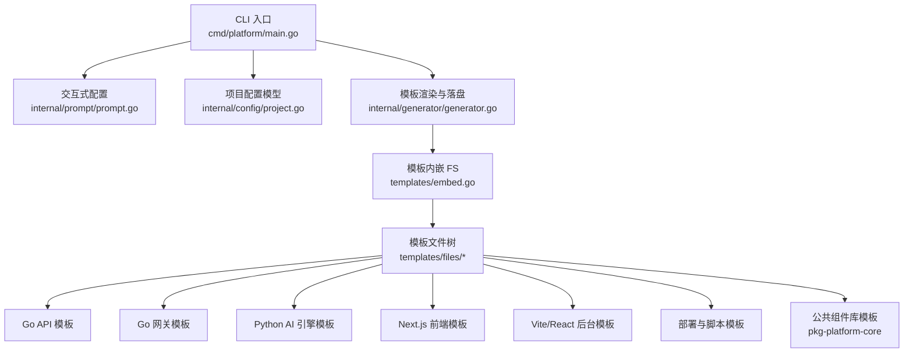
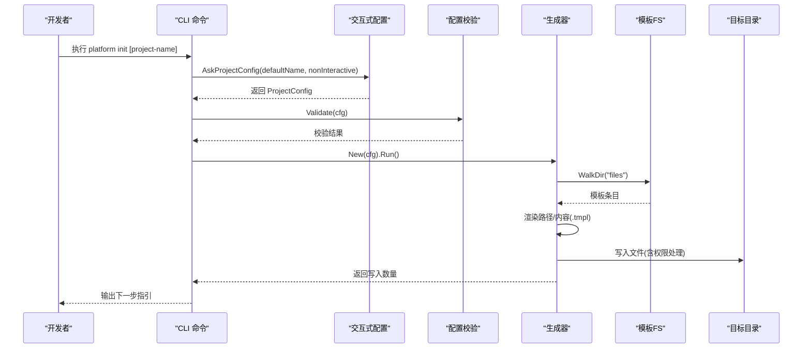
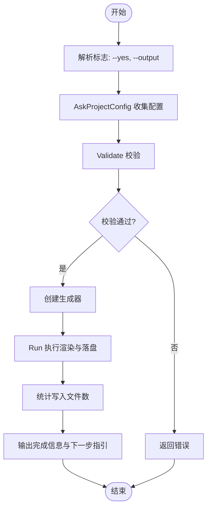
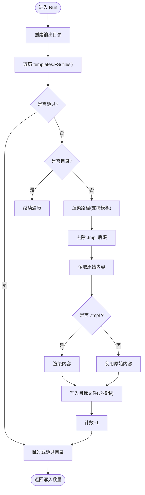
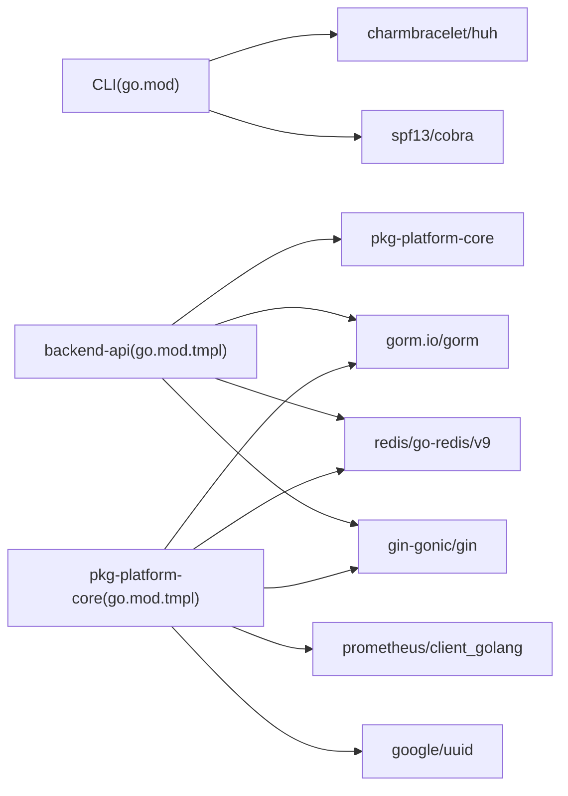

# 开发指南

<cite>
**本文引用的文件**
- [go.mod](file://go.mod)
- [README.md](file://README.md)
- [cmd/platform/main.go](file://cmd/platform/main.go)
- [internal/config/project.go](file://internal/config/project.go)
- [internal/generator/generator.go](file://internal/generator/generator.go)
- [internal/prompt/prompt.go](file://internal/prompt/prompt.go)
- [templates/embed.go](file://templates/embed.go)
- [templates/files/backend-api/go.mod.tmpl](file://templates/files/backend-api/go.mod.tmpl)
- [templates/files/pkg-platform-core/go.mod.tmpl](file://templates/files/pkg-platform-core/go.mod.tmpl)
- [templates/files/frontend-web/package.json.tmpl](file://templates/files/frontend-web/package.json.tmpl)
- [templates/files/deploy/local/start.sh.tmpl](file://templates/files/deploy/local/start.sh.tmpl)
- [templates/files/backend-gateway/cmd/gateway/main.go.tmpl](file://templates/files/backend-gateway/cmd/gateway/main.go.tmpl)
- [templates/files/backend-api/internal/handler/user.go.tmpl](file://templates/files/backend-api/internal/handler/user.go.tmpl)
- [templates/files/frontend-web/src/app/page.tsx.tmpl](file://templates/files/frontend-web/src/app/page.tsx.tmpl)
</cite>

## 目录
1. [简介](#简介)
2. [项目结构](#项目结构)
3. [核心组件](#核心组件)
4. [架构总览](#架构总览)
5. [详细组件分析](#详细组件分析)
6. [依赖分析](#依赖分析)
7. [性能考虑](#性能考虑)
8. [故障排查指南](#故障排查指南)
9. [结论](#结论)
10. [附录](#附录)

## 简介
本指南面向希望参与平台脚手架项目开发与贡献的工程师，覆盖开发环境搭建、代码规范、贡献流程、Go 模块与依赖管理、构建流程、前端开发环境配置、TypeScript 使用与 UI 组件开发规范、代码审查标准、测试策略、持续集成配置、调试技巧、性能分析与问题排查方法。项目采用 CLI 交互式生成“Go 网关 + Go API + Python AI 引擎 + Next.js 前端 + 部署”一体化骨架，并通过模板系统内嵌二进制，确保生成项目的一致性与可复用性。

## 项目结构
- CLI 入口与命令定义位于 cmd/platform/main.go，使用 cobra 构建子命令（init/version）。
- 交互式配置收集位于 internal/prompt/prompt.go，使用 huh 构建 TUI 表单。
- 项目配置模型位于 internal/config/project.go，定义模板渲染所需变量与校验逻辑。
- 模板渲染与落盘位于 internal/generator/generator.go，基于 embed.FS 遍历模板树，按 Features 与路径规则渲染并写入目标目录。
- 模板资源通过 templates/embed.go 内嵌至二进制，templates/files 下存放所有模板文件（含 .tmpl 后缀）。
- README.md 提供使用说明、模板目录结构、贡献原则与许可证。

**图表来源**
- [cmd/platform/main.go:22-38](file://cmd/platform/main.go#L22-L38)
- [internal/prompt/prompt.go:13-105](file://internal/prompt/prompt.go#L13-L105)
- [internal/config/project.go:12-41](file://internal/config/project.go#L12-L41)
- [internal/generator/generator.go:33-103](file://internal/generator/generator.go#L33-L103)
- [templates/embed.go:1-12](file://templates/embed.go#L1-L12)

**章节来源**
- [README.md:61-83](file://README.md#L61-L83)
- [cmd/platform/main.go:22-38](file://cmd/platform/main.go#L22-L38)
- [internal/prompt/prompt.go:13-105](file://internal/prompt/prompt.go#L13-L105)
- [internal/config/project.go:12-41](file://internal/config/project.go#L12-L41)
- [internal/generator/generator.go:33-103](file://internal/generator/generator.go#L33-L103)
- [templates/embed.go:1-12](file://templates/embed.go#L1-L12)

## 核心组件
- CLI 子命令与入口
  - init 子命令：收集配置、校验、生成项目并输出下一步指引。
  - version 子命令：打印版本信息。
- 交互式配置收集
  - 使用 huh 构建多组表单，收集项目名、品牌名、域名、Go module 路径、端口、模块开关、是否初始化 Git 等。
- 项目配置模型
  - ProjectConfig：包含 ProjectName、Brand、Domain、GoModulePath、Ports、Features、UseCoreLib、InitGit、OutputDir 等字段。
  - 默认值与校验：Defaults 提供合理默认；Validate 校验格式与必填项。
- 模板渲染与落盘
  - 遍历 embed.FS，按 Features 与路径规则跳过子树；.tmpl 后缀自动去除；路径与内容均支持模板渲染；可执行文件（.sh）赋予执行权限。

**章节来源**
- [cmd/platform/main.go:40-97](file://cmd/platform/main.go#L40-L97)
- [internal/prompt/prompt.go:13-105](file://internal/prompt/prompt.go#L13-L105)
- [internal/config/project.go:62-106](file://internal/config/project.go#L62-L106)
- [internal/generator/generator.go:33-158](file://internal/generator/generator.go#L33-L158)

## 架构总览
CLI 通过交互式表单收集配置，校验后调用生成器，遍历模板树进行渲染与落盘。模板中包含 Go、Python、TypeScript/Next.js、Docker/Kubernetes 配置以及部署脚本，形成完整的微服务骨架。

**图表来源**
- [cmd/platform/main.go:48-81](file://cmd/platform/main.go#L48-L81)
- [internal/prompt/prompt.go:13-105](file://internal/prompt/prompt.go#L13-L105)
- [internal/config/project.go:91-106](file://internal/config/project.go#L91-L106)
- [internal/generator/generator.go:33-103](file://internal/generator/generator.go#L33-L103)

## 详细组件分析

### CLI 与命令流程
- init 子命令
  - 支持 --yes 非交互模式（需显式提供项目名）。
  - 支持 --output/-o 指定输出目录，默认与项目名一致。
  - 校验通过后创建生成器并执行 Run，最后输出下一步指引。
- version 子命令
  - 打印版本字符串。

**图表来源**
- [cmd/platform/main.go:48-81](file://cmd/platform/main.go#L48-L81)
- [internal/config/project.go:91-106](file://internal/config/project.go#L91-L106)

**章节来源**
- [cmd/platform/main.go:40-97](file://cmd/platform/main.go#L40-L97)

### 交互式配置与校验
- 字段与校验
  - ProjectName：kebab-case 格式校验。
  - Brand、GoModulePath、Ports（Gateway/API 端口 > 0）必填校验。
- 默认值
  - Defaults 提供合理的默认值，包括端口、模块开关、UseCoreLib、InitGit 等。

**章节来源**
- [internal/config/project.go:91-121](file://internal/config/project.go#L91-L121)
- [internal/prompt/prompt.go:13-105](file://internal/prompt/prompt.go#L13-L105)

### 模板渲染与落盘
- 路径与内容渲染
  - 路径本身支持模板变量（如目录名、文件名）。
  - 内容仅对 .tmpl 文件进行渲染，非 .tmpl 直接复制。
- 特性开关
  - Features.AIEngine/Web/Admin 与 UseCoreLib 控制子树是否渲染。
- 权限处理
  - .sh 文件赋予执行权限；其他文件默认 0644。

**图表来源**
- [internal/generator/generator.go:33-103](file://internal/generator/generator.go#L33-L103)

**章节来源**
- [internal/generator/generator.go:33-158](file://internal/generator/generator.go#L33-L158)
- [templates/embed.go:1-12](file://templates/embed.go#L1-L12)

### Go 模块与依赖管理
- CLI 与模板模块
  - CLI 使用 Go 1.22，依赖 cobra 与 huh。
  - 模板模块（backend-api、pkg-platform-core）同样使用 Go 1.22。
- 依赖版本控制
  - go.mod 明确 Go 版本与直接依赖。
  - 模板中的 go.mod.tmpl 通过 {{.GoModulePath}} 动态生成 module 路径，并根据 UseCoreLib 决定是否添加 replace 指向本地 pkg-platform-core。
- 构建流程
  - CLI 通过 go build 生成自包含二进制，模板内嵌于二进制，无需外部文件即可运行。

**章节来源**
- [go.mod:1-37](file://go.mod#L1-L37)
- [templates/files/backend-api/go.mod.tmpl:1-16](file://templates/files/backend-api/go.mod.tmpl#L1-L16)
- [templates/files/pkg-platform-core/go.mod.tmpl:1-12](file://templates/files/pkg-platform-core/go.mod.tmpl#L1-L12)

### 前端开发环境配置与 TypeScript 规范
- Next.js 15 与 React 19
  - package.json.tmpl 定义 dev/build/start/lint 脚本，端口来自 Ports.Web。
  - tsconfig.json 与 next.config.mjs.tmpl 由模板提供。
- Vite + React 后台
  - vite.config.ts.tmpl 与 package.json.tmpl 提供开发与构建配置。
- JSX 双大括号冲突规避
  - 模板说明建议将 style={{...}} 改为变量形式以避免与 Go template 冲突。

**章节来源**
- [templates/files/frontend-web/package.json.tmpl:1-25](file://templates/files/frontend-web/package.json.tmpl#L1-L25)
- [templates/files/frontend-web/src/app/page.tsx.tmpl:1-18](file://templates/files/frontend-web/src/app/page.tsx.tmpl#L1-L18)
- [README.md:93-94](file://README.md#L93-L94)

### UI 组件开发规范
- 统一错误码与响应格式
  - Go API 通过 pkg-platform-core/response 提供统一响应封装，确保前后端一致的错误码与结构。
- 网关侧鉴权与转发
  - 网关负责 JWT 解析与限流，下游 API 仅需读取 X-User-UUID 头即可识别用户。
- 组件库解耦
  - pkg-platform-core 通过接口（如 JWTValidator）解耦，避免业务包之间的直接 import。

**章节来源**
- [templates/files/backend-api/internal/handler/user.go.tmpl:1-47](file://templates/files/backend-api/internal/handler/user.go.tmpl#L1-L47)
- [templates/files/backend-gateway/cmd/gateway/main.go.tmpl:1-92](file://templates/files/backend-gateway/cmd/gateway/main.go.tmpl#L1-L92)
- [README.md:54-57](file://README.md#L54-L57)

### 本地开发与一键启动脚本
- start.sh.tmpl
  - 支持 start/stop/restart/status/logs 等命令。
  - 自动检查依赖（Go、环境变量文件）、端口占用、进程 PID 管理与日志记录。
  - 支持分组启动（all/backend/web），并按 Features 开关渲染对应服务。
- 端口与服务映射
  - 通过 Ports.* 与环境变量文件联动，确保各服务端口一致。

**章节来源**
- [templates/files/deploy/local/start.sh.tmpl:1-242](file://templates/files/deploy/local/start.sh.tmpl#L1-L242)

## 依赖分析
- 直接依赖
  - cobra：命令行框架。
  - huh：TUI 表单。
- 间接依赖
  - bubbletea、lipgloss 等终端 UI 工具链，保障交互体验。
- 模板模块依赖
  - backend-api 依赖 Gin、Redis、GORM、pkg-platform-core（可替换为本地路径）。
  - pkg-platform-core 依赖 Gin、UUID、Prometheus、Redis、GORM。

**图表来源**
- [go.mod:5-36](file://go.mod#L5-L36)
- [templates/files/backend-api/go.mod.tmpl:5-15](file://templates/files/backend-api/go.mod.tmpl#L5-L15)
- [templates/files/pkg-platform-core/go.mod.tmpl:5-11](file://templates/files/pkg-platform-core/go.mod.tmpl#L5-L11)

**章节来源**
- [go.mod:1-37](file://go.mod#L1-L37)
- [templates/files/backend-api/go.mod.tmpl:1-16](file://templates/files/backend-api/go.mod.tmpl#L1-L16)
- [templates/files/pkg-platform-core/go.mod.tmpl:1-12](file://templates/files/pkg-platform-core/go.mod.tmpl#L1-L12)

## 性能考虑
- 模板内嵌与自包含
  - 通过 embed 将模板内嵌进二进制，减少运行时 IO 与外部依赖，提升生成速度与可移植性。
- 限流与指标
  - 网关使用 Redis 计数限流与 Prometheus 指标，便于观测与容量规划。
- 日志与健康检查
  - start.sh.tmpl 提供日志追踪与健康端点，便于快速定位问题。

**章节来源**
- [internal/generator/generator.go:33-103](file://internal/generator/generator.go#L33-L103)
- [templates/files/backend-gateway/cmd/gateway/main.go.tmpl:33-66](file://templates/files/backend-gateway/cmd/gateway/main.go.tmpl#L33-L66)
- [templates/files/deploy/local/start.sh.tmpl:172-183](file://templates/files/deploy/local/start.sh.tmpl#L172-L183)

## 故障排查指南
- 生成失败
  - 检查配置校验：ProjectName 格式、端口合法性、必填项。
  - 确认模板渲染：是否存在 .tmpl 未正确渲染导致语法错误。
- 本地启动异常
  - 确认环境变量文件存在且端口未被占用。
  - 使用 status 查看各服务 PID 与端口监听状态；使用 logs 查看最近日志。
- 网关鉴权问题
  - 确认下游服务是否正确注入 X-User-UUID 头；核对网关 JWT 配置与 PublicPaths 设置。
- 依赖缺失
  - CLI 需要 Go；前端需要 Node/NPM；AI 引擎需要 Python 与 pip 依赖。

**章节来源**
- [internal/config/project.go:91-106](file://internal/config/project.go#L91-L106)
- [templates/files/deploy/local/start.sh.tmpl:60-108](file://templates/files/deploy/local/start.sh.tmpl#L60-L108)
- [templates/files/backend-api/internal/handler/user.go.tmpl:28-46](file://templates/files/backend-api/internal/handler/user.go.tmpl#L28-L46)

## 结论
本指南提供了从开发环境到模板生成、从后端到前端、从本地开发到部署运维的全链路开发与贡献方法。遵循模板变量命名、特性开关与公共组件库解耦原则，可确保生成项目的质量与一致性。建议在修改模板后，先执行 CLI 构建与生成测试，再进行功能联调与部署验证。

## 附录

### 开发环境搭建
- 安装 Go 1.22+
- 克隆仓库并安装 CLI：参考 README 的安装与初始化步骤。
- 准备本地开发工具：Node.js、Python（用于 AI 引擎）、Docker（用于部署）。

**章节来源**
- [README.md:23-48](file://README.md#L23-L48)

### 代码规范与贡献流程
- 业务无关：模板中避免出现具体业务术语。
- 模板变量：新增变量需同步更新 ProjectConfig 并在模板中使用。
- 文件后缀：涉及模板变量的 .go/.py/.tsx/.ts 统一使用 .tmpl 后缀。
- 跨模块依赖：通过接口解耦，禁止直接 import 业务包。
- 测试与验证：修改模板后，先构建 CLI 并生成测试项目，确认可编译与运行。

**章节来源**
- [README.md:87-94](file://README.md#L87-L94)
- [internal/config/project.go:12-41](file://internal/config/project.go#L12-L41)

### 代码审查标准
- 配置与校验：确保 ProjectConfig 字段齐全、校验逻辑完备。
- 模板渲染：路径与内容渲染正确，无语法错误；必要时补充注释说明。
- 依赖与版本：go.mod 与模板 go.mod.tmpl 版本一致；replace 仅在需要时启用。
- 前端规范：TypeScript 与 ESLint 配置符合模板；避免 JSX 与模板大括号冲突。
- 文档与变更：README 与模板说明同步更新。

**章节来源**
- [internal/config/project.go:91-106](file://internal/config/project.go#L91-L106)
- [templates/files/backend-api/go.mod.tmpl:10-15](file://templates/files/backend-api/go.mod.tmpl#L10-L15)
- [README.md:93-94](file://README.md#L93-L94)

### 测试策略
- 单元测试：Go 模块（如 pkg-platform-core）提供测试文件模板，建议补充单元测试。
- 集成测试：通过 start.sh.tmpl 启动完整栈，验证网关、API、AI 引擎与前端连通性。
- 端到端：在生成的项目中执行 build/start/lint，确保前端与后端均可正常构建与运行。

**章节来源**
- [templates/files/pkg-platform-core/go.mod.tmpl:1-12](file://templates/files/pkg-platform-core/go.mod.tmpl#L1-L12)
- [templates/files/deploy/local/start.sh.tmpl:1-242](file://templates/files/deploy/local/start.sh.tmpl#L1-L242)

### 持续集成配置
- 建议在 CI 中执行以下步骤：
  - 安装 Go 与 Node.js/Python。
  - 构建 CLI：go build ./cmd/platform。
  - 生成测试项目：./platform init demo-test。
  - 运行 lint 与构建：前端 lint/build，后端 go vet/test。
  - 启动本地栈验证：使用 start.sh 启动并检查健康端点。

**章节来源**
- [cmd/platform/main.go:22-38](file://cmd/platform/main.go#L22-L38)
- [templates/files/deploy/local/start.sh.tmpl:204-242](file://templates/files/deploy/local/start.sh.tmpl#L204-L242)

### 调试技巧
- 生成阶段：开启详细日志，检查渲染路径与内容；确认 .tmpl 后缀移除与权限设置。
- 运行阶段：使用 start.sh 的 status/logs；结合网关 /metrics 与下游日志定位问题。
- 前端调试：利用 Next.js/Vite 的 dev server 端口与热重载；检查环境变量与代理配置。

**章节来源**
- [internal/generator/generator.go:122-147](file://internal/generator/generator.go#L122-L147)
- [templates/files/deploy/local/start.sh.tmpl:172-233](file://templates/files/deploy/local/start.sh.tmpl#L172-L233)