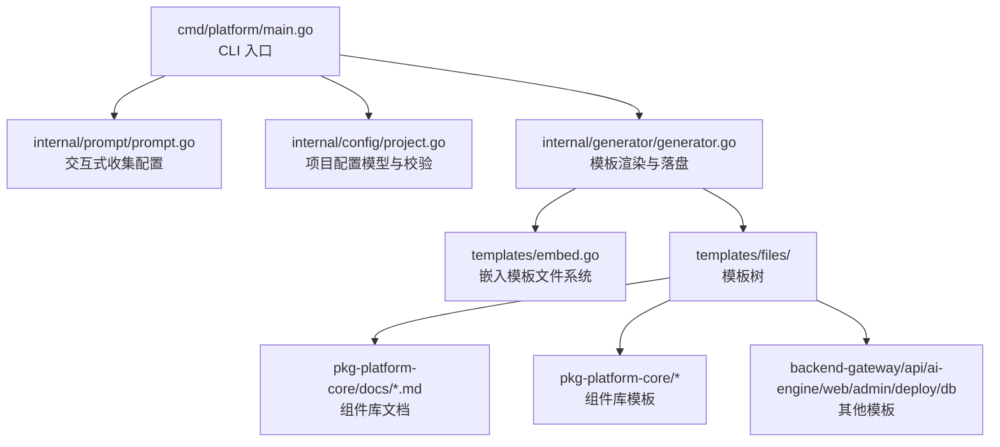
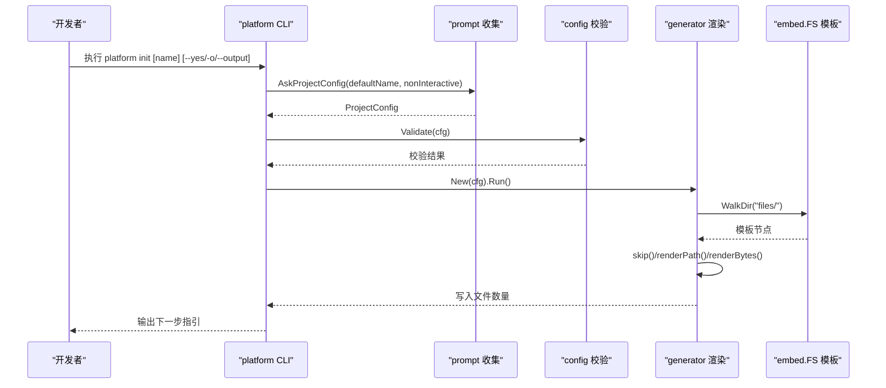
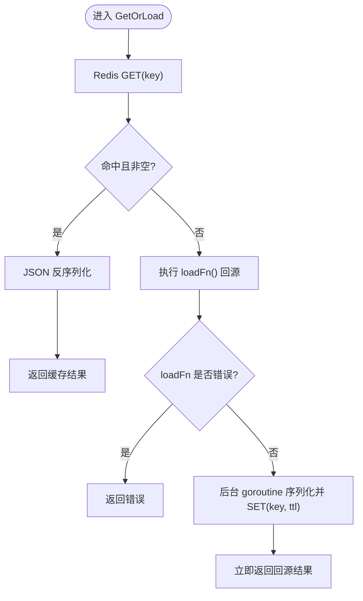
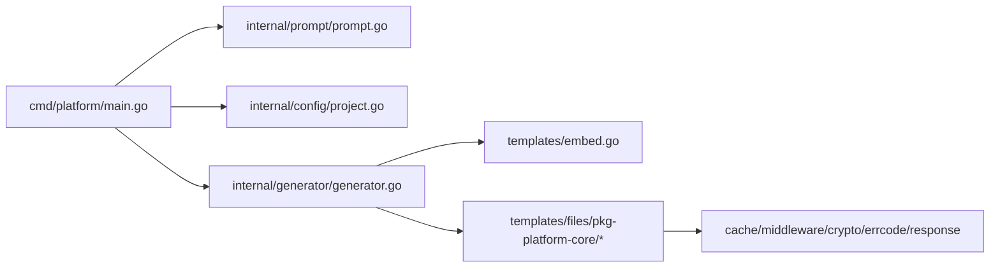

# 开发流程

<cite>
**本文引用的文件**
- [README.md](file://README.md)
- [go.mod](file://go.mod)
- [cmd/platform/main.go](file://cmd/platform/main.go)
- [internal/config/project.go](file://internal/config/project.go)
- [internal/generator/generator.go](file://internal/generator/generator.go)
- [internal/prompt/prompt.go](file://internal/prompt/prompt.go)
- [templates/files/pkg-platform-core/docs/README.md](file://templates/files/pkg-platform-core/docs/README.md)
- [templates/files/pkg-platform-core/docs/cache.md](file://templates/files/pkg-platform-core/docs/cache.md)
- [templates/files/pkg-platform-core/docs/crypto.md](file://templates/files/pkg-platform-core/docs/crypto.md)
- [templates/files/pkg-platform-core/docs/dynconfig.md](file://templates/files/pkg-platform-core/docs/dynconfig.md)
- [templates/files/pkg-platform-core/docs/errcode.md](file://templates/files/pkg-platform-core/docs/errcode.md)
- [templates/files/pkg-platform-core/docs/middleware.md](file://templates/files/pkg-platform-core/docs/middleware.md)
- [templates/files/pkg-platform-core/docs/response.md](file://templates/files/pkg-platform-core/docs/response.md)
- [templates/files/pkg-platform-core/cache/cache.go.tmpl](file://templates/files/pkg-platform-core/cache/cache.go.tmpl)
- [templates/files/pkg-platform-core/crypto/aes_gcm.go.tmpl](file://templates/files/pkg-platform-core/crypto/aes_gcm.go.tmpl)
- [templates/files/pkg-platform-core/errcode/errcode.go.tmpl](file://templates/files/pkg-platform-core/errcode/errcode.go.tmpl)
- [templates/files/pkg-platform-core/middleware/middleware.go.tmpl](file://templates/files/pkg-platform-core/middleware/middleware.go.tmpl)
- [templates/files/pkg-platform-core/response/response.go.tmpl](file://templates/files/pkg-platform-core/response/response.go.tmpl)
</cite>

## 目录
1. [简介](#简介)
2. [项目结构](#项目结构)
3. [核心组件](#核心组件)
4. [架构总览](#架构总览)
5. [详细组件分析](#详细组件分析)
6. [依赖分析](#依赖分析)
7. [性能考量](#性能考量)
8. [故障排查指南](#故障排查指南)
9. [结论](#结论)
10. [附录](#附录)

## 简介
本文件旨在为平台脚手架项目建立一套标准化的开发流程文档，涵盖代码提交规范、分支管理策略、版本发布流程、核心库模块开发模式（缓存系统、加密模块、动态配置、错误码体系、中间件与响应处理）、代码审查检查清单、自动化测试与持续集成配置建议、文档编写规范、API 变更管理与向后兼容性考虑。  
该脚手架以 CLI 为核心，通过模板渲染生成“Go 网关 + Go API + Python AI 引擎 + Next.js 前端 + 部署”一体化骨架，并内置 pkg-platform-core 通用组件库，确保跨语言一致性与最佳实践落地。

## 项目结构
仓库采用“CLI + 模板引擎”的结构：CLI 负责交互式收集项目配置，生成器负责遍历嵌入的模板树，按规则渲染并落盘；模板目录下包含后端网关、API、AI 引擎、前端、部署与数据库初始化脚本，以及 pkg-platform-core 通用组件库文档与模板。

图表来源
- [cmd/platform/main.go:1-98](file://cmd/platform/main.go#L1-L98)
- [internal/prompt/prompt.go:1-131](file://internal/prompt/prompt.go#L1-L131)
- [internal/config/project.go:1-121](file://internal/config/project.go#L1-L121)
- [internal/generator/generator.go:1-158](file://internal/generator/generator.go#L1-L158)

章节来源
- [README.md:1-98](file://README.md#L1-L98)
- [go.mod:1-37](file://go.mod#L1-L37)
- [cmd/platform/main.go:1-98](file://cmd/platform/main.go#L1-L98)
- [internal/config/project.go:1-121](file://internal/config/project.go#L1-L121)
- [internal/generator/generator.go:1-158](file://internal/generator/generator.go#L1-L158)
- [internal/prompt/prompt.go:1-131](file://internal/prompt/prompt.go#L1-L131)

## 核心组件
- 项目配置与校验：定义 ProjectConfig 结构体及默认值、校验规则，保证模板渲染所需变量合法。
- 交互式收集：基于 huh 的 TUI 表单，支持非交互模式与默认值注入。
- 模板渲染与落盘：遍历嵌入的模板树，按 Features 开关与路径规则渲染，剥离 .tmpl 后缀，赋予可执行权限（.sh）。
- 通用组件库（pkg-platform-core）：提供缓存、加密、动态配置、错误码、中间件、响应格式等跨语言一致的基础设施。

章节来源
- [internal/config/project.go:1-121](file://internal/config/project.go#L1-L121)
- [internal/prompt/prompt.go:1-131](file://internal/prompt/prompt.go#L1-L131)
- [internal/generator/generator.go:1-158](file://internal/generator/generator.go#L1-L158)
- [templates/files/pkg-platform-core/docs/README.md:1-23](file://templates/files/pkg-platform-core/docs/README.md#L1-L23)

## 架构总览
CLI 通过 Cobra 提供 init/version 子命令；init 流程串联交互收集、配置校验、生成器执行与输出提示；生成器基于 embed.FS 遍历模板树，按 Features 与路径规则渲染，最终在目标目录生成完整项目骨架。

图表来源
- [cmd/platform/main.go:40-86](file://cmd/platform/main.go#L40-L86)
- [internal/prompt/prompt.go:13-104](file://internal/prompt/prompt.go#L13-L104)
- [internal/config/project.go:91-106](file://internal/config/project.go#L91-L106)
- [internal/generator/generator.go:33-102](file://internal/generator/generator.go#L33-L102)

## 详细组件分析

### 代码提交规范
- 提交信息
  - 类型限定：feat、fix、docs、style、refactor、test、chore、revert
  - 标题格式：类型(作用域): 概述（不超过 50 字）
  - 说明：空一行后写详细说明，必要时关联 Issue
- 分支命名
  - 功能：feature/短横线命名
  - 修复：fix/短横线命名
  - 文档：docs/短横线命名
  - 其他：chore/短横线命名
- 提交粒度
  - 一次提交仅解决一个问题或一个小功能
  - 避免混杂无关改动
- 代码风格
  - Go：遵循 gofmt、goimports；避免魔法数字；注释清晰
  - JS/TS：遵循 Prettier/Airbnb 规范
  - Python：遵循 Black/PEP8 规范
- 提交前检查
  - 本地构建通过
  - 单元测试与集成测试通过
  - 无敏感信息泄露（密钥、令牌）

### 分支管理策略
- 主分支
  - main：稳定版本，合并经 CI 与评审的特性分支
- 发布分支
  - release/X.Y：从 main 切出，仅做补丁与文档修正
- 功能分支
  - feature/*：从 main 切出，完成后合并到 main
- 热修复分支
  - hotfix/*：从 release/* 切出，修复后同时合并到 main 与 release
- 合并与冲突解决
  - 使用 squash merge 合并功能分支，保留清晰历史
  - 冲突优先 rebase 解决，避免不必要的合并提交

### 版本发布流程
- 版本号
  - 遵循语义化版本：主版本.次版本.修订号
- 发布前检查
  - 所有测试通过，无高危缺陷
  - 更新 CHANGELOG，记录变更摘要
  - 更新 README 与相关文档
- 发布步骤
  - 在 main 上打标签并推送
  - 生成发布说明，附带构建产物
  - 更新模板中的版本号（如适用）
- 回滚策略
  - 若问题严重，回滚到上一个稳定标签
  - 通知相关团队并发布紧急修复

### 核心库模块开发模式

#### 缓存系统（Cache-Aside + 异步回填）
- 设计要点
  - 泛型 GetOrLoad：先查缓存，miss 则调用回源函数，成功后异步回填
  - Invalidate/InvalidatePattern：支持单键失效与通配符扫描删除
  - key 命名建议：cache:<实体>:<唯一标识>
- 处理流程

图表来源
- [templates/files/pkg-platform-core/cache/cache.go.tmpl:28-58](file://templates/files/pkg-platform-core/cache/cache.go.tmpl#L28-L58)
- [templates/files/pkg-platform-core/docs/cache.md:32-43](file://templates/files/pkg-platform-core/docs/cache.md#L32-L43)

章节来源
- [templates/files/pkg-platform-core/cache/cache.go.tmpl:1-93](file://templates/files/pkg-platform-core/cache/cache.go.tmpl#L1-L93)
- [templates/files/pkg-platform-core/docs/cache.md:1-61](file://templates/files/pkg-platform-core/docs/cache.md#L1-L61)

#### 加密模块（AES-256-GCM，跨语言对齐）
- 设计要点
  - 密钥派生：SHA-256 将任意长度 masterKey 派生为 32 字节 AES 密钥
  - 密文格式：Base64(nonce_12 + ciphertext + tag_16)，相同明文+密钥每次不同（nonce 随机）
  - 与 Python 端完全对齐，支持双向解密
- 使用注意
  - masterKey 通过环境变量注入，禁止硬编码
  - masterKey 更换后旧密文不可解，需迁移
  - 降级：masterKey 为空时跳过加密项加载

章节来源
- [templates/files/pkg-platform-core/crypto/aes_gcm.go.tmpl:1-72](file://templates/files/pkg-platform-core/crypto/aes_gcm.go.tmpl#L1-L72)
- [templates/files/pkg-platform-core/docs/crypto.md:1-70](file://templates/files/pkg-platform-core/docs/crypto.md#L1-L70)

#### 动态配置（system_config 表，启动时加载）
- 设计要点
  - 启动时从数据库加载配置，加密项自动解密
  - 仅启动时加载，不支持热更新（后续可用缓存+定时刷新）
  - 优雅降级：masterKey 为空或数据库失败仅日志警告
- 使用建议
  - 在 bootstrap 中集中调用 Load/LoadWithOptions
  - Setter 中避免耗时操作，保持同步阻塞时间短

章节来源
- [templates/files/pkg-platform-core/docs/dynconfig.md:1-68](file://templates/files/pkg-platform-core/docs/dynconfig.md#L1-L68)

#### 错误码体系（六位业务码，与 HTTP 状态解耦）
- 设计要点
  - 六位字符串错误码，按业务域分段
  - 业务错误统一 400 + code，鉴权/订阅/内部错误分别映射到 401/403/406/500
  - 通过 Wrap 携带运行时上下文，Detail 仅用于服务端日志
- 使用建议
  - 在业务包内集中声明全局错误码变量
  - 不要硬编码 code，避免破坏前端国际化

章节来源
- [templates/files/pkg-platform-core/errcode/errcode.go.tmpl:1-84](file://templates/files/pkg-platform-core/errcode/errcode.go.tmpl#L1-L84)
- [templates/files/pkg-platform-core/docs/errcode.md:1-67](file://templates/files/pkg-platform-core/docs/errcode.md#L1-L67)

#### 中间件（JWT/内部鉴权/限流/CORS/指标）
- 组件清单
  - RequestID：生成或透传 X-Request-ID
  - CORS：白名单 origin + AllowCredentials
  - JWT：Bearer 校验 + 公开路径白名单 + 过期返回 403
  - InternalAuth：X-Internal-Secret 校验（常量时间比较）
  - RateLimit：Redis 固定窗口限流（fail-open）
  - PrometheusMetrics：HTTP 指标采集
- 顺序建议
  - Gateway：Recovery → CORS → RequestID → Metrics → JWT → RateLimit
  - API：Recovery → RequestID → Metrics → InternalAuth

章节来源
- [templates/files/pkg-platform-core/middleware/middleware.go.tmpl:1-202](file://templates/files/pkg-platform-core/middleware/middleware.go.tmpl#L1-L202)
- [templates/files/pkg-platform-core/docs/middleware.md:1-171](file://templates/files/pkg-platform-core/docs/middleware.md#L1-L171)

#### 响应处理（统一 JSON 结构）
- 设计要点
  - 统一 {code, msg, data} 结构，与 Java Response<T> 对齐
  - HTTP 状态码与业务码分离：HTTP 200 + code 非 "200" 表示业务错误
- 常用方法
  - OK/OKPage：成功返回
  - BadRequest/Unauthorized/Forbidden/PaymentRequired/NotAcceptable/InternalError：各类错误
  - Err：自定义状态码

章节来源
- [templates/files/pkg-platform-core/response/response.go.tmpl:1-78](file://templates/files/pkg-platform-core/response/response.go.tmpl#L1-L78)
- [templates/files/pkg-platform-core/docs/response.md:1-74](file://templates/files/pkg-platform-core/docs/response.md#L1-L74)

### 代码审查检查清单
- 代码质量
  - 通过静态检查（gofmt、goimports、ESLint、Prettier）
  - 无魔法数字/字符串；注释清晰
- 安全
  - 无敏感信息硬编码；密钥通过环境变量注入
  - 使用常量时间比较；输入参数校验
- 兼容性
  - API 变更评估向后兼容性
  - 错误码不复用/不随意修改
- 可测试性
  - 单元测试覆盖核心逻辑
  - 集成测试覆盖外部依赖（Redis/DB）
- 文档
  - 变更补充/更新文档
  - README/CHANGELOG 更新

### 自动化测试与持续集成
- 测试策略
  - 单元测试：go test ./...
  - 集成测试：依赖 Redis/DB 的场景单独测试
  - 端到端：通过模板生成项目后进行端到端验证
- CI 建议
  - 触发条件：push 到 feature/*、hotfix/*、pull request
  - 步骤：安装依赖 → 构建 → 单测 → 集成测试 → 代码覆盖率检查 → 构建模板产物
  - 产物：二进制与模板压缩包
- 发布流水线
  - 仅在 main 打标签触发发布
  - 生成发布说明与附件

### 文档编写规范
- 结构
  - README：项目背景、使用方式、核心约定
  - docs/*.md：组件库文档与使用说明
- 内容
  - API：参数、返回值、错误码、示例
  - 设计：流程图、类图、时序图
  - 注意事项：边界条件、性能影响、兼容性
- 维护
  - 变更即更新
  - 保持与模板实现一致

### API 变更管理与向后兼容
- 变更分类
  - 兼容变更：新增字段、新增接口
  - 非兼容变更：删除字段、修改语义、错误码调整
- 管理流程
  - 设计评审：明确影响范围与迁移成本
  - 版本规划：在 release/X.Y 中合并
  - 迁移指南：提供升级步骤与兼容策略
- 错误码
  - 不复用已有 code
  - 新增 code 时在 CHANGELOG 与前端国际化表同步

## 依赖分析
- CLI 依赖
  - cobra：命令行框架
  - huh：交互式 TUI
- 模板渲染
  - Go 标准库 text/template + embed.FS
- 组件库依赖
  - Redis 客户端：github.com/redis/go-redis/v9
  - Gin：github.com/gin-gonic/gin
  - Prometheus：指标采集（中间件）
- 外部集成
  - Python AI Engine 与 Go/Redis 的跨语言一致性（加密、指标）

图表来源
- [go.mod:5-36](file://go.mod#L5-L36)
- [cmd/platform/main.go:9-18](file://cmd/platform/main.go#L9-L18)
- [internal/generator/generator.go:10-21](file://internal/generator/generator.go#L10-L21)

章节来源
- [go.mod:1-37](file://go.mod#L1-L37)
- [cmd/platform/main.go:1-98](file://cmd/platform/main.go#L1-L98)
- [internal/generator/generator.go:1-158](file://internal/generator/generator.go#L1-L158)

## 性能考量
- 缓存
  - 异步回填避免阻塞主流程，但需关注 thundering herd，必要时在回源函数中加分布式锁
  - 使用 SCAN 替代 KEYS，避免生产阻塞
- 加密
  - masterKey 派生与 AES-GCM 计算开销可控，注意密文长度与网络传输成本
- 中间件
  - PrometheusMetrics 尽量靠前，减少漏采样
  - RateLimit 放在 JWT 之后，确保能拿到 userUUID/IP
- 动态配置
  - 启动时加载，Setter 中避免阻塞；热更新建议结合缓存+定时刷新

## 故障排查指南
- 生成失败
  - 检查配置校验：ProjectName、端口、模块开关
  - 确认输出目录可写，模板路径渲染是否包含非法字符
- 运行期错误
  - 中间件链顺序不当导致鉴权/限流异常
  - Redis/DB 不可用时的优雅降级行为
- 加密与动态配置
  - masterKey 为空导致加密项跳过
  - 密钥不匹配或密文损坏导致解密失败

章节来源
- [internal/config/project.go:91-106](file://internal/config/project.go#L91-L106)
- [internal/generator/generator.go:105-120](file://internal/generator/generator.go#L105-L120)
- [templates/files/pkg-platform-core/docs/middleware.md:165-171](file://templates/files/pkg-platform-core/docs/middleware.md#L165-L171)
- [templates/files/pkg-platform-core/docs/dynconfig.md:34-43](file://templates/files/pkg-platform-core/docs/dynconfig.md#L34-L43)
- [templates/files/pkg-platform-core/docs/crypto.md:64-70](file://templates/files/pkg-platform-core/docs/crypto.md#L64-L70)

## 结论
本标准文档围绕 CLI 驱动的模板化脚手架，建立了从开发、测试、发布到运维的全流程规范，并对核心库模块的设计原则与实现要点进行了系统梳理。遵循上述规范可显著提升协作效率、降低维护成本并保障跨语言一致性与稳定性。

## 附录
- 模板变量与命名
  - ProjectName：kebab-case，作为目录名、服务名、命名空间
  - Brand：展示用品牌名
  - Domain：域名，用于 CORS 与 Cookie domain
  - GoModulePath：Go 模块前缀
  - Ports：各服务端口集合
  - Features：模块开关（AIEngine/Web/Admin）
  - UseCoreLib：是否引入 pkg-platform-core
  - InitGit：是否初始化 Git 仓库
- 生成后步骤
  - 复制环境示例文件、启动本地服务、验证端到端

章节来源
- [internal/config/project.go:12-41](file://internal/config/project.go#L12-L41)
- [internal/prompt/prompt.go:13-104](file://internal/prompt/prompt.go#L13-L104)
- [README.md:21-48](file://README.md#L21-L48)