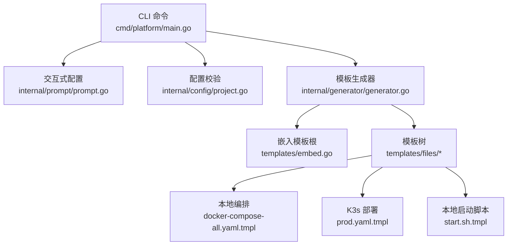
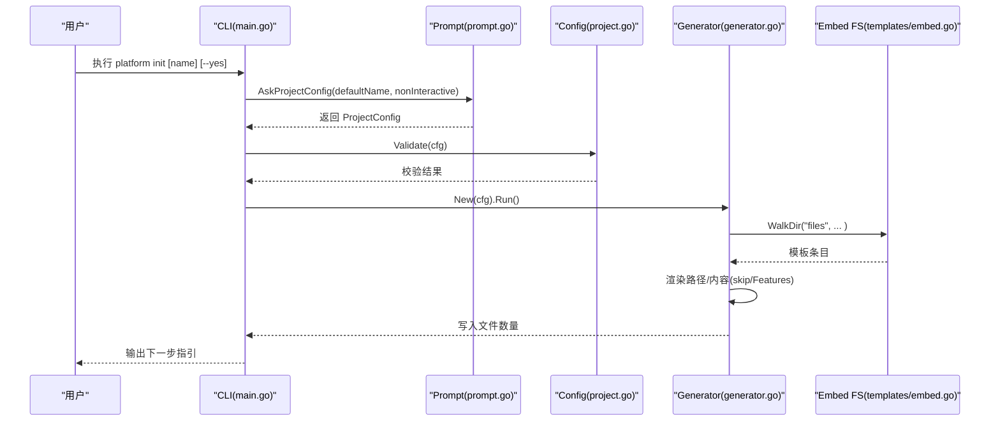
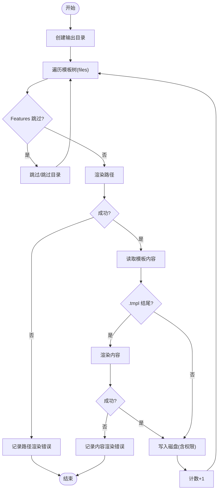
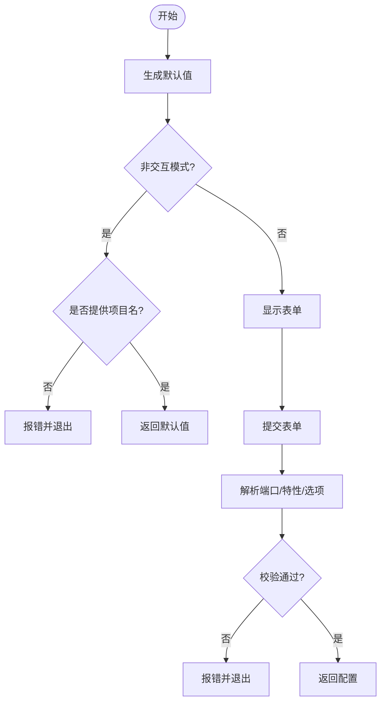
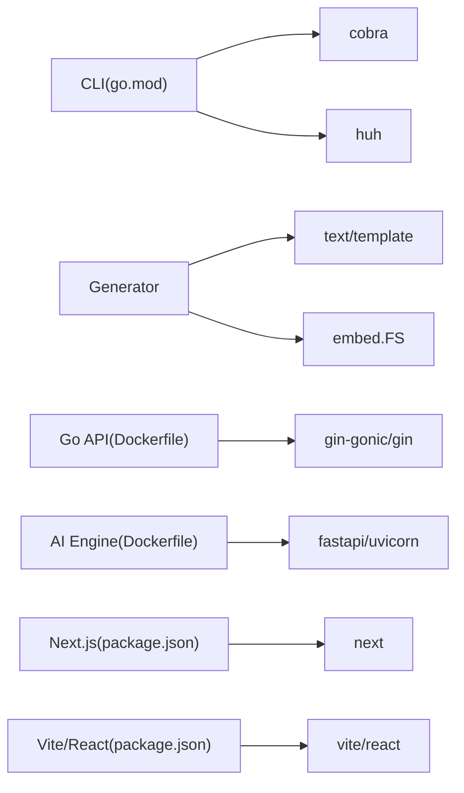

# 故障排除

<cite>
**本文引用的文件**
- [cmd/platform/main.go](file://cmd/platform/main.go)
- [internal/config/project.go](file://internal/config/project.go)
- [internal/generator/generator.go](file://internal/generator/generator.go)
- [internal/prompt/prompt.go](file://internal/prompt/prompt.go)
- [templates/embed.go](file://templates/embed.go)
- [templates/files/backend-api/cmd/api/main.go.tmpl](file://templates/files/backend-api/cmd/api/main.go.tmpl)
- [templates/files/backend-api/Dockerfile.tmpl](file://templates/files/backend-api/Dockerfile.tmpl)
- [templates/files/backend-ai-engine/Dockerfile.tmpl](file://templates/files/backend-ai-engine/Dockerfile.tmpl)
- [templates/files/backend-ai-engine/requirements.txt](file://templates/files/backend-ai-engine/requirements.txt)
- [templates/files/deploy/local/docker-compose-all.yaml.tmpl](file://templates/files/deploy/local/docker-compose-all.yaml.tmpl)
- [templates/files/deploy/local/start.sh.tmpl](file://templates/files/deploy/local/start.sh.tmpl)
- [templates/files/deploy/k3s/prod.yaml.tmpl](file://templates/files/deploy/k3s/prod.yaml.tmpl)
- [templates/files/frontend-web/package.json.tmpl](file://templates/files/frontend-web/package.json.tmpl)
- [templates/files/pkg-platform-core/crypto/aes_gcm.go.tmpl](file://templates/files/pkg-platform-core/crypto/aes_gcm.go.tmpl)
- [go.mod](file://go.mod)
</cite>

## 目录
1. [简介](#简介)
2. [项目结构](#项目结构)
3. [核心组件](#核心组件)
4. [架构总览](#架构总览)
5. [详细组件分析](#详细组件分析)
6. [依赖分析](#依赖分析)
7. [性能考虑](#性能考虑)
8. [故障排除指南](#故障排除指南)
9. [结论](#结论)
10. [附录](#附录)

## 简介
本指南面向使用该脚手架生成并运行“多语言微服务平台”（Go 网关 + Go API + Python AI 引擎 + Next.js Web + React Admin）的开发者，聚焦以下常见问题与系统化排查方法：
- 模板渲染错误（路径/内容渲染失败、缺失模板变量）
- 配置加载失败（端口冲突、必填字段校验失败、环境变量未注入）
- 依赖安装问题（Docker 构建失败、Python 依赖安装失败、Node 依赖安装失败）
- 性能问题定位（CPU/内存占用高、慢查询、并发瓶颈）
- 并发问题排查（竞态、死锁、资源泄漏）
- 网络连接问题（端口占用、健康检查失败、跨服务连通性）
- 数据库连接异常（容器内连不通、初始化脚本失败、权限不足）
- 容器启动失败（镜像拉取失败、卷挂载错误、探针失败）
- 日志分析与调试工具使用

## 项目结构
该脚手架采用“CLI + 模板内嵌 + 交互式配置”的设计：
- CLI 入口负责解析命令、收集配置、触发生成
- 配置模块定义 ProjectConfig 并进行基础校验
- 生成器遍历嵌入模板树，按 Features 和路径规则渲染并写入磁盘
- 模板目录包含各服务的 Dockerfile、部署清单、启动脚本与示例配置

图表来源
- [cmd/platform/main.go:22-38](file://cmd/platform/main.go#L22-L38)
- [internal/prompt/prompt.go:14-105](file://internal/prompt/prompt.go#L14-L105)
- [internal/config/project.go:92-106](file://internal/config/project.go#L92-L106)
- [internal/generator/generator.go:34-103](file://internal/generator/generator.go#L34-L103)
- [templates/embed.go:6-12](file://templates/embed.go#L6-L12)

章节来源
- [cmd/platform/main.go:22-38](file://cmd/platform/main.go#L22-L38)
- [internal/config/project.go:12-41](file://internal/config/project.go#L12-L41)
- [internal/generator/generator.go:23-31](file://internal/generator/generator.go#L23-L31)
- [templates/embed.go:6-12](file://templates/embed.go#L6-L12)

## 核心组件
- CLI 主命令与子命令：init、version；错误输出到标准错误并退出非零码
- 交互式配置收集：ProjectConfig 默认值与校验规则
- 模板生成器：遍历嵌入模板、按 Features 跳过子树、渲染路径与内容、写入磁盘
- 模板内嵌：通过 embed 将 templates/files 整体打包进二进制

章节来源
- [cmd/platform/main.go:40-87](file://cmd/platform/main.go#L40-L87)
- [internal/prompt/prompt.go:14-105](file://internal/prompt/prompt.go#L14-L105)
- [internal/config/project.go:92-106](file://internal/config/project.go#L92-L106)
- [internal/generator/generator.go:34-103](file://internal/generator/generator.go#L34-L103)
- [templates/embed.go:6-12](file://templates/embed.go#L6-L12)

## 架构总览
下图展示了从 CLI 到模板渲染与本地/集群部署的关键流程。

图表来源
- [cmd/platform/main.go:48-81](file://cmd/platform/main.go#L48-L81)
- [internal/prompt/prompt.go:14-105](file://internal/prompt/prompt.go#L14-L105)
- [internal/config/project.go:92-106](file://internal/config/project.go#L92-L106)
- [internal/generator/generator.go:34-103](file://internal/generator/generator.go#L34-L103)
- [templates/embed.go:6-12](file://templates/embed.go#L6-L12)

## 详细组件分析

### 组件 A：模板渲染与生成（Generator）
- 关键职责
  - 创建输出目录
  - 遍历嵌入模板树，按 Features 跳过子树
  - 渲染路径与内容（text/template，missingkey=error）
  - 写入磁盘并设置执行权限
- 错误来源
  - 路径渲染失败（模板变量缺失）
  - 内容渲染失败（模板语法错误、变量缺失）
  - 目录创建/写入失败（权限不足、磁盘空间）
- 优化建议
  - 在渲染前预检关键变量
  - 对大文件采用流式写入策略（如后续扩展）

图表来源
- [internal/generator/generator.go:34-103](file://internal/generator/generator.go#L34-L103)
- [internal/generator/generator.go:122-147](file://internal/generator/generator.go#L122-L147)

章节来源
- [internal/generator/generator.go:34-103](file://internal/generator/generator.go#L34-L103)
- [internal/generator/generator.go:122-147](file://internal/generator/generator.go#L122-L147)

### 组件 B：交互式配置收集（Prompt）
- 关键职责
  - 默认值生成（kebab-case 项目名、端口、模块路径等）
  - 非交互模式强制要求显式项目名
  - 表单校验（必填字段、端口数值）
- 常见问题
  - --yes 模式未提供项目名导致失败
  - 端口输入非正整数或冲突

图表来源
- [internal/prompt/prompt.go:14-105](file://internal/prompt/prompt.go#L14-L105)

章节来源
- [internal/prompt/prompt.go:14-105](file://internal/prompt/prompt.go#L14-L105)

### 组件 C：配置校验（Config）
- 关键职责
  - 校验 ProjectName（kebab-case）、Brand、GoModulePath
  - 校验核心端口（Gateway/API）必须大于 0
- 常见问题
  - ProjectName 不符合 kebab-case 规范
  - 端口为 0 或为空

章节来源
- [internal/config/project.go:92-106](file://internal/config/project.go#L92-L106)

### 组件 D：本地启动与日志（start.sh）
- 关键职责
  - 依赖检查（.env 存在、Go 可用）
  - 构建/启动各服务（gateway/api/ai-engine/web/admin）
  - 端口占用处理、PID/日志管理、健康等待
  - 停止/重启/状态/日志查看
- 常见问题
  - .env 未准备
  - 端口被占用且无法释放
  - 服务启动超时或立即退出
  - Python/Node 依赖未安装

章节来源
- [templates/files/deploy/local/start.sh.tmpl:60-108](file://templates/files/deploy/local/start.sh.tmpl#L60-L108)
- [templates/files/deploy/local/start.sh.tmpl:110-146](file://templates/files/deploy/local/start.sh.tmpl#L110-L146)
- [templates/files/deploy/local/start.sh.tmpl:204-242](file://templates/files/deploy/local/start.sh.tmpl#L204-L242)

### 组件 E：容器与部署（Dockerfile/Compose/K3s）
- 关键职责
  - Dockerfile：分阶段构建、暴露端口、运行命令
  - docker-compose：MySQL/Redis 健康检查与数据卷
  - K3s：Deployment/ConfigMap/Secret、探针与条件渲染
- 常见问题
  - 端口映射不一致
  - 探针路径/端口错误
  - Secret 未提前创建
  - 条件渲染导致某些服务未部署

章节来源
- [templates/files/backend-api/Dockerfile.tmpl:1-14](file://templates/files/backend-api/Dockerfile.tmpl#L1-L14)
- [templates/files/backend-ai-engine/Dockerfile.tmpl:1-14](file://templates/files/backend-ai-engine/Dockerfile.tmpl#L1-L14)
- [templates/files/deploy/local/docker-compose-all.yaml.tmpl:9-48](file://templates/files/deploy/local/docker-compose-all.yaml.tmpl#L9-L48)
- [templates/files/deploy/k3s/prod.yaml.tmpl:1-151](file://templates/files/deploy/k3s/prod.yaml.tmpl#L1-L151)

## 依赖分析
- CLI 依赖
  - cobra：命令解析与帮助
  - huh：交互式表单
- 模板与生成
  - embed：模板内嵌
  - text/template：渲染
- 服务模板
  - Go API 使用 Gin
  - AI Engine 使用 FastAPI/Uvicorn
  - Web 使用 Next.js
  - Admin 使用 Vite/React
- 外部工具
  - Docker、docker-compose
  - K3s/kubectl
  - Go/Pip/NPM

图表来源
- [go.mod:5-8](file://go.mod#L5-L8)
- [templates/files/backend-api/Dockerfile.tmpl:1-14](file://templates/files/backend-api/Dockerfile.tmpl#L1-L14)
- [templates/files/backend-ai-engine/Dockerfile.tmpl:1-14](file://templates/files/backend-ai-engine/Dockerfile.tmpl#L1-L14)
- [templates/files/frontend-web/package.json.tmpl:1-25](file://templates/files/frontend-web/package.json.tmpl#L1-L25)

章节来源
- [go.mod:5-8](file://go.mod#L5-L8)
- [templates/files/backend-api/Dockerfile.tmpl:1-14](file://templates/files/backend-api/Dockerfile.tmpl#L1-L14)
- [templates/files/backend-ai-engine/Dockerfile.tmpl:1-14](file://templates/files/backend-ai-engine/Dockerfile.tmpl#L1-L14)
- [templates/files/frontend-web/package.json.tmpl:1-25](file://templates/files/frontend-web/package.json.tmpl#L1-L25)

## 性能考虑
- 模板渲染性能
  - 使用 missingkey=error 避免静默失败，但需确保变量齐全
  - 大文件渲染建议拆分或延迟处理
- 服务启动与并发
  - API 使用优雅关闭与信号处理，避免资源泄漏
  - AI Engine 使用 Uvicorn 探针与健康检查
- 资源限制
  - K3s Deployment 设置副本数与探针，避免雪崩
  - 本地启动脚本对端口占用进行清理与等待

章节来源
- [internal/generator/generator.go:137-147](file://internal/generator/generator.go#L137-L147)
- [templates/files/backend-api/cmd/api/main.go.tmpl:24-52](file://templates/files/backend-api/cmd/api/main.go.tmpl#L24-L52)
- [templates/files/deploy/k3s/prod.yaml.tmpl:48-86](file://templates/files/deploy/k3s/prod.yaml.tmpl#L48-L86)
- [templates/files/deploy/local/start.sh.tmpl:79-108](file://templates/files/deploy/local/start.sh.tmpl#L79-L108)

## 故障排除指南

### 一、模板渲染错误
- 症状
  - 生成后发现路径或文件名仍包含模板变量（如 {{.Ports.API}}）
  - 内容渲染失败，出现变量未定义或语法错误
- 诊断步骤
  - 确认 ProjectConfig 已通过 Validate 校验
  - 检查模板中是否存在未提供的变量（如 Ports.*、Features.*）
  - 使用最小化配置复现：--yes + 显式项目名
- 解决方案
  - 为缺失变量提供默认值或交互式输入
  - 修正模板中的语法错误
  - 确保 .tmpl 后缀正确移除

章节来源
- [internal/config/project.go:92-106](file://internal/config/project.go#L92-L106)
- [internal/generator/generator.go:62-68](file://internal/generator/generator.go#L62-L68)
- [internal/generator/generator.go:76-85](file://internal/generator/generator.go#L76-L85)

### 二、配置加载失败
- 症状
  - 初始化时报错“配置不合法”
  - 交互式输入后端口为 0 或空
- 诊断步骤
  - 检查 ProjectName 是否满足 kebab-case
  - 确认 Gateway/API 端口大于 0
  - 非交互模式必须显式提供项目名
- 解决方案
  - 修改项目名为 kebab-case
  - 输入正整数端口
  - 使用 --yes 时同时提供项目名

章节来源
- [internal/config/project.go:92-106](file://internal/config/project.go#L92-L106)
- [internal/prompt/prompt.go:16-21](file://internal/prompt/prompt.go#L16-L21)

### 三、依赖安装问题
- Docker 构建失败
  - 症状：构建阶段下载依赖超时或失败
  - 诊断：检查网络代理、镜像缓存、go.mod/go.sum 一致性
  - 解决：更换 GOPROXY、清理缓存、确认 go.mod 正确
- Python 依赖安装失败
  - 症状：pip install 失败或版本冲突
  - 诊断：requirements.txt 版本约束、网络/镜像源
  - 解决：使用国内镜像源、锁定版本、离线包
- Node 依赖安装失败
  - 症状：npm/yarn/pnpm 安装失败
  - 诊断：package.json 版本、registry、缓存
  - 解决：更换 registry、清理缓存、使用 pnpm

章节来源
- [templates/files/backend-api/Dockerfile.tmpl:4-7](file://templates/files/backend-api/Dockerfile.tmpl#L4-L7)
- [templates/files/backend-ai-engine/requirements.txt:1-8](file://templates/files/backend-ai-engine/requirements.txt#L1-L8)
- [templates/files/frontend-web/package.json.tmpl:1-25](file://templates/files/frontend-web/package.json.tmpl#L1-L25)

### 四、性能问题定位
- CPU/内存占用高
  - 检查服务日志与探针指标
  - 分析慢查询与阻塞调用
- 并发瓶颈
  - 检查 goroutine/线程数与锁竞争
  - 使用 pprof/火焰图定位热点
- 建议
  - 为 API/网关设置合理的并发与限流
  - 对 AI Engine 的推理任务进行队列化与异步化

章节来源
- [templates/files/deploy/k3s/prod.yaml.tmpl:60-86](file://templates/files/deploy/k3s/prod.yaml.tmpl#L60-L86)
- [templates/files/pkg-platform-core/crypto/aes_gcm.go.tmpl:18-71](file://templates/files/pkg-platform-core/crypto/aes_gcm.go.tmpl#L18-L71)

### 五、网络连接问题
- 症状
  - 端口占用导致启动失败
  - 健康检查失败
  - 跨服务连通性异常
- 诊断步骤
  - 使用 lsof/netstat 检查端口占用
  - 查看容器/服务日志与探针响应
  - 校验 ConfigMap/环境变量注入
- 解决方案
  - 更换端口或释放占用进程
  - 修复探针路径与端口
  - 确保 Secret 与 ConfigMap 正确创建与注入

章节来源
- [templates/files/deploy/local/start.sh.tmpl:79-108](file://templates/files/deploy/local/start.sh.tmpl#L79-L108)
- [templates/files/deploy/local/docker-compose-all.yaml.tmpl:23-43](file://templates/files/deploy/local/docker-compose-all.yaml.tmpl#L23-L43)
- [templates/files/deploy/k3s/prod.yaml.tmpl:57-86](file://templates/files/deploy/k3s/prod.yaml.tmpl#L57-L86)

### 六、数据库连接异常
- 症状
  - 容器内无法连接 MySQL/Redis
  - 初始化 SQL 执行失败
  - 权限不足或密码错误
- 诊断步骤
  - 检查卷挂载与数据目录
  - 校验环境变量（如 MYSQL_ROOT_PASSWORD）
  - 查看容器日志与健康检查
- 解决方案
  - 确认 .env 中数据库凭据
  - 重新初始化数据库卷
  - 修复初始化 SQL 语法与权限

章节来源
- [templates/files/deploy/local/docker-compose-all.yaml.tmpl:10-28](file://templates/files/deploy/local/docker-compose-all.yaml.tmpl#L10-L28)
- [templates/files/deploy/local/docker-compose-all.yaml.tmpl:20-22](file://templates/files/deploy/local/docker-compose-all.yaml.tmpl#L20-L22)

### 七、容器启动失败
- 症状
  - 镜像拉取失败
  - 探针失败/反复重启
  - 卷挂载错误
- 诊断步骤
  - 检查镜像标签与 REGISTRY 环境变量
  - 校验 readinessProbe/httpGet 路径与端口
  - 确认卷存在且权限正确
- 解决方案
  - 使用私有镜像仓库或离线镜像
  - 修复探针路径与端口
  - 修正卷与挂载权限

章节来源
- [templates/files/deploy/k3s/prod.yaml.tmpl:56-64](file://templates/files/deploy/k3s/prod.yaml.tmpl#L56-L64)
- [templates/files/deploy/k3s/prod.yaml.tmpl:80-86](file://templates/files/deploy/k3s/prod.yaml.tmpl#L80-L86)

### 八、日志分析与调试工具
- 本地日志
  - 使用 start.sh logs 查看服务日志
  - 查看 .dev-logs 下最近日志片段
- 容器日志
  - docker compose logs 或 kubectl logs
- 调试工具
  - Go：pprof、trace、zap/slog
  - Python：cProfile、日志级别调整
  - Node：--inspect、火焰图

章节来源
- [templates/files/deploy/local/start.sh.tmpl:230-233](file://templates/files/deploy/local/start.sh.tmpl#L230-L233)
- [templates/files/backend-api/cmd/api/main.go.tmpl:24-52](file://templates/files/backend-api/cmd/api/main.go.tmpl#L24-L52)

## 结论
本指南提供了从模板渲染、配置校验、依赖安装到网络与数据库连接的系统化故障排除方法。建议在日常开发中：
- 始终在生成前核对配置并通过 Validate
- 使用最小化配置快速复现问题
- 优先检查端口占用与探针配置
- 通过日志与探针定位异常，再逐步缩小范围

## 附录
- 常用命令速查
  - 生成项目：platform init <name> [--yes]
  - 查看版本：platform version
  - 本地启动：cd deploy/local && ./start.sh start
  - 查看状态：./start.sh status
  - 查看日志：./start.sh logs <service>
- 关键文件路径参考
  - CLI 入口：cmd/platform/main.go
  - 配置模型：internal/config/project.go
  - 生成器：internal/generator/generator.go
  - 交互式配置：internal/prompt/prompt.go
  - 模板根：templates/embed.go
  - 本地编排：templates/files/deploy/local/docker-compose-all.yaml.tmpl
  - K3s 部署：templates/files/deploy/k3s/prod.yaml.tmpl
  - 本地启动脚本：templates/files/deploy/local/start.sh.tmpl
  - Go API 示例：templates/files/backend-api/cmd/api/main.go.tmpl
  - Python 依赖：templates/files/backend-ai-engine/requirements.txt
  - 前端依赖：templates/files/frontend-web/package.json.tmpl