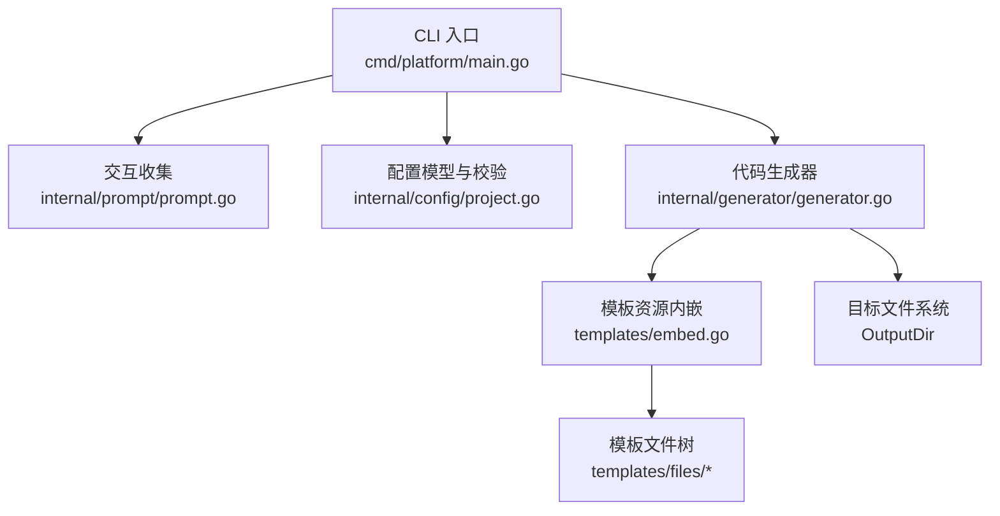
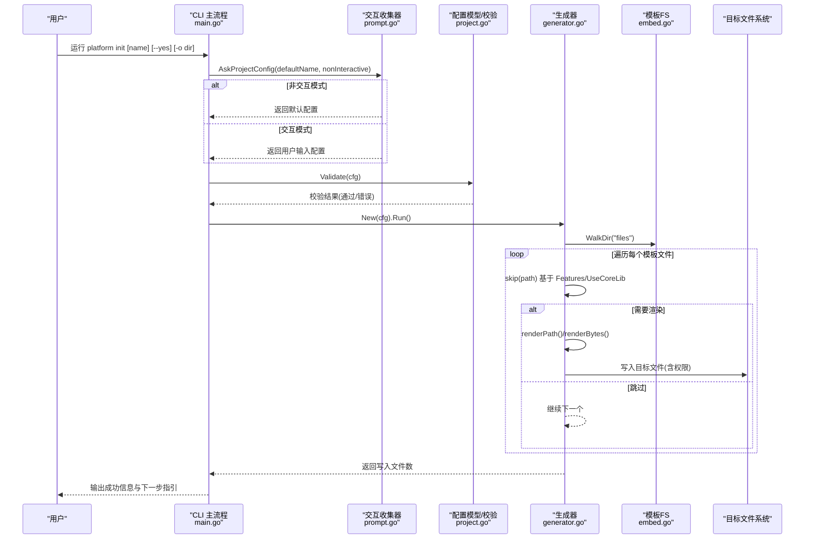
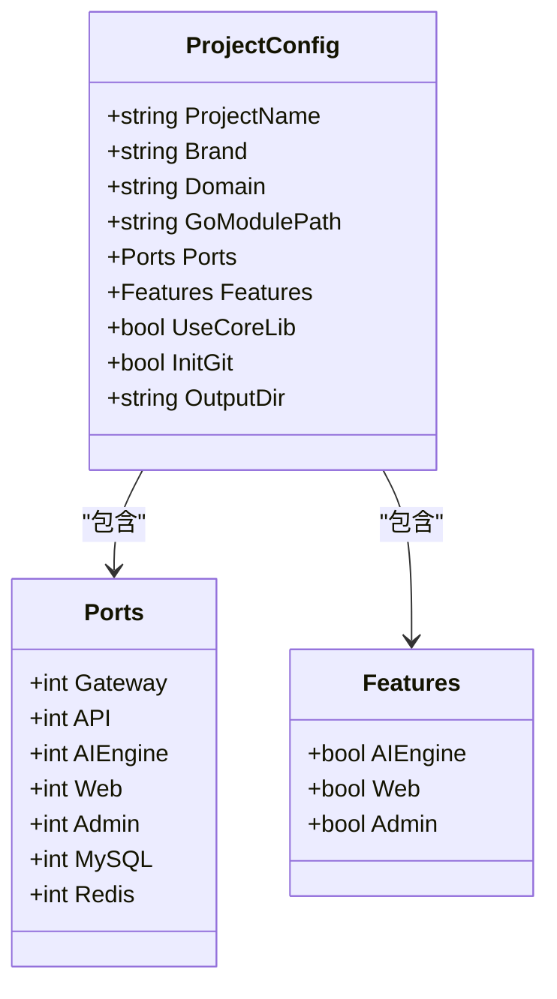
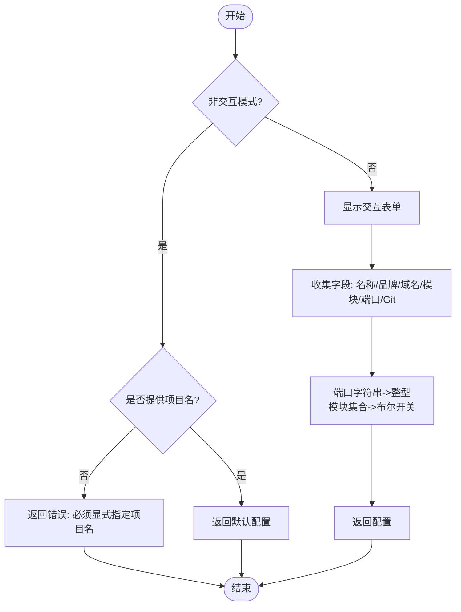
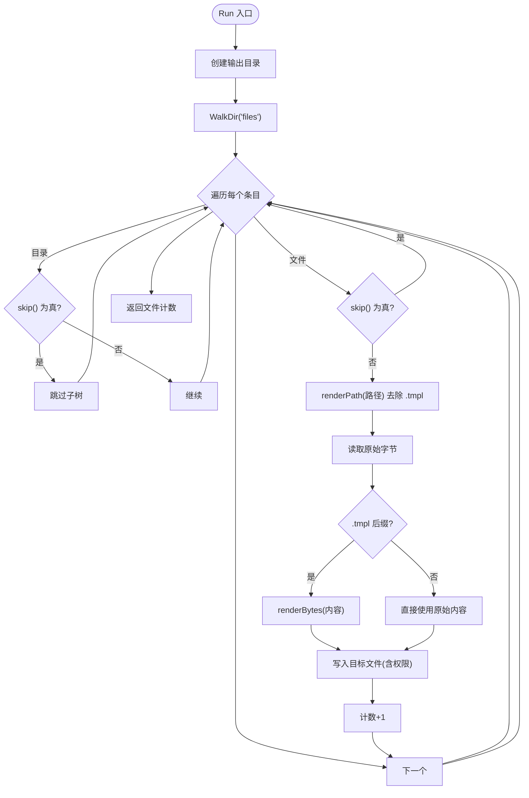
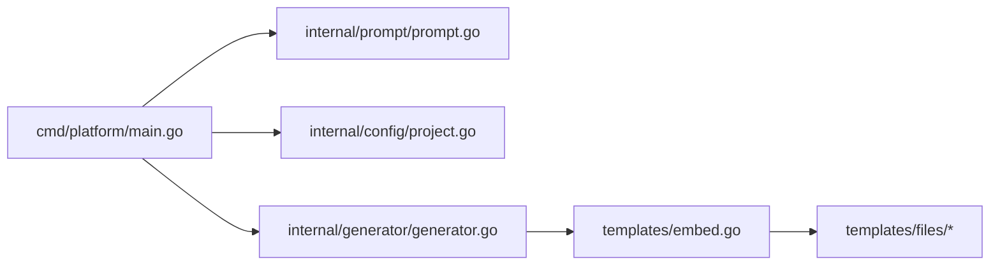
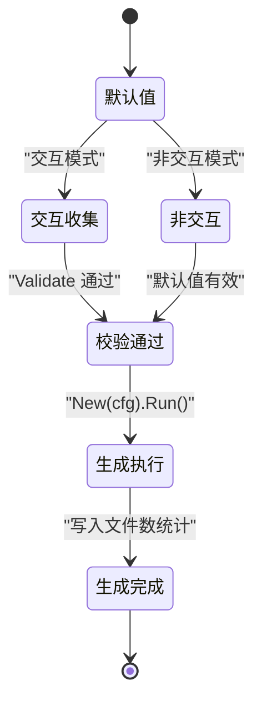

# 数据流设计

<cite>
**本文引用的文件**
- [cmd/platform/main.go](file://cmd/platform/main.go)
- [internal/config/project.go](file://internal/config/project.go)
- [internal/generator/generator.go](file://internal/generator/generator.go)
- [internal/prompt/prompt.go](file://internal/prompt/prompt.go)
- [templates/embed.go](file://templates/embed.go)
- [templates/files/backend-api/cmd/api/main.go.tmpl](file://templates/files/backend-api/cmd/api/main.go.tmpl)
- [templates/files/frontend-web/src/app/layout.tsx.tmpl](file://templates/files/frontend-web/src/app/layout.tsx.tmpl)
- [templates/files/backend-ai-engine/app/main.py.tmpl](file://templates/files/backend-ai-engine/app/main.py.tmpl)
</cite>

## 目录
1. [引言](#引言)
2. [项目结构](#项目结构)
3. [核心组件](#核心组件)
4. [架构总览](#架构总览)
5. [详细组件分析](#详细组件分析)
6. [依赖分析](#依赖分析)
7. [性能考虑](#性能考虑)
8. [故障排查指南](#故障排查指南)
9. [结论](#结论)
10. [附录](#附录)

## 引言
本文件面向开发者与产品工程师，系统化阐述“平台脚手架”从用户输入到最终代码生成的完整数据流设计。重点覆盖以下方面：
- 配置数据的收集、验证、转换与存储机制
- 用户交互数据的处理管道
- 模板参数的构建与文件生成的数据流
- 数据在不同组件间的传递方式、格式转换与一致性保证
- 提供完整的数据流图与状态转换图，帮助快速理解系统中数据的流转过程

## 项目结构
该仓库采用分层与功能域结合的组织方式：
- CLI 入口位于 cmd/platform/main.go，负责命令解析与主流程编排
- 配置模型与校验位于 internal/config/project.go
- 交互式收集位于 internal/prompt/prompt.go
- 代码生成位于 internal/generator/generator.go
- 模板资源通过 templates/embed.go 内嵌至二进制，模板树位于 templates/files

图表来源
- [cmd/platform/main.go:22-87](file://cmd/platform/main.go#L22-L87)
- [internal/prompt/prompt.go:14-105](file://internal/prompt/prompt.go#L14-L105)
- [internal/config/project.go:12-106](file://internal/config/project.go#L12-L106)
- [internal/generator/generator.go:34-103](file://internal/generator/generator.go#L34-L103)
- [templates/embed.go:6-12](file://templates/embed.go#L6-L12)

章节来源
- [cmd/platform/main.go:22-87](file://cmd/platform/main.go#L22-L87)
- [internal/prompt/prompt.go:14-105](file://internal/prompt/prompt.go#L14-L105)
- [internal/config/project.go:12-106](file://internal/config/project.go#L12-L106)
- [internal/generator/generator.go:34-103](file://internal/generator/generator.go#L34-L103)
- [templates/embed.go:6-12](file://templates/embed.go#L6-L12)

## 核心组件
- CLI 主命令与子命令：负责解析用户输入、调用交互收集、执行配置校验、驱动生成器并输出结果
- 交互收集器：以表单形式收集用户输入，支持非交互模式（默认值）
- 配置模型与校验：定义 ProjectConfig 结构、默认值与字段校验规则
- 生成器：遍历内嵌模板树，按 Features 与路径规则决定渲染与写入，支持路径模板变量与内容模板变量
- 模板资源：通过 embed 将 templates/files 整体内嵌为只读文件系统

章节来源
- [cmd/platform/main.go:40-87](file://cmd/platform/main.go#L40-L87)
- [internal/prompt/prompt.go:14-105](file://internal/prompt/prompt.go#L14-L105)
- [internal/config/project.go:12-106](file://internal/config/project.go#L12-L106)
- [internal/generator/generator.go:23-103](file://internal/generator/generator.go#L23-L103)
- [templates/embed.go:6-12](file://templates/embed.go#L6-L12)

## 架构总览
下图展示了从用户输入到文件落盘的端到端数据流：

图表来源
- [cmd/platform/main.go:48-81](file://cmd/platform/main.go#L48-L81)
- [internal/prompt/prompt.go:14-105](file://internal/prompt/prompt.go#L14-L105)
- [internal/config/project.go:91-106](file://internal/config/project.go#L91-L106)
- [internal/generator/generator.go:34-103](file://internal/generator/generator.go#L34-L103)
- [templates/embed.go:6-12](file://templates/embed.go#L6-L12)

## 详细组件分析

### 配置模型与校验（ProjectConfig）
- 数据结构
  - 顶层字段：项目名、品牌名、域名、Go 模块路径、端口集合、特性开关、是否使用公共库、是否初始化 Git、输出目录
  - 内部类型：Ports（各服务端口）、Features（模块开关）
- 默认值与转换
  - Defaults 提供合理默认值，如 kebab-case 的项目名、基于项目名推导的品牌名、默认域名与 Go 模块路径、默认端口集
  - 字符串到整型端口的转换逻辑在交互层完成，生成器侧仅消费整型
- 校验规则
  - 项目名必须符合 kebab-case 正则
  - 品牌名与 Go 模块路径不可为空
  - Gateway 与 API 端口必须大于 0
- 一致性保证
  - 通过集中校验函数 Validate 在生成前拦截非法配置
  - 生成器通过 Features 与 UseCoreLib 决策模板树的包含/排除，避免生成不一致的组合

图表来源
- [internal/config/project.go:13-41](file://internal/config/project.go#L13-L41)
- [internal/config/project.go:43-59](file://internal/config/project.go#L43-L59)

章节来源
- [internal/config/project.go:62-89](file://internal/config/project.go#L62-L89)
- [internal/config/project.go:91-106](file://internal/config/project.go#L91-L106)
- [internal/config/project.go:110-120](file://internal/config/project.go#L110-L120)

### 交互收集器（AskProjectConfig）
- 输入来源：用户交互表单（huh 表单）
- 处理逻辑：
  - 非交互模式：若未显式提供项目名则报错；否则直接返回默认配置
  - 交互模式：收集项目名、品牌名、域名、Go 模块路径、各端口、模块选择（AI 引擎、Web、Admin、Core 库）、是否初始化 Git
  - 类型转换：端口字符串转整型，模块选择转布尔，特征集合转布尔开关
- 错误处理：表单运行错误直接返回；非交互模式缺少项目名时报错
- 与生成器的衔接：返回的 ProjectConfig 直接注入到生成器构造函数

图表来源
- [internal/prompt/prompt.go:14-105](file://internal/prompt/prompt.go#L14-L105)
- [internal/prompt/prompt.go:116-121](file://internal/prompt/prompt.go#L116-L121)
- [internal/prompt/prompt.go:123-130](file://internal/prompt/prompt.go#L123-L130)

章节来源
- [internal/prompt/prompt.go:14-105](file://internal/prompt/prompt.go#L14-L105)
- [internal/prompt/prompt.go:107-114](file://internal/prompt/prompt.go#L107-L114)

### 生成器（Generator）
- 角色定位：遍历内嵌模板树，按规则渲染并写入目标目录
- 关键流程：
  - 初始化输出目录
  - WalkDir 遍历 templates/files 子树
  - skip 决策：根据 Features 与 UseCoreLib 决定是否跳过某路径及其子树
  - 路径渲染：对包含模板变量的路径进行渲染，剥离 .tmpl 后缀
  - 内容渲染：对 .tmpl 文件内容进行模板渲染
  - 权限控制：以 .sh 结尾的文件赋予执行权限
  - 写入磁盘：创建父目录、写入文件、统计数量
- 与模板的关系：通过 templates.FS 访问内嵌模板，模板变量来源于 ProjectConfig

图表来源
- [internal/generator/generator.go:34-103](file://internal/generator/generator.go#L34-L103)
- [internal/generator/generator.go:105-120](file://internal/generator/generator.go#L105-L120)
- [internal/generator/generator.go:122-147](file://internal/generator/generator.go#L122-L147)
- [templates/embed.go:6-12](file://templates/embed.go#L6-L12)

章节来源
- [internal/generator/generator.go:23-31](file://internal/generator/generator.go#L23-L31)
- [internal/generator/generator.go:34-103](file://internal/generator/generator.go#L34-L103)
- [internal/generator/generator.go:105-120](file://internal/generator/generator.go#L105-L120)
- [internal/generator/generator.go:122-147](file://internal/generator/generator.go#L122-L147)

### 模板参数与渲染
- 参数来源：ProjectConfig（包含品牌名、域名、端口、模块开关、Go 模块路径等）
- 渲染范围：
  - 路径渲染：模板路径中可使用 {{.ProjectName}} 等变量，渲染后去除 .tmpl 后缀
  - 内容渲染：模板文件内容通过 text/template 渲染，替换 {{.Brand}}、{{.GoModulePath}} 等
- 示例（路径与内容渲染）：
  - 路径渲染示例：前端布局模板的元数据标题使用 {{.Brand}}
  - 内容渲染示例：Go API 入口文件引用 {{.GoModulePath}} 并使用端口变量
  - 内容渲染示例：Python AI 引擎应用创建时使用 {{.Brand}} 作为标题

章节来源
- [templates/files/frontend-web/src/app/layout.tsx.tmpl:1-13](file://templates/files/frontend-web/src/app/layout.tsx.tmpl#L1-L13)
- [templates/files/backend-api/cmd/api/main.go.tmpl:21-31](file://templates/files/backend-api/cmd/api/main.go.tmpl#L21-L31)
- [templates/files/backend-ai-engine/app/main.py.tmpl:41-41](file://templates/files/backend-ai-engine/app/main.py.tmpl#L41-L41)

### CLI 主流程编排
- 命令定义：init 与 version 子命令
- 流程控制：
  - 解析标志：--yes（非交互）、-o/--output（输出目录）
  - 调用顺序：交互收集 → 配置校验 → 生成器执行 → 成功提示
- 错误处理：任何阶段出错均向上返回错误并退出码非零

章节来源
- [cmd/platform/main.go:22-38](file://cmd/platform/main.go#L22-L38)
- [cmd/platform/main.go:40-87](file://cmd/platform/main.go#L40-L87)
- [cmd/platform/main.go:89-98](file://cmd/platform/main.go#L89-L98)

## 依赖分析
- 组件耦合
  - CLI 依赖 prompt、config、generator 三者接口清晰，职责单一
  - 生成器依赖模板 FS 与 ProjectConfig，耦合点集中在模板变量与 Features 决策
  - 交互收集器与配置模型双向协作：收集器填充配置，配置模型提供默认值与校验
- 外部依赖
  - 模板渲染使用标准库 text/template
  - 交互 UI 使用 charmbracelet/huh
  - 模板资源通过 go:embed 内嵌

图表来源
- [cmd/platform/main.go:48-81](file://cmd/platform/main.go#L48-L81)
- [internal/generator/generator.go:34-103](file://internal/generator/generator.go#L34-L103)
- [templates/embed.go:6-12](file://templates/embed.go#L6-L12)

章节来源
- [cmd/platform/main.go:48-81](file://cmd/platform/main.go#L48-L81)
- [internal/generator/generator.go:34-103](file://internal/generator/generator.go#L34-L103)
- [templates/embed.go:6-12](file://templates/embed.go#L6-L12)

## 性能考虑
- 模板内嵌与一次性生成：模板内嵌减少外部 IO 与依赖，生成阶段一次性遍历与渲染，适合小中型项目规模
- 渲染策略：text/template 在生成器中逐文件渲染，复杂度与模板数量线性相关
- I/O 优化：批量创建目录、按需渲染路径与内容，避免重复计算
- 建议
  - 对超大模板树场景，可考虑分层生成或增量渲染
  - 对频繁变更的模板，建议缓存渲染结果或引入增量标记

## 故障排查指南
- 常见问题与定位
  - 非交互模式缺少项目名：交互收集器会明确报错，检查是否传入项目名
  - 配置不合法：Validate 校验失败时会返回具体字段错误，检查项目名格式、品牌名、Go 模块路径与端口
  - 生成失败：生成器在渲染路径、渲染内容或写入阶段出错，查看错误上下文与文件路径
- 排查步骤
  - 确认 CLI 命令与标志使用正确
  - 检查交互收集器返回的配置是否符合预期
  - 查看生成器的输出目录是否存在权限问题
  - 对模板渲染错误，核对模板中使用的变量是否在 ProjectConfig 中存在

章节来源
- [internal/prompt/prompt.go:16-21](file://internal/prompt/prompt.go#L16-L21)
- [internal/config/project.go:91-106](file://internal/config/project.go#L91-L106)
- [internal/generator/generator.go:64-85](file://internal/generator/generator.go#L64-L85)

## 结论
本数据流设计以“配置为中心”的模板渲染管线，通过 CLI 编排、交互收集、集中校验与生成器渲染，实现了从用户输入到最终代码产物的一致性与可追溯性。关键在于：
- 明确的配置模型与默认值，确保生成结果的合理性
- 严格的校验前置，降低下游渲染与写入阶段的失败概率
- 以 Features 与 UseCoreLib 为核心的模板决策，保障产物组合的正确性
- 通过 embed 将模板内嵌，提升可移植性与可维护性

## 附录
- 状态转换（配置对象生命周期）

图表来源
- [internal/config/project.go:62-89](file://internal/config/project.go#L62-L89)
- [internal/prompt/prompt.go:14-105](file://internal/prompt/prompt.go#L14-L105)
- [internal/config/project.go:91-106](file://internal/config/project.go#L91-L106)
- [internal/generator/generator.go:34-103](file://internal/generator/generator.go#L34-L103)