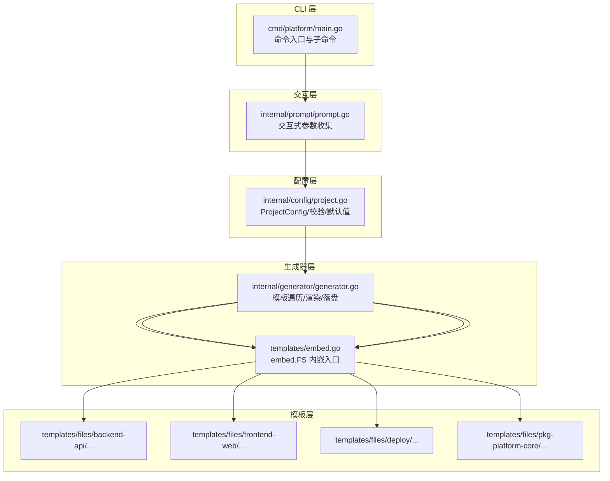
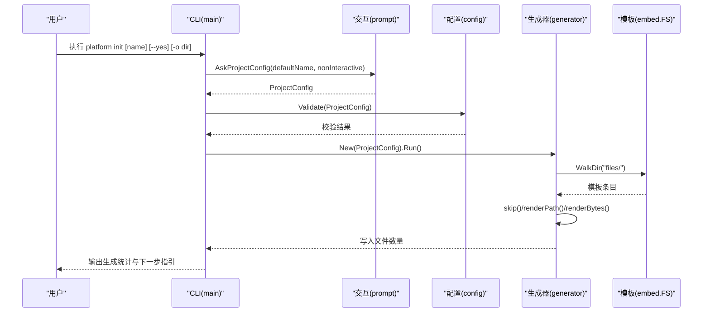
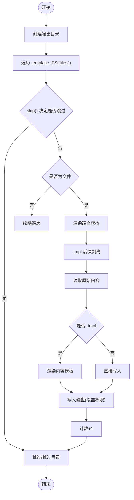
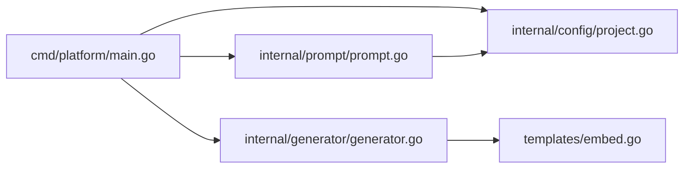

# 架构概览

<cite>
**本文档引用的文件**
- [cmd/platform/main.go](file://cmd/platform/main.go)
- [internal/config/project.go](file://internal/config/project.go)
- [internal/generator/generator.go](file://internal/generator/generator.go)
- [internal/prompt/prompt.go](file://internal/prompt/prompt.go)
- [templates/embed.go](file://templates/embed.go)
- [templates/files/backend-api/cmd/api/main.go.tmpl](file://templates/files/backend-api/cmd/api/main.go.tmpl)
- [templates/files/frontend-web/package.json.tmpl](file://templates/files/frontend-web/package.json.tmpl)
- [templates/files/deploy/local/docker-compose-all.yaml.tmpl](file://templates/files/deploy/local/docker-compose-all.yaml.tmpl)
- [README.md](file://README.md)
- [go.mod](file://go.mod)
</cite>

## 目录
1. [引言](#引言)
2. [项目结构](#项目结构)
3. [核心组件](#核心组件)
4. [架构总览](#架构总览)
5. [详细组件分析](#详细组件分析)
6. [依赖关系分析](#依赖关系分析)
7. [性能考量](#性能考量)
8. [故障排查指南](#故障排查指南)
9. [结论](#结论)
10. [附录](#附录)

## 引言
本项目是一个“平台脚手架”，通过一条命令生成一套完整的微服务骨架，包含 Go 网关、Go API、Python AI 引擎、Next.js 前端与后台、部署脚本以及公共组件库。其目标是将经过生产验证的最佳实践固化为模板，消除重复劳动，提升新项目搭建效率与一致性。

技术栈与关键特性：
- CLI 使用 cobra + huh 实现命令与交互式 TUI 输入
- 模板渲染采用 Go 标准库 text/template，并将模板资源内嵌至二进制（embed.FS）
- 生成的项目遵循统一的架构约定（三层架构、服务间鉴权、统一错误码、缓存与分布式锁等）

## 项目结构
项目采用分层与功能域结合的组织方式：
- cmd/platform：CLI 入口与命令定义
- internal/config：模板渲染所需的配置模型与校验
- internal/prompt：交互式参数收集
- internal/generator：模板遍历、渲染与落盘
- templates：模板资源（.tmpl 文件）与内嵌入口
- 根目录 README 与 go.mod 提供使用说明与依赖清单

图表来源
- [cmd/platform/main.go:22-98](file://cmd/platform/main.go#L22-L98)
- [internal/prompt/prompt.go:14-105](file://internal/prompt/prompt.go#L14-L105)
- [internal/config/project.go:62-106](file://internal/config/project.go#L62-L106)
- [internal/generator/generator.go:34-103](file://internal/generator/generator.go#L34-L103)
- [templates/embed.go:10-12](file://templates/embed.go#L10-L12)

章节来源
- [README.md:61-83](file://README.md#L61-L83)
- [go.mod:1-37](file://go.mod#L1-L37)

## 核心组件
- CLI 入口与命令
  - 定义 init 与 version 子命令，解析标志位（非交互模式、输出目录）
  - 调用交互层收集配置，进行合法性校验，创建生成器并执行
- 交互式参数收集
  - 使用 huh 表单收集项目名、品牌名、域名、Go module 路径、端口、模块开关、是否初始化 Git 等
  - 非交互模式下直接使用默认值，但要求显式指定项目名
- 配置模型与校验
  - ProjectConfig 统一承载模板变量，含端口、特性开关、是否使用公共库、输出目录等
  - 默认值函数提供合理的初始提示值；校验函数保证关键字段格式正确
- 模板生成器
  - 遍历 embed.FS 的模板树，按 Features 与 UseCoreLib 决定跳过子树
  - 对路径与内容进行 text/template 渲染，剥离 .tmpl 后缀，设置执行权限，写入目标目录
  - 支持路径模板变量（文件夹名等也可模板化）

章节来源
- [cmd/platform/main.go:40-87](file://cmd/platform/main.go#L40-L87)
- [internal/prompt/prompt.go:14-105](file://internal/prompt/prompt.go#L14-L105)
- [internal/config/project.go:13-106](file://internal/config/project.go#L13-L106)
- [internal/generator/generator.go:24-103](file://internal/generator/generator.go#L24-L103)

## 架构总览
系统采用“CLI + 配置 + 生成器 + 模板”的分层架构，核心流程如下：
- CLI 接收用户输入，构建 ProjectConfig
- 校验配置合法性
- 生成器遍历模板树，按 Features 与 UseCoreLib 过滤
- 对路径与内容进行模板渲染，写入目标目录
- 输出生成统计与下一步指引

图表来源
- [cmd/platform/main.go:48-81](file://cmd/platform/main.go#L48-L81)
- [internal/prompt/prompt.go:14-105](file://internal/prompt/prompt.go#L14-L105)
- [internal/config/project.go:92-106](file://internal/config/project.go#L92-L106)
- [internal/generator/generator.go:34-103](file://internal/generator/generator.go#L34-L103)
- [templates/embed.go:10-12](file://templates/embed.go#L10-L12)

## 详细组件分析

### CLI 入口与命令
- 责任边界
  - 定义命令与帮助信息
  - 解析标志位（--yes、-o）
  - 协调交互层、配置层与生成器层
- 关键流程
  - init 子命令：收集配置 → 校验 → 生成 → 输出提示
  - version 子命令：打印版本
- 错误处理
  - 执行失败输出到标准错误并退出非零状态
  - 生成失败包装错误并返回

章节来源
- [cmd/platform/main.go:22-98](file://cmd/platform/main.go#L22-L98)

### 交互式参数收集（prompt）
- 功能点
  - 分组输入：基础信息、端口、模块开关、Git 初始化
  - 非交互模式：强制显式指定项目名，否则报错
  - 类型转换与校验：端口字符串转整数，空值校验
- 数据结构
  - 使用 MultiSelect 收集模块开关，映射到 Features 与 UseCoreLib
  - 将端口字符串转换回整数并回填到 Ports

章节来源
- [internal/prompt/prompt.go:14-105](file://internal/prompt/prompt.go#L14-L105)

### 配置模型与校验（config）
- 数据模型
  - ProjectConfig：项目名、品牌名、域名、Go module 路径、端口、特性开关、是否使用公共库、是否初始化 Git、输出目录
  - Ports：各服务端口
  - Features：AIEngine、Web、Admin 开关
- 默认值与校验
  - Defaults 提供合理默认值（kebab-case 项目名、品牌名推导、域名后缀、端口、特性开关、是否使用公共库、是否初始化 Git）
  - Validate 校验 kebab-case、品牌名与 Go module 路径非空、Gateway/API 端口有效
- 辅助逻辑
  - toBrand 将 kebab-case 转为 PascalCase 风格的品牌名

章节来源
- [internal/config/project.go:13-121](file://internal/config/project.go#L13-L121)

### 模板生成器（generator）
- 设计要点
  - 所有模板内嵌于二进制，生成器为自包含可执行程序
  - 文件路径与内容均支持 text/template 渲染，路径中的模板变量在渲染后剥离 .tmpl 后缀
  - 通过 Features 与 UseCoreLib 决定跳过子树
- 核心算法
  - 遍历 templates.FS，跳过不满足条件的路径
  - 对 .tmpl 文件先渲染内容，再写入磁盘；非 .tmpl 文件直接写入
  - 设置执行权限（.sh 文件 +x）
- 复杂度与性能
  - 时间复杂度 O(N)，N 为模板文件数量
  - 空间复杂度 O(M)，M 为渲染后内容大小（按文件维度）

图表来源
- [internal/generator/generator.go:34-103](file://internal/generator/generator.go#L34-L103)

章节来源
- [internal/generator/generator.go:24-158](file://internal/generator/generator.go#L24-L158)
- [templates/embed.go:10-12](file://templates/embed.go#L10-L12)

### 模板系统与内嵌资源（templates）
- 内嵌策略
  - 通过 //go:embed all:files 将 templates/files 下所有文件内嵌为 embed.FS
  - 遍历时得到的相对路径即为目标项目中的相对路径
- 模板变量
  - 所有模板变量集中于 ProjectConfig，渲染时注入
  - 示例：Go API 入口模板中使用 Brand、GoModulePath；前端 package.json 模板使用 ProjectName、Ports；Docker Compose 模板使用 Brand、ProjectName、Ports

章节来源
- [templates/embed.go:10-12](file://templates/embed.go#L10-L12)
- [templates/files/backend-api/cmd/api/main.go.tmpl:1-56](file://templates/files/backend-api/cmd/api/main.go.tmpl#L1-L56)
- [templates/files/frontend-web/package.json.tmpl:1-25](file://templates/files/frontend-web/package.json.tmpl#L1-L25)
- [templates/files/deploy/local/docker-compose-all.yaml.tmpl:1-48](file://templates/files/deploy/local/docker-compose-all.yaml.tmpl#L1-L48)

## 依赖关系分析
- 外部依赖
  - cobra：命令行框架
  - huh：交互式 TUI
- 内部模块依赖
  - main 依赖 prompt、config、generator
  - generator 依赖 config 与 templates
  - prompt 依赖 config
  - templates 为纯资源模块，无外部依赖

图表来源
- [cmd/platform/main.go:15-17](file://cmd/platform/main.go#L15-L17)
- [internal/generator/generator.go:19-21](file://internal/generator/generator.go#L19-L21)
- [internal/prompt/prompt.go:10-11](file://internal/prompt/prompt.go#L10-L11)

章节来源
- [go.mod:5-8](file://go.mod#L5-L8)

## 性能考量
- 模板渲染性能
  - 采用 text/template 渲染，模板数量有限，渲染成本低
  - 通过 embed.FS 减少磁盘 IO，提升启动与遍历效率
- 并发与 I/O
  - 生成过程为顺序写入，未使用并发；对大多数项目规模足够
- 资源占用
  - 生成器为自包含二进制，运行时内存占用与模板数量线性相关

## 故障排查指南
- 常见问题与定位
  - 配置不合法：检查 ProjectName 是否为 kebab-case、品牌名与 Go module 路径是否为空、Gateway/API 端口是否大于 0
  - 非交互模式缺少项目名：--yes 模式必须显式提供项目名
  - 模板渲染失败：检查模板中使用的变量是否在 ProjectConfig 中定义
  - 权限问题：确认输出目录存在且可写
- 建议步骤
  - 先在本地试跑：go build ./cmd/platform && ./platform init demo-test
  - 逐步缩小范围：先验证配置层，再验证生成器层
  - 查看生成后的文件是否符合预期（端口、模块开关、公共库引用）

章节来源
- [internal/config/project.go:92-106](file://internal/config/project.go#L92-L106)
- [internal/prompt/prompt.go:16-21](file://internal/prompt/prompt.go#L16-L21)
- [internal/generator/generator.go:77-85](file://internal/generator/generator.go#L77-L85)

## 结论
该脚手架通过清晰的分层设计与成熟的 Go 生态工具，实现了“一次配置、批量生成”的工程化能力。其优势在于：
- 生成物自包含、可移植性强
- 模板变量集中管理，易于扩展
- 交互友好，支持非交互模式
- 严格的数据校验与错误反馈

建议在后续迭代中：
- 增加模板变更追踪与版本控制
- 提供增量更新或补丁机制
- 扩展更多语言与框架组合模板

## 附录
- 使用示例与下一步指引
  - 安装与初始化：参考 README 的安装与初始化步骤
  - 本地开发：根据生成的部署脚本与环境变量进行启动
- 贡献与模板修改原则
  - 保持业务无关、模板变量集中、文件命名规范、跨模块解耦、注意 JSX 与 Go 模板冲突等

章节来源
- [README.md:21-48](file://README.md#L21-L48)
- [README.md:87-94](file://README.md#L87-L94)