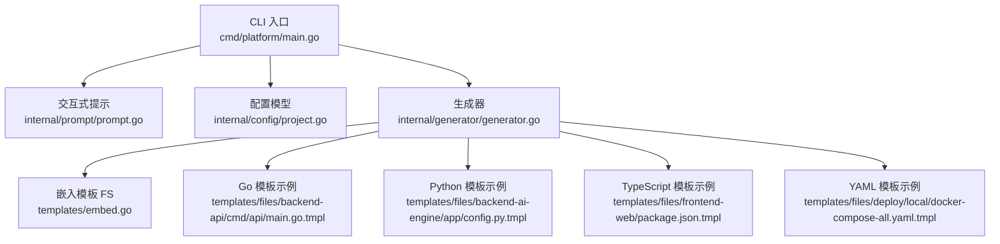
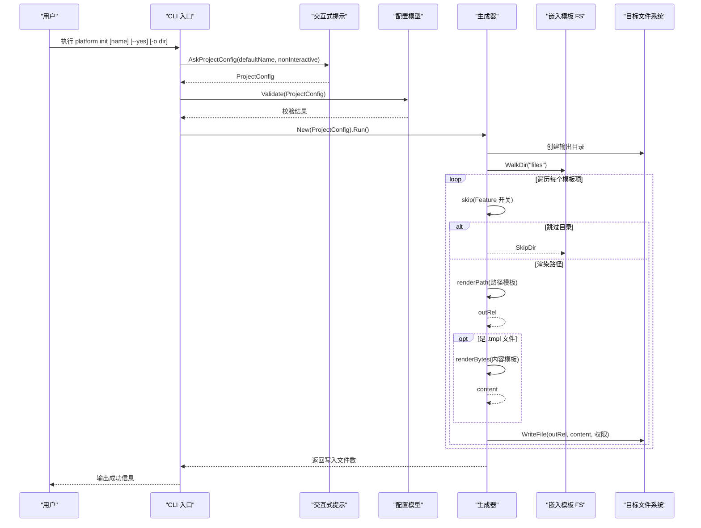
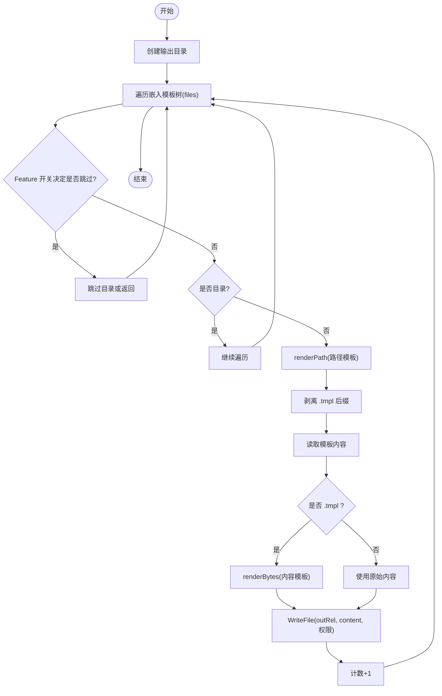
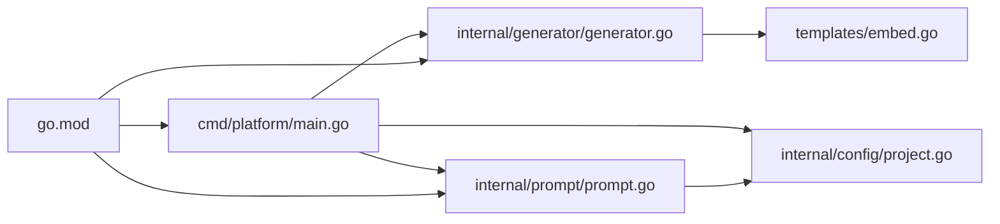

# 模板引擎

<cite>
**本文引用的文件**
- [cmd/platform/main.go](file://cmd/platform/main.go)
- [internal/generator/generator.go](file://internal/generator/generator.go)
- [templates/embed.go](file://templates/embed.go)
- [internal/config/project.go](file://internal/config/project.go)
- [internal/prompt/prompt.go](file://internal/prompt/prompt.go)
- [go.mod](file://go.mod)
- [templates/files/backend-api/cmd/api/main.go.tmpl](file://templates/files/backend-api/cmd/api/main.go.tmpl)
- [templates/files/frontend-web/package.json.tmpl](file://templates/files/frontend-web/package.json.tmpl)
- [templates/files/backend-ai-engine/app/config.py.tmpl](file://templates/files/backend-ai-engine/app/config.py.tmpl)
- [templates/files/deploy/local/docker-compose-all.yaml.tmpl](file://templates/files/deploy/local/docker-compose-all.yaml.tmpl)
</cite>

## 目录
1. [简介](#简介)
2. [项目结构](#项目结构)
3. [核心组件](#核心组件)
4. [架构总览](#架构总览)
5. [详细组件分析](#详细组件分析)
6. [依赖分析](#依赖分析)
7. [性能考虑](#性能考虑)
8. [故障排查指南](#故障排查指南)
9. [结论](#结论)
10. [附录](#附录)

## 简介
本模板引擎以“嵌入式模板系统”为核心设计，将所有模板文件通过 Go 的 go:embed 指令内嵌进二进制，形成自包含的脚手架工具。模板采用 Go 标准库 text/template 引擎进行渲染，支持：
- 变量替换：通过 ProjectConfig 结构体注入模板上下文
- 路径渲染：模板中的文件路径同样可使用模板语法
- 条件渲染：根据 Features 和 UseCoreLib 等开关决定是否渲染某棵子树
- 循环与控制流：text/template 的内置函数与控制语法满足常见需求
- 统一抽象层：尽管模板语言在不同技术栈（Go、Python、TypeScript）中存在差异，但统一通过 text/template 渲染，屏蔽底层差异

该系统还提供交互式配置收集与校验，最终将渲染后的文件写入目标目录，并对可执行脚本赋予执行权限。

## 项目结构
模板引擎相关的核心文件分布如下：
- CLI 入口：负责命令解析与流程编排
- 生成器：遍历嵌入的模板树，按规则渲染并写入磁盘
- 模板资源：通过 embed 将 templates/files 下的全部文件内嵌
- 配置模型：定义模板变量与校验逻辑
- 交互式提示：收集用户输入并生成 ProjectConfig

图表来源
- [cmd/platform/main.go:22-86](file://cmd/platform/main.go#L22-L86)
- [internal/generator/generator.go:33-103](file://internal/generator/generator.go#L33-L103)
- [templates/embed.go:10-11](file://templates/embed.go#L10-L11)
- [internal/config/project.go:12-41](file://internal/config/project.go#L12-L41)
- [internal/prompt/prompt.go:14-104](file://internal/prompt/prompt.go#L14-L104)

章节来源
- [cmd/platform/main.go:22-86](file://cmd/platform/main.go#L22-L86)
- [internal/generator/generator.go:33-103](file://internal/generator/generator.go#L33-L103)
- [templates/embed.go:10-11](file://templates/embed.go#L10-L11)
- [internal/config/project.go:12-41](file://internal/config/project.go#L12-L41)
- [internal/prompt/prompt.go:14-104](file://internal/prompt/prompt.go#L14-L104)

## 核心组件
- CLI 入口：定义 init 与 version 子命令，负责收集配置、校验与触发生成器
- 生成器：遍历嵌入的模板树，按规则渲染路径与内容，写入目标目录
- 模板资源：通过 go:embed 将 templates/files 整棵树内嵌为 embed.FS
- 配置模型：ProjectConfig 作为模板上下文，包含项目名、品牌、域名、Go Module 路径、端口、功能开关、是否使用核心库等
- 交互式提示：使用 charmbracelet/huh 收集用户输入，非交互模式下使用默认值

章节来源
- [cmd/platform/main.go:22-86](file://cmd/platform/main.go#L22-L86)
- [internal/generator/generator.go:23-31](file://internal/generator/generator.go#L23-L31)
- [templates/embed.go:10-11](file://templates/embed.go#L10-L11)
- [internal/config/project.go:12-41](file://internal/config/project.go#L12-L41)
- [internal/prompt/prompt.go:14-104](file://internal/prompt/prompt.go#L14-L104)

## 架构总览
模板引擎工作流分为以下阶段：
1) CLI 解析命令，收集配置（交互或非交互）
2) 校验配置合法性
3) 初始化输出目录
4) 遍历嵌入的模板树
5) 路径渲染：将路径中的模板语法渲染为最终文件名
6) 内容渲染：对 .tmpl 文件进行 text/template 渲染
7) 写入磁盘：按权限要求设置文件属性
8) 计数并返回结果

图表来源
- [cmd/platform/main.go:48-81](file://cmd/platform/main.go#L48-L81)
- [internal/prompt/prompt.go:14-104](file://internal/prompt/prompt.go#L14-L104)
- [internal/config/project.go:91-106](file://internal/config/project.go#L91-L106)
- [internal/generator/generator.go:34-103](file://internal/generator/generator.go#L34-L103)
- [templates/embed.go:10-11](file://templates/embed.go#L10-L11)

## 详细组件分析

### 组件：生成器（Generator）
职责与行为：
- 初始化输出目录
- 遍历嵌入的模板树（忽略根前缀）
- 基于 Feature 开关决定是否跳过某棵子树
- 对路径与内容分别进行模板渲染
- 剥离 .tmpl 后缀，写入磁盘
- 对 .sh 文件赋予执行权限

关键点：
- 路径渲染：当路径包含模板语法时，单独调用 renderPath
- 内容渲染：仅对 .tmpl 文件执行 text/template 渲染
- 权限控制：isExecutable 判断是否赋予执行权限
- 错误传播：遇到错误立即返回，保证一致性

图表来源
- [internal/generator/generator.go:34-103](file://internal/generator/generator.go#L34-L103)
- [internal/generator/generator.go:105-120](file://internal/generator/generator.go#L105-L120)
- [internal/generator/generator.go:122-147](file://internal/generator/generator.go#L122-L147)

章节来源
- [internal/generator/generator.go:33-103](file://internal/generator/generator.go#L33-L103)
- [internal/generator/generator.go:105-120](file://internal/generator/generator.go#L105-L120)
- [internal/generator/generator.go:122-147](file://internal/generator/generator.go#L122-L147)

### 组件：模板资源（templates/embed.go）
- 使用 go:embed 将 templates/files 整棵模板树内嵌为 embed.FS
- 遍历时得到的相对路径即为目标项目内的相对路径
- 无需外部文件依赖，脚手架为自包含二进制

章节来源
- [templates/embed.go:10-11](file://templates/embed.go#L10-L11)

### 组件：配置模型（ProjectConfig）
- 作为 text/template 的渲染上下文，所有模板变量集中于此
- 包含项目名、品牌、域名、Go Module 路径、端口集合、功能开关、是否使用核心库、是否初始化 Git、输出目录等
- 提供默认值与校验逻辑，确保模板渲染时变量完备且格式正确

章节来源
- [internal/config/project.go:12-41](file://internal/config/project.go#L12-L41)
- [internal/config/project.go:61-89](file://internal/config/project.go#L61-L89)
- [internal/config/project.go:91-106](file://internal/config/project.go#L91-L106)

### 组件：交互式提示（prompt）
- 使用 charmbracelet/huh 收集用户输入，生成 ProjectConfig
- 非交互模式下强制要求显式指定项目名
- 将字符串端口转换为整型并回填到配置

章节来源
- [internal/prompt/prompt.go:14-104](file://internal/prompt/prompt.go#L14-L104)

### 组件：CLI 入口（main）
- 定义 root 命令、init 子命令与 version 子命令
- init 子命令负责收集配置、校验、创建生成器并执行生成流程
- 输出下一步指引

章节来源
- [cmd/platform/main.go:22-86](file://cmd/platform/main.go#L22-L86)

### 模板变量替换机制
- 上下文：ProjectConfig 作为模板渲染上下文
- 路径变量：路径中可使用模板语法，先渲染路径再写入
- 内容变量：.tmpl 文件内容通过 text/template 渲染，支持变量、函数与控制语法
- 示例：
  - Go 模板中使用品牌名与模块路径
  - Python 模板中使用端口与上游 API 地址
  - TypeScript 模板中使用项目名与端口
  - YAML 模板中使用项目名与端口映射

章节来源
- [templates/files/backend-api/cmd/api/main.go.tmpl:1-56](file://templates/files/backend-api/cmd/api/main.go.tmpl#L1-L56)
- [templates/files/backend-ai-engine/app/config.py.tmpl:1-31](file://templates/files/backend-ai-engine/app/config.py.tmpl#L1-L31)
- [templates/files/frontend-web/package.json.tmpl:1-25](file://templates/files/frontend-web/package.json.tmpl#L1-L25)
- [templates/files/deploy/local/docker-compose-all.yaml.tmpl:1-48](file://templates/files/deploy/local/docker-compose-all.yaml.tmpl#L1-L48)

### 条件渲染与循环处理
- 条件渲染：通过 skip 函数根据 Features 与 UseCoreLib 决定是否渲染某棵子树；目录级跳过时直接 SkipDir
- 循环与控制：text/template 的内置函数与控制语法满足常见需求；对于复杂逻辑可在模板中组合使用
- 路径渲染：renderPath 对路径模板进行独立渲染，确保生成的文件名符合预期

章节来源
- [internal/generator/generator.go:105-120](file://internal/generator/generator.go#L105-L120)
- [internal/generator/generator.go:122-127](file://internal/generator/generator.go#L122-L127)

### 不同类型模板的处理差异与统一抽象层
- Go 模板：使用 Go 语法与注释，模板中可直接引用 ProjectConfig 字段
- Python 模板：使用 Python 语法，模板中可引用端口、上游地址等变量
- TypeScript 模板：使用 JSON/TS 配置语法，模板中可引用项目名与端口
- 统一抽象层：所有模板均通过 text/template 渲染，变量来源一致，差异体现在模板语法与用途上

章节来源
- [templates/files/backend-api/cmd/api/main.go.tmpl:1-56](file://templates/files/backend-api/cmd/api/main.go.tmpl#L1-L56)
- [templates/files/backend-ai-engine/app/config.py.tmpl:1-31](file://templates/files/backend-ai-engine/app/config.py.tmpl#L1-L31)
- [templates/files/frontend-web/package.json.tmpl:1-25](file://templates/files/frontend-web/package.json.tmpl#L1-L25)

## 依赖分析
- CLI 依赖生成器、配置与提示模块
- 生成器依赖模板嵌入 FS 与配置模型
- 模板嵌入 FS 依赖 go:embed
- 交互式提示依赖 charmbracelet/huh
- 项目使用 Go 1.22

图表来源
- [cmd/platform/main.go:9-18](file://cmd/platform/main.go#L9-L18)
- [internal/generator/generator.go:10-21](file://internal/generator/generator.go#L10-L21)
- [templates/embed.go:4](file://templates/embed.go#L4)
- [go.mod:1-37](file://go.mod#L1-L37)

章节来源
- [cmd/platform/main.go:9-18](file://cmd/platform/main.go#L9-L18)
- [internal/generator/generator.go:10-21](file://internal/generator/generator.go#L10-L21)
- [templates/embed.go:4](file://templates/embed.go#L4)
- [go.mod:1-37](file://go.mod#L1-L37)

## 性能考虑
- 内存占用：模板全部内嵌，运行时无需 IO 读取，启动快、部署简单
- 渲染效率：text/template 渲染路径与内容均为内存操作，开销低
- 并发友好：遍历与渲染为顺序流程，未见并发场景，适合单次生成任务
- I/O 优化：批量写入磁盘，减少系统调用次数
- 建议：
  - 对超大模板树可考虑分批处理或缓存常用片段
  - 如需多语言模板，保持统一的上下文结构，减少重复计算

## 故障排查指南
- 配置校验失败：检查 ProjectName 是否为 kebab-case、Brand 与 GoModulePath 是否为空、核心端口是否大于 0
- 生成失败：查看具体模板渲染错误，定位 missingkey 或 parse 错误
- 路径跳过：确认 Features 与 UseCoreLib 设置是否导致子树被跳过
- 权限问题：确认 .sh 文件是否正确赋予执行权限
- 输出目录：确认输出目录可写且不存在冲突

章节来源
- [internal/config/project.go:91-106](file://internal/config/project.go#L91-L106)
- [internal/generator/generator.go:34-103](file://internal/generator/generator.go#L34-L103)
- [internal/generator/generator.go:105-120](file://internal/generator/generator.go#L105-L120)
- [internal/generator/generator.go:154-157](file://internal/generator/generator.go#L154-L157)

## 结论
该模板引擎以 go:embed 为核心，结合 text/template 渲染，实现了跨语言（Go/Python/TypeScript/YAML）的一致性抽象。通过 ProjectConfig 统一上下文，配合路径与内容双层渲染，以及基于 Feature 的条件渲染，能够高效地生成完整的微服务脚手架工程。其自包含特性简化了部署与分发，适合在 CLI 工具中大规模应用。

## 附录

### 模板文件组织与命名规范
- 组织结构：templates/files 下按功能域划分（如 backend-api、backend-ai-engine、frontend-web、deploy 等）
- 命名规范：模板文件以 .tmpl 结尾，最终生成时自动剥离 .tmpl
- 路径渲染：路径中可使用模板语法，先渲染路径再写入磁盘
- 执行权限：以 .sh 结尾的文件在生成后赋予执行权限

章节来源
- [internal/generator/generator.go:67-68](file://internal/generator/generator.go#L67-L68)
- [internal/generator/generator.go:122-127](file://internal/generator/generator.go#L122-L127)
- [internal/generator/generator.go:154-157](file://internal/generator/generator.go#L154-L157)