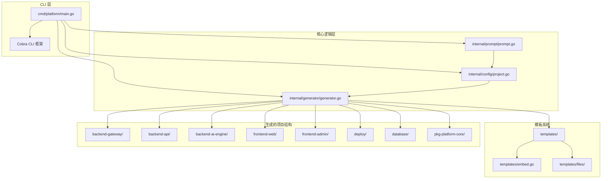
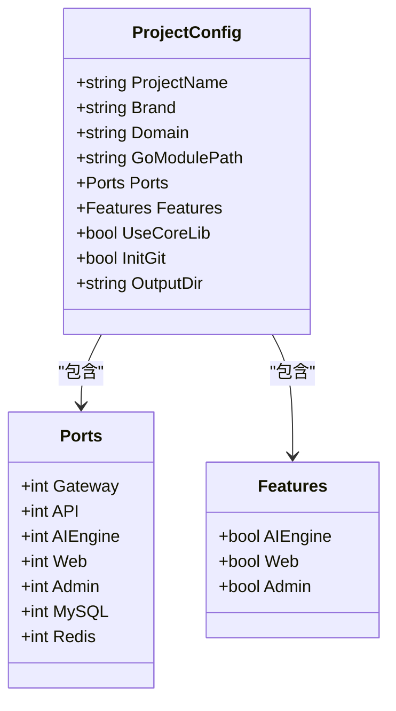
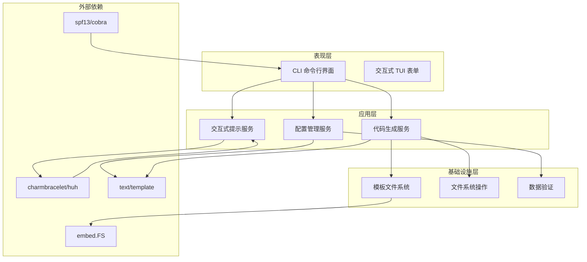
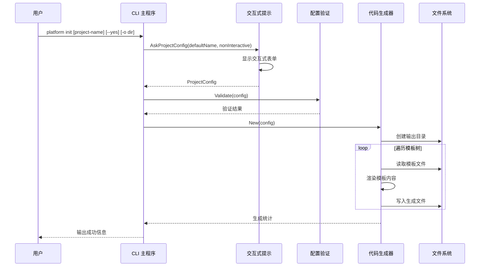
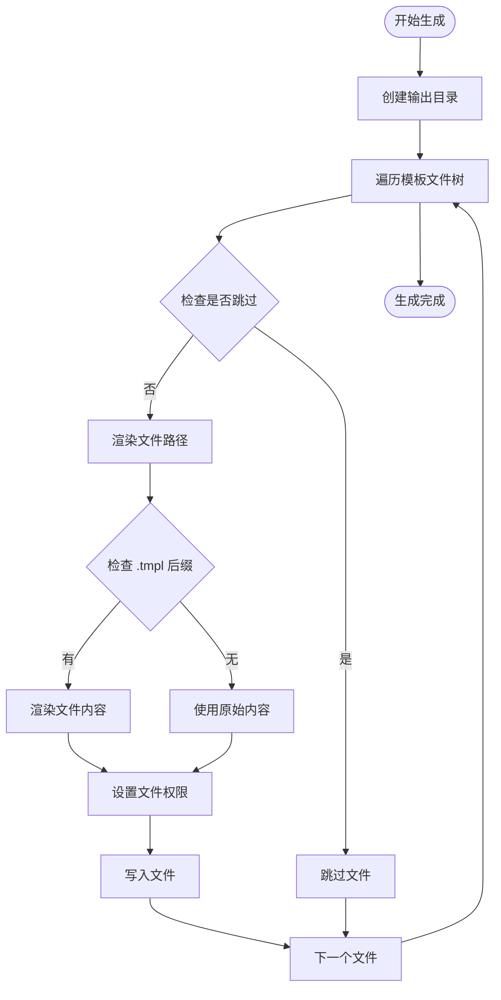
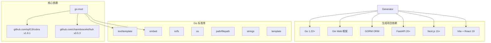

# 系统设计

<cite>
**本文档引用的文件**
- [main.go](file://cmd/platform/main.go)
- [project.go](file://internal/config/project.go)
- [generator.go](file://internal/generator/generator.go)
- [prompt.go](file://internal/prompt/prompt.go)
- [embed.go](file://templates/embed.go)
- [go.mod](file://go.mod)
- [README.md](file://README.md)
- [main.go.tmpl](file://templates/files/backend-api/cmd/api/main.go.tmpl)
- [package.json.tmpl](file://templates/files/frontend-web/package.json.tmpl)
- [start.sh.tmpl](file://templates/files/deploy/local/start.sh.tmpl)
</cite>

## 目录
1. [引言](#引言)
2. [项目结构](#项目结构)
3. [核心组件](#核心组件)
4. [架构概览](#架构概览)
5. [详细组件分析](#详细组件分析)
6. [依赖分析](#依赖分析)
7. [性能考虑](#性能考虑)
8. [故障排除指南](#故障排除指南)
9. [结论](#结论)

## 引言

platform-scaffold 是一个基于 Go 语言开发的微服务脚手架系统，旨在将经过生产验证的最佳实践快速部署为可定制的项目骨架。该系统通过一条命令生成完整的微服务架构，包括 Go 网关、Go API、Python AI 引擎、Next.js 前端和 React Admin 界面，以及完整的部署配置。

该系统的核心设计理念是"模板即代码"，通过 Go 标准库的 `text/template` 和 `embed.FS` 将所有模板内嵌到二进制文件中，实现了真正的自包含 CLI 工具，无需额外的模板文件依赖。

## 项目结构

平台脚手架采用清晰的模块化架构，主要分为以下几个核心部分：



**图表来源**
- [main.go:1-98](file://cmd/platform/main.go#L1-L98)
- [project.go:1-121](file://internal/config/project.go#L1-L121)
- [generator.go:1-158](file://internal/generator/generator.go#L1-L158)
- [embed.go:1-12](file://templates/embed.go#L1-L12)

**章节来源**
- [main.go:1-98](file://cmd/platform/main.go#L1-L98)
- [go.mod:1-37](file://go.mod#L1-L37)
- [README.md:61-83](file://README.md#L61-L83)

## 核心组件

### CLI 命令行接口设计

系统采用 Cobra 作为 CLI 框架，提供了简洁直观的命令行体验：

- **主命令**: `platform` - 根命令，提供全局帮助信息
- **初始化命令**: `platform init [project-name]` - 交互式生成新项目
- **版本命令**: `platform version` - 显示版本信息

命令行接口的设计特点：
- 支持非交互模式 (`--yes` 标志)，适合自动化场景
- 支持自定义输出目录 (`-o` 标志)
- 提供详细的帮助信息和使用示例

### 配置管理系统

ProjectConfig 结构体是整个系统的核心数据模型，定义了所有项目生成所需的配置参数：



**图表来源**
- [project.go:12-60](file://internal/config/project.go#L12-L60)

**章节来源**
- [project.go:12-121](file://internal/config/project.go#L12-L121)

### 模板渲染引擎

系统采用 Go 标准库的 `text/template` 包进行模板渲染，结合 `embed.FS` 实现模板内嵌：

- **模板内嵌**: 所有模板文件通过 `//go:embed all:files` 指令内嵌到二进制
- **路径渲染**: 模板路径和文件内容都可以使用模板变量
- **条件渲染**: 基于 Features 开关控制模板树的渲染
- **权限处理**: 自动识别可执行文件并设置相应权限

**章节来源**
- [generator.go:1-158](file://internal/generator/generator.go#L1-L158)
- [embed.go:1-12](file://templates/embed.go#L1-L12)

## 架构概览

平台脚手架采用了分层架构设计，确保了良好的关注点分离和可维护性：



**图表来源**
- [main.go:9-18](file://cmd/platform/main.go#L9-L18)
- [prompt.go:4-11](file://internal/prompt/prompt.go#L4-L11)
- [generator.go:10-21](file://internal/generator/generator.go#L10-L21)

## 详细组件分析

### CLI 主入口组件

CLI 主入口负责解析命令行参数、构建命令树并执行相应的功能：



**图表来源**
- [main.go:40-87](file://cmd/platform/main.go#L40-L87)
- [prompt.go:13-105](file://internal/prompt/prompt.go#L13-L105)
- [generator.go:33-103](file://internal/generator/generator.go#L33-L103)

**章节来源**
- [main.go:22-98](file://cmd/platform/main.go#L22-L98)

### 交互式提示系统

系统使用 charmbracelet/huh 库实现优雅的 TUI 交互体验：

- **字段验证**: 对所有必填字段进行实时验证
- **默认值填充**: 基于项目名自动推导品牌名和域名
- **端口配置**: 支持自定义各服务端口
- **模块选择**: 通过多选框控制功能模块的启用

**章节来源**
- [prompt.go:13-131](file://internal/prompt/prompt.go#L13-L131)

### 代码生成器组件

代码生成器是系统的核心组件，负责将模板转换为实际的项目文件：



**图表来源**
- [generator.go:33-103](file://internal/generator/generator.go#L33-L103)

**章节来源**
- [generator.go:23-158](file://internal/generator/generator.go#L23-L158)

### 模板系统架构

模板系统采用嵌入式文件系统设计，实现了真正的自包含 CLI 工具：

```mermaid
graph LR
subgraph "编译时"
TemplateFiles[模板文件]
EmbedDirective[//go:embed all:files]
Binary[最终二进制]
end
subgraph "运行时"
FS[embed.FS]
TemplateEngine[text/template]
Renderer[模板渲染器]
end
TemplateFiles --> EmbedDirective
EmbedDirective --> Binary
Binary --> FS
FS --> TemplateEngine
TemplateEngine --> Renderer
```

**图表来源**
- [embed.go:10-11](file://templates/embed.go#L10-L11)
- [generator.go:70-85](file://internal/generator/generator.go#L70-L85)

**章节来源**
- [embed.go:1-12](file://templates/embed.go#L1-L12)

## 依赖分析

系统采用最小化依赖策略，确保了良好的可移植性和维护性：



**图表来源**
- [go.mod:5-8](file://go.mod#L5-L8)
- [README.md:15-19](file://README.md#L15-L19)

**章节来源**
- [go.mod:1-37](file://go.mod#L1-L37)

### 外部依赖管理

系统对外部依赖的管理遵循以下原则：

1. **最小化原则**: 仅引入必要的依赖
2. **稳定性优先**: 选择成熟稳定的第三方库
3. **版本锁定**: 通过 go.mod 锁定依赖版本
4. **间接依赖**: 通过 go.mod 查看所有间接依赖

## 性能考虑

### 模板渲染性能

系统在模板渲染方面采用了多项优化措施：

- **内存缓存**: 使用 `bytes.Buffer` 减少内存分配
- **批量操作**: 通过 `fs.WalkDir` 批量处理文件
- **条件渲染**: 基于 Features 开关跳过不必要的模板
- **权限预计算**: 预先判断可执行文件类型

### 启动性能优化

- **延迟加载**: 模板文件按需读取和渲染
- **并发安全**: 使用 Go 标准库保证线程安全
- **资源清理**: 正确的文件句柄和缓冲区管理

## 故障排除指南

### 常见问题及解决方案

1. **模板渲染错误**
   - 检查模板中的变量引用是否正确
   - 确认 `ProjectConfig` 结构体中包含所需字段
   - 验证模板语法的正确性

2. **文件权限问题**
   - 确认生成的 shell 脚本具有执行权限
   - 检查输出目录的写入权限
   - 验证操作系统对可执行文件的支持

3. **端口冲突**
   - 修改 `ProjectConfig.Ports` 中的端口号
   - 检查系统中是否有其他进程占用端口
   - 使用 `lsof` 或系统监控工具排查

4. **依赖缺失**
   - 确认 Go 1.22+ 已正确安装
   - 检查网络连接以下载依赖
   - 清理 `go mod cache` 并重新构建

**章节来源**
- [generator.go:64-85](file://internal/generator/generator.go#L64-L85)
- [prompt.go:107-114](file://internal/prompt/prompt.go#L107-L114)

## 结论

platform-scaffold 系统通过精心设计的架构和实现，成功地将复杂的微服务项目模板标准化和自动化。该系统的主要优势包括：

1. **模块化设计**: 清晰的分层架构便于维护和扩展
2. **自包含性**: 通过模板内嵌实现真正的独立部署
3. **用户体验**: 优秀的 CLI 和 TUI 交互体验
4. **可扩展性**: 基于 Features 开关的灵活模块化设计
5. **性能优化**: 高效的模板渲染和文件系统操作

该系统为微服务项目的快速启动提供了最佳实践框架，通过一条命令即可生成完整的项目骨架，大大提高了开发效率和项目一致性。