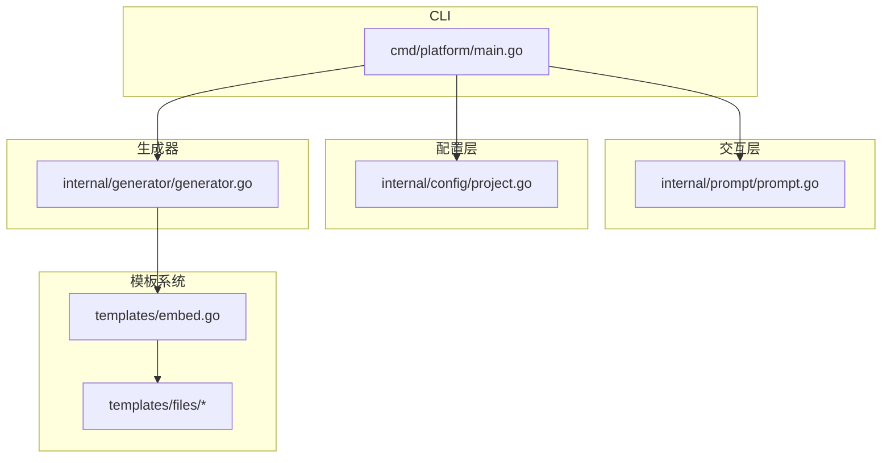
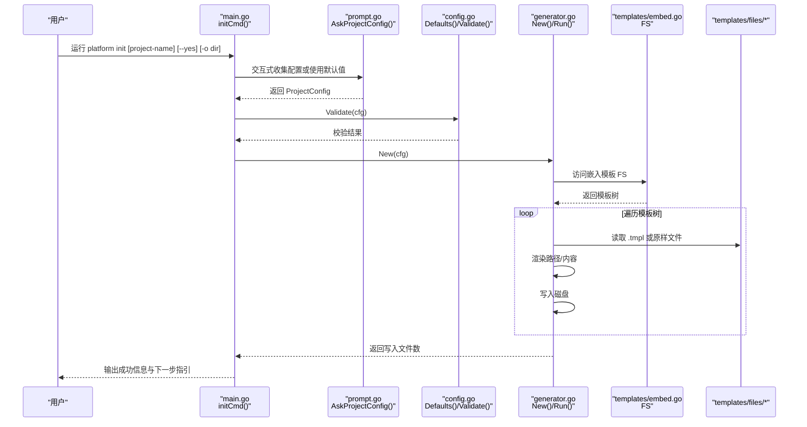
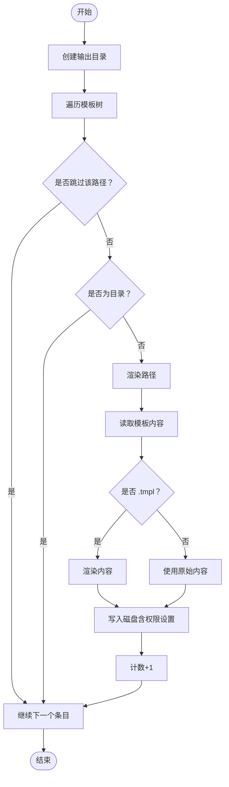
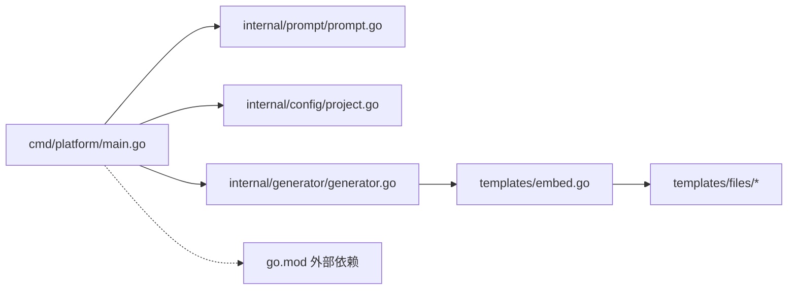

# 组件交互

<cite>
**本文引用的文件**
- [cmd/platform/main.go](file://cmd/platform/main.go)
- [internal/config/project.go](file://internal/config/project.go)
- [internal/generator/generator.go](file://internal/generator/generator.go)
- [internal/prompt/prompt.go](file://internal/prompt/prompt.go)
- [templates/embed.go](file://templates/embed.go)
- [templates/files/backend-api/cmd/api/main.go.tmpl](file://templates/files/backend-api/cmd/api/main.go.tmpl)
- [templates/files/frontend-web/package.json.tmpl](file://templates/files/frontend-web/package.json.tmpl)
- [templates/files/deploy/local/docker-compose-all.yaml.tmpl](file://templates/files/deploy/local/docker-compose-all.yaml.tmpl)
- [templates/files/pkg-platform-core/go.mod.tmpl](file://templates/files/pkg-platform-core/go.mod.tmpl)
- [go.mod](file://go.mod)
</cite>

## 目录
1. [简介](#简介)
2. [项目结构](#项目结构)
3. [核心组件](#核心组件)
4. [架构总览](#架构总览)
5. [详细组件分析](#详细组件分析)
6. [依赖关系分析](#依赖关系分析)
7. [性能考量](#性能考量)
8. [故障排查指南](#故障排查指南)
9. [结论](#结论)
10. [附录](#附录)

## 简介
本文件面向开发者，系统化阐述“组件交互架构”。围绕 CLI 入口、配置管理、模板系统与生成器之间的协作关系，解释用户输入处理流程、配置验证机制、生成过程的状态管理，以及组件间的接口定义、错误传播与异常处理策略。文档同时提供时序图与数据流图，帮助快速理解系统运行机制。

## 项目结构
该项目采用分层与功能域结合的组织方式：
- CLI 入口位于 cmd/platform/main.go，负责命令解析与主流程编排
- 配置模型与校验位于 internal/config/project.go
- 交互式输入位于 internal/prompt/prompt.go
- 生成器位于 internal/generator/generator.go，负责遍历模板、渲染与落盘
- 模板资源通过 templates/embed.go 内嵌至二进制，位于 templates/files 下
- go.mod 描述了 CLI 的外部依赖

图表来源
- [cmd/platform/main.go:22-87](file://cmd/platform/main.go#L22-L87)
- [internal/prompt/prompt.go:14-105](file://internal/prompt/prompt.go#L14-L105)
- [internal/config/project.go:12-106](file://internal/config/project.go#L12-L106)
- [internal/generator/generator.go:23-103](file://internal/generator/generator.go#L23-L103)
- [templates/embed.go:6-11](file://templates/embed.go#L6-L11)

章节来源
- [cmd/platform/main.go:22-87](file://cmd/platform/main.go#L22-L87)
- [go.mod:1-37](file://go.mod#L1-L37)

## 核心组件
- CLI 主命令与子命令：负责解析 init/version 子命令、参数与标志位，并驱动后续流程
- 交互式提示器：收集用户输入，构造配置对象；支持非交互模式
- 配置模型与校验：定义 ProjectConfig 结构、默认值与字段校验规则
- 生成器：遍历模板树、按 Features 与 UseCoreLib 决策跳过子树、渲染路径与内容、写入磁盘
- 模板系统：通过 embed 将 templates/files 内嵌为只读文件系统，支持 .tmpl 后缀自动渲染

章节来源
- [cmd/platform/main.go:40-87](file://cmd/platform/main.go#L40-L87)
- [internal/prompt/prompt.go:14-105](file://internal/prompt/prompt.go#L14-L105)
- [internal/config/project.go:12-106](file://internal/config/project.go#L12-L106)
- [internal/generator/generator.go:23-103](file://internal/generator/generator.go#L23-L103)
- [templates/embed.go:6-11](file://templates/embed.go#L6-L11)

## 架构总览
下图展示了从 CLI 到生成器的完整调用链路与数据流向。

图表来源
- [cmd/platform/main.go:48-81](file://cmd/platform/main.go#L48-L81)
- [internal/prompt/prompt.go:14-105](file://internal/prompt/prompt.go#L14-L105)
- [internal/config/project.go:62-106](file://internal/config/project.go#L62-L106)
- [internal/generator/generator.go:34-103](file://internal/generator/generator.go#L34-L103)
- [templates/embed.go:6-11](file://templates/embed.go#L6-L11)

## 详细组件分析

### CLI 主流程与命令编排
- initCmd 定义 init 子命令，支持 --yes 非交互模式与 -o 输出目录
- 运行时顺序：收集配置 → 设置输出目录 → 校验配置 → 创建生成器 → 执行生成 → 输出结果
- 错误传播：任何阶段出错均以包装后的错误返回，最终由 CLI 打印并退出

章节来源
- [cmd/platform/main.go:40-87](file://cmd/platform/main.go#L40-L87)

### 交互式提示器（Prompt）
- 默认值来源于 Defaults，包含合理的项目名、品牌名、域名、Go Module 路径与端口
- 非交互模式要求显式提供项目名，否则报错
- 输入校验：必填字段为空即报错；端口字符串转整型并校验大于 0
- 功能开关：支持选择启用模块与是否初始化 Git

章节来源
- [internal/prompt/prompt.go:14-105](file://internal/prompt/prompt.go#L14-L105)

### 配置模型与校验（Config）
- ProjectConfig 字段覆盖项目名、品牌、域名、Go Module 路径、端口集合、特性开关、是否使用公共库、是否初始化 Git、输出目录
- Defaults 提供合理默认值，便于非交互模式直接使用
- Validate 校验规则：项目名必须为 kebab-case；Brand 与 GoModulePath 不为空；Gateway 与 API 端口必须大于 0

章节来源
- [internal/config/project.go:12-106](file://internal/config/project.go#L12-L106)

### 生成器（Generator）
- 职责：遍历嵌入模板 FS，按 Features 与 UseCoreLib 决定是否跳过某子树；渲染路径与内容；写入磁盘
- 路径渲染：当路径中包含模板变量时进行渲染，.tmpl 后缀自动剥离
- 内容渲染：对 .tmpl 文件执行 text/template 渲染，使用 ProjectConfig 作为上下文
- 权限控制：以 .sh 结尾的文件赋予执行权限
- 错误传播：遍历、渲染、写入任一步骤失败均返回错误

图表来源
- [internal/generator/generator.go:34-103](file://internal/generator/generator.go#L34-L103)

章节来源
- [internal/generator/generator.go:23-103](file://internal/generator/generator.go#L23-L103)

### 模板系统（Templates）
- 通过 embed 将 templates/files 整体内嵌为只读文件系统
- 遍历时去除根前缀，路径与内容均可参与模板渲染
- 模板示例：后端 API 入口、前端 Web 包配置、本地编排与公共库模块等

章节来源
- [templates/embed.go:6-11](file://templates/embed.go#L6-L11)
- [templates/files/backend-api/cmd/api/main.go.tmpl:1-56](file://templates/files/backend-api/cmd/api/main.go.tmpl#L1-L56)
- [templates/files/frontend-web/package.json.tmpl:1-25](file://templates/files/frontend-web/package.json.tmpl#L1-L25)
- [templates/files/deploy/local/docker-compose-all.yaml.tmpl:1-48](file://templates/files/deploy/local/docker-compose-all.yaml.tmpl#L1-L48)
- [templates/files/pkg-platform-core/go.mod.tmpl:1-12](file://templates/files/pkg-platform-core/go.mod.tmpl#L1-L12)

## 依赖关系分析
- CLI 依赖 prompt、config、generator 三个内部包
- 生成器依赖 config 与 templates 嵌入 FS
- 模板系统独立于业务逻辑，仅提供只读文件访问
- 外部依赖：CLI 使用 cobra（命令框架）与 huh（交互式表单）

图表来源
- [cmd/platform/main.go:15-17](file://cmd/platform/main.go#L15-L17)
- [go.mod:5-8](file://go.mod#L5-L8)

章节来源
- [cmd/platform/main.go:15-17](file://cmd/platform/main.go#L15-L17)
- [go.mod:5-8](file://go.mod#L5-L8)

## 性能考量
- 模板内嵌：减少外部文件 IO，提升首次启动与生成速度
- 单次遍历：生成器一次遍历完成渲染与写入，避免重复扫描
- 条件跳过：根据 Features 与 UseCoreLib 跳过不必要子树，降低 IO 与渲染开销
- 渲染策略：text/template 按需解析，路径与内容分别处理，减少不必要的解析成本

## 故障排查指南
- 非交互模式缺少项目名：--yes 模式必须显式提供项目名，否则报错
- 配置校验失败：检查项目名是否为 kebab-case、Brand 与 GoModulePath 是否为空、Gateway/API 端口是否大于 0
- 生成失败：关注渲染路径或内容阶段的错误信息，确认模板变量是否正确
- 权限问题：确保输出目录可写，且生成脚本具备执行权限

章节来源
- [internal/prompt/prompt.go:16-21](file://internal/prompt/prompt.go#L16-L21)
- [internal/config/project.go:92-106](file://internal/config/project.go#L92-L106)
- [internal/generator/generator.go:34-103](file://internal/generator/generator.go#L34-L103)

## 结论
本系统通过清晰的分层与职责划分，实现了从用户输入到模板渲染再到文件落盘的完整闭环。CLI 作为编排者，prompt 负责输入与默认值，config 负责模型与校验，generator 负责遍历、渲染与写入，templates 提供内嵌资源。整体设计简洁、可维护性强，适合扩展更多模板与特性开关。

## 附录
- 模板示例用途参考
  - 后端 API 入口模板：演示服务启动与优雅关闭流程
  - 前端 Web 包配置模板：定义开发/构建/启动脚本与端口
  - 本地编排模板：定义 MySQL 与 Redis 服务及健康检查
  - 公共库模块模板：定义模块名与依赖版本

章节来源
- [templates/files/backend-api/cmd/api/main.go.tmpl:1-56](file://templates/files/backend-api/cmd/api/main.go.tmpl#L1-L56)
- [templates/files/frontend-web/package.json.tmpl:1-25](file://templates/files/frontend-web/package.json.tmpl#L1-L25)
- [templates/files/deploy/local/docker-compose-all.yaml.tmpl:1-48](file://templates/files/deploy/local/docker-compose-all.yaml.tmpl#L1-L48)
- [templates/files/pkg-platform-core/go.mod.tmpl:1-12](file://templates/files/pkg-platform-core/go.mod.tmpl#L1-L12)