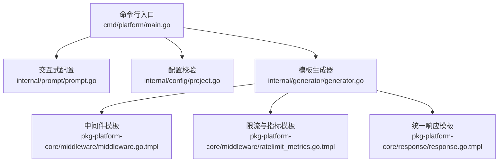
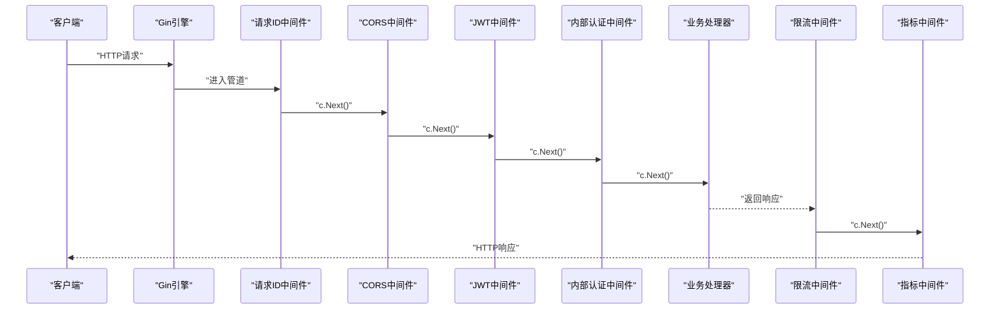
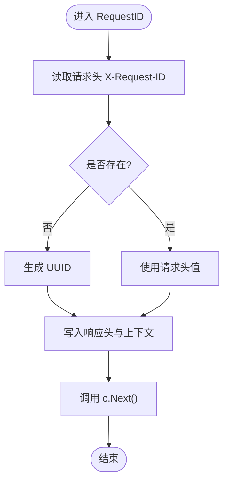
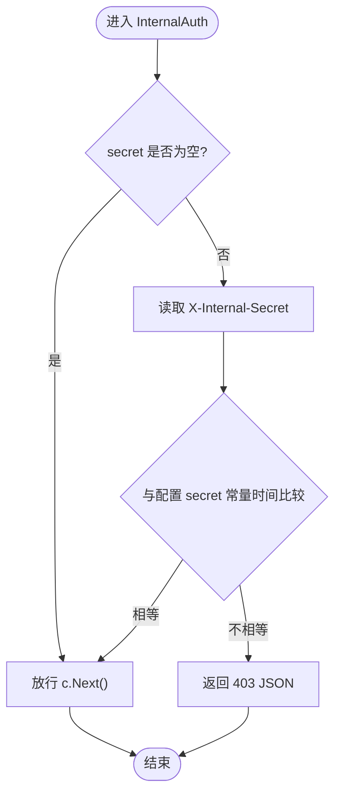
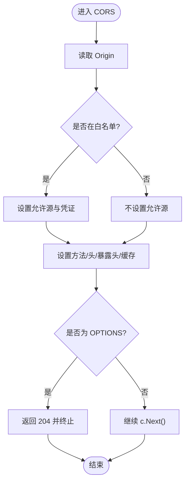
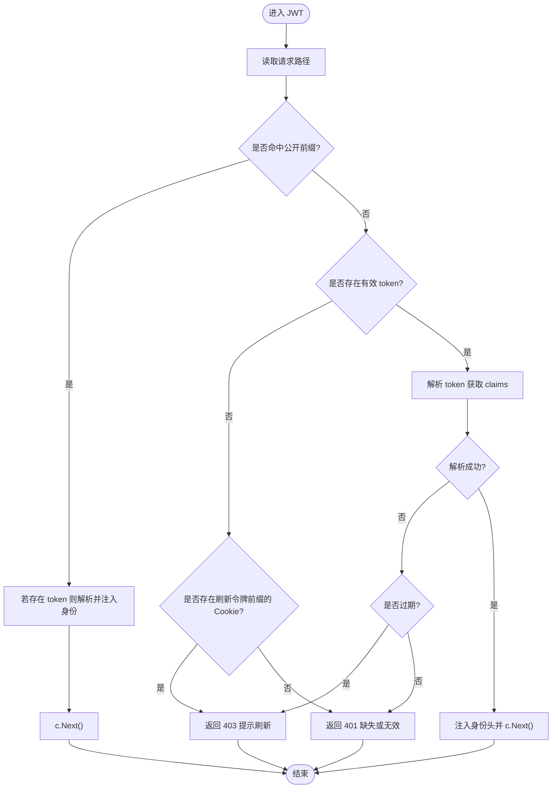
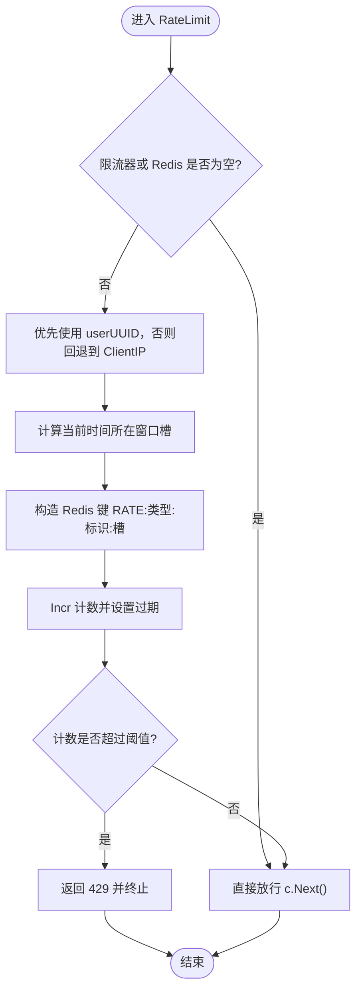
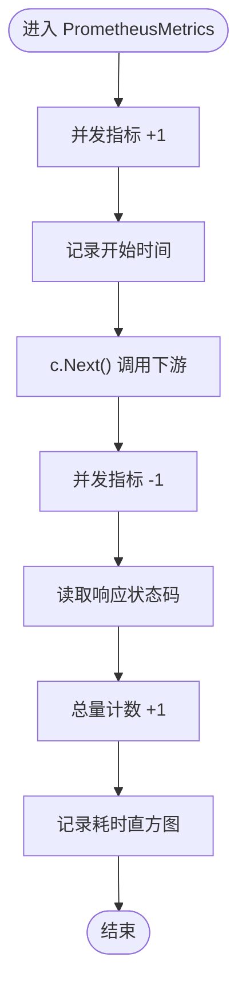
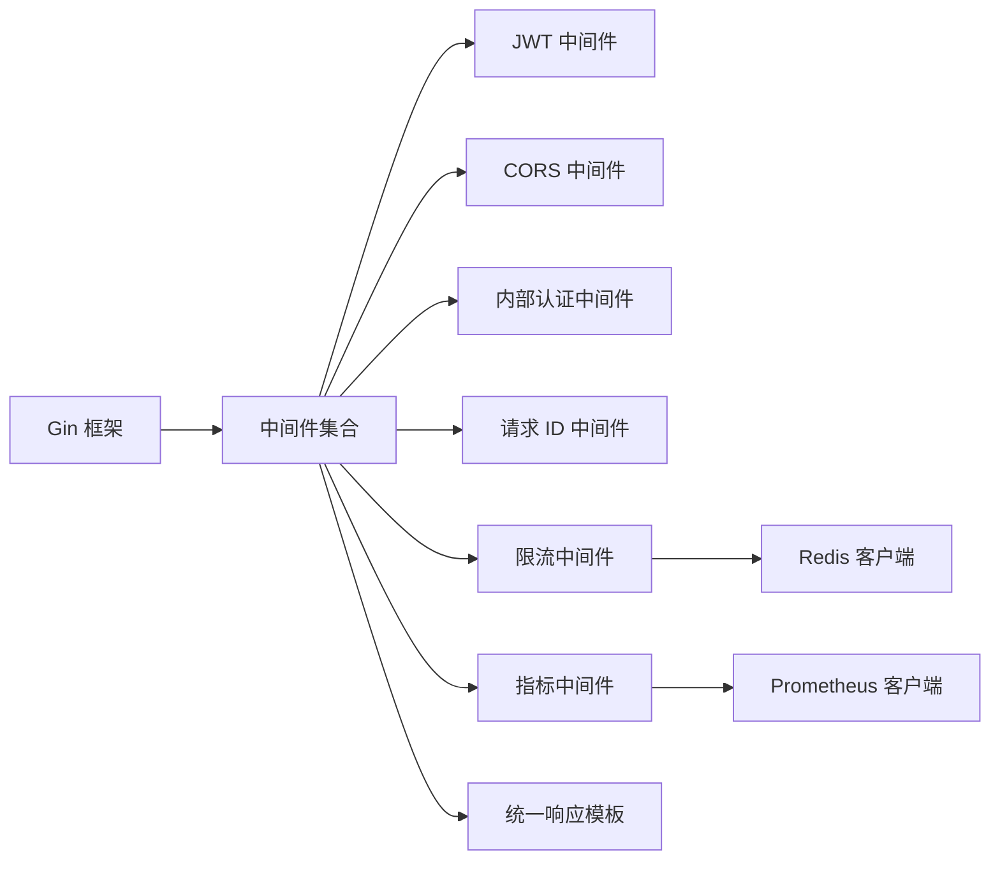

# 中间件框架

<cite>
**本文档引用的文件**
- [cmd/platform/main.go](file://cmd/platform/main.go)
- [internal/config/project.go](file://internal/config/project.go)
- [internal/generator/generator.go](file://internal/generator/generator.go)
- [internal/prompt/prompt.go](file://internal/prompt/prompt.go)
- [templates/files/pkg-platform-core/middleware/middleware.go.tmpl](file://templates/files/pkg-platform-core/middleware/middleware.go.tmpl)
- [templates/files/pkg-platform-core/middleware/ratelimit_metrics.go.tmpl](file://templates/files/pkg-platform-core/middleware/ratelimit_metrics.go.tmpl)
- [templates/files/pkg-platform-core/response/response.go.tmpl](file://templates/files/pkg-platform-core/response/response.go.tmpl)
</cite>

## 目录
1. [简介](#简介)
2. [项目结构](#项目结构)
3. [核心组件](#核心组件)
4. [架构总览](#架构总览)
5. [详细组件分析](#详细组件分析)
6. [依赖分析](#依赖分析)
7. [性能考虑](#性能考虑)
8. [故障排查指南](#故障排查指南)
9. [结论](#结论)
10. [附录](#附录)

## 简介
本中间件框架为 Go/Gin 应用提供通用的网关与 API 服务中间件能力，覆盖请求链路追踪、内部认证、跨域控制、JWT 身份校验、限流与 Prometheus 指标采集。框架以模板形式嵌入到脚手架工程中，便于在多个服务（网关、API、AI 引擎等）中复用统一的中间件策略。

## 项目结构
脚手架通过命令行入口生成项目骨架，模板中包含公共中间件与统一响应格式。核心结构如下：
- 命令行入口负责初始化、版本查询与生成流程编排
- 交互式配置收集与校验
- 模板渲染与文件生成
- 中间件模板（请求 ID、内部认证、CORS、JWT、限流、Prometheus 指标）
- 统一响应格式模板

图表来源
- [cmd/platform/main.go:22-98](file://cmd/platform/main.go#L22-L98)
- [internal/prompt/prompt.go:14-105](file://internal/prompt/prompt.go#L14-L105)
- [internal/config/project.go:62-106](file://internal/config/project.go#L62-L106)
- [internal/generator/generator.go:34-103](file://internal/generator/generator.go#L34-L103)
- [templates/files/pkg-platform-core/middleware/middleware.go.tmpl:1-202](file://templates/files/pkg-platform-core/middleware/middleware.go.tmpl#L1-L202)
- [templates/files/pkg-platform-core/middleware/ratelimit_metrics.go.tmpl:1-114](file://templates/files/pkg-platform-core/middleware/ratelimit_metrics.go.tmpl#L1-L114)
- [templates/files/pkg-platform-core/response/response.go.tmpl:1-78](file://templates/files/pkg-platform-core/response/response.go.tmpl#L1-L78)

章节来源
- [cmd/platform/main.go:22-98](file://cmd/platform/main.go#L22-L98)
- [internal/config/project.go:12-89](file://internal/config/project.go#L12-L89)
- [internal/generator/generator.go:23-103](file://internal/generator/generator.go#L23-L103)
- [internal/prompt/prompt.go:14-105](file://internal/prompt/prompt.go#L14-L105)

## 核心组件
- 请求 ID 中间件：生成或透传全链路请求 ID，并注入到上下文与响应头
- 内部认证中间件：校验内部私域路由专用密钥，保护 /internal/* 路由
- CORS 中间件：基于白名单 Origin 与允许凭证，暴露必要头部
- JWT 中间件：解析 Bearer Token，注入用户身份头；支持公开路径白名单与过期处理
- 限流中间件：基于 Redis 的固定窗口限流，按用户 UUID 或客户端 IP 限流，Redis 故障时 fail-open
- Prometheus 指标中间件：记录请求数总量、耗时直方图与并发请求数指标

章节来源
- [templates/files/pkg-platform-core/middleware/middleware.go.tmpl:24-202](file://templates/files/pkg-platform-core/middleware/middleware.go.tmpl#L24-L202)
- [templates/files/pkg-platform-core/middleware/ratelimit_metrics.go.tmpl:18-114](file://templates/files/pkg-platform-core/middleware/ratelimit_metrics.go.tmpl#L18-L114)
- [templates/files/pkg-platform-core/response/response.go.tmpl:26-78](file://templates/files/pkg-platform-core/response/response.go.tmpl#L26-L78)

## 架构总览
中间件在 Gin 路由器中以函数链的形式串联，形成请求处理管道。典型顺序为：请求 ID → CORS → JWT → 内部认证 → 业务处理器 → 限流 → 指标采集。每个中间件只关注自身职责，通过 c.Next() 传递控制权。

图表来源
- [templates/files/pkg-platform-core/middleware/middleware.go.tmpl:29-163](file://templates/files/pkg-platform-core/middleware/middleware.go.tmpl#L29-L163)
- [templates/files/pkg-platform-core/middleware/ratelimit_metrics.go.tmpl:33-113](file://templates/files/pkg-platform-core/middleware/ratelimit_metrics.go.tmpl#L33-L113)

## 详细组件分析

### 请求 ID 中间件
- 功能：若请求未携带 X-Request-ID，则生成 UUID 并设置到响应头与上下文；否则透传
- 关键点：使用随机字节生成 UUID，确保全局唯一性；将 requestID 存入 c.Set 以便后续中间件使用
- 使用场景：全链路日志关联、问题定位与审计

图表来源
- [templates/files/pkg-platform-core/middleware/middleware.go.tmpl:29-47](file://templates/files/pkg-platform-core/middleware/middleware.go.tmpl#L29-L47)

章节来源
- [templates/files/pkg-platform-core/middleware/middleware.go.tmpl:29-47](file://templates/files/pkg-platform-core/middleware/middleware.go.tmpl#L29-L47)

### 内部认证中间件
- 功能：校验 X-Internal-Secret 请求头，保护 /internal/* 私域路由
- 关键点：secret 为空时跳过验证（开发环境友好）；使用常量时间比较防止时序攻击
- 使用场景：内部系统间调用的安全边界

图表来源
- [templates/files/pkg-platform-core/middleware/middleware.go.tmpl:53-68](file://templates/files/pkg-platform-core/middleware/middleware.go.tmpl#L53-L68)

章节来源
- [templates/files/pkg-platform-core/middleware/middleware.go.tmpl:53-68](file://templates/files/pkg-platform-core/middleware/middleware.go.tmpl#L53-L68)

### CORS 中间件
- 功能：基于白名单 Origin 设置跨域响应头，允许凭证，暴露必要头部
- 关键点：默认允许常见业务头；支持额外自定义头；预检请求直接返回 204
- 使用场景：前后端分离、跨域资源共享

图表来源
- [templates/files/pkg-platform-core/middleware/middleware.go.tmpl:73-100](file://templates/files/pkg-platform-core/middleware/middleware.go.tmpl#L73-L100)

章节来源
- [templates/files/pkg-platform-core/middleware/middleware.go.tmpl:73-100](file://templates/files/pkg-platform-core/middleware/middleware.go.tmpl#L73-L100)

### JWT 中间件
- 功能：解析 Bearer Token，注入用户身份头；支持公开路径白名单；区分缺失与过期
- 关键点：PublicPathPrefixes 放行匿名访问但仍尝试解析 token；过期时返回 403 触发前端刷新
- 使用场景：鉴权与授权、用户身份透传

图表来源
- [templates/files/pkg-platform-core/middleware/middleware.go.tmpl:125-163](file://templates/files/pkg-platform-core/middleware/middleware.go.tmpl#L125-L163)

章节来源
- [templates/files/pkg-platform-core/middleware/middleware.go.tmpl:105-163](file://templates/files/pkg-platform-core/middleware/middleware.go.tmpl#L105-L163)

### 限流中间件（Redis 固定窗口）
- 功能：按用户 UUID 或客户端 IP 进行固定窗口限流，Redis 故障时 fail-open
- 关键点：窗口键为 RATE:类型:标识:槽；首次计数设置过期；超过阈值返回 429
- 使用场景：防刷、保护后端资源

图表来源
- [templates/files/pkg-platform-core/middleware/ratelimit_metrics.go.tmpl:33-66](file://templates/files/pkg-platform-core/middleware/ratelimit_metrics.go.tmpl#L33-L66)

章节来源
- [templates/files/pkg-platform-core/middleware/ratelimit_metrics.go.tmpl:20-66](file://templates/files/pkg-platform-core/middleware/ratelimit_metrics.go.tmpl#L20-L66)

### Prometheus 指标中间件
- 功能：记录请求数总量、耗时分布与并发请求数
- 关键点：标签包含方法、路径与状态；并发指标在进入与退出时增减
- 使用场景：可观测性、容量规划与告警

图表来源
- [templates/files/pkg-platform-core/middleware/ratelimit_metrics.go.gl.tmpl#L97-113:97-113](file://templates/files/pkg-platform-core/middleware/ratelimit_metrics.go.tmpl#L97-L113)

章节来源
- [templates/files/pkg-platform-core/middleware/ratelimit_metrics.go.tmpl:68-114](file://templates/files/pkg-platform-core/middleware/ratelimit_metrics.go.tmpl#L68-L114)

### 统一响应格式
- 功能：统一 {code, msg, data} 结构，映射常见 HTTP 状态码语义
- 关键点：OK/OKPage/BadRequest/Unauthorized/Forbidden/InternalError 等便捷方法
- 使用场景：前后端一致的错误与数据结构

章节来源
- [templates/files/pkg-platform-core/response/response.go.tmpl:26-78](file://templates/files/pkg-platform-core/response/response.go.tmpl#L26-L78)

## 依赖分析
- 中间件依赖 Gin 作为 Web 框架，通过 gin.HandlerFunc 形成管道
- 限流中间件依赖 Redis 客户端进行计数与过期控制
- 指标中间件依赖 Prometheus 客户端库进行指标上报
- 统一响应模板与中间件配合，保证错误与业务响应的一致性

图表来源
- [templates/files/pkg-platform-core/middleware/middleware.go.tmpl:12-22](file://templates/files/pkg-platform-core/middleware/middleware.go.tmpl#L12-L22)
- [templates/files/pkg-platform-core/middleware/ratelimit_metrics.go.tmpl:3-16](file://templates/files/pkg-platform-core/middleware/ratelimit_metrics.go.tmpl#L3-L16)
- [templates/files/pkg-platform-core/response/response.go.tmpl:20-24](file://templates/files/pkg-platform-core/response/response.go.tmpl#L20-L24)

章节来源
- [templates/files/pkg-platform-core/middleware/middleware.go.tmpl:12-22](file://templates/files/pkg-platform-core/middleware/middleware.go.tmpl#L12-L22)
- [templates/files/pkg-platform-core/middleware/ratelimit_metrics.go.tmpl:3-16](file://templates/files/pkg-platform-core/middleware/ratelimit_metrics.go.tmpl#L3-L16)
- [templates/files/pkg-platform-core/response/response.go.tmpl:20-24](file://templates/files/pkg-platform-core/response/response.go.tmpl#L20-L24)

## 性能考虑
- Redis 限流：固定窗口算法简单高效，适合大多数场景；注意窗口过小导致抖动，过大则响应性下降
- 指标开销：Prometheus 指标为轻量级内存计数，建议结合采样率与标签基数控制
- 中间件顺序：将短路逻辑靠前（如 CORS/内部认证），减少后续处理成本
- fail-open 策略：Redis 故障时放行，避免单点故障放大；建议配合熔断与降级策略

## 故障排查指南
- 请求 ID 未透传：检查请求头是否正确设置，确认中间件顺序与响应头写入
- CORS 失败：核对 Origin 是否在白名单，确认凭证与暴露头设置
- JWT 401/403：检查 Authorization 头格式、token 是否过期、公开路径配置
- 内部认证 403：确认 X-Internal-Secret 是否匹配，开发环境 secret 为空时会跳过
- 限流 429：检查 Redis 连接与键空间，确认阈值与窗口设置；观察 fail-open 行为
- 指标缺失：确认 Prometheus 客户端初始化与导出端点可用

章节来源
- [templates/files/pkg-platform-core/middleware/middleware.go.tmpl:29-163](file://templates/files/pkg-platform-core/middleware/middleware.go.tmpl#L29-L163)
- [templates/files/pkg-platform-core/middleware/ratelimit_metrics.go.tmpl:33-113](file://templates/files/pkg-platform-core/middleware/ratelimit_metrics.go.tmpl#L33-L113)
- [templates/files/pkg-platform-core/response/response.go.tmpl:46-77](file://templates/files/pkg-platform-core/response/response.go.tmpl#L46-L77)

## 结论
该中间件框架通过模板化的方式在多服务中复用统一的请求处理策略，具备良好的可维护性与扩展性。建议在实际项目中根据业务需求调整限流参数、CORS 白名单与指标标签，同时结合监控与告警体系完善可观测性。

## 附录
- 中间件注册与使用：在各服务的路由初始化阶段，按需组合中间件函数链，确保关键中间件（如请求 ID、CORS、JWT、内部认证、限流、指标）顺序合理
- 配置与自定义：可通过模板变量与配置对象扩展中间件行为；新增中间件时遵循 Gin 中间件模式，保持幂等与短路能力
- 调试技巧：利用请求 ID 关联日志，结合 Prometheus 查询与 Grafana 可视化定位性能瓶颈