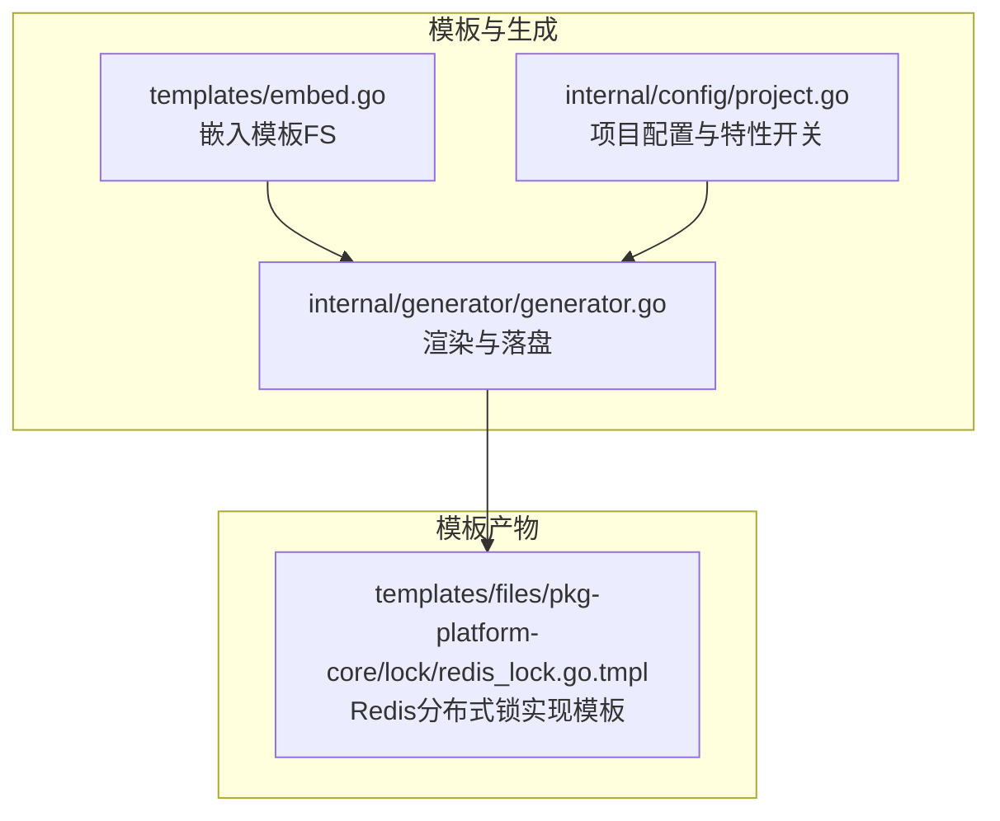
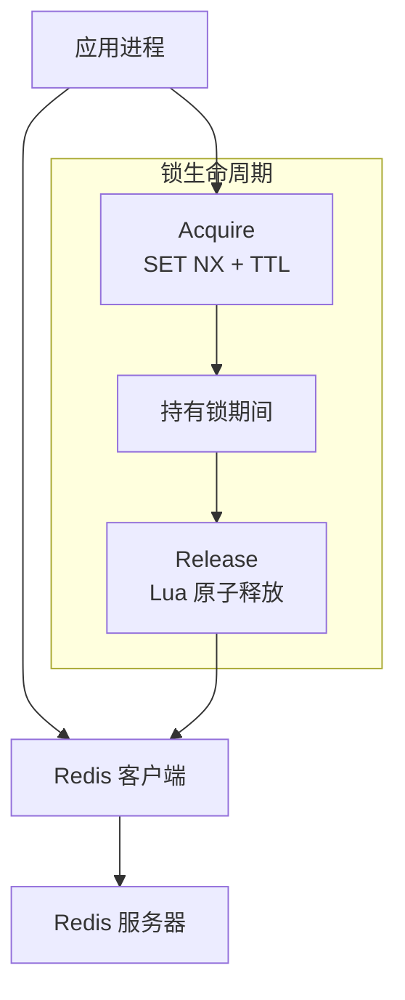
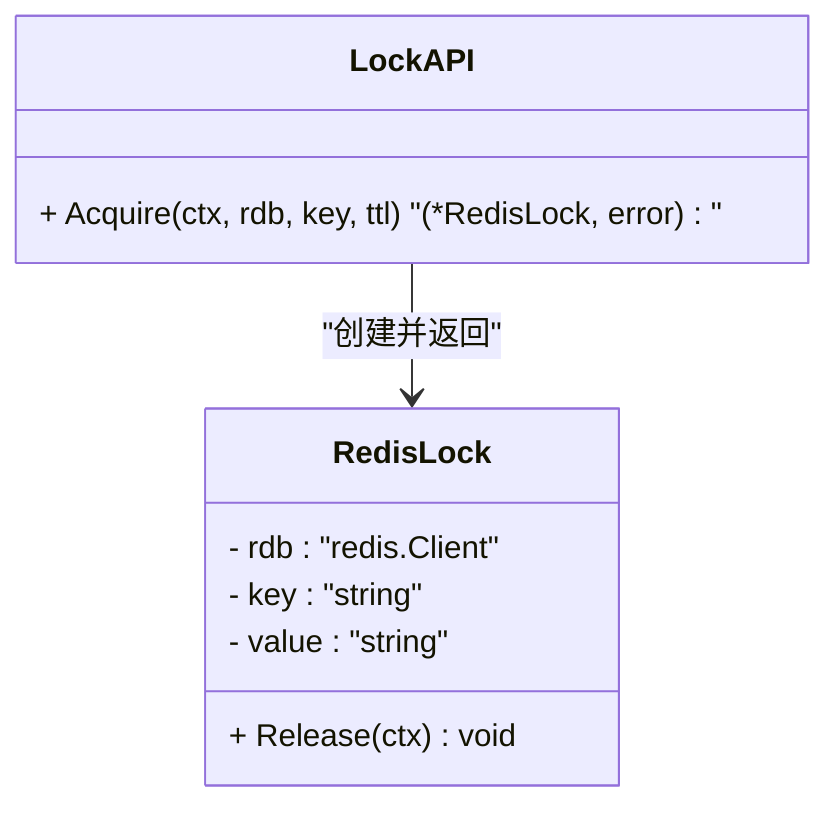
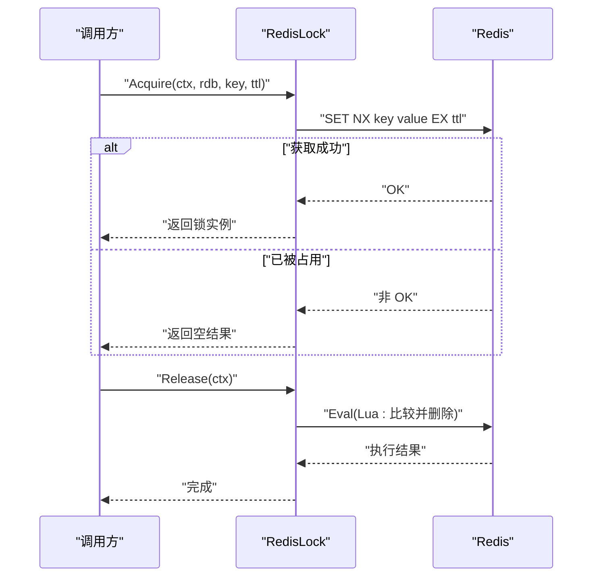
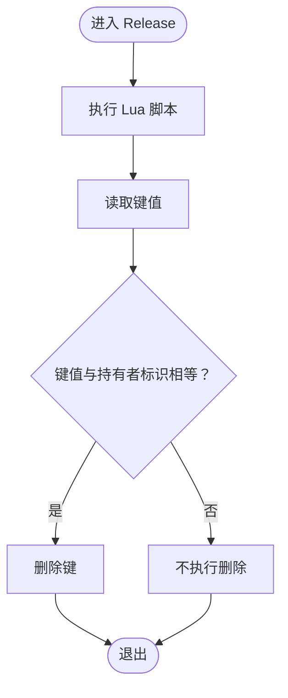
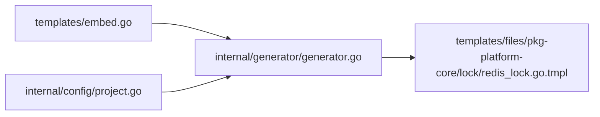

# 分布式锁

<cite>
**本文引用的文件**
- [redis_lock.go.tmpl](file://templates/files/pkg-platform-core/lock/redis_lock.go.tmpl)
- [embed.go](file://templates/embed.go)
- [generator.go](file://internal/generator/generator.go)
- [project.go](file://internal/config/project.go)
- [README.md](file://README.md)
</cite>

## 目录
1. [简介](#简介)
2. [项目结构](#项目结构)
3. [核心组件](#核心组件)
4. [架构概览](#架构概览)
5. [详细组件分析](#详细组件分析)
6. [依赖分析](#依赖分析)
7. [性能考虑](#性能考虑)
8. [故障排查指南](#故障排查指南)
9. [结论](#结论)
10. [附录](#附录)

## 简介
本文件面向使用 Redis 实现分布式锁的开发者，系统性阐述基于 Redis 的分布式互斥锁的设计与实现要点，包括锁获取、释放与超时处理策略，并给出并发控制、死锁预防与性能优化建议。该实现采用“SET NX + 过期时间 + Lua 原子释放”的经典模式，确保锁的互斥性与安全性。

## 项目结构
该仓库是一个脚手架工具，通过模板生成目标工程。与分布式锁直接相关的核心实现位于模板目录中，随生成流程输出到目标项目。关键位置如下：
- 模板根目录：templates/files
- 分布式锁实现模板：templates/files/pkg-platform-core/lock/redis_lock.go.tmpl
- 模板嵌入与生成逻辑：templates/embed.go、internal/generator/generator.go
- 项目配置与特性开关：internal/config/project.go
- 项目说明：README.md

**图表来源**
- [embed.go:1-11](file://templates/embed.go#L1-L11)
- [generator.go:33-103](file://internal/generator/generator.go#L33-L103)
- [project.go:12-89](file://internal/config/project.go#L12-L89)

**章节来源**
- [README.md:59-98](file://README.md#L59-L98)
- [embed.go:1-11](file://templates/embed.go#L1-L11)
- [generator.go:33-103](file://internal/generator/generator.go#L33-L103)
- [project.go:12-89](file://internal/config/project.go#L12-L89)

## 核心组件
- RedisLock 结构体：封装 Redis 客户端、锁键与持有者标识，作为锁实例。
- Acquire 函数：尝试获取锁（SET NX + TTL），成功返回锁实例，否则返回空结果表示冲突。
- Release 方法：通过 Lua 脚本原子判断持有者并删除键，避免误删他人持有的锁。

上述组件共同构成“基于 Redis 的分布式互斥锁”的最小可用实现。

**章节来源**
- [redis_lock.go.tmpl:23-48](file://templates/files/pkg-platform-core/lock/redis_lock.go.tmpl#L23-L48)

## 架构概览
下图展示分布式锁在系统中的角色与交互关系。应用通过 Redis 客户端访问 Redis，使用 SET NX 设置键值并设置过期时间，释放时通过 Lua 脚本校验持有者身份后删除键。

**图表来源**
- [redis_lock.go.tmpl:30-48](file://templates/files/pkg-platform-core/lock/redis_lock.go.tmpl#L30-L48)

## 详细组件分析

### 组件：RedisLock 与锁操作
- 数据结构
  - rdb：Redis 客户端指针
  - key：锁键名
  - value：持有者标识（UUID）
- 关键方法
  - Acquire：使用 SET NX + TTL 获取锁；失败返回空结果表示冲突
  - Release：使用 Lua 脚本仅在持有者匹配时删除键，保证原子性与安全性

**图表来源**
- [redis_lock.go.tmpl:23-48](file://templates/files/pkg-platform-core/lock/redis_lock.go.tmpl#L23-L48)

**章节来源**
- [redis_lock.go.tmpl:23-48](file://templates/files/pkg-platform-core/lock/redis_lock.go.tmpl#L23-L48)

### 流程：锁获取与释放
- 锁获取（Acquire）
  - 使用 SET NX 设置键值并设置过期时间，避免死锁
  - 成功则返回锁实例；失败返回空结果表示冲突
- 锁释放（Release）
  - 使用 Lua 脚本读取键值并与持有者标识比较
  - 匹配时删除键，否则不执行任何操作

**图表来源**
- [redis_lock.go.tmpl:30-48](file://templates/files/pkg-platform-core/lock/redis_lock.go.tmpl#L30-L48)

**章节来源**
- [redis_lock.go.tmpl:30-48](file://templates/files/pkg-platform-core/lock/redis_lock.go.tmpl#L30-L48)

### 算法流程：原子释放
- Lua 脚本仅在键值等于持有者标识时删除键，防止误删他人持有的锁
- 该策略确保即使在高并发场景下也能安全释放

**图表来源**
- [redis_lock.go.tmpl:20-21](file://templates/files/pkg-platform-core/lock/redis_lock.go.tmpl#L20-L21)
- [redis_lock.go.tmpl:45-48](file://templates/files/pkg-platform-core/lock/redis_lock.go.tmpl#L45-L48)

**章节来源**
- [redis_lock.go.tmpl:20-21](file://templates/files/pkg-platform-core/lock/redis_lock.go.tmpl#L20-L21)
- [redis_lock.go.tmpl:45-48](file://templates/files/pkg-platform-core/lock/redis_lock.go.tmpl#L45-L48)

## 依赖分析
- 模板嵌入与生成
  - templates/embed.go 将 templates/files 下的模板资源嵌入二进制
  - internal/generator/generator.go 遍历模板树，按规则渲染并写入目标目录
- 项目配置与特性开关
  - internal/config/project.go 定义 ProjectConfig，其中 Features 控制是否渲染特定模板树（如 pkg-platform-core）

**图表来源**
- [embed.go:1-11](file://templates/embed.go#L1-L11)
- [generator.go:33-103](file://internal/generator/generator.go#L33-L103)
- [project.go:54-59](file://internal/config/project.go#L54-L59)

**章节来源**
- [embed.go:1-11](file://templates/embed.go#L1-L11)
- [generator.go:33-103](file://internal/generator/generator.go#L33-L103)
- [project.go:54-59](file://internal/config/project.go#L54-L59)

## 性能考虑
- 锁粒度与热点
  - 为不同资源选择细粒度键名，避免热点竞争
- 过期时间与锁续期
  - TTL 应根据业务最长执行时间估算，避免过短导致频繁重试、过长导致资源浪费
  - 可结合业务场景引入“看门狗”式续期（在业务侧定期延长锁过期时间），但需注意幂等与一致性
- 并发与重试
  - 获取锁失败时采用指数退避重试，降低竞争峰值
- Lua 原子性
  - 通过 Lua 脚本保证释放的原子性，减少竞态条件

## 故障排查指南
- 获取锁失败
  - 检查键是否被他人持有；确认 TTL 是否过短
  - 确认 Redis 连接状态与网络延迟
- 无法释放锁
  - 确认持有者标识一致；检查 Lua 脚本执行是否异常
  - 核对键名拼写与作用域
- 死锁风险
  - 确保业务逻辑中释放锁的路径可达（如 defer 语句）
  - 对长时间任务考虑续期策略
- 性能问题
  - 观察锁竞争热点，必要时拆分键或引入多级缓存

## 结论
该实现以简洁可靠的模式实现了 Redis 分布式锁：通过 SET NX + TTL 防止死锁，通过 Lua 原子释放避免误删。配合合理的键设计、过期时间与重试策略，可在多数场景下满足互斥与一致性需求。对于更高要求的场景，可进一步引入续期与监控机制。

## 附录

### API 参考（基于模板实现）
- 类型
  - RedisLock：封装锁实例的结构体
- 函数与方法
  - Acquire(ctx, rdb, key, ttl)：尝试获取锁，成功返回锁实例，失败返回空结果
  - Release(ctx)：原子释放锁，仅释放当前持有者持有的锁

使用示例（模板注释中已提供）
- 示例路径：[redis_lock.go.tmpl:3-9](file://templates/files/pkg-platform-core/lock/redis_lock.go.tmpl#L3-L9)

**章节来源**
- [redis_lock.go.tmpl:3-9](file://templates/files/pkg-platform-core/lock/redis_lock.go.tmpl#L3-L9)