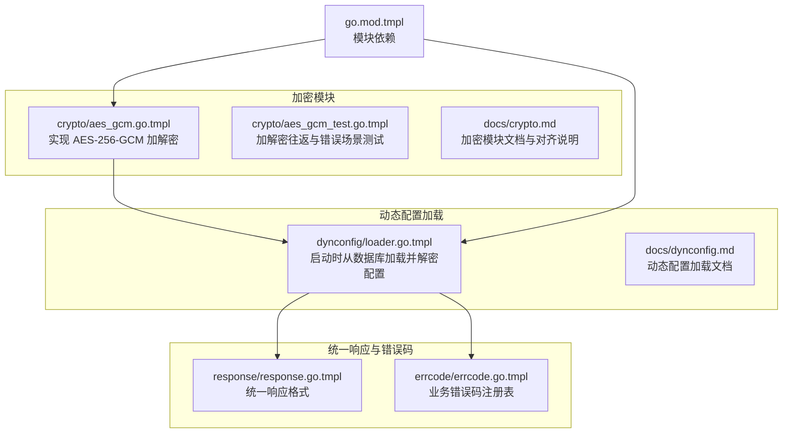
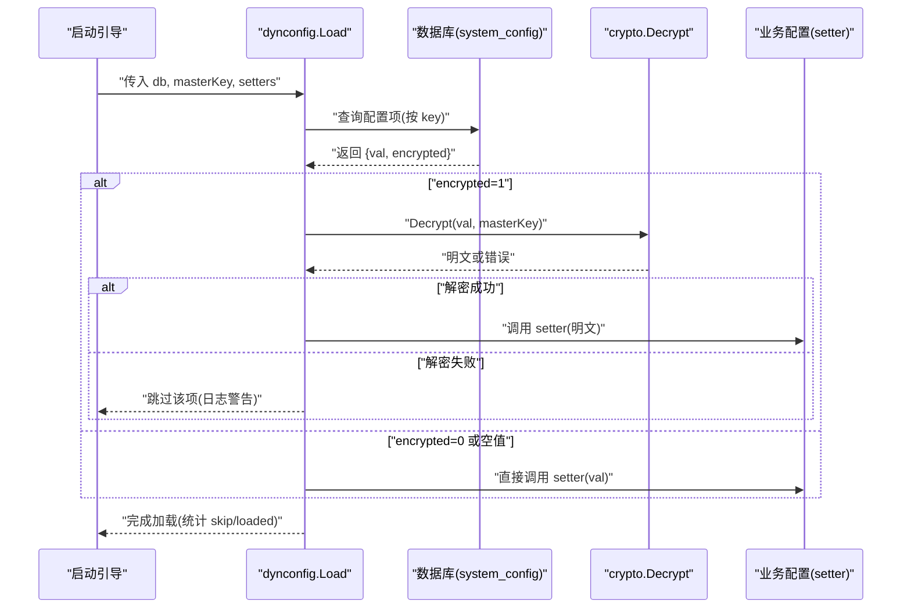
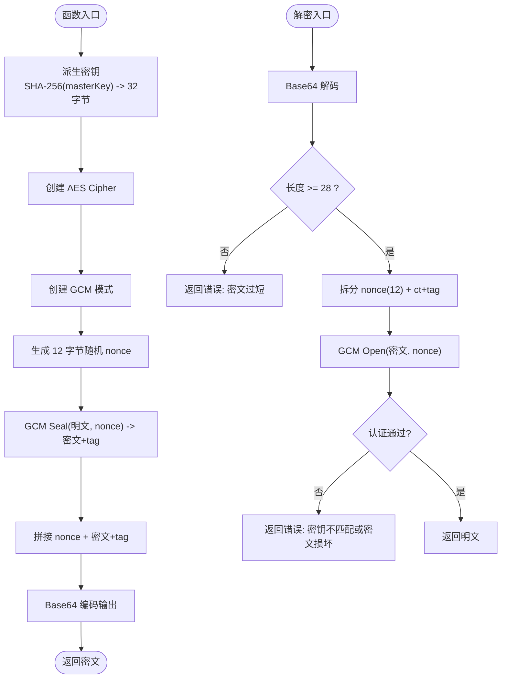
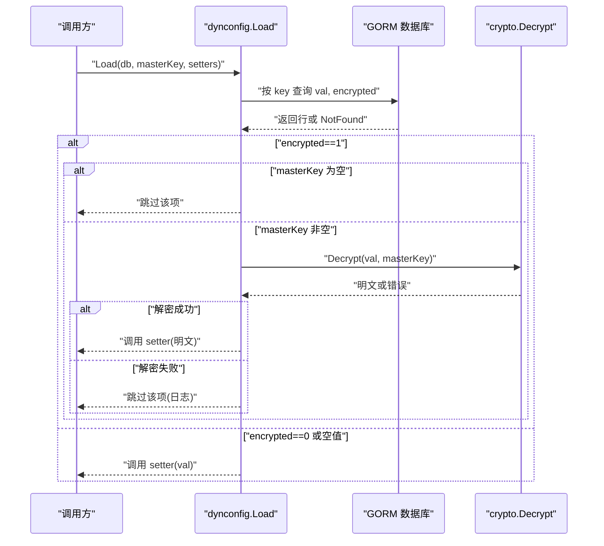
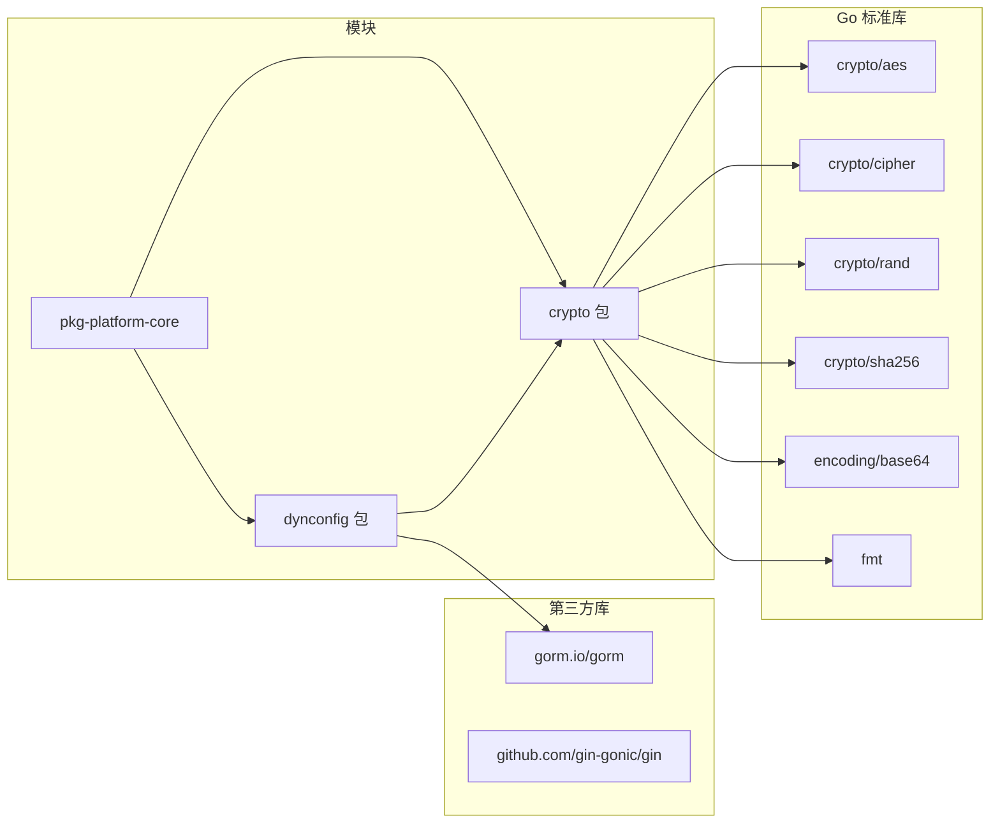

# 加密模块

<cite>
**本文引用的文件**
- [aes_gcm.go.tmpl](file://templates/files/pkg-platform-core/crypto/aes_gcm.go.tmpl)
- [aes_gcm_test.go.tmpl](file://templates/files/pkg-platform-core/crypto/aes_gcm_test.go.tmpl)
- [crypto.md](file://templates/files/pkg-platform-core/docs/crypto.md)
- [loader.go.tmpl](file://templates/files/pkg-platform-core/dynconfig/loader.go.tmpl)
- [dynconfig.md](file://templates/files/pkg-platform-core/docs/dynconfig.md)
- [go.mod.tmpl](file://templates/files/pkg-platform-core/go.mod.tmpl)
- [response.go.tmpl](file://templates/files/pkg-platform-core/response/response.go.tmpl)
- [errcode.go.tmpl](file://templates/files/pkg-platform-core/errcode/errcode.go.tmpl)
</cite>

## 目录
1. [简介](#简介)
2. [项目结构](#项目结构)
3. [核心组件](#核心组件)
4. [架构总览](#架构总览)
5. [详细组件分析](#详细组件分析)
6. [依赖分析](#依赖分析)
7. [性能考虑](#性能考虑)
8. [故障排查指南](#故障排查指南)
9. [结论](#结论)
10. [附录](#附录)

## 简介
本文件为平台加密模块的技术文档，聚焦于 AES-256-GCM 对称加解密的实现与集成。内容覆盖：
- AES-GCM 加密算法与密钥派生流程
- 加密/解密接口、认证标签处理与错误处理机制
- 与 Python 端的密文格式与密钥派生对齐
- 动态配置加载中的加密解密集成
- 安全最佳实践、密钥轮换策略、性能优化与测试用例分析

## 项目结构
加密模块位于 pkg-platform-core/crypto，配套文档与动态配置加载模块位于 docs 与 dynconfig 子目录。Go 模块定义位于 go.mod.tmpl。

**图表来源**
- [aes_gcm.go.tmpl:1-72](file://templates/files/pkg-platform-core/crypto/aes_gcm.go.tmpl#L1-L72)
- [aes_gcm_test.go.tmpl:1-28](file://templates/files/pkg-platform-core/crypto/aes_gcm_test.go.tmpl#L1-L28)
- [crypto.md:1-70](file://templates/files/pkg-platform-core/docs/crypto.md#L1-L70)
- [loader.go.tmpl:1-136](file://templates/files/pkg-platform-core/dynconfig/loader.go.tmpl#L1-L136)
- [dynconfig.md:1-68](file://templates/files/pkg-platform-core/docs/dynconfig.md#L1-L68)
- [go.mod.tmpl:1-12](file://templates/files/pkg-platform-core/go.mod.tmpl#L1-L12)
- [response.go.tmpl:1-78](file://templates/files/pkg-platform-core/response/response.go.tmpl#L1-L78)
- [errcode.go.tmpl:1-84](file://templates/files/pkg-platform-core/errcode/errcode.go.tmpl#L1-L84)

**章节来源**
- [go.mod.tmpl:1-12](file://templates/files/pkg-platform-core/go.mod.tmpl#L1-L12)

## 核心组件
- AES-GCM 加密器：提供加密与解密入口，采用固定 32 字节密钥（SHA-256 派生自 masterKey），随机 12 字节 nonce，认证标签 16 字节。
- 动态配置加载器：启动时从数据库表 system_config 拉取配置，对 encrypted=1 的项使用 masterKey 解密，并通过 setter 回调写入业务配置。
- 文档与测试：提供密文格式说明、与 Python 端对齐的密钥派生流程、基础加解密往返与错误场景测试。

**章节来源**
- [aes_gcm.go.tmpl:18-71](file://templates/files/pkg-platform-core/crypto/aes_gcm.go.tmpl#L18-L71)
- [loader.go.tmpl:64-116](file://templates/files/pkg-platform-core/dynconfig/loader.go.tmpl#L64-L116)
- [crypto.md:1-70](file://templates/files/pkg-platform-core/docs/crypto.md#L1-L70)
- [aes_gcm_test.go.tmpl:1-28](file://templates/files/pkg-platform-core/crypto/aes_gcm_test.go.tmpl#L1-L28)

## 架构总览
下图展示了从数据库到业务配置的动态加载链路，以及加密模块在其中的角色。

**图表来源**
- [loader.go.tmpl:64-116](file://templates/files/pkg-platform-core/dynconfig/loader.go.tmpl#L64-L116)
- [aes_gcm.go.tmpl:46-71](file://templates/files/pkg-platform-core/crypto/aes_gcm.go.tmpl#L46-L71)

## 详细组件分析

### AES-GCM 加密器
- 密钥派生：使用 SHA-256 将任意长度 masterKey 派生为 32 字节 AES-256 密钥，保证跨语言一致性。
- 加密流程：随机生成 12 字节 nonce；使用 GCM 模式密封明文得到密文与认证标签；将 nonce + 密文拼接并进行 Base64 编码输出。
- 解密流程：Base64 解码输入，校验长度；提取 12 字节 nonce 与剩余密文；使用相同密钥与 nonce 打开密文；若认证失败则返回错误。
- 错误处理：对底层 AES/GCM/随机数/编码等错误进行包装，解密失败明确提示“密钥不匹配或密文损坏”。

**图表来源**
- [aes_gcm.go.tmpl:18-71](file://templates/files/pkg-platform-core/crypto/aes_gcm.go.tmpl#L18-L71)

**章节来源**
- [aes_gcm.go.tmpl:18-71](file://templates/files/pkg-platform-core/crypto/aes_gcm.go.tmpl#L18-L71)
- [crypto.md:7-16](file://templates/files/pkg-platform-core/docs/crypto.md#L7-L16)

### 动态配置加载器
- 角色：在应用启动时从 system_config 表加载配置，对加密项使用 masterKey 解密，最终通过 setter 写入业务配置。
- 行为：
  - 默认表名与列名可通过 Options 自定义。
  - masterKey 为空时跳过加密项加载，其余明文项继续加载。
  - 数据库查询失败、解密失败均记录日志并跳过，不影响服务启动。
  - 仅启动时加载一次，不支持热更新。
- 集成点：内部导入 crypto 包并在加密项处调用 Decrypt。

**图表来源**
- [loader.go.tmpl:64-116](file://templates/files/pkg-platform-core/dynconfig/loader.go.tmpl#L64-L116)
- [aes_gcm.go.tmpl:46-71](file://templates/files/pkg-platform-core/crypto/aes_gcm.go.tmpl#L46-L71)

**章节来源**
- [loader.go.tmpl:1-136](file://templates/files/pkg-platform-core/dynconfig/loader.go.tmpl#L1-L136)
- [dynconfig.md:1-68](file://templates/files/pkg-platform-core/docs/dynconfig.md#L1-L68)

### 测试用例分析
- 往返测试：对同一明文与 masterKey 进行加密后再解密，断言明文一致。
- 错误场景：使用错误密钥解密应报错，验证解密失败路径。

**章节来源**
- [aes_gcm_test.go.tmpl:1-28](file://templates/files/pkg-platform-core/crypto/aes_gcm_test.go.tmpl#L1-L28)

## 依赖分析
- 模块依赖：Go 版本 1.22，依赖 gin、uuid、prometheus、redis、gorm 等。
- 加密模块内部依赖：crypto/aes、crypto/cipher、crypto/rand、crypto/sha256、encoding/base64、fmt。
- 动态配置模块依赖：gorm、crypto 包。

**图表来源**
- [go.mod.tmpl:1-12](file://templates/files/pkg-platform-core/go.mod.tmpl#L1-L12)
- [aes_gcm.go.tmpl:9-16](file://templates/files/pkg-platform-core/crypto/aes_gcm.go.tmpl#L9-L16)
- [loader.go.tmpl:21-27](file://templates/files/pkg-platform-core/dynconfig/loader.go.tmpl#L21-L27)

**章节来源**
- [go.mod.tmpl:1-12](file://templates/files/pkg-platform-core/go.mod.tmpl#L1-L12)

## 性能考虑
- 密钥派生：SHA-256 派生为常量时间 O(n)（n 为 masterKey 长度），在启动阶段执行，对运行时影响可忽略。
- 加解密：AES-GCM 为常数时间复杂度，单次调用成本低；Base64 编解码与内存拷贝为线性成本。
- 并发：加密器未内置并发控制，建议在业务侧按需并发调用；动态配置加载为启动时一次性操作。
- 内存：密文格式为 nonce + ct + tag 的拼接，避免额外分配；解密时会复制明文，注意大明文场景的内存峰值。
- I/O：动态配置加载依赖数据库查询，建议在启动阶段完成，避免热更新带来的重复解密。

[本节为通用性能讨论，无需特定文件引用]

## 故障排查指南
- 解密报错“密钥不匹配或密文损坏”：检查 masterKey 是否正确、是否与加密时一致；确认密文未被截断或篡改。
- “密文过短”：确认输入为 Base64 编码后的完整密文，且包含 nonce、密文与 tag。
- Base64 解码失败：确认输入字符串为合法 Base64。
- AES/GCM 初始化失败：检查密钥长度与底层库可用性。
- 动态配置加载跳过项：当 masterKey 为空或解密失败时会跳过，查看日志定位具体 key。
- 与 Python 端互通问题：确保密钥派生与密文格式一致，详见文档说明。

**章节来源**
- [aes_gcm.go.tmpl:46-71](file://templates/files/pkg-platform-core/crypto/aes_gcm.go.tmpl#L46-L71)
- [loader.go.tmpl:78-115](file://templates/files/pkg-platform-core/dynconfig/loader.go.tmpl#L78-L115)
- [crypto.md:64-70](file://templates/files/pkg-platform-core/docs/crypto.md#L64-L70)

## 结论
本加密模块以 AES-256-GCM 为核心，结合 SHA-256 密钥派生与标准 Base64 密文格式，实现了与 Python 端的完全对齐。动态配置加载器在启动阶段完成解密与赋值，具备优雅降级能力。整体设计简洁、边界清晰，适合在生产环境中使用。建议配合密钥轮换与运维流程，持续保障安全性与可维护性。

[本节为总结性内容，无需特定文件引用]

## 附录

### API 参考
- 加密
  - 函数签名：Encrypt(plaintext, masterKey) -> (ciphertext, error)
  - 输入：明文字符串、masterKey
  - 输出：Base64 编码的密文
- 解密
  - 函数签名：Decrypt(ciphertextB64, masterKey) -> (plaintext, error)
  - 输入：Base64 编码的密文、masterKey
  - 输出：明文字符串

使用示例（路径）
- [加密示例路径:9-12](file://templates/files/pkg-platform-core/crypto/aes_gcm_test.go.tmpl#L9-L12)
- [解密示例路径:13-16](file://templates/files/pkg-platform-core/crypto/aes_gcm_test.go.tmpl#L13-L16)

**章节来源**
- [aes_gcm.go.tmpl:24-71](file://templates/files/pkg-platform-core/crypto/aes_gcm.go.tmpl#L24-L71)
- [aes_gcm_test.go.tmpl:5-20](file://templates/files/pkg-platform-core/crypto/aes_gcm_test.go.tmpl#L5-L20)

### 密钥管理与安全策略
- 密钥注入：masterKey 必须通过环境变量注入，不得硬编码。
- 降级策略：masterKey 为空时跳过加密项加载，服务仍可启动。
- 密钥轮换：更换 masterKey 后，旧密文无法解密，需先解密再重新加密或通过后台重写。
- 密文格式：Base64(nonce_12 + ciphertext + tag_16)，相同明文 + 相同密钥每次结果不同（nonce 随机）。

**章节来源**
- [crypto.md:64-70](file://templates/files/pkg-platform-core/docs/crypto.md#L64-L70)

### 与 Python 端对齐
- 密钥派生：Go 端 sha256.Sum256 与 Python 端 hashlib.sha256 输出一致。
- 密文格式：完全一致，便于跨语言互通。

**章节来源**
- [crypto.md:36-62](file://templates/files/pkg-platform-core/docs/crypto.md#L36-L62)

### 错误码与统一响应
- 统一响应格式：{code, msg, data}，HTTP 状态码与业务错误码分离。
- 错误码注册：提供通用错误码集合，支持 Wrap 携带运行时上下文。

**章节来源**
- [response.go.tmpl:26-77](file://templates/files/pkg-platform-core/response/response.go.tmpl#L26-L77)
- [errcode.go.tmpl:11-83](file://templates/files/pkg-platform-core/errcode/errcode.go.tmpl#L11-L83)