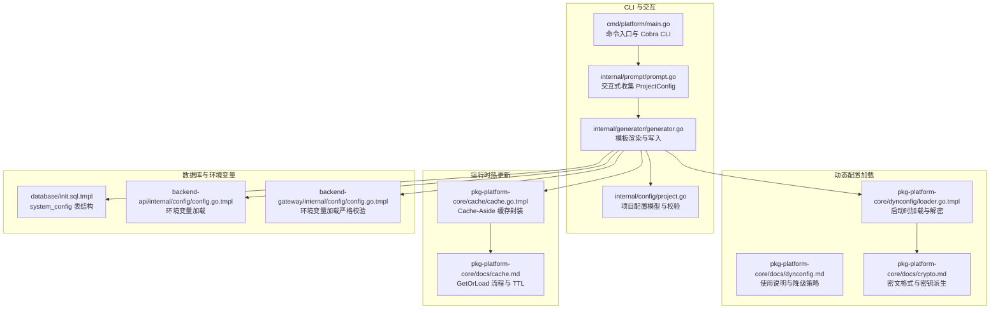
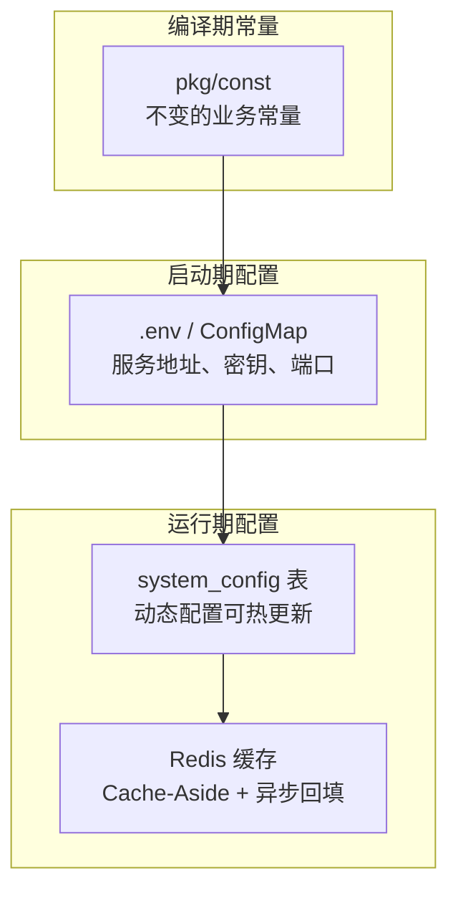
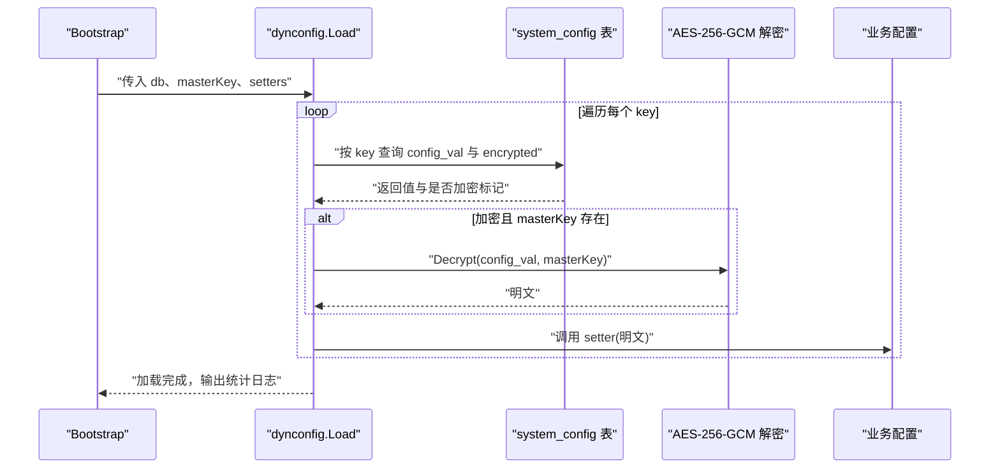
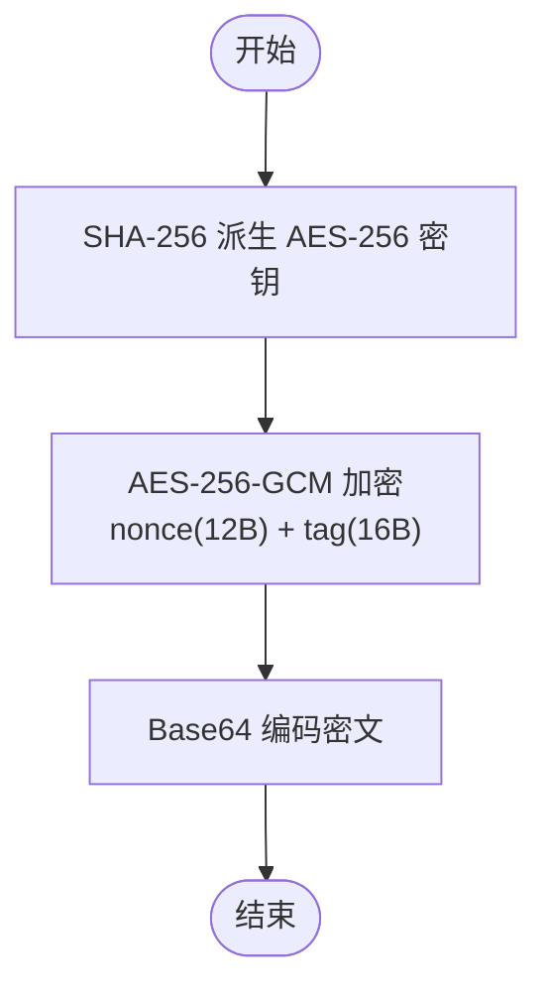
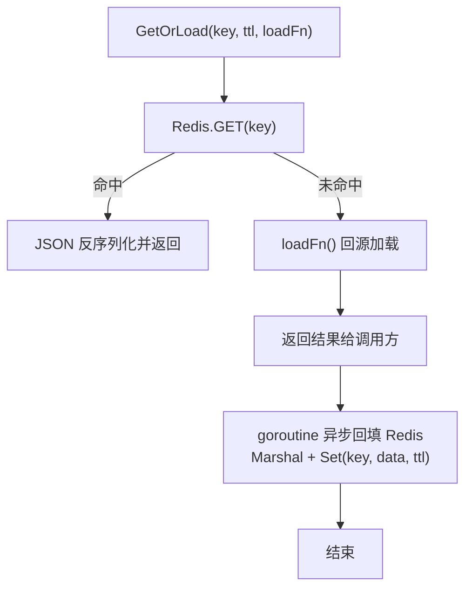
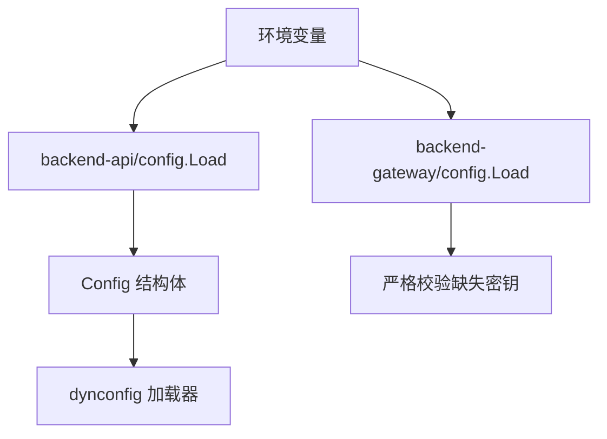
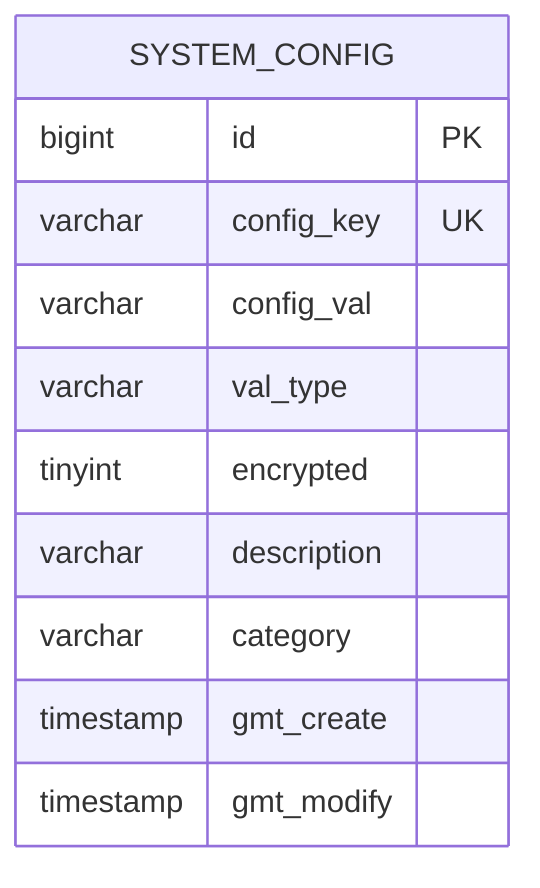
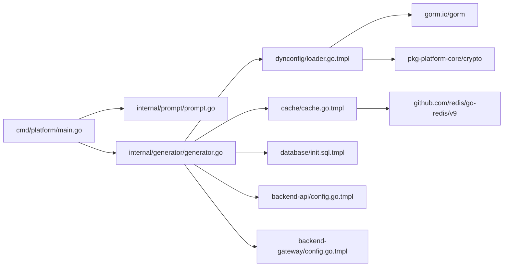

# 动态配置

<cite>
**本文引用的文件**
- [cmd/platform/main.go](file://cmd/platform/main.go)
- [internal/config/project.go](file://internal/config/project.go)
- [internal/generator/generator.go](file://internal/generator/generator.go)
- [internal/prompt/prompt.go](file://internal/prompt/prompt.go)
- [templates/files/pkg-platform-core/dynconfig/loader.go.tmpl](file://templates/files/pkg-platform-core/dynconfig/loader.go.tmpl)
- [templates/files/pkg-platform-core/docs/dynconfig.md](file://templates/files/pkg-platform-core/docs/dynconfig.md)
- [templates/files/pkg-platform-core/docs/crypto.md](file://templates/files/pkg-platform-core/docs/crypto.md)
- [templates/files/pkg-platform-core/docs/cache.md](file://templates/files/pkg-platform-core/docs/cache.md)
- [templates/files/pkg-platform-core/cache/cache.go.tmpl](file://templates/files/pkg-platform-core/cache/cache.go.tmpl)
- [templates/files/backend-api/internal/config/config.go.tmpl](file://templates/files/backend-api/internal/config/config.go.tmpl)
- [templates/files/backend-gateway/internal/config/config.go.tmpl](file://templates/files/backend-gateway/internal/config/config.go.tmpl)
- [templates/files/database/init.sql.tmpl](file://templates/files/database/init.sql.tmpl)
</cite>

## 目录
1. [简介](#简介)
2. [项目结构](#项目结构)
3. [核心组件](#核心组件)
4. [架构总览](#架构总览)
5. [组件详解](#组件详解)
6. [依赖关系分析](#依赖关系分析)
7. [性能考量](#性能考量)
8. [故障排除指南](#故障排除指南)
9. [结论](#结论)
10. [附录](#附录)

## 简介
本文件面向“动态配置系统”的技术文档，聚焦于以下方面：
- 配置加载机制：启动时从数据库表 system_config 拉取配置，支持加密字段的解密与回退。
- 热更新策略：当前启动时加载（非热更新），运行时热更新通过 Redis 缓存 + 定时刷新实现。
- 环境变量处理：通过环境变量注入主密钥 CONFIG_MASTER_KEY，以及各服务的基础启动参数。
- 配置源管理、优先级与回退：明确“编译期常量”“启动期配置”“运行期配置”的分层与回退策略。
- 配置文件格式、加载流程与使用示例：给出 system_config 表结构、加载 API、典型用法与注意事项。
- 配置验证、安全考虑与故障排除：涵盖密文格式、密钥派生、降级行为与常见问题排查。

## 项目结构
动态配置能力由 CLI 脚手架生成的模板代码提供，核心涉及三类文件：
- CLI 与交互：收集项目配置、渲染模板、写入文件。
- 动态配置加载：启动时从数据库表 system_config 读取并解密，写入业务配置。
- 运行时热更新：通过 Redis 缓存 + 定时刷新实现，具备异步回填与批量失效能力。

**图示来源**
- [cmd/platform/main.go:1-98](file://cmd/platform/main.go#L1-L98)
- [internal/prompt/prompt.go:1-131](file://internal/prompt/prompt.go#L1-L131)
- [internal/generator/generator.go:1-158](file://internal/generator/generator.go#L1-L158)
- [internal/config/project.go:1-121](file://internal/config/project.go#L1-L121)
- [templates/files/pkg-platform-core/dynconfig/loader.go.tmpl:1-136](file://templates/files/pkg-platform-core/dynconfig/loader.go.tmpl#L1-L136)
- [templates/files/pkg-platform-core/docs/dynconfig.md:1-68](file://templates/files/pkg-platform-core/docs/dynconfig.md#L1-L68)
- [templates/files/pkg-platform-core/docs/crypto.md:1-70](file://templates/files/pkg-platform-core/docs/crypto.md#L1-L70)
- [templates/files/pkg-platform-core/cache/cache.go.tmpl:1-92](file://templates/files/pkg-platform-core/cache/cache.go.tmpl#L1-L92)
- [templates/files/pkg-platform-core/docs/cache.md:1-61](file://templates/files/pkg-platform-core/docs/cache.md#L1-L61)
- [templates/files/database/init.sql.tmpl:1-123](file://templates/files/database/init.sql.tmpl#L1-L123)
- [templates/files/backend-api/internal/config/config.go.tmpl:1-81](file://templates/files/backend-api/internal/config/config.go.tmpl#L1-L81)
- [templates/files/backend-gateway/internal/config/config.go.tmpl:88-126](file://templates/files/backend-gateway/internal/config/config.go.tmpl#L88-L126)

**章节来源**
- [cmd/platform/main.go:1-98](file://cmd/platform/main.go#L1-L98)
- [internal/prompt/prompt.go:1-131](file://internal/prompt/prompt.go#L1-L131)
- [internal/generator/generator.go:1-158](file://internal/generator/generator.go#L1-L158)
- [internal/config/project.go:1-121](file://internal/config/project.go#L1-L121)

## 核心组件
- 动态配置加载器（启动时加载）
  - 作用：在应用启动时从 system_config 表加载配置项，自动解密加密值，并通过回调写入业务配置。
  - 特性：仅启动时加载一次，不支持热更新；支持自定义表名/列名；优雅降级（失败仅记录日志，不阻断启动）。
  - 关键 API：Load、LoadWithOptions、Options、Setter。
- 加密与解密
  - 作用：对 encrypted=1 的敏感配置采用 AES-256-GCM 加密，密文格式与 Python 端互通。
  - 关键 API：Encrypt、Decrypt；密钥派生采用 SHA-256。
- 运行时热更新缓存
  - 作用：基于 Redis 的 Cache-Aside，提供 GetOrLoad 泛型接口，miss 时回源并异步回填，不阻塞主流程。
  - 关键 API：GetOrLoad、Set、Get、Invalidate、InvalidatePattern。
- 环境变量与配置源
  - 作用：通过环境变量注入 CONFIG_MASTER_KEY、数据库与 Redis 连接参数、服务端口等。
  - 关键点：严格必填项与回退值，确保服务在缺少环境变量时能稳定运行。

**章节来源**
- [templates/files/pkg-platform-core/dynconfig/loader.go.tmpl:1-136](file://templates/files/pkg-platform-core/dynconfig/loader.go.tmpl#L1-L136)
- [templates/files/pkg-platform-core/docs/dynconfig.md:1-68](file://templates/files/pkg-platform-core/docs/dynconfig.md#L1-L68)
- [templates/files/pkg-platform-core/docs/crypto.md:1-70](file://templates/files/pkg-platform-core/docs/crypto.md#L1-L70)
- [templates/files/pkg-platform-core/cache/cache.go.tmpl:1-92](file://templates/files/pkg-platform-core/cache/cache.go.tmpl#L1-L92)
- [templates/files/pkg-platform-core/docs/cache.md:1-61](file://templates/files/pkg-platform-core/docs/cache.md#L1-L61)
- [templates/files/backend-api/internal/config/config.go.tmpl:1-81](file://templates/files/backend-api/internal/config/config.go.tmpl#L1-L81)
- [templates/files/backend-gateway/internal/config/config.go.tmpl:88-126](file://templates/files/backend-gateway/internal/config/config.go.tmpl#L88-L126)

## 架构总览
动态配置系统分为三层：
- 编译期常量：业务常量（错误码、枚举值）。
- 启动期配置：通过 .env 或 ConfigMap 注入的启动参数（服务地址、密钥、端口等）。
- 运行期配置：system_config 表中的动态配置，支持热更新（Redis 缓存 + 定时刷新）。

**图示来源**
- [templates/files/CLAUDE.md.tmpl:48-66](file://templates/files/CLAUDE.md.tmpl#L48-L66)
- [templates/files/pkg-platform-core/docs/dynconfig.md:1-68](file://templates/files/pkg-platform-core/docs/dynconfig.md#L1-L68)
- [templates/files/pkg-platform-core/docs/cache.md:1-61](file://templates/files/pkg-platform-core/docs/cache.md#L1-L61)

## 组件详解

### 动态配置加载器（启动时加载）
- 加载流程
  - 读取 Options 默认值（表名、键列、值列、加密列、日志前缀）。
  - 遍历 setters，逐个查找对应的配置项。
  - 若记录存在且为加密项，使用 CONFIG_MASTER_KEY 解密后再写入。
  - 记录加载与跳过的统计，并输出日志。
- 优雅降级
  - masterKey 为空：跳过所有 encrypted=1 的项。
  - 数据库查询失败：记录警告并跳过该 key。
  - 解密失败：记录警告并跳过该 key。
  - key 不存在：跳过（setter 不调用）。
- 使用示例
  - 在 bootstrap 中调用 Load，将 system_config 的值写入业务配置对象。
  - 如需自定义表结构，使用 LoadWithOptions 传入 Options。
- 注意事项
  - 仅启动时加载，修改不会自动生效，需重启服务。
  - Setter 中不要做耗时操作，Load 是同步阻塞的。
  - 如需热更新，使用 cache.GetOrLoad + Redis TTL 的方案。

**图示来源**
- [templates/files/pkg-platform-core/dynconfig/loader.go.tmpl:64-116](file://templates/files/pkg-platform-core/dynconfig/loader.go.tmpl#L64-L116)
- [templates/files/pkg-platform-core/docs/dynconfig.md:1-68](file://templates/files/pkg-platform-core/docs/dynconfig.md#L1-L68)

**章节来源**
- [templates/files/pkg-platform-core/dynconfig/loader.go.tmpl:1-136](file://templates/files/pkg-platform-core/dynconfig/loader.go.tmpl#L1-L136)
- [templates/files/pkg-platform-core/docs/dynconfig.md:1-68](file://templates/files/pkg-platform-core/docs/dynconfig.md#L1-L68)

### 加密与解密（AES-256-GCM）
- 密文格式
  - Base64(nonce + ciphertext + tag)，其中 nonce 12 字节，tag 16 字节。
  - 相同明文 + 相同密钥，每次加密结果不同（nonce 随机）。
- 密钥派生
  - masterKey 经 SHA-256 派生为 32 字节 AES-256 密钥。
  - Go 与 Python 端密钥派生一致，密文格式互通。
- 安全注意事项
  - masterKey 必须通过环境变量注入，不要硬编码。
  - 更换 masterKey 后，旧密文无法解密，需先解密再重新加密或通过后台重写。

**图示来源**
- [templates/files/pkg-platform-core/docs/crypto.md:1-70](file://templates/files/pkg-platform-core/docs/crypto.md#L1-L70)

**章节来源**
- [templates/files/pkg-platform-core/docs/crypto.md:1-70](file://templates/files/pkg-platform-core/docs/crypto.md#L1-L70)

### 运行时热更新缓存（Redis + 定时刷新）
- Cache-Aside 模式
  - GetOrLoad：先查 Redis，命中则返回；未命中则调用回源函数加载，随后异步回填 Redis。
  - InvalidatePattern：使用 SCAN 而非 KEYS，避免阻塞 Redis。
- TTL 与回源
  - 建议为动态配置设置 5 分钟 TTL。
  - 回源函数返回后立即给调用方，回填在后台 goroutine，极端情况下可能出现“惊群”（thundering herd）。
- 使用示例
  - 通过 cache.GetOrLoad 获取动态配置，miss 时回源数据库并异步写入缓存。
  - 通过 InvalidatePattern 批量失效相关缓存，触发下次访问时回源刷新。

**图示来源**
- [templates/files/pkg-platform-core/cache/cache.go.tmpl:28-58](file://templates/files/pkg-platform-core/cache/cache.go.tmpl#L28-L58)
- [templates/files/pkg-platform-core/docs/cache.md:1-61](file://templates/files/pkg-platform-core/docs/cache.md#L1-L61)

**章节来源**
- [templates/files/pkg-platform-core/cache/cache.go.tmpl:1-92](file://templates/files/pkg-platform-core/cache/cache.go.tmpl#L1-L92)
- [templates/files/pkg-platform-core/docs/cache.md:1-61](file://templates/files/pkg-platform-core/docs/cache.md#L1-L61)

### 环境变量与配置源
- 启动期配置（API 服务）
  - 通过环境变量注入端口、数据库连接、Redis 连接、内部密钥与 CONFIG_MASTER_KEY。
  - 支持回退值，若环境变量为空则使用模板默认值。
- 网关服务（严格校验）
  - 对缺失的必需密钥直接 panic，确保安全。
- 主密钥注入
  - CONFIG_MASTER_KEY 用于动态配置解密，必须通过环境变量注入。

**图示来源**
- [templates/files/backend-api/internal/config/config.go.tmpl:42-81](file://templates/files/backend-api/internal/config/config.go.tmpl#L42-L81)
- [templates/files/backend-gateway/internal/config/config.go.tmpl:88-126](file://templates/files/backend-gateway/internal/config/config.go.tmpl#L88-L126)
- [templates/files/pkg-platform-core/docs/dynconfig.md:59-61](file://templates/files/pkg-platform-core/docs/dynconfig.md#L59-L61)

**章节来源**
- [templates/files/backend-api/internal/config/config.go.tmpl:1-81](file://templates/files/backend-api/internal/config/config.go.tmpl#L1-L81)
- [templates/files/backend-gateway/internal/config/config.go.tmpl:88-126](file://templates/files/backend-gateway/internal/config/config.go.tmpl#L88-L126)

### 配置文件格式与加载流程
- system_config 表结构
  - 包含 config_key、config_val、val_type、encrypted、description、category 等字段。
  - 唯一键为 config_key，确保唯一性。
- 加载流程
  - 启动时通过 dynconfig.Load 读取 system_config，按 key 查找并写入业务配置。
  - 加密项使用 AES-256-GCM 解密，失败或缺失时优雅降级。
- 使用示例
  - 在 bootstrap 中注册 setters，调用 Load 完成配置注入。
  - 如需自定义表结构，使用 LoadWithOptions 传入 Options。

**图示来源**
- [templates/files/database/init.sql.tmpl:86-101](file://templates/files/database/init.sql.tmpl#L86-L101)

**章节来源**
- [templates/files/database/init.sql.tmpl:1-123](file://templates/files/database/init.sql.tmpl#L1-L123)
- [templates/files/pkg-platform-core/dynconfig/loader.go.tmpl:64-116](file://templates/files/pkg-platform-core/dynconfig/loader.go.tmpl#L64-L116)

## 依赖关系分析
- CLI 与模板渲染
  - main.go 作为 CLI 入口，调用 prompt 与 generator，最终生成包含动态配置加载器与缓存组件的项目骨架。
- 动态配置加载器依赖
  - 依赖 GORM 进行数据库查询。
  - 依赖 crypto 包进行 AES-256-GCM 解密。
- 运行时热更新依赖
  - 依赖 Redis 客户端进行缓存读写。
  - 依赖 goroutine 异步回填，避免阻塞主流程。
- 环境变量依赖
  - CONFIG_MASTER_KEY 用于解密；数据库与 Redis 连接参数用于建立连接。

**图示来源**
- [cmd/platform/main.go:1-98](file://cmd/platform/main.go#L1-L98)
- [internal/prompt/prompt.go:1-131](file://internal/prompt/prompt.go#L1-L131)
- [internal/generator/generator.go:1-158](file://internal/generator/generator.go#L1-L158)
- [templates/files/pkg-platform-core/dynconfig/loader.go.tmpl:21-27](file://templates/files/pkg-platform-core/dynconfig/loader.go.tmpl#L21-L27)
- [templates/files/pkg-platform-core/cache/cache.go.tmpl:9-16](file://templates/files/pkg-platform-core/cache/cache.go.tmpl#L9-L16)
- [templates/files/database/init.sql.tmpl:86-101](file://templates/files/database/init.sql.tmpl#L86-L101)
- [templates/files/backend-api/internal/config/config.go.tmpl:1-81](file://templates/files/backend-api/internal/config/config.go.tmpl#L1-L81)
- [templates/files/backend-gateway/internal/config/config.go.tmpl:88-126](file://templates/files/backend-gateway/internal/config/config.go.tmpl#L88-L126)

**章节来源**
- [cmd/platform/main.go:1-98](file://cmd/platform/main.go#L1-L98)
- [internal/generator/generator.go:1-158](file://internal/generator/generator.go#L1-L158)

## 性能考量
- 启动时加载
  - Load 是同步阻塞的，Setter 中避免耗时操作，以免影响启动时间。
- 运行时热更新
  - GetOrLoad 采用异步回填，不阻塞主流程；但可能产生“惊群”现象，必要时可在回源函数中加入分布式锁。
  - 使用 InvalidatePattern 时建议分批扫描与删除，避免一次性删除过多 key。
- 缓存 TTL
  - 动态配置建议 5 分钟 TTL，兼顾新鲜度与回源压力。
- 数据库与 Redis
  - 合理设置连接池大小与超时时间，避免在高并发下成为瓶颈。

## 故障排除指南
- masterKey 为空
  - 现象：加密项被跳过，服务仍可启动。
  - 处理：注入 CONFIG_MASTER_KEY 后重启服务。
- 数据库查询失败
  - 现象：日志警告并跳过该 key。
  - 处理：检查数据库连接、表结构与权限。
- 解密失败
  - 现象：日志警告并跳过该 key。
  - 处理：确认密文格式正确、masterKey 未变更；如已更换 masterKey，需重新加密或通过后台重写。
- key 不存在
  - 现象：跳过（setter 不调用，业务配置保持零值）。
  - 处理：在 system_config 中添加对应配置项。
- 环境变量缺失
  - 现象：API 服务回退到默认值；网关服务直接 panic。
  - 处理：补齐 .env 或 ConfigMap 中的必需环境变量。

**章节来源**
- [templates/files/pkg-platform-core/docs/dynconfig.md:34-43](file://templates/files/pkg-platform-core/docs/dynconfig.md#L34-L43)
- [templates/files/pkg-platform-core/docs/crypto.md:64-69](file://templates/files/pkg-platform-core/docs/crypto.md#L64-L69)
- [templates/files/backend-gateway/internal/config/config.go.tmpl:95-101](file://templates/files/backend-gateway/internal/config/config.go.tmpl#L95-L101)

## 结论
动态配置系统通过“启动时加载 + 运行时热更新”的双通道设计，实现了从数据库表 system_config 中安全地加载与解密敏感配置，并在运行时通过 Redis 缓存实现低延迟与高可用。结合严格的环境变量注入与优雅降级策略，系统在新部署与运维过程中具备良好的稳定性与可维护性。

## 附录
- 配置源优先级与回退
  - 编译期常量：不可变，优先级最高。
  - 启动期配置：通过环境变量注入，支持回退值。
  - 运行期配置：system_config 表，支持热更新。
- 热更新最佳实践
  - 为动态配置设置合理的 TTL（如 5 分钟）。
  - 使用 InvalidatePattern 批量失效，避免阻塞 Redis。
  - 在回源函数中加入分布式锁，防止“惊群”。