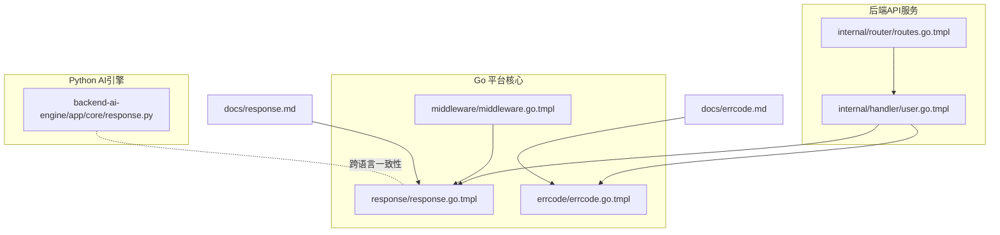
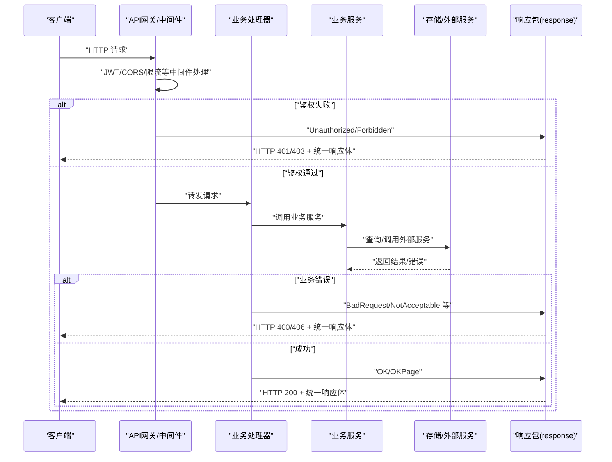
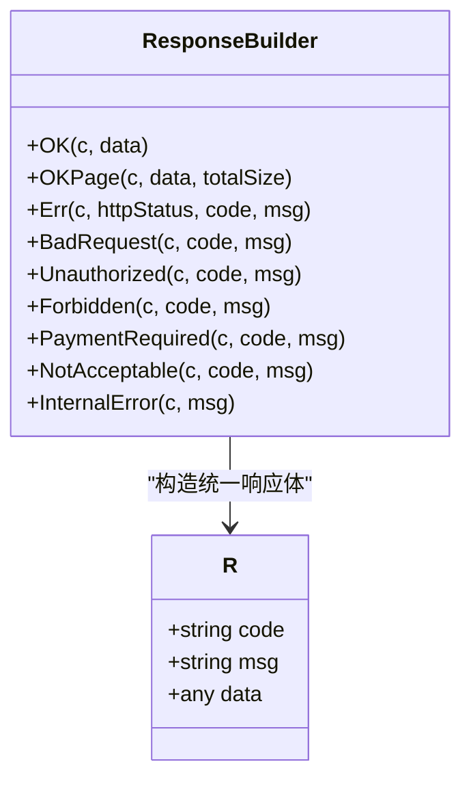
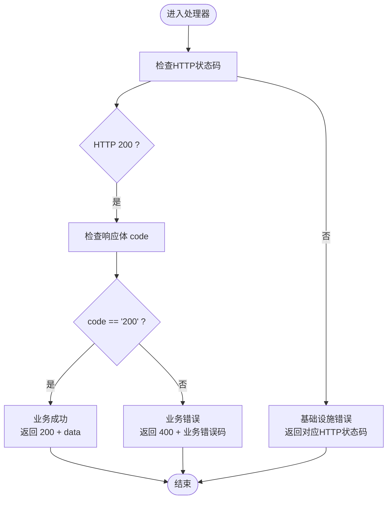
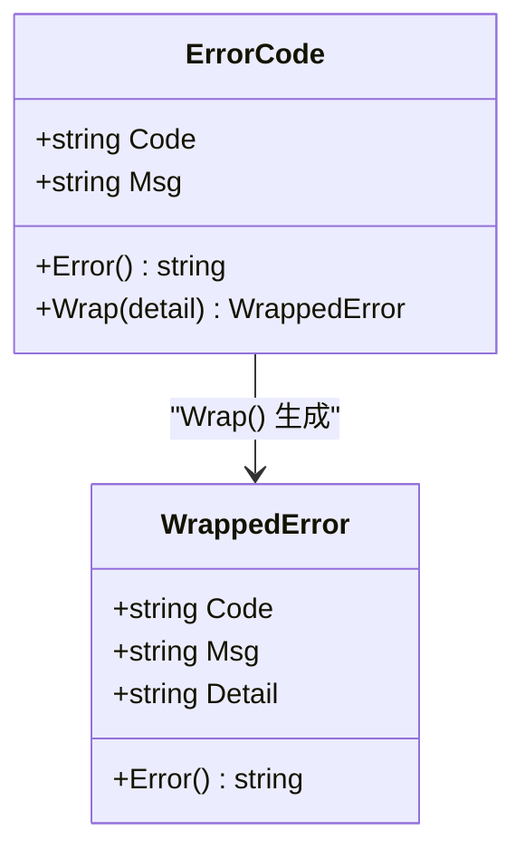
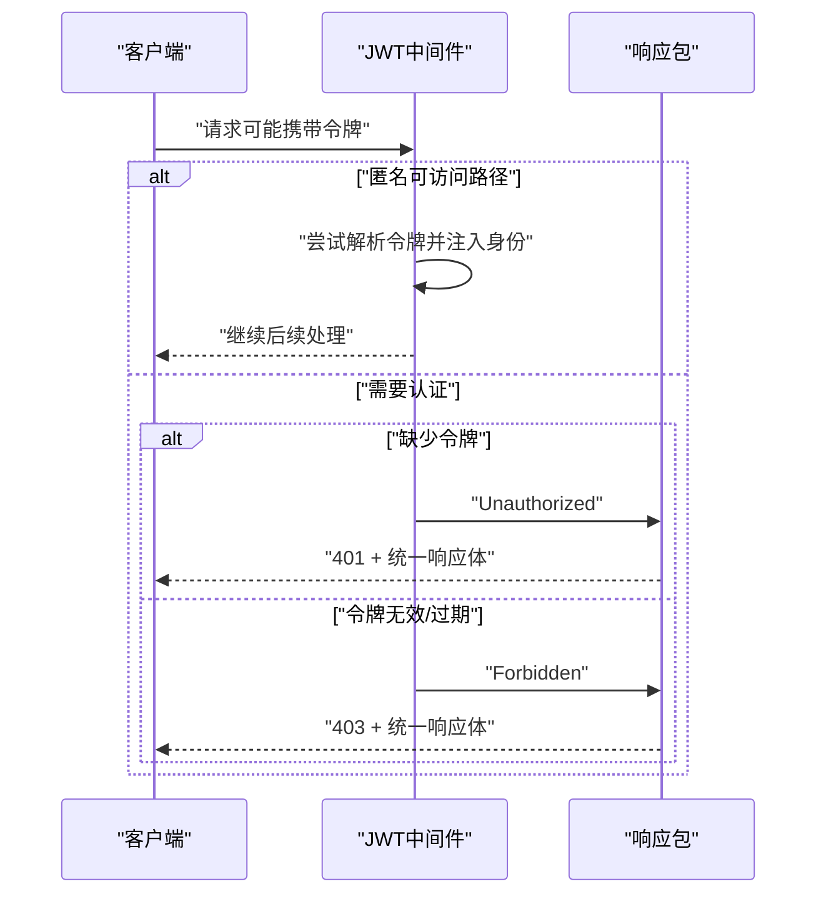
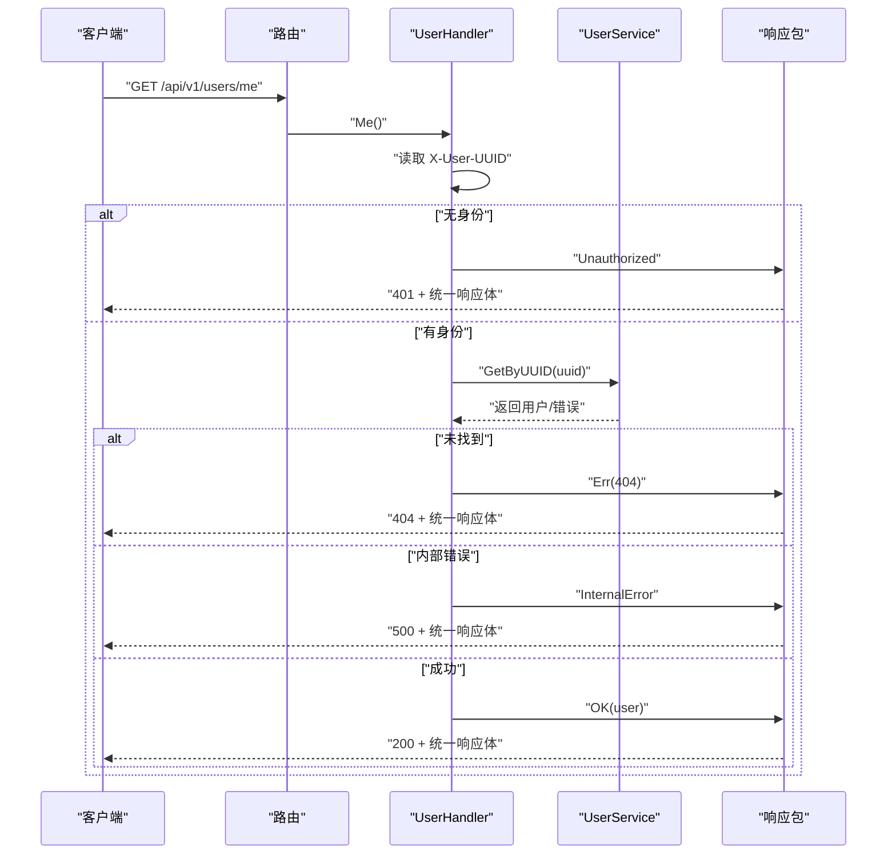
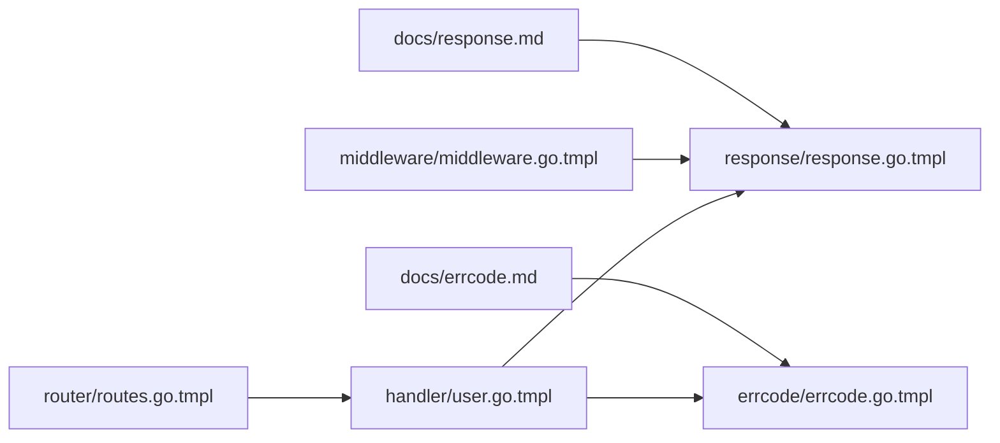

# 响应处理器

<cite>
**本文引用的文件**
- [response.go.tmpl](file://templates/files/pkg-platform-core/response/response.go.tmpl)
- [errcode.go.tmpl](file://templates/files/pkg-platform-core/errcode/errcode.go.tmpl)
- [response.md](file://templates/files/pkg-platform-core/docs/response.md)
- [errcode.md](file://templates/files/pkg-platform-core/docs/errcode.md)
- [middleware.go.tmpl](file://templates/files/pkg-platform-core/middleware/middleware.go.tmpl)
- [user.go.tmpl](file://templates/files/backend-api/internal/handler/user.go.tmpl)
- [routes.go.tmpl](file://templates/files/backend-api/internal/router/routes.go.tmpl)
- [errcode_test.go.tmpl](file://templates/files/pkg-platform-core/errcode/errcode_test.go.tmpl)
- [response.py](file://templates/files/backend-ai-engine/app/core/response.py)
</cite>

## 目录
1. [简介](#简介)
2. [项目结构](#项目结构)
3. [核心组件](#核心组件)
4. [架构总览](#架构总览)
5. [详细组件分析](#详细组件分析)
6. [依赖关系分析](#依赖关系分析)
7. [性能考虑](#性能考虑)
8. [故障排查指南](#故障排查指南)
9. [结论](#结论)
10. [附录](#附录)

## 简介
本文件系统性阐述平台响应处理器的设计与实现，覆盖统一响应格式、状态码管理、错误处理机制、响应构建器、数据序列化与HTTP状态码映射，并提供API参考、使用示例、错误码规范、响应优化、兼容性与测试策略。目标是帮助开发者在不同语言（Go、Python）与不同组件（API网关、业务服务、中间件）之间保持一致的响应契约，提升前后端协作效率与系统可观测性。

## 项目结构
响应处理相关代码主要分布在以下位置：
- Go 平台核心库：pkg-platform-core/response、pkg-platform-core/errcode、pkg-platform-core/middleware
- 后端API服务示例：backend-api/internal/handler、backend-api/internal/router
- Python AI引擎示例：backend-ai-engine/app/core/response.py
- 文档：pkg-platform-core/docs/response.md、pkg-platform-core/docs/errcode.md

图表来源
- [response.go.tmpl:1-78](file://templates/files/pkg-platform-core/response/response.go.tmpl#L1-L78)
- [errcode.go.tmpl:1-84](file://templates/files/pkg-platform-core/errcode/errcode.go.tmpl#L1-L84)
- [middleware.go.tmpl:1-202](file://templates/files/pkg-platform-core/middleware/middleware.go.tmpl#L1-L202)
- [user.go.tmpl:1-47](file://templates/files/backend-api/internal/handler/user.go.tmpl#L1-L47)
- [routes.go.tmpl:1-29](file://templates/files/backend-api/internal/router/routes.go.tmpl#L1-L29)
- [response.md:1-74](file://templates/files/pkg-platform-core/docs/response.md#L1-L74)
- [errcode.md:1-67](file://templates/files/pkg-platform-core/docs/errcode.md#L1-L67)
- [response.py:1-18](file://templates/files/backend-ai-engine/app/core/response.py#L1-L18)

章节来源
- [response.go.tmpl:1-78](file://templates/files/pkg-platform-core/response/response.go.tmpl#L1-L78)
- [errcode.go.tmpl:1-84](file://templates/files/pkg-platform-core/errcode/errcode.go.tmpl#L1-L84)
- [middleware.go.tmpl:1-202](file://templates/files/pkg-platform-core/middleware/middleware.go.tmpl#L1-L202)
- [user.go.tmpl:1-47](file://templates/files/backend-api/internal/handler/user.go.tmpl#L1-L47)
- [routes.go.tmpl:1-29](file://templates/files/backend-api/internal/router/routes.go.tmpl#L1-L29)
- [response.md:1-74](file://templates/files/pkg-platform-core/docs/response.md#L1-L74)
- [errcode.md:1-67](file://templates/files/pkg-platform-core/docs/errcode.md#L1-L67)
- [response.py:1-18](file://templates/files/backend-ai-engine/app/core/response.py#L1-L18)

## 核心组件
- 统一响应模型 R：包含 code、msg、data 三个字段，与Java端 Response<T>对齐。
- 响应构建器函数族：OK、OKPage、Err、BadRequest、Unauthorized、Forbidden、PaymentRequired、NotAcceptable、InternalError。
- 业务错误码注册表 errcode：六位字符串错误码，按业务域分段，与HTTP状态码解耦。
- 中间件集成：JWT、CORS、InternalAuth等在鉴权/跨域/内部校验失败时使用响应包输出统一格式。
- 前后端契约：前端按 code 决策展示逻辑，msg 作为开发期回退文案。

章节来源
- [response.go.tmpl:26-77](file://templates/files/pkg-platform-core/response/response.go.tmpl#L26-L77)
- [errcode.go.tmpl:11-83](file://templates/files/pkg-platform-core/errcode/errcode.go.tmpl#L11-L83)
- [middleware.go.tmpl:124-163](file://templates/files/pkg-platform-core/middleware/middleware.go.tmpl#L124-L163)
- [response.md:1-74](file://templates/files/pkg-platform-core/docs/response.md#L1-L74)
- [errcode.md:1-67](file://templates/files/pkg-platform-core/docs/errcode.md#L1-L67)

## 架构总览
响应处理贯穿“中间件—处理器—服务—存储/外部服务”的调用链，统一通过响应包输出标准化结果。HTTP状态码用于基础设施层（网关/限流/中间件），业务错误码用于业务层（handler/service）。

图表来源
- [middleware.go.tmpl:124-163](file://templates/files/pkg-platform-core/middleware/middleware.go.tmpl#L124-L163)
- [user.go.tmpl:30-46](file://templates/files/backend-api/internal/handler/user.go.tmpl#L30-L46)
- [response.go.tmpl:33-77](file://templates/files/pkg-platform-core/response/response.go.tmpl#L33-L77)

## 详细组件分析

### 统一响应模型与构建器
- 数据结构：R 结构体包含 code、msg、data，JSON标签与Java端对齐。
- 构建器函数：
  - OK：固定HTTP 200，code为"200"，data为任意对象。
  - OKPage：固定HTTP 200，data为包含"data"和"totalSize"的对象。
  - Err：自定义HTTP状态码与业务错误码。
  - BadRequest/Unauthorized/Forbidden/PaymentRequired/NotAcceptable/InternalError：针对常见场景的便捷封装。

图表来源
- [response.go.tmpl:26-77](file://templates/files/pkg-platform-core/response/response.go.tmpl#L26-L77)

章节来源
- [response.go.tmpl:26-77](file://templates/files/pkg-platform-core/response/response.go.tmpl#L26-L77)
- [response.md:17-44](file://templates/files/pkg-platform-core/docs/response.md#L17-L44)

### HTTP状态码与业务错误码映射
- HTTP状态码用于基础设施层：401未登录、403过期/禁止、429限流、500异常等。
- 业务错误码用于业务层：以"200"表示成功，其他六位字符串错误码表示业务错误。
- 规则：HTTP 200 + code非"200" = 业务错误；HTTP 4xx/5xx = 基础设施错误。

图表来源
- [response.go.tmpl:9-17](file://templates/files/pkg-platform-core/response/response.go.tmpl#L9-L17)
- [response.md:46-54](file://templates/files/pkg-platform-core/docs/response.md#L46-L54)

章节来源
- [response.go.tmpl:9-17](file://templates/files/pkg-platform-core/response/response.go.tmpl#L9-L17)
- [response.md:46-54](file://templates/files/pkg-platform-core/docs/response.md#L46-L54)

### 业务错误码注册表
- 错误码为六位字符串，按业务域分段（系统层/鉴权/文件/支付/AI/业务预留）。
- 提供ErrorCode与WrappedError两类类型，支持携带运行时上下文但不污染对外响应。
- 建议在各业务包内集中声明全局变量，避免硬编码。

图表来源
- [errcode.go.tmpl:11-45](file://templates/files/pkg-platform-core/errcode/errcode.go.tmpl#L11-L45)

章节来源
- [errcode.go.tmpl:1-84](file://templates/files/pkg-platform-core/errcode/errcode.go.tmpl#L1-L84)
- [errcode.md:1-67](file://templates/files/pkg-platform-core/docs/errcode.md#L1-L67)

### 中间件中的错误处理
- JWT中间件在鉴权失败时调用响应包输出统一格式（401/403）。
- CORS中间件在OPTIONS预检时返回无内容状态。
- InternalAuth中间件在内部接口校验失败时返回统一格式。

图表来源
- [middleware.go.tmpl:124-163](file://templates/files/pkg-platform-core/middleware/middleware.go.tmpl#L124-L163)
- [response.go.tmpl:51-62](file://templates/files/pkg-platform-core/response/response.go.tmpl#L51-L62)

章节来源
- [middleware.go.tmpl:124-163](file://templates/files/pkg-platform-core/middleware/middleware.go.tmpl#L124-L163)

### 处理器中的使用示例
- 用户信息查询处理器根据身份头调用服务，按错误类型选择响应构建器输出统一格式。
- 路由注册将处理器绑定到REST路径。

图表来源
- [user.go.tmpl:28-46](file://templates/files/backend-api/internal/handler/user.go.tmpl#L28-L46)
- [routes.go.tmpl:16-28](file://templates/files/backend-api/internal/router/routes.go.tmpl#L16-L28)
- [response.go.tmpl:33-77](file://templates/files/pkg-platform-core/response/response.go.tmpl#L33-L77)

章节来源
- [user.go.tmpl:28-46](file://templates/files/backend-api/internal/handler/user.go.tmpl#L28-L46)
- [routes.go.tmpl:16-28](file://templates/files/backend-api/internal/router/routes.go.tmpl#L16-L28)

### 跨语言一致性（Go 与 Python）
- Python侧同样提供统一响应模型与构建函数，确保前后端契约一致。
- 通过文档与示例保证不同语言实现遵循相同字段与语义。

章节来源
- [response.py:1-18](file://templates/files/backend-ai-engine/app/core/response.py#L1-L18)
- [response.md:1-16](file://templates/files/pkg-platform-core/docs/response.md#L1-L16)

## 依赖关系分析
- 处理器依赖响应包与业务服务，不直接处理HTTP细节。
- 中间件依赖响应包在鉴权失败时输出统一格式。
- 错误码注册表被业务层广泛使用，形成稳定的错误码契约。

图表来源
- [user.go.tmpl:6-11](file://templates/files/backend-api/internal/handler/user.go.tmpl#L6-L11)
- [middleware.go.tmpl:21-22](file://templates/files/pkg-platform-core/middleware/middleware.go.tmpl#L21-L22)
- [response.go.tmpl:20-24](file://templates/files/pkg-platform-core/response/response.go.tmpl#L20-L24)
- [errcode.go.tmpl:9-9](file://templates/files/pkg-platform-core/errcode/errcode.go.tmpl#L9-L9)

章节来源
- [user.go.tmpl:6-11](file://templates/files/backend-api/internal/handler/user.go.tmpl#L6-L11)
- [middleware.go.tmpl:21-22](file://templates/files/pkg-platform-core/middleware/middleware.go.tmpl#L21-L22)
- [response.go.tmpl:20-24](file://templates/files/pkg-platform-core/response/response.go.tmpl#L20-L24)
- [errcode.go.tmpl:9-9](file://templates/files/pkg-platform-core/errcode/errcode.go.tmpl#L9-L9)

## 性能考虑
- 响应序列化：统一使用Gin的JSON序列化，减少额外转换开销。
- HTTP状态码分离：将基础设施错误与业务错误分离，有利于网关/反向代理的快速短路与缓存策略。
- 流式响应：在网关代理中对SSE/二进制流进行特殊处理，避免阻塞与缓冲问题。
- 中间件短路：JWT/CORS等中间件尽早失败，减少后续处理成本。

章节来源
- [response.go.tmpl:33-49](file://templates/files/pkg-platform-core/response/response.go.tmpl#L33-L49)
- [middleware.go.tmpl:70-100](file://templates/files/pkg-platform-core/middleware/middleware.go.tmpl#L70-L100)
- [proxy.go.tmpl:52-96](file://templates/files/backend-gateway/internal/proxy/proxy.go.tmpl#L52-L96)

## 故障排查指南
- 常见问题
  - 响应体字段缺失：确认使用响应包的OK/Err等函数，避免直接手写JSON。
  - 错误码未注册：前端无法翻译，应通过errcode.New注册后再使用。
  - 鉴权失败：检查JWT中间件配置与请求头，确认401/403分支是否正确。
- 日志与追踪
  - 使用RequestID中间件贯穿全链路，便于定位问题。
  - WrappedError的Detail仅用于服务端日志，不暴露给前端。
- 单元测试
  - 错误码单元测试验证Error与Wrap行为。
  - 建议为处理器添加HTTP响应断言测试，确保状态码与响应体符合预期。

章节来源
- [errcode_test.go.tmpl:1-20](file://templates/files/pkg-platform-core/errcode/errcode_test.go.tmpl#L1-L20)
- [middleware.go.tmpl:24-39](file://templates/files/pkg-platform-core/middleware/middleware.go.tmpl#L24-L39)
- [errcode.md:62-67](file://templates/files/pkg-platform-core/docs/errcode.md#L62-L67)

## 结论
响应处理器通过统一的响应模型、明确的HTTP状态码与业务错误码映射、完善的错误码注册表与中间件集成，实现了跨语言、跨组件的一致性契约。结合清晰的API参考、使用示例与测试策略，能够显著提升开发效率与系统稳定性。

## 附录

### API参考（Go）
- 统一响应模型
  - R：包含code、msg、data字段。
- 响应构建器
  - OK(c, data)：HTTP 200 + 成功载荷。
  - OKPage(c, data, totalSize)：HTTP 200 + 分页载荷。
  - Err(c, httpStatus, code, msg)：自定义HTTP状态码与业务错误码。
  - BadRequest/Unauthorized/Forbidden/PaymentRequired/NotAcceptable/InternalError：常用场景封装。
- HTTP状态码与业务错误码对照
  - 200：成功（code="200"）。
  - 400：业务错误（code为六位业务错误码）。
  - 401：未登录。
  - 402：需要付费。
  - 403：禁止/令牌过期。
  - 406：需要订阅。
  - 500：服务端错误。

章节来源
- [response.go.tmpl:26-77](file://templates/files/pkg-platform-core/response/response.go.tmpl#L26-L77)
- [response.md:17-44](file://templates/files/pkg-platform-core/docs/response.md#L17-L44)

### 错误码规范（Go）
- 错误码格式：六位字符串，如"000001"。
- 业务域分段
  - 系统层：000xxx
  - 鉴权与注册：100xxx
  - 文件与资源：103xxx
  - 支付与积分：104xxx
  - AI与外部服务：105xxx
  - 业务预留：11xxxx~99xxxx
- 使用建议
  - 在业务包内集中声明全局变量。
  - 不要复用已有code，避免破坏前端国际化契约。
  - WrappedError.Detail仅用于服务端日志。

章节来源
- [errcode.go.tmpl:51-83](file://templates/files/pkg-platform-core/errcode/errcode.go.tmpl#L51-L83)
- [errcode.md:7-17](file://templates/files/pkg-platform-core/docs/errcode.md#L7-L17)

### 使用示例（Go）
- 处理器层
  - 鉴权失败：Unauthorized/Forbidden。
  - 业务错误：BadRequest/NotAcceptable。
  - 成功：OK/OKPage。
- 中间件层
  - JWT：在鉴权失败时输出统一格式。
  - CORS：OPTIONS预检快速返回。
  - InternalAuth：内部接口校验失败输出统一格式。

章节来源
- [user.go.tmpl:30-46](file://templates/files/backend-api/internal/handler/user.go.tmpl#L30-L46)
- [middleware.go.tmpl:124-163](file://templates/files/pkg-platform-core/middleware/middleware.go.tmpl#L124-L163)

### 跨语言一致性（Python）
- 响应模型与构建函数与Go端对齐，确保前后端契约一致。
- 通过文档与示例指导Python侧实现。

章节来源
- [response.py:1-18](file://templates/files/backend-ai-engine/app/core/response.py#L1-L18)
- [response.md:1-16](file://templates/files/pkg-platform-core/docs/response.md#L1-L16)