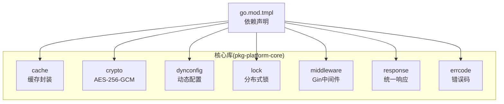
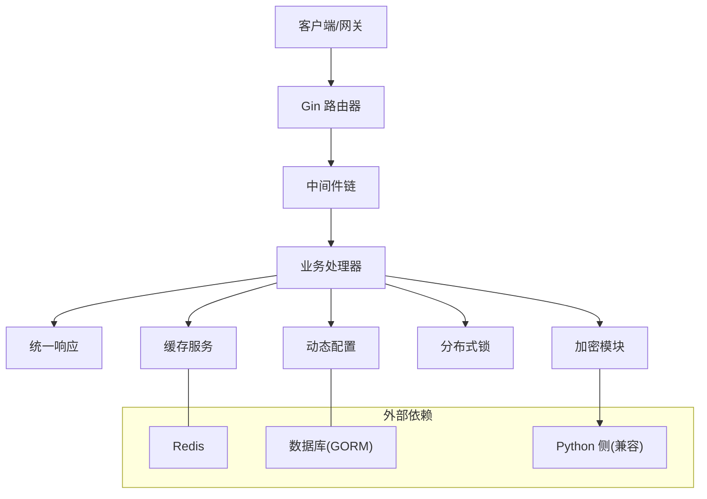
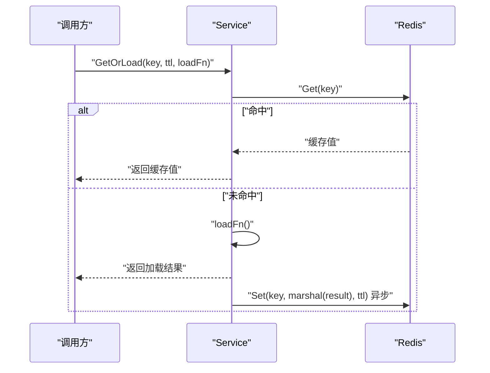
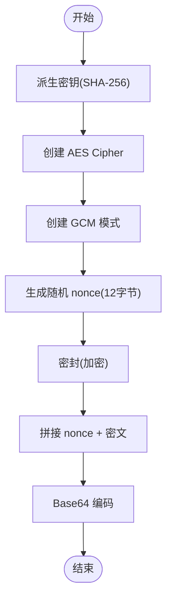
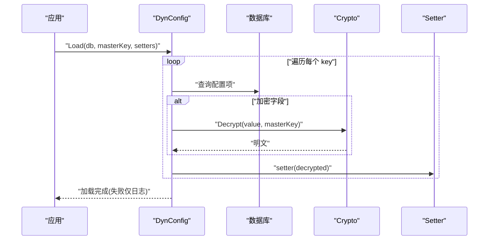
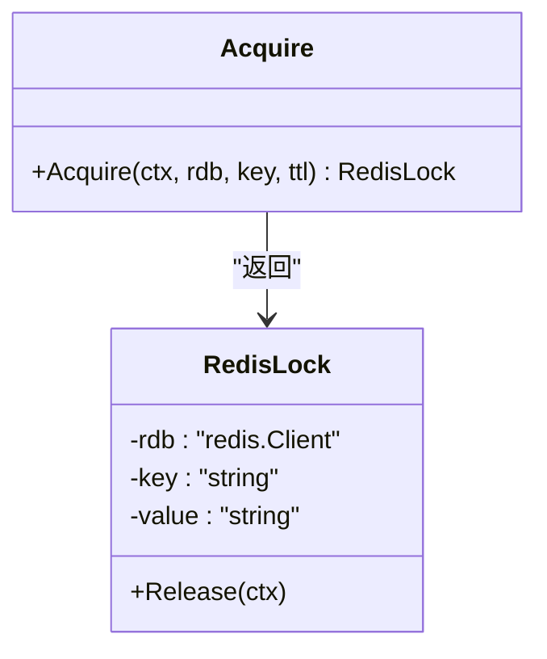
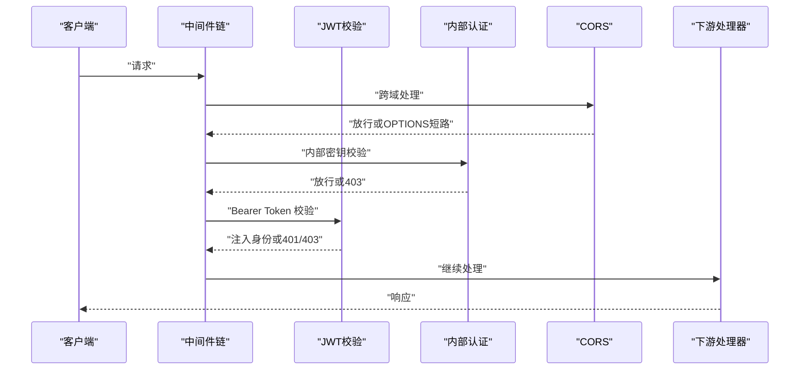
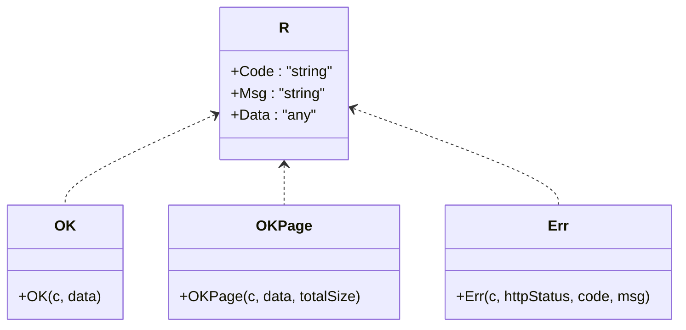
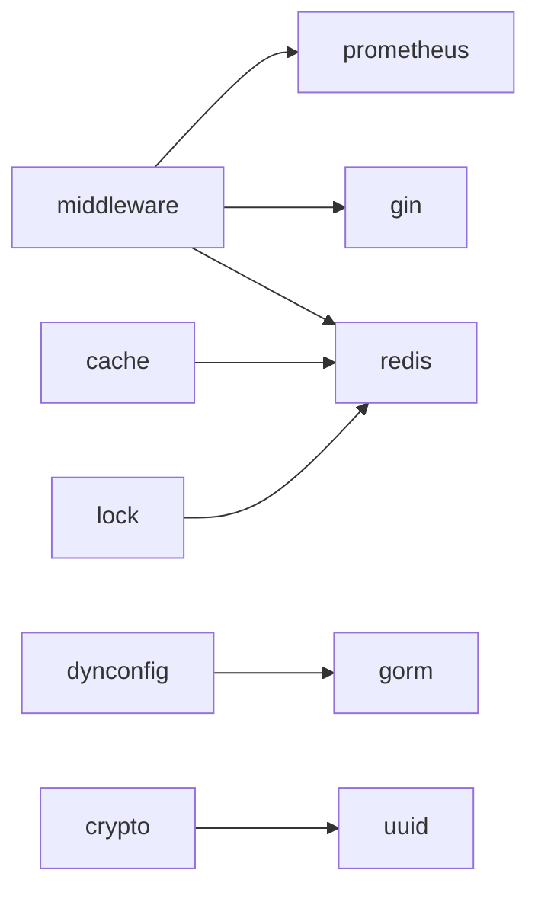

# 核心库文档

<cite>
**本文档引用的文件**
- [go.mod.tmpl](file://templates/files/pkg-platform-core/go.mod.tmpl)
- [cache.go.tmpl](file://templates/files/pkg-platform-core/cache/cache.go.tmpl)
- [aes_gcm.go.tmpl](file://templates/files/pkg-platform-core/crypto/aes_gcm.go.tmpl)
- [middleware.go.tmpl](file://templates/files/pkg-platform-core/middleware/middleware.go.tmpl)
- [response.go.tmpl](file://templates/files/pkg-platform-core/response/response.go.tmpl)
- [errcode.go.tmpl](file://templates/files/pkg-platform-core/errcode/errcode.go.tmpl)
- [loader.go.tmpl](file://templates/files/pkg-platform-core/dynconfig/loader.go.tmpl)
- [redis_lock.go.tmpl](file://templates/files/pkg-platform-core/lock/redis_lock.go.tmpl)
</cite>

## 目录
1. [简介](#简介)
2. [项目结构](#项目结构)
3. [核心组件](#核心组件)
4. [架构总览](#架构总览)
5. [详细组件分析](#详细组件分析)
6. [依赖分析](#依赖分析)
7. [性能考虑](#性能考虑)
8. [故障排查指南](#故障排查指南)
9. [结论](#结论)
10. [附录](#附录)

## 简介
本核心库是平台脚手架中的通用基础设施，提供以下关键能力：
- 缓存系统：基于 Redis 的 Cache-Aside 模式，支持泛型加载、异步回填、通配符失效等。
- 加密模块：AES-256-GCM 对称加密，与 Python 端完全兼容的密文格式。
- 动态配置：应用启动时从数据库表加载并解密配置，支持优雅降级。
- 分布式锁：基于 Redis 的 SETNX + Lua 原子释放的分布式互斥锁。
- 中间件：统一的 Gin 中间件集合，包含 JWT 校验、内部认证、CORS、限流、指标等。
- 响应处理：统一的 JSON 响应格式，与后端 Java 侧保持一致的三段式结构。

这些组件以模板形式提供，便于在不同服务（API、Gateway、AI Engine）中复用。

## 项目结构
核心库位于 templates/files/pkg-platform-core 下，采用按功能域分组的目录组织方式：
- cache：缓存封装
- crypto：对称加密
- dynconfig：动态配置加载
- lock：分布式锁
- middleware：Gin 中间件
- response：统一响应格式
- errcode：业务错误码注册表
- go.mod.tmpl：模块依赖定义

**图表来源**
- [go.mod.tmpl:1-12](file://templates/files/pkg-platform-core/go.mod.tmpl#L1-L12)

**章节来源**
- [go.mod.tmpl:1-12](file://templates/files/pkg-platform-core/go.mod.tmpl#L1-L12)

## 核心组件
本节概览各组件职责与典型使用场景：
- 缓存系统：适用于高并发读取、热点数据加速、缓存穿透防护。
- 加密模块：适用于敏感配置、令牌、日志脱敏等场景。
- 动态配置：适用于生产密钥、第三方 API Key 的安全加载。
- 分布式锁：适用于计数、扣减、幂等控制等需要互斥的场景。
- 中间件：适用于网关与 API 服务的统一鉴权、跨域、限流、指标采集。
- 响应处理：适用于统一错误码、分页响应、HTTP 状态码语义分离。

**章节来源**
- [cache.go.tmpl:1-93](file://templates/files/pkg-platform-core/cache/cache.go.tmpl#L1-L93)
- [aes_gcm.go.tmpl:1-72](file://templates/files/pkg-platform-core/crypto/aes_gcm.go.tmpl#L1-L72)
- [loader.go.tmpl:1-136](file://templates/files/pkg-platform-core/dynconfig/loader.go.tmpl#L1-L136)
- [redis_lock.go.tmpl:1-49](file://templates/files/pkg-platform-core/lock/redis_lock.go.tmpl#L1-L49)
- [middleware.go.tmpl:1-202](file://templates/files/pkg-platform-core/middleware/middleware.go.tmpl#L1-L202)
- [response.go.tmpl:1-78](file://templates/files/pkg-platform-core/response/response.go.tmpl#L1-L78)

## 架构总览
下图展示了核心库在服务中的典型交互关系：

**图表来源**
- [middleware.go.tmpl:12-22](file://templates/files/pkg-platform-core/middleware/middleware.go.tmpl#L12-L22)
- [cache.go.tmpl:9-16](file://templates/files/pkg-platform-core/cache/cache.go.tmpl#L9-L16)
- [loader.go.tmpl:21-27](file://templates/files/pkg-platform-core/dynconfig/loader.go.tmpl#L21-L27)
- [aes_gcm.go.tmpl:9-16](file://templates/files/pkg-platform-core/crypto/aes_gcm.go.tmpl#L9-L16)

## 详细组件分析

### 缓存系统(cache)
- 设计理念
  - Cache-Aside 模式：先查缓存，未命中再加载并异步回填，保证主流程非阻塞。
  - 泛型 GetOrLoad：支持任意类型数据，自动序列化/反序列化。
  - 通配符失效：使用 SCAN 避免 KEYS 阻塞，支持批量清理。
- 关键接口
  - NewService：创建缓存服务实例。
  - GetOrLoad：缓存穿透防护与异步回填。
  - Set/Get/Invalidate/InvalidatePattern：直接读写与删除。
- 使用建议
  - key 命名建议采用 cache:<entity>:<id> 规范，便于管理与失效。
  - TTL 设置需结合数据变更频率与一致性要求权衡。
  - 反序列化失败视为缓存未命中，确保数据一致性。

**图表来源**
- [cache.go.tmpl:28-58](file://templates/files/pkg-platform-core/cache/cache.go.tmpl#L28-L58)

**章节来源**
- [cache.go.tmpl:1-93](file://templates/files/pkg-platform-core/cache/cache.go.tmpl#L1-L93)

### 加密模块(crypto)
- 设计理念
  - AES-256-GCM 对称加密，密文格式与 Python 端完全对齐，确保跨语言互通。
  - 密钥派生：使用 SHA-256 将任意长度 masterKey 派生为 32 字节密钥。
  - 密文结构：base64(nonce_12 + ciphertext + tag_16)。
- 关键接口
  - Encrypt：加密明文，返回 Base64 密文。
  - Decrypt：解密 Base64 密文，返回明文。
- 使用建议
  - masterKey 应妥善保管，建议通过动态配置安全加载。
  - 解密失败时会返回明确错误，调用方可据此进行重试或告警。

**图表来源**
- [aes_gcm.go.tmpl:24-44](file://templates/files/pkg-platform-core/crypto/aes_gcm.go.tmpl#L24-L44)

**章节来源**
- [aes_gcm.go.tmpl:1-72](file://templates/files/pkg-platform-core/crypto/aes_gcm.go.tmpl#L1-L72)

### 动态配置(dynconfig)
- 设计理念
  - 启动时一次性加载，非热更新，避免运行时抖动。
  - 加密字段使用 AES-256-GCM 解密，缺失或解密失败仅记录日志，不影响启动。
  - 通过 setter 回调将值写入业务配置对象。
- 关键接口
  - Load/LoadWithOptions：加载配置并调用对应 setter。
  - Options：可定制表名、列名、日志前缀等。
- 使用建议
  - 在应用启动早期调用，确保配置可用后再初始化其他组件。
  - 对于敏感字段，建议在数据库中标记为加密存储并在运行时解密。

**图表来源**
- [loader.go.tmpl:64-116](file://templates/files/pkg-platform-core/dynconfig/loader.go.tmpl#L64-L116)
- [aes_gcm.go.tmpl:46-71](file://templates/files/pkg-platform-core/crypto/aes_gcm.go.tmpl#L46-L71)

**章节来源**
- [loader.go.tmpl:1-136](file://templates/files/pkg-platform-core/dynconfig/loader.go.tmpl#L1-L136)

### 分布式锁(lock)
- 设计理念
  - 基于 Redis SETNX 获取锁，使用 Lua 原子脚本释放，防止误删他人持有的锁。
  - 自动过期防止死锁，value 使用 UUID 标识持有者。
- 关键接口
  - Acquire：尝试获取锁，成功返回锁实例，否则返回空。
  - Release：原子释放当前持有者的锁。
- 使用建议
  - 锁 key 建议包含业务标识，避免跨业务冲突。
  - 释放锁应在 defer 中执行，确保异常路径也能释放。

**图表来源**
- [redis_lock.go.tmpl:23-48](file://templates/files/pkg-platform-core/lock/redis_lock.go.tmpl#L23-L48)

**章节来源**
- [redis_lock.go.tmpl:1-49](file://templates/files/pkg-platform-core/lock/redis_lock.go.tmpl#L1-L49)

### 中间件(middleware)
- 能力概览
  - RequestID：生成或透传 X-Request-ID，贯穿全链路。
  - InternalAuth：校验 X-Internal-Secret，保护内部路由。
  - CORS：白名单 Origin + AllowCredentials，暴露必要响应头。
  - JWT：Bearer Token 校验，注入用户身份头，支持公开路径与过期处理。
  - RateLimit：固定窗口限流，多副本安全，fail-open。
  - PrometheusMetrics：采集 http_requests_total/duration/in_flight 指标。
- 关键类型
  - Claims：JWT 载荷结构。
  - JWTOptions：公开路径前缀与刷新令牌 Cookie 名称。
  - JWTValidator：业务自定义的 Token 校验接口。
- 使用建议
  - 在路由注册时按顺序组合中间件，注意 CORS 与 JWT 的先后关系。
  - JWT 的 PublicPathPrefixes 用于区分匿名可访问路径，但仍然尝试解析 Token 注入身份。

**图表来源**
- [middleware.go.tmpl:24-100](file://templates/files/pkg-platform-core/middleware/middleware.go.tmpl#L24-L100)
- [middleware.go.tmpl:102-163](file://templates/files/pkg-platform-core/middleware/middleware.go.tmpl#L102-L163)

**章节来源**
- [middleware.go.tmpl:1-202](file://templates/files/pkg-platform-core/middleware/middleware.go.tmpl#L1-L202)

### 响应处理(response)
- 设计理念
  - 统一 JSON 结构 {code, msg, data}，与 Java Response<T> 对齐。
  - HTTP 状态码语义分离：业务错误统一 400 + code，鉴权/权限/订阅分别映射到 401/403/406。
- 关键接口
  - OK/OKPage：成功响应与分页响应。
  - Err/BadRequest/Unauthorized/Forbidden/PaymentRequired/NotAcceptable/InternalError：各类错误响应。
- 使用建议
  - 失败时优先使用 ErrorCode 注册表中的标准错误码，保证前后端一致性。
  - 分页场景使用 OKPage，携带 totalSize 以便前端渲染。

**图表来源**
- [response.go.tmpl:26-77](file://templates/files/pkg-platform-core/response/response.go.tmpl#L26-L77)

**章节来源**
- [response.go.tmpl:1-78](file://templates/files/pkg-platform-core/response/response.go.tmpl#L1-L78)

### 错误码(errcode)
- 设计理念
  - 六位业务错误码，按业务域分段，与 Java 侧错误消息体系对齐。
  - 与 HTTP 状态码解耦，业务错误统一返回 400 + code。
  - 支持 Wrap 携带运行时上下文，但最终展示以注册表为准。
- 关键类型
  - ErrorCode/WrappedError：错误码与包装错误。
  - New/Wrap：创建与包装。
- 使用建议
  - 在各业务包内集中声明全局错误码常量，便于维护与查找。
  - 使用 Wrap 记录调试信息，但不要泄漏敏感内容。

**章节来源**
- [errcode.go.tmpl:1-84](file://templates/files/pkg-platform-core/errcode/errcode.go.tmpl#L1-L84)

## 依赖分析
核心库对外部依赖的使用集中在以下模块：
- Gin：中间件与路由基础。
- Redis：缓存、分布式锁、限流。
- Prometheus：指标采集。
- GORM：动态配置加载。
- UUID：RequestID 与锁 value 标识。

**图表来源**
- [go.mod.tmpl:5-11](file://templates/files/pkg-platform-core/go.mod.tmpl#L5-L11)
- [middleware.go.tmpl:19-22](file://templates/files/pkg-platform-core/middleware/middleware.go.tmpl#L19-L22)

**章节来源**
- [go.mod.tmpl:1-12](file://templates/files/pkg-platform-core/go.mod.tmpl#L1-L12)

## 性能考虑
- 缓存
  - 使用异步回填减少主流程等待，提升吞吐。
  - 合理设置 TTL，避免缓存雪崩与陈旧数据。
  - 使用 InvalidatePattern 时注意扫描性能，避免大范围通配符。
- 加密
  - Encrypt/Decrypt 为 CPU 密集操作，建议在高频路径外使用或配合缓存。
  - masterKey 派生为常量，避免重复计算。
- 动态配置
  - 启动时一次性加载，避免运行时频繁查询数据库。
  - 对加密字段解密失败仅记录日志，不影响整体启动。
- 分布式锁
  - 使用 Lua 原子释放，避免网络抖动导致的误删。
  - TTL 需要足够长以覆盖业务执行时间，同时避免过长导致资源占用。
- 中间件
  - RequestID/CORS/JWT 等中间件尽量前置，减少下游处理成本。
  - RateLimit 采用 fail-open，避免限流成为性能瓶颈。
- 响应处理
  - 统一结构减少序列化差异带来的开销。
  - 分页场景避免一次性传输大量数据，使用 OKPage 并限制每页大小。

[本节为通用性能指导，无需特定文件引用]

## 故障排查指南
- 缓存
  - GetOrLoad 返回空值：检查 key 是否正确、TTL 是否过短、loadFn 是否抛错。
  - InvalidatePattern 未生效：确认 pattern 正确且 Redis 版本支持 SCAN。
- 加密
  - Decrypt 报密钥不匹配或密文损坏：核对 masterKey 与密文格式。
- 动态配置
  - Load 跳过某些配置：检查数据库记录是否存在、masterKey 是否设置、解密是否成功。
- 分布式锁
  - Acquire 返回空：表示已被他人持有，需重试或降级处理。
  - Release 失败：确认锁 value 与持有者一致，避免误删。
- 中间件
  - JWT 403：检查 Token 是否过期、PublicPathPrefixes 是否匹配。
  - CORS 无效：确认 Origin 是否在白名单、Expose-Headers 是否包含所需头。
- 响应处理
  - 业务错误仍返回 200：确认使用了 Err/BadRequest 等错误接口而非 OK。

**章节来源**
- [cache.go.tmpl:28-58](file://templates/files/pkg-platform-core/cache/cache.go.tmpl#L28-L58)
- [aes_gcm.go.tmpl:46-71](file://templates/files/pkg-platform-core/crypto/aes_gcm.go.tmpl#L46-L71)
- [loader.go.tmpl:78-116](file://templates/files/pkg-platform-core/dynconfig/loader.go.tmpl#L78-L116)
- [redis_lock.go.tmpl:30-48](file://templates/files/pkg-platform-core/lock/redis_lock.go.tmpl#L30-L48)
- [middleware.go.tmpl:124-163](file://templates/files/pkg-platform-core/middleware/middleware.go.tmpl#L124-L163)
- [response.go.tmpl:33-77](file://templates/files/pkg-platform-core/response/response.go.tmpl#L33-L77)

## 结论
核心库通过标准化的缓存、加密、动态配置、分布式锁、中间件与响应处理，为平台提供了高复用、高性能、易维护的基础能力。建议在新服务中优先采用这些组件，并遵循其设计原则与最佳实践，以降低集成成本并提升系统稳定性。

[本节为总结性内容，无需特定文件引用]

## 附录
- 集成步骤
  - 在服务启动早期调用 dynconfig.Load 加载配置。
  - 初始化 Redis/GORM 客户端并注入到相应组件。
  - 在 Gin 路由中按需组合中间件。
  - 使用 response 与 errcode 统一输出与错误处理。
- 扩展方法
  - 新增中间件：参考 middleware 模板，遵循 Gin HandlerFunc 模式。
  - 新增缓存策略：在 cache.Service 上扩展新方法，保持与现有接口一致。
  - 新增加密算法：在 crypto 包内新增函数，保持与现有接口兼容。
- 测试策略
  - 单元测试：针对关键函数（Encrypt/Decrypt、GetOrLoad、Acquire/Release）编写边界与异常场景测试。
  - 集成测试：模拟 Redis/GORM 环境，验证中间件链与响应格式。
  - 性能测试：压测缓存命中率、加密吞吐、锁竞争场景。

[本节为通用指导，无需特定文件引用]