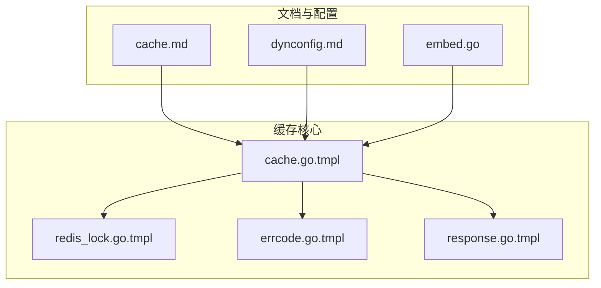
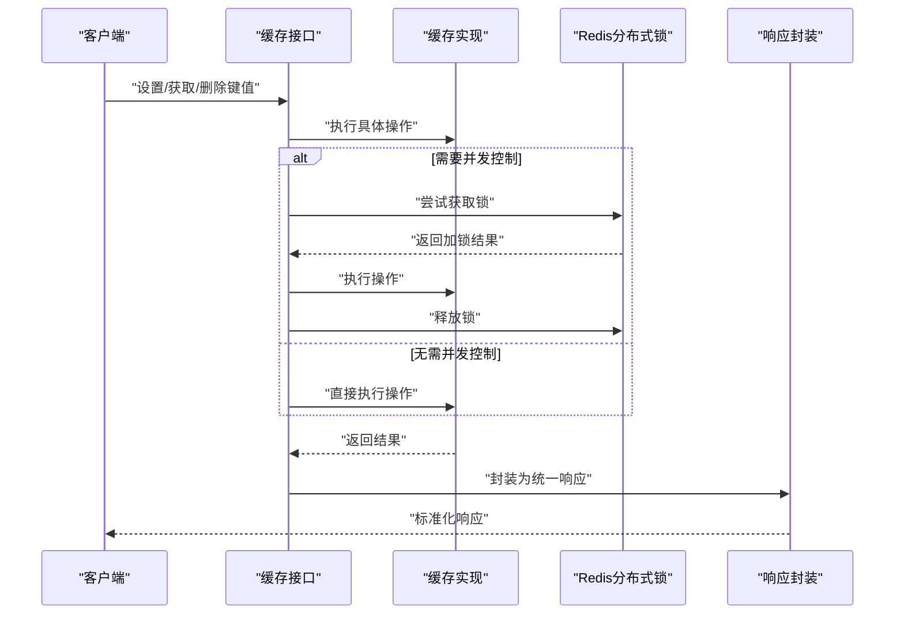
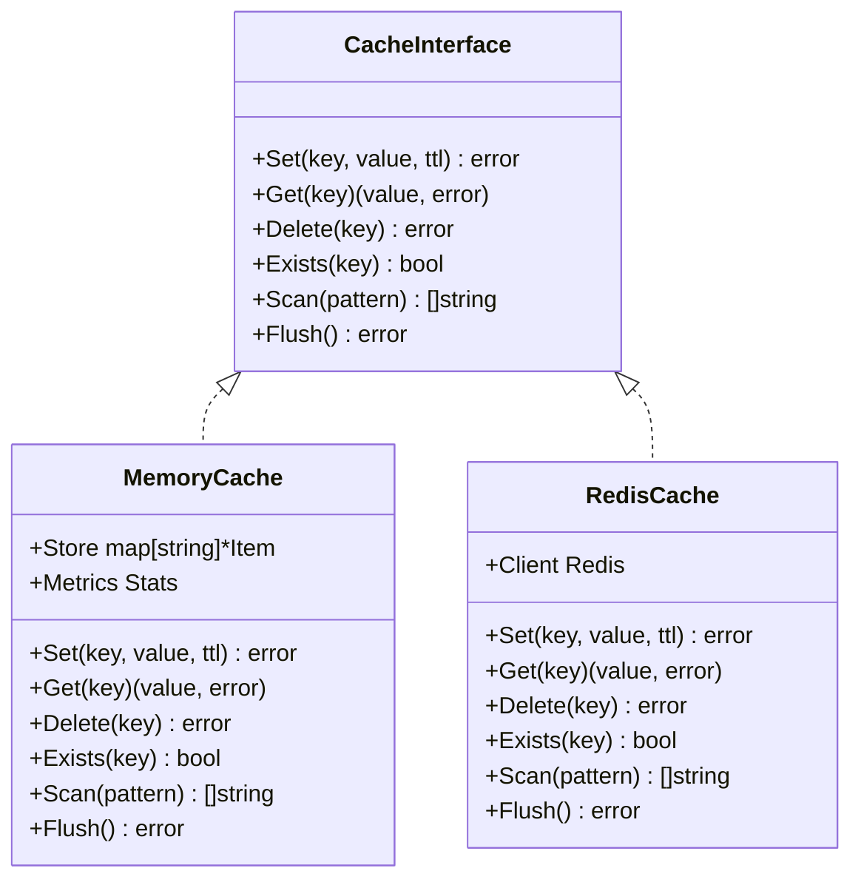
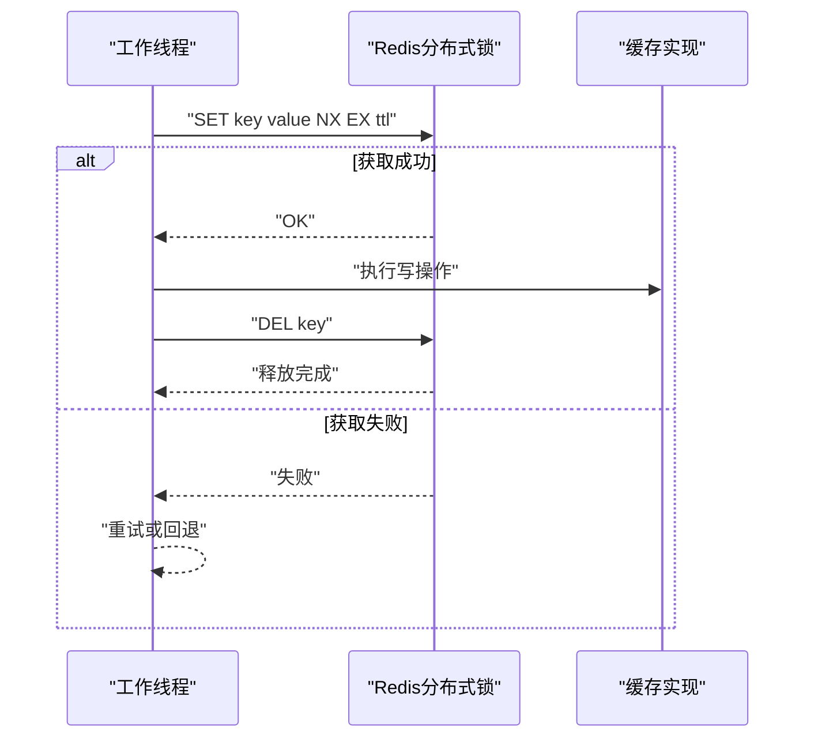
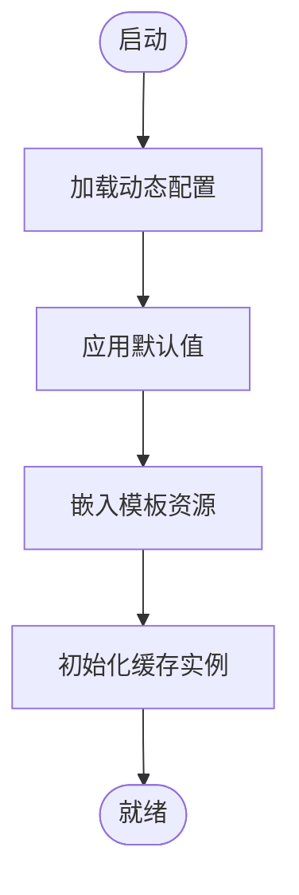
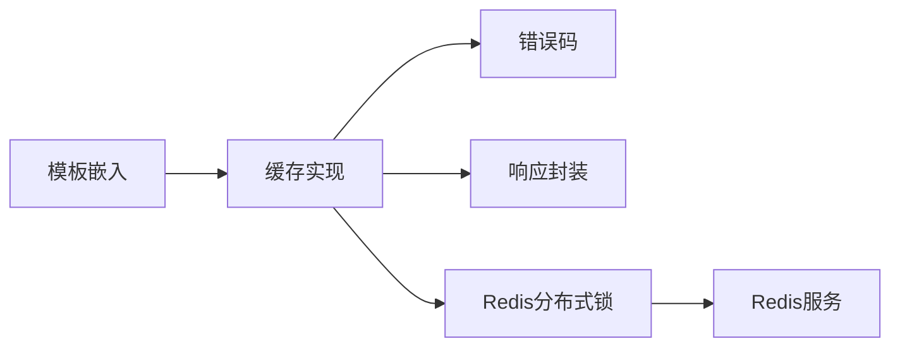

# 缓存系统

<cite>
**本文档引用的文件**
- [cache.go.tmpl](file://templates/pkg-platform-core/cache/cache.go.tmpl)
- [cache.md](file://templates/pkg-platform-core/docs/cache.md)
- [redis_lock.go.tmpl](file://templates/pkg-platform-core/lock/redis_lock.go.tmpl)
- [dynconfig.md](file://templates/pkg-platform-core/docs/dynconfig.md)
- [errcode.go.tmpl](file://templates/pkg-platform-core/errcode/errcode.go.tmpl)
- [response.go.tmpl](file://templates/pkg-platform-core/response/response.go.tmpl)
- [embed.go](file://templates/embed.go)
</cite>

## 目录
1. [简介](#简介)
2. [项目结构](#项目结构)
3. [核心组件](#核心组件)
4. [架构总览](#架构总览)
5. [详细组件分析](#详细组件分析)
6. [依赖关系分析](#依赖关系分析)
7. [性能考量](#性能考量)
8. [故障排查指南](#故障排查指南)
9. [结论](#结论)
10. [附录](#附录)

## 简介
本缓存系统是平台脚手架中“pkg-platform-core”模块的一部分，采用模板化生成方式提供可扩展的缓存能力。该系统支持键值存储、过期策略、并发控制与错误码统一处理，并通过动态配置与响应封装提升整体可用性与一致性。本文档将从架构设计、接口定义、配置参数、数据存储策略、性能优化、并发控制、内存管理到使用示例与最佳实践进行系统化阐述。

## 项目结构
缓存相关代码位于模板目录中，核心文件包括：
- 缓存实现：templates/pkg-platform-core/cache/cache.go.tmpl
- 缓存文档：templates/pkg-platform-core/docs/cache.md
- Redis分布式锁：templates/pkg-platform-core/lock/redis_lock.go.tmpl
- 动态配置文档：templates/pkg-platform-core/docs/dynconfig.md
- 错误码定义：templates/pkg-platform-core/errcode/errcode.go.tmpl
- 响应封装：templates/pkg-platform-core/response/response.go.tmpl
- 模板嵌入：templates/embed.go



图表来源
- [cache.go.tmpl](file://templates/pkg-platform-core/cache/cache.go.tmpl)
- [redis_lock.go.tmpl](file://templates/pkg-platform-core/lock/redis_lock.go.tmpl)
- [errcode.go.tmpl](file://templates/pkg-platform-core/errcode/errcode.go.tmpl)
- [response.go.tmpl](file://templates/pkg-platform-core/response/response.go.tmpl)
- [cache.md](file://templates/pkg-platform-core/docs/cache.md)
- [dynconfig.md](file://templates/pkg-platform-core/docs/dynconfig.md)
- [embed.go](file://templates/embed.go)

章节来源
- [cache.go.tmpl](file://templates/pkg-platform-core/cache/cache.go.tmpl)
- [cache.md](file://templates/pkg-platform-core/docs/cache.md)
- [redis_lock.go.tmpl](file://templates/pkg-platform-core/lock/redis_lock.go.tmpl)
- [dynconfig.md](file://templates/pkg-platform-core/docs/dynconfig.md)
- [errcode.go.tmpl](file://templates/pkg-platform-core/errcode/errcode.go.tmpl)
- [response.go.tmpl](file://templates/pkg-platform-core/response/response.go.tmpl)
- [embed.go](file://templates/embed.go)

## 核心组件
- 缓存接口与实现：提供键值存储、设置过期时间、批量操作、清理与统计等能力，支持多种数据类型与序列化策略。
- 分布式锁：基于Redis实现互斥锁，保障并发场景下的原子性与一致性。
- 错误码体系：统一错误分类与返回格式，便于上层调用方快速定位问题。
- 响应封装：标准化HTTP响应结构，包含状态码、消息与数据体，提升客户端体验。
- 动态配置：支持运行时配置加载与热更新，降低变更成本。
- 模板嵌入：通过go:embed机制将模板资源打包进二进制，简化部署与分发。

章节来源
- [cache.go.tmpl](file://templates/pkg-platform-core/cache/cache.go.tmpl)
- [redis_lock.go.tmpl](file://templates/pkg-platform-core/lock/redis_lock.go.tmpl)
- [errcode.go.tmpl](file://templates/pkg-platform-core/errcode/errcode.go.tmpl)
- [response.go.tmpl](file://templates/pkg-platform-core/response/response.go.tmpl)
- [dynconfig.md](file://templates/pkg-platform-core/docs/dynconfig.md)
- [embed.go](file://templates/embed.go)

## 架构总览
缓存系统采用“接口抽象 + 具体实现 + 并发控制 + 统一错误与响应”的分层架构。核心流程如下：
- 客户端通过缓存接口发起请求
- 接口根据配置选择具体存储后端（如内存或Redis）
- 并发场景下通过Redis分布式锁保证原子性
- 统一错误码与响应封装向上层返回一致的结果



图表来源
- [cache.go.tmpl](file://templates/pkg-platform-core/cache/cache.go.tmpl)
- [redis_lock.go.tmpl](file://templates/pkg-platform-core/lock/redis_lock.go.tmpl)
- [response.go.tmpl](file://templates/pkg-platform-core/response/response.go.tmpl)

## 详细组件分析

### 缓存接口与实现
- 设计要点
  - 抽象接口定义：统一的Set、Get、Delete、Exists、Scan、Flush等方法签名，便于替换实现。
  - 过期策略：支持TTL设置与惰性删除，避免阻塞主流程。
  - 批量操作：提供批量写入与批量删除，减少网络往返。
  - 统计信息：暴露命中率、条目数、内存占用等指标，辅助运维监控。
- 数据存储策略
  - 内存存储：适合热点数据与低延迟场景；容量受机器内存限制。
  - 外部存储：通过配置切换至Redis等持久化存储，兼顾容量与可靠性。
- 并发控制
  - 使用Redis分布式锁保护关键写操作，避免竞态条件。
  - 读多写少场景建议采用无锁读路径，写操作加锁。
- 错误处理
  - 对底层异常进行捕获并映射为统一错误码，确保上层一致性。
  - 提供重试与降级策略，增强系统韧性。



图表来源
- [cache.go.tmpl](file://templates/pkg-platform-core/cache/cache.go.tmpl)

章节来源
- [cache.go.tmpl](file://templates/pkg-platform-core/cache/cache.go.tmpl)

### 分布式锁（Redis）
- 设计要点
  - 锁键命名规范：避免冲突与死锁。
  - 超时与续租：防止持有锁过久导致阻塞。
  - 原子释放：仅允许持有者释放，避免误删。
- 使用场景
  - 并发写入、计数器更新、幂等操作等。
- 注意事项
  - 合理设置超时时间，避免业务耗时超过锁有效期。
  - 在finally或defer中释放锁，确保异常路径也能释放。



图表来源
- [redis_lock.go.tmpl](file://templates/pkg-platform-core/lock/redis_lock.go.tmpl)

章节来源
- [redis_lock.go.tmpl](file://templates/pkg-platform-core/lock/redis_lock.go.tmpl)

### 错误码与响应封装
- 错误码体系
  - 分类明确：连接失败、参数错误、权限不足、业务异常等。
  - 可扩展：预留新增错误码空间，兼容未来演进。
- 响应封装
  - 结构统一：包含状态码、消息、数据体与元信息。
  - 易于消费：前端与SDK可一致解析，降低集成成本。

```mermaid
classDiagram
class ErrorCode {
+Code int
+Message string
+Detail string
}
class ResponseWrapper {
+StatusCode int
+Message string
+Data interface{}
+Meta map[string]interface{}
+Success() bool
}
ErrorCode --> ResponseWrapper : "用于构造错误响应"
```

图表来源
- [errcode.go.tmpl](file://templates/pkg-platform-core/errcode/errcode.go.tmpl)
- [response.go.tmpl](file://templates/pkg-platform-core/response/response.go.tmpl)

章节来源
- [errcode.go.tmpl](file://templates/pkg-platform-core/errcode/errcode.go.tmpl)
- [response.go.tmpl](file://templates/pkg-platform-core/response/response.go.tmpl)

### 动态配置与模板嵌入
- 动态配置
  - 支持运行时加载与热更新，降低变更风险。
  - 文档化配置项与默认值，便于运维与审计。
- 模板嵌入
  - 使用go:embed将模板资源打包，简化部署与版本管理。



图表来源
- [dynconfig.md](file://templates/pkg-platform-core/docs/dynconfig.md)
- [embed.go](file://templates/embed.go)

章节来源
- [dynconfig.md](file://templates/pkg-platform-core/docs/dynconfig.md)
- [embed.go](file://templates/embed.go)

## 依赖关系分析
- 组件耦合
  - 缓存实现依赖错误码与响应封装，确保对外输出一致。
  - 分布式锁作为横切关注点，被写操作调用以保证一致性。
- 外部依赖
  - Redis：提供分布式锁与持久化存储能力。
  - go:embed：用于模板资源打包。
- 循环依赖
  - 通过接口与分层设计避免循环依赖，保持清晰边界。



图表来源
- [cache.go.tmpl](file://templates/pkg-platform-core/cache/cache.go.tmpl)
- [redis_lock.go.tmpl](file://templates/pkg-platform-core/lock/redis_lock.go.tmpl)
- [errcode.go.tmpl](file://templates/pkg-platform-core/errcode/errcode.go.tmpl)
- [response.go.tmpl](file://templates/pkg-platform-core/response/response.go.tmpl)
- [embed.go](file://templates/embed.go)

章节来源
- [cache.go.tmpl](file://templates/pkg-platform-core/cache/cache.go.tmpl)
- [redis_lock.go.tmpl](file://templates/pkg-platform-core/lock/redis_lock.go.tmpl)
- [errcode.go.tmpl](file://templates/pkg-platform-core/errcode/errcode.go.tmpl)
- [response.go.tmpl](file://templates/pkg-platform-core/response/response.go.tmpl)
- [embed.go](file://templates/embed.go)

## 性能考量
- 存储策略选择
  - 热点数据优先内存缓存，降低延迟。
  - 大体量或跨节点共享场景使用Redis，提升扩展性。
- 过期与回收
  - TTL设置需结合访问模式，避免频繁全量扫描。
  - 惰性删除与定期清理相结合，平衡CPU与内存。
- 并发与锁粒度
  - 将热点键分片，降低单点竞争。
  - 写操作加锁，读操作尽量无锁。
- 序列化与压缩
  - 选择高效序列化格式，必要时启用压缩以节省带宽。
- 监控与告警
  - 关注命中率、延迟分布、内存与连接池使用情况，及时预警。

## 故障排查指南
- 常见问题
  - 连接失败：检查Redis地址、认证与网络连通性。
  - 锁无法释放：确认释放逻辑是否在异常路径执行。
  - 响应异常：核对错误码映射与响应封装字段。
- 排查步骤
  - 查看日志：定位错误码与堆栈信息。
  - 复现最小案例：隔离环境变量与配置差异。
  - 回滚与降级：临时切换到内存缓存或禁用锁。
- 建议工具
  - 使用压测工具验证不同配置下的吞吐与延迟。
  - 建立缓存健康检查接口，纳入监控体系。

章节来源
- [errcode.go.tmpl](file://templates/pkg-platform-core/errcode/errcode.go.tmpl)
- [response.go.tmpl](file://templates/pkg-platform-core/response/response.go.tmpl)

## 结论
本缓存系统通过清晰的接口抽象、可靠的分布式锁与统一的错误/响应封装，提供了高可用、易扩展的缓存能力。配合动态配置与模板嵌入，既满足开发效率也兼顾生产稳定性。建议在实际落地时结合业务特征选择合适的存储后端与过期策略，并建立完善的监控与应急预案。

## 附录
- API参考（基于接口定义）
  - Set(key, value, ttl)：设置键值与过期时间，返回错误。
  - Get(key)：获取键值，返回值与错误。
  - Delete(key)：删除键，返回错误。
  - Exists(key)：判断键是否存在。
  - Scan(pattern)：按模式扫描键集合。
  - Flush()：清空缓存。
- 使用示例（流程示意）
  - 初始化：加载动态配置，初始化缓存实例。
  - 设置键值：调用Set，必要时加锁。
  - 获取键值：调用Get，处理不存在与错误分支。
  - 清理与统计：周期性Flush与采集指标。
- 最佳实践
  - 热点键分片与副本策略。
  - TTL与预热结合，避免冷启动抖动。
  - 幂等写入与事务性操作。
  - 监控与告警联动，快速止损。