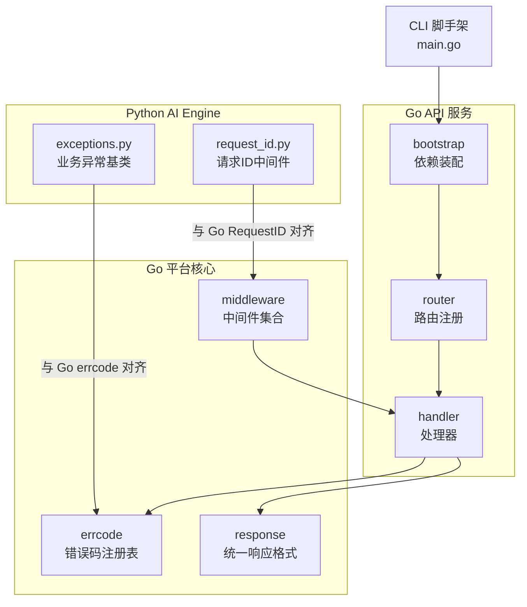
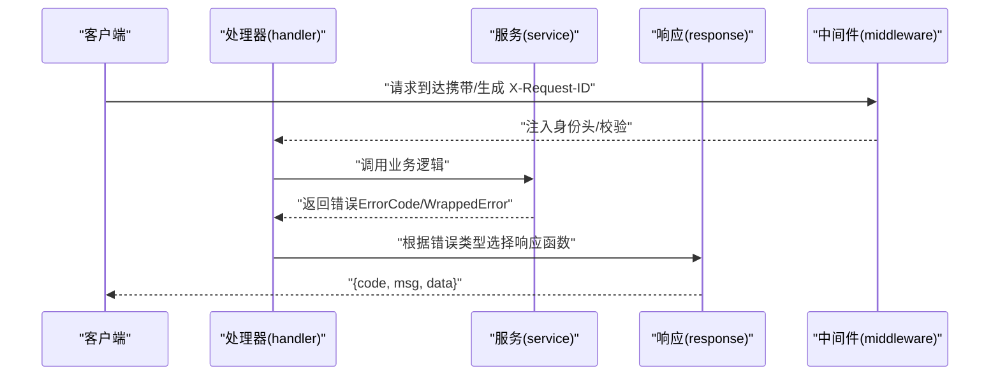
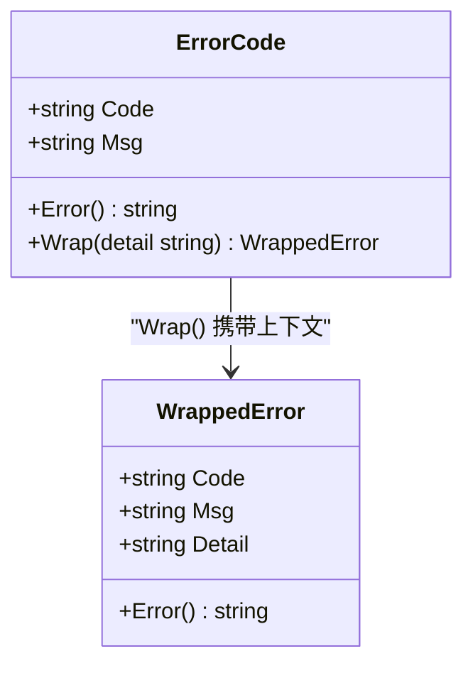
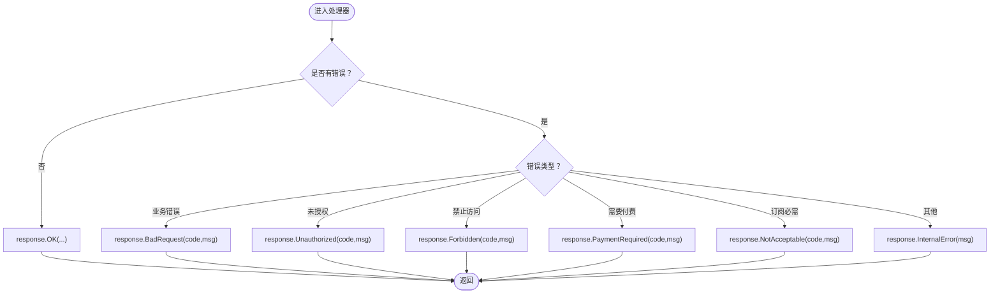
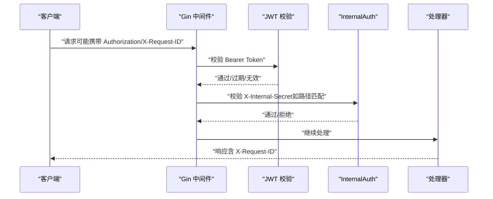
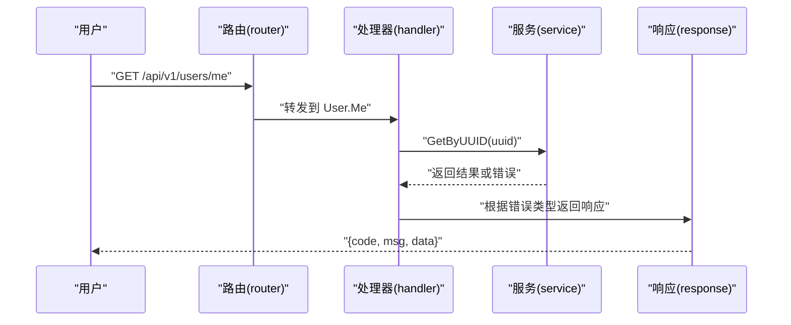
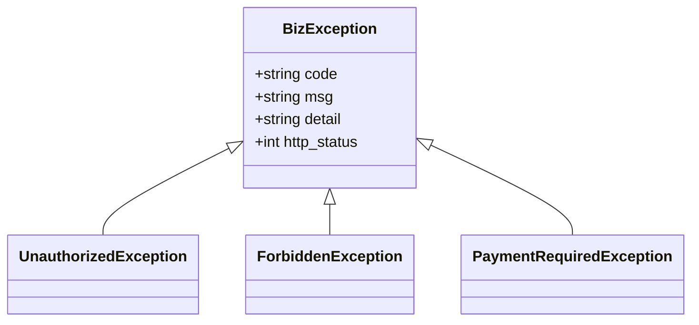
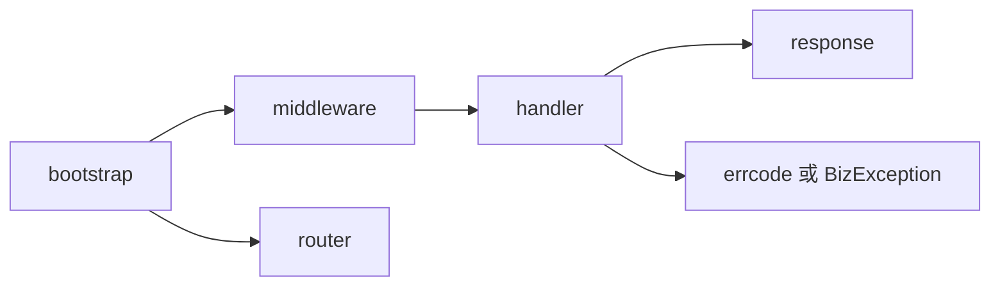

# 错误码管理

<cite>
**本文引用的文件**
- [errcode.go.tmpl](file://templates/files/pkg-platform-core/errcode/errcode.go.tmpl)
- [errcode_test.go.tmpl](file://templates/files/pkg-platform-core/errcode/errcode_test.go.tmpl)
- [errcode.md](file://templates/files/pkg-platform-core/docs/errcode.md)
- [response.go.tmpl](file://templates/files/pkg-platform-core/response/response.go.tmpl)
- [middleware.go.tmpl](file://templates/files/pkg-platform-core/middleware/middleware.go.tmpl)
- [user.go.tmpl](file://templates/files/backend-api/internal/handler/user.go.tmpl)
- [routes.go.tmpl](file://templates/files/backend-api/internal/router/routes.go.tmpl)
- [bootstrap.go.tmpl](file://templates/files/backend-api/internal/app/bootstrap.go.tmpl)
- [config.go.tmpl](file://templates/files/backend-api/internal/config/config.go.tmpl)
- [exceptions.py](file://templates/files/backend-ai-engine/app/core/exceptions.py)
- [request_id.py](file://templates/files/backend-ai-engine/app/core/request_id.py)
- [start.sh.tmpl](file://templates/files/deploy/local/start.sh.tmpl)
- [main.go](file://cmd/platform/main.go)
</cite>

## 目录
1. [简介](#简介)
2. [项目结构](#项目结构)
3. [核心组件](#核心组件)
4. [架构总览](#架构总览)
5. [详细组件分析](#详细组件分析)
6. [依赖分析](#依赖分析)
7. [性能考虑](#性能考虑)
8. [故障排查指南](#故障排查指南)
9. [结论](#结论)
10. [附录](#附录)

## 简介
本文件系统性阐述“错误码管理”在本脚手架中的设计与实践，包括错误码体系设计、分类规则、国际化支持策略、错误码定义与消息模板、上下文信息处理、错误追踪与日志记录、调试技巧，以及扩展指南。目标是帮助开发者在不同语言（Go、Python）与不同服务（API、AI Engine、Gateway）中统一错误表达与处理方式。

## 项目结构
围绕错误码管理的关键文件分布如下：
- Go 平台核心库：errcode（错误码注册表）、response（统一响应格式）、middleware（中间件，含请求ID、JWT、内部认证等）
- Go API 服务：handler、router、bootstrap（装配中间件与路由）
- Python AI Engine：异常基类与请求ID中间件（与 Go 端对齐）
- CLI 脚手架：初始化模板与部署脚本

图表来源
- [errcode.go.tmpl:1-84](file://templates/files/pkg-platform-core/errcode/errcode.go.tmpl#L1-L84)
- [response.go.tmpl:1-78](file://templates/files/pkg-platform-core/response/response.go.tmpl#L1-L78)
- [middleware.go.tmpl:1-202](file://templates/files/pkg-platform-core/middleware/middleware.go.tmpl#L1-L202)
- [bootstrap.go.tmpl:1-99](file://templates/files/backend-api/internal/app/bootstrap.go.tmpl#L1-L99)
- [routes.go.tmpl:1-29](file://templates/files/backend-api/internal/router/routes.go.tmpl#L1-L29)
- [user.go.tmpl:1-47](file://templates/files/backend-api/internal/handler/user.go.tmpl#L1-L47)
- [exceptions.py:1-31](file://templates/files/backend-ai-engine/app/core/exceptions.py#L1-L31)
- [request_id.py:1-31](file://templates/files/backend-ai-engine/app/core/request_id.py#L1-L31)
- [main.go:1-98](file://cmd/platform/main.go#L1-L98)

章节来源
- [errcode.go.tmpl:1-84](file://templates/files/pkg-platform-core/errcode/errcode.go.tmpl#L1-L84)
- [response.go.tmpl:1-78](file://templates/files/pkg-platform-core/response/response.go.tmpl#L1-L78)
- [middleware.go.tmpl:1-202](file://templates/files/pkg-platform-core/middleware/middleware.go.tmpl#L1-L202)
- [bootstrap.go.tmpl:1-99](file://templates/files/backend-api/internal/app/bootstrap.go.tmpl#L1-L99)
- [routes.go.tmpl:1-29](file://templates/files/backend-api/internal/router/routes.go.tmpl#L1-L29)
- [user.go.tmpl:1-47](file://templates/files/backend-api/internal/handler/user.go.tmpl#L1-L47)
- [exceptions.py:1-31](file://templates/files/backend-ai-engine/app/core/exceptions.py#L1-L31)
- [request_id.py:1-31](file://templates/files/backend-ai-engine/app/core/request_id.py#L1-L31)
- [main.go:1-98](file://cmd/platform/main.go#L1-L98)

## 核心组件
- 错误码注册表（errcode）
  - 定义 ErrorCode 与 WrappedError 结构，提供 New、Error、Wrap 等方法
  - 预置通用错误码（系统层、鉴权、文件与资源、支付与积分、AI 与外部服务）
- 统一响应（response）
  - 定义统一响应体 {code, msg, data}，并提供多种 HTTP 状态码的便捷函数
- 中间件（middleware）
  - RequestID：全链路请求 ID 生成/透传
  - JWT：Bearer Token 校验、过期处理、注入身份头
  - InternalAuth：内部私域路由校验
  - CORS、限流、Prometheus 指标等
- 处理器（handler）
  - 从 service 层接收错误，使用 response 包返回统一格式
- 异常基类（Python AI Engine）
  - BizException 与 Unauthorized/Forbidden/PaymentRequired 子类，与 Go errcode 对齐
- 请求 ID（Python AI Engine）
  - 与 Go RequestID 中间件对齐，便于跨服务串联日志

章节来源
- [errcode.go.tmpl:11-38](file://templates/files/pkg-platform-core/errcode/errcode.go.tmpl#L11-L38)
- [response.go.tmpl:26-77](file://templates/files/pkg-platform-core/response/response.go.tmpl#L26-L77)
- [middleware.go.tmpl:24-163](file://templates/files/pkg-platform-core/middleware/middleware.go.tmpl#L24-L163)
- [user.go.tmpl:28-46](file://templates/files/backend-api/internal/handler/user.go.tmpl#L28-L46)
- [exceptions.py:9-31](file://templates/files/backend-ai-engine/app/core/exceptions.py#L9-L31)
- [request_id.py:17-31](file://templates/files/backend-ai-engine/app/core/request_id.py#L17-L31)

## 架构总览
错误码在系统中的流转路径如下：
- 业务层（service/handler）抛出或返回 ErrorCode/WrappedError
- 处理器根据错误类型选择合适的 response 函数（如 BadRequest、Unauthorized 等）
- 中间件负责注入请求 ID、身份信息、CORS 等
- 前端根据 code 做国际化映射，msg 作为回退提示

图表来源
- [middleware.go.tmpl:24-163](file://templates/files/pkg-platform-core/middleware/middleware.go.tmpl#L24-L163)
- [user.go.tmpl:28-46](file://templates/files/backend-api/internal/handler/user.go.tmpl#L28-L46)
- [response.go.tmpl:33-77](file://templates/files/pkg-platform-core/response/response.go.tmpl#L33-L77)

## 详细组件分析

### 错误码注册表（errcode）
- 设计要点
  - 六位业务错误码字符串，与 HTTP 状态码解耦
  - 通过 Wrap 携带运行时上下文（Detail），不影响 Code/Msg
  - 前端以 Code 为键做国际化，后端仅维护默认 Msg
- 数据结构
  - ErrorCode：Code、Msg
  - WrappedError：Code、Msg、Detail
- 预置错误码分段
  - 系统层 000xxx：鉴权基础设施、内部错误等
  - 鉴权与注册 100xxx：登录、注册、验证码等
  - 文件与资源 103xxx：上传、下载等
  - 支付与积分 104xxx：扣费、充值等
  - AI 与外部服务 105xxx：LLM、第三方 API 等
  - 业务预留 11xxxx~99xxxx：新业务模块自取

图表来源
- [errcode.go.tmpl:11-38](file://templates/files/pkg-platform-core/errcode/errcode.go.tmpl#L11-L38)

章节来源
- [errcode.go.tmpl:1-84](file://templates/files/pkg-platform-core/errcode/errcode.go.tmpl#L1-L84)
- [errcode.md:1-67](file://templates/files/pkg-platform-core/docs/errcode.md#L1-L67)

### 统一响应（response）
- 设计要点
  - 统一响应体 {code, msg, data}
  - HTTP 状态码与业务错误分离：业务错误统一 400 + code
- 常用函数
  - OK/OKPage：200 成功
  - BadRequest/Unauthorized/Forbidden/PaymentRequired/NotAcceptable/InternalError：对应 400/401/403/402/406/500

图表来源
- [response.go.tmpl:26-77](file://templates/files/pkg-platform-core/response/response.go.tmpl#L26-L77)
- [user.go.tmpl:28-46](file://templates/files/backend-api/internal/handler/user.go.tmpl#L28-L46)

章节来源
- [response.go.tmpl:1-78](file://templates/files/pkg-platform-core/response/response.go.tmpl#L1-L78)
- [user.go.tmpl:1-47](file://templates/files/backend-api/internal/handler/user.go.tmpl#L1-L47)

### 中间件（middleware）
- RequestID：生成或透传 X-Request-ID，便于跨服务串联日志
- JWT：校验 Bearer Token，注入身份头；过期返回 403，缺失/无效返回 401
- InternalAuth：校验 X-Internal-Secret，保护 /internal/* 私域路由
- CORS：白名单 Origin + AllowCredentials，暴露 X-Request-ID 等响应头

图表来源
- [middleware.go.tmpl:24-163](file://templates/files/pkg-platform-core/middleware/middleware.go.tmpl#L24-L163)
- [bootstrap.go.tmpl:84-90](file://templates/files/backend-api/internal/app/bootstrap.go.tmpl#L84-L90)

章节来源
- [middleware.go.tmpl:1-202](file://templates/files/pkg-platform-core/middleware/middleware.go.tmpl#L1-L202)
- [bootstrap.go.tmpl:1-99](file://templates/files/backend-api/internal/app/bootstrap.go.tmpl#L1-L99)

### 处理器（handler）与路由（router）
- 处理器职责：解析参数 → 调用 service → 使用 response 返回统一格式
- 路由注册：按 /api/v1 前缀组织业务模块路由

图表来源
- [routes.go.tmpl:16-28](file://templates/files/backend-api/internal/router/routes.go.tmpl#L16-L28)
- [user.go.tmpl:28-46](file://templates/files/backend-api/internal/handler/user.go.tmpl#L28-L46)

章节来源
- [routes.go.tmpl:1-29](file://templates/files/backend-api/internal/router/routes.go.tmpl#L1-L29)
- [user.go.tmpl:1-47](file://templates/files/backend-api/internal/handler/user.go.tmpl#L1-L47)

### Python AI Engine 异常与请求 ID
- 异常基类 BizException 与 Go errcode 对齐：code + msg + 可选 detail
- 请求 ID 中间件与 Go RequestID 对齐，便于跨服务日志串联

图表来源
- [exceptions.py:9-31](file://templates/files/backend-ai-engine/app/core/exceptions.py#L9-L31)

章节来源
- [exceptions.py:1-31](file://templates/files/backend-ai-engine/app/core/exceptions.py#L1-L31)
- [request_id.py:1-31](file://templates/files/backend-ai-engine/app/core/request_id.py#L1-L31)

## 依赖分析
- 组件耦合
  - handler 依赖 response 与 errcode（或等价的异常模型）
  - bootstrap 装配中间件（RequestID、JWT、InternalAuth 等）并注册路由
  - middleware 与 response 协作，确保统一的错误响应与请求追踪
- 外部依赖
  - Gin（Go API 服务）
  - Redis（缓存、限流指标等）
  - Prometheus（指标采集）

图表来源
- [bootstrap.go.tmpl:78-90](file://templates/files/backend-api/internal/app/bootstrap.go.tmpl#L78-L90)
- [middleware.go.tmpl:1-202](file://templates/files/pkg-platform-core/middleware/middleware.go.tmpl#L1-L202)
- [response.go.tmpl:1-78](file://templates/files/pkg-platform-core/response/response.go.tmpl#L1-L78)
- [user.go.tmpl:1-47](file://templates/files/backend-api/internal/handler/user.go.tmpl#L1-L47)

章节来源
- [bootstrap.go.tmpl:1-99](file://templates/files/backend-api/internal/app/bootstrap.go.tmpl#L1-L99)
- [middleware.go.tmpl:1-202](file://templates/files/pkg-platform-core/middleware/middleware.go.tmpl#L1-L202)
- [response.go.tmpl:1-78](file://templates/files/pkg-platform-core/response/response.go.tmpl#L1-L78)
- [user.go.tmpl:1-47](file://templates/files/backend-api/internal/handler/user.go.tmpl#L1-L47)

## 性能考虑
- 错误码注册与 Wrap 的开销极低，主要成本在日志与网络传输
- 使用 WrappedError 的 Detail 仅用于服务端日志，避免向客户端泄露敏感信息
- 建议在高频错误场景下，优先使用预置错误码，减少字符串拼接与上下文构造

## 故障排查指南
- 常见问题
  - 前端无法翻译：检查是否直接硬编码 code，应使用 errcode 注册表
  - 重复使用已有 code：破坏前端国际化键，导致文案错乱
  - Detail 泄露：确认 Detail 仅用于日志，不返回给前端
- 日志与追踪
  - RequestID：确保中间件正确生成/透传 X-Request-ID
  - 跨服务串联：使用相同请求 ID 在不同服务日志中检索
- 调试步骤
  - 在处理器中区分错误类型，选择合适的 response 函数
  - 使用 WrappedError 携带关键上下文（如用户 UUID、费用、余额等）
  - 检查中间件顺序与配置（JWT、InternalAuth、CORS）

章节来源
- [errcode.md:62-67](file://templates/files/pkg-platform-core/docs/errcode.md#L62-L67)
- [middleware.go.tmpl:24-47](file://templates/files/pkg-platform-core/middleware/middleware.go.tmpl#L24-L47)
- [user.go.tmpl:28-46](file://templates/files/backend-api/internal/handler/user.go.tmpl#L28-L46)

## 结论
本脚手架通过“六位业务错误码 + 统一响应 + 中间件”的组合，实现了跨语言、跨服务的一致错误表达与处理。配合 RequestID 与国际化策略，能够高效支撑错误追踪与调试。新增业务时，遵循分段规则与命名约定，即可快速扩展错误码体系。

## 附录

### 错误码参考表（按分段）
- 系统层 000xxx
  - 示例：000001（Token 无效）、000002（Token 过期）、000004（需要登录）、000005（权限不足）、000099（服务器内部错误）
- 鉴权与注册 100xxx
  - 示例：100001（手机号/邮箱为空）、100002（格式无效）、100004（验证码已发送）、100005（验证码无效）、100012（验证码错误或已过期）
- 文件与资源 103xxx
  - 示例：103001（文件不存在）、103004（文件上传失败）
- 支付与积分 104xxx
  - 示例：104001（积分不足）、104002（积分异常）
- AI 与外部服务 105xxx
  - 示例：105006（AI 服务请求失败）、105017（锁获取失败）

章节来源
- [errcode.go.tmpl:51-83](file://templates/files/pkg-platform-core/errcode/errcode.go.tmpl#L51-L83)
- [errcode.md:7-16](file://templates/files/pkg-platform-core/docs/errcode.md#L7-L16)

### 国际化支持策略
- 前端以错误码为键进行多语言映射
- 后端仅维护默认 Msg，作为开发期回退提示
- 建议在前端侧维护 code->locale 映射表，并支持动态切换语言

章节来源
- [errcode.md:3-5](file://templates/files/pkg-platform-core/docs/errcode.md#L3-L5)

### 使用示例与最佳实践
- 在业务包内集中声明全局错误码变量
- 使用 Wrap 携带运行时上下文（如用户 UUID、费用、余额等）
- 处理器中区分错误类型，选择对应的 response 函数
- 不要跳过注册直接硬编码响应体

章节来源
- [errcode.md:50-67](file://templates/files/pkg-platform-core/docs/errcode.md#L50-L67)
- [user.go.tmpl:28-46](file://templates/files/backend-api/internal/handler/user.go.tmpl#L28-L46)

### 扩展指南
- 新增业务错误码
  - 在对应业务包内声明全局变量，使用 11xxxx~99xxxx 预留段
  - 遵循现有命名风格，确保语义清晰
- 跨语言一致性
  - Python 端使用 BizException 及其子类，保持与 Go errcode 的字段与语义对齐
  - 请求 ID 中间件在两端保持一致行为

章节来源
- [errcode.go.tmpl:18-21](file://templates/files/pkg-platform-core/errcode/errcode.go.tmpl#L18-L21)
- [exceptions.py:9-31](file://templates/files/backend-ai-engine/app/core/exceptions.py#L9-L31)
- [request_id.py:17-31](file://templates/files/backend-ai-engine/app/core/request_id.py#L17-L31)

### 部署与启动脚本
- 本地一键启动脚本支持启动 gateway、api、ai-engine、web、admin 服务
- 通过 .env 配置端口与环境变量，便于开发调试

章节来源
- [start.sh.tmpl:1-242](file://templates/files/deploy/local/start.sh.tmpl#L1-L242)