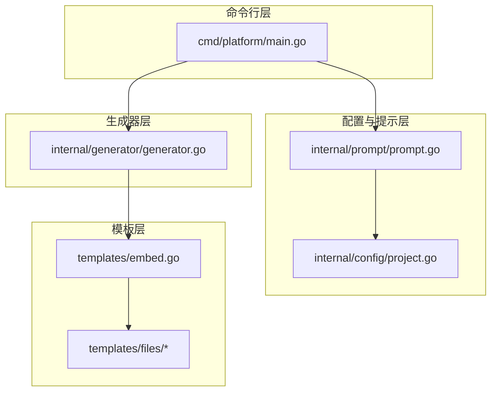
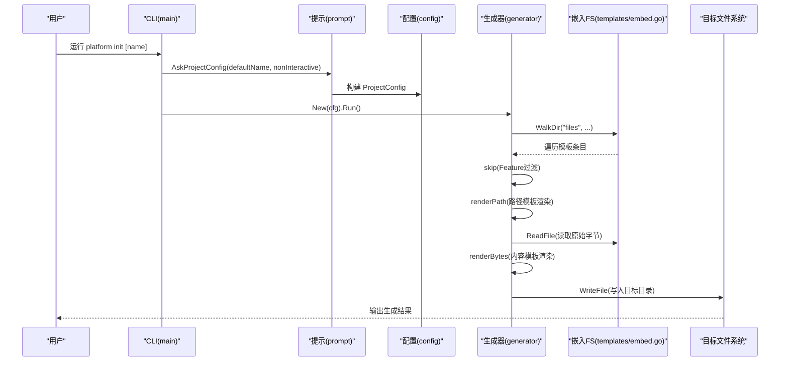
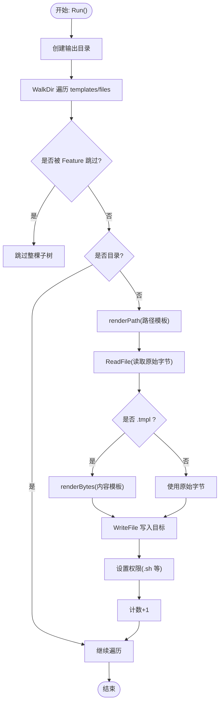
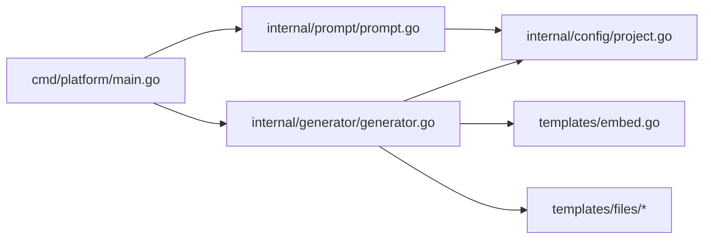

# 嵌入式模板引擎

<cite>
**本文引用的文件**
- [templates/embed.go](file://templates/embed.go)
- [internal/generator/generator.go](file://internal/generator/generator.go)
- [internal/config/project.go](file://internal/config/project.go)
- [internal/prompt/prompt.go](file://internal/prompt/prompt.go)
- [cmd/platform/main.go](file://cmd/platform/main.go)
- [templates/files/backend-api/cmd/api/main.go.tmpl](file://templates/files/backend-api/cmd/api/main.go.tmpl)
- [templates/files/frontend-web/src/app/layout.tsx.tmpl](file://templates/files/frontend-web/src/app/layout.tsx.tmpl)
- [templates/files/pkg-platform-core/cache/cache.go.tmpl](file://templates/files/pkg-platform-core/cache/cache.go.tmpl)
</cite>

## 目录
1. [简介](#简介)
2. [项目结构](#项目结构)
3. [核心组件](#核心组件)
4. [架构总览](#架构总览)
5. [详细组件分析](#详细组件分析)
6. [依赖分析](#依赖分析)
7. [性能考虑](#性能考虑)
8. [故障排查指南](#故障排查指南)
9. [结论](#结论)
10. [附录](#附录)

## 简介
本项目是一个“嵌入式模板引擎”的实现，其核心思想是利用 Go 1.16+ 的 embed 包将模板资源内嵌进二进制文件中，使脚手架成为自包含的可执行程序。运行时通过 Go 的标准库 io/fs 接口访问这些模板，结合 text/template 对模板进行解析与渲染，最终将生成的文件写入目标目录。

该模板引擎的关键特性包括：
- 模板文件完全内嵌于二进制，无需外部文件依赖
- 支持对模板路径与内容同时进行渲染（路径中的模板变量也会被替换）
- 通过配置开关控制模板树的跳过与选择
- 使用 text/template 的严格键策略，缺失键即报错，提升模板健壮性
- 生成文件时自动处理可执行权限与后缀剥离

## 项目结构
项目采用分层组织方式：
- cmd/platform：CLI 入口，负责命令注册与参数解析
- internal/config：定义生成所需的配置模型与校验逻辑
- internal/prompt：交互式收集用户输入并构建配置
- internal/generator：遍历嵌入的模板树，渲染并写入磁盘
- templates：存放模板文件与 embed.FS 的声明

图表来源
- [cmd/platform/main.go:22-98](file://cmd/platform/main.go#L22-L98)
- [internal/prompt/prompt.go:14-105](file://internal/prompt/prompt.go#L14-L105)
- [internal/config/project.go:12-121](file://internal/config/project.go#L12-L121)
- [internal/generator/generator.go:33-103](file://internal/generator/generator.go#L33-L103)
- [templates/embed.go:6-12](file://templates/embed.go#L6-L12)

章节来源
- [cmd/platform/main.go:22-98](file://cmd/platform/main.go#L22-L98)
- [internal/config/project.go:12-121](file://internal/config/project.go#L12-L121)
- [internal/prompt/prompt.go:14-105](file://internal/prompt/prompt.go#L14-L105)
- [internal/generator/generator.go:33-103](file://internal/generator/generator.go#L33-L103)
- [templates/embed.go:6-12](file://templates/embed.go#L6-L12)

## 核心组件
- 模板嵌入与访问
  - 通过 templates/embed.go 中的 embed.FS 将 templates/files 下的全部模板内嵌进二进制，并以只读文件系统的方式提供访问接口。
  - 遍历时去除“files/”前缀，得到相对于目标项目的相对路径。
- 生成器
  - 遍历模板树，根据配置决定是否跳过某条路径（如前端 web/admin、AI 引擎、核心库等）。
  - 对路径与内容分别进行渲染，.tmpl 后缀会被剥离。
  - 写入目标目录，自动设置权限（如 .sh 文件赋予执行权限）。
- 配置与校验
  - ProjectConfig 定义了所有模板可用的变量集合，包含项目名、品牌名、域名、Go 模块路径、各服务端口、功能开关、是否初始化 Git 等。
  - Validate 对关键字段进行格式与业务规则校验。
- 交互式提示
  - 使用 charmbracelet/huh 收集用户输入，支持非交互模式（--yes）。
- CLI 入口
  - 使用 cobra 注册 init 与 version 子命令，执行初始化流程并输出下一步指引。

章节来源
- [templates/embed.go:6-12](file://templates/embed.go#L6-L12)
- [internal/generator/generator.go:33-103](file://internal/generator/generator.go#L33-L103)
- [internal/config/project.go:12-121](file://internal/config/project.go#L12-L121)
- [internal/prompt/prompt.go:14-105](file://internal/prompt/prompt.go#L14-L105)
- [cmd/platform/main.go:40-98](file://cmd/platform/main.go#L40-L98)

## 架构总览
下图展示了从 CLI 到模板渲染与写入的完整流程：

图表来源
- [cmd/platform/main.go:40-98](file://cmd/platform/main.go#L40-L98)
- [internal/prompt/prompt.go:14-105](file://internal/prompt/prompt.go#L14-L105)
- [internal/config/project.go:62-106](file://internal/config/project.go#L62-L106)
- [internal/generator/generator.go:33-103](file://internal/generator/generator.go#L33-L103)
- [templates/embed.go:6-12](file://templates/embed.go#L6-L12)

## 详细组件分析

### 组件一：模板嵌入与访问（templates/embed.go）
- 功能概述
  - 通过 //go:embed all:files 将 templates/files 下的全部文件内嵌为只读文件系统。
  - FS 即为根文件系统，遍历时得到的相对路径即为目标项目中的相对路径（去除了“files/”前缀）。
- 关键点
  - 仅暴露只读接口，保证运行时安全与一致性。
  - 与生成器配合，统一通过 io/fs 接口访问，便于替换与测试。

章节来源
- [templates/embed.go:6-12](file://templates/embed.go#L6-L12)

### 组件二：生成器（internal/generator/generator.go）
- 功能概述
  - 遍历 templates/files 树，按规则渲染并写入磁盘。
  - 支持路径模板渲染（路径中也可包含模板变量）、内容模板渲染（.tmpl 后缀）。
  - 根据 Feature 开关跳过对应子树，支持按需生成。
- 核心流程
  - 初始化输出目录
  - WalkDir 遍历模板树，跳过被 Feature 禁用的路径
  - 对文件进行路径渲染与内容渲染（若为 .tmpl）
  - 写入目标文件，设置权限（如 .sh）
- 错误处理
  - 任何阶段出错均向上返回，保证失败可见且可定位。
- 性能与内存
  - 读取模板为一次性操作，渲染后立即写入，内存占用低。
  - 通过 SkipDir 提前跳过整棵子树，减少 IO。

图表来源
- [internal/generator/generator.go:33-103](file://internal/generator/generator.go#L33-L103)

章节来源
- [internal/generator/generator.go:33-103](file://internal/generator/generator.go#L33-L103)

### 组件三：配置与校验（internal/config/project.go）
- 数据模型
  - ProjectConfig：包含项目名、品牌名、域名、Go 模块路径、端口集合、功能开关、是否使用核心库、是否初始化 Git、输出目录等。
  - Ports：集中管理各服务端口。
  - Features：控制前端 web/admin、AI 引擎等模块的开关。
- 默认值与校验
  - Defaults 提供合理的默认值，便于非交互模式使用。
  - Validate 对关键字段进行正则与业务规则校验，确保模板渲染时不会出现非法值。

章节来源
- [internal/config/project.go:12-121](file://internal/config/project.go#L12-L121)

### 组件四：交互式提示（internal/prompt/prompt.go）
- 功能概述
  - 使用 charmbracelet/huh 构建表单，收集项目名、品牌名、域名、Go 模块路径、各服务端口、启用模块、是否初始化 Git 等。
  - 支持 --yes 非交互模式，此时必须显式提供项目名。
- 校验与转换
  - 对端口字符串进行解析与回退，确保端口有效。
  - 将选中的模块映射到 Features 字段。

章节来源
- [internal/prompt/prompt.go:14-105](file://internal/prompt/prompt.go#L14-L105)

### 组件五：CLI 入口（cmd/platform/main.go）
- 功能概述
  - 注册 init 与 version 子命令。
  - 执行初始化流程：收集配置、校验、创建生成器、运行生成、输出下一步指引。
- 错误处理
  - 所有错误输出到标准错误并退出非零码，便于脚本捕获。

章节来源
- [cmd/platform/main.go:40-98](file://cmd/platform/main.go#L40-L98)

### 模板示例与渲染行为
- Go API 入口模板
  - 示例路径：templates/files/backend-api/cmd/api/main.go.tmpl
  - 行为：渲染后写入目标目录，.tmpl 后缀被剥离；路径中也可包含模板变量。
- Next.js 布局模板
  - 示例路径：templates/files/frontend-web/src/app/layout.tsx.tmpl
  - 行为：渲染标题与描述等变量，写入目标文件。
- 核心库缓存模板
  - 示例路径：templates/files/pkg-platform-core/cache/cache.go.tmpl
  - 行为：渲染泛型函数与注释，体现模板引擎对复杂 Go 代码的适用性。

章节来源
- [templates/files/backend-api/cmd/api/main.go.tmpl:1-56](file://templates/files/backend-api/cmd/api/main.go.tmpl#L1-L56)
- [templates/files/frontend-web/src/app/layout.tsx.tmpl:1-13](file://templates/files/frontend-web/src/app/layout.tsx.tmpl#L1-L13)
- [templates/files/pkg-platform-core/cache/cache.go.tmpl:1-93](file://templates/files/pkg-platform-core/cache/cache.go.tmpl#L1-L93)

## 依赖分析
- 模块耦合
  - CLI 依赖提示与配置模块，生成器依赖配置与嵌入 FS。
  - 生成器与模板层解耦，仅通过 io/fs 接口访问，利于替换与测试。
- 外部依赖
  - cobra：命令行框架
  - charmbracelet/huh：交互式表单
  - text/template：模板解析与渲染
  - io/fs：统一文件系统接口

图表来源
- [cmd/platform/main.go:40-98](file://cmd/platform/main.go#L40-L98)
- [internal/prompt/prompt.go:14-105](file://internal/prompt/prompt.go#L14-L105)
- [internal/config/project.go:12-121](file://internal/config/project.go#L12-L121)
- [internal/generator/generator.go:33-103](file://internal/generator/generator.go#L33-L103)
- [templates/embed.go:6-12](file://templates/embed.go#L6-L12)

章节来源
- [cmd/platform/main.go:40-98](file://cmd/platform/main.go#L40-L98)
- [internal/generator/generator.go:33-103](file://internal/generator/generator.go#L33-L103)
- [templates/embed.go:6-12](file://templates/embed.go#L6-L12)

## 性能考虑
- 模板加载
  - 通过 embed 将模板内嵌，启动即可用，避免磁盘 IO 与路径查找开销。
- 渲染策略
  - 使用 text/template 的 missingkey=error 选项，提前发现模板变量缺失问题，减少运行期错误。
  - 路径与内容分别渲染，避免重复解析同一模板。
- 内存管理
  - 逐文件读取与渲染，写入后释放，整体内存占用与文件数量线性相关。
  - 对大文件模板建议拆分或减少复杂度，避免一次性渲染造成峰值内存上升。
- 并发与可扩展
  - 当前实现为顺序遍历，若模板数量较大，可考虑并发渲染（注意写入顺序与锁）。
  - 通过 io/fs 接口抽象，可替换为内存 FS 或远程 FS 以适配不同部署场景。

## 故障排查指南
- 常见错误类型
  - 配置校验失败：检查 ProjectName、Brand、GoModulePath、端口等字段是否符合要求。
  - 模板变量缺失：text/template 在 missingkey=error 模式下会报错，检查模板中使用的变量是否在 ProjectConfig 中提供。
  - 路径跳过异常：确认 Features 开关与目标路径前缀匹配是否正确。
- 定位方法
  - 查看 CLI 输出的错误信息与行号，逐项修正。
  - 在生成器中增加日志记录（如渲染路径与内容时的上下文），便于快速定位。
- 修复建议
  - 对于非交互模式，确保 --yes 时提供了项目名。
  - 对于 .sh 等可执行文件，确认 isExecutable 判定逻辑与目标文件名匹配。

章节来源
- [internal/config/project.go:91-106](file://internal/config/project.go#L91-L106)
- [internal/generator/generator.go:137-147](file://internal/generator/generator.go#L137-L147)
- [internal/generator/generator.go:105-120](file://internal/generator/generator.go#L105-L120)

## 结论
本嵌入式模板引擎以 Go 1.16+ 的 embed 为核心，实现了“自包含”的模板系统。通过 io/fs 抽象与 text/template 的组合，既保证了运行时的高性能与稳定性，又提供了强大的模板渲染能力。配合交互式提示与严格的配置校验，能够稳定地生成多语言、多组件的微服务脚手架工程。未来可在并发渲染、远程模板源接入与模板缓存等方面进一步优化与扩展。

## 附录
- 模板引擎扩展指南
  - 新增模板：将文件放入 templates/files 下，命名遵循现有约定（.tmpl 后缀表示需要渲染的内容）。
  - 自定义渲染器：保持 io/fs 接口不变，替换为自定义实现（如内存 FS 或远程 FS），并在生成器中注入。
  - 模板缓存：可在生成器中引入缓存层，对已渲染的路径与内容进行缓存，减少重复解析成本（注意缓存失效策略）。
- 最佳实践
  - 将模板变量集中在 ProjectConfig 中，避免分散在多个位置。
  - 使用 Features 开关控制可选模块，减少生成时间与产物体积。
  - 对复杂模板进行拆分，降低单模板复杂度，提升可维护性。