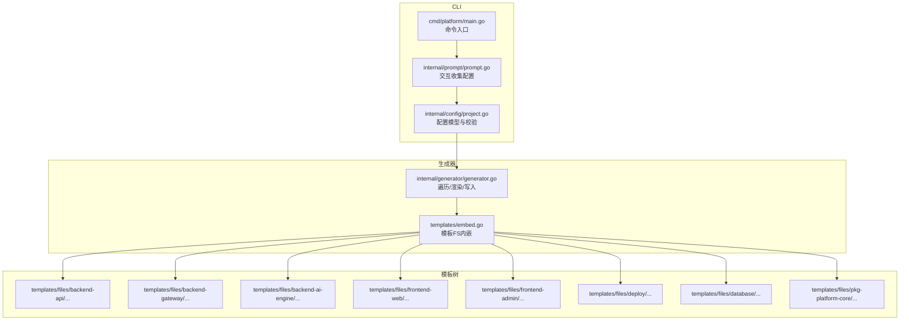
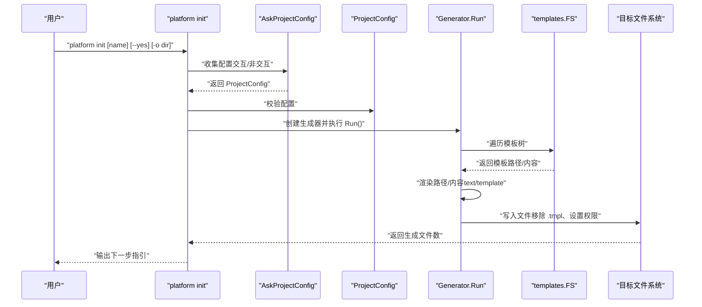
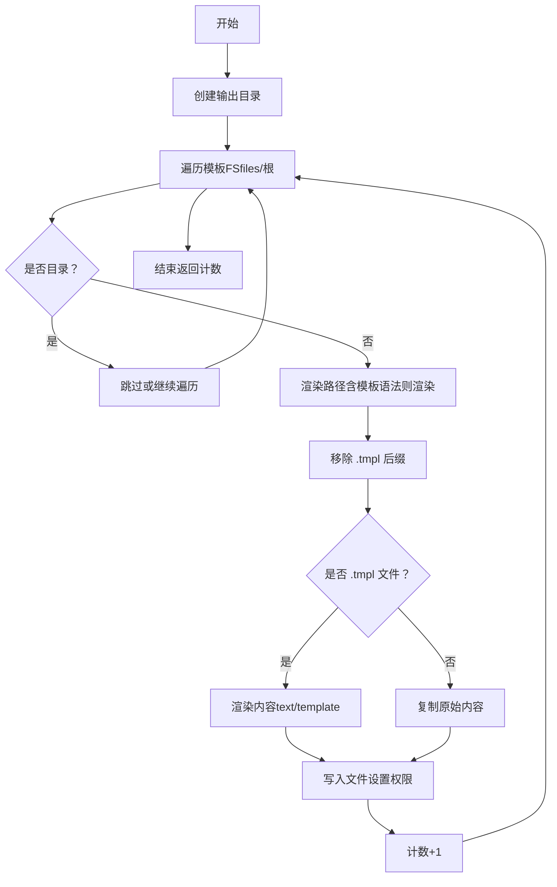
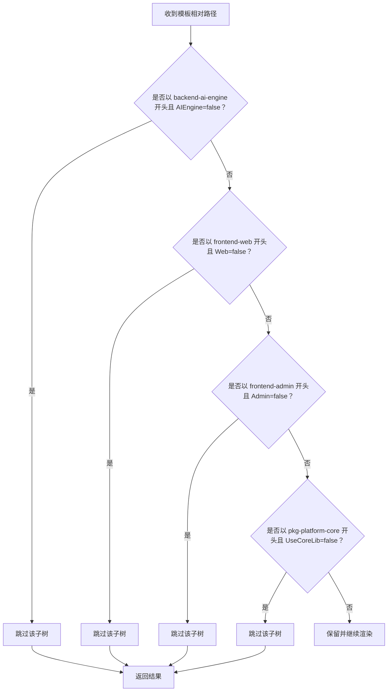
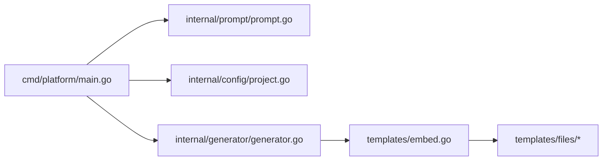

# 模板定制与扩展

<cite>
**本文引用的文件**
- [cmd/platform/main.go](file://cmd/platform/main.go)
- [internal/config/project.go](file://internal/config/project.go)
- [internal/generator/generator.go](file://internal/generator/generator.go)
- [internal/prompt/prompt.go](file://internal/prompt/prompt.go)
- [templates/embed.go](file://templates/embed.go)
- [templates/files/backend-api/cmd/api/main.go.tmpl](file://templates/files/backend-api/cmd/api/main.go.tmpl)
- [templates/files/backend-api/internal/config/config.go.tmpl](file://templates/files/backend-api/internal/config/config.go.tmpl)
- [templates/files/backend-ai-engine/Dockerfile.tmpl](file://templates/files/backend-ai-engine/Dockerfile.tmpl)
- [templates/files/deploy/local/docker-compose-all.yaml.tmpl](file://templates/files/deploy/local/docker-compose-all.yaml.tmpl)
- [templates/files/frontend-web/package.json.tmpl](file://templates/files/frontend-web/package.json.tmpl)
</cite>

## 目录
1. [简介](#简介)
2. [项目结构](#项目结构)
3. [核心组件](#核心组件)
4. [架构总览](#架构总览)
5. [详细组件分析](#详细组件分析)
6. [依赖分析](#依赖分析)
7. [性能考虑](#性能考虑)
8. [故障排查指南](#故障排查指南)
9. [结论](#结论)
10. [附录](#附录)

## 简介
本指南面向需要对脚手架模板进行“定制与扩展”的工程师与架构师，围绕以下目标展开：
- 如何创建自定义模板、修改现有模板与添加新模板类型
- 模板变量定义、条件逻辑编写与文件组织规范
- 模板版本管理、向后兼容性与升级策略
- 模板测试方法、质量保证与最佳实践建议

该脚手架采用“模板内嵌 + 文本模板渲染”的设计：模板以 .tmpl 结尾，运行时通过 text/template 将 ProjectConfig 中的字段注入到文件名与内容中，并根据 Features 与 UseCoreLib 等开关决定是否渲染特定子树。

## 项目结构
模板系统位于 templates/files 下，采用“功能域 + 语言/框架”的分层组织方式：
- backend-api：Go 微服务骨架
- backend-gateway：Go 网关
- backend-ai-engine：Python AI 引擎
- frontend-web：Next.js 前端
- frontend-admin：Vite+React 管理端
- deploy/local、deploy/k3s：部署编排
- database：数据库初始化 SQL
- pkg-platform-core：公共组件库（可选）
- 其他顶层模板：README、CLAUDE 说明等

模板通过 embedFS 内嵌至二进制，生成器遍历模板树，按规则渲染并写入目标目录；.tmpl 后缀在渲染后自动移除。

图表来源
- [cmd/platform/main.go:22-87](file://cmd/platform/main.go#L22-L87)
- [internal/prompt/prompt.go:14-104](file://internal/prompt/prompt.go#L14-L104)
- [internal/config/project.go:12-89](file://internal/config/project.go#L12-L89)
- [internal/generator/generator.go:33-103](file://internal/generator/generator.go#L33-L103)
- [templates/embed.go:6-11](file://templates/embed.go#L6-L11)

章节来源
- [cmd/platform/main.go:22-87](file://cmd/platform/main.go#L22-L87)
- [internal/generator/generator.go:33-103](file://internal/generator/generator.go#L33-L103)
- [templates/embed.go:6-11](file://templates/embed.go#L6-L11)

## 核心组件
- 配置模型 ProjectConfig：集中定义所有模板变量，包括项目名、品牌名、域名、Go 模块路径、端口集合、功能开关、是否使用公共库、是否初始化 Git、输出目录等。该结构体作为 text/template 的数据源，贯穿整个渲染流程。
- 交互收集器 AskProjectConfig：通过表单交互收集用户输入，支持非交互模式（--yes）与默认值注入。
- 生成器 Generator：负责遍历模板 FS、按规则渲染路径与内容、处理 .tmpl 后缀、根据 Features 决定跳过子树、设置可执行权限、写入磁盘并统计生成数量。
- 模板 FS：通过 embed 将 templates/files 整体内嵌为只读 FS，路径即目标项目中的相对路径。

章节来源
- [internal/config/project.go:12-89](file://internal/config/project.go#L12-L89)
- [internal/prompt/prompt.go:14-104](file://internal/prompt/prompt.go#L14-L104)
- [internal/generator/generator.go:23-103](file://internal/generator/generator.go#L23-L103)
- [templates/embed.go:6-11](file://templates/embed.go#L6-L11)

## 架构总览
下图展示了 CLI 初始化命令到模板渲染与写入的完整调用链路。

图表来源
- [cmd/platform/main.go:48-81](file://cmd/platform/main.go#L48-L81)
- [internal/prompt/prompt.go:14-104](file://internal/prompt/prompt.go#L14-L104)
- [internal/config/project.go:91-106](file://internal/config/project.go#L91-L106)
- [internal/generator/generator.go:33-103](file://internal/generator/generator.go#L33-L103)

## 详细组件分析

### 组件一：模板变量与渲染机制
- 变量来源：ProjectConfig 字段作为模板上下文，所有 .tmpl 文件均可通过 {{.Field}} 访问。
- 路径渲染：当模板路径包含模板语法时，先渲染路径再写入目标位置；.tmpl 后缀在最终产物中被移除。
- 内容渲染：仅对 .tmpl 文件进行内容渲染，非模板文件原样复制。
- 权限控制：以 .sh 结尾的文件写入时赋予执行权限。

图表来源
- [internal/generator/generator.go:33-103](file://internal/generator/generator.go#L33-L103)

章节来源
- [internal/generator/generator.go:33-103](file://internal/generator/generator.go#L33-L103)

### 组件二：条件逻辑与模板树跳过
- 依据 Features 与 UseCoreLib 决定是否渲染某棵子树：
  - AIEngine 关闭时跳过 backend-ai-engine
  - Web 关闭时跳过 frontend-web
  - Admin 关闭时跳过 frontend-admin
  - UseCoreLib 关闭时跳过 pkg-platform-core
- 该机制通过前缀匹配实现，确保整棵子树被整体跳过。

图表来源
- [internal/generator/generator.go:105-120](file://internal/generator/generator.go#L105-L120)

章节来源
- [internal/generator/generator.go:105-120](file://internal/generator/generator.go#L105-L120)

### 组件三：模板示例与变量使用
- Go API 入口模板：演示了如何在模板中使用 Brand、GoModulePath、端口等变量。
- Go API 配置模板：演示了如何在模板中使用端口、项目名等变量，并通过环境变量覆盖默认值。
- Python AI 引擎 Dockerfile：演示了如何在容器镜像构建中使用端口变量。
- Next.js 前端 package.json：演示了如何在前端工程中使用端口变量。
- 本地 docker-compose：演示了如何在编排文件中使用端口与项目名变量。

章节来源
- [templates/files/backend-api/cmd/api/main.go.tmpl:1-56](file://templates/files/backend-api/cmd/api/main.go.tmpl#L1-L56)
- [templates/files/backend-api/internal/config/config.go.tmpl:1-82](file://templates/files/backend-api/internal/config/config.go.tmpl#L1-L82)
- [templates/files/backend-ai-engine/Dockerfile.tmpl:1-14](file://templates/files/backend-ai-engine/Dockerfile.tmpl#L1-L14)
- [templates/files/frontend-web/package.json.tmpl:1-25](file://templates/files/frontend-web/package.json.tmpl#L1-L25)
- [templates/files/deploy/local/docker-compose-all.yaml.tmpl:1-48](file://templates/files/deploy/local/docker-compose-all.yaml.tmpl#L1-L48)

### 组件四：交互式配置与默认值
- 默认值：提供合理的默认值（如项目名、品牌名、域名、Go 模块路径、各服务端口、功能开关、是否使用公共库、是否初始化 Git）。
- 校验规则：强制 kebab-case 的项目名、非空的品牌与 Go 模块路径、网关与 API 端口必须大于 0。
- 交互收集：通过多组表单收集项目名、品牌、域名、Go 模块路径、各服务端口、启用模块、是否初始化 Git 等。

章节来源
- [internal/config/project.go:62-106](file://internal/config/project.go#L62-L106)
- [internal/prompt/prompt.go:14-104](file://internal/prompt/prompt.go#L14-L104)

## 依赖分析
- CLI 依赖交互收集器、配置校验器与生成器。
- 生成器依赖模板 FS 与配置对象。
- 模板 FS 由 embed 提供，内部包含 templates/files 下的全部模板。

图表来源
- [cmd/platform/main.go:15-18](file://cmd/platform/main.go#L15-L18)
- [internal/generator/generator.go:19-21](file://internal/generator/generator.go#L19-L21)
- [templates/embed.go:10-11](file://templates/embed.go#L10-L11)

章节来源
- [cmd/platform/main.go:15-18](file://cmd/platform/main.go#L15-L18)
- [internal/generator/generator.go:19-21](file://internal/generator/generator.go#L19-L21)
- [templates/embed.go:10-11](file://templates/embed.go#L10-L11)

## 性能考虑
- 模板内嵌：模板以二进制形式内嵌，避免运行时 IO 与外部依赖，启动快、分发简单。
- 单次遍历：生成器一次遍历模板树，按需渲染路径与内容，避免重复扫描。
- 条件跳过：通过前缀匹配快速跳过未启用的功能子树，减少渲染与写入开销。
- 权限设置：仅对 .sh 文件设置执行权限，避免不必要的 chmod 操作。

## 故障排查指南
- 渲染错误
  - 症状：渲染路径或内容时报错。
  - 排查：检查模板中使用的变量是否存在于 ProjectConfig；确认模板语法正确；查看生成器对路径与内容的渲染逻辑。
  - 参考
    - [internal/generator/generator.go:122-147](file://internal/generator/generator.go#L122-L147)
- 路径跳过异常
  - 症状：某些模板未生成。
  - 排查：确认 Features 与 UseCoreLib 的值；检查 skip 函数的前缀匹配逻辑。
  - 参考
    - [internal/generator/generator.go:105-120](file://internal/generator/generator.go#L105-L120)
- 配置校验失败
  - 症状：初始化时报错提示配置不合法。
  - 排查：核对项目名格式、品牌与 Go 模块路径是否为空、端口是否有效。
  - 参考
    - [internal/config/project.go:91-106](file://internal/config/project.go#L91-L106)
- 权限问题
  - 症状：脚本无法执行。
  - 排查：确认文件名以 .sh 结尾；检查 isExecutable 判定逻辑。
  - 参考
    - [internal/generator/generator.go:154-157](file://internal/generator/generator.go#L154-L157)

章节来源
- [internal/generator/generator.go:105-157](file://internal/generator/generator.go#L105-L157)
- [internal/config/project.go:91-106](file://internal/config/project.go#L91-L106)

## 结论
该模板系统以“配置驱动 + 条件渲染 + 内嵌模板”为核心，具备良好的可扩展性与可维护性。通过统一的 ProjectConfig 与 text/template 渲染，开发者可以低成本地新增模板类型、调整变量与条件逻辑，并保持生成结果的一致性与可测试性。

## 附录

### A. 创建自定义模板
- 新增模板文件
  - 在 templates/files 下按功能域/语言/框架新建目录与文件，命名以 .tmpl 结尾。
  - 在文件中使用 {{.ProjectName}}、{{.Brand}}、{{.Domain}}、{{.GoModulePath}}、{{.Ports.*}} 等变量。
  - 若模板路径包含变量，请确保路径渲染逻辑正常工作。
- 添加条件逻辑
  - 在模板中使用条件判断（如 Go 模板的 if/eq 等）控制片段渲染。
  - 或在生成器中通过 skip 逻辑按子树跳过。
- 设置权限
  - 对于脚本类文件（.sh），无需额外处理，生成器会自动赋予执行权限。

章节来源
- [internal/generator/generator.go:33-103](file://internal/generator/generator.go#L33-L103)
- [internal/generator/generator.go:105-120](file://internal/generator/generator.go#L105-L120)
- [internal/generator/generator.go:154-157](file://internal/generator/generator.go#L154-L157)

### B. 修改现有模板
- 变更变量
  - 在 ProjectConfig 中新增字段或调整现有字段，确保模板中使用一致的键名。
- 调整渲染
  - 修改模板中的变量引用或条件逻辑，必要时更新渲染函数以支持新的上下文。
- 影响范围评估
  - 评估变更对 backend-api、frontend-web、frontend-admin、deploy/local 等子树的影响，必要时同步调整 skip 逻辑。

章节来源
- [internal/config/project.go:12-41](file://internal/config/project.go#L12-L41)
- [internal/generator/generator.go:122-147](file://internal/generator/generator.go#L122-L147)

### C. 添加新模板类型
- 新增功能域
  - 在 templates/files 下新增目录（如 backend-worker、monitoring 等），按需添加 .tmpl 文件。
  - 在 ProjectConfig.Features 中新增开关字段（如 Worker），并在 skip 逻辑中处理。
- 新增语言/框架
  - 在现有功能域下新增语言/框架模板（如 backend-api 的另一个服务），保持与现有模板一致的变量命名与条件逻辑。
- 集成到 CLI
  - 在交互收集器中增加相关选项，确保用户可选择启用新模板类型。

章节来源
- [internal/config/project.go:54-59](file://internal/config/project.go#L54-L59)
- [internal/generator/generator.go:105-120](file://internal/generator/generator.go#L105-L120)
- [internal/prompt/prompt.go:73-86](file://internal/prompt/prompt.go#L73-L86)

### D. 模板版本管理、向后兼容与升级策略
- 版本标识
  - 在模板顶部添加注释或版本号，便于追踪与回滚。
- 向后兼容
  - 新增字段时提供默认值；避免删除或重命名现有变量；对模板路径与内容的破坏性变更应通过条件逻辑兼容旧版本。
- 升级策略
  - 通过分支或标签管理模板版本；在 CLI 中提供升级命令或提示；对关键模板（如 Dockerfile、go.mod、package.json）进行回归测试。

### E. 模板测试方法与质量保证
- 单元测试
  - 为渲染逻辑编写测试，覆盖路径渲染、内容渲染、权限设置等场景。
- 集成测试
  - 生成临时项目，验证生成结果与期望一致；检查端口、模块路径、功能开关等关键变量是否正确注入。
- 质量门禁
  - 在 CI 中执行模板渲染与基本校验（如端口有效性、路径合法性）；对关键模板进行静态分析（如 Dockerfile、go.mod、package.json）。

### F. 最佳实践建议
- 变量命名
  - 使用清晰、稳定的变量名，避免与 Go 模板内置变量冲突。
- 条件逻辑
  - 将复杂条件集中在模板中，保持生成器逻辑简洁；必要时通过 skip 逻辑屏蔽整棵子树。
- 文件组织
  - 按功能域/语言/框架分层组织模板，便于维护与复用；.tmpl 后缀统一移除。
- 文档与注释
  - 在模板中添加注释说明用途与变量含义；在 CLI 中提供帮助信息与示例。