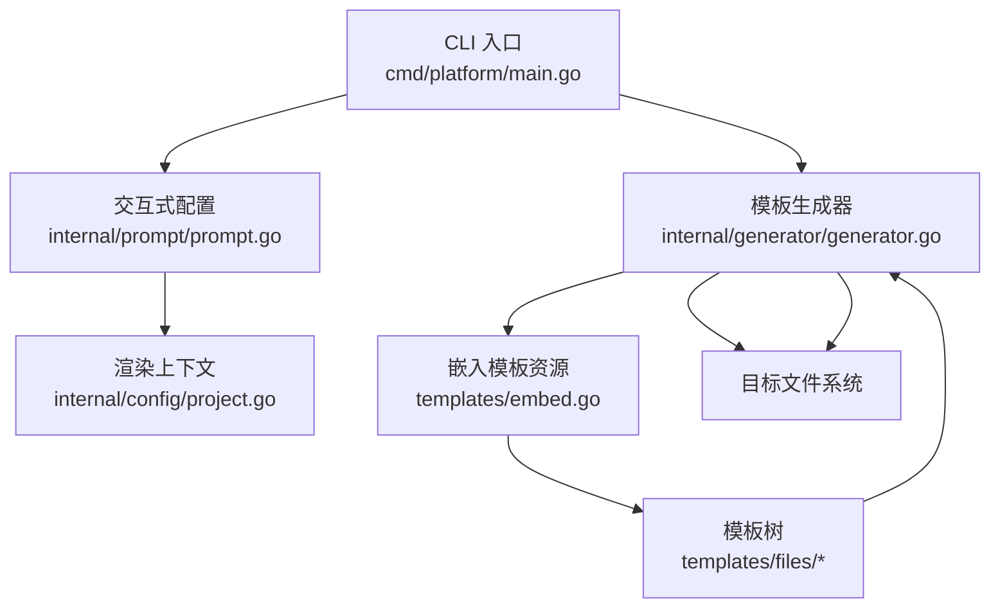
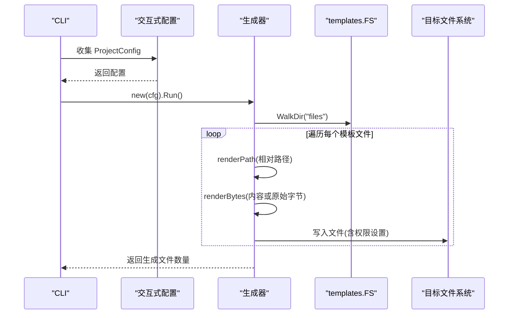
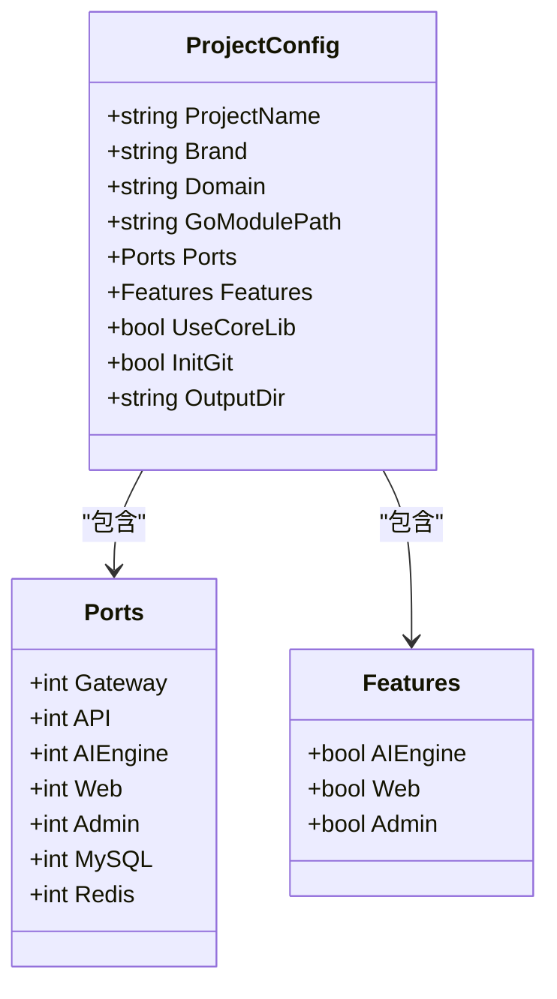
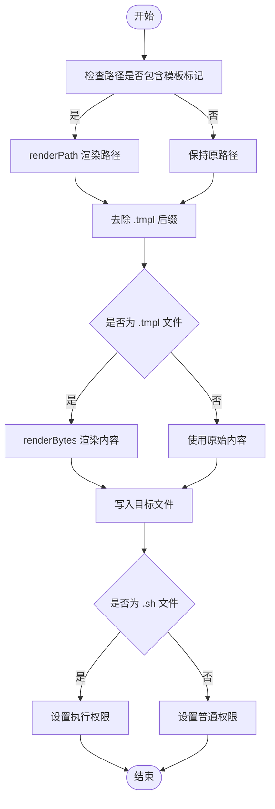
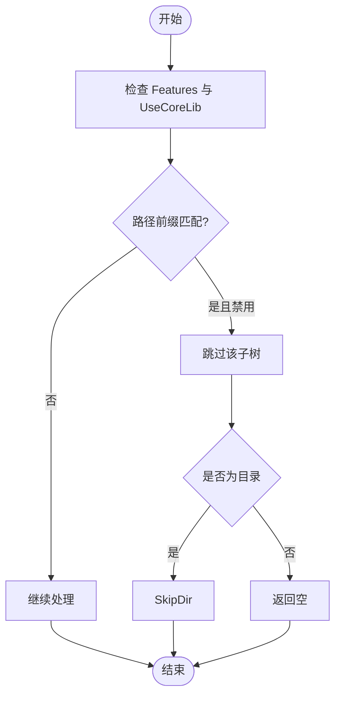
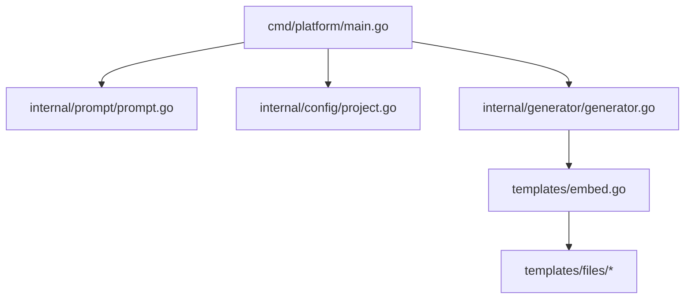

# 模板渲染机制

<cite>
**本文档引用的文件**
- [cmd/platform/main.go](file://cmd/platform/main.go)
- [internal/generator/generator.go](file://internal/generator/generator.go)
- [internal/config/project.go](file://internal/config/project.go)
- [internal/prompt/prompt.go](file://internal/prompt/prompt.go)
- [templates/embed.go](file://templates/embed.go)
- [README.md](file://README.md)
- [templates/files/README.md.tmpl](file://templates/files/README.md.tmpl)
- [templates/files/backend-api/go.mod.tmpl](file://templates/files/backend-api/go.mod.tmpl)
- [templates/files/frontend-web/package.json.tmpl](file://templates/files/frontend-web/package.json.tmpl)
</cite>

## 目录
1. [简介](#简介)
2. [项目结构](#项目结构)
3. [核心组件](#核心组件)
4. [架构总览](#架构总览)
5. [详细组件分析](#详细组件分析)
6. [依赖分析](#依赖分析)
7. [性能考虑](#性能考虑)
8. [故障排除指南](#故障排除指南)
9. [结论](#结论)

## 简介
本项目采用 Go 内置的 text/template 引擎，结合 embed.FS 将模板资源内嵌至二进制文件中，实现“所见即所得”的模板渲染。模板变量来源于统一的渲染上下文 ProjectConfig，支持：
- 变量替换：在文件路径与文件内容中进行占位符替换
- 条件渲染：通过模板条件指令按 Features 和 UseCoreLib 控制模块生成
- 循环处理：在模板中对集合进行迭代（示例中以注释形式体现）
- 路径渲染：文件路径本身也可包含模板变量，实现动态目录结构
- 输出格式化：根据文件类型设置权限与后缀处理

该机制保证了脚手架的自包含性与可移植性，并通过严格的模板修改原则确保模板的业务无关性与一致性。

## 项目结构
模板系统围绕以下关键文件组织：
- CLI 入口负责收集用户配置并触发生成流程
- 生成器负责遍历模板树、渲染路径与内容、写入磁盘
- 配置模块定义渲染上下文结构与默认值
- 模板资源通过 embed.FS 内嵌，模板目录位于 templates/files
- README 提供模板目录与修改原则说明

图表来源
- [cmd/platform/main.go:22-86](file://cmd/platform/main.go#L22-L86)
- [internal/prompt/prompt.go:13-104](file://internal/prompt/prompt.go#L13-L104)
- [internal/config/project.go:12-41](file://internal/config/project.go#L12-L41)
- [internal/generator/generator.go:33-102](file://internal/generator/generator.go#L33-L102)
- [templates/embed.go:6-11](file://templates/embed.go#L6-L11)

章节来源
- [README.md:59-98](file://README.md#L59-L98)
- [cmd/platform/main.go:22-86](file://cmd/platform/main.go#L22-L86)
- [internal/generator/generator.go:33-102](file://internal/generator/generator.go#L33-L102)
- [templates/embed.go:6-11](file://templates/embed.go#L6-L11)

## 核心组件
- 渲染上下文 ProjectConfig：承载所有模板变量，包括项目名、品牌名、域名、Go 模块路径、端口、功能开关、核心库开关与输出目录等
- 生成器 Generator：遍历模板树、渲染路径与内容、按 Features 进行模块过滤、写入磁盘
- 模板资源 templates.FS：通过 embed.FS 内嵌 templates/files 下的全部模板
- 交互式配置 prompt：收集用户输入并校验，形成 ProjectConfig

章节来源
- [internal/config/project.go:12-41](file://internal/config/project.go#L12-L41)
- [internal/generator/generator.go:23-31](file://internal/generator/generator.go#L23-L31)
- [templates/embed.go:6-11](file://templates/embed.go#L6-L11)
- [internal/prompt/prompt.go:13-104](file://internal/prompt/prompt.go#L13-L104)

## 架构总览
模板渲染的端到端流程如下：
- CLI 初始化命令，收集配置并验证
- 生成器创建并执行，遍历 templates.FS
- 对每个模板文件：
  - 渲染文件路径（含模板变量）
  - 剥除 .tmpl 后缀
  - 若为模板文件则渲染内容，否则直接使用原始内容
  - 写入目标目录，设置权限
- 通过 Features 控制子树跳过，实现条件渲染

图表来源
- [cmd/platform/main.go:48-81](file://cmd/platform/main.go#L48-L81)
- [internal/generator/generator.go:33-102](file://internal/generator/generator.go#L33-L102)
- [templates/embed.go:6-11](file://templates/embed.go#L6-L11)

## 详细组件分析

### 渲染上下文构建与数据绑定
- ProjectConfig 作为唯一数据源，传递给 text/template 的 Execute 方法
- 上下文字段覆盖项目命名规范、品牌展示、域名、Go 模块路径、端口集合、功能开关、核心库开关与输出目录
- 默认值与校验逻辑确保模板渲染的稳定性与合法性

图表来源
- [internal/config/project.go:12-59](file://internal/config/project.go#L12-L59)

章节来源
- [internal/config/project.go:61-106](file://internal/config/project.go#L61-L106)

### 模板变量替换与路径渲染
- 文件路径渲染：当路径包含模板标记时，使用 renderPath 对路径字符串进行渲染，从而实现动态目录结构
- 内容渲染：对 .tmpl 文件读取原始字节，调用 renderBytes 进行模板渲染
- 后缀处理：渲染后的路径自动去除 .tmpl 后缀，确保生成的文件名正确
- 权限设置：对 .sh 文件赋予执行权限，其他文件默认普通权限

图表来源
- [internal/generator/generator.go:62-98](file://internal/generator/generator.go#L62-L98)
- [internal/generator/generator.go:122-147](file://internal/generator/generator.go#L122-L147)

章节来源
- [internal/generator/generator.go:62-98](file://internal/generator/generator.go#L62-L98)
- [internal/generator/generator.go:122-147](file://internal/generator/generator.go#L122-L147)

### 条件渲染与模块过滤
- 通过 Features 与 UseCoreLib 控制子树跳过，实现按需生成
- skip 函数根据路径前缀判断是否跳过目录或文件
- 模板中使用条件指令控制模块的包含与排除

图表来源
- [internal/generator/generator.go:51-56](file://internal/generator/generator.go#L51-L56)
- [internal/generator/generator.go:105-120](file://internal/generator/generator.go#L105-L120)

章节来源
- [internal/generator/generator.go:105-120](file://internal/generator/generator.go#L105-L120)
- [templates/files/README.md.tmpl:38-74](file://templates/files/README.md.tmpl#L38-L74)

### 模板内容中的条件与循环示例
- 条件渲染：在 README.md.tmpl 中，通过条件指令按 Features 与 UseCoreLib 控制模块目录与启动命令的输出
- 循环处理：在模板中可通过内置 action 对集合进行迭代（示例以注释形式给出）

章节来源
- [templates/files/README.md.tmpl:38-74](file://templates/files/README.md.tmpl#L38-L74)

### 输出格式化与权限控制
- 路径后缀：.tmpl 自动去除，确保生成文件名正确
- 权限控制：.sh 文件赋予执行权限，其他文件默认普通权限
- 目录创建：在写入文件前确保父目录存在

章节来源
- [internal/generator/generator.go:67-98](file://internal/generator/generator.go#L67-L98)
- [internal/generator/generator.go:154-157](file://internal/generator/generator.go#L154-L157)

### 模板继承、宏定义与自定义函数
- 模板继承：通过子目录结构与条件渲染实现“继承”效果（例如 pkg-platform-core 的复用）
- 宏定义：未在现有实现中使用
- 自定义函数：未在现有实现中使用

章节来源
- [templates/files/backend-api/go.mod.tmpl:12-15](file://templates/files/backend-api/go.mod.tmpl#L12-L15)
- [README.md:87-94](file://README.md#L87-L94)

## 依赖分析
- CLI 依赖 prompt 与 config，生成器依赖 templates.FS 与 config
- 模板资源通过 embed.FS 内嵌，无需外部文件
- 生成器对模板树进行遍历，按规则渲染与写入

图表来源
- [cmd/platform/main.go:15-18](file://cmd/platform/main.go#L15-L18)
- [internal/generator/generator.go:19-21](file://internal/generator/generator.go#L19-L21)
- [templates/embed.go:10-11](file://templates/embed.go#L10-L11)

章节来源
- [cmd/platform/main.go:15-18](file://cmd/platform/main.go#L15-L18)
- [internal/generator/generator.go:19-21](file://internal/generator/generator.go#L19-L21)
- [templates/embed.go:10-11](file://templates/embed.go#L10-L11)

## 性能考虑
- 内嵌模板：通过 embed.FS 将模板内嵌至二进制，减少外部依赖与 I/O 开销
- 单次遍历：生成器对模板树进行一次遍历，避免重复扫描
- 按需渲染：仅对 .tmpl 文件进行内容渲染，非模板文件直接复制
- 条件跳过：通过 Features 与 UseCoreLib 跳过不必要的子树，减少渲染与写入

## 故障排除指南
- missingkey 错误：模板引擎在遇到缺失键时抛错，需确保 ProjectConfig 字段完整
- 路径渲染失败：检查路径中模板标记是否正确，确认 renderPath 的调用
- 权限问题：确认 .sh 文件后缀与 isExecutable 判定逻辑
- 模块未生成：检查 Features 与 UseCoreLib 设置，确认 skip 规则

章节来源
- [internal/generator/generator.go:137-147](file://internal/generator/generator.go#L137-L147)
- [internal/generator/generator.go:105-120](file://internal/generator/generator.go#L105-L120)
- [internal/generator/generator.go:154-157](file://internal/generator/generator.go#L154-L157)

## 结论
本模板渲染机制以 ProjectConfig 为核心，结合 text/template 与 embed.FS，实现了变量替换、条件渲染与路径渲染的统一处理。通过 Features 与 UseCoreLib 的组合，系统能够灵活地按需生成模块，满足多语言、多框架的脚手架需求。建议在扩展模板时遵循模板修改原则，确保模板的业务无关性与可维护性。