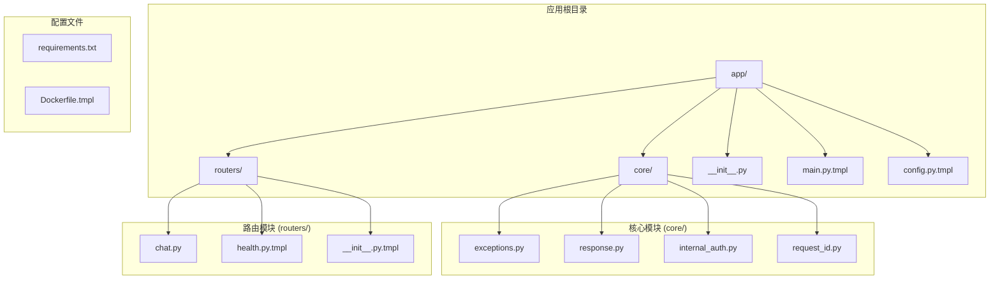
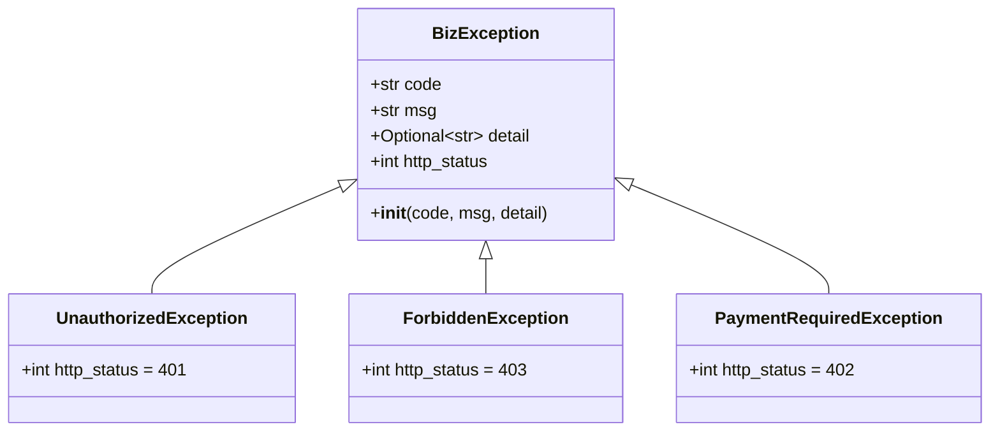
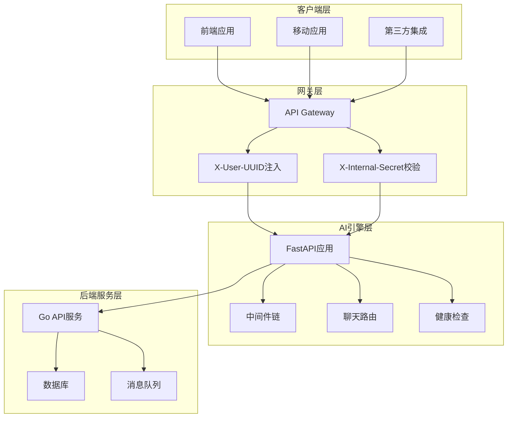
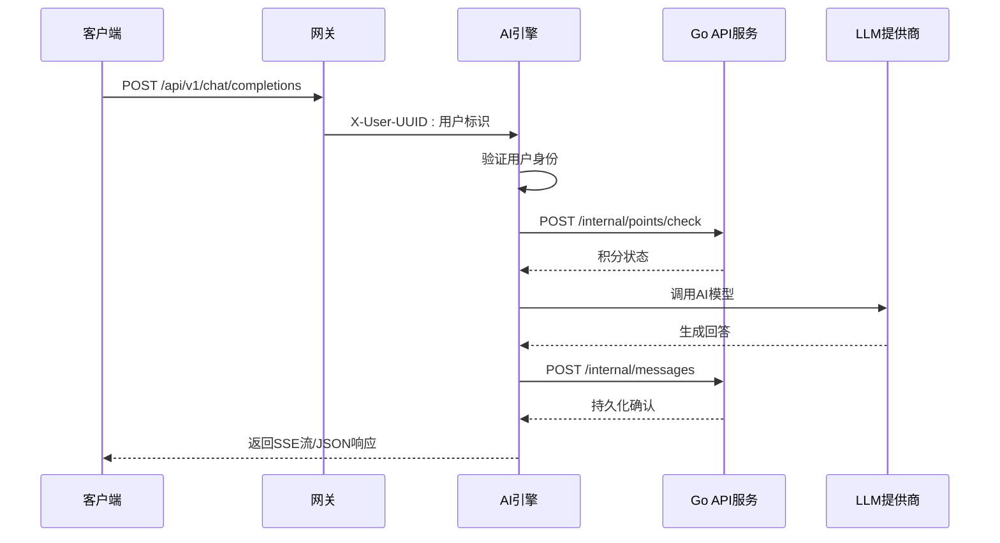
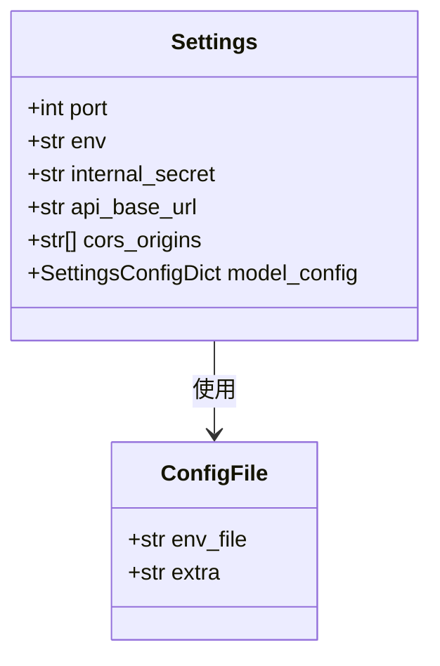
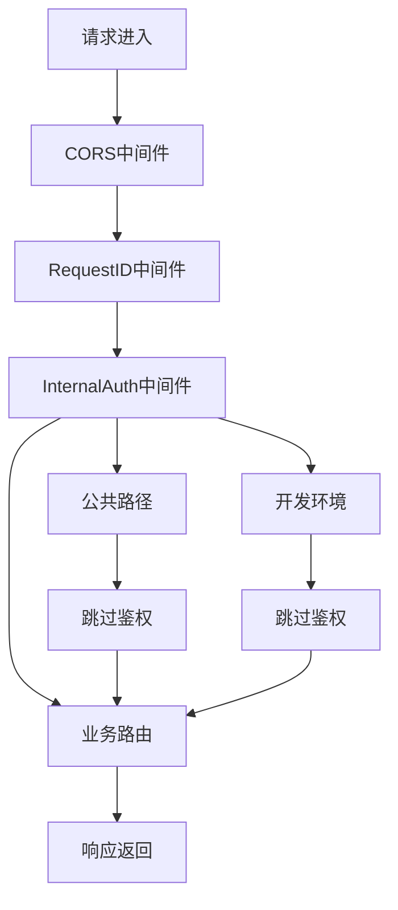
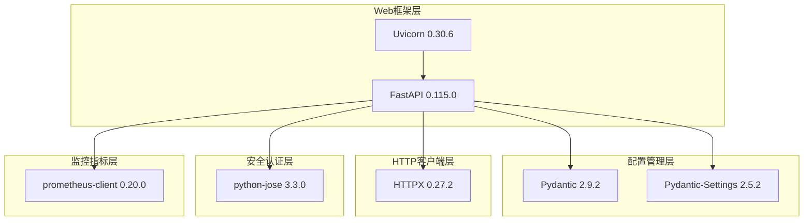
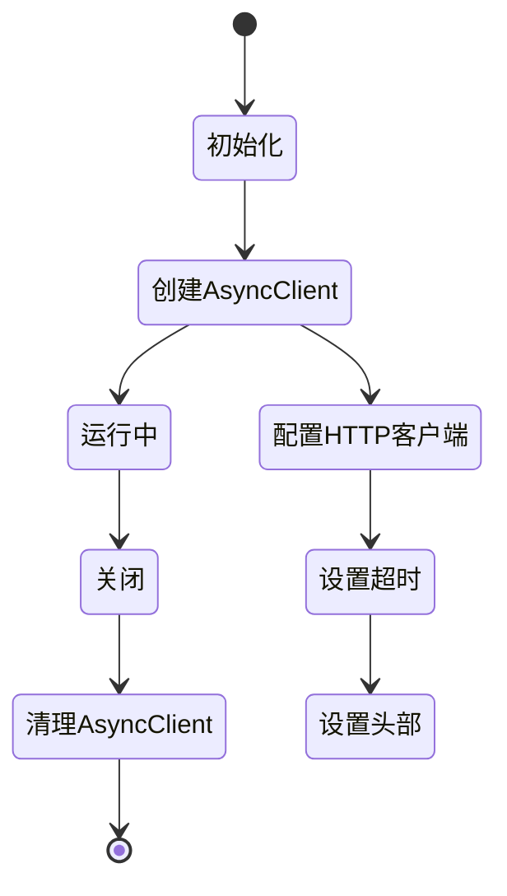

# AI引擎服务模板

<cite>
**本文档引用的文件**
- [app/core/exceptions.py](file://templates/files/backend-ai-engine/app/core/exceptions.py)
- [app/core/response.py](file://templates/files/backend-ai-engine/app/core/response.py)
- [app/core/internal_auth.py](file://templates/files/backend-ai-engine/app/core/internal_auth.py)
- [app/core/request_id.py](file://templates/files/backend-ai-engine/app/core/request_id.py)
- [app/routers/chat.py](file://templates/files/backend-ai-engine/app/routers/chat.py)
- [app/routers/health.py.tmpl](file://templates/files/backend-ai-engine/app/routers/health.py.tmpl)
- [app/routers/__init__.py.tmpl](file://templates/files/backend-ai-engine/app/routers/__init__.py.tmpl)
- [app/config.py.tmpl](file://templates/files/backend-ai-engine/app/config.py.tmpl)
- [app/main.py.tmpl](file://templates/files/backend-ai-engine/app/main.py.tmpl)
- [requirements.txt](file://templates/files/backend-ai-engine/requirements.txt)
- [Dockerfile.tmpl](file://templates/files/backend-ai-engine/Dockerfile.tmpl)
</cite>

## 目录
1. [简介](#简介)
2. [项目结构](#项目结构)
3. [核心组件](#核心组件)
4. [架构概览](#架构概览)
5. [详细组件分析](#详细组件分析)
6. [依赖分析](#依赖分析)
7. [性能考虑](#性能考虑)
8. [故障排除指南](#故障排除指南)
9. [结论](#结论)
10. [最佳实践指南](#最佳实践指南)

## 简介

AI引擎服务模板是一个基于Python的现代化AI服务架构模板，专为构建可扩展的AI引擎而设计。该模板采用FastAPI框架，提供了完整的异常处理体系、配置管理机制、中间件支持和容器化部署能力。

该模板的核心设计理念是"Python端只读"架构，通过网关层进行身份验证和授权，AI引擎专注于AI模型推理和响应生成。系统采用微服务架构，通过内部API与Go后端服务通信，确保了安全性和可维护性。

## 项目结构

AI引擎服务模板采用模块化的目录结构，每个模块都有明确的职责分工：

**图表来源**
- [app/main.py.tmpl:1-67](file://templates/files/backend-ai-engine/app/main.py.tmpl#L1-L67)
- [app/core/exceptions.py:1-31](file://templates/files/backend-ai-engine/app/core/exceptions.py#L1-L31)
- [app/routers/chat.py:1-28](file://templates/files/backend-ai-engine/app/routers/chat.py#L1-L28)

**章节来源**
- [app/main.py.tmpl:1-67](file://templates/files/backend-ai-engine/app/main.py.tmpl#L1-L67)
- [app/__init__.py:1-3](file://templates/files/backend-ai-engine/app/__init__.py#L1-L3)

## 核心组件

### 异常处理体系

AI引擎采用了统一的业务异常处理机制，与Go后端的errcode包保持一致的6位错误码格式。

**图表来源**
- [app/core/exceptions.py:9-31](file://templates/files/backend-ai-engine/app/core/exceptions.py#L9-L31)

### 统一响应格式

系统实现了标准化的响应格式，与Go后端的响应格式保持一致：

| 字段名 | 类型 | 描述 | 默认值 |
|--------|------|------|--------|
| code | string | 错误码/状态码 | "200" |
| msg | string | 消息描述 | "OK" |
| data | any | 响应数据 | null |

**章节来源**
- [app/core/response.py:7-19](file://templates/files/backend-ai-engine/app/core/response.py#L7-L19)

## 架构概览

AI引擎服务采用分层架构设计，通过网关层进行统一的身份验证和流量管理：

**图表来源**
- [app/main.py.tmpl:3-12](file://templates/files/backend-ai-engine/app/main.py.tmpl#L3-L12)
- [app/routers/chat.py:3-7](file://templates/files/backend-ai-engine/app/routers/chat.py#L3-L7)

## 详细组件分析

### 聊天机器人路由实现

聊天路由遵循"Python端只读"的设计原则，所有写操作都委托给Go API服务：

**图表来源**
- [app/routers/chat.py:13-27](file://templates/files/backend-ai-engine/app/routers/chat.py#L13-L27)

**章节来源**
- [app/routers/chat.py:1-28](file://templates/files/backend-ai-engine/app/routers/chat.py#L1-L28)

### 配置管理机制

系统采用Pydantic Settings进行配置管理，支持环境变量和模板变量：

**图表来源**
- [app/config.py.tmpl:9-31](file://templates/files/backend-ai-engine/app/config.py.tmpl#L9-L31)

**章节来源**
- [app/config.py.tmpl:1-31](file://templates/files/backend-ai-engine/app/config.py.tmpl#L1-L31)

### 中间件架构

AI引擎实现了多层中间件，确保系统的安全性、可观测性和性能：

**图表来源**
- [app/main.py.tmpl:39-63](file://templates/files/backend-ai-engine/app/main.py.tmpl#L39-L63)
- [app/core/internal_auth.py:16-34](file://templates/files/backend-ai-engine/app/core/internal_auth.py#L16-L34)

**章节来源**
- [app/core/internal_auth.py:1-34](file://templates/files/backend-ai-engine/app/core/internal_auth.py#L1-L34)
- [app/core/request_id.py:1-31](file://templates/files/backend-ai-engine/app/core/request_id.py#L1-L31)

## 依赖分析

### 核心依赖关系

AI引擎服务的依赖关系清晰且职责明确：

**图表来源**
- [requirements.txt:1-8](file://templates/files/backend-ai-engine/requirements.txt#L1-L8)

**章节来源**
- [requirements.txt:1-8](file://templates/files/backend-ai-engine/requirements.txt#L1-L8)

### 应用生命周期管理

AI引擎使用FastAPI的lifespan机制管理应用生命周期：

**图表来源**
- [app/main.py.tmpl:27-36](file://templates/files/backend-ai-engine/app/main.py.tmpl#L27-L36)

**章节来源**
- [app/main.py.tmpl:27-36](file://templates/files/backend-ai-engine/app/main.py.tmpl#L27-L36)

## 性能考虑

### 连接池优化

AI引擎通过AsyncClient实现连接复用，提高HTTP请求性能：

- **连接复用**：单个AsyncClient实例在应用生命周期内复用连接
- **超时配置**：30秒超时设置，平衡响应速度和稳定性
- **头部缓存**：内部API密钥通过头部缓存避免重复计算

### 缓存策略

系统采用LRU缓存优化配置读取性能：

- **配置缓存**：`@lru_cache`装饰器缓存Settings实例
- **内存效率**：缓存大小限制，避免内存泄漏
- **线程安全**：缓存操作线程安全

### 监控指标

内置Prometheus指标收集，便于性能监控：

- **健康检查**：`/health`端点提供服务状态
- **指标导出**：`/metrics`端点导出标准指标格式
- **自定义指标**：支持添加业务相关的性能指标

## 故障排除指南

### 常见问题诊断

| 问题类型 | 症状 | 可能原因 | 解决方案 |
|----------|------|----------|----------|
| 认证失败 | 403 Forbidden | X-Internal-Secret不匹配 | 检查INTERNAL_API_SECRET配置 |
| 身份验证失败 | 401 Unauthorized | X-User-UUID缺失 | 确认网关正确注入用户标识 |
| 连接超时 | HTTP 504/502 | 后端服务不可达 | 检查API_BASE_URL配置 |
| 配置错误 | 应用启动失败 | 环境变量缺失 | 验证.env文件配置 |

### 日志追踪

系统通过RequestID中间件实现请求追踪：

- **请求ID生成**：未提供X-Request-ID时自动生成UUID
- **上下文传递**：使用ContextVar在请求生命周期内传递ID
- **响应头输出**：确保客户端可以关联请求和响应

**章节来源**
- [app/core/request_id.py:17-31](file://templates/files/backend-ai-engine/app/core/request_id.py#L17-L31)

## 结论

AI引擎服务模板提供了一个完整、可扩展的AI服务架构基础。其设计特点包括：

- **安全优先**：通过网关层实现统一的身份验证和授权
- **性能优化**：连接复用、缓存策略和监控指标
- **可维护性**：清晰的模块划分和标准化的异常处理
- **可扩展性**：插件化的中间件架构和灵活的配置管理

该模板为构建企业级AI服务提供了坚实的基础，开发者可以根据具体需求进行定制和扩展。

## 最佳实践指南

### AI模型集成模式

1. **异步调用**：使用AsyncClient进行非阻塞的AI模型调用
2. **流式响应**：实现SSE流式响应提升用户体验
3. **错误重试**：实现指数退避的重试机制
4. **成本控制**：通过积分系统控制AI调用频率

### 实时通信处理

1. **SSE实现**：使用Server-Sent Events实现实时流式响应
2. **WebSocket支持**：对于双向通信场景考虑WebSocket
3. **心跳检测**：实现客户端心跳保持连接活跃
4. **断线重连**：提供自动断线重连机制

### 会话管理

1. **用户标识**：通过X-User-UUID确保用户会话一致性
2. **上下文保存**：在内存或Redis中保存对话上下文
3. **超时清理**：实现会话超时自动清理机制
4. **并发控制**：限制单用户并发会话数量

### 响应优化

1. **内容压缩**：启用Gzip压缩减少传输体积
2. **缓存策略**：对静态内容和重复查询结果进行缓存
3. **CDN集成**：通过CDN加速静态资源分发
4. **预加载机制**：实现智能预加载提升响应速度

### 第三方API集成

1. **统一适配器**：创建统一的API适配器接口
2. **配置管理**：通过环境变量管理不同提供商的配置
3. **监控告警**：实现第三方服务可用性监控
4. **降级策略**：实现服务降级和故障转移机制

### 扩展代码示例

以下是一些关键扩展点的实现思路：

**AI模型调用示例**：
- 在chat.py中实现具体的LLM调用逻辑
- 添加模型参数配置和温度控制
- 实现流式响应处理

**内部API调用示例**：
- 在main.py中配置AsyncClient
- 实现积分检查和消息持久化
- 添加错误处理和重试机制

**中间件扩展示例**：
- 创建自定义中间件处理特定需求
- 实现速率限制和防刷机制
- 添加审计日志记录

这些最佳实践确保了AI引擎服务的稳定性、性能和可维护性，为构建高质量的AI应用提供了可靠的技术基础。