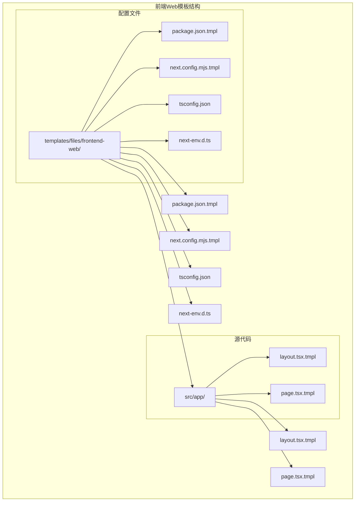
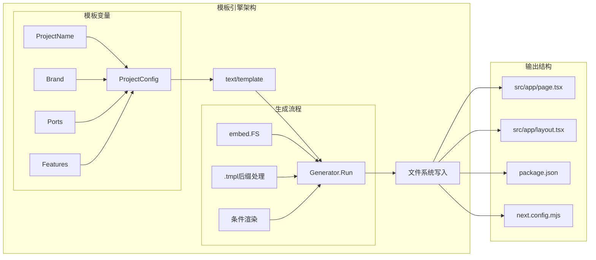
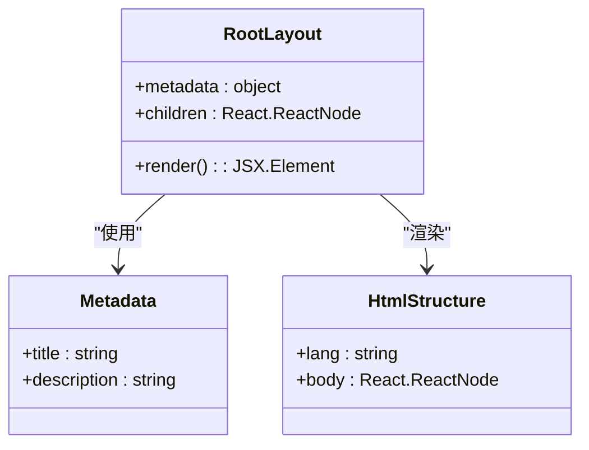
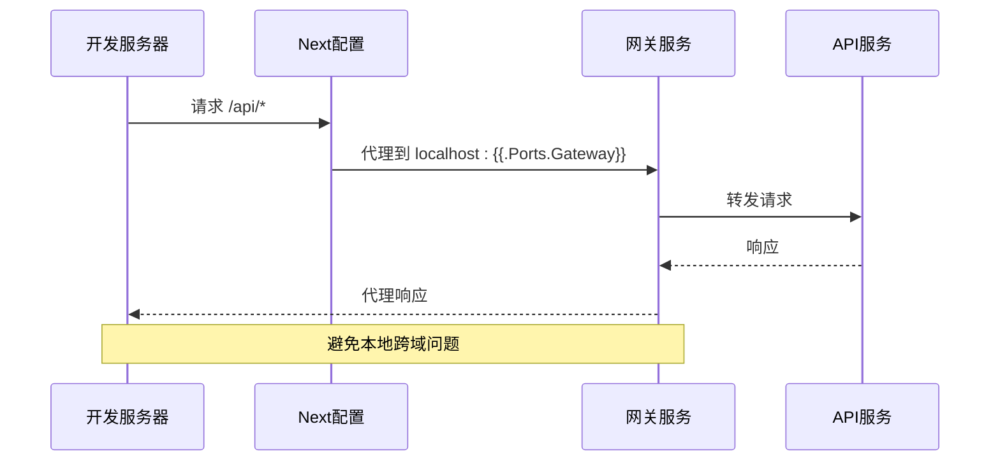
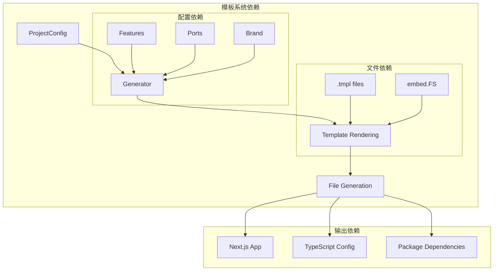

# 前端Web应用模板

<cite>
**本文档中引用的文件**
- [page.tsx.tmpl](file://templates/files/frontend-web/src/app/page.tsx.tmpl)
- [layout.tsx.tmpl](file://templates/files/frontend-web/src/app/layout.tsx.tmpl)
- [package.json.tmpl](file://templates/files/frontend-web/package.json.tmpl)
- [next.config.mjs.tmpl](file://templates/files/frontend-web/next.config.mjs.tmpl)
- [tsconfig.json](file://templates/files/frontend-web/tsconfig.json)
- [next-env.d.ts](file://templates/files/frontend-web/next-env.d.ts)
- [generator.go](file://internal/generator/generator.go)
- [project.go](file://internal/config/project.go)
- [README.md](file://README.md)
</cite>

## 目录
1. [简介](#简介)
2. [项目结构](#项目结构)
3. [核心组件](#核心组件)
4. [架构概览](#架构概览)
5. [详细组件分析](#详细组件分析)
6. [依赖关系分析](#依赖关系分析)
7. [性能考虑](#性能考虑)
8. [故障排除指南](#故障排除指南)
9. [结论](#结论)

## 简介

这是一个基于Next.js 15的现代前端Web应用模板，专为平台级项目设计。该模板采用模板引擎驱动的脚手架系统，提供了完整的前端开发环境配置，包括TypeScript集成、现代化构建工具、开发服务器配置和生产优化设置。

该模板的核心特点包括：
- 基于Next.js App Router的现代化路由系统
- 完整的TypeScript类型安全配置
- 开发期代理配置以避免跨域问题
- 可定制的品牌名称和端口配置
- 支持AI引擎功能的条件渲染

## 项目结构

前端Web应用模板位于`templates/files/frontend-web/`目录下，采用标准的Next.js 15项目结构：



**图表来源**
- [page.tsx.tmpl:1-18](file://templates/files/frontend-web/src/app/page.tsx.tmpl#L1-L18)
- [layout.tsx.tmpl:1-13](file://templates/files/frontend-web/src/app/layout.tsx.tmpl#L1-L13)
- [package.json.tmpl:1-25](file://templates/files/frontend-web/package.json.tmpl#L1-L25)

**章节来源**
- [README.md:35-42](file://README.md#L35-L42)
- [project.go:12-41](file://internal/config/project.go#L12-L41)

## 核心组件

### 应用页面组件 (src/app/page.tsx.tmpl)

页面组件是Next.js应用的根组件，负责渲染主页内容。该组件采用了模板变量系统，支持动态配置品牌名称和端口信息。

主要特性：
- 使用模板变量`{{.Brand}}`显示品牌名称
- 条件渲染AI引擎端点（当启用AI功能时）
- 动态端口配置支持
- 简洁的样式定义

### 布局组件 (src/app/layout.tsx.tmpl)

布局组件定义了整个应用的HTML结构和元数据。它提供了全局的页面标题和描述配置。

关键功能：
- 全局元数据配置（title和description）
- HTML语言设置（lang="en"）
- 子组件树渲染
- 标准的Next.js布局结构

### 包配置 (package.json.tmpl)

包配置文件定义了项目依赖和脚本命令，支持模板变量注入。

依赖管理：
- Next.js 15.0.0（核心框架）
- React 19.0.0（UI库）
- React DOM 19.0.0（DOM绑定）
- TypeScript 5.6.0（类型系统）
- ESLint 9（代码质量）

脚本命令：
- 开发服务器启动
- 生产构建
- 生产服务器启动
- 代码检查

**章节来源**
- [page.tsx.tmpl:1-18](file://templates/files/frontend-web/src/app/page.tsx.tmpl#L1-L18)
- [layout.tsx.tmpl:1-13](file://templates/files/frontend-web/src/app/layout.tsx.tmpl#L1-L13)
- [package.json.tmpl:1-25](file://templates/files/frontend-web/package.json.tmpl#L1-L25)

## 架构概览

该模板采用模板引擎驱动的脚手架架构，通过Go语言的embed功能将所有模板文件嵌入到二进制中，实现了自包含的CLI工具。



**图表来源**
- [generator.go:33-103](file://internal/generator/generator.go#L33-L103)
- [project.go:12-41](file://internal/config/project.go#L12-L41)

**章节来源**
- [generator.go:1-158](file://internal/generator/generator.go#L1-L158)
- [project.go:1-121](file://internal/config/project.go#L1-L121)

## 详细组件分析

### 页面组件详细分析

页面组件采用了简洁的设计模式，通过模板变量实现动态内容渲染：

```mermaid
flowchart TD
A[页面组件加载] --> B[解析模板变量]
B --> C[{{.Brand}}品牌名称]
B --> D[{{.Ports}}端口配置]
B --> E[{{.Features}}功能开关]
C --> F[渲染品牌标题]
D --> G[渲染服务端点]
E --> H{AI引擎启用?}
H --> |是| I[渲染AI端点]
H --> |否| J[跳过AI端点]
F --> K[最终页面渲染]
G --> K
I --> K
J --> K
```

**图表来源**
- [page.tsx.tmpl:6-14](file://templates/files/frontend-web/src/app/page.tsx.tmpl#L6-L14)

### 布局组件详细分析

布局组件遵循Next.js的标准约定，提供了全局的页面结构：



**图表来源**
- [layout.tsx.tmpl:1-13](file://templates/files/frontend-web/src/app/layout.tsx.tmpl#L1-L13)

### 构建配置分析

Next.js配置文件提供了开发期的代理设置和严格模式配置：



**图表来源**
- [next.config.mjs.tmpl:4-9](file://templates/files/frontend-web/next.config.mjs.tmpl#L4-L9)

**章节来源**
- [page.tsx.tmpl:1-18](file://templates/files/frontend-web/src/app/page.tsx.tmpl#L1-L18)
- [layout.tsx.tmpl:1-13](file://templates/files/frontend-web/src/app/layout.tsx.tmpl#L1-L13)
- [next.config.mjs.tmpl:1-13](file://templates/files/frontend-web/next.config.mjs.tmpl#L1-L13)

## 依赖关系分析

模板系统采用分层依赖关系，确保各组件之间的松耦合：



**图表来源**
- [generator.go:105-120](file://internal/generator/generator.go#L105-L120)
- [project.go:54-59](file://internal/config/project.go#L54-L59)

**章节来源**
- [generator.go:105-120](file://internal/generator/generator.go#L105-L120)
- [project.go:54-59](file://internal/config/project.go#L54-L59)

## 性能考虑

该模板在多个层面考虑了性能优化：

### 构建性能
- 使用Next.js 15的内置优化
- TypeScript增量编译支持
- Bundler模块解析优化

### 开发体验
- React Strict Mode启用
- 开发期代理避免CORS问题
- 即时热重载支持

### 运行时性能
- 模板变量预编译
- 条件渲染减少不必要的组件
- 最小化的依赖树

## 故障排除指南

### 常见问题及解决方案

1. **模板变量未正确渲染**
   - 检查ProjectConfig中的变量定义
   - 确保模板文件使用正确的语法

2. **端口冲突**
   - 修改ports配置中的端口号
   - 确保端口在可用范围内

3. **功能开关问题**
   - 检查Features配置
   - 确认条件渲染逻辑

4. **TypeScript类型错误**
   - 更新tsconfig.json配置
   - 检查类型声明文件

**章节来源**
- [generator.go:92-103](file://internal/generator/generator.go#L92-L103)
- [project.go:91-106](file://internal/config/project.go#L91-L106)

## 结论

这个基于Next.js的前端Web应用模板提供了一个完整的、可定制的现代化前端开发环境。通过模板引擎驱动的方式，它实现了高度的灵活性和可维护性。

主要优势包括：
- 自包含的CLI工具，无需外部依赖
- 完整的TypeScript集成
- 灵活的功能开关机制
- 标准化的项目结构
- 丰富的配置选项

该模板适合需要快速搭建现代化Web应用的团队，特别是那些需要与Go后端服务集成的项目。通过合理的配置和扩展，可以轻松适应各种业务需求。