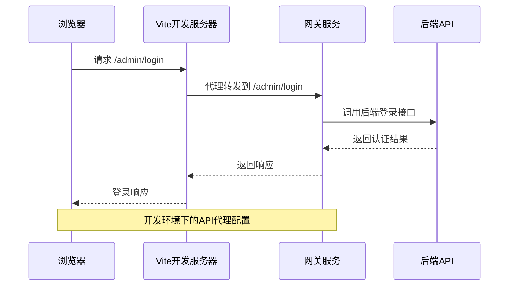
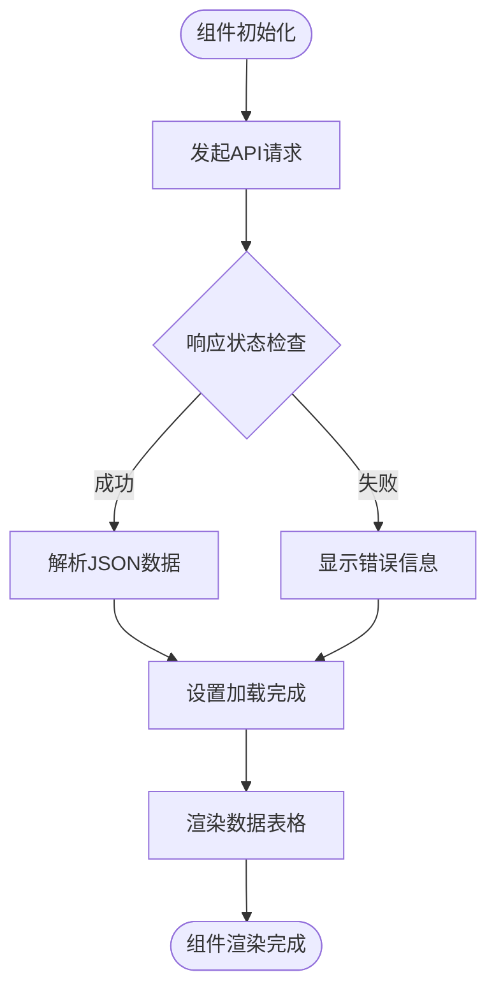
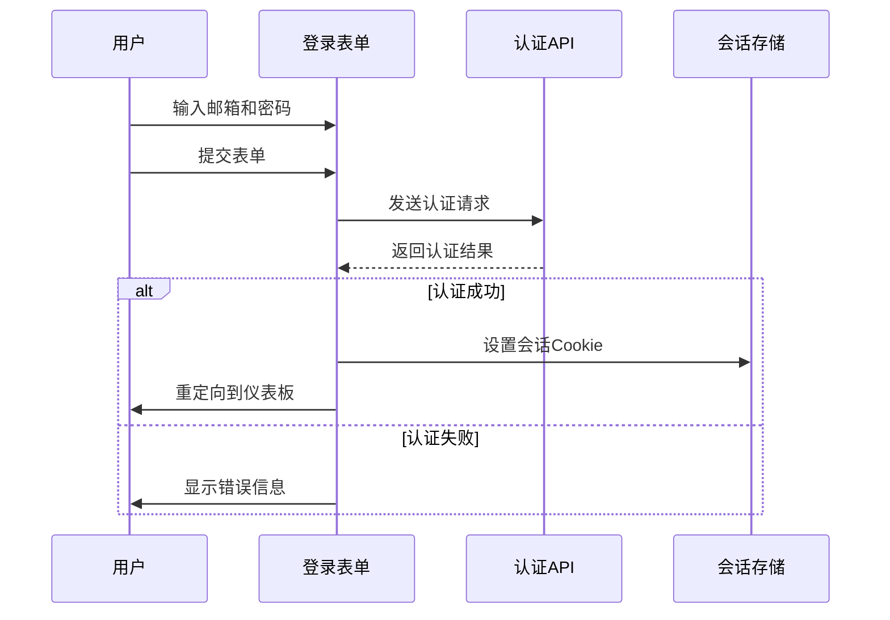

# 前端管理面板模板

<cite>
**本文档引用的文件**
- [Dashboard.tsx.tmpl](file://templates/files/frontend-admin/src/pages/Dashboard.tsx.tmpl)
- [Login.tsx.tmpl](file://templates/files/frontend-admin/src/pages/Login.tsx.tmpl)
- [main.tsx](file://templates/files/frontend-admin/src/main.tsx)
- [vite.config.ts.tmpl](file://templates/files/frontend-admin/vite.config.ts.tmpl)
- [package.json.tmpl](file://templates/files/frontend-admin/package.json.tmpl)
- [index.html.tmpl](file://templates/files/frontend-admin/index.html.tmpl)
- [tsconfig.json](file://templates/files/frontend-admin/tsconfig.json)
- [init.sql.tmpl](file://templates/files/database/init.sql.tmpl)
</cite>

## 目录
1. [简介](#简介)
2. [项目结构](#项目结构)
3. [核心组件](#核心组件)
4. [架构概览](#架构概览)
5. [详细组件分析](#详细组件分析)
6. [依赖关系分析](#依赖关系分析)
7. [性能考虑](#性能考虑)
8. [故障排除指南](#故障排除指南)
9. [结论](#结论)

## 简介

本项目是一个基于React的前端管理面板模板，提供了完整的管理后台解决方案。该模板采用现代化的开发工具链，包括Vite构建工具、TypeScript类型系统和React Router路由管理。项目设计为可扩展的模板系统，支持通过模板变量进行定制化配置。

该项目的核心特色包括：
- 基于React的现代化前端架构
- 内置的认证系统和权限管理
- 开发服务器代理配置
- 可定制的品牌和端口配置
- 数据表格展示功能

## 项目结构

前端管理面板模板采用清晰的目录结构，主要包含以下关键文件：

```mermaid
graph TB
subgraph "前端管理面板"
A[src/] --> B[pages/]
A --> C[main.tsx]
B --> D[Dashboard.tsx.tmpl]
B --> E[Login.tsx.tmpl]
F[vite.config.ts.tmpl] --> G[开发服务器配置]
H[package.json.tmpl] --> I[依赖管理]
J[index.html.tmpl] --> K[入口HTML]
L[tsconfig.json] --> M[TypeScript配置]
end
subgraph "后端集成"
N[/admin API] --> O[登录接口]
N --> P[用户查询接口]
Q[/api API] --> R[业务接口]
end
D --> N
E --> O
F --> Q
```

**图表来源**
- [main.tsx:1-18](file://templates/files/frontend-admin/src/main.tsx#L1-L18)
- [vite.config.ts.tmpl:1-14](file://templates/files/frontend-admin/vite.config.ts.tmpl#L1-L14)

**章节来源**
- [main.tsx:1-18](file://templates/files/frontend-admin/src/main.tsx#L1-L18)
- [package.json.tmpl:1-24](file://templates/files/frontend-admin/package.json.tmpl#L1-L24)

## 核心组件

### 路由系统

应用使用React Router进行页面导航管理，提供简洁的路由配置：

- **根路径** (`/`)：重定向到 `/dashboard`
- **登录页面** (`/login`)：管理员登录界面
- **仪表板** (`/dashboard`)：主管理界面

### 认证机制

系统实现了基础的管理员认证流程，支持邮箱和密码验证，并通过HTTP Cookie进行会话管理。

**章节来源**
- [main.tsx:7-17](file://templates/files/frontend-admin/src/main.tsx#L7-L17)
- [Login.tsx.tmpl:8-23](file://templates/files/frontend-admin/src/pages/Login.tsx.tmpl#L8-L23)

## 架构概览

该管理面板采用前后端分离架构，通过Vite开发服务器进行本地开发和代理转发。



**图表来源**
- [vite.config.ts.tmpl:6-12](file://templates/files/frontend-admin/vite.config.ts.tmpl#L6-L12)
- [Login.tsx.tmpl:11-22](file://templates/files/frontend-admin/src/pages/Login.tsx.tmpl#L11-L22)

## 详细组件分析

### 仪表板组件 (Dashboard.tsx.tmpl)

仪表板组件是管理界面的核心，负责展示用户数据和系统状态。

#### 数据结构设计

组件定义了标准的用户接口，包含以下字段：
- `uuid`: 用户唯一标识符
- `email`: 用户邮箱地址
- `nickname`: 用户昵称（可选）
- `memberLevel`: 会员等级

#### 生命周期管理

使用React的`useEffect`钩子处理异步数据加载：
- 组件挂载时自动发起用户数据请求
- 使用`credentials: "include"`确保Cookie传递
- 错误处理和加载状态管理

#### 数据展示逻辑



**图表来源**
- [Dashboard.tsx.tmpl:14-24](file://templates/files/frontend-admin/src/pages/Dashboard.tsx.tmpl#L14-L24)
- [Dashboard.tsx.tmpl:26-55](file://templates/files/frontend-admin/src/pages/Dashboard.tsx.tmpl#L26-L55)

**章节来源**
- [Dashboard.tsx.tmpl:1-59](file://templates/files/frontend-admin/src/pages/Dashboard.tsx.tmpl#L1-L59)

### 登录页面组件 (Login.tsx.tmpl)

登录组件实现了完整的认证流程，包括表单验证和错误处理。

#### 表单状态管理

使用React状态钩子管理登录表单：
- `email`: 邮箱输入状态
- `password`: 密码输入状态  
- `err`: 错误信息状态

#### 认证流程



**图表来源**
- [Login.tsx.tmpl:8-23](file://templates/files/frontend-admin/src/pages/Login.tsx.tmpl#L8-L23)

**章节来源**
- [Login.tsx.tmpl:1-63](file://templates/files/frontend-admin/src/pages/Login.tsx.tmpl#L1-L63)

### 主入口文件 (main.tsx)

应用的主入口文件配置了完整的路由系统和页面组件。

#### 路由配置

- **根路由** (`/`)：使用`Navigate`组件重定向到 `/dashboard`
- **登录路由** (`/login`)：渲染登录页面组件
- **仪表板路由** (`/dashboard`)：渲染仪表板组件

#### 渲染结构

应用采用React Strict Mode包装，确保开发时的严格模式检查。

**章节来源**
- [main.tsx:1-18](file://templates/files/frontend-admin/src/main.tsx#L1-L18)

## 依赖关系分析

### 构建工具链

项目使用现代化的前端构建工具链：

```mermaid
graph LR
subgraph "构建工具"
A[Vite] --> B[TypeScript编译]
A --> C[React插件]
end
subgraph "运行时依赖"
D[React ^19.0.0] --> E[React DOM ^19.0.0]
F[React Router DOM ^6.27.0] --> G[路由管理]
end
subgraph "开发依赖"
H[@vitejs/plugin-react] --> I[React热重载]
J[@types/react] --> K[类型定义]
L[typescript ^5.6.0] --> M[类型检查]
end
```

**图表来源**
- [package.json.tmpl:11-22](file://templates/files/frontend-admin/package.json.tmpl#L11-L22)

### 开发服务器配置

Vite配置支持热重载和API代理功能：

- **端口配置**：通过模板变量`{{.Ports.Admin}}`动态设置
- **代理规则**：
  - `/admin` → `http://localhost:{{.Ports.Gateway}}`
  - `/api` → `http://localhost:{{.Ports.Gateway}}`
- **插件支持**：React开发插件提供热重载功能

**章节来源**
- [vite.config.ts.tmpl:1-14](file://templates/files/frontend-admin/vite.config.ts.tmpl#L1-L14)
- [package.json.tmpl:6-10](file://templates/files/frontend-admin/package.json.tmpl#L6-L10)

## 性能考虑

### 构建优化

- **Tree Shaking**：Vite默认启用模块树摇优化
- **代码分割**：按需加载路由组件
- **TypeScript编译**：在构建阶段进行类型检查和代码转换

### 运行时优化

- **React Strict Mode**：开发时的额外检查
- **状态管理**：使用React内置的状态钩子
- **内存管理**：组件卸载时自动清理副作用

## 故障排除指南

### 常见问题

#### API代理配置问题

**症状**：登录或数据加载失败
**解决方案**：
1. 检查网关服务是否启动
2. 验证端口配置是否正确
3. 确认CORS设置

#### 认证失败

**症状**：登录页面显示错误信息
**解决方案**：
1. 验证管理员账户是否存在
2. 检查密码是否正确
3. 确认数据库连接正常

#### 类型错误

**症状**：TypeScript编译错误
**解决方案**：
1. 检查TypeScript版本兼容性
2. 验证类型定义文件完整性
3. 确认模块解析配置

**章节来源**
- [vite.config.ts.tmpl:6-12](file://templates/files/frontend-admin/vite.config.ts.tmpl#L6-L12)
- [Login.tsx.tmpl:18-20](file://templates/files/frontend-admin/src/pages/Login.tsx.tmpl#L18-L20)

## 结论

该前端管理面板模板提供了一个完整且可扩展的管理后台解决方案。虽然当前实现相对简化，但具备良好的扩展基础：

### 已实现特性
- 完整的React应用架构
- 基础的认证和授权机制
- 现代化的开发工具链
- 灵活的模板配置系统

### 扩展建议
1. **集成React Admin**：添加丰富的UI组件库
2. **增强数据可视化**：集成图表库如Recharts或Chart.js
3. **完善权限系统**：基于角色的访问控制(RBAC)
4. **国际化支持**：添加多语言切换功能
5. **表单管理**：实现复杂的CRUD操作界面

该模板为构建企业级管理后台提供了坚实的基础，通过适当的扩展可以满足大多数管理系统的功能需求。