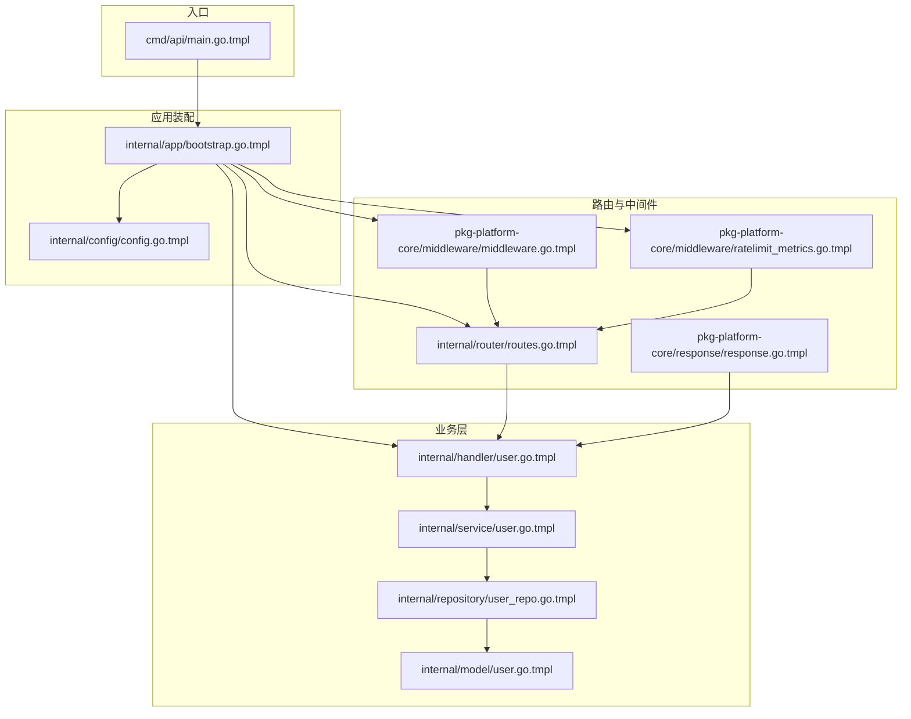
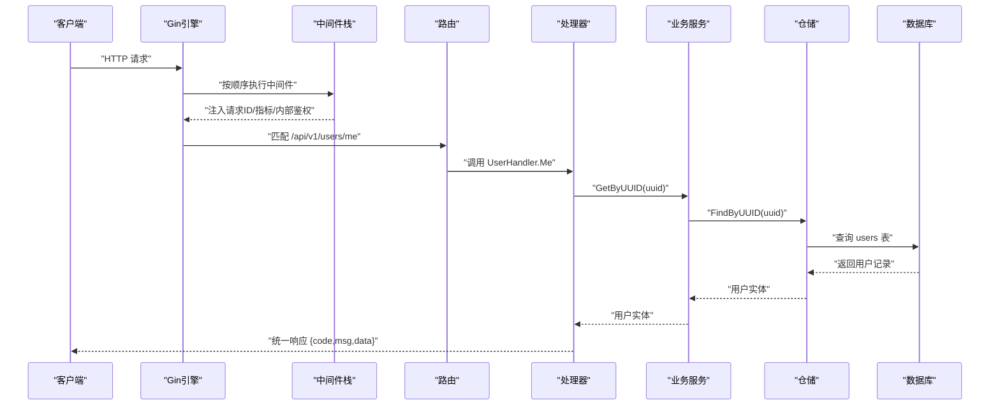
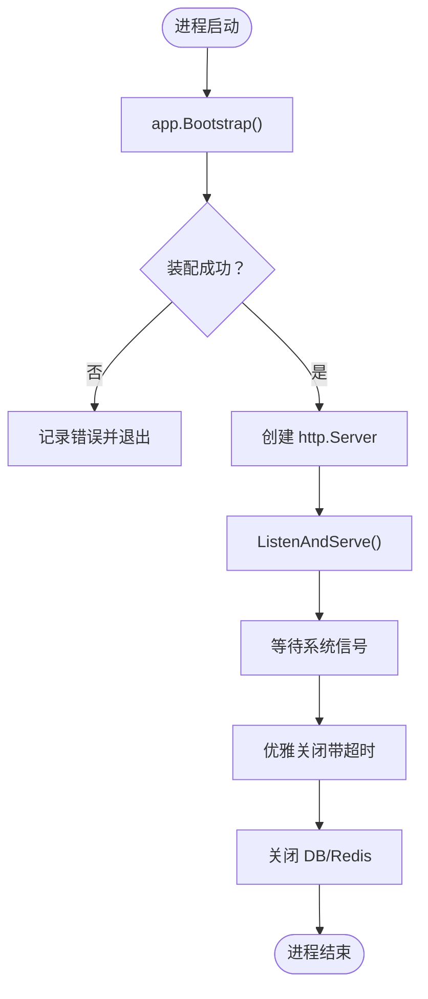
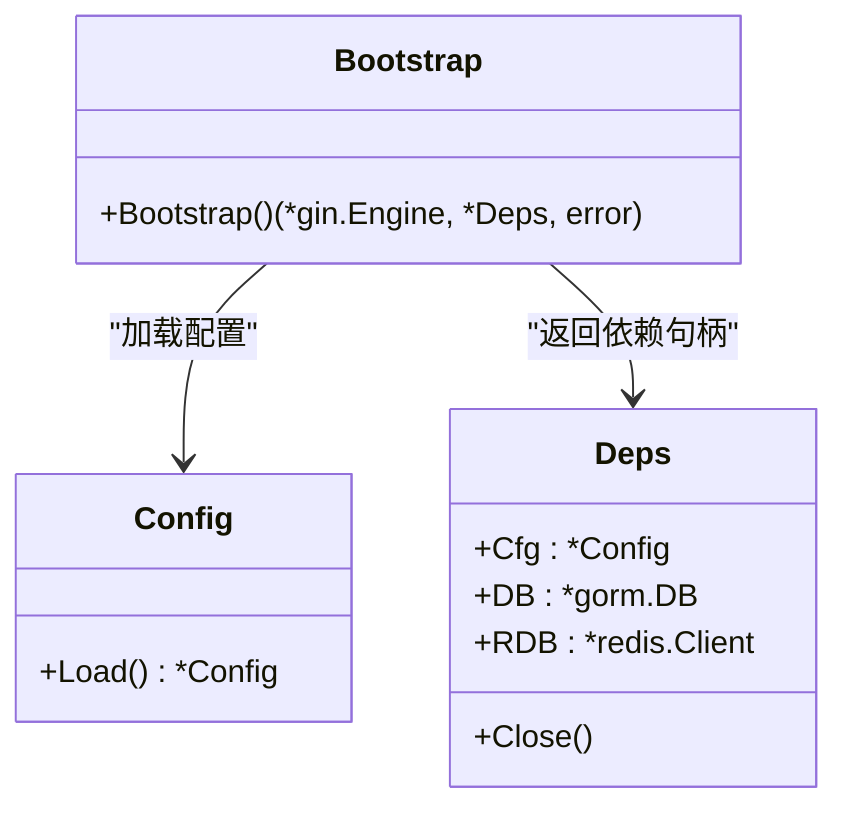
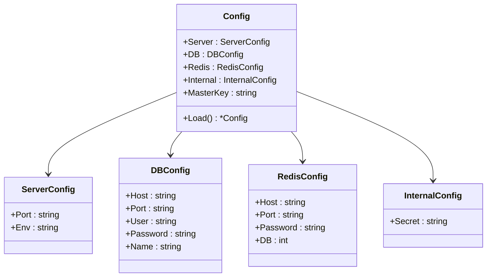
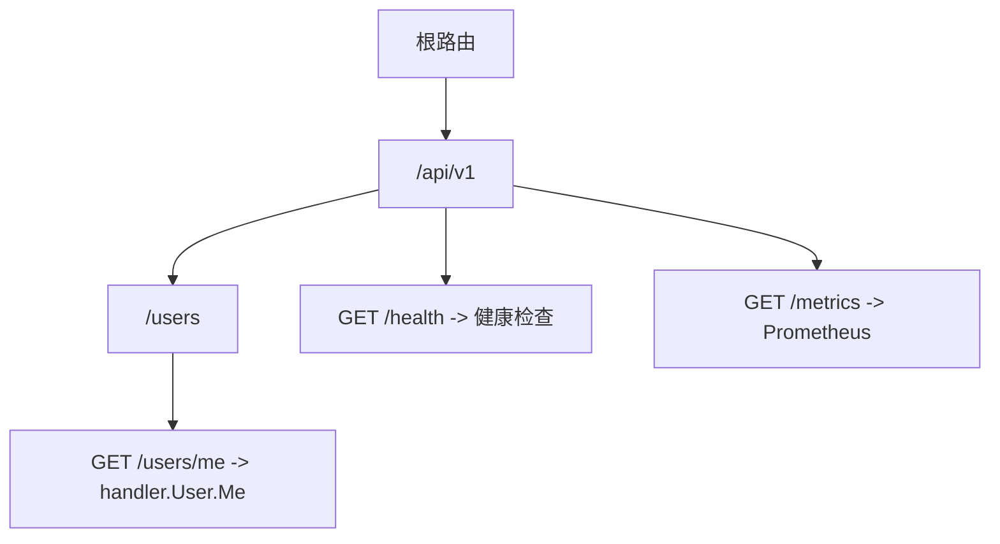
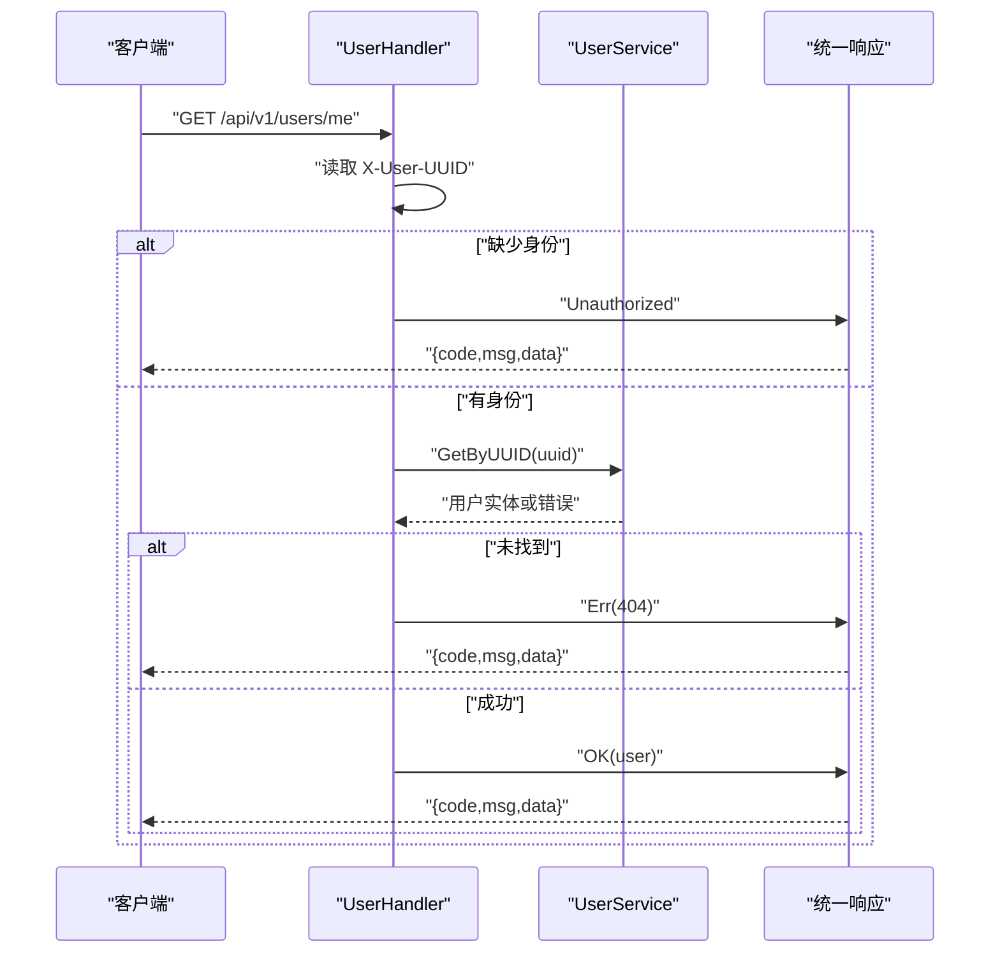
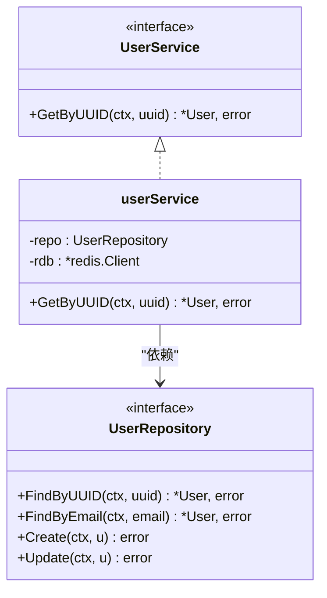
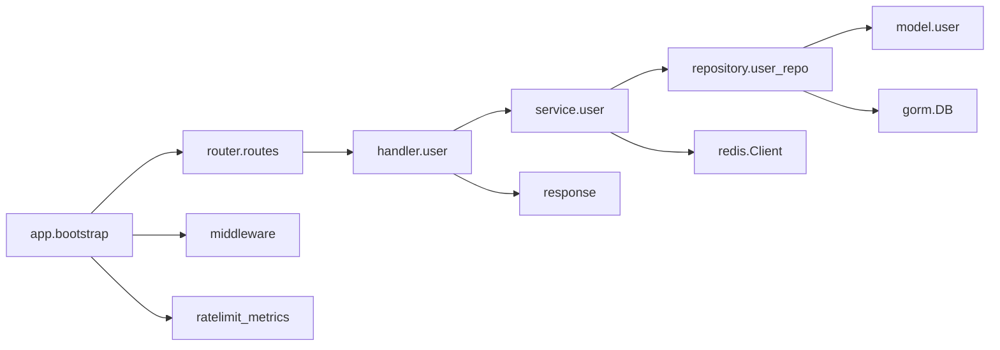

# 后端API服务模板

<cite>
**本文档引用的文件**
- [cmd/api/main.go.tmpl](file://templates/files/backend-api/cmd/api/main.go.tmpl)
- [internal/app/bootstrap.go.tmpl](file://templates/files/backend-api/internal/app/bootstrap.go.tmpl)
- [internal/config/config.go.tmpl](file://templates/files/backend-api/internal/config/config.go.tmpl)
- [internal/router/routes.go.tmpl](file://templates/files/backend-api/internal/router/routes.go.tmpl)
- [internal/handler/user.go.tmpl](file://templates/files/backend-api/internal/handler/user.go.tmpl)
- [internal/service/user.go.tmpl](file://templates/files/backend-api/internal/service/user.go.tmpl)
- [internal/repository/user_repo.go.tmpl](file://templates/files/backend-api/internal/repository/user_repo.go.tmpl)
- [internal/model/user.go.tmpl](file://templates/files/backend-api/internal/model/user.go.tmpl)
- [Dockerfile.tmpl](file://templates/files/backend-api/Dockerfile.tmpl)
- [go.mod.tmpl](file://templates/files/backend-api/go.mod.tmpl)
- [pkg-platform-core/middleware/middleware.go.tmpl](file://templates/files/pkg-platform-core/middleware/middleware.go.tmpl)
- [pkg-platform-core/middleware/ratelimit_metrics.go.tmpl](file://templates/files/pkg-platform-core/middleware/ratelimit_metrics.go.tmpl)
- [pkg-platform-core/response/response.go.tmpl](file://templates/files/pkg-platform-core/response/response.go.tmpl)
</cite>

## 目录
1. [简介](#简介)
2. [项目结构](#项目结构)
3. [核心组件](#核心组件)
4. [架构总览](#架构总览)
5. [详细组件分析](#详细组件分析)
6. [依赖关系分析](#依赖关系分析)
7. [性能考虑](#性能考虑)
8. [故障排除指南](#故障排除指南)
9. [结论](#结论)
10. [附录](#附录)

## 简介
本模板提供了一个完整的 Go 微服务后端 API 服务脚手架，采用清晰的分层架构与可复用的基础设施中间件。其设计理念包括：
- 三层架构：Handler → Service → Repository，职责分离，便于测试与维护
- 中间件栈：Recovery → RequestID → PrometheusMetrics → InternalAuth，覆盖容错、可观测性与安全
- 统一响应格式：与后端平台响应规范对齐，简化前端对接
- 容器化与依赖管理：Docker 多阶段构建与 go.mod 管理第三方依赖

## 项目结构
后端 API 服务模板的核心目录与文件组织如下：
- cmd/api/main.go.tmpl：应用入口，负责启动 HTTP 服务器与信号处理
- internal/app/bootstrap.go.tmpl：依赖装配与服务初始化
- internal/config/config.go.tmpl：配置加载与环境变量映射
- internal/router/routes.go.tmpl：路由注册与版本前缀约定
- internal/handler/user.go.tmpl：HTTP 处理器，仅依赖 service 层
- internal/service/user.go.tmpl：业务编排层，协调 repository 与缓存
- internal/repository/user_repo.go.tmpl：数据访问层，基于 GORM
- internal/model/user.go.tmpl：领域模型与数据库表映射
- Dockerfile.tmpl：多阶段构建与运行时镜像
- go.mod.tmpl：模块声明与依赖替换（可选）

图表来源
- [cmd/api/main.go.tmpl:24-52](file://templates/files/backend-api/cmd/api/main.go.tmpl#L24-L52)
- [internal/app/bootstrap.go.tmpl:45-98](file://templates/files/backend-api/internal/app/bootstrap.go.tmpl#L45-L98)
- [internal/config/config.go.tmpl:42-65](file://templates/files/backend-api/internal/config/config.go.tmpl#L42-L65)
- [internal/router/routes.go.tmpl:16-28](file://templates/files/backend-api/internal/router/routes.go.tmpl#L16-L28)
- [internal/handler/user.go.tmpl:13-46](file://templates/files/backend-api/internal/handler/user.go.tmpl#L13-L46)
- [internal/service/user.go.tmpl:16-37](file://templates/files/backend-api/internal/service/user.go.tmpl#L16-L37)
- [internal/repository/user_repo.go.tmpl:13-54](file://templates/files/backend-api/internal/repository/user_repo.go.tmpl#L13-L54)
- [internal/model/user.go.tmpl:12-25](file://templates/files/backend-api/internal/model/user.go.tmpl#L12-L25)
- [pkg-platform-core/middleware/middleware.go.tmpl:24-100](file://templates/files/pkg-platform-core/middleware/middleware.go.tmpl#L24-L100)
- [pkg-platform-core/middleware/ratelimit_metrics.go.tmpl:18-113](file://templates/files/pkg-platform-core/middleware/ratelimit_metrics.go.tmpl#L18-L113)
- [pkg-platform-core/response/response.go.tmpl:26-77](file://templates/files/pkg-platform-core/response/response.go.tmpl#L26-L77)

章节来源
- [cmd/api/main.go.tmpl:1-56](file://templates/files/backend-api/cmd/api/main.go.tmpl#L1-L56)
- [internal/app/bootstrap.go.tmpl:1-99](file://templates/files/backend-api/internal/app/bootstrap.go.tmpl#L1-L99)

## 核心组件
- 入口与生命周期管理：启动 HTTP 服务器、信号处理与优雅关闭
- 依赖装配：配置加载、数据库连接、Redis 连接、仓储与服务实例化、中间件与路由装配
- 配置管理：集中式配置结构与环境变量映射
- 路由与中间件：统一前缀、中间件顺序与指标采集
- 处理器层：请求解析、身份校验、调用服务与统一响应
- 业务层：编排仓储与缓存，保持无 HTTP 依赖
- 数据访问层：基于 GORM 的 CRUD 封装
- 统一响应：标准化返回结构与状态码语义

章节来源
- [cmd/api/main.go.tmpl:24-52](file://templates/files/backend-api/cmd/api/main.go.tmpl#L24-L52)
- [internal/app/bootstrap.go.tmpl:45-98](file://templates/files/backend-api/internal/app/bootstrap.go.tmpl#L45-L98)
- [internal/config/config.go.tmpl:8-65](file://templates/files/backend-api/internal/config/config.go.tmpl#L8-L65)
- [internal/router/routes.go.tmpl:16-28](file://templates/files/backend-api/internal/router/routes.go.tmpl#L16-L28)
- [internal/handler/user.go.tmpl:13-46](file://templates/files/backend-api/internal/handler/user.go.tmpl#L13-L46)
- [internal/service/user.go.tmpl:16-37](file://templates/files/backend-api/internal/service/user.go.tmpl#L16-L37)
- [internal/repository/user_repo.go.tmpl:13-54](file://templates/files/backend-api/internal/repository/user_repo.go.tmpl#L13-L54)
- [pkg-platform-core/response/response.go.tmpl:26-77](file://templates/files/pkg-platform-core/response/response.go.tmpl#L26-L77)

## 架构总览
该模板采用“入口 → 装配 → 路由/中间件 → 处理器 → 业务 → 仓储”的线性控制流，配合中间件栈实现统一的安全、可观测与限流策略。

图表来源
- [cmd/api/main.go.tmpl:31-38](file://templates/files/backend-api/cmd/api/main.go.tmpl#L31-L38)
- [internal/app/bootstrap.go.tmpl:83-90](file://templates/files/backend-api/internal/app/bootstrap.go.tmpl#L83-L90)
- [internal/router/routes.go.tmpl:20-25](file://templates/files/backend-api/internal/router/routes.go.tmpl#L20-L25)
- [internal/handler/user.go.tmpl:28-46](file://templates/files/backend-api/internal/handler/user.go.tmpl#L28-L46)
- [internal/service/user.go.tmpl:31-37](file://templates/files/backend-api/internal/service/user.go.tmpl#L31-L37)
- [internal/repository/user_repo.go.tmpl:30-36](file://templates/files/backend-api/internal/repository/user_repo.go.tmpl#L30-L36)

## 详细组件分析

### 入口与生命周期（cmd/api/main.go.tmpl）
- 启动流程：调用装配函数获取 Gin 引擎与依赖句柄，创建 HTTP 服务器并监听端口
- 优雅关闭：捕获系统信号，超时强制关闭，调用 Deps.Close 清理资源
- 类型约束：确保 Gin 引擎实现了 http.Handler 接口

图表来源
- [cmd/api/main.go.tmpl:24-52](file://templates/files/backend-api/cmd/api/main.go.tmpl#L24-L52)
- [internal/app/bootstrap.go.tmpl:26-43](file://templates/files/backend-api/internal/app/bootstrap.go.tmpl#L26-L43)

章节来源
- [cmd/api/main.go.tmpl:24-52](file://templates/files/backend-api/cmd/api/main.go.tmpl#L24-L52)

### 依赖装配（internal/app/bootstrap.go.tmpl）
- 装配顺序：配置 → MySQL → Redis → 仓储 → 服务 → 处理器 → 路由
- 中间件顺序：Recovery → RequestID → PrometheusMetrics → InternalAuth
- 健康检查与指标：/health 与 /metrics 路由
- 资源清理：Deps.Close 关闭 Redis 与底层 SQL 连接

图表来源
- [internal/app/bootstrap.go.tmpl:26-43](file://templates/files/backend-api/internal/app/bootstrap.go.tmpl#L26-L43)
- [internal/app/bootstrap.go.tmpl:45-98](file://templates/files/backend-api/internal/app/bootstrap.go.tmpl#L45-L98)

章节来源
- [internal/app/bootstrap.go.tmpl:45-98](file://templates/files/backend-api/internal/app/bootstrap.go.tmpl#L45-L98)

### 配置管理（internal/config/config.go.tmpl）
- 结构化配置：Server、DB、Redis、Internal、MasterKey
- 环境变量映射：API_PORT、APP_ENV、MYSQL_*、REDIS_*、INTERNAL_API_SECRET、CONFIG_MASTER_KEY
- 辅助函数：字符串与整型环境变量读取与回退

图表来源
- [internal/config/config.go.tmpl:8-41](file://templates/files/backend-api/internal/config/config.go.tmpl#L8-L41)
- [internal/config/config.go.tmpl:42-65](file://templates/files/backend-api/internal/config/config.go.tmpl#L42-L65)

章节来源
- [internal/config/config.go.tmpl:42-65](file://templates/files/backend-api/internal/config/config.go.tmpl#L42-L65)

### 路由设计模式（internal/router/routes.go.tmpl）
- 版本前缀：统一使用 /api/v1
- 用户模块：/users 子路由，当前提供 /users/me 获取当前用户
- 扩展指引：新增业务模块时，按约定在 model/repo/service/handler/router 下添加并装配

图表来源
- [internal/router/routes.go.tmpl:16-28](file://templates/files/backend-api/internal/router/routes.go.tmpl#L16-L28)

章节来源
- [internal/router/routes.go.tmpl:16-28](file://templates/files/backend-api/internal/router/routes.go.tmpl#L16-L28)

### HTTP 处理器层（internal/handler/user.go.tmpl）
- 职责：解析请求头中的用户标识（X-User-UUID）、调用 service、使用统一响应返回
- 身份来源：由网关注入，处理器仅做校验与转发
- 错误处理：缺失身份、业务错误、未找到等场景返回相应错误码

图表来源
- [internal/handler/user.go.tmpl:28-46](file://templates/files/backend-api/internal/handler/user.go.tmpl#L28-L46)
- [pkg-platform-core/response/response.go.tmpl:33-77](file://templates/files/pkg-platform-core/response/response.go.tmpl#L33-L77)

章节来源
- [internal/handler/user.go.tmpl:13-46](file://templates/files/backend-api/internal/handler/user.go.tmpl#L13-L46)

### 业务逻辑层（internal/service/user.go.tmpl）
- 接口设计：UserService.GetByUUID 定义业务契约
- 实现要点：参数校验、调用仓储、可选缓存（Redis 客户端可为 nil）
- 依赖注入：仓储与 Redis 客户端通过构造函数注入

图表来源
- [internal/service/user.go.tmpl:16-29](file://templates/files/backend-api/internal/service/user.go.tmpl#L16-L29)
- [internal/service/user.go.tmpl:31-37](file://templates/files/backend-api/internal/service/user.go.tmpl#L31-L37)
- [internal/repository/user_repo.go.tmpl:13-19](file://templates/files/backend-api/internal/repository/user_repo.go.tmpl#L13-L19)

章节来源
- [internal/service/user.go.tmpl:16-37](file://templates/files/backend-api/internal/service/user.go.tmpl#L16-L37)

### 数据访问层（internal/repository/user_repo.go.tmpl）
- 接口设计：Find/Create/Update 等方法抽象数据操作
- 实现要点：基于 GORM 的上下文查询、错误类型判断（记录不存在返回空）
- 依赖注入：GORM 数据库客户端通过构造函数注入

章节来源
- [internal/repository/user_repo.go.tmpl:13-54](file://templates/files/backend-api/internal/repository/user_repo.go.tmpl#L13-L54)

### 领域模型（internal/model/user.go.tmpl）
- 用户实体：包含业务主键 UUID、邮箱、密码哈希、昵称、会员等级及时间戳
- 表映射：显式指定表名为 users

章节来源
- [internal/model/user.go.tmpl:12-25](file://templates/files/backend-api/internal/model/user.go.tmpl#L12-L25)

### 中间件与统一响应
- 中间件：RequestID、CORS、PrometheusMetrics、InternalAuth、JWT（可选）、限流（可选）
- 统一响应：OK/Err/BadRequest/Unauthorized/Forbidden/InternalError 等，状态码语义明确

章节来源
- [pkg-platform-core/middleware/middleware.go.tmpl:24-100](file://templates/files/pkg-platform-core/middleware/middleware.go.tmpl#L24-L100)
- [pkg-platform-core/middleware/ratelimit_metrics.go.tmpl:18-113](file://templates/files/pkg-platform-core/middleware/ratelimit_metrics.go.tmpl#L18-L113)
- [pkg-platform-core/response/response.go.tmpl:26-77](file://templates/files/pkg-platform-core/response/response.go.tmpl#L26-L77)

### 容器化与依赖管理
- Dockerfile：多阶段构建（builder → distroless 运行时），静态二进制输出，非 root 用户运行
- go.mod：模块声明、Go 版本、第三方依赖与可选 replace 指向本地平台核心库

章节来源
- [Dockerfile.tmpl:1-14](file://templates/files/backend-api/Dockerfile.tmpl#L1-L14)
- [go.mod.tmpl:1-16](file://templates/files/backend-api/go.mod.tmpl#L1-L16)

## 依赖关系分析
- 组件耦合：Handler 仅依赖 Service 接口，Service 依赖 Repository 接口，降低耦合度
- 外部依赖：Gin、GORM、Redis 客户端、Prometheus 客户端
- 中间件依赖：统一响应包与平台中间件库

图表来源
- [internal/handler/user.go.tmpl:9-11](file://templates/files/backend-api/internal/handler/user.go.tmpl#L9-L11)
- [internal/service/user.go.tmpl:12-14](file://templates/files/backend-api/internal/service/user.go.tmpl#L12-L14)
- [internal/repository/user_repo.go.tmpl](file://templates/files/backend-api/internal/repository/user_repo.go.tmpl#L10)
- [internal/app/bootstrap.go.tmpl:18-24](file://templates/files/backend-api/internal/app/bootstrap.go.tmpl#L18-L24)

章节来源
- [internal/app/bootstrap.go.tmpl:18-24](file://templates/files/backend-api/internal/app/bootstrap.go.tmpl#L18-L24)

## 性能考虑
- 中间件顺序：Recovery 放首位，RequestID/PrometheusMetrics/内部鉴权依次放置，避免重复计算与无效处理
- Redis 降级：Redis 客户端可为 nil，Ping 失败时记录警告并继续运行
- 指标采集：PrometheusMetrics 记录请求数量、耗时分布与并发数，便于容量规划
- 限流策略：Redis 固定窗口限流，支持按用户 UUID 或 IP 限流，Redis 错误时 fail-open

## 故障排除指南
- 启动失败：检查配置项是否正确设置（端口、数据库地址、Redis 地址、内部密钥）
- 数据库连接失败：确认 DSN 拼接与网络连通性，查看日志中的连接错误
- Redis Ping 失败：确认 Redis 地址与认证配置，若失败会记录警告并启用缓存降级
- 身份缺失：处理器会返回未授权错误，确认网关是否正确注入 X-User-UUID
- 统一响应：根据返回的 code/msg 判断具体错误类型，结合日志定位问题

章节来源
- [internal/app/bootstrap.go.tmpl:49-70](file://templates/files/backend-api/internal/app/bootstrap.go.tmpl#L49-L70)
- [internal/handler/user.go.tmpl:30-35](file://templates/files/backend-api/internal/handler/user.go.tmpl#L30-L35)
- [pkg-platform-core/response/response.go.tmpl:51-77](file://templates/files/pkg-platform-core/response/response.go.tmpl#L51-L77)

## 结论
该模板提供了清晰的分层架构、可复用的中间件与统一响应规范，适合快速搭建生产级 Go 微服务。通过严格的依赖注入与装配流程，保证了可测试性与可维护性；通过中间件与指标体系，提升了可观测性与安全性。

## 附录
- API 路由前缀：/api/v1
- 健康检查：/health
- 指标端点：/metrics
- 中间件顺序建议：Recovery → RequestID → PrometheusMetrics → InternalAuth（可根据需要插入 CORS/JWT/限流）