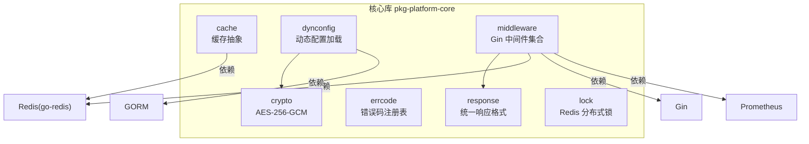
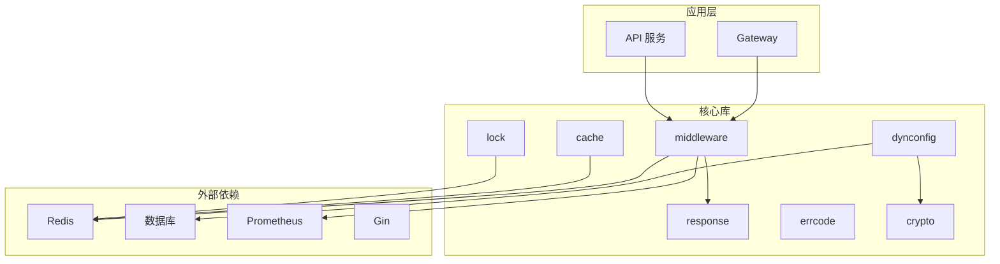
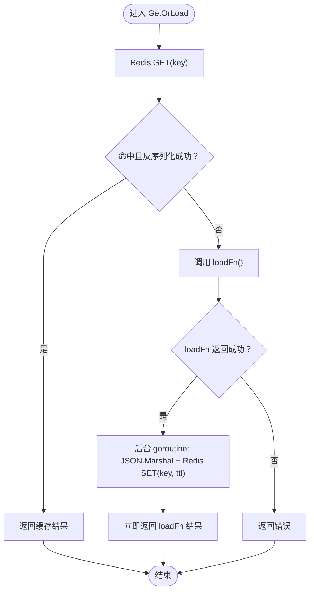
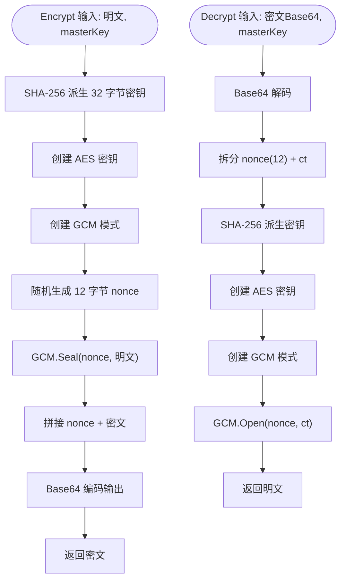
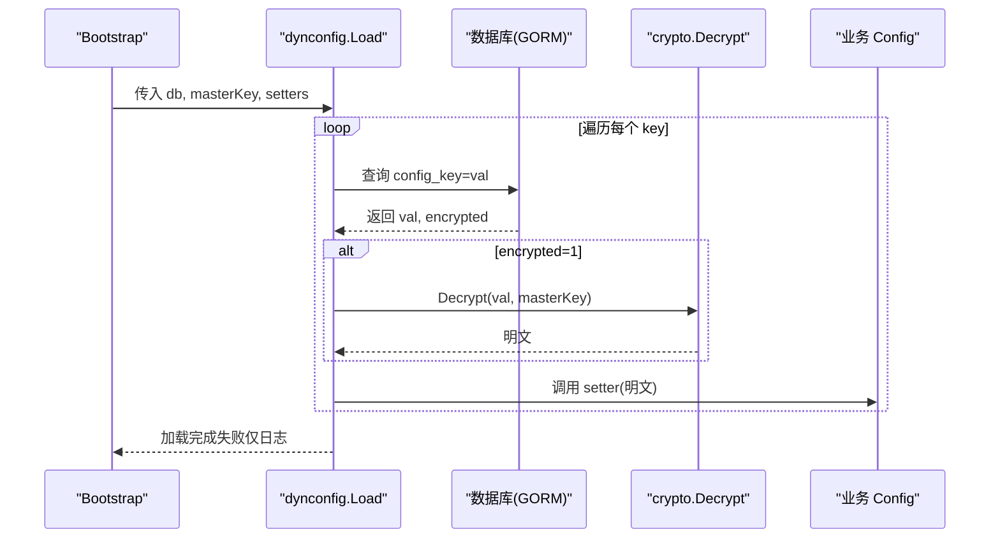
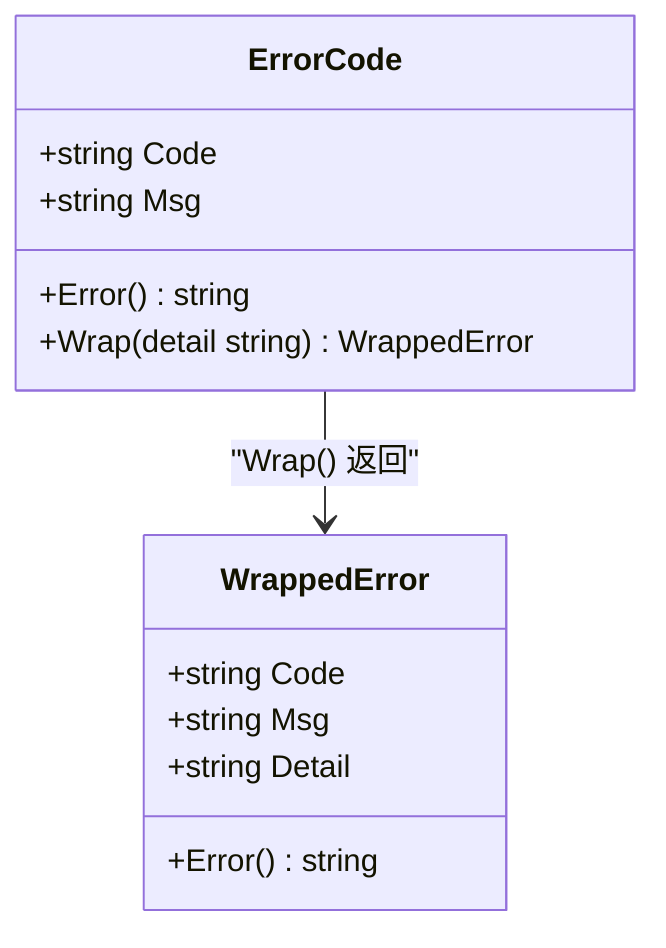
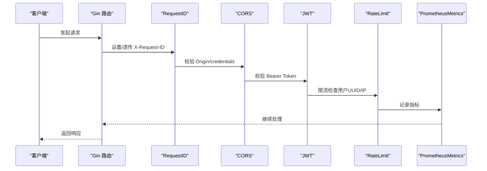
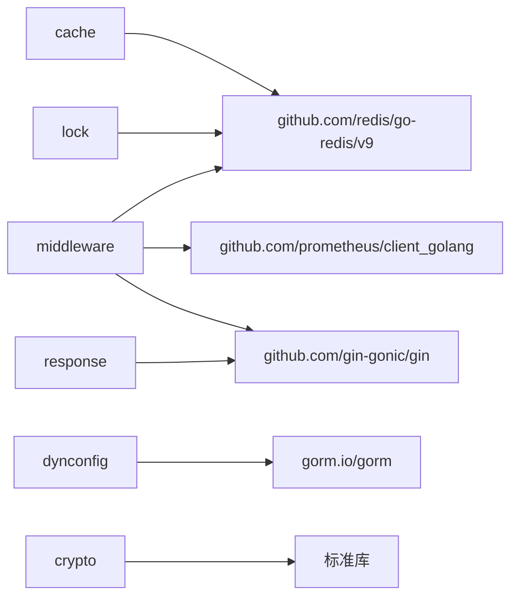

# 核心库模板

<cite>
**本文引用的文件**
- [cache.go.tmpl](file://templates/files/pkg-platform-core/cache/cache.go.tmpl)
- [aes_gcm.go.tmpl](file://templates/files/pkg-platform-core/crypto/aes_gcm.go.tmpl)
- [loader.go.tmpl](file://templates/files/pkg-platform-core/dynconfig/loader.go.tmpl)
- [errcode.go.tmpl](file://templates/files/pkg-platform-core/errcode/errcode.go.tmpl)
- [middleware.go.tmpl](file://templates/files/pkg-platform-core/middleware/middleware.go.tmpl)
- [ratelimit_metrics.go.tmpl](file://templates/files/pkg-platform-core/middleware/ratelimit_metrics.go.tmpl)
- [go.mod.tmpl](file://templates/files/pkg-platform-core/go.mod.tmpl)
- [README.md](file://templates/files/pkg-platform-core/docs/README.md)
- [cache.md](file://templates/files/pkg-platform-core/docs/cache.md)
- [crypto.md](file://templates/files/pkg-platform-core/docs/crypto.md)
- [dynconfig.md](file://templates/files/pkg-platform-core/docs/dynconfig.md)
- [errcode.md](file://templates/files/pkg-platform-core/docs/errcode.md)
- [middleware.md](file://templates/files/pkg-platform-core/docs/middleware.md)
- [response.go.tmpl](file://templates/files/pkg-platform-core/response/response.go.tmpl)
- [redis_lock.go.tmpl](file://templates/files/pkg-platform-core/lock/redis_lock.go.tmpl)
- [aes_gcm_test.go.tmpl](file://templates/files/pkg-platform-core/crypto/aes_gcm_test.go.tmpl)
- [errcode_test.go.tmpl](file://templates/files/pkg-platform-core/errcode/errcode_test.go.tmpl)
</cite>

## 目录
1. [简介](#简介)
2. [项目结构](#项目结构)
3. [核心组件](#核心组件)
4. [架构总览](#架构总览)
5. [组件详解](#组件详解)
6. [依赖关系分析](#依赖关系分析)
7. [性能考量](#性能考量)
8. [故障排查指南](#故障排查指南)
9. [结论](#结论)
10. [附录](#附录)

## 简介
本文件是对“核心库模板”的系统化技术文档，聚焦于可复用 Go 库模板的设计与实现，围绕以下关键模块展开：
- 缓存抽象：cache/cache.go.tmpl 的 Cache-Aside 泛型缓存
- 加密解密：crypto/aes_gcm.go.tmpl 的 AES-256-GCM 对称加密
- 动态配置：dynconfig/loader.go.tmpl 的 system_config 表动态加载
- 错误码体系：errcode/errcode.go.tmpl 的六位业务错误码注册表
- 中间件框架：middleware/middleware.go.tmpl 的 Gin 通用中间件集合

文档还涵盖模块化设计、接口定义、测试覆盖、文档生成、集成使用、扩展开发、版本管理、性能优化、安全考虑与兼容性保障等最佳实践。

## 项目结构
该模板以“包”为单位组织，每个功能模块独立封装，通过清晰的接口与回调解耦业务，便于在网关与 API 服务中复用。

图示来源
- [go.mod.tmpl:1-12](file://templates/files/pkg-platform-core/go.mod.tmpl#L1-L12)
- [cache.go.tmpl:1-93](file://templates/files/pkg-platform-core/cache/cache.go.tmpl#L1-L93)
- [middleware.go.tmpl:1-202](file://templates/files/pkg-platform-core/middleware/middleware.go.tmpl#L1-L202)
- [loader.go.tmpl:1-136](file://templates/files/pkg-platform-core/dynconfig/loader.go.tmpl#L1-L136)
- [aes_gcm.go.tmpl:1-72](file://templates/files/pkg-platform-core/crypto/aes_gcm.go.tmpl#L1-L72)
- [response.go.tmpl:1-78](file://templates/files/pkg-platform-core/response/response.go.tmpl#L1-L78)
- [redis_lock.go.tmpl:1-49](file://templates/files/pkg-platform-core/lock/redis_lock.go.tmpl#L1-L49)

章节来源
- [README.md:1-23](file://templates/files/pkg-platform-core/docs/README.md#L1-L23)
- [go.mod.tmpl:1-12](file://templates/files/pkg-platform-core/go.mod.tmpl#L1-L12)

## 核心组件
- 缓存抽象：提供泛型 GetOrLoad、直接 Set/Get、单键失效与通配符批量失效，采用异步回填策略提升吞吐。
- 加密解密：AES-256-GCM，密钥派生使用 SHA-256，密文格式与 Python 端完全对齐。
- 动态配置：启动时从数据库表 system_config 拉取配置，支持自定义表/列名，加密值自动解密，优雅降级。
- 错误码体系：六位字符串错误码，与 HTTP 状态码解耦，支持 Wrap 携带运行时上下文。
- 中间件框架：RequestID、CORS、JWT、InternalAuth、RateLimit、PrometheusMetrics，顺序与行为明确。

章节来源
- [cache.go.tmpl:1-93](file://templates/files/pkg-platform-core/cache/cache.go.tmpl#L1-L93)
- [aes_gcm.go.tmpl:1-72](file://templates/files/pkg-platform-core/crypto/aes_gcm.go.tmpl#L1-L72)
- [loader.go.tmpl:1-136](file://templates/files/pkg-platform-core/dynconfig/loader.go.tmpl#L1-L136)
- [errcode.go.tmpl:1-84](file://templates/files/pkg-platform-core/errcode/errcode.go.tmpl#L1-L84)
- [middleware.go.tmpl:1-202](file://templates/files/pkg-platform-core/middleware/middleware.go.tmpl#L1-L202)

## 架构总览
下图展示了核心库在系统中的定位与交互关系，强调“业务无关、优雅降级、跨语言对齐”的设计原则。

图示来源
- [middleware.go.tmpl:1-202](file://templates/files/pkg-platform-core/middleware/middleware.go.tmpl#L1-L202)
- [ratelimit_metrics.go.tmpl:1-114](file://templates/files/pkg-platform-core/middleware/ratelimit_metrics.go.tmpl#L1-L114)
- [loader.go.tmpl:1-136](file://templates/files/pkg-platform-core/dynconfig/loader.go.tmpl#L1-L136)
- [aes_gcm.go.tmpl:1-72](file://templates/files/pkg-platform-core/crypto/aes_gcm.go.tmpl#L1-L72)
- [cache.go.tmpl:1-93](file://templates/files/pkg-platform-core/cache/cache.go.tmpl#L1-L93)
- [redis_lock.go.tmpl:1-49](file://templates/files/pkg-platform-core/lock/redis_lock.go.tmpl#L1-L49)
- [response.go.tmpl:1-78](file://templates/files/pkg-platform-core/response/response.go.tmpl#L1-L78)

## 组件详解

### 缓存抽象（cache）
- 设计要点
  - 泛型 GetOrLoad：先查 Redis，命中则反序列化返回；未命中则调用 loadFn 回源，随后在后台 goroutine 异步回填，不阻塞主流程。
  - InvalidatePattern 使用 SCAN 而非 KEYS，避免阻塞。
  - key 命名建议 cache:<entity>:<id>，便于通配符清理。
- 关键接口
  - NewService、GetOrLoad、Set、Get、Invalidate、InvalidatePattern
- 性能与风险
  - 异步回填提升吞吐，但可能导致 thundering herd；如需防穿透，可在 loadFn 内加分布式锁。
  - JSON 序列化要求字段可序列化，time.Time 默认序列化为 RFC3339 字符串。
  - 空字符串被视为有效值会被缓存。

图示来源
- [cache.go.tmpl:28-58](file://templates/files/pkg-platform-core/cache/cache.go.tmpl#L28-L58)

章节来源
- [cache.go.tmpl:1-93](file://templates/files/pkg-platform-core/cache/cache.go.tmpl#L1-L93)
- [cache.md:1-61](file://templates/files/pkg-platform-core/docs/cache.md#L1-L61)

### 加密解密（crypto）
- 设计要点
  - AES-256-GCM 对称加密，密钥派生使用 SHA-256，密文格式为 base64(nonce_12 + ciphertext + tag_16)。
  - 与 Python 端完全对齐，确保跨语言互通。
- 关键接口
  - Encrypt、Decrypt、deriveKey
- 安全与兼容
  - masterKey 必须通过环境变量注入，不可硬编码。
  - 更换 masterKey 后旧密文无法解密，需重写或重新加密。
  - 密文长度约等于明文×1.33 + 40。

图示来源
- [aes_gcm.go.tmpl:18-71](file://templates/files/pkg-platform-core/crypto/aes_gcm.go.tmpl#L18-L71)

章节来源
- [aes_gcm.go.tmpl:1-72](file://templates/files/pkg-platform-core/crypto/aes_gcm.go.tmpl#L1-L72)
- [crypto.md:1-70](file://templates/files/pkg-platform-core/docs/crypto.md#L1-L70)

### 动态配置（dynconfig）
- 设计要点
  - 应用启动时一次性加载 system_config 表，加密值使用 masterKey 解密，通过 setter 回调写入业务配置。
  - 优雅降级：缺失或解密失败不阻止启动，仅记录日志。
  - 支持自定义表名/列名，便于适配不同数据库结构。
- 关键接口
  - Load、LoadWithOptions、Setter、Options
- 使用流程
  - 在 bootstrap 中构建 setters 映射，调用 Load 完成配置注入。

图示来源
- [loader.go.tmpl:64-116](file://templates/files/pkg-platform-core/dynconfig/loader.go.tmpl#L64-L116)
- [aes_gcm.go.tmpl:46-71](file://templates/files/pkg-platform-core/crypto/aes_gcm.go.tmpl#L46-L71)

章节来源
- [loader.go.tmpl:1-136](file://templates/files/pkg-platform-core/dynconfig/loader.go.tmpl#L1-L136)
- [dynconfig.md:1-68](file://templates/files/pkg-platform-core/docs/dynconfig.md#L1-L68)

### 错误码体系（errcode）
- 设计要点
  - 六位业务错误码，与 HTTP 状态码解耦；前端按 code 做国际化。
  - 通过 ErrorCode.Wrap 携带运行时上下文，Detail 仅用于服务端日志。
- 关键类型与接口
  - ErrorCode、WrappedError、New、Error、Wrap
- 错误码分段
  - 系统层 000xxx、鉴权与注册 100xxx、文件与资源 103xxx、支付与积分 104xxx、AI 与外部服务 105xxx。

图示来源
- [errcode.go.tmpl:11-45](file://templates/files/pkg-platform-core/errcode/errcode.go.tmpl#L11-L45)

章节来源
- [errcode.go.tmpl:1-84](file://templates/files/pkg-platform-core/errcode/errcode.go.tmpl#L1-L84)
- [errcode.md:1-67](file://templates/files/pkg-platform-core/docs/errcode.md#L1-L67)

### 中间件框架（middleware）
- 组成
  - RequestID：生成或透传 X-Request-ID
  - CORS：白名单 origin + AllowCredentials
  - JWT：Bearer 校验 + 公开路径白名单 + 过期返回 403
  - InternalAuth：X-Internal-Secret 校验
  - RateLimit：Redis 固定窗口限流，fail-open
  - PrometheusMetrics：HTTP 指标采集
- 关键接口
  - RequestID、CORS、JWT、InternalAuth、RateLimit、PrometheusMetrics
- 中间件链顺序
  - Gateway：Recovery → CORS → RequestID → Prometheus → JWT → RateLimit
  - API：Recovery → RequestID → Prometheus → InternalAuth

图示来源
- [middleware.go.tmpl:24-202](file://templates/files/pkg-platform-core/middleware/middleware.go.tmpl#L24-L202)
- [ratelimit_metrics.go.tmpl:18-114](file://templates/files/pkg-platform-core/middleware/ratelimit_metrics.go.tmpl#L18-L114)

章节来源
- [middleware.go.tmpl:1-202](file://templates/files/pkg-platform-core/middleware/middleware.go.tmpl#L1-L202)
- [ratelimit_metrics.go.tmpl:1-114](file://templates/files/pkg-platform-core/middleware/ratelimit_metrics.go.tmpl#L1-L114)
- [middleware.md:1-171](file://templates/files/pkg-platform-core/docs/middleware.md#L1-L171)

## 依赖关系分析
- 模块内聚与耦合
  - cache 与 middleware 均依赖 Redis；dynconfig 依赖 GORM；crypto 为纯标准库；response 依赖 Gin。
- 外部依赖
  - Gin、Redis、GORM、Prometheus、UUID
- 版本与兼容
  - go 1.22；各依赖版本在 go.mod.tmpl 中固定

图示来源
- [go.mod.tmpl:5-11](file://templates/files/pkg-platform-core/go.mod.tmpl#L5-L11)
- [cache.go.tmpl:15-16](file://templates/files/pkg-platform-core/cache/cache.go.tmpl#L15-L16)
- [middleware.go.tmpl:19-22](file://templates/files/pkg-platform-core/middleware/middleware.go.tmpl#L19-L22)
- [loader.go.tmpl:24-27](file://templates/files/pkg-platform-core/dynconfig/loader.go.tmpl#L24-L27)
- [response.go.tmpl:20-24](file://templates/files/pkg-platform-core/response/response.go.tmpl#L20-L24)
- [redis_lock.go.tmpl:17-18](file://templates/files/pkg-platform-core/lock/redis_lock.go.tmpl#L17-L18)

章节来源
- [go.mod.tmpl:1-12](file://templates/files/pkg-platform-core/go.mod.tmpl#L1-L12)

## 性能考量
- 缓存
  - 异步回填减少主流程等待；建议在高并发 miss 场景引入分布式锁防穿透。
  - 使用 SCAN 替代 KEYS，避免阻塞。
- 加密
  - AES-256-GCM 性能优异；注意 masterKey 派生与随机 nonce 的成本可控。
- 中间件
  - PrometheusMetrics 尽量靠前，捕获所有请求；RateLimit 放在 JWT 之后以获取 userUUID。
  - CORS 自动处理 OPTIONS 预检，减少前端复杂度。
- 配置加载
  - 启动时一次性加载，避免运行时频繁查询；热更新建议结合 cache + Redis TTL。

## 故障排查指南
- 缓存
  - 现象：缓存命中但反序列化失败
  - 处理：视为 miss，回源后异步回填；确认数据结构可 JSON 序列化
  - 现象：批量失效无效
  - 处理：确认 pattern 正确且使用 InvalidatePattern（非 KEYS）
- 加密
  - 现象：解密报错
  - 处理：确认 masterKey 一致；更换 masterKey 后需重写旧密文
- 动态配置
  - 现象：启动失败
  - 处理：优雅降级不阻断；检查 DB 连接、表结构与列名
- 中间件
  - 现象：CORS 未生效
  - 处理：确认 Origin 在白名单；Allow-Credentials=true
  - 现象：JWT 过期返回 403
  - 处理：前端根据 403 触发刷新流程
- 错误码
  - 现象：前端无法翻译
  - 处理：必须通过注册表 ErrorCode，不得硬编码 code

章节来源
- [cache.go.tmpl:32-58](file://templates/files/pkg-platform-core/cache/cache.go.tmpl#L32-L58)
- [aes_gcm.go.tmpl:46-71](file://templates/files/pkg-platform-core/crypto/aes_gcm.go.tmpl#L46-L71)
- [loader.go.tmpl:78-116](file://templates/files/pkg-platform-core/dynconfig/loader.go.tmpl#L78-L116)
- [middleware.go.tmpl:70-100](file://templates/files/pkg-platform-core/middleware/middleware.go.tmpl#L70-L100)
- [middleware.go.tmpl:102-163](file://templates/files/pkg-platform-core/middleware/middleware.go.tmpl#L102-L163)
- [errcode.go.tmpl:23-45](file://templates/files/pkg-platform-core/errcode/errcode.go.tmpl#L23-L45)

## 结论
该核心库模板以“业务无关、优雅降级、跨语言对齐”为核心设计原则，通过清晰的接口与回调解耦，实现了缓存、加密、动态配置、错误码与中间件的模块化复用。其测试覆盖与文档生成机制确保了质量与可维护性。在集成与扩展过程中，遵循本文的性能优化、安全与兼容性建议，可进一步提升系统的稳定性与可演进性。

## 附录
- 集成使用
  - 在 Gateway 与 API 服务中按文档示例挂载中间件链；在 bootstrap 中调用 dynconfig.Load 注入配置；使用 response 统一响应格式。
- 扩展开发
  - 新增业务错误码在业务包内集中声明；新增中间件遵循 Gin HandlerFunc 模式并在合适位置挂载。
- 版本管理
  - go.mod.tmpl 固定依赖版本；发布前执行 go mod tidy 与 go test ./...；遵循 semver，变更错误码属于 breaking change。

章节来源
- [README.md:17-23](file://templates/files/pkg-platform-core/docs/README.md#L17-L23)
- [response.go.tmpl:1-78](file://templates/files/pkg-platform-core/response/response.go.tmpl#L1-L78)
- [errcode.go.tmpl:18-31](file://templates/files/pkg-platform-core/errcode/errcode.go.tmpl#L18-L31)