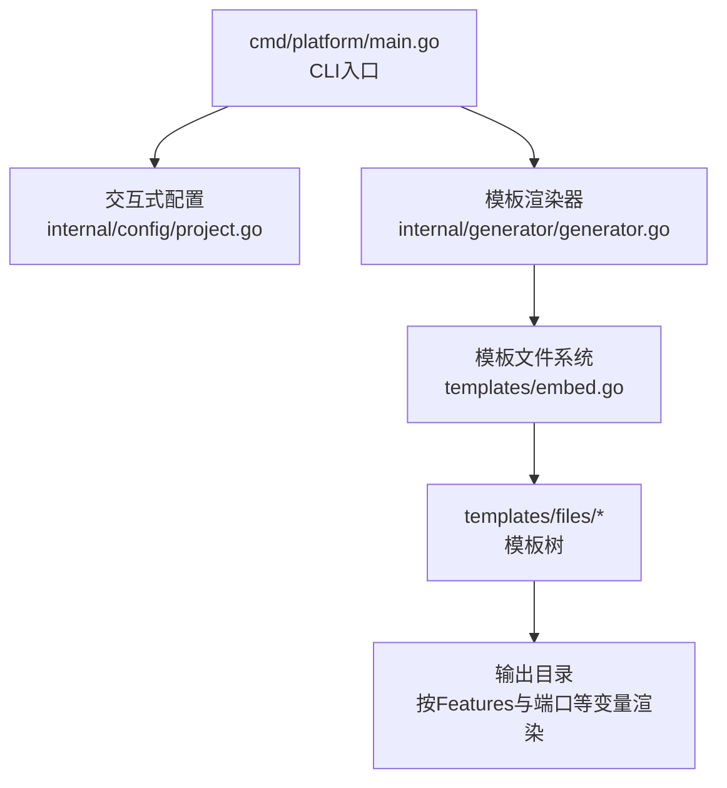
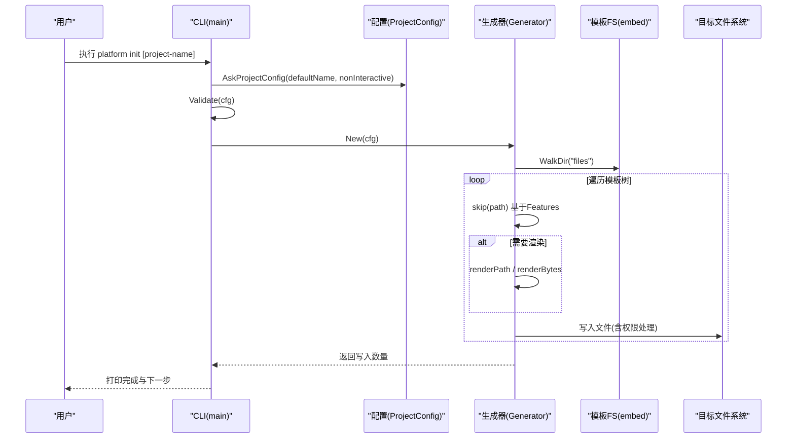
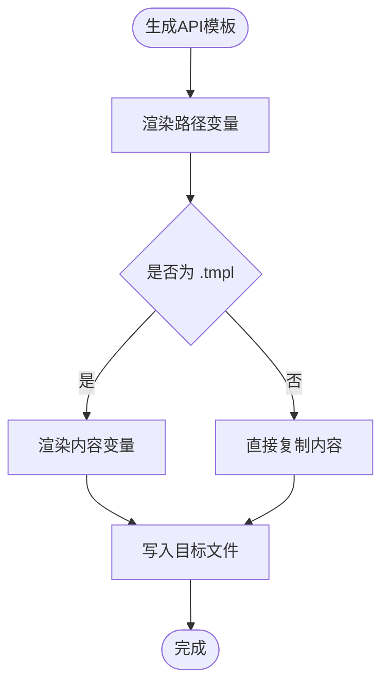
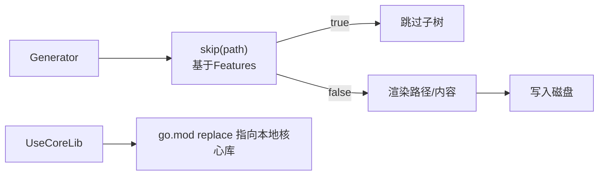

# 模板类型与结构

<cite>
**本文引用的文件**
- [cmd/platform/main.go](file://cmd/platform/main.go)
- [internal/config/project.go](file://internal/config/project.go)
- [internal/generator/generator.go](file://internal/generator/generator.go)
- [templates/embed.go](file://templates/embed.go)
- [README.md](file://README.md)
- [templates/files/backend-api/cmd/api/main.go.tmpl](file://templates/files/backend-api/cmd/api/main.go.tmpl)
- [templates/files/backend-api/internal/app/bootstrap.go.tmpl](file://templates/files/backend-api/internal/app/bootstrap.go.tmpl)
- [templates/files/backend-api/go.mod.tmpl](file://templates/files/backend-api/go.mod.tmpl)
- [templates/files/backend-gateway/go.mod.tmpl](file://templates/files/backend-gateway/go.mod.tmpl)
- [templates/files/backend-ai-engine/app/main.py.tmpl](file://templates/files/backend-ai-engine/app/main.py.tmpl)
- [templates/files/backend-ai-engine/Dockerfile.tmpl](file://templates/files/backend-ai-engine/Dockerfile.tmpl)
- [templates/files/frontend-web/package.json.tmpl](file://templates/files/frontend-web/package.json.tmpl)
- [templates/files/frontend-admin/package.json.tmpl](file://templates/files/frontend-admin/package.json.tmpl)
- [templates/files/deploy/local/docker-compose-all.yaml.tmpl](file://templates/files/deploy/local/docker-compose-all.yaml.tmpl)
- [templates/files/pkg-platform-core/go.mod.tmpl](file://templates/files/pkg-platform-core/go.mod.tmpl)
</cite>

## 目录
1. [简介](#简介)
2. [项目结构](#项目结构)
3. [核心组件](#核心组件)
4. [架构总览](#架构总览)
5. [详细组件分析](#详细组件分析)
6. [依赖关系分析](#依赖关系分析)
7. [性能考量](#性能考量)
8. [故障排查指南](#故障排查指南)
9. [结论](#结论)
10. [附录](#附录)

## 简介
本文件系统性梳理平台脚手架的模板体系，覆盖后端API服务模板、AI引擎模板、前端Web应用模板、前端管理面板模板与核心库模板。文档解释各模板的用途、目录结构、关键文件职责与配置选项，并提供模板选择与组合使用的指导。

## 项目结构
脚手架采用“CLI + 模板内嵌 + 交互式配置”的方式，通过 Cobra 提供命令入口，使用 embed 将 templates/files 下的模板树内嵌进二进制，运行时以 text/template 渲染并落盘到目标目录。

**图表来源**
- [cmd/platform/main.go:22-87](file://cmd/platform/main.go#L22-L87)
- [internal/generator/generator.go:33-103](file://internal/generator/generator.go#L33-L103)
- [templates/embed.go:6-11](file://templates/embed.go#L6-L11)

**章节来源**
- [cmd/platform/main.go:22-87](file://cmd/platform/main.go#L22-L87)
- [internal/generator/generator.go:33-103](file://internal/generator/generator.go#L33-L103)
- [templates/embed.go:6-11](file://templates/embed.go#L6-L11)
- [README.md:61-83](file://README.md#L61-L83)

## 核心组件
- CLI入口与命令
  - 提供 init 与 version 子命令，init 支持非交互模式与输出目录参数。
- 交互式配置
  - ProjectConfig 定义项目级变量（名称、品牌、域名、Go模块路径、端口、功能开关、是否使用核心库、是否初始化Git等）。
  - 提供默认值与校验规则，保证生成项目符合约定。
- 模板渲染器
  - 遍历嵌入的模板树，按 Features 决定是否跳过某子树；路径与内容均支持模板变量渲染；自动去除 .tmpl 后缀；对脚本赋予执行权限。
- 模板文件系统
  - 通过 go:embed 将 templates/files 整体内嵌，遍历时得到目标项目中的相对路径。

**章节来源**
- [cmd/platform/main.go:40-87](file://cmd/platform/main.go#L40-L87)
- [internal/config/project.go:12-106](file://internal/config/project.go#L12-L106)
- [internal/generator/generator.go:33-158](file://internal/generator/generator.go#L33-L158)
- [templates/embed.go:6-11](file://templates/embed.go#L6-L11)

## 架构总览
模板生成流程：CLI 接收参数 → 交互式收集配置 → 校验配置 → 创建生成器 → 遍历模板树 → 渲染路径与内容 → 写入磁盘 → 输出统计与下一步指引。

**图表来源**
- [cmd/platform/main.go:48-81](file://cmd/platform/main.go#L48-L81)
- [internal/generator/generator.go:33-103](file://internal/generator/generator.go#L33-L103)

## 详细组件分析

### 后端API服务模板（Go）
- 用途
  - 提供业务API能力，采用三层架构（Handler → Service → Repository），内置中间件链（恢复、CORS、请求ID、指标、内部鉴权）。
- 目录结构与关键文件
  - cmd/api/main.go.tmpl：服务入口，负责引导装配、启动HTTP服务器、信号处理与优雅关闭。
  - internal/app/bootstrap.go.tmpl：装配顺序与依赖注入（配置 → 数据库 → Redis → Repository → Service → Handler → 路由），注册健康检查与指标端点。
  - go.mod.tmpl：模块声明、Go版本、依赖与可选的 replace 指向本地核心库。
- 配置选项
  - 通过 ProjectConfig 渲染模块名、端口、内部密钥、数据库与Redis连接信息等。
- 生成规则
  - 路径与内容均支持模板变量；.tmpl 后缀在写入时移除；根据 UseCoreLib 决定是否启用 replace。

**图表来源**
- [internal/generator/generator.go:62-98](file://internal/generator/generator.go#L62-L98)

**章节来源**
- [templates/files/backend-api/cmd/api/main.go.tmpl:1-56](file://templates/files/backend-api/cmd/api/main.go.tmpl#L1-L56)
- [templates/files/backend-api/internal/app/bootstrap.go.tmpl:1-99](file://templates/files/backend-api/internal/app/bootstrap.go.tmpl#L1-L99)
- [templates/files/backend-api/go.mod.tmpl:1-16](file://templates/files/backend-api/go.mod.tmpl#L1-L16)
- [internal/generator/generator.go:105-120](file://internal/generator/generator.go#L105-L120)

### 后端网关模板（Go）
- 用途
  - 作为统一入口，负责JWT解析、CORS、限流、内部鉴权与路由转发。
- 目录结构与关键文件
  - go.mod.tmpl：模块声明、Go版本、依赖与可选的 replace 指向本地核心库。
- 生成规则
  - 与API模板一致，通过 ProjectConfig 渲染模块名与依赖替换。

**章节来源**
- [templates/files/backend-gateway/go.mod.tmpl:1-16](file://templates/files/backend-gateway/go.mod.tmpl#L1-L16)
- [internal/generator/generator.go:105-120](file://internal/generator/generator.go#L105-L120)

### AI引擎模板（Python）
- 用途
  - 提供AI编排能力，只读访问下游API，内置中间件链（CORS、请求ID、内部鉴权）与异常映射。
- 目录结构与关键文件
  - app/main.py.tmpl：应用工厂函数，注册中间件、异常处理器与路由，生命周期内创建异步HTTP客户端。
  - Dockerfile.tmpl：多阶段构建镜像，暴露AI引擎端口并启动服务。
- 生成规则
  - 通过 ProjectConfig 渲染品牌名、CORS白名单、内部密钥、端口等。

**章节来源**
- [templates/files/backend-ai-engine/app/main.py.tmpl:1-67](file://templates/files/backend-ai-engine/app/main.py.tmpl#L1-L67)
- [templates/files/backend-ai-engine/Dockerfile.tmpl:1-14](file://templates/files/backend-ai-engine/Dockerfile.tmpl#L1-L14)
- [internal/generator/generator.go:105-120](file://internal/generator/generator.go#L105-L120)

### 前端Web应用模板（Next.js）
- 用途
  - 提供面向用户的Web前端，基于Next.js App Router。
- 目录结构与关键文件
  - package.json.tmpl：定义脚本（dev/build/start）、依赖与开发依赖，端口来自 ProjectConfig。
- 生成规则
  - 通过 ProjectConfig 渲染项目名、版本与端口。

**章节来源**
- [templates/files/frontend-web/package.json.tmpl:1-25](file://templates/files/frontend-web/package.json.tmpl#L1-L25)
- [internal/generator/generator.go:105-120](file://internal/generator/generator.go#L105-L120)

### 前端管理面板模板（Vite + React）
- 用途
  - 提供后台管理界面，基于Vite与React。
- 目录结构与关键文件
  - package.json.tmpl：定义脚本（dev/build/preview）、依赖与开发依赖，端口来自 ProjectConfig。
- 生成规则
  - 通过 ProjectConfig 渲染项目名、版本与端口。

**章节来源**
- [templates/files/frontend-admin/package.json.tmpl:1-24](file://templates/files/frontend-admin/package.json.tmpl#L1-L24)
- [internal/generator/generator.go:105-120](file://internal/generator/generator.go#L105-L120)

### 核心库模板（pkg-platform-core）
- 用途
  - 提供通用组件库（缓存、加密、动态配置、错误码、中间件、响应封装等），被网关与API服务引用。
- 目录结构与关键文件
  - go.mod.tmpl：模块声明、Go版本与依赖。
- 生成规则
  - 通过 ProjectConfig 渲染模块名；当 UseCoreLib 为真时，网关与API的 go.mod 使用 replace 指向本地核心库。

**章节来源**
- [templates/files/pkg-platform-core/go.mod.tmpl:1-12](file://templates/files/pkg-platform-core/go.mod.tmpl#L1-L12)
- [templates/files/backend-api/go.mod.tmpl:10-15](file://templates/files/backend-api/go.mod.tmpl#L10-L15)
- [templates/files/backend-gateway/go.mod.tmpl:10-15](file://templates/files/backend-gateway/go.mod.tmpl#L10-L15)
- [internal/generator/generator.go:105-120](file://internal/generator/generator.go#L105-L120)

### 部署模板（本地与K3s）
- 用途
  - 提供本地开发与K3s集群的部署编排与脚本。
- 目录结构与关键文件
  - deploy/local/docker-compose-all.yaml.tmpl：编排MySQL与Redis，挂载初始化SQL；端口来自 ProjectConfig。
- 生成规则
  - 通过 ProjectConfig 渲染项目名、容器名、端口与卷名。

**章节来源**
- [templates/files/deploy/local/docker-compose-all.yaml.tmpl:1-48](file://templates/files/deploy/local/docker-compose-all.yaml.tmpl#L1-L48)
- [internal/generator/generator.go:105-120](file://internal/generator/generator.go#L105-L120)

## 依赖关系分析
- 模板内嵌与渲染
  - templates/embed.go 将 templates/files 整体内嵌，运行时通过 fs.WalkDir 遍历并渲染。
- 生成器与Features
  - 生成器根据 Features 决定是否渲染某子树；未渲染的路径会被跳过。
- 模块替换
  - 当 UseCoreLib 为真时，网关与API的 go.mod 通过 replace 指向本地核心库，便于联调。

**图表来源**
- [internal/generator/generator.go:105-120](file://internal/generator/generator.go#L105-L120)
- [templates/files/backend-api/go.mod.tmpl:10-15](file://templates/files/backend-api/go.mod.tmpl#L10-L15)
- [templates/files/backend-gateway/go.mod.tmpl:10-15](file://templates/files/backend-gateway/go.mod.tmpl#L10-L15)

**章节来源**
- [internal/generator/generator.go:105-120](file://internal/generator/generator.go#L105-L120)
- [templates/files/backend-api/go.mod.tmpl:10-15](file://templates/files/backend-api/go.mod.tmpl#L10-L15)
- [templates/files/backend-gateway/go.mod.tmpl:10-15](file://templates/files/backend-gateway/go.mod.tmpl#L10-L15)

## 性能考量
- 模板内嵌与自包含
  - 所有模板内嵌进二进制，减少外部依赖，提升分发与执行效率。
- 渲染策略
  - 路径与内容均使用 text/template 渲染，.tmpl 后缀剥离，避免重复I/O。
- 权限与脚本
  - 自动识别脚本文件并赋予执行权限，减少手动干预。
- 生成范围控制
  - 通过 Features 精确控制生成范围，避免冗余文件影响性能。

[本节为通用建议，无需特定文件来源]

## 故障排查指南
- 配置校验失败
  - 检查 ProjectName 是否为 kebab-case，Brand 与 GoModulePath 是否为空，Gateway/API 端口是否大于0。
- 生成失败
  - 查看渲染路径与内容错误信息，确认模板变量是否正确；检查输出目录权限。
- 无法找到核心库
  - 若 UseCoreLib 为真，请确保 pkg-platform-core 与网关/API位于同一父目录，且 go.mod replace 生效。
- 端口冲突
  - 修改 ProjectConfig.Ports 中的端口，确保与宿主环境无冲突。

**章节来源**
- [internal/config/project.go:91-106](file://internal/config/project.go#L91-L106)
- [internal/generator/generator.go:62-98](file://internal/generator/generator.go#L62-L98)

## 结论
该模板体系以“约定优于配置”为核心，通过内嵌模板与交互式配置，实现一键生成包含网关、API、AI引擎、前后端与部署脚本的完整微服务骨架。借助 Features 与 ProjectConfig，用户可灵活裁剪与定制，满足不同场景需求。

## 附录

### 模板选择与组合指南
- 默认全量：开启 AIEngine、Web、Admin 与 UseCoreLib，适合标准全栈项目。
- 精简后端：关闭 Web 与 Admin，保留网关与API，配合外部前端使用。
- 仅后端：关闭 Web、Admin、AIEngine，仅生成网关与API及核心库。
- 仅前端：关闭网关、API、AIEngine、UseCoreLib，仅生成前端模板。
- 仅AI引擎：关闭网关、API、Web、Admin、UseCoreLib，仅生成AI引擎与部署脚本。

**章节来源**
- [internal/config/project.go:54-59](file://internal/config/project.go#L54-L59)
- [internal/generator/generator.go:105-120](file://internal/generator/generator.go#L105-L120)

### 关键配置项速览
- 项目级
  - ProjectName：项目名（kebab-case）
  - Brand：展示品牌名
  - Domain：服务域名
  - GoModulePath：Go模块路径前缀
  - OutputDir：输出目录（由CLI注入）
  - InitGit：是否初始化Git
- 端口
  - Ports.Gateway、API、AIEngine、Web、Admin、MySQL、Redis
- 功能开关
  - Features.AIEngine、Web、Admin
- 核心库
  - UseCoreLib：是否启用本地核心库替换

**章节来源**
- [internal/config/project.go:12-41](file://internal/config/project.go#L12-L41)