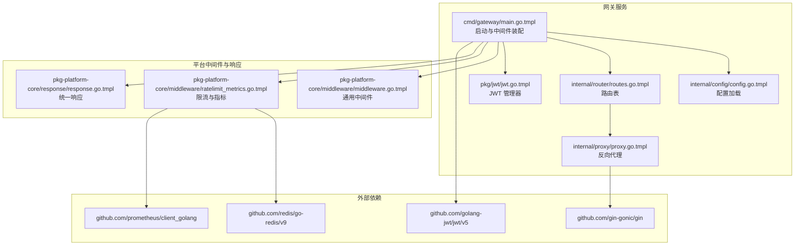
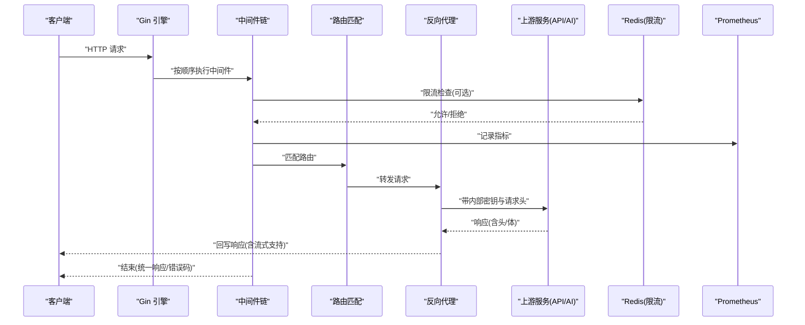
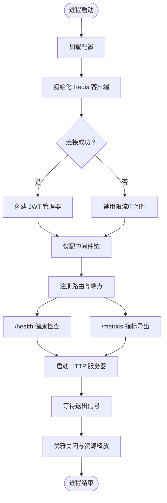
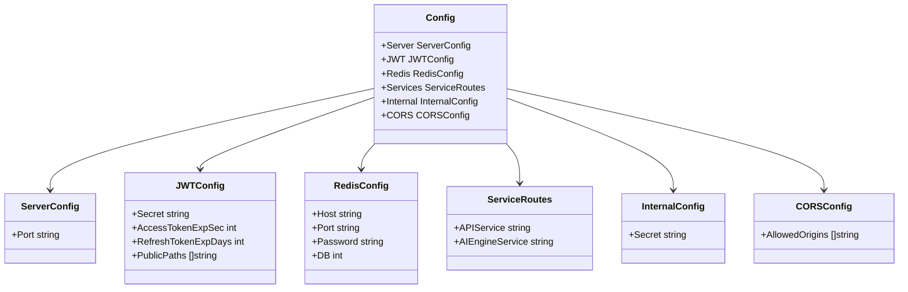
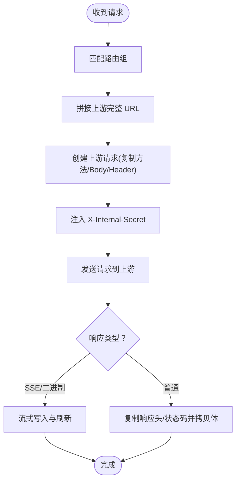
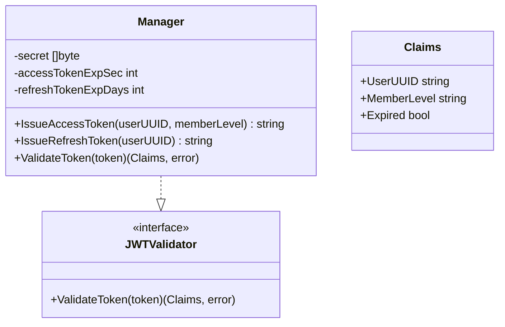
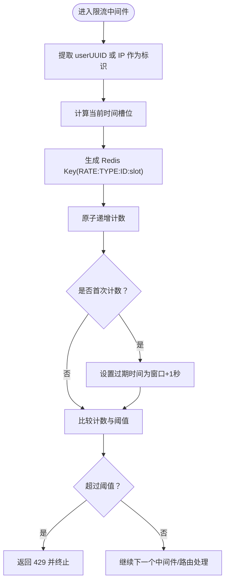
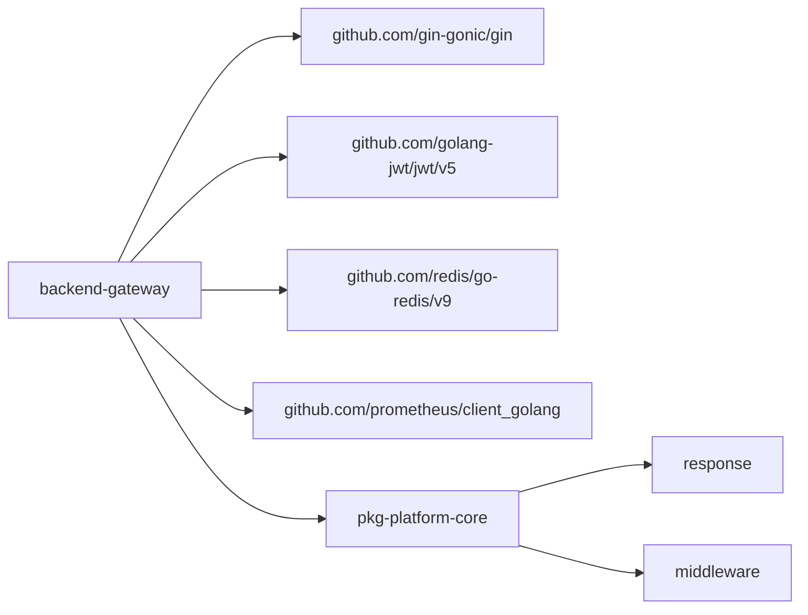

# 网关服务模板

<cite>
**本文引用的文件**
- [cmd/gateway/main.go.tmpl](file://templates/files/backend-gateway/cmd/gateway/main.go.tmpl)
- [internal/config/config.go.tmpl](file://templates/files/backend-gateway/internal/config/config.go.tmpl)
- [internal/proxy/proxy.go.tmpl](file://templates/files/backend-gateway/internal/proxy/proxy.go.tmpl)
- [internal/router/routes.go.tmpl](file://templates/files/backend-gateway/internal/router/routes.go.tmpl)
- [pkg/jwt/jwt.go.tmpl](file://templates/files/backend-gateway/pkg/jwt/jwt.go.tmpl)
- [pkg-platform-core/middleware/middleware.go.tmpl](file://templates/files/pkg-platform-core/middleware/middleware.go.tmpl)
- [pkg-platform-core/middleware/ratelimit_metrics.go.tmpl](file://templates/files/pkg-platform-core/middleware/ratelimit_metrics.go.tmpl)
- [pkg-platform-core/response/response.go.tmpl](file://templates/files/pkg-platform-core/response/response.go.tmpl)
- [backend-gateway/go.mod.tmpl](file://templates/files/backend-gateway/go.mod.tmpl)
- [backend-gateway/Dockerfile.tmpl](file://templates/files/backend-gateway/Dockerfile.tmpl)
</cite>

## 目录
1. [简介](#简介)
2. [项目结构](#项目结构)
3. [核心组件](#核心组件)
4. [架构总览](#架构总览)
5. [详细组件分析](#详细组件分析)
6. [依赖关系分析](#依赖关系分析)
7. [性能考量](#性能考量)
8. [故障排查指南](#故障排查指南)
9. [结论](#结论)
10. [附录](#附录)

## 简介
本文件面向使用 Go 语言构建的 API 网关模板，系统性阐述其启动流程、配置管理、代理转发、路由配置与安全策略（JWT、CORS、限流、Prometheus 指标），并给出微服务间通信、服务发现、健康检查与故障恢复的实践建议。文档以模板文件为依据，避免直接粘贴代码内容，所有技术细节均通过“章节来源”定位到具体文件与行号。

## 项目结构
网关服务采用模板化工程组织，核心目录与文件如下：
- 启动入口：cmd/gateway/main.go.tmpl
- 配置管理：internal/config/config.go.tmpl
- 路由与代理：internal/router/routes.go.tmpl、internal/proxy/proxy.go.tmpl
- JWT 管理：pkg/jwt/jwt.go.tmpl
- 平台中间件与统一响应：pkg-platform-core/middleware/*.go.tmpl、pkg-platform-core/response/response.go.tmpl
- 构建与依赖：backend-gateway/go.mod.tmpl、backend-gateway/Dockerfile.tmpl

图表来源
- [cmd/gateway/main.go.tmpl:30-91](file://templates/files/backend-gateway/cmd/gateway/main.go.tmpl#L30-L91)
- [internal/config/config.go.tmpl:52-86](file://templates/files/backend-gateway/internal/config/config.go.tmpl#L52-L86)
- [internal/router/routes.go.tmpl:21-56](file://templates/files/backend-gateway/internal/router/routes.go.tmpl#L21-L56)
- [internal/proxy/proxy.go.tmpl:26-66](file://templates/files/backend-gateway/internal/proxy/proxy.go.tmpl#L26-L66)
- [pkg/jwt/jwt.go.tmpl:31-87](file://templates/files/backend-gateway/pkg/jwt/jwt.go.tmpl#L31-L87)
- [pkg-platform-core/middleware/middleware.go.tmpl:24-201](file://templates/files/pkg-platform-core/middleware/middleware.go.tmpl#L24-L201)
- [pkg-platform-core/middleware/ratelimit_metrics.go.tmpl:18-113](file://templates/files/pkg-platform-core/middleware/ratelimit_metrics.go.tmpl#L18-L113)
- [pkg-platform-core/response/response.go.tmpl:26-77](file://templates/files/pkg-platform-core/response/response.go.tmpl#L26-L77)

章节来源
- [backend-gateway/go.mod.tmpl:1-16](file://templates/files/backend-gateway/go.mod.tmpl#L1-L16)

## 核心组件
- 启动与中间件链：入口负责加载配置、初始化 Redis 限流客户端、构造 JWT 管理器、装配全局中间件链（Recovery → CORS → RequestID → Metrics → JWT → RateLimit）、注册路由与健康/指标端点，并优雅关闭。
- 配置管理：集中定义服务端口、JWT 密钥与过期策略、Redis 连接参数、下游服务地址、内部密钥与 CORS 白名单等，通过环境变量动态注入。
- 路由与代理：按路径前缀将请求分发至 API 服务或 AI 引擎服务，统一注入内部密钥并透传请求头；对 SSE/binary 等流式响应进行特殊处理。
- JWT 管理：实现 access/refresh token 的签发与校验，支持公开路径白名单、过期区分与下游身份注入。
- 平台中间件：提供跨域、请求 ID、内部鉴权、限流（Redis 固定窗口）、Prometheus 指标采集等通用能力。
- 统一响应：标准化错误码与消息体结构，保持前后端一致的交互契约。

章节来源
- [cmd/gateway/main.go.tmpl:30-91](file://templates/files/backend-gateway/cmd/gateway/main.go.tmpl#L30-L91)
- [internal/config/config.go.tmpl:9-127](file://templates/files/backend-gateway/internal/config/config.go.tmpl#L9-L127)
- [internal/router/routes.go.tmpl:20-56](file://templates/files/backend-gateway/internal/router/routes.go.tmpl#L20-L56)
- [internal/proxy/proxy.go.tmpl:25-97](file://templates/files/backend-gateway/internal/proxy/proxy.go.tmpl#L25-L97)
- [pkg/jwt/jwt.go.tmpl:16-87](file://templates/files/backend-gateway/pkg/jwt/jwt.go.tmpl#L16-L87)
- [pkg-platform-core/middleware/middleware.go.tmpl:24-201](file://templates/files/pkg-platform-core/middleware/middleware.go.tmpl#L24-L201)
- [pkg-platform-core/middleware/ratelimit_metrics.go.tmpl:18-113](file://templates/files/pkg-platform-core/middleware/ratelimit_metrics.go.tmpl#L18-L113)
- [pkg-platform-core/response/response.go.tmpl:26-77](file://templates/files/pkg-platform-core/response/response.go.tmpl#L26-L77)

## 架构总览
下图展示网关启动、中间件执行、路由分发与下游调用的整体流程。

图表来源
- [cmd/gateway/main.go.tmpl:48-66](file://templates/files/backend-gateway/cmd/gateway/main.go.tmpl#L48-L66)
- [pkg-platform-core/middleware/ratelimit_metrics.go.tmpl:32-66](file://templates/files/pkg-platform-core/middleware/ratelimit_metrics.go.tmpl#L32-L66)
- [internal/router/routes.go.tmpl:21-56](file://templates/files/backend-gateway/internal/router/routes.go.tmpl#L21-L56)
- [internal/proxy/proxy.go.tmpl:26-66](file://templates/files/backend-gateway/internal/proxy/proxy.go.tmpl#L26-L66)

## 详细组件分析

### 启动流程与中间件装配
- 加载配置：从环境变量读取端口、JWT 参数、Redis 连接、下游服务地址、内部密钥与 CORS 白名单。
- 初始化 Redis：若连接失败则降级禁用限流，日志提示；成功则启用限流中间件。
- 构造 JWT 管理器：根据配置的密钥与过期策略创建。
- 装配中间件链：Recovery → CORS → RequestID → Metrics → JWT → RateLimit（可选）。
- 注册路由与端点：调用路由配置函数；暴露 /health 与 /metrics。
- 优雅关闭：监听信号，超时后强制关闭，释放资源。

图表来源
- [cmd/gateway/main.go.tmpl:30-91](file://templates/files/backend-gateway/cmd/gateway/main.go.tmpl#L30-L91)

章节来源
- [cmd/gateway/main.go.tmpl:30-91](file://templates/files/backend-gateway/cmd/gateway/main.go.tmpl#L30-L91)

### 配置管理
- 配置结构：包含 Server、JWT、Redis、Services、Internal、CORS 等子配置。
- 环境变量读取：提供默认值与严格类型转换；敏感密钥缺失会直接导致启动失败。
- 默认公开路径：/health、/api/v1/auth、/oauth2/、/login/oauth2/、/internal/、/admin 等。
- 下游服务地址：API 与 AI Engine 的基础 URL，用于代理转发。

图表来源
- [internal/config/config.go.tmpl:9-50](file://templates/files/backend-gateway/internal/config/config.go.tmpl#L9-L50)

章节来源
- [internal/config/config.go.tmpl:52-127](file://templates/files/backend-gateway/internal/config/config.go.tmpl#L52-L127)

### 路由配置与代理转发
- 路由规则：按前缀将 /api/v1/auth、/oauth2/authorize、/login/oauth2/code、/api/v1/users/files/search/track、/admin、/internal 等映射到 API 服务；在启用 AI 引擎特性时，将 /api/v1/chat/generate 映射到 AI 引擎。
- 代理行为：拼接上游完整 URL，透传请求方法、Body、Header；注入 X-Internal-Secret；对 SSE 与二进制流进行特殊处理，确保客户端能实时接收数据。
- 流式响应：检测 Content-Type，设置必要的响应头并逐块写入与刷新，避免 Nginx 等代理缓冲。

图表来源
- [internal/router/routes.go.tmpl:21-56](file://templates/files/backend-gateway/internal/router/routes.go.tmpl#L21-L56)
- [internal/proxy/proxy.go.tmpl:26-97](file://templates/files/backend-gateway/internal/proxy/proxy.go.tmpl#L26-L97)

章节来源
- [internal/router/routes.go.tmpl:20-56](file://templates/files/backend-gateway/internal/router/routes.go.tmpl#L20-L56)
- [internal/proxy/proxy.go.tmpl:25-97](file://templates/files/backend-gateway/internal/proxy/proxy.go.tmpl#L25-L97)

### JWT 认证集成
- 管理器职责：签发短期 access token 与长期 refresh token；校验 token 并区分过期与无效；将用户标识注入下游请求头。
- 中间件行为：对公开路径仅尝试解析 token 注入身份；对受保护路径要求有效 token；当携带 refresh cookie 且 access 过期时返回 403 以便前端刷新。
- 载荷结构：包含用户 UUID、会员等级与标准声明；下游可通过 X-User-UUID、X-Member-Level 获取身份信息。

图表来源
- [pkg/jwt/jwt.go.tmpl:16-87](file://templates/files/backend-gateway/pkg/jwt/jwt.go.tmpl#L16-L87)
- [pkg-platform-core/middleware/middleware.go.tmpl:104-163](file://templates/files/pkg-platform-core/middleware/middleware.go.tmpl#L104-L163)

章节来源
- [pkg/jwt/jwt.go.tmpl:30-87](file://templates/files/backend-gateway/pkg/jwt/jwt.go.tmpl#L30-L87)
- [pkg-platform-core/middleware/middleware.go.tmpl:102-163](file://templates/files/pkg-platform-core/middleware/middleware.go.tmpl#L102-L163)

### 限流机制与熔断器模式
- 限流策略：固定窗口限流，基于 Redis 计数，按用户 UUID 或 IP 作为标识；Redis 异常时 fail-open（不阻断请求）。
- 窗口计算：以秒为单位的时间戳整除窗口长度得到槽位；每个槽位独立计数并设置过期时间。
- 熔断器模式：当前实现为 fail-open 的限流降级，不引入第三方熔断器库；若上游不稳定，建议结合外部熔断器或 Hystrix 模式在上游服务实现。

图表来源
- [pkg-platform-core/middleware/ratelimit_metrics.go.tmpl:32-66](file://templates/files/pkg-platform-core/middleware/ratelimit_metrics.go.tmpl#L32-L66)

章节来源
- [pkg-platform-core/middleware/ratelimit_metrics.go.tmpl:18-113](file://templates/files/pkg-platform-core/middleware/ratelimit_metrics.go.tmpl#L18-L113)

### 负载均衡策略
- 当前实现：网关侧未内置负载均衡；通过配置多个上游实例地址并在上游服务（如 API/AI Engine）侧实现负载均衡（如 Nginx、Kubernetes Service）。
- 建议：在上游服务暴露稳定域名或服务名，网关配置为单一入口，由上游服务集群完成实际的实例选择与健康检查。

章节来源
- [internal/config/config.go.tmpl:77-84](file://templates/files/backend-gateway/internal/config/config.go.tmpl#L77-L84)
- [internal/router/routes.go.tmpl:21-56](file://templates/files/backend-gateway/internal/router/routes.go.tmpl#L21-L56)

### 监控与指标
- 指标维度：http_requests_total（方法、路径、状态）、http_request_duration_seconds（直方图）、http_requests_in_flight（并发）。
- 采集位置：在中间件中记录开始/结束、状态码与耗时；路径未匹配时标记为 “unmatched”。

章节来源
- [pkg-platform-core/middleware/ratelimit_metrics.go.tmpl:68-113](file://templates/files/pkg-platform-core/middleware/ratelimit_metrics.go.tmpl#L68-L113)
- [cmd/gateway/main.go.tmpl:66-66](file://templates/files/backend-gateway/cmd/gateway/main.go.tmpl#L66-L66)

### 统一响应与错误码
- 统一结构：{code, msg, data}；HTTP 状态码与业务错误码分离。
- 常见场景：401 未授权、403 禁止（含 token 过期）、400 业务错误、406 订阅相关、500 服务端错误等。

章节来源
- [pkg-platform-core/response/response.go.tmpl:26-77](file://templates/files/pkg-platform-core/response/response.go.tmpl#L26-L77)

### 微服务间通信、安全策略与部署
- 微服务间通信：网关通过 X-Internal-Secret 校验保护内部域；下游服务可据此信任来自网关的请求。
- 安全策略：CORS 白名单与凭证支持；JWT Bearer 校验；内部密钥常量时间比较；请求 ID 全链路追踪。
- 部署：Docker 多阶段构建，静态镜像运行，暴露网关端口。

章节来源
- [pkg-platform-core/middleware/middleware.go.tmpl:49-100](file://templates/files/pkg-platform-core/middleware/middleware.go.tmpl#L49-L100)
- [pkg-platform-core/middleware/middleware.go.tmpl:49-68](file://templates/files/pkg-platform-core/middleware/middleware.go.tmpl#L49-L68)
- [backend-gateway/Dockerfile.tmpl:1-14](file://templates/files/backend-gateway/Dockerfile.tmpl#L1-L14)

## 依赖关系分析
- 模块依赖：网关模块依赖 Gin、JWT、Redis、Prometheus 与平台中间件库；可替换为本地路径以支持开发调试。
- 组件耦合：启动入口与配置、路由、代理、JWT 管理器紧密耦合；中间件与响应模块被广泛复用。

图表来源
- [backend-gateway/go.mod.tmpl:5-15](file://templates/files/backend-gateway/go.mod.tmpl#L5-L15)

章节来源
- [backend-gateway/go.mod.tmpl:1-16](file://templates/files/backend-gateway/go.mod.tmpl#L1-L16)

## 性能考量
- 代理客户端：共享 HTTP 客户端，设置合理的空闲连接上限与超时，减少连接抖动。
- 流式响应：SSE/binary 场景下逐块写入并刷新，避免缓冲导致延迟。
- 限流降级：Redis 异常时 fail-open，保障可用性；建议在上游增加重试与熔断。
- 指标采集：低开销直方图桶分布，避免过度采样影响性能。

章节来源
- [internal/proxy/proxy.go.tmpl:13-23](file://templates/files/backend-gateway/internal/proxy/proxy.go.tmpl#L13-L23)
- [internal/proxy/proxy.go.tmpl:68-96](file://templates/files/backend-gateway/internal/proxy/proxy.go.tmpl#L68-L96)
- [pkg-platform-core/middleware/ratelimit_metrics.go.tmpl:32-66](file://templates/files/pkg-platform-core/middleware/ratelimit_metrics.go.tmpl#L32-L66)

## 故障排查指南
- 启动失败：检查 JWT_SECRET 是否设置；确认端口与上游服务可达。
- 限流异常：Redis 连接失败会降级；检查 Redis 地址、密码与网络连通性。
- 跨域问题：确认 CORS_ORIGINS 是否包含前端访问源；OPTIONS 预检是否返回正确头。
- JWT 过期：前端应根据 403 提示触发刷新流程；检查 access/refresh 过期策略。
- 内部域不可访问：确认 X-Internal-Secret 是否正确传递与校验。

章节来源
- [internal/config/config.go.tmpl:95-100](file://templates/files/backend-gateway/internal/config/config.go.tmpl#L95-L100)
- [cmd/gateway/main.go.tmpl:39-44](file://templates/files/backend-gateway/cmd/gateway/main.go.tmpl#L39-L44)
- [pkg-platform-core/middleware/middleware.go.tmpl:70-100](file://templates/files/pkg-platform-core/middleware/middleware.go.tmpl#L70-L100)
- [pkg-platform-core/middleware/middleware.go.tmpl:124-163](file://templates/files/pkg-platform-core/middleware/middleware.go.tmpl#L124-L163)
- [pkg-platform-core/middleware/middleware.go.tmpl:49-68](file://templates/files/pkg-platform-core/middleware/middleware.go.tmpl#L49-L68)

## 结论
该网关模板以 Gin 为核心，结合平台中间件库实现了高内聚的安全与可观测能力：统一的 JWT 认证、CORS、限流与指标采集；通过代理模块实现对 API 与 AI 引擎的透明转发，并提供流式响应支持。建议在生产环境中配合上游服务的负载均衡与熔断策略，完善服务发现与健康检查机制，持续优化限流阈值与指标告警。

## 附录
- 健康检查：/health 返回服务状态。
- 指标导出：/metrics 返回 Prometheus 格式指标。
- 构建镜像：多阶段构建，静态二进制运行于非 root 用户。

章节来源
- [cmd/gateway/main.go.tmpl:63-66](file://templates/files/backend-gateway/cmd/gateway/main.go.tmpl#L63-L66)
- [backend-gateway/Dockerfile.tmpl:1-14](file://templates/files/backend-gateway/Dockerfile.tmpl#L1-L14)