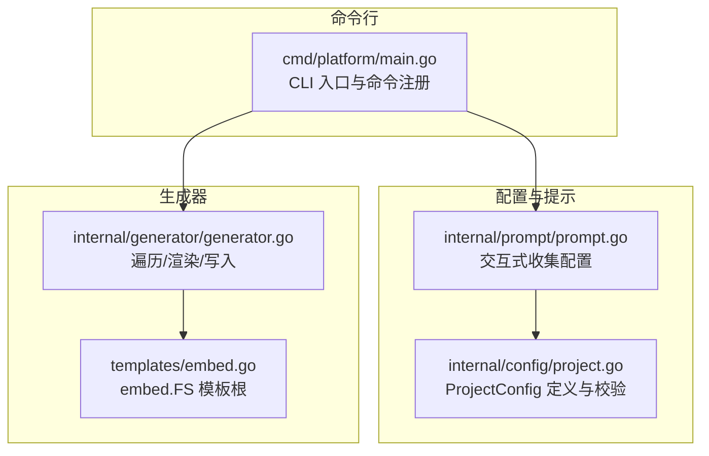
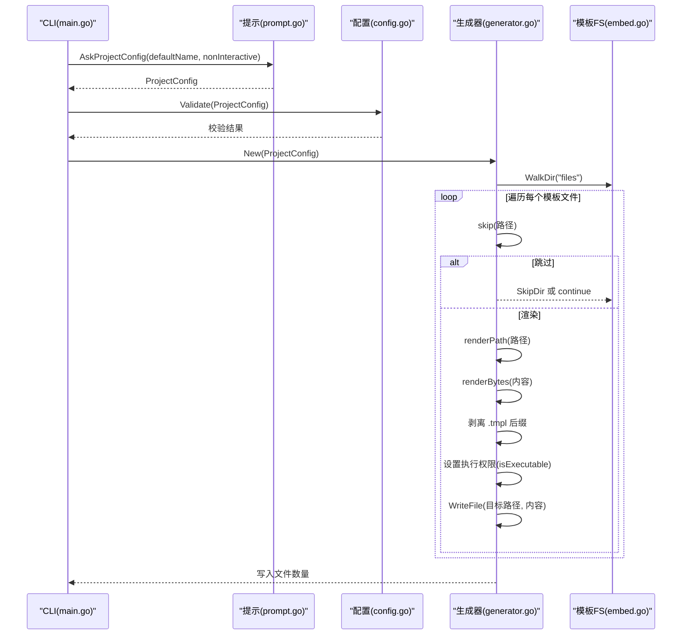
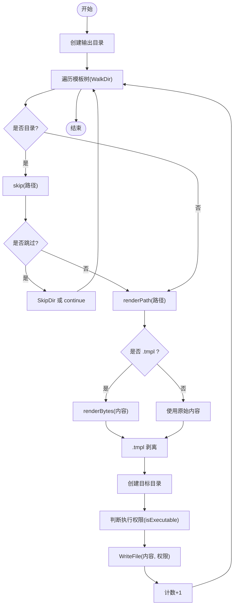
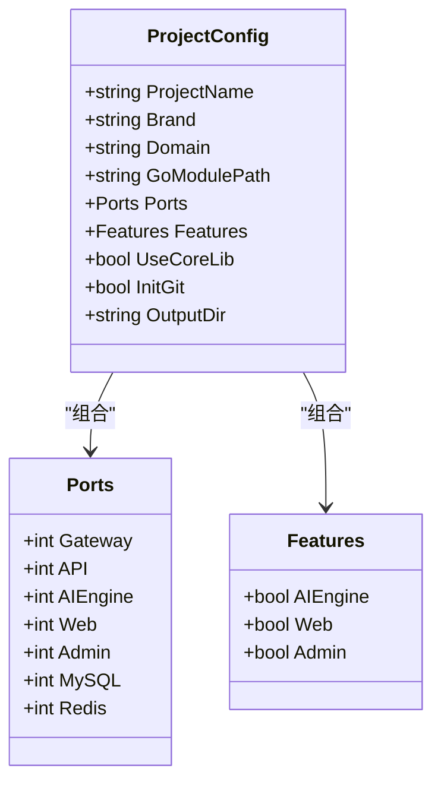
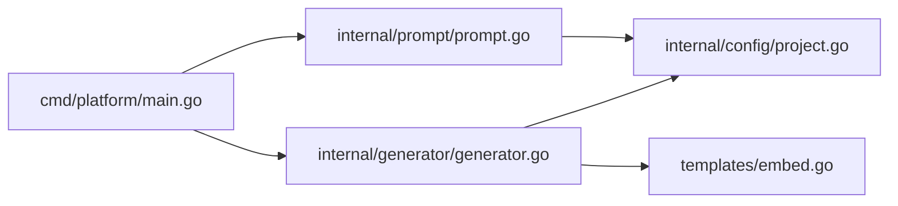

# 模板系统

<cite>
**本文引用的文件**
- [cmd/platform/main.go](file://cmd/platform/main.go)
- [internal/generator/generator.go](file://internal/generator/generator.go)
- [internal/config/project.go](file://internal/config/project.go)
- [internal/prompt/prompt.go](file://internal/prompt/prompt.go)
- [templates/embed.go](file://templates/embed.go)
- [templates/files/backend-api/cmd/api/main.go.tmpl](file://templates/files/backend-api/cmd/api/main.go.tmpl)
- [templates/files/backend-api/internal/config/config.go.tmpl](file://templates/files/backend-api/internal/config/config.go.tmpl)
- [templates/files/backend-ai-engine/app/main.py.tmpl](file://templates/files/backend-ai-engine/app/main.py.tmpl)
- [templates/files/frontend-web/package.json.tmpl](file://templates/files/frontend-web/package.json.tmpl)
- [templates/files/deploy/local/docker-compose-all.yaml.tmpl](file://templates/files/deploy/local/docker-compose-all.yaml.tmpl)
</cite>

## 目录
1. [简介](#简介)
2. [项目结构](#项目结构)
3. [核心组件](#核心组件)
4. [架构总览](#架构总览)
5. [详细组件分析](#详细组件分析)
6. [依赖分析](#依赖分析)
7. [性能考虑](#性能考虑)
8. [故障排查指南](#故障排查指南)
9. [结论](#结论)
10. [附录](#附录)

## 简介
本模板系统是一个多语言、多组件的脚手架生成器，支持一次性生成 Go 网关、Go API、Python AI 引擎、Next.js 前端与 React Admin 管理端，并配套本地与 K3s 部署、数据库初始化与公共组件库。其核心特性包括：
- 模板内嵌：所有模板以嵌入方式打包进二进制，无需外部资源即可运行。
- 统一渲染：使用 Go 的 text/template 对文件路径与文件内容进行统一渲染。
- 条件生成：通过 Features 与 UseCoreLib 控制子树跳过，实现按需生成。
- 变量系统：以 ProjectConfig 为唯一数据源，贯穿所有模板。

## 项目结构
模板系统采用“命令行入口 + 配置收集 + 生成器 + 模板内嵌”的分层组织：
- 命令行入口负责参数解析与流程编排。
- 配置模块定义模板变量与校验规则。
- 提示模块负责交互式收集用户输入。
- 生成器负责遍历模板树、渲染与落盘。
- 模板内嵌模块负责将 templates/files 下的模板打包进二进制。

图表来源
- [cmd/platform/main.go:22-87](file://cmd/platform/main.go#L22-L87)
- [internal/config/project.go:12-121](file://internal/config/project.go#L12-L121)
- [internal/prompt/prompt.go:13-105](file://internal/prompt/prompt.go#L13-L105)
- [internal/generator/generator.go:33-103](file://internal/generator/generator.go#L33-L103)
- [templates/embed.go:6-12](file://templates/embed.go#L6-L12)

章节来源
- [cmd/platform/main.go:22-87](file://cmd/platform/main.go#L22-L87)
- [internal/config/project.go:12-121](file://internal/config/project.go#L12-L121)
- [internal/prompt/prompt.go:13-105](file://internal/prompt/prompt.go#L13-L105)
- [internal/generator/generator.go:33-103](file://internal/generator/generator.go#L33-L103)
- [templates/embed.go:6-12](file://templates/embed.go#L6-L12)

## 核心组件
- ProjectConfig：模板变量的唯一数据源，包含项目名、品牌名、域名、Go Module 路径、端口集合、功能开关、是否使用公共库、是否初始化 Git、输出目录等。
- 生成器 Generator：负责遍历嵌入的模板树，按规则渲染路径与内容，剥离 .tmpl 后缀，设置执行权限，写入目标目录。
- 提示 Prompt：使用交互式表单收集用户输入，支持非交互模式（--yes）。
- 模板内嵌 Templates：通过 embed.FS 将 templates/files 整体打包为只读文件系统。

章节来源
- [internal/config/project.go:12-121](file://internal/config/project.go#L12-L121)
- [internal/generator/generator.go:23-158](file://internal/generator/generator.go#L23-L158)
- [internal/prompt/prompt.go:13-105](file://internal/prompt/prompt.go#L13-L105)
- [templates/embed.go:6-12](file://templates/embed.go#L6-L12)

## 架构总览
模板系统的核心流程如下：
- CLI 解析 init 命令，调用提示模块收集配置。
- 校验配置后创建生成器实例，开始遍历模板树。
- 对每个文件：
  - 若路径含模板变量则先渲染路径。
  - 若文件以 .tmpl 结尾则渲染内容；否则直接使用原始内容。
  - 剥离 .tmpl 后缀，创建目标目录，写入文件（根据扩展名设置执行权限）。
- 跳过规则：根据 Features 与 UseCoreLib 决定是否跳过对应子树。

图表来源
- [cmd/platform/main.go:48-81](file://cmd/platform/main.go#L48-L81)
- [internal/prompt/prompt.go:13-105](file://internal/prompt/prompt.go#L13-L105)
- [internal/config/project.go:91-106](file://internal/config/project.go#L91-L106)
- [internal/generator/generator.go:33-103](file://internal/generator/generator.go#L33-L103)
- [templates/embed.go:6-12](file://templates/embed.go#L6-L12)

## 详细组件分析

### 生成器（Generator）
- 职责
  - 遍历模板树，渲染路径与内容。
  - 根据 Features 与 UseCoreLib 进行条件跳过。
  - 剥离 .tmpl 后缀，设置执行权限，写入磁盘。
- 关键点
  - 路径渲染：当路径包含模板变量时，使用 text/template 渲染路径字符串。
  - 内容渲染：对 .tmpl 文件使用 text/template 渲染字节流。
  - 权限控制：以 .sh 结尾的文件赋予执行权限。
  - 跳过规则：AIEngine/Web/Admin/CoreLib 四类子树受开关控制。

图表来源
- [internal/generator/generator.go:33-103](file://internal/generator/generator.go#L33-L103)
- [internal/generator/generator.go:105-120](file://internal/generator/generator.go#L105-L120)
- [internal/generator/generator.go:122-147](file://internal/generator/generator.go#L122-L147)
- [internal/generator/generator.go:154-157](file://internal/generator/generator.go#L154-L157)

章节来源
- [internal/generator/generator.go:23-158](file://internal/generator/generator.go#L23-L158)

### 配置系统（ProjectConfig）
- 字段说明
  - ProjectName：项目名（kebab-case），用于目录名、Docker 服务名、K8s Namespace。
  - Brand：展示用品牌名，用于 README、UI 标题等。
  - Domain：服务域名，用于 CORS 白名单、Cookie Domain、Cloudflare Worker 名称。
  - GoModulePath：Go 服务的 module 路径前缀。
  - Ports：各服务监听端口集合（Gateway、API、AIEngine、Web、Admin、MySQL、Redis）。
  - Features：模块开关（AIEngine、Web、Admin）。
  - UseCoreLib：是否引入公共组件库 pkg-platform-core。
  - InitGit：生成完成后是否初始化 Git。
  - OutputDir：实际写入的目标目录。
- 校验规则
  - ProjectName 必须为 kebab-case。
  - Brand、GoModulePath 非空。
  - Gateway 与 API 端口必须大于 0。

图表来源
- [internal/config/project.go:12-60](file://internal/config/project.go#L12-L60)

章节来源
- [internal/config/project.go:12-121](file://internal/config/project.go#L12-L121)

### 提示与交互（Prompt）
- 功能
  - 交互式收集 ProjectName、Brand、Domain、GoModulePath、端口等。
  - 支持多选模块（ai-engine、web、admin、core-lib）。
  - 支持非交互模式（--yes），但必须显式指定项目名。
- 校验
  - 输入非空校验。
  - 端口字符串转整型并校验大于 0。

章节来源
- [internal/prompt/prompt.go:13-105](file://internal/prompt/prompt.go#L13-L105)

### 模板内嵌（Templates）
- 机制
  - 使用 embed.FS 将 templates/files 整体内嵌，遍历时得到的相对路径即为目标项目中的相对路径。
  - 通过 templates/embed.go 暴露 FS，供生成器读取。

章节来源
- [templates/embed.go:6-12](file://templates/embed.go#L6-L12)

### 模板类型与用途概览
- Go 模板
  - 示例：Go API 入口、配置加载、模块声明等。
  - 特点：使用 Go 的 text/template 渲染，变量来自 ProjectConfig。
- Python 模板
  - 示例：FastAPI 应用入口、中间件链、异常处理等。
  - 特点：渲染后生成可直接运行的 Python 应用骨架。
- TypeScript/Next.js 模板
  - 示例：package.json、Next 配置等。
  - 特点：渲染脚本与端口变量，适配本地开发与构建流程。
- 部署与编排模板
  - 示例：docker-compose、K3s YAML、Shell 启动脚本等。
  - 特点：渲染服务名、端口、卷挂载等，适配本地与集群部署。

章节来源
- [templates/files/backend-api/cmd/api/main.go.tmpl:1-56](file://templates/files/backend-api/cmd/api/main.go.tmpl#L1-L56)
- [templates/files/backend-api/internal/config/config.go.tmpl:1-82](file://templates/files/backend-api/internal/config/config.go.tmpl#L1-L82)
- [templates/files/backend-ai-engine/app/main.py.tmpl:1-67](file://templates/files/backend-ai-engine/app/main.py.tmpl#L1-L67)
- [templates/files/frontend-web/package.json.tmpl:1-25](file://templates/files/frontend-web/package.json.tmpl#L1-L25)
- [templates/files/deploy/local/docker-compose-all.yaml.tmpl:1-48](file://templates/files/deploy/local/docker-compose-all.yaml.tmpl#L1-L48)

## 依赖分析
- 组件耦合
  - CLI 依赖提示与配置模块；生成器依赖配置与模板内嵌；提示模块依赖配置模块。
- 外部依赖
  - Cobra：命令行框架。
  - charmbracelet/huh：交互式表单。
  - Go 标准库：text/template、embed、fs、os、path/filepath、strings、regexp 等。
- 潜在环路
  - 当前模块间为单向依赖，无循环导入风险。

图表来源
- [cmd/platform/main.go:15-18](file://cmd/platform/main.go#L15-L18)
- [internal/generator/generator.go:19-21](file://internal/generator/generator.go#L19-L21)
- [internal/prompt/prompt.go:8-11](file://internal/prompt/prompt.go#L8-L11)
- [internal/config/project.go:6-10](file://internal/config/project.go#L6-L10)
- [templates/embed.go:4-5](file://templates/embed.go#L4-L5)

章节来源
- [cmd/platform/main.go:15-18](file://cmd/platform/main.go#L15-L18)
- [internal/generator/generator.go:19-21](file://internal/generator/generator.go#L19-L21)
- [internal/prompt/prompt.go:8-11](file://internal/prompt/prompt.go#L8-L11)
- [internal/config/project.go:6-10](file://internal/config/project.go#L6-L10)
- [templates/embed.go:4-5](file://templates/embed.go#L4-L5)

## 性能考虑
- 模板内嵌
  - 优点：减少外部依赖，单二进制可运行；缺点：二进制体积增大。
- 渲染策略
  - 路径与内容均使用 text/template，建议避免在模板中进行复杂计算，将逻辑前置到配置阶段。
- I/O 行为
  - 生成器对每个文件进行一次读取与一次写入，整体 I/O 成本与文件数量线性相关。
- 并发
  - 当前实现为顺序遍历，若模板数量较大，可考虑并发写入（注意目录创建与权限设置的并发安全）。

## 故障排查指南
- 常见错误与定位
  - 配置不合法：检查 ProjectName、Brand、GoModulePath、端口等字段是否满足校验规则。
  - 渲染失败：检查模板中使用的变量是否存在于 ProjectConfig；确认 .tmpl 后缀是否正确。
  - 路径渲染失败：确认路径中包含的模板变量拼写与作用域。
  - 权限问题：确认 .sh 文件是否正确赋予执行权限。
- 调试建议
  - 在生成器中增加日志输出，记录每个文件的渲染结果与写入状态。
  - 将部分模板临时移出 .tmpl 后缀以便查看原始内容，定位渲染问题。
  - 使用最小化配置（仅开启必要模块）快速定位问题模块。

章节来源
- [internal/config/project.go:91-106](file://internal/config/project.go#L91-L106)
- [internal/generator/generator.go:63-85](file://internal/generator/generator.go#L63-L85)
- [internal/generator/generator.go:122-147](file://internal/generator/generator.go#L122-L147)

## 结论
该模板系统通过“配置驱动 + 统一渲染 + 条件生成”的设计，在保证跨语言一致性的同时，提供了高度可定制的脚手架能力。借助嵌入式模板与清晰的模块边界，开发者可以快速生成包含多语言组件与部署方案的完整项目骨架，并在此基础上进行二次开发与扩展。

## 附录

### 模板变量清单与示例
- ProjectName：项目名（kebab-case），用于目录名、服务名等。
- Brand：展示用品牌名，用于标题、注释等。
- Domain：域名，用于 CORS、Cookie Domain 等。
- GoModulePath：Go 模块路径前缀，用于 go.mod 与 import 路径。
- Ports：端口集合，包含 Gateway、API、AIEngine、Web、Admin、MySQL、Redis。
- Features：模块开关，控制 AIEngine、Web、Admin 子树生成。
- UseCoreLib：是否引入公共组件库 pkg-platform-core。
- InitGit：是否初始化 Git 仓库。
- OutputDir：输出目录（由 CLI 注入）。

章节来源
- [internal/config/project.go:12-60](file://internal/config/project.go#L12-L60)

### 模板定制指南
- 新增模板变量
  - 在 ProjectConfig 中添加字段，并在交互提示中补充输入项与校验。
- 新增模板类型
  - 在 templates/files 下新增对应语言的模板文件，遵循 .tmpl 后缀约定。
- 条件渲染
  - 使用 skip 规则控制子树生成；在模板中通过变量进行分支控制。
- 扩展方法
  - 在生成器中扩展渲染逻辑（如新增后缀处理、特殊权限设置）。
  - 在提示模块中新增交互选项，完善配置收集。

章节来源
- [internal/generator/generator.go:105-120](file://internal/generator/generator.go#L105-L120)
- [internal/prompt/prompt.go:43-104](file://internal/prompt/prompt.go#L43-L104)

### 最佳实践
- 保持模板简洁：将复杂逻辑放入配置与提示阶段。
- 明确变量命名：统一使用 ProjectConfig 字段，避免硬编码。
- 分层组织：按语言与功能拆分子目录，便于维护与扩展。
- 文档同步：模板注释与 README 保持一致，提升可读性。