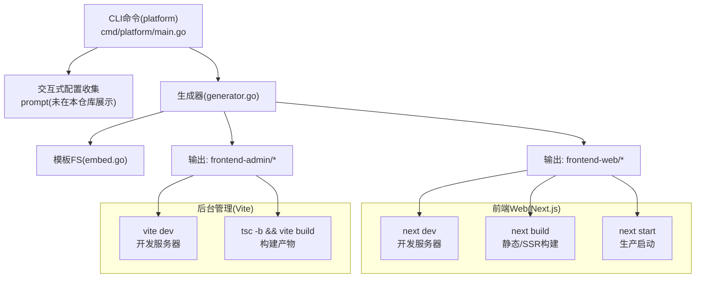
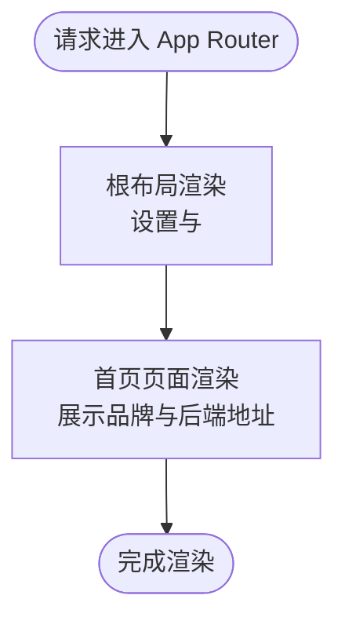
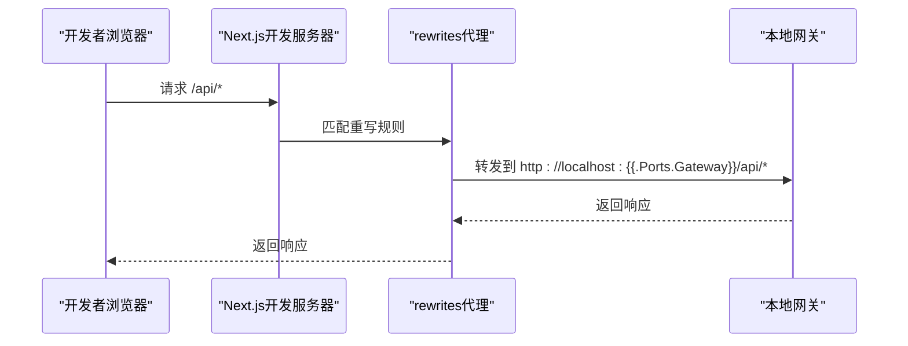
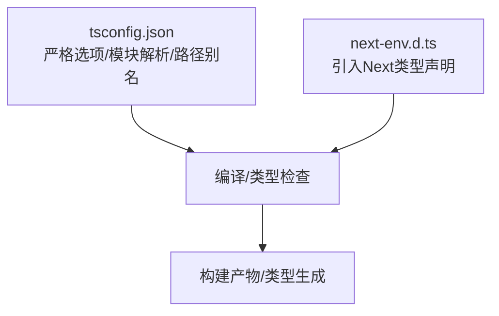
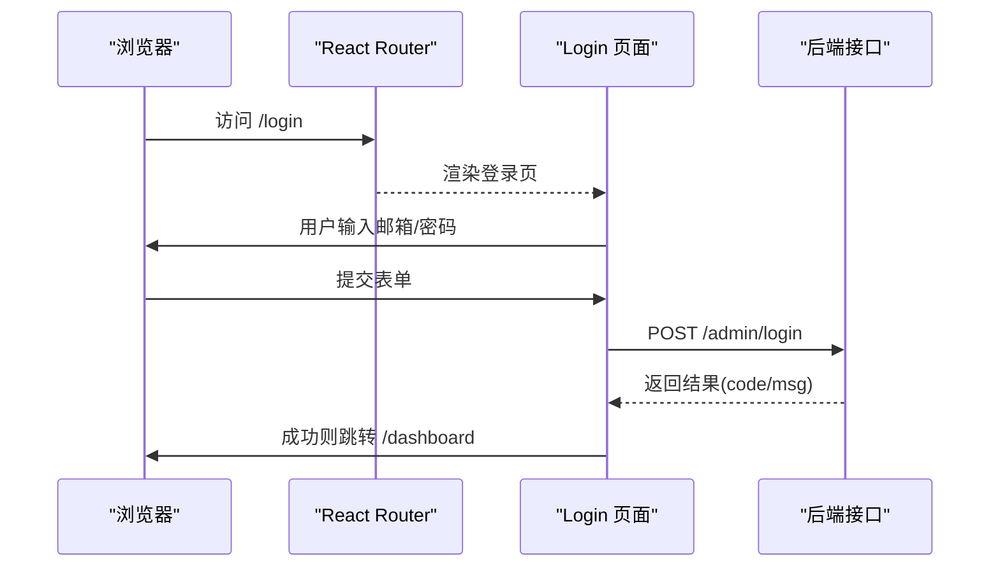
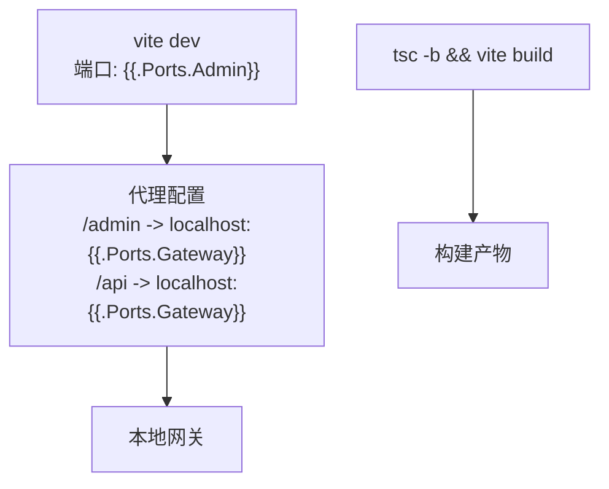
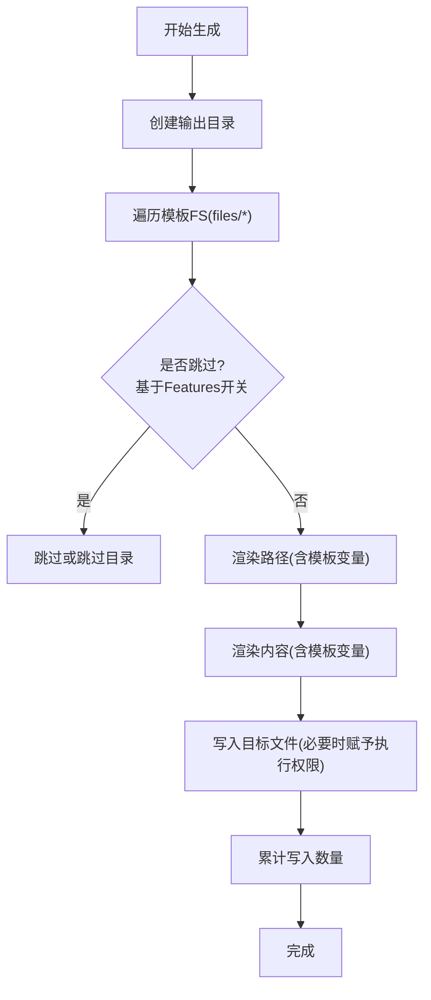
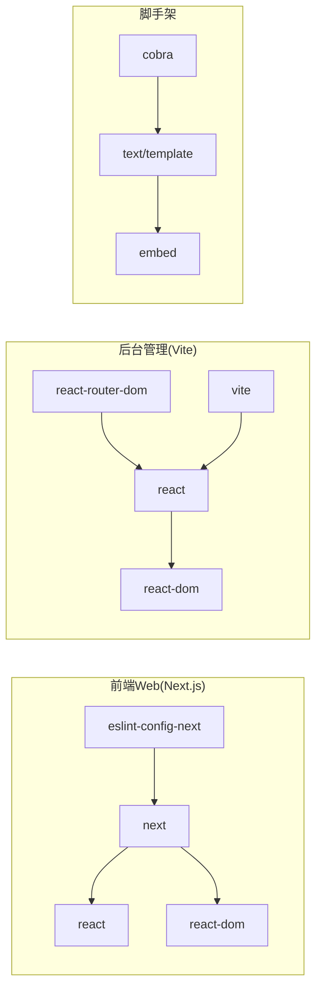

# Web前端应用

<cite>
**本文引用的文件**
- [layout.tsx.tmpl](file://templates/files/frontend-web/src/app/layout.tsx.tmpl)
- [page.tsx.tmpl](file://templates/files/frontend-web/src/app/page.tsx.tmpl)
- [next.config.mjs.tmpl](file://templates/files/frontend-web/next.config.mjs.tmpl)
- [tsconfig.json](file://templates/files/frontend-web/tsconfig.json)
- [package.json.tmpl](file://templates/files/frontend-web/package.json.tmpl)
- [next-env.d.ts](file://templates/files/frontend-web/next-env.d.ts)
- [main.tsx](file://templates/files/frontend-admin/src/main.tsx)
- [Dashboard.tsx.tmpl](file://templates/files/frontend-admin/src/pages/Dashboard.tsx.tmpl)
- [Login.tsx.tmpl](file://templates/files/frontend-admin/src/pages/Login.tsx.tmpl)
- [vite.config.ts.tmpl](file://templates/files/frontend-admin/vite.config.ts.tmpl)
- [index.html.tmpl](file://templates/files/frontend-admin/index.html.tmpl)
- [package.json.tmpl](file://templates/files/frontend-admin/package.json.tmpl)
- [tsconfig.json](file://templates/files/frontend-admin/tsconfig.json)
- [generator.go](file://internal/generator/generator.go)
- [main.go](file://cmd/platform/main.go)
- [embed.go](file://templates/embed.go)
</cite>

## 目录
1. [简介](#简介)
2. [项目结构](#项目结构)
3. [核心组件](#核心组件)
4. [架构总览](#架构总览)
5. [组件详解](#组件详解)
6. [依赖关系分析](#依赖关系分析)
7. [性能与构建优化](#性能与构建优化)
8. [SEO与可访问性](#seo与可访问性)
9. [故障排查指南](#故障排查指南)
10. [结论](#结论)
11. [附录](#附录)

## 简介
本文件面向基于 Next.js 的现代 Web 前端应用，围绕 App Router 模式、布局与页面组件、TypeScript 配置、构建与开发流程、组件化与状态管理、UI 组件库集成、路由与 SEO、性能调优、响应式与可访问性等主题，结合仓库中的模板文件进行系统化说明。同时给出与脚手架生成器的衔接点，帮助读者理解从“模板到产物”的完整链路。

## 项目结构
该仓库采用“模板内嵌 + 生成器渲染”的方式，将前端 Web 应用与后台管理应用的模板统一打包为嵌入资源，运行时根据用户配置渲染出最终项目。前端 Web 使用 Next.js App Router；后台管理采用 Vite + React Router DOM。

```mermaid
graph TB
subgraph "脚手架与模板"
EMBED["templates/embed.go<br/>嵌入模板FS"]
GEN["internal/generator/generator.go<br/>生成器"]
MAINC["cmd/platform/main.go<br/>CLI入口"]
end
subgraph "前端Web(Next.js)"
WEB_PKG["frontend-web/package.json.tmpl"]
WEB_TS["frontend-web/tsconfig.json"]
WEB_NEXT["frontend-web/next.config.mjs.tmpl"]
WEB_ENV["frontend-web/next-env.d.ts"]
WEB_LAYOUT["frontend-web/src/app/layout.tsx.tmpl"]
WEB_PAGE["frontend-web/src/app/page.tsx.tmpl"]
end
subgraph "后台管理(Vite)"
ADMIN_MAIN["frontend-admin/src/main.tsx"]
ADMIN_LOGIN["frontend-admin/src/pages/Login.tsx.tmpl"]
ADMIN_DASH["frontend-admin/src/pages/Dashboard.tsx.tmpl"]
ADMIN_VITE["frontend-admin/vite.config.ts.tmpl"]
ADMIN_INDEX["frontend-admin/index.html.tmpl"]
ADMIN_PKG["frontend-admin/package.json.tmpl"]
ADMIN_TS["frontend-admin/tsconfig.json"]
end
MAINC --> GEN
GEN --> EMBED
GEN --> WEB_PKG
GEN --> WEB_TS
GEN --> WEB_NEXT
GEN --> WEB_ENV
GEN --> WEB_LAYOUT
GEN --> WEB_PAGE
GEN --> ADMIN_MAIN
GEN --> ADMIN_LOGIN
GEN --> ADMIN_DASH
GEN --> ADMIN_VITE
GEN --> ADMIN_INDEX
GEN --> ADMIN_PKG
GEN --> ADMIN_TS
```

图示来源
- [embed.go:1-12](file://templates/embed.go#L1-L12)
- [generator.go:1-158](file://internal/generator/generator.go#L1-L158)
- [main.go:1-98](file://cmd/platform/main.go#L1-L98)
- [package.json.tmpl:1-25](file://templates/files/frontend-web/package.json.tmpl#L1-L25)
- [tsconfig.json:1-22](file://templates/files/frontend-web/tsconfig.json#L1-L22)
- [next.config.mjs.tmpl:1-13](file://templates/files/frontend-web/next.config.mjs.tmpl#L1-L13)
- [next-env.d.ts:1-3](file://templates/files/frontend-web/next-env.d.ts#L1-L3)
- [layout.tsx.tmpl:1-13](file://templates/files/frontend-web/src/app/layout.tsx.tmpl#L1-L13)
- [page.tsx.tmpl:1-18](file://templates/files/frontend-web/src/app/page.tsx.tmpl#L1-L18)
- [main.tsx:1-18](file://templates/files/frontend-admin/src/main.tsx#L1-L18)
- [Login.tsx.tmpl:1-63](file://templates/files/frontend-admin/src/pages/Login.tsx.tmpl#L1-L63)
- [Dashboard.tsx.tmpl:1-59](file://templates/files/frontend-admin/src/pages/Dashboard.tsx.tmpl#L1-L59)
- [vite.config.ts.tmpl:1-14](file://templates/files/frontend-admin/vite.config.ts.tmpl#L1-L14)
- [index.html.tmpl:1-13](file://templates/files/frontend-admin/index.html.tmpl#L1-L13)
- [package.json.tmpl:1-24](file://templates/files/frontend-admin/package.json.tmpl#L1-L24)
- [tsconfig.json:1-21](file://templates/files/frontend-admin/tsconfig.json#L1-L21)

章节来源
- [embed.go:1-12](file://templates/embed.go#L1-L12)
- [generator.go:1-158](file://internal/generator/generator.go#L1-L158)
- [main.go:1-98](file://cmd/platform/main.go#L1-L98)

## 核心组件
- Next.js 前端 Web
  - App Router 布局与页面：根布局负责全局元数据与 HTML 结构；首页页面负责初始内容展示。
  - 构建与开发：通过 Next.js 脚本与配置实现开发服务器、构建与启动。
  - TypeScript：严格类型检查、模块解析、路径别名等配置。
- 后台管理前端（Vite）
  - 路由与页面：基于 React Router DOM 的登录页与仪表盘页，演示状态管理与数据加载。
  - 开发与代理：Vite 本地开发服务器与反向代理，便于对接后端网关。
- 脚手架生成器
  - 将模板内嵌进二进制，按用户配置渲染路径与内容，输出到目标目录。

章节来源
- [layout.tsx.tmpl:1-13](file://templates/files/frontend-web/src/app/layout.tsx.tmpl#L1-L13)
- [page.tsx.tmpl:1-18](file://templates/files/frontend-web/src/app/page.tsx.tmpl#L1-L18)
- [next.config.mjs.tmpl:1-13](file://templates/files/frontend-web/next.config.mjs.tmpl#L1-L13)
- [tsconfig.json:1-22](file://templates/files/frontend-web/tsconfig.json#L1-L22)
- [package.json.tmpl:1-25](file://templates/files/frontend-web/package.json.tmpl#L1-L25)
- [main.tsx:1-18](file://templates/files/frontend-admin/src/main.tsx#L1-L18)
- [Login.tsx.tmpl:1-63](file://templates/files/frontend-admin/src/pages/Login.tsx.tmpl#L1-L63)
- [Dashboard.tsx.tmpl:1-59](file://templates/files/frontend-admin/src/pages/Dashboard.tsx.tmpl#L1-L59)
- [vite.config.ts.tmpl:1-14](file://templates/files/frontend-admin/vite.config.ts.tmpl#L1-L14)
- [generator.go:1-158](file://internal/generator/generator.go#L1-L158)

## 架构总览
下图展示了“脚手架生成器”如何将模板渲染为前端 Web 与后台管理两套前端工程，并说明它们各自的开发与构建流程。

图示来源
- [main.go:1-98](file://cmd/platform/main.go#L1-L98)
- [generator.go:1-158](file://internal/generator/generator.go#L1-L158)
- [embed.go:1-12](file://templates/embed.go#L1-L12)
- [package.json.tmpl:1-25](file://templates/files/frontend-web/package.json.tmpl#L1-L25)
- [package.json.tmpl:1-24](file://templates/files/frontend-admin/package.json.tmpl#L1-L24)
- [vite.config.ts.tmpl:1-14](file://templates/files/frontend-admin/vite.config.ts.tmpl#L1-L14)

## 组件详解

### Next.js App Router 根布局与首页
- 根布局负责全局元数据与 HTML 结构，确保页面具备标题、描述与语言设置。
- 首页页面展示品牌信息与后端服务地址，体现脚手架的“可编辑”提示与占位信息。

图示来源
- [layout.tsx.tmpl:1-13](file://templates/files/frontend-web/src/app/layout.tsx.tmpl#L1-L13)
- [page.tsx.tmpl:1-18](file://templates/files/frontend-web/src/app/page.tsx.tmpl#L1-L18)

章节来源
- [layout.tsx.tmpl:1-13](file://templates/files/frontend-web/src/app/layout.tsx.tmpl#L1-L13)
- [page.tsx.tmpl:1-18](file://templates/files/frontend-web/src/app/page.tsx.tmpl#L1-L18)

### Next.js 开发与代理配置
- 开发模式下启用严格模式，提升开发体验与早期错误发现。
- 通过重写规则将 /api/* 直接代理到本地网关，避免开发期跨域问题。

图示来源
- [next.config.mjs.tmpl:1-13](file://templates/files/frontend-web/next.config.mjs.tmpl#L1-L13)

章节来源
- [next.config.mjs.tmpl:1-13](file://templates/files/frontend-web/next.config.mjs.tmpl#L1-L13)

### TypeScript 配置与路径别名
- 严格模式、无输出编译、模块解析策略、路径别名等配置，保证类型安全与工程一致性。
- Next 环境声明文件引入，确保 IDE 与编译器识别 Next.js 类型。

图示来源
- [tsconfig.json:1-22](file://templates/files/frontend-web/tsconfig.json#L1-L22)
- [next-env.d.ts:1-3](file://templates/files/frontend-web/next-env.d.ts#L1-L3)

章节来源
- [tsconfig.json:1-22](file://templates/files/frontend-web/tsconfig.json#L1-L22)
- [next-env.d.ts:1-3](file://templates/files/frontend-web/next-env.d.ts#L1-L3)

### 后台管理前端：路由与页面
- 主入口使用 React Router DOM 定义登录与仪表盘路由，并提供根节点挂载。
- 登录页通过表单提交与后端接口交互，处理错误消息与跳转逻辑。
- 仪表盘页通过副作用拉取数据并渲染表格，演示基础状态管理与加载态处理。

图示来源
- [main.tsx:1-18](file://templates/files/frontend-admin/src/main.tsx#L1-L18)
- [Login.tsx.tmpl:1-63](file://templates/files/frontend-admin/src/pages/Login.tsx.tmpl#L1-L63)

章节来源
- [main.tsx:1-18](file://templates/files/frontend-admin/src/main.tsx#L1-L18)
- [Login.tsx.tmpl:1-63](file://templates/files/frontend-admin/src/pages/Login.tsx.tmpl#L1-L63)
- [Dashboard.tsx.tmpl:1-59](file://templates/files/frontend-admin/src/pages/Dashboard.tsx.tmpl#L1-L59)

### Vite 开发与代理
- 本地开发服务器监听指定端口，通过代理将 /admin 与 /api 请求转发至本地网关，简化联调。
- 构建阶段先执行类型检查再打包，保证质量。

图示来源
- [vite.config.ts.tmpl:1-14](file://templates/files/frontend-admin/vite.config.ts.tmpl#L1-L14)
- [package.json.tmpl:1-24](file://templates/files/frontend-admin/package.json.tmpl#L1-L24)

章节来源
- [vite.config.ts.tmpl:1-14](file://templates/files/frontend-admin/vite.config.ts.tmpl#L1-L14)
- [package.json.tmpl:1-24](file://templates/files/frontend-admin/package.json.tmpl#L1-L24)

### 脚手架生成器与模板渲染
- 生成器将嵌入的模板文件树遍历渲染，剔除 .tmpl 后缀，按用户配置决定是否生成某子树。
- 输出目录创建、权限设置、执行计数等逻辑清晰，便于扩展与维护。

图示来源
- [generator.go:1-158](file://internal/generator/generator.go#L1-L158)
- [embed.go:1-12](file://templates/embed.go#L1-L12)

章节来源
- [generator.go:1-158](file://internal/generator/generator.go#L1-L158)
- [embed.go:1-12](file://templates/embed.go#L1-L12)

## 依赖关系分析
- 前端 Web
  - 依赖 Next.js 生态（Next、React、React-DOM）与 ESLint Next 规则集。
  - TypeScript 作为编译与类型保障工具。
- 后台管理
  - 依赖 React、React-DOM、React Router DOM。
  - Vite 作为构建与开发工具，配合 React 插件。
- 脚手架
  - 依赖 cobra 命令行框架与 Go 标准库模板引擎，将模板内嵌进二进制。

图示来源
- [package.json.tmpl:1-25](file://templates/files/frontend-web/package.json.tmpl#L1-L25)
- [package.json.tmpl:1-24](file://templates/files/frontend-admin/package.json.tmpl#L1-L24)
- [generator.go:1-158](file://internal/generator/generator.go#L1-L158)

章节来源
- [package.json.tmpl:1-25](file://templates/files/frontend-web/package.json.tmpl#L1-L25)
- [package.json.tmpl:1-24](file://templates/files/frontend-admin/package.json.tmpl#L1-L24)
- [generator.go:1-158](file://internal/generator/generator.go#L1-L158)

## 性能与构建优化
- Next.js
  - 严格模式有助于提前暴露潜在问题；重写代理减少开发期跨域与额外中间层。
  - 可结合 Image 优化、静态资源缓存、预取与预加载策略进一步优化首屏与交互性能。
- Vite
  - 以 ES 模块与原生 ESM 解析提升冷启动速度；合理拆分包与懒加载可降低首屏体积。
- 通用建议
  - 在开发阶段开启最小化与 Tree Shaking；生产阶段启用压缩与资源指纹。
  - 对第三方依赖进行动态导入与 CDN 加速；对字体与图片进行懒加载与格式优化。

## SEO与可访问性
- SEO
  - 根布局中设置标题与描述，有助于搜索引擎抓取与社交分享卡片呈现。
  - 可在页面中补充结构化数据、robots.txt 与 sitemap.xml（如需）。
- 可访问性
  - 使用语义化标签与正确的标题层级；为图片提供替代文本；确保键盘可达与焦点可见。
  - 表单输入添加必填提示与错误反馈；为屏幕阅读器提供辅助文本。

## 故障排查指南
- 开发代理无效
  - 检查 Next.js 重写规则与本地网关端口；确认请求路径是否匹配 /api/*。
- 跨域问题
  - Next.js 已内置代理；若自定义中间层，请确保 CORS 配置允许前端来源。
- Vite 代理不生效
  - 确认代理前缀与目标网关地址；检查本地网关是否正常启动。
- TypeScript 报错
  - 检查 tsconfig 严格选项与路径别名；确保类型声明文件存在且被包含。
- 构建失败
  - 查看具体报错信息，优先修复类型错误；确认依赖版本兼容性。

章节来源
- [next.config.mjs.tmpl:1-13](file://templates/files/frontend-web/next.config.mjs.tmpl#L1-L13)
- [vite.config.ts.tmpl:1-14](file://templates/files/frontend-admin/vite.config.ts.tmpl#L1-L14)
- [tsconfig.json:1-22](file://templates/files/frontend-web/tsconfig.json#L1-L22)

## 结论
本仓库提供了完整的前端工程模板与脚手架生成能力，前端 Web 采用 Next.js App Router，后台管理采用 Vite + React Router DOM。通过严格的 TypeScript 配置、合理的开发代理与构建脚本，能够快速搭建现代化前端工程。结合本文的架构与最佳实践建议，可在保持工程一致性的同时，持续优化性能、SEO 与可访问性。

## 附录
- 关键文件清单与职责
  - Next.js 根布局与首页：负责全局元数据与初始页面内容。
  - Next.js 配置：开发代理与严格模式。
  - TypeScript 配置：严格类型、模块解析与路径别名。
  - 后台管理主入口与页面：演示路由、状态与数据交互。
  - Vite 配置：开发代理与构建流程。
  - 生成器与模板：将模板渲染为最终项目。

章节来源
- [layout.tsx.tmpl:1-13](file://templates/files/frontend-web/src/app/layout.tsx.tmpl#L1-L13)
- [page.tsx.tmpl:1-18](file://templates/files/frontend-web/src/app/page.tsx.tmpl#L1-L18)
- [next.config.mjs.tmpl:1-13](file://templates/files/frontend-web/next.config.mjs.tmpl#L1-L13)
- [tsconfig.json:1-22](file://templates/files/frontend-web/tsconfig.json#L1-L22)
- [main.tsx:1-18](file://templates/files/frontend-admin/src/main.tsx#L1-L18)
- [Login.tsx.tmpl:1-63](file://templates/files/frontend-admin/src/pages/Login.tsx.tmpl#L1-L63)
- [Dashboard.tsx.tmpl:1-59](file://templates/files/frontend-admin/src/pages/Dashboard.tsx.tmpl#L1-L59)
- [vite.config.ts.tmpl:1-14](file://templates/files/frontend-admin/vite.config.ts.tmpl#L1-L14)
- [generator.go:1-158](file://internal/generator/generator.go#L1-L158)