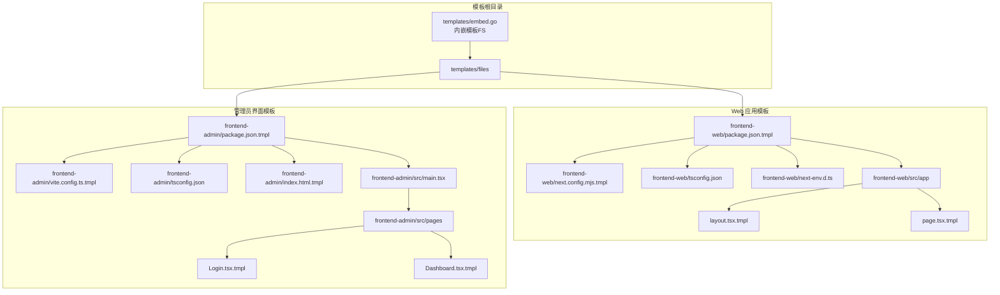
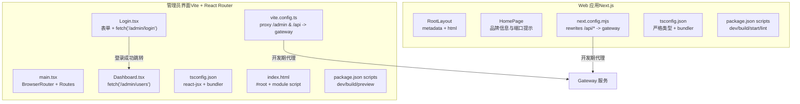
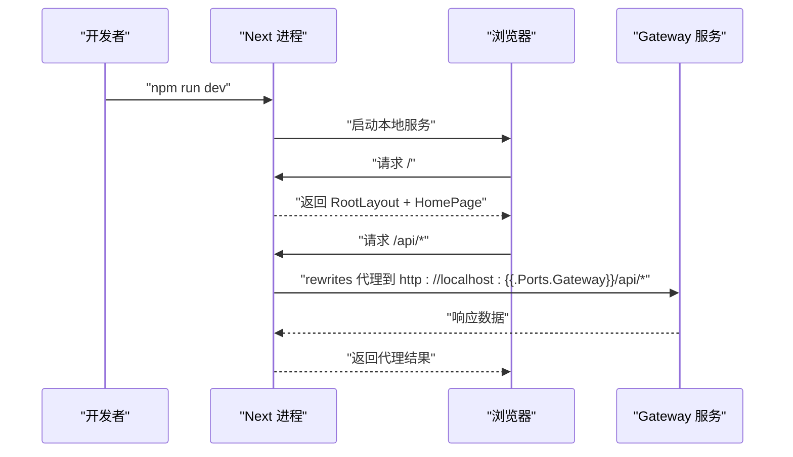
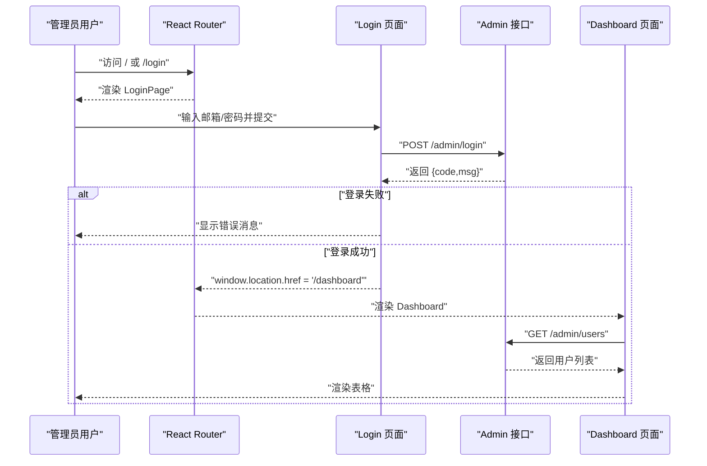
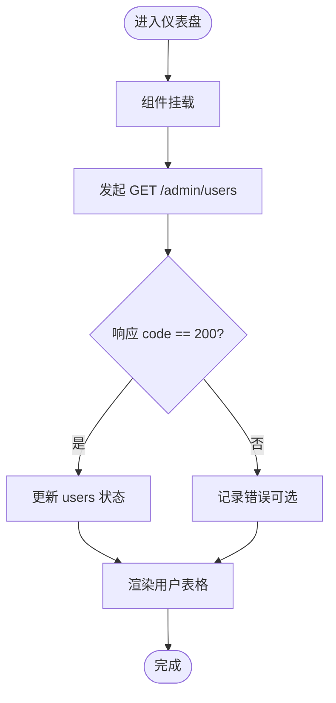
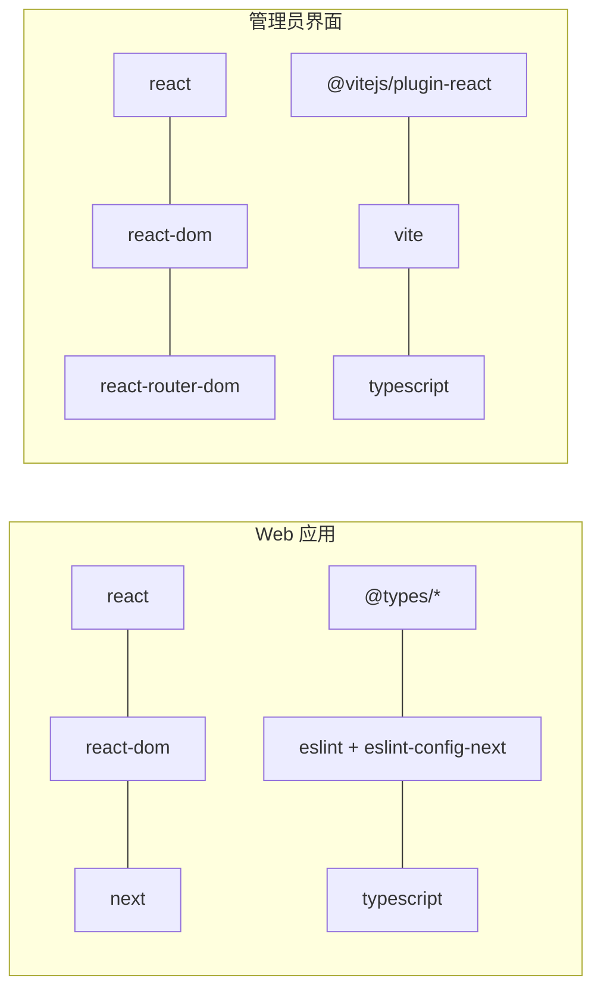

# 前端应用

<cite>
**本文引用的文件**
- [frontend-web/src/app/layout.tsx.tmpl](file://templates/files/frontend-web/src/app/layout.tsx.tmpl)
- [frontend-web/src/app/page.tsx.tmpl](file://templates/files/frontend-web/src/app/page.tsx.tmpl)
- [frontend-web/package.json.tmpl](file://templates/files/frontend-web/package.json.tmpl)
- [frontend-web/next.config.mjs.tmpl](file://templates/files/frontend-web/next.config.mjs.tmpl)
- [frontend-web/tsconfig.json](file://templates/files/frontend-web/tsconfig.json)
- [frontend-web/next-env.d.ts](file://templates/files/frontend-web/next-env.d.ts)
- [frontend-admin/src/main.tsx](file://templates/files/frontend-admin/src/main.tsx)
- [frontend-admin/src/pages/Login.tsx.tmpl](file://templates/files/frontend-admin/src/pages/Login.tsx.tmpl)
- [frontend-admin/src/pages/Dashboard.tsx.tmpl](file://templates/files/frontend-admin/src/pages/Dashboard.tsx.tmpl)
- [frontend-admin/package.json.tmpl](file://templates/files/frontend-admin/package.json.tmpl)
- [frontend-admin/vite.config.ts.tmpl](file://templates/files/frontend-admin/vite.config.ts.tmpl)
- [frontend-admin/tsconfig.json](file://templates/files/frontend-admin/tsconfig.json)
- [frontend-admin/index.html.tmpl](file://templates/files/frontend-admin/index.html.tmpl)
- [embed.go](file://templates/embed.go)
</cite>

## 目录
1. [简介](#简介)
2. [项目结构](#项目结构)
3. [核心组件](#核心组件)
4. [架构总览](#架构总览)
5. [详细组件分析](#详细组件分析)
6. [依赖分析](#依赖分析)
7. [性能考虑](#性能考虑)
8. [故障排查指南](#故障排查指南)
9. [结论](#结论)
10. [附录](#附录)

## 简介
本文件面向前端应用组件，系统性梳理 Web 应用与管理员界面的架构设计、组件结构与开发模式。重点覆盖以下方面：
- Next.js 框架在 Web 应用中的使用方式与配置要点
- TypeScript 在两类前端工程中的配置与编译策略
- 组件化开发与页面路由组织（Next App Router 与 React Router）
- 状态管理与数据流（基于 React Hooks 的本地状态）
- UI 组件库集成建议（按需引入与样式隔离）
- 开发环境搭建、构建与部署流程
- 性能优化与可访问性最佳实践

## 项目结构
该仓库采用“模板生成器”方式提供前端工程骨架，包含两套前端模板：
- Web 应用（Next.js App Router）
- 管理员界面（Vite + React Router）

模板通过 Go 内嵌资源打包，便于在后端服务中统一生成目标项目。

**图表来源**
- [embed.go:1-12](file://templates/embed.go#L1-L12)
- [frontend-web/package.json.tmpl:1-25](file://templates/files/frontend-web/package.json.tmpl#L1-L25)
- [frontend-web/next.config.mjs.tmpl:1-13](file://templates/files/frontend-web/next.config.mjs.tmpl#L1-L13)
- [frontend-web/tsconfig.json:1-22](file://templates/files/frontend-web/tsconfig.json#L1-L22)
- [frontend-web/next-env.d.ts:1-3](file://templates/files/frontend-web/next-env.d.ts#L1-L3)
- [frontend-web/src/app/layout.tsx.tmpl:1-13](file://templates/files/frontend-web/src/app/layout.tsx.tmpl#L1-L13)
- [frontend-web/src/app/page.tsx.tmpl:1-18](file://templates/files/frontend-web/src/app/page.tsx.tmpl#L1-L18)
- [frontend-admin/package.json.tmpl:1-24](file://templates/files/frontend-admin/package.json.tmpl#L1-L24)
- [frontend-admin/vite.config.ts.tmpl:1-14](file://templates/files/frontend-admin/vite.config.ts.tmpl#L1-L14)
- [frontend-admin/tsconfig.json:1-21](file://templates/files/frontend-admin/tsconfig.json#L1-L21)
- [frontend-admin/index.html.tmpl:1-13](file://templates/files/frontend-admin/index.html.tmpl#L1-L13)
- [frontend-admin/src/main.tsx:1-18](file://templates/files/frontend-admin/src/main.tsx#L1-L18)
- [frontend-admin/src/pages/Login.tsx.tmpl:1-63](file://templates/files/frontend-admin/src/pages/Login.tsx.tmpl#L1-L63)
- [frontend-admin/src/pages/Dashboard.tsx.tmpl:1-59](file://templates/files/frontend-admin/src/pages/Dashboard.tsx.tmpl#L1-L59)

**章节来源**
- [embed.go:1-12](file://templates/embed.go#L1-L12)

## 核心组件
- Web 应用（Next.js App Router）
  - 元数据与根布局：定义站点标题、描述与根 HTML 结构
  - 首页页面：展示品牌信息与后端服务端口提示
  - 构建与运行：脚本、类型检查、严格模式与开发重写规则
  - 类型配置：严格类型、模块解析、路径别名与 Next 类型注入
- 管理员界面（Vite + React Router）
  - 路由入口：BrowserRouter、Routes、基础路由与重定向
  - 登录页：表单状态、提交逻辑、错误反馈与跳转
  - 仪表盘：用户列表加载、表格渲染与加载态处理
  - 构建与代理：Vite 服务器端口与代理、TypeScript 编译与 React JSX

**章节来源**
- [frontend-web/src/app/layout.tsx.tmpl:1-13](file://templates/files/frontend-web/src/app/layout.tsx.tmpl#L1-L13)
- [frontend-web/src/app/page.tsx.tmpl:1-18](file://templates/files/frontend-web/src/app/page.tsx.tmpl#L1-L18)
- [frontend-web/package.json.tmpl:1-25](file://templates/files/frontend-web/package.json.tmpl#L1-L25)
- [frontend-web/next.config.mjs.tmpl:1-13](file://templates/files/frontend-web/next.config.mjs.tmpl#L1-L13)
- [frontend-web/tsconfig.json:1-22](file://templates/files/frontend-web/tsconfig.json#L1-L22)
- [frontend-web/next-env.d.ts:1-3](file://templates/files/frontend-web/next-env.d.ts#L1-L3)
- [frontend-admin/src/main.tsx:1-18](file://templates/files/frontend-admin/src/main.tsx#L1-L18)
- [frontend-admin/src/pages/Login.tsx.tmpl:1-63](file://templates/files/frontend-admin/src/pages/Login.tsx.tmpl#L1-L63)
- [frontend-admin/src/pages/Dashboard.tsx.tmpl:1-59](file://templates/files/frontend-admin/src/pages/Dashboard.tsx.tmpl#L1-L59)
- [frontend-admin/package.json.tmpl:1-24](file://templates/files/frontend-admin/package.json.tmpl#L1-L24)
- [frontend-admin/vite.config.ts.tmpl:1-14](file://templates/files/frontend-admin/vite.config.ts.tmpl#L1-L14)
- [frontend-admin/tsconfig.json:1-21](file://templates/files/frontend-admin/tsconfig.json#L1-L21)
- [frontend-admin/index.html.tmpl:1-13](file://templates/files/frontend-admin/index.html.tmpl#L1-L13)

## 架构总览
两类前端工程分别服务于不同场景：
- Web 应用：基于 Next.js App Router，强调约定式路由、服务端能力与静态优化
- 管理员界面：基于 Vite 与 React Router，强调快速开发与本地代理

**图表来源**
- [frontend-web/src/app/layout.tsx.tmpl:1-13](file://templates/files/frontend-web/src/app/layout.tsx.tmpl#L1-L13)
- [frontend-web/src/app/page.tsx.tmpl:1-18](file://templates/files/frontend-web/src/app/page.tsx.tmpl#L1-L18)
- [frontend-web/next.config.mjs.tmpl:1-13](file://templates/files/frontend-web/next.config.mjs.tmpl#L1-L13)
- [frontend-web/tsconfig.json:1-22](file://templates/files/frontend-web/tsconfig.json#L1-L22)
- [frontend-web/package.json.tmpl:1-25](file://templates/files/frontend-web/package.json.tmpl#L1-L25)
- [frontend-admin/src/main.tsx:1-18](file://templates/files/frontend-admin/src/main.tsx#L1-L18)
- [frontend-admin/src/pages/Login.tsx.tmpl:1-63](file://templates/files/frontend-admin/src/pages/Login.tsx.tmpl#L1-L63)
- [frontend-admin/src/pages/Dashboard.tsx.tmpl:1-59](file://templates/files/frontend-admin/src/pages/Dashboard.tsx.tmpl#L1-L59)
- [frontend-admin/vite.config.ts.tmpl:1-14](file://templates/files/frontend-admin/vite.config.ts.tmpl#L1-L14)
- [frontend-admin/tsconfig.json:1-21](file://templates/files/frontend-admin/tsconfig.json#L1-L21)
- [frontend-admin/index.html.tmpl:1-13](file://templates/files/frontend-admin/index.html.tmpl#L1-L13)

## 详细组件分析

### Web 应用（Next.js App Router）
- 根布局与元数据
  - 定义站点标题与描述，包裹子组件于 html/body 中
  - 适合全局样式与国际化设置扩展
- 首页页面
  - 展示品牌名称与模板提示
  - 动态显示网关、API 以及可选 AI 引擎端口
- 开发与构建
  - 脚本：dev、build、start、lint
  - 严格模式：提升开发期质量
  - 重写规则：开发期将 /api/* 代理至网关，避免跨域
- 类型与路径
  - 严格类型、模块解析为 bundler、路径别名 @/*
  - 注入 Next 类型声明

**图表来源**
- [frontend-web/package.json.tmpl:1-25](file://templates/files/frontend-web/package.json.tmpl#L1-L25)
- [frontend-web/next.config.mjs.tmpl:1-13](file://templates/files/frontend-web/next.config.mjs.tmpl#L1-L13)
- [frontend-web/src/app/layout.tsx.tmpl:1-13](file://templates/files/frontend-web/src/app/layout.tsx.tmpl#L1-L13)
- [frontend-web/src/app/page.tsx.tmpl:1-18](file://templates/files/frontend-web/src/app/page.tsx.tmpl#L1-L18)

**章节来源**
- [frontend-web/src/app/layout.tsx.tmpl:1-13](file://templates/files/frontend-web/src/app/layout.tsx.tmpl#L1-L13)
- [frontend-web/src/app/page.tsx.tmpl:1-18](file://templates/files/frontend-web/src/app/page.tsx.tmpl#L1-L18)
- [frontend-web/package.json.tmpl:1-25](file://templates/files/frontend-web/package.json.tmpl#L1-L25)
- [frontend-web/next.config.mjs.tmpl:1-13](file://templates/files/frontend-web/next.config.mjs.tmpl#L1-L13)
- [frontend-web/tsconfig.json:1-22](file://templates/files/frontend-web/tsconfig.json#L1-L22)
- [frontend-web/next-env.d.ts:1-3](file://templates/files/frontend-web/next-env.d.ts#L1-L3)

### 管理员界面（Vite + React Router）
- 路由入口
  - 使用 BrowserRouter 包裹 Routes
  - 默认重定向到 /dashboard
  - 提供 /login 与 /dashboard 两条路由
- 登录页
  - 表单状态：邮箱、密码、错误消息
  - 提交时向 /admin/login 发起 POST 请求，携带凭据
  - 失败时显示错误消息；成功则跳转到 /dashboard
- 仪表盘
  - 初次挂载时拉取 /admin/users
  - 解析响应并更新用户列表状态
  - 加载态下显示 Loading，渲染用户表格
- 开发与代理
  - Vite 服务器端口由模板变量控制
  - 代理 /admin 与 /api 到网关，避免跨域
  - TypeScript 使用 react-jsx，严格模式开启

**图表来源**
- [frontend-admin/src/main.tsx:1-18](file://templates/files/frontend-admin/src/main.tsx#L1-L18)
- [frontend-admin/src/pages/Login.tsx.tmpl:1-63](file://templates/files/frontend-admin/src/pages/Login.tsx.tmpl#L1-L63)
- [frontend-admin/src/pages/Dashboard.tsx.tmpl:1-59](file://templates/files/frontend-admin/src/pages/Dashboard.tsx.tmpl#L1-L59)
- [frontend-admin/vite.config.ts.tmpl:1-14](file://templates/files/frontend-admin/vite.config.ts.tmpl#L1-L14)

**章节来源**
- [frontend-admin/src/main.tsx:1-18](file://templates/files/frontend-admin/src/main.tsx#L1-L18)
- [frontend-admin/src/pages/Login.tsx.tmpl:1-63](file://templates/files/frontend-admin/src/pages/Login.tsx.tmpl#L1-L63)
- [frontend-admin/src/pages/Dashboard.tsx.tmpl:1-59](file://templates/files/frontend-admin/src/pages/Dashboard.tsx.tmpl#L1-L59)
- [frontend-admin/package.json.tmpl:1-24](file://templates/files/frontend-admin/package.json.tmpl#L1-L24)
- [frontend-admin/vite.config.ts.tmpl:1-14](file://templates/files/frontend-admin/vite.config.ts.tmpl#L1-L14)
- [frontend-admin/tsconfig.json:1-21](file://templates/files/frontend-admin/tsconfig.json#L1-L21)
- [frontend-admin/index.html.tmpl:1-13](file://templates/files/frontend-admin/index.html.tmpl#L1-L13)

### 数据流与状态管理
- Web 应用
  - 当前模板未包含复杂状态管理，页面直接渲染静态或动态内容
  - 可在后续扩展中引入客户端状态库（如 Zustand、Jotai）或服务端数据获取（App Router 的 server/client 边界）
- 管理员界面
  - 登录页与仪表盘均使用 React useState/useEffect 管理表单状态与异步数据
  - 登录流程：表单 -> fetch -> 成功跳转 -> 仪表盘 -> fetch 用户列表
  - 仪表盘流程：首次挂载 -> fetch -> 更新状态 -> 渲染表格

**图表来源**
- [frontend-admin/src/pages/Dashboard.tsx.tmpl:1-59](file://templates/files/frontend-admin/src/pages/Dashboard.tsx.tmpl#L1-L59)

**章节来源**
- [frontend-admin/src/pages/Login.tsx.tmpl:1-63](file://templates/files/frontend-admin/src/pages/Login.tsx.tmpl#L1-L63)
- [frontend-admin/src/pages/Dashboard.tsx.tmpl:1-59](file://templates/files/frontend-admin/src/pages/Dashboard.tsx.tmpl#L1-L59)

### UI 组件库集成建议
- 按需引入：优先选择支持 Tree Shaking 的组件库，减少打包体积
- 主题与样式隔离：通过 CSS Modules、Styled Components 或 CSS-in-JS 实现主题切换与样式隔离
- 可访问性：确保键盘导航、ARIA 属性与语义化标签完整
- 响应式：结合媒体查询与弹性布局，适配移动端与桌面端

## 依赖分析
- Web 应用依赖
  - 运行时：react、react-dom、next
  - 开发时：@types/*、eslint、typescript
- 管理员界面依赖
  - 运行时：react、react-dom、react-router-dom
  - 开发时：@types/*、@vitejs/plugin-react、typescript、vite
- 共同点
  - 严格类型、模块解析为 bundler、路径别名与 JSX 配置
  - 开发期代理到网关，避免跨域问题

**图表来源**
- [frontend-web/package.json.tmpl:1-25](file://templates/files/frontend-web/package.json.tmpl#L1-L25)
- [frontend-admin/package.json.tmpl:1-24](file://templates/files/frontend-admin/package.json.tmpl#L1-L24)

**章节来源**
- [frontend-web/package.json.tmpl:1-25](file://templates/files/frontend-web/package.json.tmpl#L1-L25)
- [frontend-admin/package.json.tmpl:1-24](file://templates/files/frontend-admin/package.json.tmpl#L1-L24)

## 性能考虑
- 构建与打包
  - 使用 Next.js 的增量构建与 React 18 并发特性
  - Vite 构建速度快，适合快速迭代
- 资源优化
  - 图片懒加载、字体预加载、关键 CSS 提取
  - 组件级代码分割与路由级懒加载
- 网络与缓存
  - 开发期代理减少跨域与额外握手
  - 生产期合理设置缓存策略与 CDN
- 可访问性与体验
  - 语义化标签、键盘可达、焦点管理
  - 颜色对比度、文本缩放、读屏支持

## 故障排查指南
- 开发期无法访问 /api/*
  - 检查 Next 重写规则是否生效
  - 确认网关服务已启动且端口正确
- 管理员界面登录失败
  - 检查 /admin/login 返回的 code 与 msg
  - 确认凭据正确与 Cookie/凭据传递
- 仪表盘无数据
  - 检查 /admin/users 是否返回 code 200
  - 确认响应结构与字段映射一致
- 跨域或代理异常
  - Vite 代理配置是否指向正确的网关地址
  - 端口冲突或防火墙限制

**章节来源**
- [frontend-web/next.config.mjs.tmpl:1-13](file://templates/files/frontend-web/next.config.mjs.tmpl#L1-L13)
- [frontend-admin/vite.config.ts.tmpl:1-14](file://templates/files/frontend-admin/vite.config.ts.tmpl#L1-L14)
- [frontend-admin/src/pages/Login.tsx.tmpl:1-63](file://templates/files/frontend-admin/src/pages/Login.tsx.tmpl#L1-L63)
- [frontend-admin/src/pages/Dashboard.tsx.tmpl:1-59](file://templates/files/frontend-admin/src/pages/Dashboard.tsx.tmpl#L1-L59)

## 结论
本模板提供了两类前端工程的最小可用骨架：Next.js Web 应用与 Vite 管理员界面。它们在开发体验、路由模型与代理策略上各有侧重，同时共享严格的 TypeScript 配置与开发期代理机制。后续可在两类工程中按需引入状态管理、UI 组件库与性能优化工具，以满足更复杂的业务需求。

## 附录
- 开发环境搭建
  - Web 应用：安装依赖后执行 dev 脚本，访问本地端口
  - 管理员界面：安装依赖后执行 dev 脚本，访问本地端口
- 构建与部署
  - Web 应用：使用 build 生成生产包，start 启动
  - 管理员界面：使用 build 生成静态产物，preview 预览
- TypeScript 配置
  - 严格模式、模块解析为 bundler、路径别名与 JSX 选项
- 模板内嵌与生成
  - Go 通过 embed 将 templates 内容内嵌，便于在后端统一生成目标项目

**章节来源**
- [frontend-web/package.json.tmpl:1-25](file://templates/files/frontend-web/package.json.tmpl#L1-L25)
- [frontend-admin/package.json.tmpl:1-24](file://templates/files/frontend-admin/package.json.tmpl#L1-L24)
- [frontend-web/tsconfig.json:1-22](file://templates/files/frontend-web/tsconfig.json#L1-L22)
- [frontend-admin/tsconfig.json:1-21](file://templates/files/frontend-admin/tsconfig.json#L1-L21)
- [embed.go:1-12](file://templates/embed.go#L1-L12)