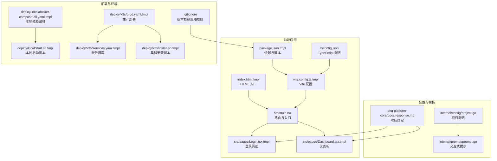
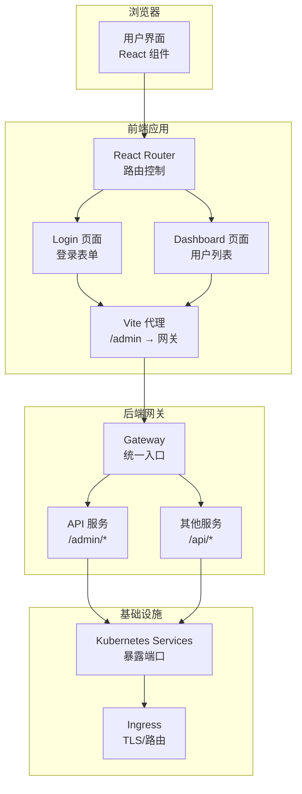
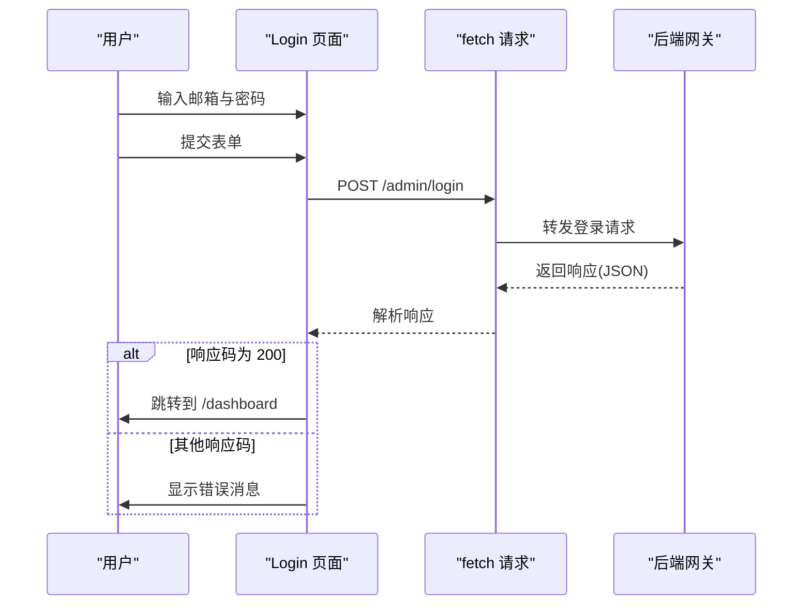
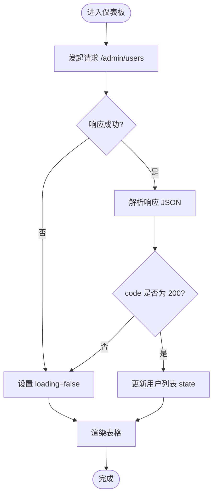
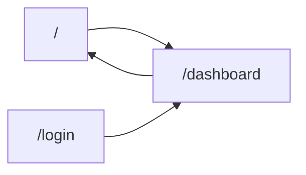
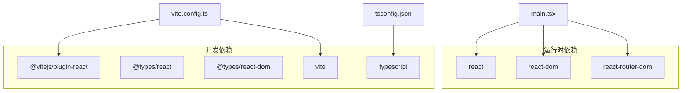

# 管理员前端应用

<cite>
**本文档引用的文件**
- [main.tsx](file://templates/files/frontend-admin/src/main.tsx)
- [Dashboard.tsx.tmpl](file://templates/files/frontend-admin/src/pages/Dashboard.tsx.tmpl)
- [Login.tsx.tmpl](file://templates/files/frontend-admin/src/pages/Login.tsx.tmpl)
- [vite.config.ts.tmpl](file://templates/files/frontend-admin/vite.config.ts.tmpl)
- [package.json.tmpl](file://templates/files/frontend-admin/package.json.tmpl)
- [tsconfig.json](file://templates/files/frontend-admin/tsconfig.json)
- [index.html.tmpl](file://templates/files/frontend-admin/index.html.tmpl)
- [project.go](file://internal/config/project.go)
- [prompt.go](file://internal/prompt/prompt.go)
- [response.md](file://templates/files/pkg-platform-core/docs/response.md)
- [docker-compose-all.yaml.tmpl](file://templates/files/deploy/local/docker-compose-all.yaml.tmpl)
- [start.sh.tmpl](file://templates/files/deploy/local/start.sh.tmpl)
- [prod.yaml.tmpl](file://templates/files/deploy/k3s/prod.yaml.tmpl)
- [services.yaml.tmpl](file://templates/files/deploy/k3s/services.yaml.tmpl)
- [install.sh.tmpl](file://templates/files/deploy/k3s/install.sh.tmpl)
- [.gitignore](file://templates/files/.gitignore)
</cite>

## 目录
1. [简介](#简介)
2. [项目结构](#项目结构)
3. [核心组件](#核心组件)
4. [架构概览](#架构概览)
5. [详细组件分析](#详细组件分析)
6. [依赖关系分析](#依赖关系分析)
7. [性能考虑](#性能考虑)
8. [故障排除指南](#故障排除指南)
9. [结论](#结论)
10. [附录](#附录)

## 简介
本项目是一个基于 React Admin 的管理员前端应用，采用 Vite 构建工具、TypeScript 类型系统与 React Router 路由体系。该应用提供了基础的登录认证与仪表板展示能力，通过模板化配置支持多环境部署（本地开发与 Kubernetes 集群）。项目遵循脚手架生成器的统一规范，包含完整的开发、测试与部署流程。

## 项目结构
管理员前端应用位于模板目录中，核心文件组织如下：
- 源码入口：src/main.tsx
- 页面组件：src/pages/Dashboard.tsx.tmpl、src/pages/Login.tsx.tmpl
- 构建配置：vite.config.ts.tmpl、package.json.tmpl、tsconfig.json
- HTML 入口：index.html.tmpl
- 配置与提示：internal/config/project.go、internal/prompt/prompt.go
- 后端响应约定：templates/files/pkg-platform-core/docs/response.md
- 部署与环境：deploy/local/*.yaml、deploy/k3s/*.yaml
- 版本控制忽略：.gitignore

**图表来源**
- [main.tsx:1-18](file://templates/files/frontend-admin/src/main.tsx#L1-L18)
- [Login.tsx.tmpl:1-63](file://templates/files/frontend-admin/src/pages/Login.tsx.tmpl#L1-L63)
- [Dashboard.tsx.tmpl:1-59](file://templates/files/frontend-admin/src/pages/Dashboard.tsx.tmpl#L1-L59)
- [index.html.tmpl:1-13](file://templates/files/frontend-admin/index.html.tmpl#L1-L13)
- [vite.config.ts.tmpl:1-14](file://templates/files/frontend-admin/vite.config.ts.tmpl#L1-L14)
- [package.json.tmpl:1-24](file://templates/files/frontend-admin/package.json.tmpl#L1-L24)
- [tsconfig.json:1-21](file://templates/files/frontend-admin/tsconfig.json#L1-L21)
- [project.go:1-121](file://internal/config/project.go#L1-L121)
- [prompt.go:43-87](file://internal/prompt/prompt.go#L43-L87)
- [response.md:55-74](file://templates/files/pkg-platform-core/docs/response.md#L55-L74)
- [docker-compose-all.yaml.tmpl:1-47](file://templates/files/deploy/local/docker-compose-all.yaml.tmpl#L1-L47)
- [start.sh.tmpl:36-146](file://templates/files/deploy/local/start.sh.tmpl#L36-L146)
- [prod.yaml.tmpl:1-150](file://templates/files/deploy/k3s/prod.yaml.tmpl#L1-L150)
- [services.yaml.tmpl:1-57](file://templates/files/deploy/k3s/services.yaml.tmpl#L1-L57)
- [install.sh.tmpl:1-58](file://templates/files/deploy/k3s/install.sh.tmpl#L1-L58)
- [.gitignore:1-42](file://templates/files/.gitignore#L1-L42)

**章节来源**
- [main.tsx:1-18](file://templates/files/frontend-admin/src/main.tsx#L1-L18)
- [index.html.tmpl:1-13](file://templates/files/frontend-admin/index.html.tmpl#L1-L13)
- [vite.config.ts.tmpl:1-14](file://templates/files/frontend-admin/vite.config.ts.tmpl#L1-L14)
- [package.json.tmpl:1-24](file://templates/files/frontend-admin/package.json.tmpl#L1-L24)
- [tsconfig.json:1-21](file://templates/files/frontend-admin/tsconfig.json#L1-L21)

## 核心组件
- 登录页面：负责接收邮箱与密码，调用后端登录接口，处理错误并跳转至仪表板。
- 仪表板页面：加载用户列表数据，展示基础表格，预留后续扩展为完整管理界面。
- 路由系统：基于 React Router DOM 提供页面级导航与默认重定向。
- 构建与类型系统：Vite + TypeScript 提供快速开发与类型安全保障。

**章节来源**
- [Login.tsx.tmpl:1-63](file://templates/files/frontend-admin/src/pages/Login.tsx.tmpl#L1-L63)
- [Dashboard.tsx.tmpl:1-59](file://templates/files/frontend-admin/src/pages/Dashboard.tsx.tmpl#L1-L59)
- [main.tsx:1-18](file://templates/files/frontend-admin/src/main.tsx#L1-L18)

## 架构概览
管理员前端应用采用前后端分离架构，前端通过 Vite 提供开发服务器与构建产物，后端通过网关统一对外提供 /admin 与 /api 接口。本地开发通过代理将请求转发至网关，生产环境通过 Kubernetes 服务暴露。

**图表来源**
- [main.tsx:1-18](file://templates/files/frontend-admin/src/main.tsx#L1-L18)
- [Login.tsx.tmpl:1-63](file://templates/files/frontend-admin/src/pages/Login.tsx.tmpl#L1-L63)
- [Dashboard.tsx.tmpl:1-59](file://templates/files/frontend-admin/src/pages/Dashboard.tsx.tmpl#L1-L59)
- [vite.config.ts.tmpl:1-14](file://templates/files/frontend-admin/vite.config.ts.tmpl#L1-L14)
- [prod.yaml.tmpl:133-150](file://templates/files/deploy/k3s/prod.yaml.tmpl#L133-L150)
- [services.yaml.tmpl:1-57](file://templates/files/deploy/k3s/services.yaml.tmpl#L1-L57)

## 详细组件分析

### 登录页面组件
登录页面负责表单输入、提交与错误处理，使用 fetch 发起登录请求并根据响应码进行跳转或提示。

**图表来源**
- [Login.tsx.tmpl:8-23](file://templates/files/frontend-admin/src/pages/Login.tsx.tmpl#L8-L23)
- [vite.config.ts.tmpl:8-11](file://templates/files/frontend-admin/vite.config.ts.tmpl#L8-L11)

**章节来源**
- [Login.tsx.tmpl:1-63](file://templates/files/frontend-admin/src/pages/Login.tsx.tmpl#L1-L63)

### 仪表板组件
仪表板组件在挂载时拉取用户列表数据，解析响应并渲染表格，同时处理加载状态。

**图表来源**
- [Dashboard.tsx.tmpl:14-24](file://templates/files/frontend-admin/src/pages/Dashboard.tsx.tmpl#L14-L24)

**章节来源**
- [Dashboard.tsx.tmpl:1-59](file://templates/files/frontend-admin/src/pages/Dashboard.tsx.tmpl#L1-L59)

### 路由与入口
应用通过 React Router DOM 提供路由控制，默认重定向到仪表板，支持登录与仪表板两个页面。

**图表来源**
- [main.tsx:10-14](file://templates/files/frontend-admin/src/main.tsx#L10-L14)

**章节来源**
- [main.tsx:1-18](file://templates/files/frontend-admin/src/main.tsx#L1-L18)

### 构建与开发配置
- Vite 配置：启用 React 插件，设置开发端口与代理，将 /admin 与 /api 请求转发至网关。
- TypeScript 配置：严格模式、ESNext 模块解析、JSX 编译选项。
- 包管理脚本：dev/build/preview 命令，结合 Vite 与 TypeScript 编译。

**章节来源**
- [vite.config.ts.tmpl:1-14](file://templates/files/frontend-admin/vite.config.ts.tmpl#L1-L14)
- [tsconfig.json:1-21](file://templates/files/frontend-admin/tsconfig.json#L1-L21)
- [package.json.tmpl:6-10](file://templates/files/frontend-admin/package.json.tmpl#L6-L10)

### 响应约定与错误处理
- 前端约定：当响应 code 为 "200" 时视为成功；非 200 时根据 msg 进行提示；建议使用国际化映射显示错误。
- 错误码规范：code 为字符串类型，成功固定为 "200"，失败时 data 为 null。

**章节来源**
- [response.md:55-74](file://templates/files/pkg-platform-core/docs/response.md#L55-L74)

## 依赖关系分析
- 组件耦合：页面组件独立于路由，通过 fetch 与后端交互，降低耦合度。
- 外部依赖：React、React DOM、React Router DOM、Vite、TypeScript。
- 开发依赖：@vitejs/plugin-react、@types/react、@types/react-dom、vite、typescript。

**图表来源**
- [package.json.tmpl:11-22](file://templates/files/frontend-admin/package.json.tmpl#L11-L22)
- [vite.config.ts.tmpl:1-14](file://templates/files/frontend-admin/vite.config.ts.tmpl#L1-L14)
- [tsconfig.json:1-21](file://templates/files/frontend-admin/tsconfig.json#L1-L21)

**章节来源**
- [package.json.tmpl:1-24](file://templates/files/frontend-admin/package.json.tmpl#L1-L24)

## 性能考虑
- 开发体验：Vite 提供快速冷启动与热更新，适合迭代开发。
- 构建优化：TypeScript 与 Vite 结合可减少运行时检查开销，提升打包效率。
- 网络请求：代理配置减少跨域问题，提高联调效率。
- 数据加载：仪表板采用一次性加载用户列表，后续可根据需要引入分页与缓存策略。

## 故障排除指南
- 登录失败：检查后端响应 code 与 msg，确认邮箱与密码格式正确。
- 跨域问题：确保 Vite 代理配置正确，/admin 与 /api 转发至网关。
- 端口冲突：调整项目配置中的 Admin 端口，避免与其他服务冲突。
- 构建失败：确认 TypeScript 与 Vite 版本兼容性，清理 node_modules 后重新安装依赖。

**章节来源**
- [vite.config.ts.tmpl:6-12](file://templates/files/frontend-admin/vite.config.ts.tmpl#L6-L12)
- [response.md:69-74](file://templates/files/pkg-platform-core/docs/response.md#L69-L74)

## 结论
该管理员前端应用以简洁的组件结构与清晰的开发流程为基础，结合 Vite 与 TypeScript 提供高效稳定的开发体验。通过模板化的配置与部署脚本，能够快速适配本地开发与 Kubernetes 生产环境。后续可在现有基础上扩展权限控制、数据可视化与表单管理等高级功能。

## 附录

### 开发规范
- 组件命名：采用语义化命名，如 Dashboard、Login。
- 路由设计：保持路径简洁，使用相对路径与默认重定向。
- 错误处理：遵循后端响应约定，统一错误提示与国际化映射。

**章节来源**
- [main.tsx:10-14](file://templates/files/frontend-admin/src/main.tsx#L10-L14)
- [response.md:55-74](file://templates/files/pkg-platform-core/docs/response.md#L55-L74)

### 测试策略
- 单元测试：针对登录与数据加载逻辑编写测试用例。
- 集成测试：验证路由跳转与 API 调用链路。
- 端到端测试：模拟用户登录与仪表板访问流程。

### 部署流程
- 本地开发：使用本地编排启动数据库与缓存，通过启动脚本运行各服务。
- 生产部署：通过 Kubernetes 部署清单与安装脚本完成集群部署与服务暴露。

**章节来源**
- [docker-compose-all.yaml.tmpl:1-47](file://templates/files/deploy/local/docker-compose-all.yaml.tmpl#L1-L47)
- [start.sh.tmpl:110-146](file://templates/files/deploy/local/start.sh.tmpl#L110-L146)
- [prod.yaml.tmpl:133-150](file://templates/files/deploy/k3s/prod.yaml.tmpl#L133-L150)
- [services.yaml.tmpl:37-45](file://templates/files/deploy/k3s/services.yaml.tmpl#L37-L45)
- [install.sh.tmpl:33-38](file://templates/files/deploy/k3s/install.sh.tmpl#L33-L38)