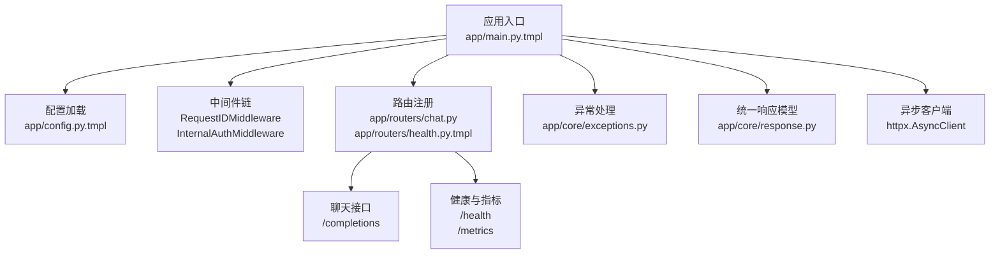
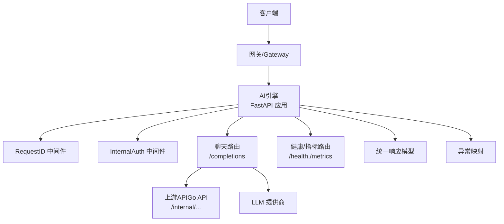
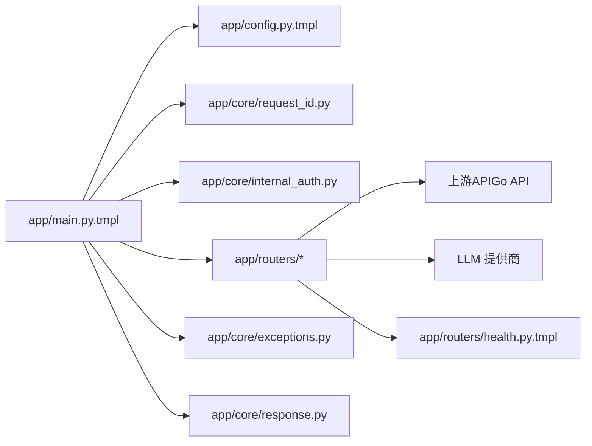
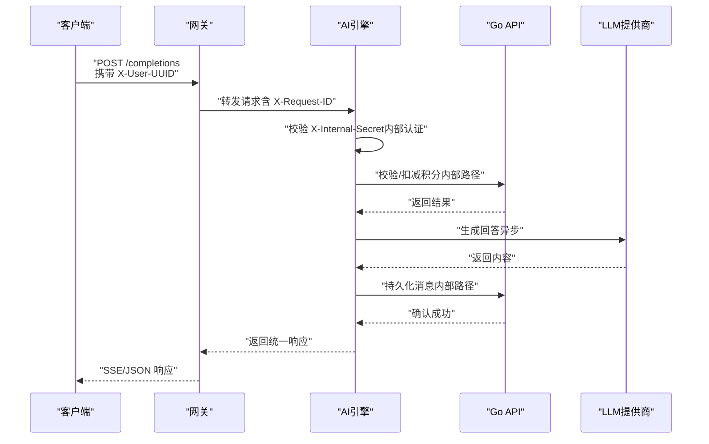
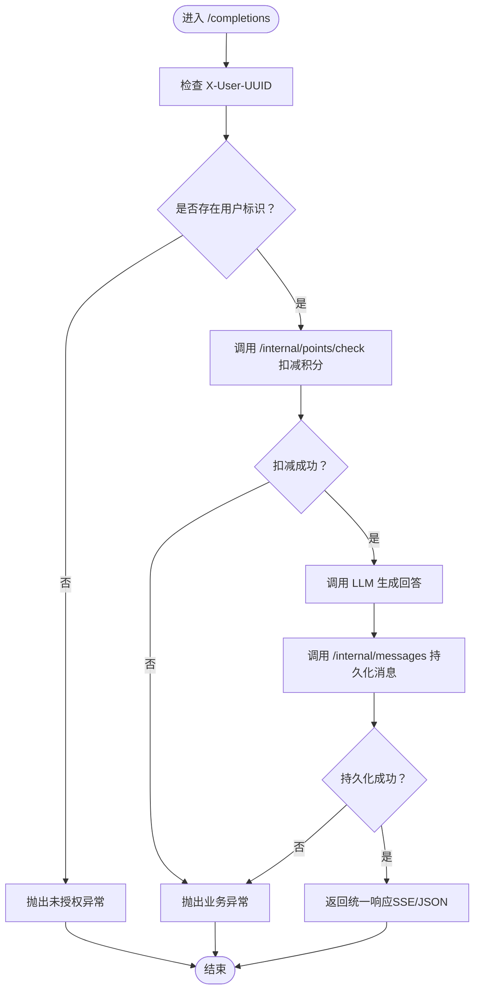

# 后端AI引擎

<cite>
**本文引用的文件**
- [cmd/platform/main.go](file://cmd/platform/main.go)
- [templates/files/backend-ai-engine/app/main.py.tmpl](file://templates/files/backend-ai-engine/app/main.py.tmpl)
- [templates/files/backend-ai-engine/app/config.py.tmpl](file://templates/files/backend-ai-engine/app/config.py.tmpl)
- [templates/files/backend-ai-engine/app/routers/chat.py](file://templates/files/backend-ai-engine/app/routers/chat.py)
- [templates/files/backend-ai-engine/app/core/request_id.py](file://templates/files/backend-ai-engine/app/core/request_id.py)
- [templates/files/backend-ai-engine/app/core/response.py](file://templates/files/backend-ai-engine/app/core/response.py)
- [templates/files/backend-ai-engine/app/core/exceptions.py](file://templates/files/backend-ai-engine/app/core/exceptions.py)
- [templates/files/backend-ai-engine/app/core/internal_auth.py](file://templates/files/backend-ai-engine/app/core/internal_auth.py)
- [templates/files/backend-ai-engine/app/routers/health.py.tmpl](file://templates/files/backend-ai-engine/app/routers/health.py.tmpl)
- [templates/files/backend-ai-engine/Dockerfile.tmpl](file://templates/files/backend-ai-engine/Dockerfile.tmpl)
- [templates/files/backend-ai-engine/requirements.txt](file://templates/files/backend-ai-engine/requirements.txt)
</cite>

## 目录
1. [简介](#简介)
2. [项目结构](#项目结构)
3. [核心组件](#核心组件)
4. [架构总览](#架构总览)
5. [详细组件分析](#详细组件分析)
6. [依赖关系分析](#依赖关系分析)
7. [性能考量](#性能考量)
8. [故障排查指南](#故障排查指南)
9. [结论](#结论)
10. [附录](#附录)

## 简介
本文件面向“后端AI引擎”的技术文档，聚焦于基于Python构建的AI服务引擎，围绕以下主题展开：异步处理、并发控制与资源管理；聊天机器人接口实现、消息处理流程与对话状态管理；异常处理机制、请求ID跟踪与响应格式化；Docker容器配置、依赖包管理与运行时环境设置；以及AI服务调用示例、性能监控与扩展性建议。该引擎采用FastAPI作为Web框架，结合httpx进行异步上游调用，并通过中间件链实现内部认证与请求ID追踪。

## 项目结构
后端AI引擎模板位于“backend-ai-engine”目录中，核心文件组织如下：
- 应用入口与生命周期：app/main.py.tmpl
- 配置管理：app/config.py.tmpl
- 路由定义：app/routers/chat.py、app/routers/health.py.tmpl
- 核心中间件与工具：app/core/request_id.py、app/core/internal_auth.py、app/core/response.py、app/core/exceptions.py
- 容器与依赖：Dockerfile.tmpl、requirements.txt

图示来源
- [templates/files/backend-ai-engine/app/main.py.tmpl:1-67](file://templates/files/backend-ai-engine/app/main.py.tmpl#L1-L67)
- [templates/files/backend-ai-engine/app/config.py.tmpl:1-31](file://templates/files/backend-ai-engine/app/config.py.tmpl#L1-L31)
- [templates/files/backend-ai-engine/app/routers/chat.py:1-28](file://templates/files/backend-ai-engine/app/routers/chat.py#L1-L28)
- [templates/files/backend-ai-engine/app/routers/health.py.tmpl:1-17](file://templates/files/backend-ai-engine/app/routers/health.py.tmpl#L1-L17)
- [templates/files/backend-ai-engine/app/core/exceptions.py:1-31](file://templates/files/backend-ai-engine/app/core/exceptions.py#L1-L31)
- [templates/files/backend-ai-engine/app/core/response.py:1-19](file://templates/files/backend-ai-engine/app/core/response.py#L1-L19)

章节来源
- [templates/files/backend-ai-engine/app/main.py.tmpl:1-67](file://templates/files/backend-ai-engine/app/main.py.tmpl#L1-L67)
- [templates/files/backend-ai-engine/app/config.py.tmpl:1-31](file://templates/files/backend-ai-engine/app/config.py.tmpl#L1-L31)
- [templates/files/backend-ai-engine/app/routers/chat.py:1-28](file://templates/files/backend-ai-engine/app/routers/chat.py#L1-L28)
- [templates/files/backend-ai-engine/app/routers/health.py.tmpl:1-17](file://templates/files/backend-ai-engine/app/routers/health.py.tmpl#L1-L17)
- [templates/files/backend-ai-engine/app/core/request_id.py:1-31](file://templates/files/backend-ai-engine/app/core/request_id.py#L1-L31)
- [templates/files/backend-ai-engine/app/core/internal_auth.py:1-34](file://templates/files/backend-ai-engine/app/core/internal_auth.py#L1-L34)
- [templates/files/backend-ai-engine/app/core/response.py:1-19](file://templates/files/backend-ai-engine/app/core/response.py#L1-L19)
- [templates/files/backend-ai-engine/app/core/exceptions.py:1-31](file://templates/files/backend-ai-engine/app/core/exceptions.py#L1-L31)
- [templates/files/backend-ai-engine/Dockerfile.tmpl:1-14](file://templates/files/backend-ai-engine/Dockerfile.tmpl#L1-L14)
- [templates/files/backend-ai-engine/requirements.txt:1-8](file://templates/files/backend-ai-engine/requirements.txt#L1-L8)

## 核心组件
- 应用入口与生命周期管理：通过FastAPI lifespan钩子创建与关闭httpx.AsyncClient，实现连接复用与资源释放。
- 中间件链：CORS（可选）、RequestID中间件、内部认证中间件，确保请求ID贯穿日志、安全校验仅对内部路径生效。
- 路由层：聊天接口与健康/指标接口，遵循只读策略（仅调用LLM，写操作委托给Go API）。
- 异常与响应：BizException统一映射为{code,msg,data}结构，配合R模型与辅助函数ok/err保证一致性。
- 配置系统：基于pydantic-settings从环境变量读取，支持缓存以减少重复解析开销。
- 容器与运行时：多阶段构建，标准uvicorn运行，暴露端口与健康/指标端点。

章节来源
- [templates/files/backend-ai-engine/app/main.py.tmpl:27-67](file://templates/files/backend-ai-engine/app/main.py.tmpl#L27-L67)
- [templates/files/backend-ai-engine/app/core/request_id.py:17-31](file://templates/files/backend-ai-engine/app/core/request_id.py#L17-L31)
- [templates/files/backend-ai-engine/app/core/internal_auth.py:16-34](file://templates/files/backend-ai-engine/app/core/internal_auth.py#L16-L34)
- [templates/files/backend-ai-engine/app/routers/chat.py:13-28](file://templates/files/backend-ai-engine/app/routers/chat.py#L13-L28)
- [templates/files/backend-ai-engine/app/core/exceptions.py:9-31](file://templates/files/backend-ai-engine/app/core/exceptions.py#L9-L31)
- [templates/files/backend-ai-engine/app/core/response.py:7-19](file://templates/files/backend-ai-engine/app/core/response.py#L7-L19)
- [templates/files/backend-ai-engine/app/config.py.tmpl:9-31](file://templates/files/backend-ai-engine/app/config.py.tmpl#L9-L31)
- [templates/files/backend-ai-engine/Dockerfile.tmpl:1-14](file://templates/files/backend-ai-engine/Dockerfile.tmpl#L1-L14)

## 架构总览
下图展示从客户端到AI引擎、再到上游API与LLM的调用路径，以及中间件如何贯穿请求生命周期。

图示来源
- [templates/files/backend-ai-engine/app/main.py.tmpl:39-67](file://templates/files/backend-ai-engine/app/main.py.tmpl#L39-L67)
- [templates/files/backend-ai-engine/app/core/request_id.py:17-31](file://templates/files/backend-ai-engine/app/core/request_id.py#L17-L31)
- [templates/files/backend-ai-engine/app/core/internal_auth.py:16-34](file://templates/files/backend-ai-engine/app/core/internal_auth.py#L16-L34)
- [templates/files/backend-ai-engine/app/routers/chat.py:13-28](file://templates/files/backend-ai-engine/app/routers/chat.py#L13-L28)
- [templates/files/backend-ai-engine/app/routers/health.py.tmpl:9-17](file://templates/files/backend-ai-engine/app/routers/health.py.tmpl#L9-L17)
- [templates/files/backend-ai-engine/app/core/response.py:7-19](file://templates/files/backend-ai-engine/app/core/response.py#L7-L19)
- [templates/files/backend-ai-engine/app/core/exceptions.py:9-31](file://templates/files/backend-ai-engine/app/core/exceptions.py#L9-L31)

## 详细组件分析

### 应用入口与生命周期（lifespan）
- 生命周期钩子负责创建httpx.AsyncClient并在应用结束时关闭，避免重复建立连接，提升并发场景下的网络效率。
- 通过settings注入基础URL与内部密钥头，便于后续路由调用上游API时复用连接。
- 全局注册BizException映射，确保所有业务异常统一返回JSON结构。

章节来源
- [templates/files/backend-ai-engine/app/main.py.tmpl:27-67](file://templates/files/backend-ai-engine/app/main.py.tmpl#L27-L67)

### 中间件链
- RequestID中间件：从请求头读取X-Request-ID，若缺失则生成UUID；将ID存入ContextVar，便于日志与追踪；同时在响应头回传该ID。
- InternalAuth中间件：当内部密钥非空时，对除公共前缀外的路径进行恒等时间比较校验；公共路径（如健康检查、OpenAPI）不受限。
- CORS中间件：根据配置允许跨域来源，默认为空列表以便由网关统一处理。

章节来源
- [templates/files/backend-ai-engine/app/core/request_id.py:17-31](file://templates/files/backend-ai-engine/app/core/request_id.py#L17-L31)
- [templates/files/backend-ai-engine/app/core/internal_auth.py:16-34](file://templates/files/backend-ai-engine/app/core/internal_auth.py#L16-L34)
- [templates/files/backend-ai-engine/app/main.py.tmpl:43-53](file://templates/files/backend-ai-engine/app/main.py.tmpl#L43-L53)

### 路由与聊天接口
- 路由注册：include_router将各模块路由整合至主应用。
- 聊天接口设计原则：
  - 只读策略：接收请求→调用LLM→返回SSE流或普通JSON。
  - 写操作（扣积分、记录消息）委托给Go API（通过内部路径）。
  - 用户身份：通过X-User-UUID头识别（由网关注入）。
- 当前实现为占位，包含TODO清单，体现后续对接上游与LLM的具体步骤。

章节来源
- [templates/files/backend-ai-engine/app/main.py.tmpl:62-67](file://templates/files/backend-ai-engine/app/main.py.tmpl#L62-L67)
- [templates/files/backend-ai-engine/app/routers/chat.py:1-28](file://templates/files/backend-ai-engine/app/routers/chat.py#L1-L28)

### 健康与指标
- /health：返回服务状态与服务名。
- /metrics：导出Prometheus指标文本格式，便于监控系统抓取。

章节来源
- [templates/files/backend-ai-engine/app/routers/health.py.tmpl:9-17](file://templates/files/backend-ai-engine/app/routers/health.py.tmpl#L9-L17)

### 异常与响应模型
- BizException：统一业务异常基类，支持HTTP状态码覆盖；派生类覆盖特定状态码。
- 统一响应模型R：三字段结构与Go端保持一致；提供ok/err便捷函数。
- 全局异常处理器：将BizException映射为{code,msg,data}的JSON响应。

章节来源
- [templates/files/backend-ai-engine/app/core/exceptions.py:9-31](file://templates/files/backend-ai-engine/app/core/exceptions.py#L9-L31)
- [templates/files/backend-ai-engine/app/core/response.py:7-19](file://templates/files/backend-ai-engine/app/core/response.py#L7-L19)
- [templates/files/backend-ai-engine/app/main.py.tmpl:55-61](file://templates/files/backend-ai-engine/app/main.py.tmpl#L55-L61)

### 配置系统
- 使用pydantic-settings从环境变量读取配置，支持别名映射与额外字段忽略。
- 缓存策略：lru_cache减少重复解析成本。
- 关键配置项：端口、环境、内部密钥、上游API基础URL、CORS来源列表。

章节来源
- [templates/files/backend-ai-engine/app/config.py.tmpl:9-31](file://templates/files/backend-ai-engine/app/config.py.tmpl#L9-L31)

### 容器与运行时
- 多阶段构建：先在builder镜像安装依赖，再复制到运行时镜像，减小体积。
- 运行命令：uvicorn标准启动，绑定0.0.0.0与指定端口。
- 指标暴露：/metrics端点用于Prometheus采集。

章节来源
- [templates/files/backend-ai-engine/Dockerfile.tmpl:1-14](file://templates/files/backend-ai-engine/Dockerfile.tmpl#L1-L14)
- [templates/files/backend-ai-engine/requirements.txt:1-8](file://templates/files/backend-ai-engine/requirements.txt#L1-L8)

## 依赖关系分析
- 应用入口依赖配置模块、中间件与路由模块；异常与响应模块为全局装饰。
- 路由层依赖上游API（Go API）与LLM提供商；当前实现通过httpx发起异步请求。
- 中间件依赖上下文变量与安全比较函数；健康路由依赖Prometheus客户端。

图示来源
- [templates/files/backend-ai-engine/app/main.py.tmpl:27-67](file://templates/files/backend-ai-engine/app/main.py.tmpl#L27-L67)
- [templates/files/backend-ai-engine/app/config.py.tmpl:9-31](file://templates/files/backend-ai-engine/app/config.py.tmpl#L9-L31)
- [templates/files/backend-ai-engine/app/core/request_id.py:17-31](file://templates/files/backend-ai-engine/app/core/request_id.py#L17-L31)
- [templates/files/backend-ai-engine/app/core/internal_auth.py:16-34](file://templates/files/backend-ai-engine/app/core/internal_auth.py#L16-L34)
- [templates/files/backend-ai-engine/app/routers/chat.py:13-28](file://templates/files/backend-ai-engine/app/routers/chat.py#L13-L28)
- [templates/files/backend-ai-engine/app/routers/health.py.tmpl:9-17](file://templates/files/backend-ai-engine/app/routers/health.py.tmpl#L9-L17)
- [templates/files/backend-ai-engine/app/core/exceptions.py:9-31](file://templates/files/backend-ai-engine/app/core/exceptions.py#L9-L31)
- [templates/files/backend-ai-engine/app/core/response.py:7-19](file://templates/files/backend-ai-engine/app/core/response.py#L7-L19)

## 性能考量
- 异步与连接复用：通过lifespan创建httpx.AsyncClient并持久化，减少TCP握手与TLS开销，适合高并发请求。
- 并发控制：FastAPI基于uvicorn的异步事件循环，建议在上游调用与LLM交互处使用异步await，避免阻塞主线程。
- 资源管理：lifespan在应用终止时关闭AsyncClient，防止fd泄漏与连接池资源未释放。
- 健康与指标：/health与/metrics端点便于Kubernetes探针与Prometheus监控，建议结合速率限制与超时策略。
- 缓存与序列化：配置系统使用LRU缓存；响应模型使用Pydantic，序列化开销可控。

## 故障排查指南
- 请求ID追踪：若未看到X-Request-ID响应头，请确认RequestID中间件是否正确注入；检查网关是否转发该头部。
- 内部认证失败：当X-Internal-Secret错误或缺失时会返回403；请核对密钥配置与公共路径白名单。
- 业务异常：BizException会被统一映射为{code,msg,data}；请检查具体异常类型与HTTP状态码。
- 上游调用失败：检查API_BASE_URL、内部密钥与网络连通性；必要时增加重试与超时参数。
- 健康与指标：/health应返回正常状态；/metrics应返回Prometheus文本格式；若无指标，请检查Prometheus客户端初始化。

章节来源
- [templates/files/backend-ai-engine/app/core/request_id.py:17-31](file://templates/files/backend-ai-engine/app/core/request_id.py#L17-L31)
- [templates/files/backend-ai-engine/app/core/internal_auth.py:27-33](file://templates/files/backend-ai-engine/app/core/internal_auth.py#L27-L33)
- [templates/files/backend-ai-engine/app/core/exceptions.py:9-31](file://templates/files/backend-ai-engine/app/core/exceptions.py#L9-L31)
- [templates/files/backend-ai-engine/app/routers/health.py.tmpl:9-17](file://templates/files/backend-ai-engine/app/routers/health.py.tmpl#L9-L17)

## 结论
该后端AI引擎模板以FastAPI为核心，结合中间件链、统一异常与响应模型、异步客户端与容器化部署，形成一套清晰、可扩展且易于运维的AI服务架构。聊天接口遵循只读策略，将写操作委托给Go API，既保证了职责分离，也简化了Python端的复杂度。通过请求ID与内部认证中间件，实现了可观测性与安全性；通过健康与指标端点，便于集成监控体系。后续只需按聊天接口中的TODO清单完成上游与LLM对接，即可快速上线生产可用的AI服务。

## 附录

### 聊天接口调用序列（概念示意）

### 聊天接口处理流程（算法流程）
