# 后端API服务

<cite>
**本文档引用的文件**
- [cmd/platform/main.go](file://cmd/platform/main.go)
- [internal/config/project.go](file://internal/config/project.go)
- [internal/generator/generator.go](file://internal/generator/generator.go)
- [internal/prompt/prompt.go](file://internal/prompt/prompt.go)
- [templates/files/backend-api/cmd/api/main.go.tmpl](file://templates/files/backend-api/cmd/api/main.go.tmpl)
- [templates/files/backend-api/internal/app/bootstrap.go.tmpl](file://templates/files/backend-api/internal/app/bootstrap.go.tmpl)
- [templates/files/backend-api/internal/config/config.go.tmpl](file://templates/files/backend-api/internal/config/config.go.tmpl)
- [templates/files/backend-api/internal/handler/user.go.tmpl](file://templates/files/backend-api/internal/handler/user.go.tmpl)
- [templates/files/backend-api/internal/model/user.go.tmpl](file://templates/files/backend-api/internal/model/user.go.tmpl)
- [templates/files/backend-api/internal/repository/user_repo.go.tmpl](file://templates/files/backend-api/internal/repository/user_repo.go.tmpl)
- [templates/files/backend-api/internal/router/routes.go.tmpl](file://templates/files/backend-api/internal/router/routes.go.tmpl)
- [templates/files/backend-api/internal/service/user.go.tmpl](file://templates/files/backend-api/internal/service/user.go.tmpl)
- [templates/files/pkg-platform-core/middleware/middleware.go.tmpl](file://templates/files/pkg-platform-core/middleware/middleware.go.tmpl)
- [templates/files/pkg-platform-core/response/response.go.tmpl](file://templates/files/pkg-platform-core/response/response.go.tmpl)
- [templates/files/deploy/local/docker-compose-all.yaml.tmpl](file://templates/files/deploy/local/docker-compose-all.yaml.tmpl)
- [templates/files/deploy/k3s/prod.yaml.tmpl](file://templates/files/deploy/k3s/prod.yaml.tmpl)
- [templates/files/deploy/k3s/services.yaml.tmpl](file://templates/files/deploy/k3s/services.yaml.tmpl)
- [templates/files/database/init.sql.tmpl](file://templates/files/database/init.sql.tmpl)
</cite>

## 目录
1. [简介](#简介)
2. [项目结构](#项目结构)
3. [核心组件](#核心组件)
4. [架构总览](#架构总览)
5. [组件详解](#组件详解)
6. [依赖关系分析](#依赖关系分析)
7. [性能考量](#性能考量)
8. [故障排查指南](#故障排查指南)
9. [结论](#结论)
10. [附录](#附录)

## 简介
本项目是一个基于 Go 语言的后端 API 服务脚手架，采用“模板渲染 + 一键生成”的方式，快速产出一套完整的微服务骨架，包含：
- Go 网关（Gateway，负责 JWT 解析、CORS、内部鉴权与代理）
- Go API（API 服务，三层架构：Handler → Service → Repository）
- Python AI 引擎（只读，FastAPI）
- 前端 Web（Next.js 15 App Router）
- 前端 Admin（Vite + React 19）
- 部署（本地 docker-compose 与 K3s）

本文件聚焦于后端 API 服务的架构与实现，包括服务启动流程、依赖注入与应用引导、路由设计、处理器与数据模型、用户管理接口、Docker 容器化与部署配置、模块依赖与配置选项，以及 API 接口测试示例与部署最佳实践。

## 项目结构
该仓库分为 CLI 生成器与模板两大部分：
- CLI 入口与交互：cmd/platform/main.go、internal/prompt/prompt.go、internal/generator/generator.go、internal/config/project.go
- 模板与生成物：templates/files/backend-api/* 为生成的 API 服务模板，templates/files/pkg-platform-core/* 为公共组件库模板，templates/files/deploy/* 为部署模板

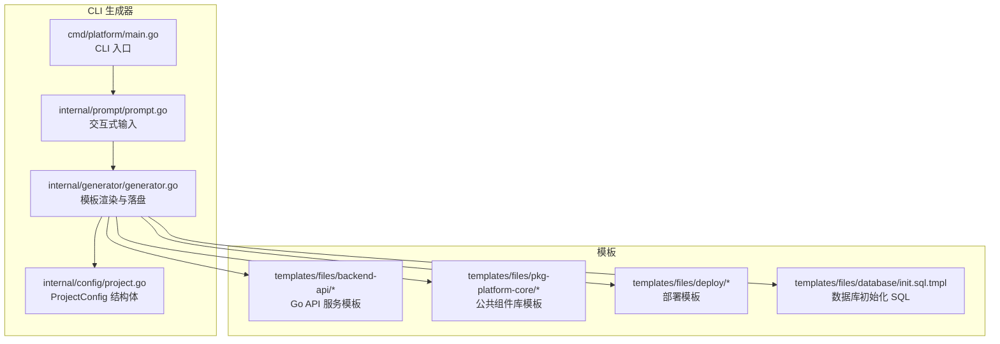

**图表来源**
- [cmd/platform/main.go:1-98](file://cmd/platform/main.go#L1-L98)
- [internal/prompt/prompt.go:1-131](file://internal/prompt/prompt.go#L1-L131)
- [internal/generator/generator.go:1-158](file://internal/generator/generator.go#L1-L158)
- [internal/config/project.go:1-121](file://internal/config/project.go#L1-L121)

**章节来源**
- [cmd/platform/main.go:1-98](file://cmd/platform/main.go#L1-L98)
- [internal/config/project.go:1-121](file://internal/config/project.go#L1-L121)
- [internal/generator/generator.go:1-158](file://internal/generator/generator.go#L1-L158)
- [internal/prompt/prompt.go:1-131](file://internal/prompt/prompt.go#L1-L131)

## 核心组件
- 服务入口与引导
  - 服务入口：templates/files/backend-api/cmd/api/main.go.tmpl
  - 应用引导：templates/files/backend-api/internal/app/bootstrap.go.tmpl
- 配置管理
  - 配置结构与加载：templates/files/backend-api/internal/config/config.go.tmpl
- 路由与处理器
  - 路由注册：templates/files/backend-api/internal/router/routes.go.tmpl
  - 用户处理器：templates/files/backend-api/internal/handler/user.go.tmpl
- 业务服务
  - 用户服务：templates/files/backend-api/internal/service/user.go.tmpl
- 数据访问层
  - 用户仓库：templates/files/backend-api/internal/repository/user_repo.go.tmpl
- 数据模型
  - 用户模型：templates/files/backend-api/internal/model/user.go.tmpl
- 中间件与响应
  - 中间件：templates/files/pkg-platform-core/middleware/middleware.go.tmpl
  - 统一响应：templates/files/pkg-platform-core/response/response.go.tmpl
- 部署与数据库
  - 本地部署：templates/files/deploy/local/docker-compose-all.yaml.tmpl
  - K3s 部署：templates/files/deploy/k3s/prod.yaml.tmpl、templates/files/deploy/k3s/services.yaml.tmpl
  - 数据库初始化：templates/files/database/init.sql.tmpl

**章节来源**
- [templates/files/backend-api/cmd/api/main.go.tmpl:1-56](file://templates/files/backend-api/cmd/api/main.go.tmpl#L1-L56)
- [templates/files/backend-api/internal/app/bootstrap.go.tmpl:1-99](file://templates/files/backend-api/internal/app/bootstrap.go.tmpl#L1-L99)
- [templates/files/backend-api/internal/config/config.go.tmpl:1-82](file://templates/files/backend-api/internal/config/config.go.tmpl#L1-L82)
- [templates/files/backend-api/internal/router/routes.go.tmpl:1-29](file://templates/files/backend-api/internal/router/routes.go.tmpl#L1-L29)
- [templates/files/backend-api/internal/handler/user.go.tmpl:1-47](file://templates/files/backend-api/internal/handler/user.go.tmpl#L1-L47)
- [templates/files/backend-api/internal/service/user.go.tmpl:1-38](file://templates/files/backend-api/internal/service/user.go.tmpl#L1-L38)
- [templates/files/backend-api/internal/repository/user_repo.go.tmpl:1-55](file://templates/files/backend-api/internal/repository/user_repo.go.tmpl#L1-L55)
- [templates/files/backend-api/internal/model/user.go.tmpl:1-26](file://templates/files/backend-api/internal/model/user.go.tmpl#L1-L26)
- [templates/files/pkg-platform-core/middleware/middleware.go.tmpl](file://templates/files/pkg-platform-core/middleware/middleware.go.tmpl)
- [templates/files/pkg-platform-core/response/response.go.tmpl](file://templates/files/pkg-platform-core/response/response.go.tmpl)
- [templates/files/deploy/local/docker-compose-all.yaml.tmpl](file://templates/files/deploy/local/docker-compose-all.yaml.tmpl)
- [templates/files/deploy/k3s/prod.yaml.tmpl](file://templates/files/deploy/k3s/prod.yaml.tmpl)
- [templates/files/deploy/k3s/services.yaml.tmpl](file://templates/files/deploy/k3s/services.yaml.tmpl)
- [templates/files/database/init.sql.tmpl](file://templates/files/database/init.sql.tmpl)

## 架构总览
后端 API 服务采用三层架构与清晰的分层职责：
- Handler：仅处理 HTTP 请求/响应，依赖 Service 层
- Service：业务编排，协调 Repository 与缓存
- Repository：数据访问，仅依赖 Model 与 GORM
- Model：领域实体，映射数据库表
- Router：集中注册路由
- Bootstrap：装配配置、DB、Redis、Repository、Service、Handler、Gin 中间件与路由
- Middleware：统一中间件栈（Recovery、CORS、RequestID、Metrics、InternalAuth）
- Response：统一响应格式

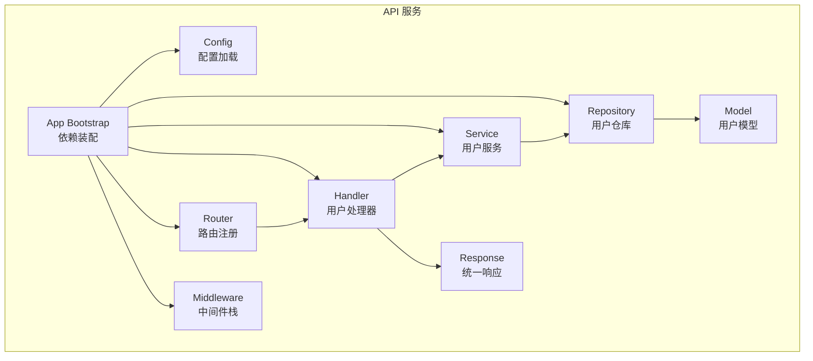

**图表来源**
- [templates/files/backend-api/internal/app/bootstrap.go.tmpl:1-99](file://templates/files/backend-api/internal/app/bootstrap.go.tmpl#L1-L99)
- [templates/files/backend-api/internal/router/routes.go.tmpl:1-29](file://templates/files/backend-api/internal/router/routes.go.tmpl#L1-L29)
- [templates/files/backend-api/internal/handler/user.go.tmpl:1-47](file://templates/files/backend-api/internal/handler/user.go.tmpl#L1-L47)
- [templates/files/backend-api/internal/service/user.go.tmpl:1-38](file://templates/files/backend-api/internal/service/user.go.tmpl#L1-L38)
- [templates/files/backend-api/internal/repository/user_repo.go.tmpl:1-55](file://templates/files/backend-api/internal/repository/user_repo.go.tmpl#L1-L55)
- [templates/files/backend-api/internal/model/user.go.tmpl:1-26](file://templates/files/backend-api/internal/model/user.go.tmpl#L1-L26)
- [templates/files/pkg-platform-core/middleware/middleware.go.tmpl](file://templates/files/pkg-platform-core/middleware/middleware.go.tmpl)
- [templates/files/pkg-platform-core/response/response.go.tmpl](file://templates/files/pkg-platform-core/response/response.go.tmpl)

## 组件详解

### 服务启动与引导流程
- main 函数负责启动 HTTP 服务器、信号处理与优雅关闭
- Bootstrap 负责装配配置、数据库、Redis、Repository、Service、Handler 与中间件，并返回 Gin 引擎
- 中间件顺序：Recovery → RequestID → PrometheusMetrics → InternalAuth
- 健康检查与指标端点：/health、/metrics

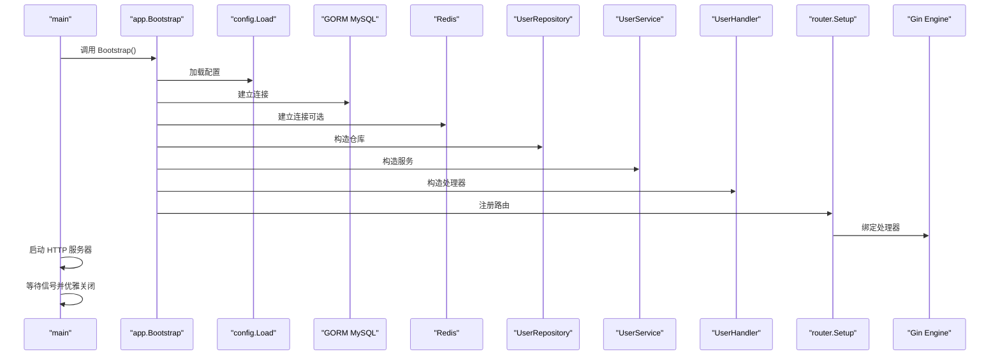

**图表来源**
- [templates/files/backend-api/cmd/api/main.go.tmpl:24-52](file://templates/files/backend-api/cmd/api/main.go.tmpl#L24-L52)
- [templates/files/backend-api/internal/app/bootstrap.go.tmpl:46-98](file://templates/files/backend-api/internal/app/bootstrap.go.tmpl#L46-L98)

**章节来源**
- [templates/files/backend-api/cmd/api/main.go.tmpl:1-56](file://templates/files/backend-api/cmd/api/main.go.tmpl#L1-L56)
- [templates/files/backend-api/internal/app/bootstrap.go.tmpl:1-99](file://templates/files/backend-api/internal/app/bootstrap.go.tmpl#L1-L99)

### 配置管理
- 配置结构包含 Server、DB、Redis、Internal、MasterKey
- 通过环境变量加载，提供默认值
- 支持运行时动态配置（MasterKey 用于加密）

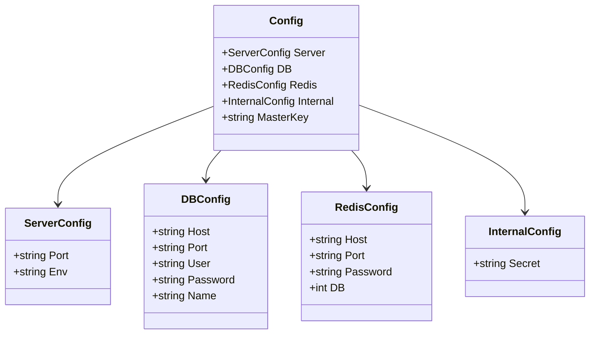

**图表来源**
- [templates/files/backend-api/internal/config/config.go.tmpl:8-41](file://templates/files/backend-api/internal/config/config.go.tmpl#L8-L41)

**章节来源**
- [templates/files/backend-api/internal/config/config.go.tmpl:1-82](file://templates/files/backend-api/internal/config/config.go.tmpl#L1-L82)

### 路由设计与处理器实现
- 路由前缀统一为 /api/v1
- 用户模块路由：/api/v1/users/me（GET）
- 处理器仅依赖 Service，负责解析请求头（X-User-UUID）并返回统一响应格式

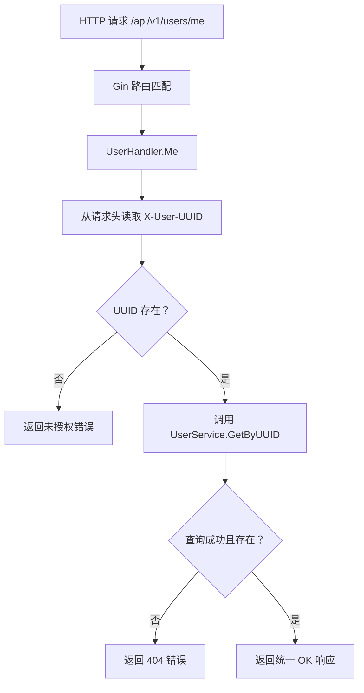

**图表来源**
- [templates/files/backend-api/internal/router/routes.go.tmpl:16-28](file://templates/files/backend-api/internal/router/routes.go.tmpl#L16-L28)
- [templates/files/backend-api/internal/handler/user.go.tmpl:28-46](file://templates/files/backend-api/internal/handler/user.go.tmpl#L28-L46)

**章节来源**
- [templates/files/backend-api/internal/router/routes.go.tmpl:1-29](file://templates/files/backend-api/internal/router/routes.go.tmpl#L1-L29)
- [templates/files/backend-api/internal/handler/user.go.tmpl:1-47](file://templates/files/backend-api/internal/handler/user.go.tmpl#L1-L47)

### 数据模型与仓储
- 用户模型包含 UUID、Email、PasswordHash、MemberLevel 等字段
- 仓储接口定义了按 UUID/Email 查询与创建/更新操作
- 仓储实现基于 GORM，上下文透传

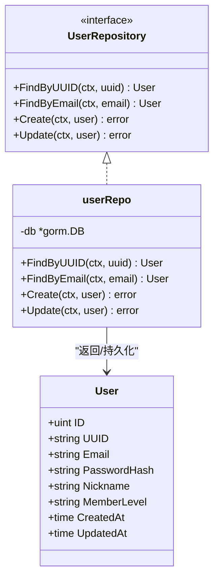

**图表来源**
- [templates/files/backend-api/internal/model/user.go.tmpl:6-26](file://templates/files/backend-api/internal/model/user.go.tmpl#L6-L26)
- [templates/files/backend-api/internal/repository/user_repo.go.tmpl:13-55](file://templates/files/backend-api/internal/repository/user_repo.go.tmpl#L13-L55)

**章节来源**
- [templates/files/backend-api/internal/model/user.go.tmpl:1-26](file://templates/files/backend-api/internal/model/user.go.tmpl#L1-L26)
- [templates/files/backend-api/internal/repository/user_repo.go.tmpl:1-55](file://templates/files/backend-api/internal/repository/user_repo.go.tmpl#L1-L55)

### 业务服务与依赖注入
- 服务层负责业务编排，依赖仓储与 Redis（可为空）
- 通过构造函数注入，保证依赖明确与可测试

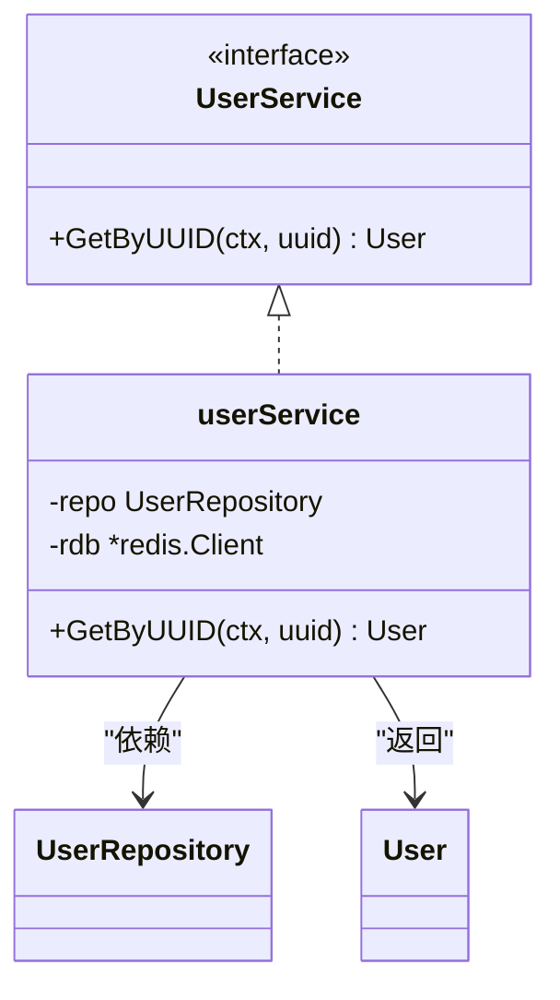

**图表来源**
- [templates/files/backend-api/internal/service/user.go.tmpl:16-38](file://templates/files/backend-api/internal/service/user.go.tmpl#L16-L38)
- [templates/files/backend-api/internal/repository/user_repo.go.tmpl:13-28](file://templates/files/backend-api/internal/repository/user_repo.go.tmpl#L13-L28)

**章节来源**
- [templates/files/backend-api/internal/service/user.go.tmpl:1-38](file://templates/files/backend-api/internal/service/user.go.tmpl#L1-L38)

### 中间件与统一响应
- 中间件顺序：Recovery → RequestID → PrometheusMetrics → InternalAuth
- 统一响应封装，便于前端与网关消费

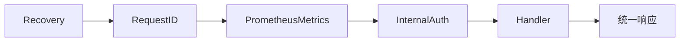

**图表来源**
- [templates/files/backend-api/internal/app/bootstrap.go.tmpl:84-89](file://templates/files/backend-api/internal/app/bootstrap.go.tmpl#L84-L89)
- [templates/files/pkg-platform-core/middleware/middleware.go.tmpl](file://templates/files/pkg-platform-core/middleware/middleware.go.tmpl)
- [templates/files/pkg-platform-core/response/response.go.tmpl](file://templates/files/pkg-platform-core/response/response.go.tmpl)

**章节来源**
- [templates/files/backend-api/internal/app/bootstrap.go.tmpl:1-99](file://templates/files/backend-api/internal/app/bootstrap.go.tmpl#L1-L99)
- [templates/files/pkg-platform-core/middleware/middleware.go.tmpl](file://templates/files/pkg-platform-core/middleware/middleware.go.tmpl)
- [templates/files/pkg-platform-core/response/response.go.tmpl](file://templates/files/pkg-platform-core/response/response.go.tmpl)

### 用户管理接口实现（当前可用与扩展建议）
- 当前实现
  - GET /api/v1/users/me：返回当前登录用户信息（依赖网关注入的 X-User-UUID）
- 扩展建议（模板中预留注释）
  - POST /api/v1/users/me/profile：更新用户资料（需在 handler/service/repository/model 中补充实现）

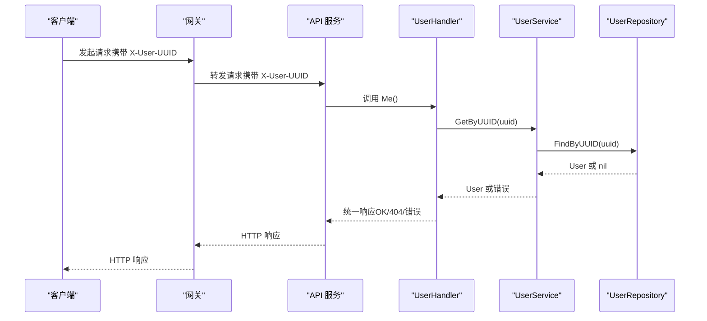

**图表来源**
- [templates/files/backend-api/internal/router/routes.go.tmpl:20-25](file://templates/files/backend-api/internal/router/routes.go.tmpl#L20-L25)
- [templates/files/backend-api/internal/handler/user.go.tmpl:28-46](file://templates/files/backend-api/internal/handler/user.go.tmpl#L28-L46)
- [templates/files/backend-api/internal/service/user.go.tmpl:31-37](file://templates/files/backend-api/internal/service/user.go.tmpl#L31-L37)
- [templates/files/backend-api/internal/repository/user_repo.go.tmpl:30-36](file://templates/files/backend-api/internal/repository/user_repo.go.tmpl#L30-L36)

**章节来源**
- [templates/files/backend-api/internal/router/routes.go.tmpl:1-29](file://templates/files/backend-api/internal/router/routes.go.tmpl#L1-L29)
- [templates/files/backend-api/internal/handler/user.go.tmpl:1-47](file://templates/files/backend-api/internal/handler/user.go.tmpl#L1-L47)
- [templates/files/backend-api/internal/service/user.go.tmpl:1-38](file://templates/files/backend-api/internal/service/user.go.tmpl#L1-L38)
- [templates/files/backend-api/internal/repository/user_repo.go.tmpl:1-55](file://templates/files/backend-api/internal/repository/user_repo.go.tmpl#L1-L55)

### Docker 容器化与部署
- 本地部署：使用 docker-compose 将 API、Gateway、AI Engine、Web、Admin、MySQL、Redis 一键拉起
- K3s 部署：提供 prod.yaml 与 services.yaml，适配集群环境
- 数据库初始化：init.sql.tmpl 提供 users 表结构

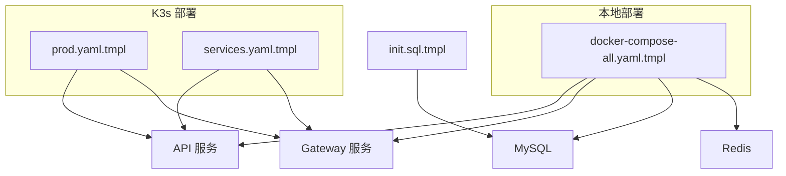

**图表来源**
- [templates/files/deploy/local/docker-compose-all.yaml.tmpl](file://templates/files/deploy/local/docker-compose-all.yaml.tmpl)
- [templates/files/deploy/k3s/prod.yaml.tmpl](file://templates/files/deploy/k3s/prod.yaml.tmpl)
- [templates/files/deploy/k3s/services.yaml.tmpl](file://templates/files/deploy/k3s/services.yaml.tmpl)
- [templates/files/database/init.sql.tmpl](file://templates/files/database/init.sql.tmpl)

**章节来源**
- [templates/files/deploy/local/docker-compose-all.yaml.tmpl](file://templates/files/deploy/local/docker-compose-all.yaml.tmpl)
- [templates/files/deploy/k3s/prod.yaml.tmpl](file://templates/files/deploy/k3s/prod.yaml.tmpl)
- [templates/files/deploy/k3s/services.yaml.tmpl](file://templates/files/deploy/k3s/services.yaml.tmpl)
- [templates/files/database/init.sql.tmpl](file://templates/files/database/init.sql.tmpl)

## 依赖关系分析
- 组件耦合与内聚
  - Handler 仅依赖 Service，Service 仅依赖 Repository，Repository 仅依赖 Model，符合分层内聚
- 直接与间接依赖
  - Gin、GORM、Redis 客户端、Prometheus 客户端、pkg-platform-core 中间件与响应
- 外部依赖与集成点
  - MySQL、Redis、网关（Gateway）通过 X-Internal-Secret 内部鉴权
  - 前端通过网关访问 API，网关注入 X-User-UUID

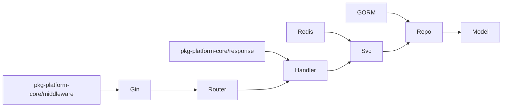

**图表来源**
- [templates/files/backend-api/internal/app/bootstrap.go.tmpl:12-24](file://templates/files/backend-api/internal/app/bootstrap.go.tmpl#L12-L24)
- [templates/files/backend-api/internal/router/routes.go.tmpl:10-14](file://templates/files/backend-api/internal/router/routes.go.tmpl#L10-L14)
- [templates/files/backend-api/internal/handler/user.go.tmpl:6-11](file://templates/files/backend-api/internal/handler/user.go.tmpl#L6-L11)
- [templates/files/backend-api/internal/service/user.go.tmpl:6-14](file://templates/files/backend-api/internal/service/user.go.tmpl#L6-L14)
- [templates/files/backend-api/internal/repository/user_repo.go.tmpl:4-11](file://templates/files/backend-api/internal/repository/user_repo.go.tmpl#L4-L11)
- [templates/files/pkg-platform-core/middleware/middleware.go.tmpl](file://templates/files/pkg-platform-core/middleware/middleware.go.tmpl)
- [templates/files/pkg-platform-core/response/response.go.tmpl](file://templates/files/pkg-platform-core/response/response.go.tmpl)

**章节来源**
- [templates/files/backend-api/internal/app/bootstrap.go.tmpl:1-99](file://templates/files/backend-api/internal/app/bootstrap.go.tmpl#L1-L99)
- [templates/files/backend-api/internal/router/routes.go.tmpl:1-29](file://templates/files/backend-api/internal/router/routes.go.tmpl#L1-L29)
- [templates/files/backend-api/internal/handler/user.go.tmpl:1-47](file://templates/files/backend-api/internal/handler/user.go.tmpl#L1-L47)
- [templates/files/backend-api/internal/service/user.go.tmpl:1-38](file://templates/files/backend-api/internal/service/user.go.tmpl#L1-L38)
- [templates/files/backend-api/internal/repository/user_repo.go.tmpl:1-55](file://templates/files/backend-api/internal/repository/user_repo.go.tmpl#L1-L55)
- [templates/files/pkg-platform-core/middleware/middleware.go.tmpl](file://templates/files/pkg-platform-core/middleware/middleware.go.tmpl)
- [templates/files/pkg-platform-core/response/response.go.tmpl](file://templates/files/pkg-platform-core/response/response.go.tmpl)

## 性能考量
- 中间件顺序优化：Recovery → RequestID → PrometheusMetrics → InternalAuth，减少异常路径开销
- Redis 可降级：当 Redis 不可用时，服务仍可通过空指针降级继续工作
- 指标暴露：/metrics 便于 Prometheus 抓取，辅助容量规划与性能监控
- 上下文透传：Repository 层使用 WithContext，有利于超时控制与追踪

[本节为通用指导，无需特定文件引用]

## 故障排查指南
- 启动失败
  - 检查配置加载（环境变量是否正确设置）
  - 查看数据库与 Redis 连接日志
- 认证失败
  - 确认网关已注入 X-User-UUID
  - 确认 InternalAuth 密钥配置正确
- 路由无法访问
  - 确认路由前缀与组是否正确
  - 检查中间件是否拦截请求
- 数据访问异常
  - 检查数据库初始化 SQL 与表结构一致性
  - 确认仓储方法与模型字段匹配

**章节来源**
- [templates/files/backend-api/internal/app/bootstrap.go.tmpl:46-98](file://templates/files/backend-api/internal/app/bootstrap.go.tmpl#L46-L98)
- [templates/files/backend-api/internal/config/config.go.tmpl:42-65](file://templates/files/backend-api/internal/config/config.go.tmpl#L42-L65)
- [templates/files/backend-api/internal/router/routes.go.tmpl:16-28](file://templates/files/backend-api/internal/router/routes.go.tmpl#L16-L28)
- [templates/files/backend-api/internal/handler/user.go.tmpl:28-46](file://templates/files/backend-api/internal/handler/user.go.tmpl#L28-L46)
- [templates/files/database/init.sql.tmpl](file://templates/files/database/init.sql.tmpl)

## 结论
该后端 API 服务脚手架通过模板化与自动化生成，提供了标准化的三层架构、完善的中间件体系、统一的响应格式与可扩展的部署方案。开发者可在生成的骨架基础上快速实现用户管理等业务功能，并遵循既定的中间件与配置约定，确保服务的一致性与可维护性。

[本节为总结性内容，无需特定文件引用]

## 附录

### API 接口测试示例（基于当前实现）
- 获取当前用户信息
  - 方法：GET
  - 路径：/api/v1/users/me
  - 请求头：X-User-UUID（由网关注入）
  - 成功响应：统一 OK 响应
  - 失败场景：未携带 X-User-UUID 返回未授权；用户不存在返回 404

**章节来源**
- [templates/files/backend-api/internal/router/routes.go.tmpl:20-25](file://templates/files/backend-api/internal/router/routes.go.tmpl#L20-L25)
- [templates/files/backend-api/internal/handler/user.go.tmpl:28-46](file://templates/files/backend-api/internal/handler/user.go.tmpl#L28-L46)

### 部署最佳实践
- 本地开发
  - 使用 docker-compose 一键拉起全部服务
  - 修改 .env 示例文件，设置数据库与 Redis 连接信息
- 生产部署
  - 使用 K3s YAML 配置，结合 services.yaml 管理服务暴露
  - 通过 init.sql 初始化数据库结构
- 安全与合规
  - 确保 INTERNAL_API_SECRET 正确配置，防止内部请求伪造
  - 使用 HTTPS 与安全的 Cookie 设置（由网关统一处理）

**章节来源**
- [templates/files/deploy/local/docker-compose-all.yaml.tmpl](file://templates/files/deploy/local/docker-compose-all.yaml.tmpl)
- [templates/files/deploy/k3s/prod.yaml.tmpl](file://templates/files/deploy/k3s/prod.yaml.tmpl)
- [templates/files/deploy/k3s/services.yaml.tmpl](file://templates/files/deploy/k3s/services.yaml.tmpl)
- [templates/files/database/init.sql.tmpl](file://templates/files/database/init.sql.tmpl)