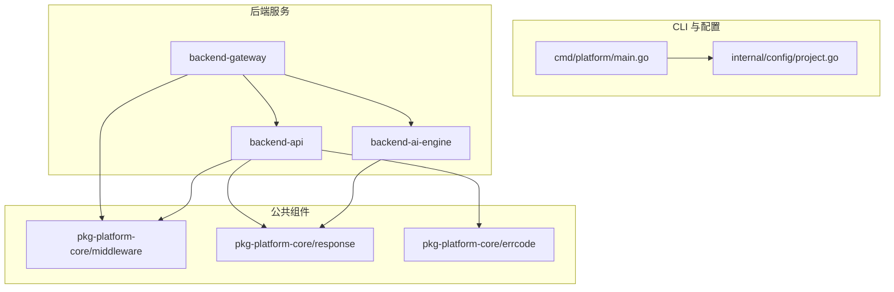
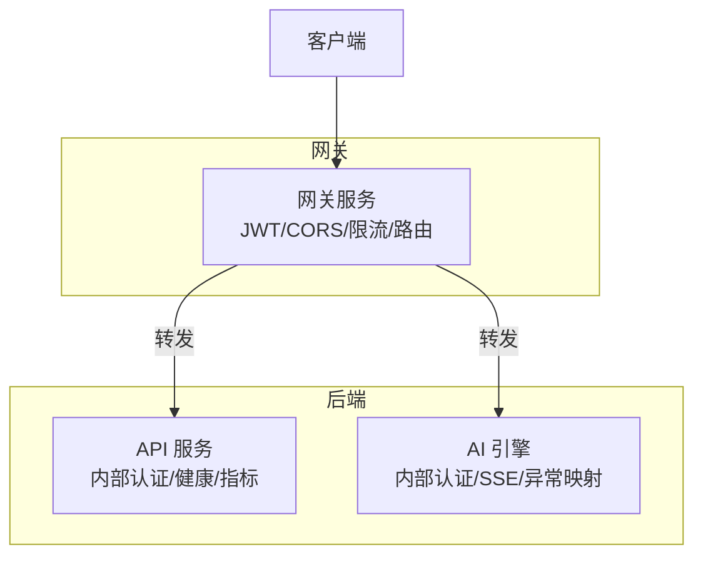
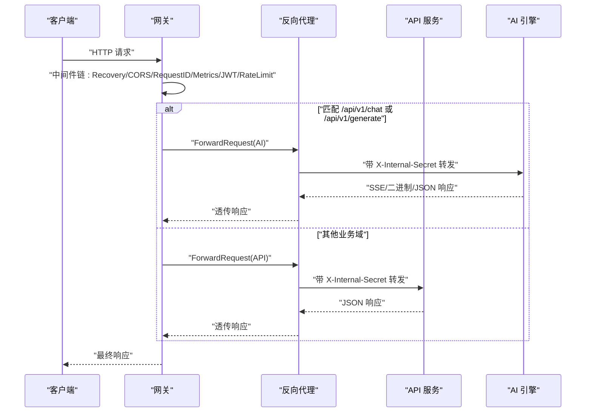
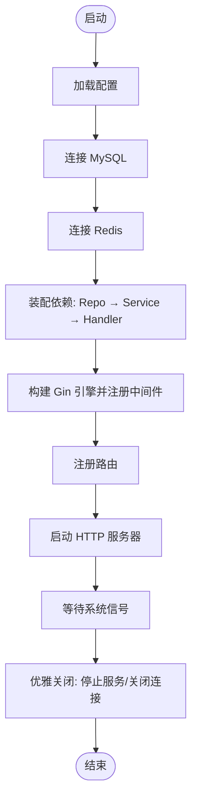
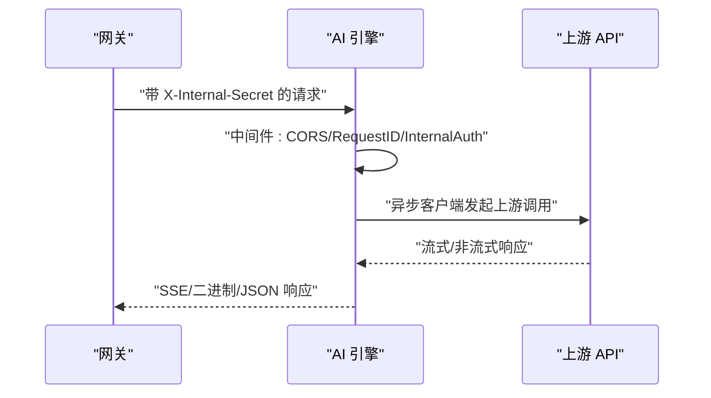
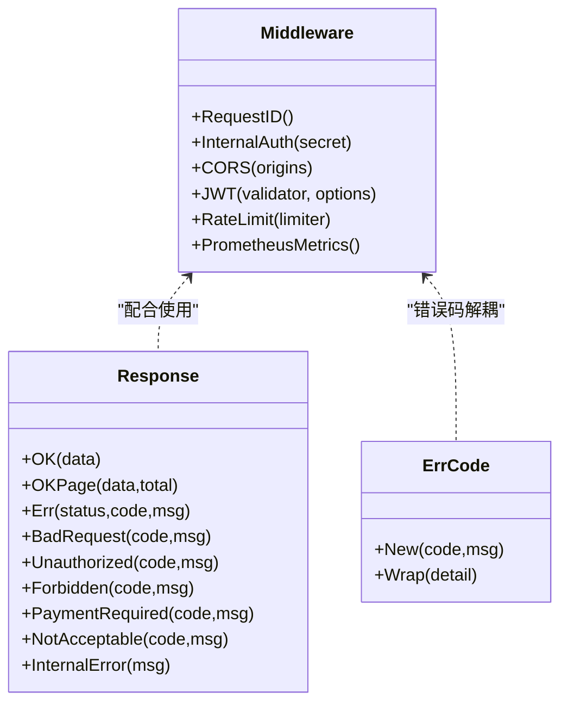
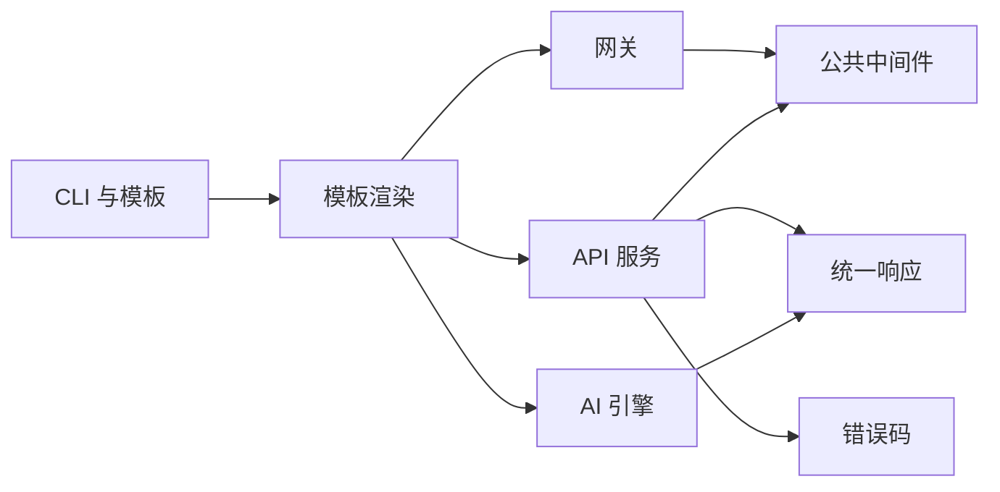

# 后端服务

<cite>
**本文档引用的文件**
- [cmd/platform/main.go](file://cmd/platform/main.go)
- [internal/config/project.go](file://internal/config/project.go)
- [templates/files/backend-api/cmd/api/main.go.tmpl](file://templates/files/backend-api/cmd/api/main.go.tmpl)
- [templates/files/backend-api/internal/app/bootstrap.go.tmpl](file://templates/files/backend-api/internal/app/bootstrap.go.tmpl)
- [templates/files/backend-api/internal/config/config.go.tmpl](file://templates/files/backend-api/internal/config/config.go.tmpl)
- [templates/files/backend-api/internal/router/routes.go.tmpl](file://templates/files/backend-api/internal/router/routes.go.tmpl)
- [templates/files/backend-gateway/cmd/gateway/main.go.tmpl](file://templates/files/backend-gateway/cmd/gateway/main.go.tmpl)
- [templates/files/backend-gateway/internal/config/config.go.tmpl](file://templates/files/backend-gateway/internal/config/config.go.tmpl)
- [templates/files/backend-gateway/internal/router/routes.go.tmpl](file://templates/files/backend-gateway/internal/router/routes.go.tmpl)
- [templates/files/backend-gateway/internal/proxy/proxy.go.tmpl](file://templates/files/backend-gateway/internal/proxy/proxy.go.tmpl)
- [templates/files/backend-ai-engine/app/main.py.tmpl](file://templates/files/backend-ai-engine/app/main.py.tmpl)
- [templates/files/backend-ai-engine/app/config.py.tmpl](file://templates/files/backend-ai-engine/app/config.py.tmpl)
- [templates/files/pkg-platform-core/middleware/middleware.go.tmpl](file://templates/files/pkg-platform-core/middleware/middleware.go.tmpl)
- [templates/files/pkg-platform-core/response/response.go.tmpl](file://templates/files/pkg-platform-core/response/response.go.tmpl)
- [templates/files/pkg-platform-core/errcode/errcode.go.tmpl](file://templates/files/pkg-platform-core/errcode/errcode.go.tmpl)
</cite>

## 目录
1. [简介](#简介)
2. [项目结构](#项目结构)
3. [核心组件](#核心组件)
4. [架构总览](#架构总览)
5. [详细组件分析](#详细组件分析)
6. [依赖分析](#依赖分析)
7. [性能考虑](#性能考虑)
8. [故障排查指南](#故障排查指南)
9. [结论](#结论)
10. [附录](#附录)

## 简介
本项目是一个多语言微服务脚手架，包含后端 API 服务、网关服务与 AI 引擎三类核心服务，配合公共中间件库与统一响应/错误码规范，形成“网关统一入口 + 服务内聚”的架构。CLI 工具负责根据交互配置生成完整工程骨架，包含本地与 K3s 两种部署方式。

## 项目结构
- CLI 入口与项目生成器：cmd/platform/main.go、internal/config/project.go
- 后端 API 服务：Go 语言，三层架构（Handler → Service → Repository），内置中间件链与健康/指标端点
- 网关服务：Go 语言，统一鉴权、CORS、限流、路由转发至下游 API/AI Engine
- AI 引擎：Python/FastAPI，内部认证、SSE/二进制流式响应、异常映射
- 公共组件库：pkg-platform-core，提供 JWT/CORS/RequestID/InternalAuth/限流/Prometheus 指标等通用中间件与统一响应/错误码

图表来源
- [cmd/platform/main.go:1-98](file://cmd/platform/main.go#L1-L98)
- [internal/config/project.go:1-121](file://internal/config/project.go#L1-L121)
- [templates/files/backend-gateway/cmd/gateway/main.go.tmpl:1-92](file://templates/files/backend-gateway/cmd/gateway/main.go.tmpl#L1-L92)
- [templates/files/backend-api/cmd/api/main.go.tmpl:1-56](file://templates/files/backend-api/cmd/api/main.go.tmpl#L1-L56)
- [templates/files/backend-ai-engine/app/main.py.tmpl:1-67](file://templates/files/backend-ai-engine/app/main.py.tmpl#L1-L67)
- [templates/files/pkg-platform-core/middleware/middleware.go.tmpl:1-202](file://templates/files/pkg-platform-core/middleware/middleware.go.tmpl#L1-L202)
- [templates/files/pkg-platform-core/response/response.go.tmpl:1-78](file://templates/files/pkg-platform-core/response/response.go.tmpl#L1-L78)
- [templates/files/pkg-platform-core/errcode/errcode.go.tmpl:1-84](file://templates/files/pkg-platform-core/errcode/errcode.go.tmpl#L1-L84)

章节来源
- [cmd/platform/main.go:1-98](file://cmd/platform/main.go#L1-L98)
- [internal/config/project.go:1-121](file://internal/config/project.go#L1-L121)

## 核心组件
- 网关服务（Go）：统一鉴权（JWT）、CORS、请求ID、Prometheus 指标、限流（Redis）、路由表与反向代理（SSE/二进制流）
- API 服务（Go）：三层架构、内部认证（X-Internal-Secret）、健康/指标端点、数据库与缓存连接
- AI 引擎（Python/FastAPI）：内部认证、SSE/二进制流、异常映射为统一响应
- 公共中间件库：RequestID、InternalAuth、CORS、JWT、限流、Prometheus 指标
- 统一响应与错误码：统一 {code,msg,data} 结构与六位业务错误码注册表

章节来源
- [templates/files/backend-gateway/cmd/gateway/main.go.tmpl:1-92](file://templates/files/backend-gateway/cmd/gateway/main.go.tmpl#L1-L92)
- [templates/files/backend-api/cmd/api/main.go.tmpl:1-56](file://templates/files/backend-api/cmd/api/main.go.tmpl#L1-L56)
- [templates/files/backend-ai-engine/app/main.py.tmpl:1-67](file://templates/files/backend-ai-engine/app/main.py.tmpl#L1-L67)
- [templates/files/pkg-platform-core/middleware/middleware.go.tmpl:1-202](file://templates/files/pkg-platform-core/middleware/middleware.go.tmpl#L1-L202)
- [templates/files/pkg-platform-core/response/response.go.tmpl:1-78](file://templates/files/pkg-platform-core/response/response.go.tmpl#L1-L78)
- [templates/files/pkg-platform-core/errcode/errcode.go.tmpl:1-84](file://templates/files/pkg-platform-core/errcode/errcode.go.tmpl#L1-L84)

## 架构总览
整体采用“网关统一入口 + 服务内聚”的分层架构：
- 网关负责鉴权、CORS、限流、路由与反向代理
- API 服务负责业务领域（用户、文件等）与数据持久化
- AI 引擎负责对话/生成等 AI 能力，支持流式响应
- 公共中间件库提供跨服务一致的横切能力

图表来源
- [templates/files/backend-gateway/internal/router/routes.go.tmpl:1-57](file://templates/files/backend-gateway/internal/router/routes.go.tmpl#L1-L57)
- [templates/files/backend-gateway/internal/proxy/proxy.go.tmpl:1-97](file://templates/files/backend-gateway/internal/proxy/proxy.go.tmpl#L1-L97)
- [templates/files/backend-api/internal/app/bootstrap.go.tmpl:1-99](file://templates/files/backend-api/internal/app/bootstrap.go.tmpl#L1-L99)
- [templates/files/backend-ai-engine/app/main.py.tmpl:1-67](file://templates/files/backend-ai-engine/app/main.py.tmpl#L1-L67)

## 详细组件分析

### 网关服务（Gateway）
- 职责：统一鉴权（JWT）、CORS、请求ID、Prometheus 指标、限流（Redis）、路由表与反向代理
- 中间件链（自外向内）：Recovery → CORS → RequestID → Prometheus → JWT → RateLimit
- 路由规则：按域转发到 API 或 AI 引擎；公开路径白名单；/admin 与 /internal 透传
- 反向代理：支持 SSE 与二进制流式响应，注入 X-Internal-Secret

图表来源
- [templates/files/backend-gateway/cmd/gateway/main.go.tmpl:1-92](file://templates/files/backend-gateway/cmd/gateway/main.go.tmpl#L1-L92)
- [templates/files/backend-gateway/internal/router/routes.go.tmpl:1-57](file://templates/files/backend-gateway/internal/router/routes.go.tmpl#L1-L57)
- [templates/files/backend-gateway/internal/proxy/proxy.go.tmpl:1-97](file://templates/files/backend-gateway/internal/proxy/proxy.go.tmpl#L1-L97)

章节来源
- [templates/files/backend-gateway/cmd/gateway/main.go.tmpl:1-92](file://templates/files/backend-gateway/cmd/gateway/main.go.tmpl#L1-L92)
- [templates/files/backend-gateway/internal/config/config.go.tmpl:1-127](file://templates/files/backend-gateway/internal/config/config.go.tmpl#L1-L127)
- [templates/files/backend-gateway/internal/router/routes.go.tmpl:1-57](file://templates/files/backend-gateway/internal/router/routes.go.tmpl#L1-L57)
- [templates/files/backend-gateway/internal/proxy/proxy.go.tmpl:1-97](file://templates/files/backend-gateway/internal/proxy/proxy.go.tmpl#L1-L97)

### API 服务（API）
- 职责：业务领域 API（用户、文件等），三层架构（Handler → Service → Repository）
- 中间件链：Recovery → RequestID → Prometheus → InternalAuth（X-Internal-Secret）
- 启动流程：加载配置 → 连接 MySQL/Redis → 装配依赖 → 注册路由 → 启动 HTTP 服务 → 优雅关闭
- 健康检查与指标：/health、/metrics

图表来源
- [templates/files/backend-api/cmd/api/main.go.tmpl:1-56](file://templates/files/backend-api/cmd/api/main.go.tmpl#L1-L56)
- [templates/files/backend-api/internal/app/bootstrap.go.tmpl:1-99](file://templates/files/backend-api/internal/app/bootstrap.go.tmpl#L1-L99)
- [templates/files/backend-api/internal/config/config.go.tmpl:1-82](file://templates/files/backend-api/internal/config/config.go.tmpl#L1-L82)
- [templates/files/backend-api/internal/router/routes.go.tmpl:1-29](file://templates/files/backend-api/internal/router/routes.go.tmpl#L1-L29)

章节来源
- [templates/files/backend-api/cmd/api/main.go.tmpl:1-56](file://templates/files/backend-api/cmd/api/main.go.tmpl#L1-L56)
- [templates/files/backend-api/internal/app/bootstrap.go.tmpl:1-99](file://templates/files/backend-api/internal/app/bootstrap.go.tmpl#L1-L99)
- [templates/files/backend-api/internal/config/config.go.tmpl:1-82](file://templates/files/backend-api/internal/config/config.go.tmpl#L1-L82)
- [templates/files/backend-api/internal/router/routes.go.tmpl:1-29](file://templates/files/backend-api/internal/router/routes.go.tmpl#L1-L29)

### AI 引擎（AI Engine）
- 职责：AI 对话/生成等能力，支持流式响应（SSE/音频/二进制）
- 中间件链：CORS（可选）→ RequestID → InternalAuth（X-Internal-Secret）
- 生命周期：lifespan 中启动 httpx.AsyncClient 并注入 X-Internal-Secret
- 异常映射：BizException 映射为统一 JSON 响应

图表来源
- [templates/files/backend-ai-engine/app/main.py.tmpl:1-67](file://templates/files/backend-ai-engine/app/main.py.tmpl#L1-L67)
- [templates/files/backend-ai-engine/app/config.py.tmpl:1-31](file://templates/files/backend-ai-engine/app/config.py.tmpl#L1-L31)

章节来源
- [templates/files/backend-ai-engine/app/main.py.tmpl:1-67](file://templates/files/backend-ai-engine/app/main.py.tmpl#L1-L67)
- [templates/files/backend-ai-engine/app/config.py.tmpl:1-31](file://templates/files/backend-ai-engine/app/config.py.tmpl#L1-L31)

### 公共中间件与统一响应
- RequestID：生成或透传 X-Request-ID
- InternalAuth：校验 X-Internal-Secret（开发环境可跳过）
- CORS：白名单 Origin + Credentials
- JWT：Bearer 校验 + 公开路径白名单 + 过期返回 403
- 限流：Redis 固定窗口限流，fail-open
- Prometheus 指标：http_requests_total/duration/in_flight
- 统一响应：{code,msg,data}，HTTP 状态码与业务错误码解耦
- 错误码：六位业务错误码注册表，按业务域分段

图表来源
- [templates/files/pkg-platform-core/middleware/middleware.go.tmpl:1-202](file://templates/files/pkg-platform-core/middleware/middleware.go.tmpl#L1-L202)
- [templates/files/pkg-platform-core/response/response.go.tmpl:1-78](file://templates/files/pkg-platform-core/response/response.go.tmpl#L1-L78)
- [templates/files/pkg-platform-core/errcode/errcode.go.tmpl:1-84](file://templates/files/pkg-platform-core/errcode/errcode.go.tmpl#L1-L84)

章节来源
- [templates/files/pkg-platform-core/middleware/middleware.go.tmpl:1-202](file://templates/files/pkg-platform-core/middleware/middleware.go.tmpl#L1-L202)
- [templates/files/pkg-platform-core/response/response.go.tmpl:1-78](file://templates/files/pkg-platform-core/response/response.go.tmpl#L1-L78)
- [templates/files/pkg-platform-core/errcode/errcode.go.tmpl:1-84](file://templates/files/pkg-platform-core/errcode/errcode.go.tmpl#L1-L84)

## 依赖分析
- CLI 与模板：cmd/platform/main.go 通过交互生成 ProjectConfig，交由模板渲染器生成后端 API、网关、AI 引擎与公共组件
- 网关依赖：Redis（限流）、JWT 管理器、pkg-platform-core 中间件、路由表、反向代理
- API 服务依赖：GORM MySQL、Redis、pkg-platform-core 中间件、路由表
- AI 引擎依赖：FastAPI、httpx AsyncClient、pkg-platform-core 响应与异常映射

图表来源
- [cmd/platform/main.go:1-98](file://cmd/platform/main.go#L1-L98)
- [internal/config/project.go:1-121](file://internal/config/project.go#L1-L121)
- [templates/files/backend-gateway/cmd/gateway/main.go.tmpl:1-92](file://templates/files/backend-gateway/cmd/gateway/main.go.tmpl#L1-L92)
- [templates/files/backend-api/internal/app/bootstrap.go.tmpl:1-99](file://templates/files/backend-api/internal/app/bootstrap.go.tmpl#L1-L99)
- [templates/files/backend-ai-engine/app/main.py.tmpl:1-67](file://templates/files/backend-ai-engine/app/main.py.tmpl#L1-L67)

章节来源
- [cmd/platform/main.go:1-98](file://cmd/platform/main.go#L1-L98)
- [internal/config/project.go:1-121](file://internal/config/project.go#L1-L121)

## 性能考虑
- 网关代理
  - 使用共享 http.Client，设置合理的 MaxIdleConns/IdleConnTimeout，减少连接开销
  - 对 SSE/二进制流启用无缓冲刷新，保障实时性
- API 服务
  - Redis Ping 超时控制，失败时降级（禁用缓存功能）
  - GORM 连接池与超时配置，避免阻塞
- AI 引擎
  - lifespan 中复用 httpx.AsyncClient，降低握手成本
  - 流式响应直写，避免大对象拷贝
- 指标与监控
  - Prometheus 指标采集，结合限流与熔断策略进行容量规划

## 故障排查指南
- 网关
  - Redis 连接失败：限流禁用，检查主机/端口/密码；确认网关配置中的 Redis 地址
  - JWT 校验失败：确认 Authorization 头或查询参数 t；核对公开路径白名单
  - 路由转发失败：检查 Services.APIService / AIEngineService 地址；确认 X-Internal-Secret
- API 服务
  - 数据库连接失败：核对 MYSQL_* 环境变量；确认 DSN 拼接正确
  - 内部认证失败：确认 INTERNAL_API_SECRET；检查网关是否注入 X-Internal-Secret
  - 健康检查失败：确认 /health 端点可达；查看日志
- AI 引擎
  - 上游 API 不可用：检查 API_BASE_URL；确认内部认证密钥
  - 流式响应中断：确认上游 SSE/二进制类型；检查网关代理流式逻辑
- 统一响应与错误码
  - 业务错误统一返回 400 + code，注意区分鉴权/订阅/业务错误的 HTTP 状态码
  - 错误码注册表集中维护，避免重复与冲突

章节来源
- [templates/files/backend-gateway/cmd/gateway/main.go.tmpl:1-92](file://templates/files/backend-gateway/cmd/gateway/main.go.tmpl#L1-L92)
- [templates/files/backend-gateway/internal/config/config.go.tmpl:1-127](file://templates/files/backend-gateway/internal/config/config.go.tmpl#L1-L127)
- [templates/files/backend-api/internal/app/bootstrap.go.tmpl:1-99](file://templates/files/backend-api/internal/app/bootstrap.go.tmpl#L1-L99)
- [templates/files/backend-api/internal/config/config.go.tmpl:1-82](file://templates/files/backend-api/internal/config/config.go.tmpl#L1-L82)
- [templates/files/backend-ai-engine/app/config.py.tmpl:1-31](file://templates/files/backend-ai-engine/app/config.py.tmpl#L1-L31)
- [templates/files/pkg-platform-core/response/response.go.tmpl:1-78](file://templates/files/pkg-platform-core/response/response.go.tmpl#L1-L78)
- [templates/files/pkg-platform-core/errcode/errcode.go.tmpl:1-84](file://templates/files/pkg-platform-core/errcode/errcode.go.tmpl#L1-L84)

## 结论
该脚手架提供了高内聚、低耦合的后端服务架构：网关统一治理，API 服务专注业务，AI 引擎聚焦推理能力；通过公共中间件与统一响应/错误码，实现跨服务一致的可观测性与可维护性。结合模板化生成与本地/集群部署方案，可快速落地生产级微服务体系。

## 附录
- 服务启动流程
  - 网关：加载配置 → 初始化 Redis/JWT → 注册中间件与路由 → 启动 HTTP 服务 → 优雅关闭
  - API：装配配置 → 连接数据库/缓存 → 依赖注入 → 注册路由 → 启动 HTTP 服务 → 优雅关闭
  - AI 引擎：lifespan 启动异步客户端 → 注册中间件与异常处理器 → 包含路由 → 启动 ASGI
- 配置管理
  - 网关：GATEWAY_PORT、JWT_SECRET、API_SERVICE_URL、AI_ENGINE_SERVICE_URL、CORS_ORIGINS、REDIS_*、INTERNAL_API_SECRET
  - API：API_PORT、APP_ENV、MYSQL_*、REDIS_*、INTERNAL_API_SECRET、CONFIG_MASTER_KEY
  - AI 引擎：AI_ENGINE_PORT、APP_ENV、INTERNAL_API_SECRET、API_BASE_URL、CORS_ORIGINS
- 路由处理与中间件集成
  - 网关：路由表按域转发；JWT/CORS/限流/指标中间件链；SSE/二进制流式代理
  - API：内部认证保护私域；三层架构；健康/指标端点
  - AI 引擎：内部认证；SSE/二进制流；异常映射
- Docker 容器化与部署
  - 本地：参考 deploy/local/docker-compose-all.yaml.tmpl 与 start.sh.tmpl
  - K3s：参考 deploy/k3s/services.yaml.tmpl 与 prod.yaml.tmpl
- 服务间调用示例
  - 网关 → API：/api/v1/users/* → X-Internal-Secret 注入
  - 网关 → AI：/api/v1/chat/* → 流式响应透传
  - AI → API：lifespan 中 httpx.AsyncClient 带 X-Internal-Secret

章节来源
- [templates/files/backend-gateway/cmd/gateway/main.go.tmpl:1-92](file://templates/files/backend-gateway/cmd/gateway/main.go.tmpl#L1-L92)
- [templates/files/backend-api/cmd/api/main.go.tmpl:1-56](file://templates/files/backend-api/cmd/api/main.go.tmpl#L1-L56)
- [templates/files/backend-ai-engine/app/main.py.tmpl:1-67](file://templates/files/backend-ai-engine/app/main.py.tmpl#L1-L67)
- [templates/files/backend-gateway/internal/router/routes.go.tmpl:1-57](file://templates/files/backend-gateway/internal/router/routes.go.tmpl#L1-L57)
- [templates/files/backend-gateway/internal/proxy/proxy.go.tmpl:1-97](file://templates/files/backend-gateway/internal/proxy/proxy.go.tmpl#L1-L97)
- [templates/files/backend-api/internal/router/routes.go.tmpl:1-29](file://templates/files/backend-api/internal/router/routes.go.tmpl#L1-L29)
- [templates/files/pkg-platform-core/middleware/middleware.go.tmpl:1-202](file://templates/files/pkg-platform-core/middleware/middleware.go.tmpl#L1-L202)
- [templates/files/pkg-platform-core/response/response.go.tmpl:1-78](file://templates/files/pkg-platform-core/response/response.go.tmpl#L1-L78)
- [templates/files/pkg-platform-core/errcode/errcode.go.tmpl:1-84](file://templates/files/pkg-platform-core/errcode/errcode.go.tmpl#L1-L84)