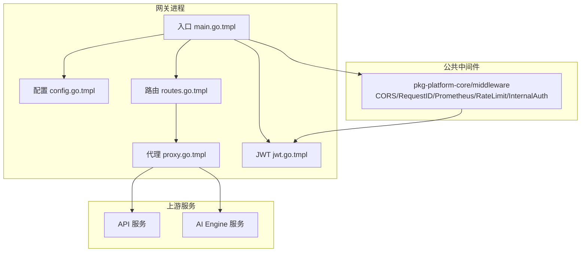
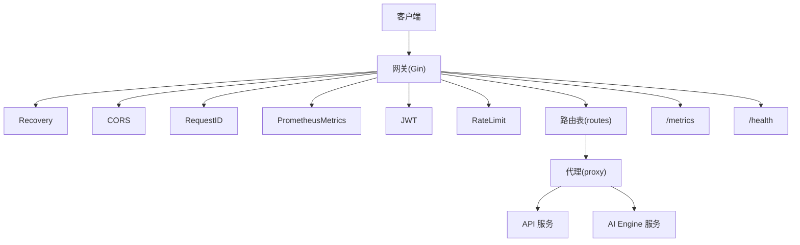
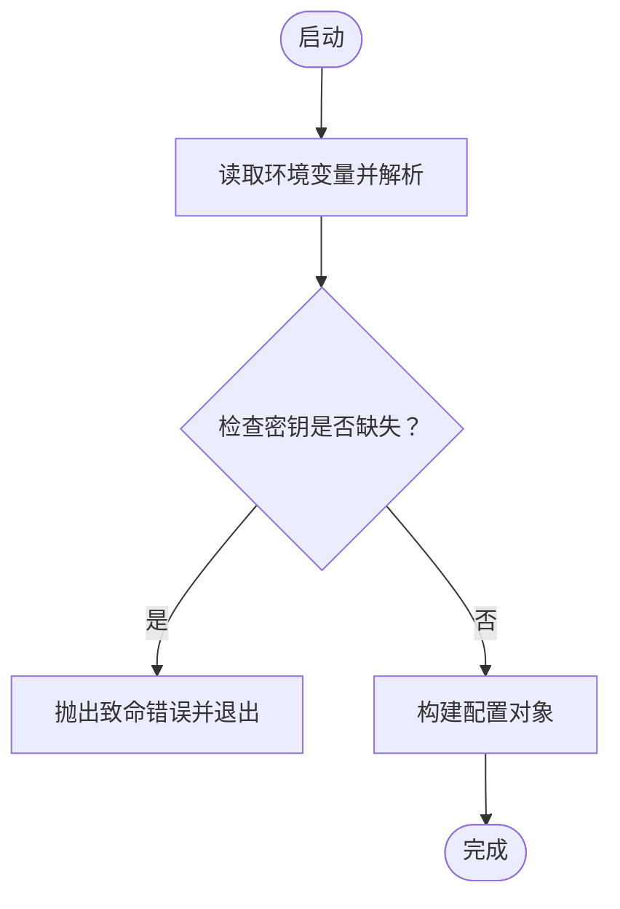
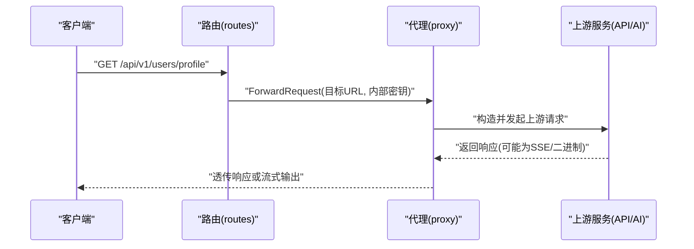
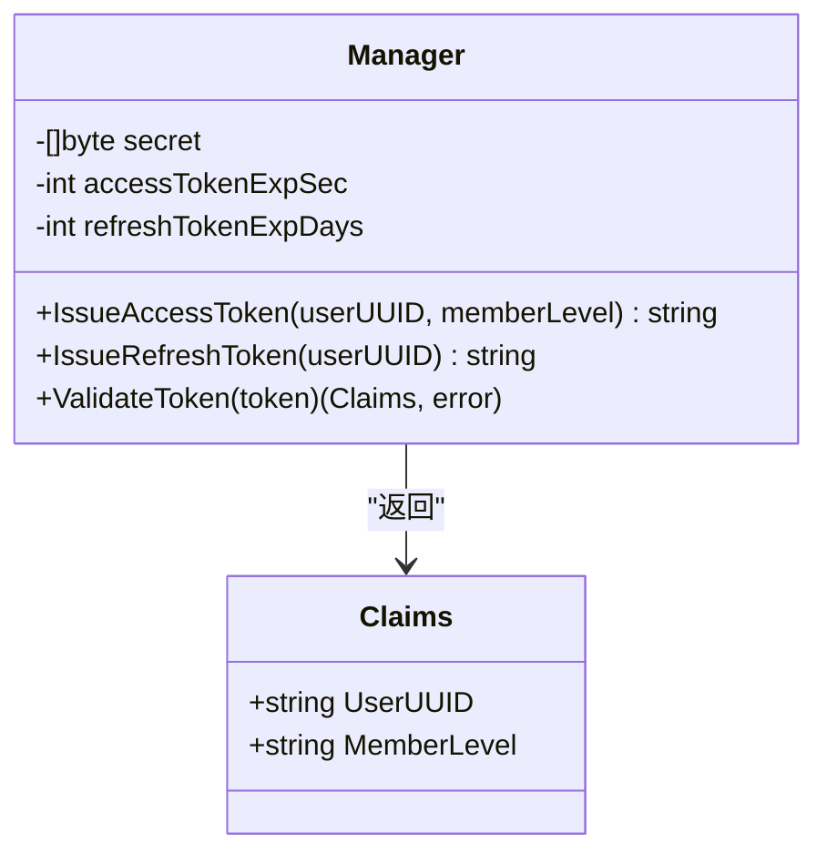
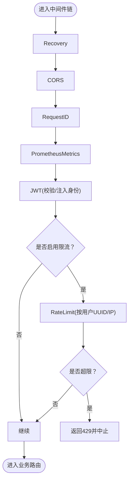
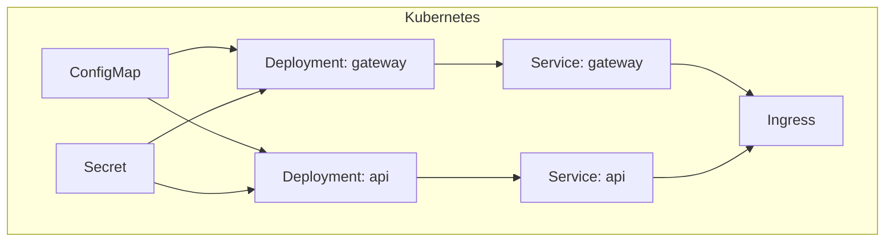
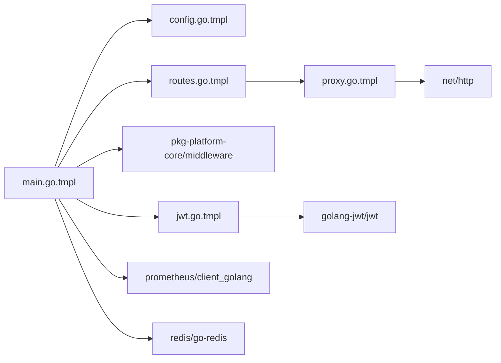

# 后端网关服务

<cite>
**本文引用的文件**
- [main.go.tmpl](file://templates/files/backend-gateway/cmd/gateway/main.go.tmpl)
- [config.go.tmpl](file://templates/files/backend-gateway/internal/config/config.go.tmpl)
- [proxy.go.tmpl](file://templates/files/backend-gateway/internal/proxy/proxy.go.tmpl)
- [routes.go.tmpl](file://templates/files/backend-gateway/internal/router/routes.go.tmpl)
- [jwt.go.tmpl](file://templates/files/backend-gateway/pkg/jwt/jwt.go.tmpl)
- [middleware.md](file://templates/files/pkg-platform-core/docs/middleware.md)
- [ratelimit_metrics.go.tmpl](file://templates/files/pkg-platform-core/middleware/ratelimit_metrics.go.tmpl)
- [prod.yaml.tmpl](file://templates/files/deploy/k3s/prod.yaml.tmpl)
- [services.yaml.tmpl](file://templates/files/deploy/k3s/services.yaml.tmpl)
- [install.sh.tmpl](file://templates/files/deploy/k3s/install.sh.tmpl)
</cite>

## 目录
1. [简介](#简介)
2. [项目结构](#项目结构)
3. [核心组件](#核心组件)
4. [架构总览](#架构总览)
5. [详细组件分析](#详细组件分析)
6. [依赖关系分析](#依赖关系分析)
7. [性能考虑](#性能考虑)
8. [故障排查指南](#故障排查指南)
9. [结论](#结论)
10. [附录](#附录)

## 简介
本文件系统性阐述后端网关服务的设计与实现，覆盖请求路由、负载均衡、安全控制、JWT 认证、代理转发、中间件链路、错误处理与部署配置等主题。网关作为统一入口，聚合上游 API 与 AI Engine 的能力，提供跨域、鉴权、限流、可观测性与内部身份校验等能力。

## 项目结构
后端网关采用 Go + Gin 构建，核心目录组织如下：
- cmd/gateway：网关入口程序，初始化配置、中间件与路由，启动 HTTP 服务器与优雅关闭。
- internal/config：配置加载与环境变量解析。
- internal/router：路由表定义，将不同前缀的请求转发至对应上游服务。
- internal/proxy：反向代理实现，支持 SSE 与二进制流式响应。
- pkg/jwt：JWT 管理器，实现访问令牌签发与校验。
- pkg-platform-core：公共中间件与文档，包含 CORS、请求 ID、Prometheus 指标、限流与内部鉴权等。
- deploy/k3s：K3s 部署清单与安装脚本，含 ConfigMap、Secret、Deployment、Service、Ingress。

**图表来源**
- [main.go.tmpl:30-91](file://templates/files/backend-gateway/cmd/gateway/main.go.tmpl#L30-L91)
- [config.go.tmpl:52-86](file://templates/files/backend-gateway/internal/config/config.go.tmpl#L52-L86)
- [routes.go.tmpl:21-56](file://templates/files/backend-gateway/internal/router/routes.go.tmpl#L21-L56)
- [proxy.go.tmpl:26-66](file://templates/files/backend-gateway/internal/proxy/proxy.go.tmpl#L26-L66)
- [jwt.go.tmpl:31-87](file://templates/files/backend-gateway/pkg/jwt/jwt.go.tmpl#L31-L87)

**章节来源**
- [main.go.tmpl:30-91](file://templates/files/backend-gateway/cmd/gateway/main.go.tmpl#L30-L91)
- [config.go.tmpl:52-86](file://templates/files/backend-gateway/internal/config/config.go.tmpl#L52-L86)

## 核心组件
- 配置中心：集中管理服务端口、JWT 参数、Redis、上游服务地址、CORS 与内部密钥等。
- 路由表：基于前缀分发，将请求映射到 API 或 AI Engine。
- 代理层：封装上游 HTTP 客户端，注入内部密钥，支持 SSE 与二进制流式响应。
- JWT 管理器：签发短期访问令牌与长期刷新令牌，校验令牌并区分过期与无效。
- 中间件链：恢复、CORS、请求 ID、指标、JWT、限流；顺序严格保证限流依赖用户标识。
- 部署与发现：K3s 部署清单，通过 Service 与 Ingress 对外暴露，支持多副本与就绪探针。

**章节来源**
- [config.go.tmpl:9-51](file://templates/files/backend-gateway/internal/config/config.go.tmpl#L9-L51)
- [routes.go.tmpl:21-56](file://templates/files/backend-gateway/internal/router/routes.go.tmpl#L21-L56)
- [proxy.go.tmpl:26-66](file://templates/files/backend-gateway/internal/proxy/proxy.go.tmpl#L26-L66)
- [jwt.go.tmpl:16-87](file://templates/files/backend-gateway/pkg/jwt/jwt.go.tmpl#L16-L87)
- [middleware.md:145-170](file://templates/files/pkg-platform-core/docs/middleware.md#L145-L170)

## 架构总览
下图展示网关与上游服务、中间件与外部系统的交互关系。

**图表来源**
- [main.go.tmpl:48-66](file://templates/files/backend-gateway/cmd/gateway/main.go.tmpl#L48-L66)
- [routes.go.tmpl:21-56](file://templates/files/backend-gateway/internal/router/routes.go.tmpl#L21-L56)
- [proxy.go.tmpl:26-66](file://templates/files/backend-gateway/internal/proxy/proxy.go.tmpl#L26-L66)

## 详细组件分析

### 配置管理
- 配置项
  - 服务器：端口
  - JWT：密钥、访问令牌过期秒数、刷新令牌过期天数、公开路径前缀
  - Redis：主机、端口、密码、数据库编号
  - 上游服务：API 服务地址、AI Engine 服务地址
  - 内部密钥：用于网关与下游服务的身份校验
  - CORS：允许的源列表
- 加载策略
  - 优先读取环境变量，缺失时使用模板默认值
  - 密钥类变量缺失会直接导致启动失败，确保生产安全
  - 数组类变量通过逗号分隔解析

**图表来源**
- [config.go.tmpl:52-126](file://templates/files/backend-gateway/internal/config/config.go.tmpl#L52-L126)

**章节来源**
- [config.go.tmpl:52-86](file://templates/files/backend-gateway/internal/config/config.go.tmpl#L52-L86)

### 路由与代理转发
- 路由规则
  - /api/v1/auth/* → API 服务
  - /oauth2/authorize 与 /login/oauth2/code → API 服务
  - /api/v1/{users,files,search,track}/* → API 服务
  - 当启用 AI 功能时：
    - /api/v1/chat/* → AI Engine 服务
    - /api/v1/generate/* → AI Engine 服务
  - /admin/* 与 /internal/* → API 服务（下游自行校验）
- 代理行为
  - 组装上游完整 URL（含查询参数）
  - 复制请求头，注入 X-Internal-Secret
  - 对 SSE 与二进制流进行特殊处理，保持长连接与低延迟
  - 非流式响应透传状态码与响应头（Set-Cookie 保留多值）

**图表来源**
- [routes.go.tmpl:21-56](file://templates/files/backend-gateway/internal/router/routes.go.tmpl#L21-L56)
- [proxy.go.tmpl:26-66](file://templates/files/backend-gateway/internal/proxy/proxy.go.tmpl#L26-L66)

**章节来源**
- [routes.go.tmpl:21-56](file://templates/files/backend-gateway/internal/router/routes.go.tmpl#L21-L56)
- [proxy.go.tmpl:26-66](file://templates/files/backend-gateway/internal/proxy/proxy.go.tmpl#L26-L66)

### JWT 认证机制
- 签发
  - IssueAccessToken：短期访问令牌，携带用户 UUID 与会员等级，使用 HS256 签名
  - IssueRefreshToken：长期刷新令牌，使用 HS256 签名
- 校验
  - ValidateToken：解析并验证签名，区分过期与无效
  - 返回 Claims：包含用户 UUID 与会员等级，供后续中间件与业务使用
- 中间件集成
  - 作为全局中间件，需在限流之前执行，以确保限流可基于用户标识
  - 公开路径前缀无需登录，但仍会尝试解析令牌并注入身份头（忽略解析失败）

**图表来源**
- [jwt.go.tmpl:16-87](file://templates/files/backend-gateway/pkg/jwt/jwt.go.tmpl#L16-L87)

**章节来源**
- [jwt.go.tmpl:31-87](file://templates/files/backend-gateway/pkg/jwt/jwt.go.tmpl#L31-L87)
- [middleware.md:78-93](file://templates/files/pkg-platform-core/docs/middleware.md#L78-L93)

### 中间件处理流程
- 中间件链顺序（网关）
  - Recovery → CORS → RequestID → PrometheusMetrics → JWT → RateLimit
- 行为矩阵（受保护路径 vs 公开路径）
  - 公开路径 + 无 token：放行，不注入身份头
  - 公开路径 + 有 token：放行，尝试解析并注入身份头（忽略解析失败）
  - 受保护路径 + 无 token：401
  - 受保护路径 + 无 token + 有 refresh cookie：403（提示前端自动刷新）
  - 受保护路径 + token 过期：403
  - 受保护路径 + token 无效：401
  - 受保护路径 + 合法 token：放行，注入 X-User-UUID / X-Member-Level
- 限流策略
  - 用户 UUID 或 IP 作为标识，固定窗口限流
  - Redis 错误时 fail-open（放行），避免单点故障放大
  - 超限返回 429

**图表来源**
- [main.go.tmpl:48-59](file://templates/files/backend-gateway/cmd/gateway/main.go.tmpl#L48-L59)
- [middleware.md:66-77](file://templates/files/pkg-platform-core/docs/middleware.md#L66-L77)
- [ratelimit_metrics.go.tmpl:32-66](file://templates/files/pkg-platform-core/middleware/ratelimit_metrics.go.tmpl#L32-L66)

**章节来源**
- [main.go.tmpl:48-59](file://templates/files/backend-gateway/cmd/gateway/main.go.tmpl#L48-L59)
- [middleware.md:145-170](file://templates/files/pkg-platform-core/docs/middleware.md#L145-L170)
- [ratelimit_metrics.go.tmpl:32-66](file://templates/files/pkg-platform-core/middleware/ratelimit_metrics.go.tmpl#L32-L66)

### 错误处理策略
- 代理层
  - 请求构造失败：返回 502 Bad Gateway
  - 上游不可达：返回 502 Bad Gateway
  - 流式场景不支持 flush：返回 500
- 限流
  - Redis 错误时 fail-open，继续请求
  - 超限返回 429 Too Many Requests
- 中间件
  - CORS、指标、请求 ID：无副作用，仅记录
  - JWT：根据行为矩阵返回 401/403
- 优雅关闭
  - 捕获信号，30 秒优雅关闭，强制关闭时记录错误日志

**章节来源**
- [proxy.go.tmpl:34-50](file://templates/files/backend-gateway/internal/proxy/proxy.go.tmpl#L34-L50)
- [ratelimit_metrics.go.tmpl:50-63](file://templates/files/pkg-platform-core/middleware/ratelimit_metrics.go.tmpl#L50-L63)
- [main.go.tmpl:77-90](file://templates/files/backend-gateway/cmd/gateway/main.go.tmpl#L77-L90)

### 部署与服务发现
- 部署清单
  - ConfigMap：注入非敏感环境变量（端口、服务地址、CORS、Redis、MySQL）
  - Secret：注入敏感变量（JWT_SECRET、INTERNAL_API_SECRET、CONFIG_MASTER_KEY、MYSQL_PASSWORD）
  - Deployment：网关与 API 服务各部署 2 副本，带就绪探针
  - Service：对外暴露网关与 API 服务
  - Ingress：Traefik 入口，开启 TLS 与 websecure 入口
- 安装脚本
  - 支持拉取 kubeconfig、部署、查看状态、查看日志等命令
- 服务发现
  - 通过 Kubernetes Service 名称与端口访问上游服务（API_SERVICE_URL、AI_ENGINE_SERVICE_URL）

**图表来源**
- [prod.yaml.tmpl:8-86](file://templates/files/deploy/k3s/prod.yaml.tmpl#L8-L86)
- [services.yaml.tmpl:6-57](file://templates/files/deploy/k3s/services.yaml.tmpl#L6-L57)
- [install.sh.tmpl:33-47](file://templates/files/deploy/k3s/install.sh.tmpl#L33-L47)

**章节来源**
- [prod.yaml.tmpl:8-86](file://templates/files/deploy/k3s/prod.yaml.tmpl#L8-L86)
- [services.yaml.tmpl:6-57](file://templates/files/deploy/k3s/services.yaml.tmpl#L6-L57)
- [install.sh.tmpl:1-58](file://templates/files/deploy/k3s/install.sh.tmpl#L1-L58)

## 依赖关系分析
- 组件耦合
  - main.go 依赖 config、router、proxy、jwt 与公共中间件
  - router 依赖 config 与 proxy
  - proxy 依赖 gin 与标准库 HTTP 客户端
  - jwt 依赖 golang-jwt 与公共中间件接口
- 外部依赖
  - Gin：Web 框架
  - Prometheus：指标采集
  - Redis：限流计数
  - Kubernetes：部署与服务发现

**图表来源**
- [main.go.tmpl:20-28](file://templates/files/backend-gateway/cmd/gateway/main.go.tmpl#L20-L28)
- [routes.go.tmpl:13-18](file://templates/files/backend-gateway/internal/router/routes.go.tmpl#L13-L18)
- [proxy.go.tmpl:4-11](file://templates/files/backend-gateway/internal/proxy/proxy.go.tmpl#L4-L11)
- [jwt.go.tmpl:4-11](file://templates/files/backend-gateway/pkg/jwt/jwt.go.tmpl#L4-L11)

**章节来源**
- [main.go.tmpl:20-28](file://templates/files/backend-gateway/cmd/gateway/main.go.tmpl#L20-L28)
- [routes.go.tmpl:13-18](file://templates/files/backend-gateway/internal/router/routes.go.tmpl#L13-L18)
- [proxy.go.tmpl:4-11](file://templates/files/backend-gateway/internal/proxy/proxy.go.tmpl#L4-L11)
- [jwt.go.tmpl:4-11](file://templates/files/backend-gateway/pkg/jwt/jwt.go.tmpl#L4-L11)

## 性能考虑
- 代理层
  - 复用 HTTP 客户端，设置合理的空闲连接数与超时时间，降低连接开销
  - 对 SSE 与二进制流启用无缓冲与逐块 flush，减少延迟
- 中间件
  - Prometheus 指标尽量靠前，确保捕获所有请求（包括被拦截的）
  - 限流放在 JWT 之后，确保能基于用户标识限流
- 部署
  - 多副本部署，结合就绪探针保障平滑升级
  - Ingress 层面启用 TLS 与连接复用，提升整体吞吐

[本节为通用性能建议，无需特定文件引用]

## 故障排查指南
- 启动失败
  - 检查 JWT_SECRET、INTERNAL_API_SECRET 是否正确注入
  - 查看 Redis 连接日志，确认限流功能是否启用
- 代理异常
  - 上游服务不可达：确认上游 Service 名称与端口配置
  - 流式响应中断：确认客户端支持 SSE/二进制流，且网关未提前关闭连接
- 鉴权问题
  - 公开路径仍报 401：确认 PublicPaths 配置是否包含该路径
  - 403 Access token expired：前端应自动刷新
- 限流问题
  - Redis 不可用：限流降级为放行，检查 Redis 连接配置
  - 429 Too Many Requests：调整限流阈值或标识策略

**章节来源**
- [config.go.tmpl:95-100](file://templates/files/backend-gateway/internal/config/config.go.tmpl#L95-L100)
- [main.go.tmpl:34-44](file://templates/files/backend-gateway/cmd/gateway/main.go.tmpl#L34-L44)
- [proxy.go.tmpl:68-96](file://templates/files/backend-gateway/internal/proxy/proxy.go.tmpl#L68-L96)
- [middleware.md:66-77](file://templates/files/pkg-platform-core/docs/middleware.md#L66-L77)
- [ratelimit_metrics.go.tmpl:50-63](file://templates/files/pkg-platform-core/middleware/ratelimit_metrics.go.tmpl#L50-L63)

## 结论
该网关通过清晰的中间件链、可扩展的路由表与稳健的代理转发，实现了统一入口、安全控制与可观测性。配合 K3s 部署与服务发现，具备良好的弹性与可维护性。建议在生产中严格管理密钥、合理配置限流与监控，并持续优化路由与代理策略以满足业务增长需求。

[本节为总结性内容，无需特定文件引用]

## 附录

### 关键环境变量一览
- GATEWAY_PORT：网关监听端口
- JWT_SECRET：JWT 密钥（必需）
- JWT_ACCESS_TOKEN_EXP_SEC：访问令牌过期秒数
- JWT_REFRESH_TOKEN_EXP_DAYS：刷新令牌过期天数
- REDIS_HOST/PORT/PASSWORD/DB：Redis 连接信息
- API_SERVICE_URL：API 服务地址
- AI_ENGINE_SERVICE_URL：AI Engine 服务地址（可选）
- INTERNAL_API_SECRET：内部密钥（用于 /internal/* 校验）
- CORS_ORIGINS：允许的前端源列表

**章节来源**
- [config.go.tmpl:52-86](file://templates/files/backend-gateway/internal/config/config.go.tmpl#L52-L86)
- [prod.yaml.tmpl:11-23](file://templates/files/deploy/k3s/prod.yaml.tmpl#L11-L23)