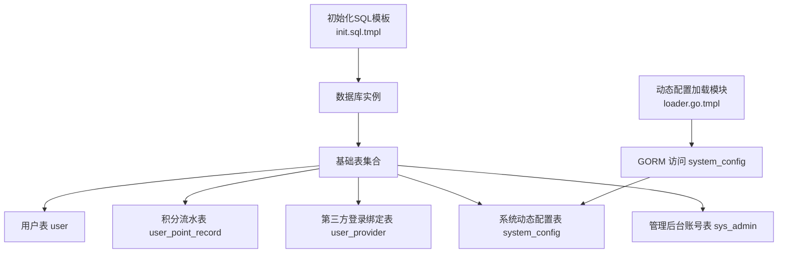
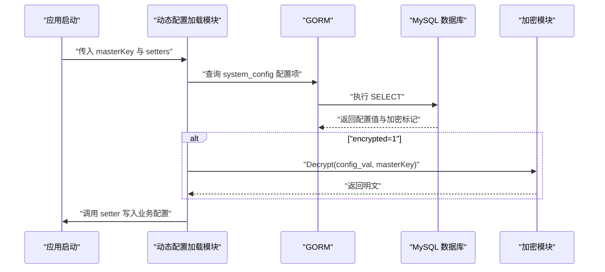
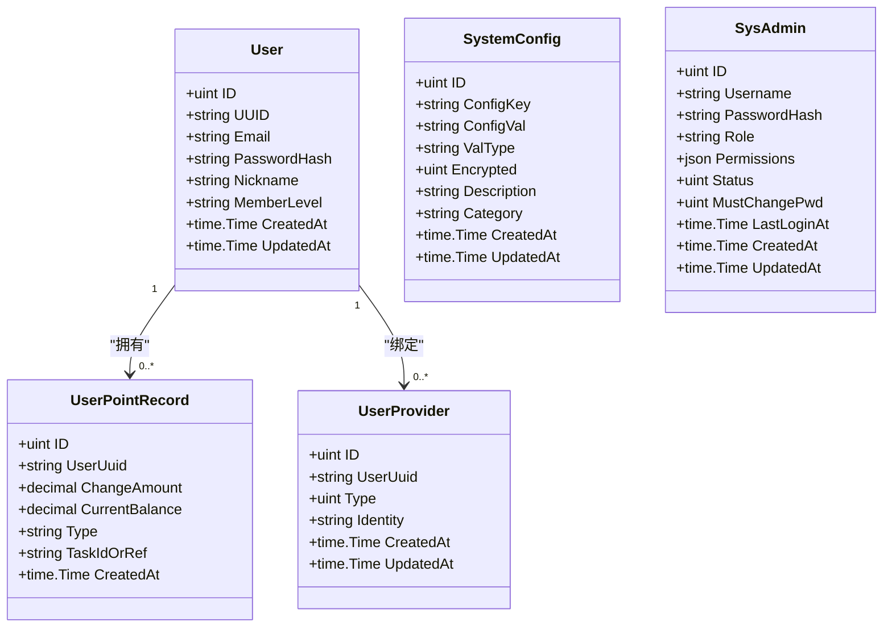
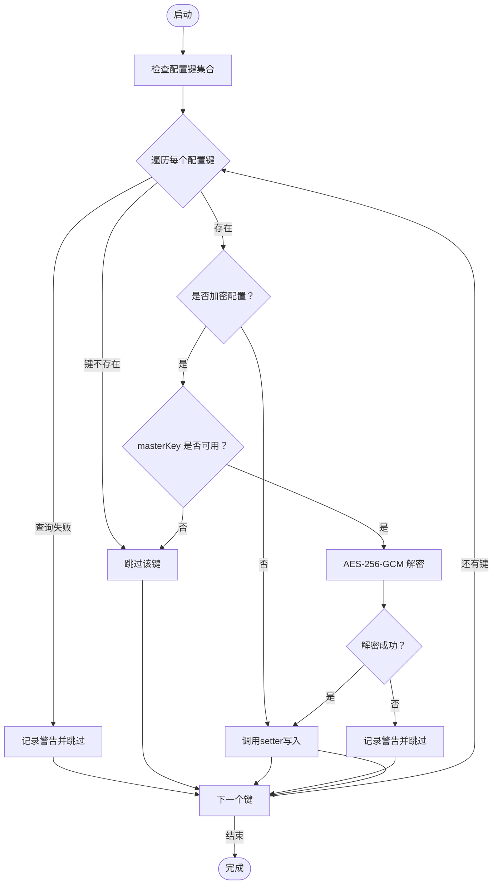
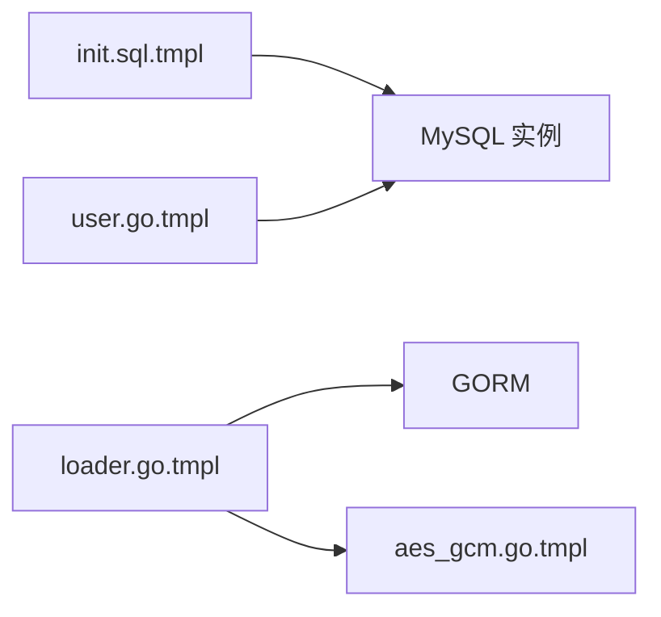

# 数据库模式

<cite>
**本文引用的文件**
- [init.sql.tmpl](file://templates/files/database/init.sql.tmpl)
- [loader.go.tmpl](file://templates/files/pkg-platform-core/dynconfig/loader.go.tmpl)
- [dynconfig.md](file://templates/files/pkg-platform-core/docs/dynconfig.md)
- [aes_gcm.go.tmpl](file://templates/files/pkg-platform-core/crypto/aes_gcm.go.tmpl)
- [crypto.md](file://templates/files/pkg-platform-core/docs/crypto.md)
- [user.go.tmpl](file://templates/files/backend-api/internal/model/user.go.tmpl)
</cite>

## 目录
1. [简介](#简介)
2. [项目结构](#项目结构)
3. [核心组件](#核心组件)
4. [架构总览](#架构总览)
5. [详细组件分析](#详细组件分析)
6. [依赖分析](#依赖分析)
7. [性能考虑](#性能考虑)
8. [故障排查指南](#故障排查指南)
9. [结论](#结论)
10. [附录](#附录)

## 简介
本文件面向数据库模式与初始化脚本，系统性说明表结构、字段定义、索引与约束、关系模型、数据迁移与备份恢复策略、性能优化建议、SQL查询示例、数据字典与ER图，并补充数据安全、权限控制与审计日志的实现思路。内容基于模板中的初始化SQL与配套Go模块，确保可落地实施。

## 项目结构
数据库模式由初始化SQL模板与配套的动态配置加载模块共同构成：
- 初始化SQL模板定义了数据库、基础表及约束
- 动态配置加载模块通过GORM访问system_config表，支持加密配置的读取与解密
- 用户模型模板展示了与数据库表的映射关系



**图表来源**
- [init.sql.tmpl:1-123](file://templates/files/database/init.sql.tmpl#L1-L123)
- [loader.go.tmpl:1-135](file://templates/files/pkg-platform-core/dynconfig/loader.go.tmpl#L1-L135)

**章节来源**
- [init.sql.tmpl:1-123](file://templates/files/database/init.sql.tmpl#L1-L123)

## 核心组件
- 初始化SQL模板：定义数据库、字符集、引擎、基础表、索引与约束
- 动态配置加载模块：启动时从system_config表读取配置，支持加密配置解密
- 用户模型：与数据库表映射，体现字段类型与约束
- 加密工具：AES-256-GCM对称加密封装，支撑system_config的加密存储

**章节来源**
- [init.sql.tmpl:1-123](file://templates/files/database/init.sql.tmpl#L1-L123)
- [loader.go.tmpl:1-135](file://templates/files/pkg-platform-core/dynconfig/loader.go.tmpl#L1-L135)
- [user.go.tmpl:1-25](file://templates/files/backend-api/internal/model/user.go.tmpl#L1-L25)
- [aes_gcm.go.tmpl:46-71](file://templates/files/pkg-platform-core/crypto/aes_gcm.go.tmpl#L46-L71)

## 架构总览
数据库初始化脚本采用“模板化生成”的方式，统一生成目标数据库与基础表；运行时通过GORM访问system_config表完成动态配置加载，加密配置由专用模块解密。



**图表来源**
- [loader.go.tmpl:66-116](file://templates/files/pkg-platform-core/dynconfig/loader.go.tmpl#L66-L116)
- [aes_gcm.go.tmpl:46-71](file://templates/files/pkg-platform-core/crypto/aes_gcm.go.tmpl#L46-L71)
- [init.sql.tmpl:88-101](file://templates/files/database/init.sql.tmpl#L88-L101)

## 详细组件分析

### 初始化SQL模板与表结构
- 数据库与字符集：统一utf8mb4与校对规则，满足多语言与表情符号
- 引擎：InnoDB，支持事务与外键
- 基础表清单与关键约束
  - 用户表 user：UUID与邮箱唯一，会员到期时间索引
  - 积分流水表 user_point_record：用户维度与类型维度索引
  - 第三方登录绑定表 user_provider：联合唯一索引保证同一平台身份唯一
  - 系统动态配置表 system_config：配置键唯一，支持加密存储
  - 管理后台账号表 sys_admin：用户名唯一，角色与权限字段

```mermaid
erDiagram
USER {
bigint id PK
varchar uuid UK
varchar mobile
varchar email UK
tinyint status
varchar nick_name
varchar avatar
varchar signature
tinyint gender
varchar password_hash
tinyint member_level
tinyint member_status
timestamp member_expiry IDX
timestamp register_time
timestamp gmt_create
timestamp gmt_modify
}
USER_POINT_RECORD {
bigint id PK
varchar user_uuid IDX
decimal change_amount
decimal current_balance
varchar type IDX
varchar task_id_or_ref
timestamp gmt_create
}
USER_PROVIDER {
bigint id PK
varchar user_uuid IDX
tinyint type
varchar identity
timestamp gmt_create
timestamp gmt_modify
}
SYSTEM_CONFIG {
bigint id PK
varchar config_key UK
varchar config_val
varchar val_type
tinyint encrypted
varchar description
varchar category
timestamp gmt_create
timestamp gmt_modify
}
SYS_ADMIN {
bigint id PK
varchar username UK
varchar password_hash
varchar role
json permissions
tinyint status
tinyint must_change_pwd
timestamp last_login_at
timestamp gmt_create
timestamp gmt_modify
}
USER ||--o{ USER_POINT_RECORD : "拥有"
USER ||--o{ USER_PROVIDER : "绑定"
```

**图表来源**
- [init.sql.tmpl:13-35](file://templates/files/database/init.sql.tmpl#L13-L35)
- [init.sql.tmpl:40-52](file://templates/files/database/init.sql.tmpl#L40-L52)
- [init.sql.tmpl:57-68](file://templates/files/database/init.sql.tmpl#L57-L68)
- [init.sql.tmpl:88-101](file://templates/files/database/init.sql.tmpl#L88-L101)
- [init.sql.tmpl:107-121](file://templates/files/database/init.sql.tmpl#L107-L121)

**章节来源**
- [init.sql.tmpl:1-123](file://templates/files/database/init.sql.tmpl#L1-L123)

### 字段定义与约束规则
- 主键与自增：各表使用BIGINT UNSIGNED自增主键
- 唯一约束：用户UUID、邮箱；配置键；第三方身份+类型组合
- 索引策略：用户表对会员到期时间建立索引；积分流水表对用户UUID与类型建立索引；第三方绑定表对用户UUID建立索引
- 时间戳：统一包含创建与更新时间戳，便于审计与统计
- 类型选择：JSON用于权限字段；DECIMAL用于金额类数据；VARCHAR长度依据业务需求设定

**章节来源**
- [init.sql.tmpl:13-35](file://templates/files/database/init.sql.tmpl#L13-L35)
- [init.sql.tmpl:40-52](file://templates/files/database/init.sql.tmpl#L40-L52)
- [init.sql.tmpl:57-68](file://templates/files/database/init.sql.tmpl#L57-L68)
- [init.sql.tmpl:88-101](file://templates/files/database/init.sql.tmpl#L88-L101)
- [init.sql.tmpl:107-121](file://templates/files/database/init.sql.tmpl#L107-L121)

### 关系模型与依赖
- 用户与积分流水：一对多，按用户维度检索流水
- 用户与第三方绑定：一对多，按用户维度管理第三方身份
- 系统动态配置：独立配置表，无外键依赖，通过应用层逻辑维护一致性
- 管理后台账号：独立表，无外键依赖，通过角色与权限字段控制访问



**图表来源**
- [user.go.tmpl:13-25](file://templates/files/backend-api/internal/model/user.go.tmpl#L13-L25)
- [init.sql.tmpl:40-52](file://templates/files/database/init.sql.tmpl#L40-L52)
- [init.sql.tmpl:57-68](file://templates/files/database/init.sql.tmpl#L57-L68)
- [init.sql.tmpl:88-101](file://templates/files/database/init.sql.tmpl#L88-L101)
- [init.sql.tmpl:107-121](file://templates/files/database/init.sql.tmpl#L107-L121)

**章节来源**
- [user.go.tmpl:1-25](file://templates/files/backend-api/internal/model/user.go.tmpl#L1-L25)
- [init.sql.tmpl:1-123](file://templates/files/database/init.sql.tmpl#L1-L123)

### 动态配置加载流程
- 启动时扫描配置键集合，逐项查询system_config表
- 若配置标记为加密且masterKey可用，则进行解密
- 将解密后的值通过setter回调写入业务配置对象
- 失败场景：查询失败、解密失败、masterKey缺失均记录日志并跳过，不影响启动



**图表来源**
- [loader.go.tmpl:66-116](file://templates/files/pkg-platform-core/dynconfig/loader.go.tmpl#L66-L116)
- [aes_gcm.go.tmpl:46-71](file://templates/files/pkg-platform-core/crypto/aes_gcm.go.tmpl#L46-L71)

**章节来源**
- [loader.go.tmpl:1-135](file://templates/files/pkg-platform-core/dynconfig/loader.go.tmpl#L1-L135)
- [dynconfig.md:1-43](file://templates/files/pkg-platform-core/docs/dynconfig.md#L1-L43)

### 数据安全与权限控制
- 敏感配置加密：system_config表支持加密存储，使用AES-256-GCM，密文格式与Python端兼容
- 密钥管理：masterKey通过环境变量注入，避免硬编码；更换密钥需重写历史密文
- 权限控制：sys_admin表包含角色与权限JSON字段，用于前端页面级权限控制
- 审计日志：各表均包含创建与更新时间戳，可用于审计追踪

**章节来源**
- [init.sql.tmpl:88-101](file://templates/files/database/init.sql.tmpl#L88-L101)
- [crypto.md:1-70](file://templates/files/pkg-platform-core/docs/crypto.md#L1-L70)
- [init.sql.tmpl:107-121](file://templates/files/database/init.sql.tmpl#L107-L121)

### SQL查询示例（路径指引）
- 查询用户积分流水（按用户UUID与类型过滤）
  - [init.sql.tmpl:40-52](file://templates/files/database/init.sql.tmpl#L40-L52)
- 查询第三方绑定（按用户UUID）
  - [init.sql.tmpl:57-68](file://templates/files/database/init.sql.tmpl#L57-L68)
- 查询系统动态配置（按配置键）
  - [init.sql.tmpl:88-101](file://templates/files/database/init.sql.tmpl#L88-L101)
- 查询管理后台账号（按用户名）
  - [init.sql.tmpl:107-121](file://templates/files/database/init.sql.tmpl#L107-L121)

## 依赖分析
- 初始化SQL模板依赖数据库引擎与字符集配置
- 动态配置加载模块依赖GORM与加密模块
- 用户模型依赖数据库表结构保持一致



**图表来源**
- [init.sql.tmpl:1-123](file://templates/files/database/init.sql.tmpl#L1-L123)
- [loader.go.tmpl:1-135](file://templates/files/pkg-platform-core/dynconfig/loader.go.tmpl#L1-L135)
- [aes_gcm.go.tmpl:46-71](file://templates/files/pkg-platform-core/crypto/aes_gcm.go.tmpl#L46-L71)
- [user.go.tmpl:1-25](file://templates/files/backend-api/internal/model/user.go.tmpl#L1-L25)

**章节来源**
- [loader.go.tmpl:1-135](file://templates/files/pkg-platform-core/dynconfig/loader.go.tmpl#L1-L135)
- [user.go.tmpl:1-25](file://templates/files/backend-api/internal/model/user.go.tmpl#L1-L25)

## 性能考虑
- 索引策略
  - 用户表：会员到期时间索引用于清理与报表
  - 积分流水表：用户UUID与类型索引用于高频查询
  - 第三方绑定表：用户UUID索引用于快速定位
- 字段类型
  - DECIMAL用于金额类数据，避免浮点误差
  - JSON用于权限等半结构化数据
- 批量与分页
  - 建议在高频查询场景使用LIMIT与合适的排序条件
- 连接池与事务
  - 使用连接池减少连接开销；长事务尽量缩短
- 监控与慢查
  - 结合慢查询日志与EXPLAIN分析热点SQL

## 故障排查指南
- 动态配置加载失败
  - masterKey为空：加密配置项会被跳过，服务仍可启动
  - 数据库查询失败：记录警告并跳过该键
  - 解密失败：检查密钥是否正确、密文是否被篡改
- system_config表异常
  - 配置键重复：唯一键冲突，需修正键名
  - 加密字段错误：确认val_type与encrypted标记一致
- 用户表异常
  - UUID或邮箱重复：唯一键冲突，需修正数据
  - 会员到期时间异常：检查业务逻辑与索引使用

**章节来源**
- [loader.go.tmpl:78-116](file://templates/files/pkg-platform-core/dynconfig/loader.go.tmpl#L78-L116)
- [dynconfig.md:34-43](file://templates/files/pkg-platform-core/docs/dynconfig.md#L34-L43)
- [init.sql.tmpl:88-101](file://templates/files/database/init.sql.tmpl#L88-L101)
- [init.sql.tmpl:13-35](file://templates/files/database/init.sql.tmpl#L13-L35)

## 结论
该数据库模式以模板化初始化为核心，结合动态配置加载与加密存储，形成可扩展、可审计、可维护的基础数据层。通过合理的索引与字段设计，满足常见业务场景的查询与性能要求；配合权限与审计机制，保障系统安全与合规。

## 附录

### 数据迁移方案
- 新增字段
  - 在初始化SQL中添加字段，并在对应模型中同步
  - 如需回填数据，建议在迁移脚本中分批处理并加索引
- 删除字段
  - 先下线业务，再删除字段与索引
- 表结构变更
  - 使用在线DDL工具或灰度发布，避免锁表
  - 变更前备份，变更后验证

### 备份与恢复策略
- 全量备份：定期执行mysqldump或物理备份
- 增量备份：开启binlog，按需恢复到指定时间点
- 恢复演练：定期进行RTO/RPO测试，验证备份有效性

### 性能优化建议
- 查询优化：使用EXPLAIN分析慢查，合理加索引
- 写入优化：批量插入、减少事务跨度
- 存储优化：冷热数据分离，压缩归档历史数据

### 数据字典（字段说明）
- 用户表 user
  - uuid：用户唯一标识（唯一）
  - email：登录账号（唯一）
  - member_expiry：会员到期时间（索引）
- 积分流水表 user_point_record
  - user_uuid：用户UUID（索引）
  - type：流水类型（索引）
- 第三方绑定表 user_provider
  - identity + type：联合唯一
  - user_uuid：索引
- 系统动态配置表 system_config
  - config_key：唯一键
  - encrypted：0=明文/1=加密
- 管理后台账号表 sys_admin
  - username：唯一
  - role：角色
  - permissions：页面权限JSON

**章节来源**
- [init.sql.tmpl:13-35](file://templates/files/database/init.sql.tmpl#L13-L35)
- [init.sql.tmpl:40-52](file://templates/files/database/init.sql.tmpl#L40-L52)
- [init.sql.tmpl:57-68](file://templates/files/database/init.sql.tmpl#L57-L68)
- [init.sql.tmpl:88-101](file://templates/files/database/init.sql.tmpl#L88-L101)
- [init.sql.tmpl:107-121](file://templates/files/database/init.sql.tmpl#L107-L121)