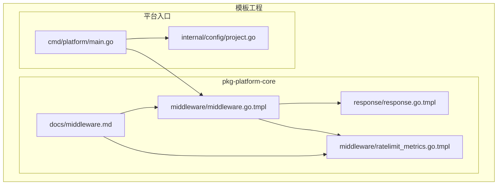
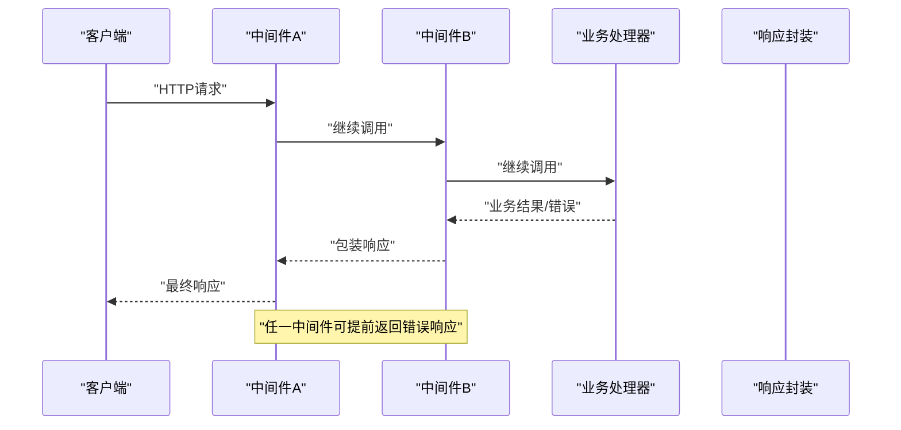
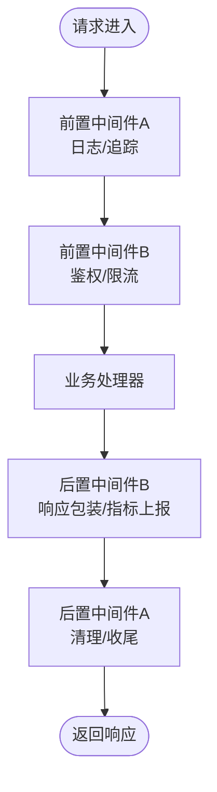
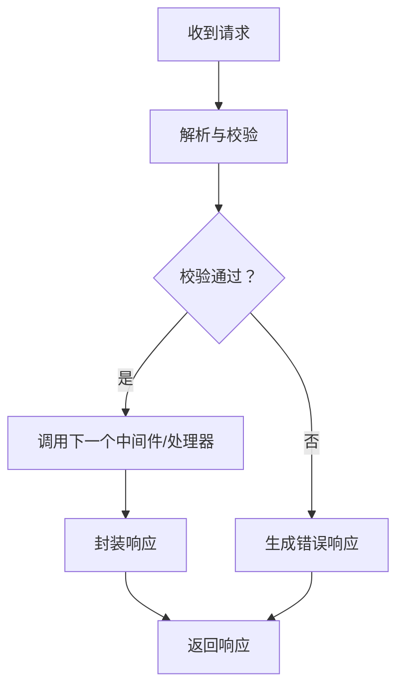
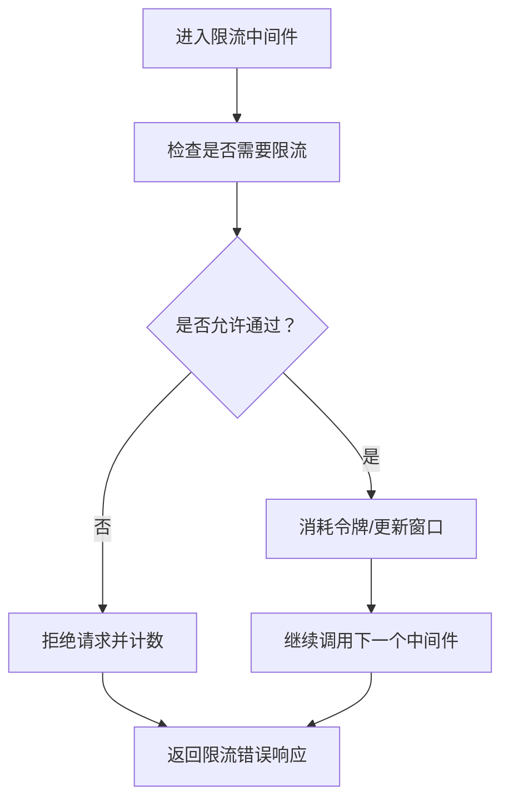
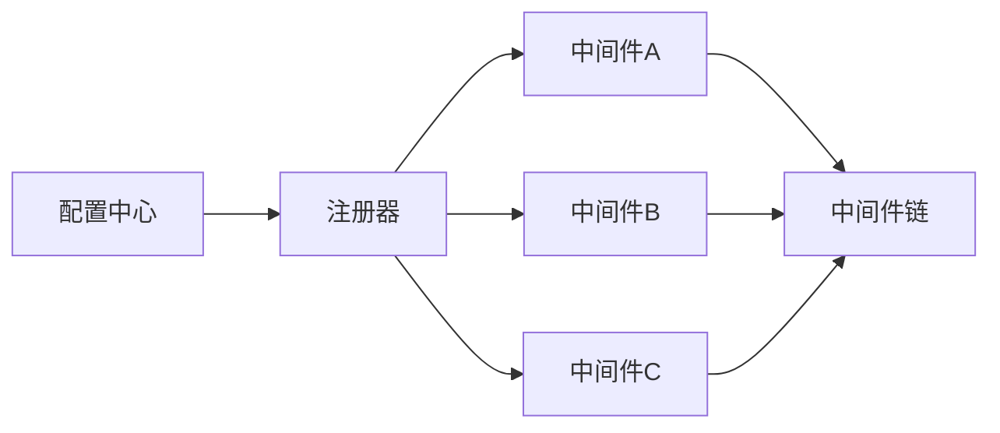
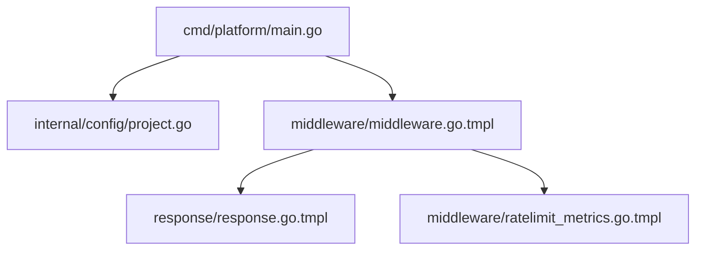

# 中间件模块

<cite>
**本文引用的文件**
- [cmd/platform/main.go](file://cmd/platform/main.go)
- [internal/config/project.go](file://internal/config/project.go)
- [templates/files/pkg-platform-core/docs/middleware.md](file://templates/files/pkg-platform-core/docs/middleware.md)
- [templates/files/pkg-platform-core/middleware/middleware.go.tmpl](file://templates/files/pkg-platform-core/middleware/middleware.go.tmpl)
- [templates/files/pkg-platform-core/middleware/ratelimit_metrics.go.tmpl](file://templates/files/pkg-platform-core/middleware/ratelimit_metrics.go.tmpl)
- [templates/files/pkg-platform-core/response/response.go.tmpl](file://templates/files/pkg-platform-core/response/response.go.tmpl)
</cite>

## 目录
1. [简介](#简介)
2. [项目结构](#项目结构)
3. [核心组件](#核心组件)
4. [架构总览](#架构总览)
5. [详细组件分析](#详细组件分析)
6. [依赖关系分析](#依赖关系分析)
7. [性能考虑](#性能考虑)
8. [故障排查指南](#故障排查指南)
9. [结论](#结论)
10. [附录](#附录)

## 简介
本文件系统性梳理平台脚手架中的中间件模块，围绕HTTP中间件的设计架构、执行顺序与链式调用机制展开；详细说明请求拦截、响应处理与错误捕获流程；深入解析限流中间件的实现原理、指标采集与统计分析能力；覆盖中间件注册机制、配置管理与性能监控；并提供自定义中间件开发指南、最佳实践与调试技巧。文档面向不同技术背景的读者，既提供高层概览，也给出代码级参考路径。

## 项目结构
中间件模块位于模板工程的 pkg-platform-core 子包中，核心文件包括：
- 中间件接口与通用逻辑：middleware.go.tmpl
- 限流指标采集：ratelimit_metrics.go.tmpl
- 文档说明：docs/middleware.md
- 响应封装：response/response.go.tmpl
- 平台入口与配置：cmd/platform/main.go、internal/config/project.go

下图展示中间件相关文件在模板工程中的组织关系：

**图表来源**
- [cmd/platform/main.go](file://cmd/platform/main.go)
- [internal/config/project.go](file://internal/config/project.go)
- [templates/files/pkg-platform-core/middleware/middleware.go.tmpl](file://templates/files/pkg-platform-core/middleware/middleware.go.tmpl)
- [templates/files/pkg-platform-core/middleware/ratelimit_metrics.go.tmpl](file://templates/files/pkg-platform-core/middleware/ratelimit_metrics.go.tmpl)
- [templates/files/pkg-platform-core/docs/middleware.md](file://templates/files/pkg-platform-core/docs/middleware.md)
- [templates/files/pkg-platform-core/response/response.go.tmpl](file://templates/files/pkg-platform-core/response/response.go.tmpl)

**章节来源**
- [cmd/platform/main.go](file://cmd/platform/main.go)
- [internal/config/project.go](file://internal/config/project.go)

## 核心组件
- 中间件接口与链式调用：通过统一的中间件函数签名与上下文传递，实现请求/响应的前后处理与链式编排。
- 请求拦截与上下文注入：在进入业务处理器前完成鉴权、日志、请求ID等横切逻辑。
- 响应处理与统一返回：对业务结果进行包装，统一状态码、消息与数据格式。
- 错误捕获与降级：在中间件链中捕获异常，生成标准化错误响应并记录日志。
- 限流中间件与指标采集：基于时间窗口与令牌桶策略实现限流，并采集QPS、延迟、错误率等指标。
- 注册机制与配置管理：通过配置项控制中间件启用、顺序与参数，支持动态开关与热更新。

**章节来源**
- [templates/files/pkg-platform-core/middleware/middleware.go.tmpl](file://templates/files/pkg-platform-core/middleware/middleware.go.tmpl)
- [templates/files/pkg-platform-core/response/response.go.tmpl](file://templates/files/pkg-platform-core/response/response.go.tmpl)
- [templates/files/pkg-platform-core/middleware/ratelimit_metrics.go.tmpl](file://templates/files/pkg-platform-core/middleware/ratelimit_metrics.go.tmpl)
- [templates/files/pkg-platform-core/docs/middleware.md](file://templates/files/pkg-platform-core/docs/middleware.md)

## 架构总览
中间件链以“洋葱模型”运行：请求从外层中间件进入，逐层向内到达业务处理器；响应沿相反方向逐层向外返回。每个中间件可选择继续调用下一个中间件或直接返回响应。错误在任意环节被捕获并转换为统一响应格式。

**图表来源**
- [templates/files/pkg-platform-core/middleware/middleware.go.tmpl](file://templates/files/pkg-platform-core/middleware/middleware.go.tmpl)
- [templates/files/pkg-platform-core/response/response.go.tmpl](file://templates/files/pkg-platform-core/response/response.go.tmpl)

## 详细组件分析

### 中间件接口与链式调用
- 设计要点
  - 统一中间件签名：接收上下文与下一个中间件，返回响应或错误。
  - 链式组合：通过装饰器模式将多个中间件按序组合，形成处理流水线。
  - 上下文传递：利用上下文携带请求ID、用户信息、计时器等横切数据。
- 执行顺序
  - 外层中间件先执行，后进入内层中间件，最后到达业务处理器。
  - 响应返回时逆序执行，外层中间件最后处理。
- 典型职责
  - 日志与追踪：记录请求开始、结束与耗时。
  - 鉴权与授权：校验Token、权限矩阵。
  - 限流与熔断：控制并发与速率，保护下游服务。
  - 统一响应：将业务结果包装为标准格式。

**图表来源**
- [templates/files/pkg-platform-core/middleware/middleware.go.tmpl](file://templates/files/pkg-platform-core/middleware/middleware.go.tmpl)
- [templates/files/pkg-platform-core/response/response.go.tmpl](file://templates/files/pkg-platform-core/response/response.go.tmpl)

**章节来源**
- [templates/files/pkg-platform-core/middleware/middleware.go.tmpl](file://templates/files/pkg-platform-core/middleware/middleware.go.tmpl)

### 请求拦截、响应处理与错误捕获
- 请求拦截
  - 在进入业务处理器之前，中间件负责读取请求头、解析参数、注入请求ID与用户上下文。
  - 可在此阶段进行IP白名单、请求体大小限制等前置校验。
- 响应处理
  - 将业务返回值封装为统一结构，包含状态码、消息与数据字段。
  - 对于成功与失败场景分别处理，确保客户端一致的契约。
- 错误捕获
  - 捕获业务异常与中间件异常，映射为标准错误码与提示信息。
  - 记录错误堆栈与上下文，便于定位问题。

**图表来源**
- [templates/files/pkg-platform-core/response/response.go.tmpl](file://templates/files/pkg-platform-core/response/response.go.tmpl)
- [templates/files/pkg-platform-core/middleware/middleware.go.tmpl](file://templates/files/pkg-platform-core/middleware/middleware.go.tmpl)

**章节来源**
- [templates/files/pkg-platform-core/response/response.go.tmpl](file://templates/files/pkg-platform-core/response/response.go.tmpl)
- [templates/files/pkg-platform-core/middleware/middleware.go.tmpl](file://templates/files/pkg-platform-core/middleware/middleware.go.tmpl)

### 限流中间件：实现原理、指标采集与统计分析
- 实现原理
  - 时间窗口与令牌桶：根据配置计算每秒允许的请求数，维护可用令牌与时间戳。
  - 拒绝策略：当无可用令牌时，立即拒绝请求并返回限流错误。
  - 维度化限流：支持按用户ID、IP、路由等维度独立限流。
- 指标采集
  - QPS：统计每秒请求总量与通过量。
  - 延迟：记录请求从进入中间件到返回的耗时分布。
  - 错误率：统计限流导致的拒绝次数占总请求的比例。
- 统计分析
  - 聚合维度：按时间窗口（分钟/小时）聚合指标，输出趋势图。
  - 告警阈值：当QPS或错误率超过阈值触发告警。
  - 可视化：结合监控面板展示实时与历史指标。

**图表来源**
- [templates/files/pkg-platform-core/middleware/ratelimit_metrics.go.tmpl](file://templates/files/pkg-platform-core/middleware/ratelimit_metrics.go.tmpl)

**章节来源**
- [templates/files/pkg-platform-core/middleware/ratelimit_metrics.go.tmpl](file://templates/files/pkg-platform-core/middleware/ratelimit_metrics.go.tmpl)

### 中间件注册机制与配置管理
- 注册机制
  - 通过配置数组声明中间件顺序，框架按序构建中间件链。
  - 支持条件注册：根据环境变量或配置开关决定是否启用某中间件。
- 配置管理
  - 中间件开关：启用/禁用特定中间件。
  - 参数配置：如限流阈值、超时时间、重试次数等。
  - 动态更新：在不重启服务的情况下更新配置并生效。

**图表来源**
- [internal/config/project.go](file://internal/config/project.go)
- [cmd/platform/main.go](file://cmd/platform/main.go)

**章节来源**
- [internal/config/project.go](file://internal/config/project.go)
- [cmd/platform/main.go](file://cmd/platform/main.go)

### 性能监控与可观测性
- 指标维度
  - 吞吐量：QPS、P95/P99延迟。
  - 错误率：业务错误与系统错误占比。
  - 资源占用：CPU、内存、连接数。
- 监控面板
  - 展示各中间件的耗时分布与错误趋势。
  - 提供告警规则与通知渠道。
- 优化建议
  - 异步化非关键逻辑（如日志写入）。
  - 缓存热点数据，减少重复计算。
  - 合理设置限流阈值，避免过度拒绝。

**章节来源**
- [templates/files/pkg-platform-core/middleware/ratelimit_metrics.go.tmpl](file://templates/files/pkg-platform-core/middleware/ratelimit_metrics.go.tmpl)

### 自定义中间件开发指南
- 开发步骤
  - 定义中间件函数签名，接收上下文与下一个中间件。
  - 在进入处理器前后分别处理请求与响应。
  - 使用统一响应封装返回结果。
  - 记录关键指标与日志。
- 最佳实践
  - 保持中间件单一职责，避免过度耦合。
  - 明确错误传播路径，确保上层可感知。
  - 使用上下文传递必要信息，避免全局状态。
  - 为中间件编写单元测试与集成测试。
- 调试技巧
  - 逐步注释中间件链定位问题模块。
  - 输出请求ID串联全链路日志。
  - 使用压测工具验证限流与性能表现。

**章节来源**
- [templates/files/pkg-platform-core/middleware/middleware.go.tmpl](file://templates/files/pkg-platform-core/middleware/middleware.go.tmpl)
- [templates/files/pkg-platform-core/response/response.go.tmpl](file://templates/files/pkg-platform-core/response/response.go.tmpl)

## 依赖关系分析
中间件模块与平台入口、配置与响应封装存在明确依赖关系：
- 平台入口负责加载配置并初始化中间件链。
- 中间件依赖响应封装统一输出格式。
- 限流中间件依赖指标采集模块进行统计。

**图表来源**
- [cmd/platform/main.go](file://cmd/platform/main.go)
- [internal/config/project.go](file://internal/config/project.go)
- [templates/files/pkg-platform-core/middleware/middleware.go.tmpl](file://templates/files/pkg-platform-core/middleware/middleware.go.tmpl)
- [templates/files/pkg-platform-core/response/response.go.tmpl](file://templates/files/pkg-platform-core/response/response.go.tmpl)
- [templates/files/pkg-platform-core/middleware/ratelimit_metrics.go.tmpl](file://templates/files/pkg-platform-core/middleware/ratelimit_metrics.go.tmpl)

**章节来源**
- [cmd/platform/main.go](file://cmd/platform/main.go)
- [internal/config/project.go](file://internal/config/project.go)

## 性能考虑
- 中间件顺序优化：将高成本中间件置于链后，或仅在必要时启用。
- 异步处理：对日志、指标上报等异步化，降低同步阻塞。
- 缓存策略：对频繁访问的配置与限流规则进行缓存。
- 资源池化：数据库连接、HTTP客户端等复用，减少创建销毁开销。
- 监控与告警：建立完善的指标体系，及时发现性能瓶颈。

## 故障排查指南
- 常见问题
  - 中间件未生效：检查配置开关与注册顺序。
  - 响应格式异常：确认响应封装逻辑与错误映射。
  - 限流误伤：调整阈值与维度，核对指标统计。
- 排查步骤
  - 启用详细日志，定位中间件执行链路。
  - 使用请求ID串联全链路日志，快速定位问题节点。
  - 对比限流指标与实际流量，验证策略合理性。
- 工具与资源
  - 日志查询与聚合工具。
  - 指标面板与告警系统。
  - 单元测试与集成测试套件。

**章节来源**
- [templates/files/pkg-platform-core/middleware/middleware.go.tmpl](file://templates/files/pkg-platform-core/middleware/middleware.go.tmpl)
- [templates/files/pkg-platform-core/response/response.go.tmpl](file://templates/files/pkg-platform-core/response/response.go.tmpl)
- [templates/files/pkg-platform-core/middleware/ratelimit_metrics.go.tmpl](file://templates/files/pkg-platform-core/middleware/ratelimit_metrics.go.tmpl)

## 结论
中间件模块通过清晰的接口设计、严格的链式调用与统一的响应封装，实现了横切关注点的解耦与可扩展。结合限流与指标采集，系统具备良好的性能控制与可观测性。遵循本文的开发规范与最佳实践，可在保证稳定性的同时持续演进中间件能力。

## 附录
- 相关文档：中间件设计文档与使用说明。
- 模板文件：中间件与限流指标的模板实现，便于二次开发与定制。

**章节来源**
- [templates/files/pkg-platform-core/docs/middleware.md](file://templates/files/pkg-platform-core/docs/middleware.md)
- [templates/files/pkg-platform-core/middleware/middleware.go.tmpl](file://templates/files/pkg-platform-core/middleware/middleware.go.tmpl)
- [templates/files/pkg-platform-core/middleware/ratelimit_metrics.go.tmpl](file://templates/files/pkg-platform-core/middleware/ratelimit_metrics.go.tmpl)