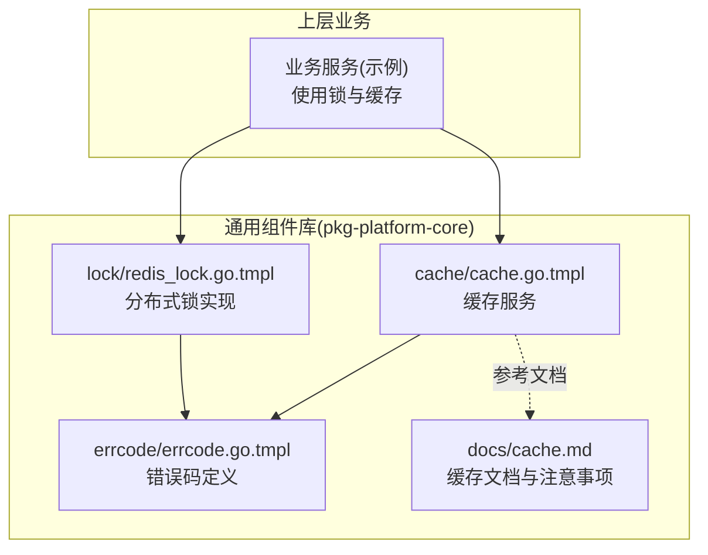
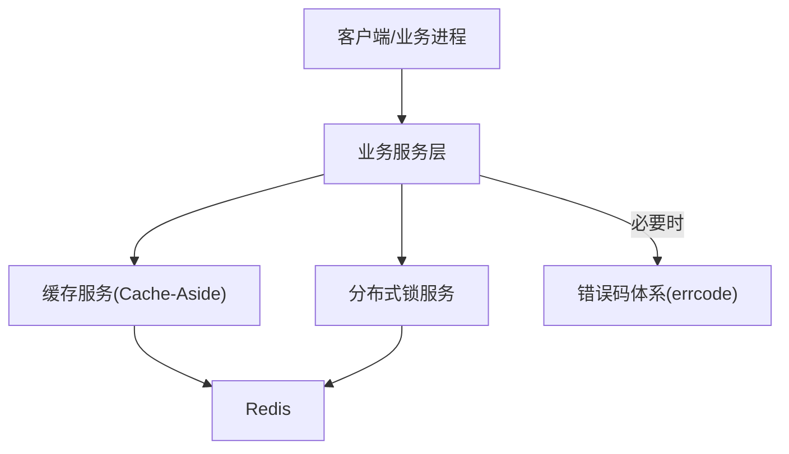
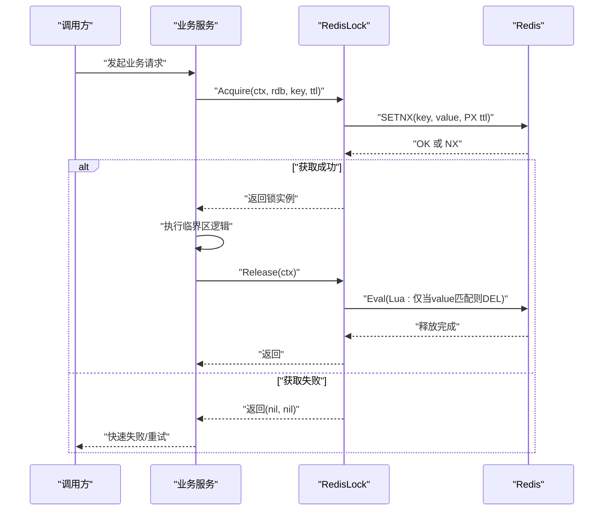
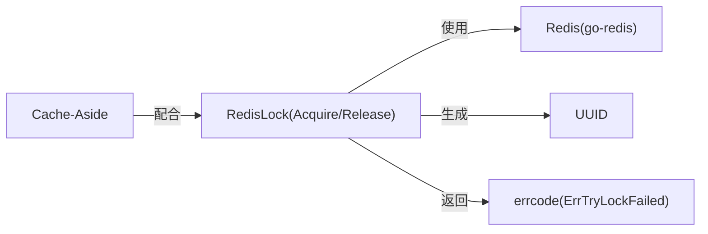

# 分布式锁模块

<cite>
**本文引用的文件**
- [redis_lock.go.tmpl](file://templates/files/pkg-platform-core/lock/redis_lock.go.tmpl)
- [errcode.go.tmpl](file://templates/files/pkg-platform-core/errcode/errcode.go.tmpl)
- [cache.md](file://templates/files/pkg-platform-core/docs/cache.md)
- [README.md](file://README.md)
</cite>

## 目录
1. [简介](#简介)
2. [项目结构](#项目结构)
3. [核心组件](#核心组件)
4. [架构总览](#架构总览)
5. [详细组件分析](#详细组件分析)
6. [依赖关系分析](#依赖关系分析)
7. [性能考量](#性能考量)
8. [故障排查指南](#故障排查指南)
9. [结论](#结论)
10. [附录](#附录)

## 简介
本文件系统性阐述分布式锁模块的设计与实现，聚焦于基于 Redis 的分布式互斥锁，采用“SETNX + Lua 原子释放”的经典模式，确保锁的获取、释放与过期保护具备强一致与安全性。该模块在模板工程中被定位为“通用组件库”的一部分，并与缓存策略共同构成“Cache-Aside + Redis 分布式锁”的数据一致性保障组合。

## 项目结构
分布式锁模块位于模板工程的“pkg-platform-core/lock”目录下，作为可复用组件提供给上层业务使用。结合项目 README 可知，该模块属于“通用组件库”，并与缓存模块协同工作，形成“先查缓存、未命中则加锁回源加载并回填”的典型流程。

图示来源
- [redis_lock.go.tmpl:1-48](file://templates/files/pkg-platform-core/lock/redis_lock.go.tmpl#L1-L48)
- [cache.go.tmpl:41-92](file://templates/files/pkg-platform-core/cache/cache.go.tmpl#L41-L92)
- [errcode.go.tmpl:1-84](file://templates/files/pkg-platform-core/errcode/errcode.go.tmpl#L1-L84)
- [cache.md:55-61](file://templates/files/pkg-platform-core/docs/cache.md#L55-L61)

章节来源
- [README.md:50-60](file://README.md#L50-L60)

## 核心组件
- RedisLock 结构体：封装 Redis 客户端、锁键与持有者标识，用于区分不同持有者的锁实例。
- Acquire 函数：尝试以“SETNX + TTL”方式获取锁；成功返回锁实例，失败返回空值以便上层做重试或降级。
- Release 方法：通过 Lua 脚本原子性地仅释放当前持有者持有的锁，避免误删他人锁。

章节来源
- [redis_lock.go.tmpl:23-48](file://templates/files/pkg-platform-core/lock/redis_lock.go.tmpl#L23-L48)

## 架构总览
分布式锁在系统中的位置与协作关系如下：

图示来源
- [redis_lock.go.tmpl:1-48](file://templates/files/pkg-platform-core/lock/redis_lock.go.tmpl#L1-L48)
- [cache.go.tmpl:41-92](file://templates/files/pkg-platform-core/cache/cache.go.tmpl#L41-L92)
- [errcode.go.tmpl:1-84](file://templates/files/pkg-platform-core/errcode/errcode.go.tmpl#L1-L84)

## 详细组件分析

### 组件一：RedisLock 获取与释放流程
- 获取流程要点
  - 使用唯一值作为锁值，结合 SETNX 与 TTL 实现“获取即加锁且带过期”的原子操作。
  - 若返回未获取到锁，则上层应进行退避重试或快速失败。
- 释放流程要点
  - 使用 Lua 脚本读取锁值并比较，仅在匹配时删除，从而避免误删他人持有的锁。
- 死锁防护
  - 通过 TTL 自动过期机制，即使持有者崩溃也能在过期后被后续竞争者获取。

图示来源
- [redis_lock.go.tmpl:30-47](file://templates/files/pkg-platform-core/lock/redis_lock.go.tmpl#L30-L47)

章节来源
- [redis_lock.go.tmpl:30-47](file://templates/files/pkg-platform-core/lock/redis_lock.go.tmpl#L30-L47)

### 组件二：锁粒度与命名规范
- 锁键命名建议遵循“命名空间:业务维度:标识”的层级结构，例如“LOCK:USER_POINT:{uuid}”，便于隔离与清理。
- 不同业务域使用不同前缀，降低键冲突概率；同一业务内的细粒度资源使用唯一标识区分。

章节来源
- [redis_lock.go.tmpl:5](file://templates/files/pkg-platform-core/lock/redis_lock.go.tmpl#L5)

### 组件三：与缓存的协同与一致性
- 在“Cache-Aside + 分布式锁”的组合中，未命中缓存时先尝试获取锁，再回源加载并回填缓存，避免并发回源导致的“惊群效应”。
- 文档明确指出：若需防穿透，可在 loadFn 中加锁；同时注意异步回填可能引发的短暂并发回源问题。

章节来源
- [cache.md:55-61](file://templates/files/pkg-platform-core/docs/cache.md#L55-L61)

### 组件四：错误码与失败语义
- 当获取锁失败时，可返回统一的业务错误码，便于上层进行重试或降级处理。
- 错误码体系提供稳定的对外契约，避免泄露内部细节。

章节来源
- [errcode.go.tmpl:80-83](file://templates/files/pkg-platform-core/errcode/errcode.go.tmpl#L80-L83)

## 依赖关系分析
- 组件内聚与耦合
  - RedisLock 仅依赖 Redis 客户端与 Lua 脚本能力，内聚性高、外部依赖清晰。
  - 与错误码模块松耦合，通过返回值/错误传播失败语义。
- 外部依赖
  - Redis go-redis 客户端：提供 SETNX、Eval、TTL 等能力。
  - UUID 生成器：为锁值提供唯一性保障。
- 潜在循环依赖
  - 无直接循环依赖；锁模块不依赖业务模块，符合“通用组件库”定位。

图示来源
- [redis_lock.go.tmpl:12-18](file://templates/files/pkg-platform-core/lock/redis_lock.go.tmpl#L12-L18)
- [redis_lock.go.tmpl:30-47](file://templates/files/pkg-platform-core/lock/redis_lock.go.tmpl#L30-L47)
- [errcode.go.tmpl:80-83](file://templates/files/pkg-platform-core/errcode/errcode.go.tmpl#L80-L83)

## 性能考量
- 锁粒度与热点
  - 合理划分锁粒度，避免热点资源被过度竞争；对高频访问的资源可考虑分片或本地缓存兜底。
- TTL 设置
  - TTL 应覆盖正常业务执行时间并留有余量，避免过短导致频繁续期、过长导致资源占用。
- Lua 原子性
  - 通过 Lua 原子释放减少网络往返与竞态窗口，提升整体吞吐。
- 与缓存配合
  - 利用 Cache-Aside 降低数据库压力；在未命中时加锁回源，避免惊群。

## 故障排查指南
- 获取锁失败
  - 检查锁键是否被他人持有；确认 TTL 是否过短；观察是否存在大量并发竞争。
- 误删他人锁
  - 确认 Lua 脚本正确传入持有者标识；避免跨协程/跨实例共享锁实例。
- 死锁与悬挂
  - 检查 TTL 是否生效；确认异常退出路径是否调用 Release；必要时增加监控告警。
- 缓存穿透与惊群
  - 在 loadFn 中加锁；评估异步回填策略；对热点键增加本地缓存或限流。

章节来源
- [redis_lock.go.tmpl:20-21](file://templates/files/pkg-platform-core/lock/redis_lock.go.tmpl#L20-L21)
- [cache.md:55-61](file://templates/files/pkg-platform-core/docs/cache.md#L55-L61)

## 结论
该分布式锁模块以简洁可靠的“SETNX + Lua 原子释放”为核心，结合 TTL 自动过期与严格的持有者校验，提供了高可用的互斥锁能力。配合缓存模块可实现“Cache-Aside + 分布式锁”的一致性保障方案。建议在实际落地时关注锁粒度、TTL 设置、监控告警与故障恢复策略，以获得更稳健的性能表现。

## 附录
- 术语
  - 锁键：Redis 中用于标识互斥资源的键名。
  - 持有者标识：锁值，用于区分不同持有者的锁实例。
  - TTL：过期时间，防止死锁。
- 最佳实践
  - 明确锁粒度，避免过度竞争；
  - 合理设置 TTL，兼顾性能与稳定性；
  - 使用 Lua 原子释放，避免误删；
  - 在缓存未命中时加锁回源，防止惊群；
  - 对关键路径增加监控与告警。