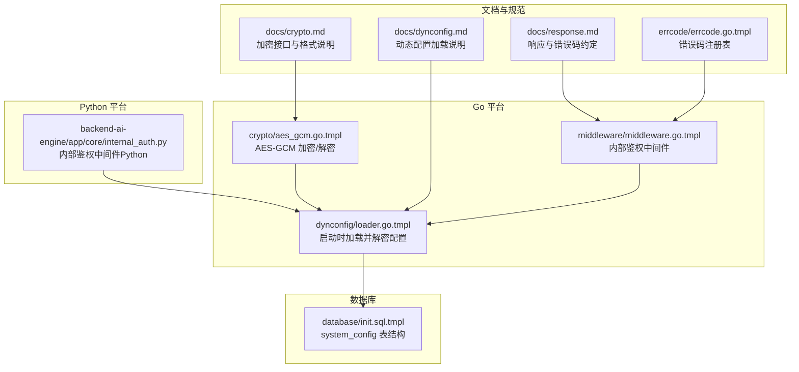
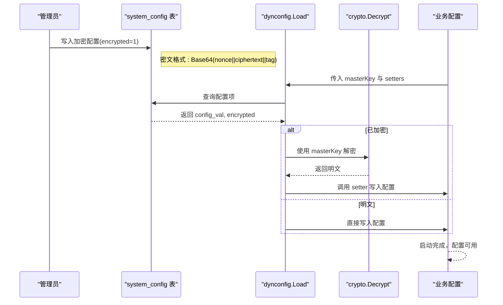
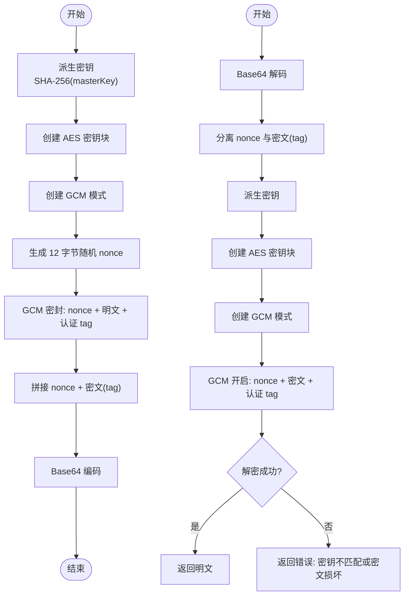
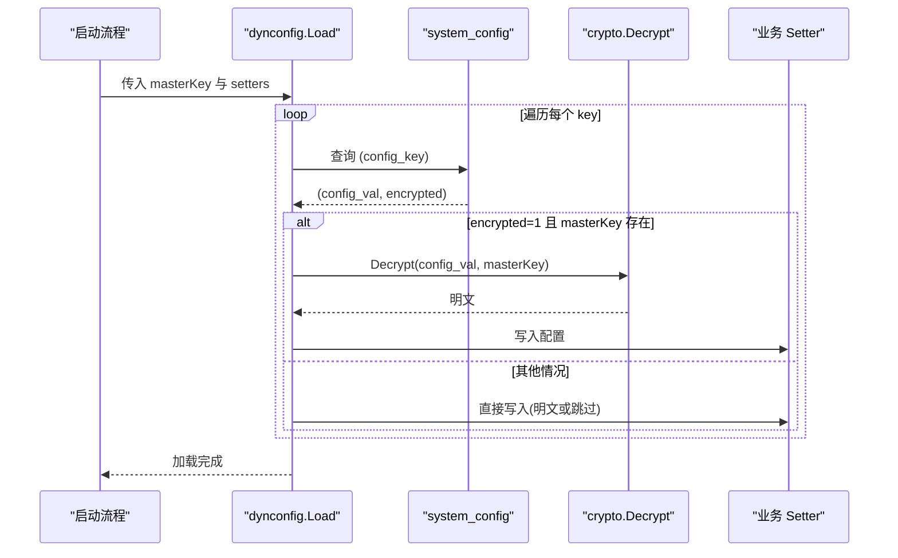
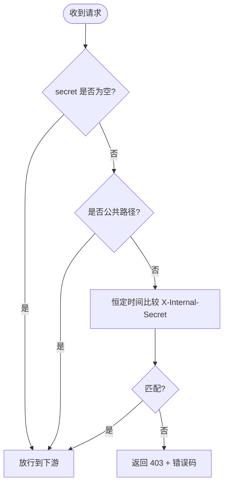
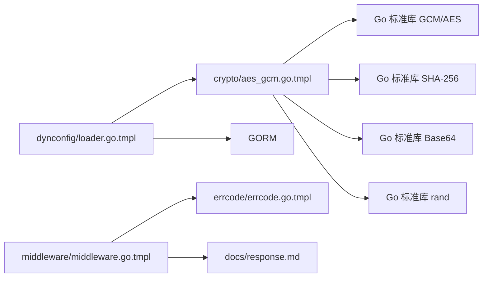

# 加密模块

<cite>
**本文引用的文件**
- [aes_gcm.go.tmpl](file://templates/files/pkg-platform-core/crypto/aes_gcm.go.tmpl)
- [aes_gcm_test.go.tmpl](file://templates/files/pkg-platform-core/crypto/aes_gcm_test.go.tmpl)
- [crypto.md](file://templates/files/pkg-platform-core/docs/crypto.md)
- [loader.go.tmpl](file://templates/files/pkg-platform-core/dynconfig/loader.go.tmpl)
- [init.sql.tmpl](file://templates/files/database/init.sql.tmpl)
- [middleware.go.tmpl](file://templates/files/pkg-platform-core/middleware/middleware.go.tmpl)
- [internal_auth.py](file://templates/files/backend-ai-engine/app/core/internal_auth.py)
- [response.md](file://templates/files/pkg-platform-core/docs/response.md)
- [errcode.md](file://templates/files/pkg-platform-core/docs/errcode.md)
- [errcode.go.tmpl](file://templates/files/pkg-platform-core/errcode/errcode.go.tmpl)
</cite>

## 目录
1. [简介](#简介)
2. [项目结构](#项目结构)
3. [核心组件](#核心组件)
4. [架构总览](#架构总览)
5. [组件详解](#组件详解)
6. [依赖关系分析](#依赖关系分析)
7. [性能考量](#性能考量)
8. [故障排查指南](#故障排查指南)
9. [结论](#结论)
10. [附录](#附录)

## 简介
本文件系统性梳理平台加密模块，聚焦 AES-256-GCM 对称加密的实现、密钥管理与安全策略，覆盖加密/解密流程、认证标签处理、错误检测与恢复、密钥生成/存储/轮换最佳实践，并结合威胁模型、性能基准与安全审计指南，帮助读者在工程实践中安全可靠地使用加密功能。

## 项目结构
加密模块位于 pkg-platform-core/crypto，配套文档与动态配置加载模块位于 pkg-platform-core/dynconfig，数据库 schema 定义位于 database/init.sql.tmpl。Go 与 Python 端通过相同的密钥派生与密文格式实现互通。

图示来源
- [aes_gcm.go.tmpl:1-72](file://templates/files/pkg-platform-core/crypto/aes_gcm.go.tmpl#L1-L72)
- [loader.go.tmpl:1-135](file://templates/files/pkg-platform-core/dynconfig/loader.go.tmpl#L1-L135)
- [init.sql.tmpl:85-101](file://templates/files/database/init.sql.tmpl#L85-L101)
- [middleware.go.tmpl:1-202](file://templates/files/pkg-platform-core/middleware/middleware.go.tmpl#L1-L202)
- [internal_auth.py:1-34](file://templates/files/backend-ai-engine/app/core/internal_auth.py#L1-L34)
- [crypto.md:1-70](file://templates/files/pkg-platform-core/docs/crypto.md#L1-L70)
- [response.md:55-74](file://templates/files/pkg-platform-core/docs/response.md#L55-L74)
- [errcode.go.tmpl:1-84](file://templates/files/pkg-platform-core/errcode/errcode.go.tmpl#L1-L84)

章节来源
- [aes_gcm.go.tmpl:1-72](file://templates/files/pkg-platform-core/crypto/aes_gcm.go.tmpl#L1-L72)
- [loader.go.tmpl:1-135](file://templates/files/pkg-platform-core/dynconfig/loader.go.tmpl#L1-L135)
- [init.sql.tmpl:85-101](file://templates/files/database/init.sql.tmpl#L85-L101)
- [middleware.go.tmpl:1-202](file://templates/files/pkg-platform-core/middleware/middleware.go.tmpl#L1-L202)
- [internal_auth.py:1-34](file://templates/files/backend-ai-engine/app/core/internal_auth.py#L1-L34)
- [crypto.md:1-70](file://templates/files/pkg-platform-core/docs/crypto.md#L1-L70)
- [response.md:55-74](file://templates/files/pkg-platform-core/docs/response.md#L55-L74)
- [errcode.go.tmpl:1-84](file://templates/files/pkg-platform-core/errcode/errcode.go.tmpl#L1-L84)

## 核心组件
- AES-GCM 加密器：提供对任意长度 masterKey 的派生与加密/解密能力，密文格式与 Python 端完全对齐。
- 动态配置加载器：启动时从 system_config 表读取配置，自动识别加密字段并使用 masterKey 解密。
- 内部鉴权中间件：保护内部路由，防止未授权访问，支持恒定时间比较与开发环境降级。
- 错误码与响应规范：统一错误码体系与响应结构，便于前端国际化与统一处理。

章节来源
- [aes_gcm.go.tmpl:1-72](file://templates/files/pkg-platform-core/crypto/aes_gcm.go.tmpl#L1-L72)
- [loader.go.tmpl:1-135](file://templates/files/pkg-platform-core/dynconfig/loader.go.tmpl#L1-L135)
- [middleware.go.tmpl:49-68](file://templates/files/pkg-platform-core/middleware/middleware.go.tmpl#L49-L68)
- [errcode.go.tmpl:1-84](file://templates/files/pkg-platform-core/errcode/errcode.go.tmpl#L1-L84)

## 架构总览
下图展示了从“密钥注入”到“动态配置解密”的端到端流程，强调密钥派生、加密/解密与错误处理的协作关系。

图示来源
- [loader.go.tmpl:64-116](file://templates/files/pkg-platform-core/dynconfig/loader.go.tmpl#L64-L116)
- [aes_gcm.go.tmpl:46-71](file://templates/files/pkg-platform-core/crypto/aes_gcm.go.tmpl#L46-L71)
- [init.sql.tmpl:88-100](file://templates/files/database/init.sql.tmpl#L88-L100)

## 组件详解

### AES-GCM 加密器
- 密钥派生：对任意长度 masterKey 使用 SHA-256 派生为 32 字节 AES-256 密钥，保证跨语言一致性。
- 加密流程：随机生成 12 字节 nonce，使用 GCM 模式加密并附带 16 字节认证 tag，最终以 Base64(nonce||ct||tag) 形式输出。
- 解密流程：Base64 解码后校验长度，分离 nonce 与密文，使用相同密钥与 nonce 执行认证解密；若密钥不匹配或密文损坏，返回明确错误。
- 错误处理：对底层错误进行包装，区分 AES 初始化、GCM 初始化、nonce 生成、Base64 解码与解密失败等场景。

图示来源
- [aes_gcm.go.tmpl:18-71](file://templates/files/pkg-platform-core/crypto/aes_gcm.go.tmpl#L18-L71)

章节来源
- [aes_gcm.go.tmpl:1-72](file://templates/files/pkg-platform-core/crypto/aes_gcm.go.tmpl#L1-L72)
- [crypto.md:7-16](file://templates/files/pkg-platform-core/docs/crypto.md#L7-L16)

### 动态配置加载器
- 角色：在应用启动时从 system_config 表加载配置，自动识别 encrypted 字段并使用 masterKey 解密。
- 行为：支持自定义表名/列名；masterKey 为空时跳过加密项；数据库查询失败或解密失败仅记录日志并继续启动。
- 与加密器协作：通过 crypto.Decrypt 对密文执行解密，然后调用业务 setter 写入配置。

图示来源
- [loader.go.tmpl:64-116](file://templates/files/pkg-platform-core/dynconfig/loader.go.tmpl#L64-L116)
- [aes_gcm.go.tmpl:46-71](file://templates/files/pkg-platform-core/crypto/aes_gcm.go.tmpl#L46-L71)
- [init.sql.tmpl:88-100](file://templates/files/database/init.sql.tmpl#L88-L100)

章节来源
- [loader.go.tmpl:1-135](file://templates/files/pkg-platform-core/dynconfig/loader.go.tmpl#L1-L135)
- [crypto.md:64-69](file://templates/files/pkg-platform-core/docs/crypto.md#L64-L69)

### 内部鉴权中间件
- Go 端：支持恒定时间比较，secret 为空时跳过验证（开发环境）；对公共路径前缀放行。
- Python 端：行为与 Go 端对齐，支持恒定时间比较与公共路径放行。
- 与响应规范配合：统一 403/401 返回与错误码，便于前端处理。

图示来源
- [middleware.go.tmpl:49-68](file://templates/files/pkg-platform-core/middleware/middleware.go.tmpl#L49-L68)
- [internal_auth.py:16-33](file://templates/files/backend-ai-engine/app/core/internal_auth.py#L16-L33)
- [response.md:55-74](file://templates/files/pkg-platform-core/docs/response.md#L55-L74)
- [errcode.go.tmpl:50-62](file://templates/files/pkg-platform-core/errcode/errcode.go.tmpl#L50-L62)

章节来源
- [middleware.go.tmpl:49-68](file://templates/files/pkg-platform-core/middleware/middleware.go.tmpl#L49-L68)
- [internal_auth.py:1-34](file://templates/files/backend-ai-engine/app/core/internal_auth.py#L1-L34)
- [response.md:55-74](file://templates/files/pkg-platform-core/docs/response.md#L55-L74)
- [errcode.go.tmpl:1-84](file://templates/files/pkg-platform-core/errcode/errcode.go.tmpl#L1-L84)

### 单元测试与覆盖
- 加密往返测试：验证 Encrypt/Decrypt 的一致性，确保明文与密文的双向转换正确。
- 错误场景测试：使用错误密钥解密应返回错误，防止密钥泄露与误用。

章节来源
- [aes_gcm_test.go.tmpl:1-28](file://templates/files/pkg-platform-core/crypto/aes_gcm_test.go.tmpl#L1-L28)

## 依赖关系分析
- crypto 依赖 Go 标准库的 AES、GCM、SHA-256、Base64 与随机数生成。
- dynconfig 依赖 GORM 与 crypto，负责从数据库读取配置并解密。
- 中间件依赖 Gin 与响应/错误码模块，保障内部路由安全。
- Python 端内部鉴权中间件与 Go 端行为对齐，确保跨语言一致性。

图示来源
- [aes_gcm.go.tmpl:9-16](file://templates/files/pkg-platform-core/crypto/aes_gcm.go.tmpl#L9-L16)
- [loader.go.tmpl:21-27](file://templates/files/pkg-platform-core/dynconfig/loader.go.tmpl#L21-L27)
- [middleware.go.tmpl:12-22](file://templates/files/pkg-platform-core/middleware/middleware.go.tmpl#L12-L22)
- [errcode.go.tmpl:1-84](file://templates/files/pkg-platform-core/errcode/errcode.go.tmpl#L1-L84)
- [response.md:55-74](file://templates/files/pkg-platform-core/docs/response.md#L55-L74)

章节来源
- [aes_gcm.go.tmpl:1-72](file://templates/files/pkg-platform-core/crypto/aes_gcm.go.tmpl#L1-L72)
- [loader.go.tmpl:1-135](file://templates/files/pkg-platform-core/dynconfig/loader.go.tmpl#L1-L135)
- [middleware.go.tmpl:1-202](file://templates/files/pkg-platform-core/middleware/middleware.go.tmpl#L1-L202)
- [errcode.go.tmpl:1-84](file://templates/files/pkg-platform-core/errcode/errcode.go.tmpl#L1-L84)

## 性能考量
- 密钥派生成本极低，主要开销在加密/解密与 Base64 编解码。
- GCM 模式为并行友好，适合高并发场景；注意避免重复使用 nonce。
- 密文长度约为明文长度的 1.33 倍，外加约 40 字节的头部与编码开销。
- 建议在高频场景下结合连接池与合理的内存分配策略，减少 GC 压力。

## 故障排查指南
- 解密失败
  - 现象：返回“密钥不匹配或密文损坏”。
  - 排查：确认 masterKey 一致、密文未被截断或篡改、nonce 未重复使用。
- masterKey 为空
  - 现象：启动时跳过加密凭据加载，服务仍可启动。
  - 处理：注入 CONFIG_MASTER_KEY 或在 Admin 后台写入明文配置。
- 数据库查询失败
  - 现象：日志警告，跳过该 key。
  - 处理：检查数据库连通性与权限、确认 system_config 表存在且结构正确。
- 内部鉴权失败
  - 现象：返回 403，错误码为内部鉴权相关。
  - 处理：核对 X-Internal-Secret、公共路径白名单与恒定时间比较逻辑。

章节来源
- [aes_gcm.go.tmpl:46-71](file://templates/files/pkg-platform-core/crypto/aes_gcm.go.tmpl#L46-L71)
- [loader.go.tmpl:78-116](file://templates/files/pkg-platform-core/dynconfig/loader.go.tmpl#L78-L116)
- [middleware.go.tmpl:49-68](file://templates/files/pkg-platform-core/middleware/middleware.go.tmpl#L49-L68)
- [crypto.md:64-69](file://templates/files/pkg-platform-core/docs/crypto.md#L64-L69)

## 结论
本加密模块以 AES-256-GCM 为核心，结合严格的密钥派生与密文格式规范，实现了跨语言互通与强认证能力。通过动态配置加载器与内部鉴权中间件，形成从“密钥注入—配置解密—路由保护”的闭环。建议在生产环境中遵循密钥轮换与最小暴露原则，并持续进行安全审计与性能压测。

## 附录

### 密钥管理最佳实践
- 生成：使用强随机源生成 masterKey，避免弱口令与常见词典。
- 存储：通过环境变量注入（如 CONFIG_MASTER_KEY），避免硬编码与日志泄露。
- 轮换：更换 masterKey 后，需先解密旧密文再重新加密，或通过 Admin 后台批量重写。
- 访问控制：限制 masterKey 的可见范围与写入权限，采用最小权限原则。

章节来源
- [crypto.md:64-69](file://templates/files/pkg-platform-core/docs/crypto.md#L64-L69)

### 安全威胁模型与防护
- 主要威胁
  - 密钥泄露：通过环境变量泄漏或日志记录导致 masterKey 外泄。
  - 密文篡改：攻击者修改 nonce/ciphertext/tag 导致解密异常。
  - 重放攻击：重复使用 nonce 导致 GCM 认证失效。
- 防护措施
  - 恒定时间比较：内部鉴权中间件使用恒定时间比较，降低侧信道风险。
  - 严格错误处理：区分密钥错误与密文错误，避免泄露过多细节。
  - 仅一次加载：动态配置仅启动时加载，避免热更新带来的状态复杂性。

章节来源
- [middleware.go.tmpl:49-68](file://templates/files/pkg-platform-core/middleware/middleware.go.tmpl#L49-L68)
- [aes_gcm.go.tmpl:46-71](file://templates/files/pkg-platform-core/crypto/aes_gcm.go.tmpl#L46-L71)
- [loader.go.tmpl:64-80](file://templates/files/pkg-platform-core/dynconfig/loader.go.tmpl#L64-L80)

### 性能基准与测试建议
- 基准指标
  - 加密/解密吞吐量（ops/sec）、平均延迟（ms）、内存占用（MB）。
- 测试建议
  - 使用压力测试工具模拟高并发场景，关注 CPU/内存/GC 行为。
  - 验证密钥轮换期间的平滑过渡与兼容性。

### 安全审计清单
- 密钥管理
  - masterKey 注入方式、存储位置、访问日志与备份策略。
- 加密实现
  - 密钥派生算法、nonce 生成与唯一性、认证标签完整性。
- 运行时安全
  - 内部鉴权中间件配置、公共路径白名单、错误信息最小化披露。
- 数据库与配置
  - system_config 表结构、索引与权限、加密字段标记与迁移策略。