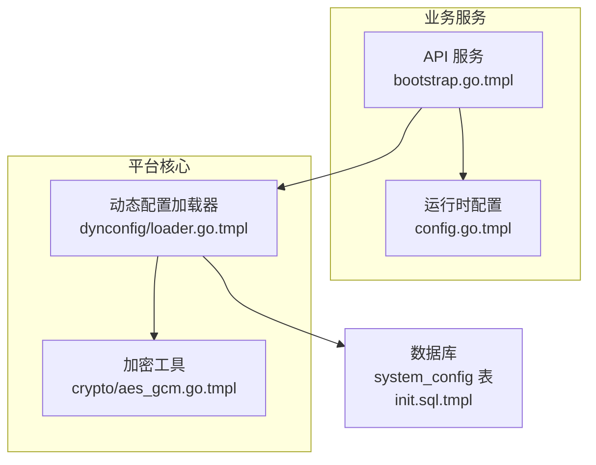
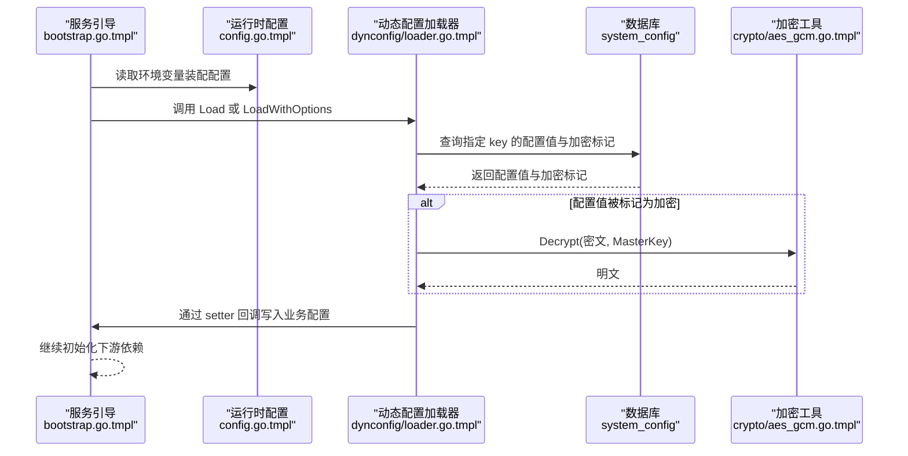
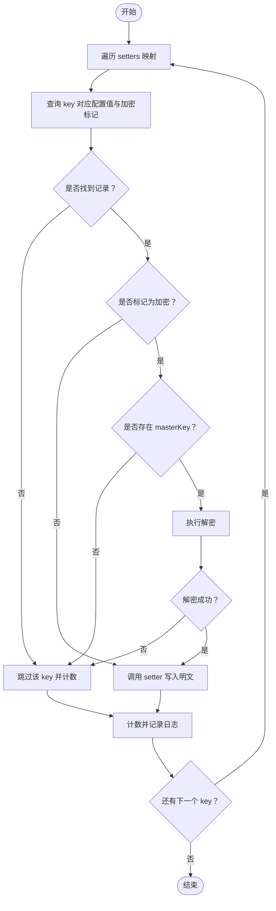
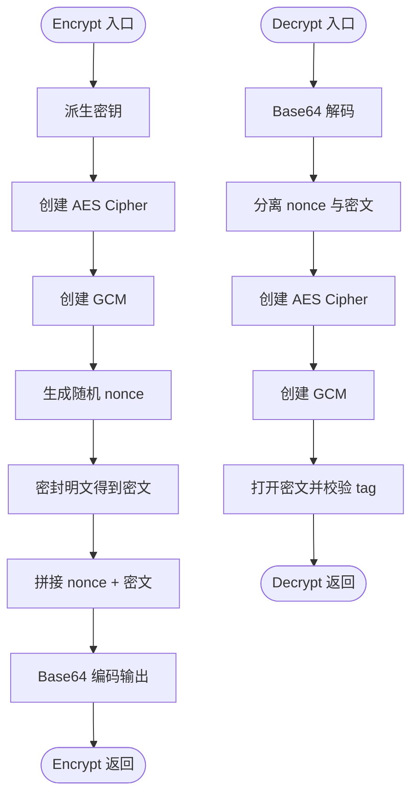
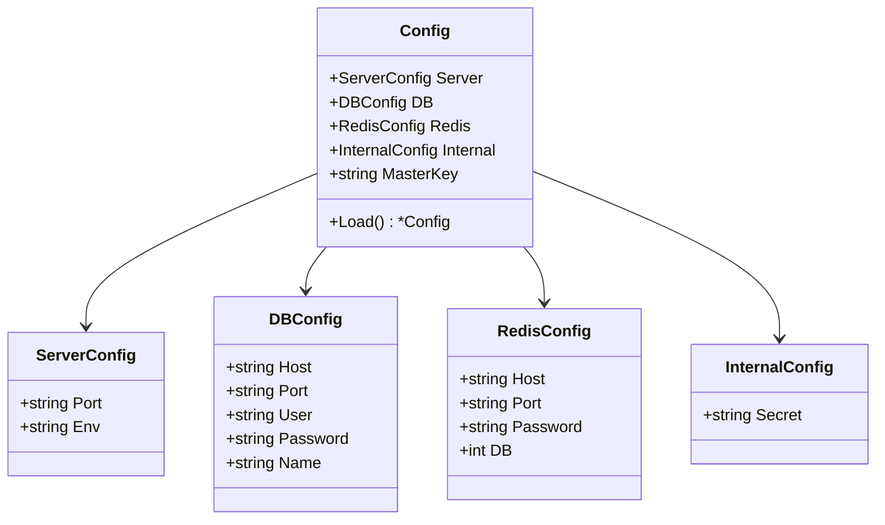
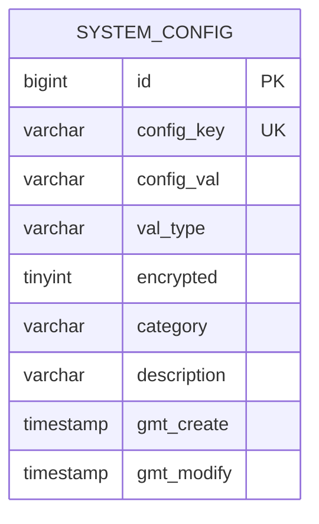
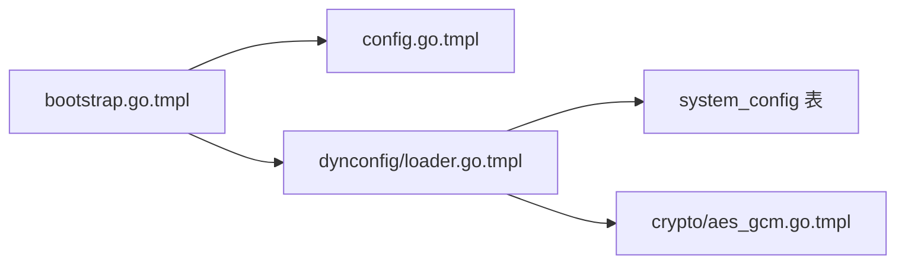

# 动态配置模块

<cite>
**本文引用的文件**
- [loader.go.tmpl](file://templates/files/pkg-platform-core/dynconfig/loader.go.tmpl)
- [aes_gcm.go.tmpl](file://templates/files/pkg-platform-core/crypto/aes_gcm.go.tmpl)
- [config.go.tmpl](file://templates/files/backend-api/internal/config/config.go.tmpl)
- [bootstrap.go.tmpl](file://templates/files/backend-api/internal/app/bootstrap.go.tmpl)
- [init.sql.tmpl](file://templates/files/database/init.sql.tmpl)
- [errcode.go.tmpl](file://templates/files/pkg-platform-core/errcode/errcode.go.tmpl)
</cite>

## 目录
1. [简介](#简介)
2. [项目结构](#项目结构)
3. [核心组件](#核心组件)
4. [架构总览](#架构总览)
5. [详细组件分析](#详细组件分析)
6. [依赖关系分析](#依赖关系分析)
7. [性能考量](#性能考量)
8. [故障排查指南](#故障排查指南)
9. [结论](#结论)
10. [附录](#附录)

## 简介
本文件系统性阐述“动态配置模块”的设计与实现，覆盖以下主题：
- 动态配置加载机制：启动时从数据库表 system_config 拉取配置，支持加密字段的解密与回退。
- 配置源管理：通过 Options 结构体灵活映射表名与列名；默认值与日志前缀可控。
- 实时更新策略：当前实现为启动时一次性加载，非热更新；文档同时给出热更新扩展建议。
- 配置格式支持与验证：支持 string/int/bool/json 等类型标记；提供加密开关与校验流程。
- 回滚机制：当前未内置自动回滚；文档提供回滚与一致性保障的实践建议。
- 配置中心集成：可将外部配置中心写入 system_config，实现“中心写入、本地读取”。
- 环境变量映射与默认值：通过环境变量注入 MasterKey 与服务端口等参数，确保最小可用配置。
- 安全性、访问控制与监控告警：结合加密、最小权限、审计与指标上报给出落地建议。

## 项目结构
动态配置模块位于 pkg-platform-core 的 dynconfig 包，配合 crypto 包进行对称加密；业务侧（如 backend-api）通过配置装载器将动态配置注入到运行时配置对象中。

图表来源
- [bootstrap.go.tmpl:46-98](file://templates/files/backend-api/internal/app/bootstrap.go.tmpl#L46-L98)
- [config.go.tmpl:42-82](file://templates/files/backend-api/internal/config/config.go.tmpl#L42-L82)
- [loader.go.tmpl:64-116](file://templates/files/pkg-platform-core/dynconfig/loader.go.tmpl#L64-L116)
- [aes_gcm.go.tmpl:24-71](file://templates/files/pkg-platform-core/crypto/aes_gcm.go.tmpl#L24-L71)
- [init.sql.tmpl:85-101](file://templates/files/database/init.sql.tmpl#L85-L101)

章节来源
- [bootstrap.go.tmpl:1-99](file://templates/files/backend-api/internal/app/bootstrap.go.tmpl#L1-L99)
- [config.go.tmpl:1-82](file://templates/files/backend-api/internal/config/config.go.tmpl#L1-L82)
- [loader.go.tmpl:1-136](file://templates/files/pkg-platform-core/dynconfig/loader.go.tmpl#L1-L136)
- [aes_gcm.go.tmpl:1-72](file://templates/files/pkg-platform-core/crypto/aes_gcm.go.tmpl#L1-L72)
- [init.sql.tmpl:1-124](file://templates/files/database/init.sql.tmpl#L1-L124)

## 核心组件
- 动态配置加载器（dynconfig）
  - 职责：启动时从 system_config 表按 key 拉取配置值，区分明文/密文，必要时使用 master key 解密，并通过 setter 回调写入业务配置。
  - 关键点：优雅降级（失败仅记录日志，不影响启动）、可自定义表/列名、默认日志前缀。
- 加密工具（crypto）
  - 职责：提供 AES-256-GCM 的派生密钥、加密与解密能力，兼容跨语言密文格式。
- 业务配置装载（backend-api）
  - 职责：从环境变量装配运行时配置，包括端口、数据库、Redis、内部密钥与 MasterKey。
- 数据库 schema（system_config）
  - 职责：存储键值、类型标记、加密开关、分类与描述，唯一索引保证键的唯一性。

章节来源
- [loader.go.tmpl:29-44](file://templates/files/pkg-platform-core/dynconfig/loader.go.tmpl#L29-L44)
- [loader.go.tmpl:64-116](file://templates/files/pkg-platform-core/dynconfig/loader.go.tmpl#L64-L116)
- [aes_gcm.go.tmpl:18-71](file://templates/files/pkg-platform-core/crypto/aes_gcm.go.tmpl#L18-L71)
- [config.go.tmpl:42-82](file://templates/files/backend-api/internal/config/config.go.tmpl#L42-L82)
- [init.sql.tmpl:85-101](file://templates/files/database/init.sql.tmpl#L85-L101)

## 架构总览
下图展示了从服务启动到动态配置注入的完整链路，以及加密解密的关键路径。

图表来源
- [bootstrap.go.tmpl:46-98](file://templates/files/backend-api/internal/app/bootstrap.go.tmpl#L46-L98)
- [config.go.tmpl:42-82](file://templates/files/backend-api/internal/config/config.go.tmpl#L42-L82)
- [loader.go.tmpl:64-116](file://templates/files/pkg-platform-core/dynconfig/loader.go.tmpl#L64-L116)
- [aes_gcm.go.tmpl:46-71](file://templates/files/pkg-platform-core/crypto/aes_gcm.go.tmpl#L46-L71)
- [init.sql.tmpl:85-101](file://templates/files/database/init.sql.tmpl#L85-L101)

## 详细组件分析

### 动态配置加载器（dynconfig）
- 设计要点
  - 启动时一次性加载，非热更新；失败仅记录日志，不阻断启动。
  - 支持自定义表名/列名，便于适配不同数据库结构。
  - 通过 Options.withDefaults() 提供默认值，避免空配置。
- 关键流程
  - 遍历 setters 映射，按 key 查询配置。
  - 若 encrypted=1 且存在 masterKey，则执行解密；否则按明文处理。
  - 调用对应的 setter 将值写入业务配置。
- 错误与回退
  - DB 查询失败、记录不存在、解密失败均记录日志并跳过该 key。
  - 最终统计加载数量与跳过数量，便于运维观测。

图表来源
- [loader.go.tmpl:64-116](file://templates/files/pkg-platform-core/dynconfig/loader.go.tmpl#L64-L116)
- [loader.go.tmpl:118-135](file://templates/files/pkg-platform-core/dynconfig/loader.go.tmpl#L118-L135)

章节来源
- [loader.go.tmpl:10-19](file://templates/files/pkg-platform-core/dynconfig/loader.go.tmpl#L10-L19)
- [loader.go.tmpl:32-62](file://templates/files/pkg-platform-core/dynconfig/loader.go.tmpl#L32-L62)
- [loader.go.tmpl:64-116](file://templates/files/pkg-platform-core/dynconfig/loader.go.tmpl#L64-L116)
- [loader.go.tmpl:118-135](file://templates/files/pkg-platform-core/dynconfig/loader.go.tmpl#L118-L135)

### 加密工具（crypto）
- 设计要点
  - 使用 SHA-256 派生固定 32 字节密钥，确保跨语言一致性。
  - 密文格式包含随机 nonce 与 tag，便于安全解密。
- 关键流程
  - Encrypt：派生密钥、构造 GCM、生成随机 nonce、密封密文并 Base64 输出。
  - Decrypt：解析 Base64，分离 nonce 与密文，GCM 开启并校验 tag，返回明文。

图表来源
- [aes_gcm.go.tmpl:18-44](file://templates/files/pkg-platform-core/crypto/aes_gcm.go.tmpl#L18-L44)
- [aes_gcm.go.tmpl:46-71](file://templates/files/pkg-platform-core/crypto/aes_gcm.go.tmpl#L46-L71)

章节来源
- [aes_gcm.go.tmpl:18-71](file://templates/files/pkg-platform-core/crypto/aes_gcm.go.tmpl#L18-L71)

### 业务配置装载（backend-api）
- 设计要点
  - 从环境变量读取端口、数据库、Redis、内部密钥与 MasterKey。
  - 提供默认值与整型解析辅助函数，确保最小可用配置。
- 集成点
  - 在服务引导阶段先装配 Config，再调用 dynconfig.Load 注入动态配置。

图表来源
- [config.go.tmpl:8-41](file://templates/files/backend-api/internal/config/config.go.tmpl#L8-L41)
- [config.go.tmpl:42-82](file://templates/files/backend-api/internal/config/config.go.tmpl#L42-L82)

章节来源
- [config.go.tmpl:8-41](file://templates/files/backend-api/internal/config/config.go.tmpl#L8-L41)
- [config.go.tmpl:42-82](file://templates/files/backend-api/internal/config/config.go.tmpl#L42-L82)

### 数据库 schema（system_config）
- 设计要点
  - 唯一键约束 config_key，保证键的唯一性。
  - 支持 val_type 标记（string/int/bool/json），便于上层做类型校验。
  - encrypted 标记 0/1，决定是否需要解密。
- 字段说明
  - config_key：配置键
  - config_val：配置值（加密时为密文）
  - val_type：值类型
  - encrypted：是否加密
  - category/description：分类与描述
  - gmt_create/gmt_modify：创建与更新时间

图表来源
- [init.sql.tmpl:85-101](file://templates/files/database/init.sql.tmpl#L85-L101)

章节来源
- [init.sql.tmpl:85-101](file://templates/files/database/init.sql.tmpl#L85-L101)

### 实时更新与热更新实现方案（扩展建议）
- 方案一：定时轮询
  - 后台线程定期查询 system_config 的变更时间戳或版本字段，增量拉取并触发 setter。
  - 注意：并发写入时的冲突与幂等处理。
- 方案二：事件驱动
  - 通过数据库变更日志（binlog）或消息队列监听配置变更，异步推送至服务。
  - 需要与业务 setter 解耦，采用队列缓冲与重试。
- 方案三：配置中心直连
  - 服务启动后同时连接配置中心与本地缓存；配置中心推送时写入本地缓存并触发 setter。
  - 本地缓存作为“最终一致”的落盘备份。
- 一致性与回滚
  - 采用“双写 + 版本号 + 回滚清单”策略：变更前记录旧值，成功后再删除回滚清单；失败则回滚。
  - setter 应具备幂等性，避免重复应用导致副作用。
- 监控与告警
  - 上报配置拉取成功率、解密失败率、延迟与异常堆栈。
  - 设置阈值告警：解密失败率突增、拉取超时、setter 应用失败。

（本小节为概念性扩展，不直接对应具体源文件）

## 依赖关系分析
- 组件耦合
  - backend-api 的 app.Bootstrap 依赖 config.Load 产出的 Config，再调用 dynconfig.Load 注入动态配置。
  - dynconfig.Load 依赖 gorm 访问 system_config，依赖 crypto.Decrypt 处理密文。
- 外部依赖
  - gorm：数据库 ORM
  - redis：缓存与会话（与配置模块无直接耦合）
  - gin：HTTP 路由（与配置模块无直接耦合）
- 潜在风险
  - MasterKey 缺失会导致加密配置无法解密，但不影响启动（优雅降级）。
  - system_config 表结构变化需同步调整 Options 与 setter 映射。

图表来源
- [bootstrap.go.tmpl:46-98](file://templates/files/backend-api/internal/app/bootstrap.go.tmpl#L46-L98)
- [config.go.tmpl:42-82](file://templates/files/backend-api/internal/config/config.go.tmpl#L42-L82)
- [loader.go.tmpl:64-116](file://templates/files/pkg-platform-core/dynconfig/loader.go.tmpl#L64-L116)
- [aes_gcm.go.tmpl:24-71](file://templates/files/pkg-platform-core/crypto/aes_gcm.go.tmpl#L24-L71)
- [init.sql.tmpl:85-101](file://templates/files/database/init.sql.tmpl#L85-L101)

章节来源
- [bootstrap.go.tmpl:46-98](file://templates/files/backend-api/internal/app/bootstrap.go.tmpl#L46-L98)
- [loader.go.tmpl:64-116](file://templates/files/pkg-platform-core/dynconfig/loader.go.tmpl#L64-L116)

## 性能考量
- 查询开销
  - 每个 key 一次 DB 查询，建议在 setters 映射中仅包含必要键，减少查询次数。
- 解密成本
  - AES-GCM 解密为 CPU 密集型操作，建议对高频敏感字段进行缓存（短期有效）。
- 连接池
  - 确保 gorm DB 连接池合理配置，避免在启动阶段造成阻塞。
- 启动时间
  - 动态配置加载在启动阶段完成，建议将 setter 写入逻辑尽量轻量，避免阻塞服务可用。

（本节为通用性能建议，不直接对应具体源文件）

## 故障排查指南
- 常见问题与定位
  - MasterKey 为空：加载器会跳过加密配置并记录警告日志，检查环境变量是否正确注入。
  - DB 查询失败：确认 system_config 表存在、列名映射正确、数据库连接正常。
  - 解密失败：核对密文格式与 masterKey 是否匹配；检查加密端是否使用相同算法与密钥派生方式。
  - setter 未生效：确认 setters 映射中 key 与 system_config.config_key 一致，且 setter 调用链正确。
- 日志与可观测性
  - 加载器提供加载/跳过/成功计数的日志，便于快速定位问题。
  - 建议在业务层增加配置应用后的健康检查接口，返回当前生效的配置快照。
- 错误码与响应
  - 平台提供统一错误码体系，可在配置相关接口中复用，保持错误语义一致。

章节来源
- [loader.go.tmpl:78-115](file://templates/files/pkg-platform-core/dynconfig/loader.go.tmpl#L78-L115)
- [errcode.go.tmpl:11-45](file://templates/files/pkg-platform-core/errcode/errcode.go.tmpl#L11-L45)

## 结论
动态配置模块以“启动时加载 + 优雅降级”为核心设计，兼顾安全性（AES-GCM）与可维护性（可定制表/列名）。当前实现适合大多数场景，若需热更新与更强的一致性，可参考“实时更新与热更新实现方案（扩展建议）”进行演进。通过合理的环境变量映射、严格的加密与回退策略，以及完善的监控告警，可显著提升系统的稳定性与可运维性。

## 附录
- 配置中心集成建议
  - 将配置中心的写入动作映射为对 system_config 的写入，保持“中心写入、本地读取”的统一入口。
  - 对于高可用，建议在配置中心与本地之间引入“写入队列 + 落地缓存”的双写策略。
- 访问控制与安全
  - 限制对 system_config 的写入权限，仅授权管理后台与 CI/CD。
  - MasterKey 采用密钥管理系统（KMS）轮换与审计，避免硬编码。
- 默认值与兼容性
  - 在 setters 映射中为每个 key 提供默认值处理逻辑，确保新增配置不会破坏现有功能。

（本节为通用最佳实践，不直接对应具体源文件）