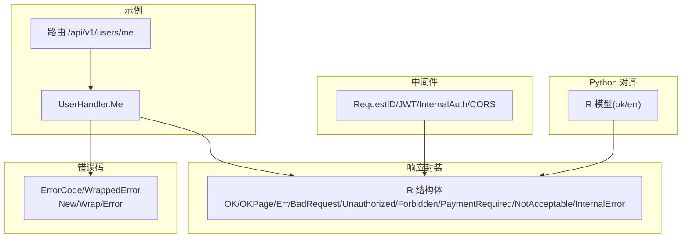
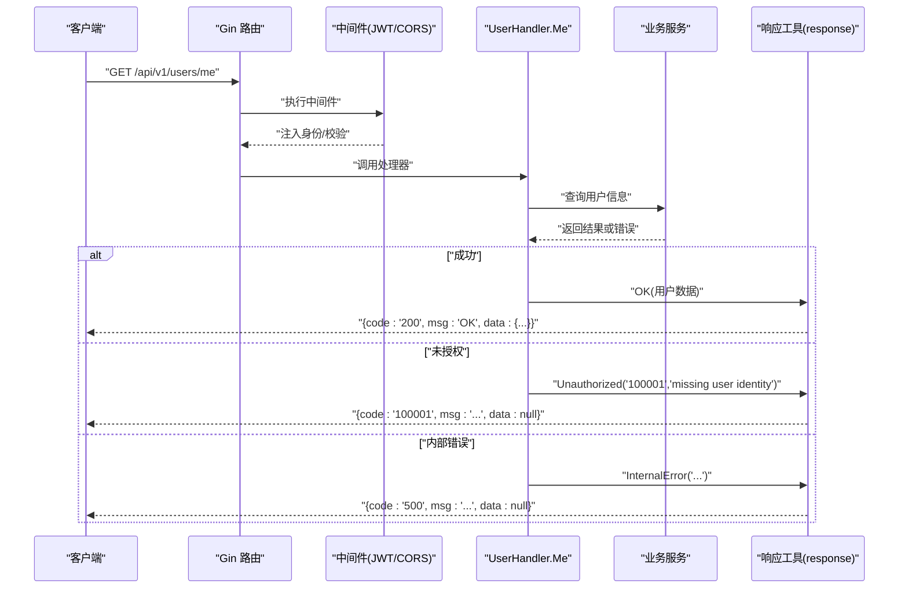
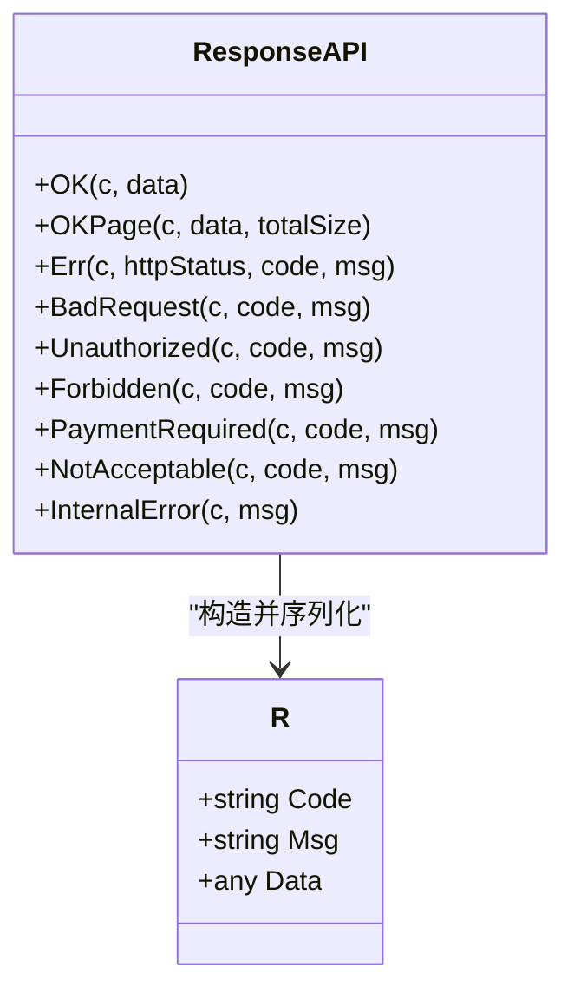
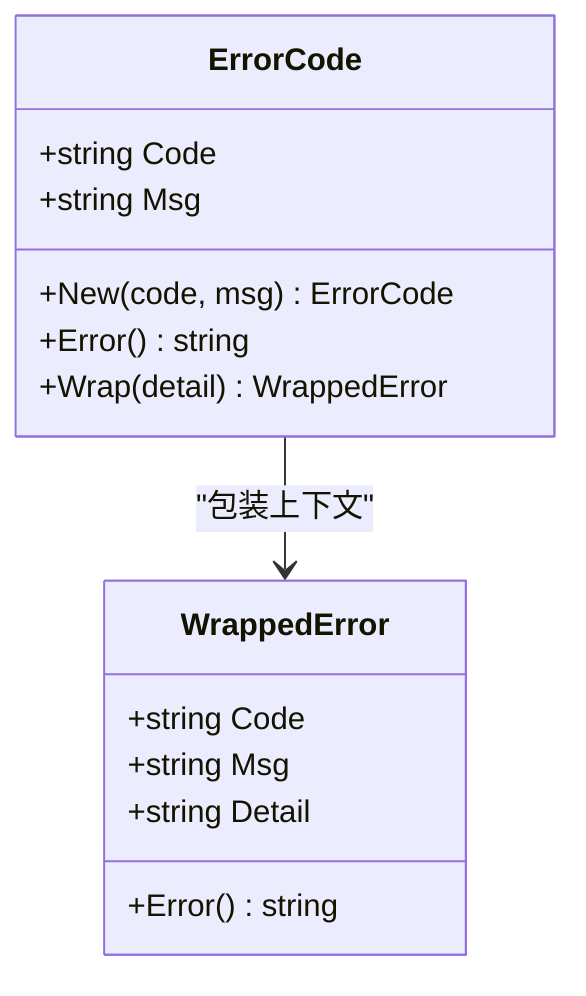
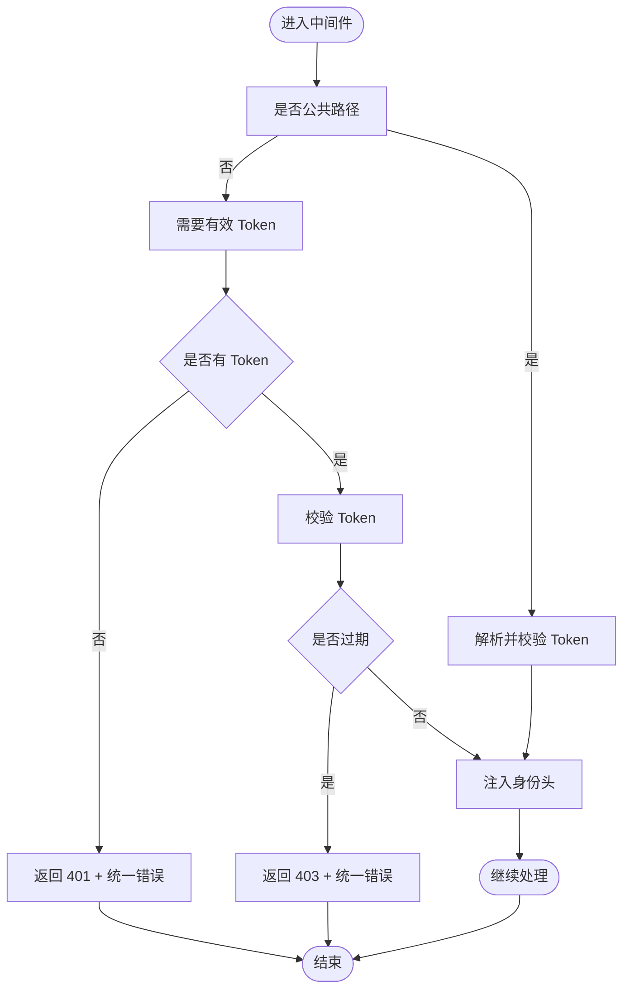
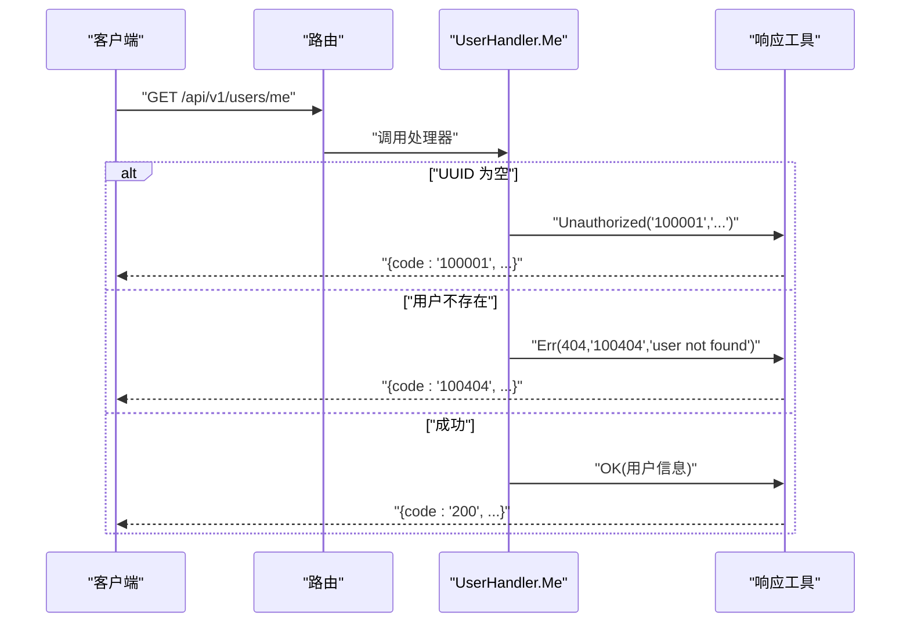
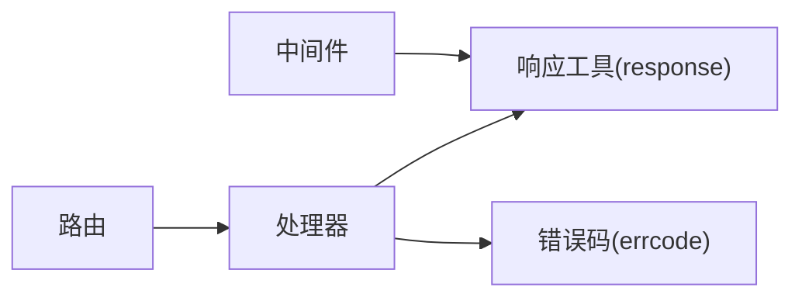

# 响应封装模块

<cite>
**本文档引用的文件**
- [response.go.tmpl](file://templates/files/pkg-platform-core/response/response.go.tmpl)
- [response.md](file://templates/files/pkg-platform-core/docs/response.md)
- [response.py](file://templates/files/backend-ai-engine/app/core/response.py)
- [errcode.go.tmpl](file://templates/files/pkg-platform-core/errcode/errcode.go.tmpl)
- [errcode.md](file://templates/files/pkg-platform-core/docs/errcode.md)
- [middleware.go.tmpl](file://templates/files/pkg-platform-core/middleware/middleware.go.tmpl)
- [user.go.tmpl](file://templates/files/backend-api/internal/handler/user.go.tmpl)
- [routes.go.tmpl](file://templates/files/backend-api/internal/router/routes.go.tmpl)
- [cache.go.tmpl](file://templates/files/pkg-platform-core/cache/cache.go.tmpl)
</cite>

## 目录
1. [简介](#简介)
2. [项目结构](#项目结构)
3. [核心组件](#核心组件)
4. [架构概览](#架构概览)
5. [详细组件分析](#详细组件分析)
6. [依赖关系分析](#依赖关系分析)
7. [性能考虑](#性能考虑)
8. [故障排查指南](#故障排查指南)
9. [结论](#结论)
10. [附录](#附录)

## 简介
本模块提供统一的响应格式与序列化机制，确保前后端交互的一致性与可维护性。统一响应结构包含三个字段：状态码、消息与数据载荷，并配套错误码体系与中间件支持，覆盖成功响应、错误响应、分页响应等场景。同时提供跨语言一致性（Go 与 Python），并给出版本兼容与迁移建议。

## 项目结构
响应封装模块位于平台核心库中，主要文件包括：
- 统一响应格式与工具函数
- 错误码注册表与包装器
- 中间件集成（CORS、JWT、内部认证、请求ID等）
- 示例处理器与路由
- 缓存与加密等周边能力

图表来源
- [response.go.tmpl:1-78](file://templates/files/pkg-platform-core/response/response.go.tmpl#L1-L78)
- [errcode.go.tmpl:1-84](file://templates/files/pkg-platform-core/errcode/errcode.go.tmpl#L1-L84)
- [middleware.go.tmpl:1-202](file://templates/files/pkg-platform-core/middleware/middleware.go.tmpl#L1-L202)
- [user.go.tmpl:1-46](file://templates/files/backend-api/internal/handler/user.go.tmpl#L1-L46)
- [routes.go.tmpl:1-28](file://templates/files/backend-api/internal/router/routes.go.tmpl#L1-L28)
- [response.py:1-19](file://templates/files/backend-ai-engine/app/core/response.py#L1-L19)

章节来源
- [response.go.tmpl:1-78](file://templates/files/pkg-platform-core/response/response.go.tmpl#L1-L78)
- [response.md:1-74](file://templates/files/pkg-platform-core/docs/response.md#L1-L74)
- [errcode.go.tmpl:1-84](file://templates/files/pkg-platform-core/errcode/errcode.go.tmpl#L1-L84)
- [middleware.go.tmpl:1-202](file://templates/files/pkg-platform-core/middleware/middleware.go.tmpl#L1-L202)
- [user.go.tmpl:1-46](file://templates/files/backend-api/internal/handler/user.go.tmpl#L1-L46)
- [routes.go.tmpl:1-28](file://templates/files/backend-api/internal/router/routes.go.tmpl#L1-L28)
- [response.py:1-19](file://templates/files/backend-ai-engine/app/core/response.py#L1-L19)

## 核心组件
- 统一响应结构体 R：包含 code、msg、data 三字段，成功时 data 为业务载荷，失败时 data 为 null。
- 成功响应：OK(data)、OKPage(data, totalSize)。
- 错误响应：Err(status, code, msg)，以及针对常见场景的快捷方法：BadRequest、Unauthorized、Forbidden、PaymentRequired、NotAcceptable、InternalError。
- 错误码体系：ErrorCode 与 WrappedError，提供六位业务错误码注册与上下文包装。
- 中间件集成：RequestID、JWT、InternalAuth、CORS 等，保障请求追踪、鉴权、跨域与安全。
- 跨语言一致性：Python 端提供等价模型与序列化方法，保证前后端契约一致。

章节来源
- [response.go.tmpl:26-77](file://templates/files/pkg-platform-core/response/response.go.tmpl#L26-L77)
- [errcode.go.tmpl:11-45](file://templates/files/pkg-platform-core/errcode/errcode.go.tmpl#L11-L45)
- [middleware.go.tmpl:24-100](file://templates/files/pkg-platform-core/middleware/middleware.go.tmpl#L24-L100)
- [response.py:7-18](file://templates/files/backend-ai-engine/app/core/response.py#L7-L18)

## 架构概览
统一响应模块在业务层与基础设施层之间提供清晰的契约边界：
- 业务层通过响应工具返回统一格式，错误码由 errcode 注册表管理。
- 基础设施层（中间件）负责 HTTP 状态码与安全策略，响应层负责业务 code 与消息。
- 示例处理器通过中间件注入身份信息后，使用统一响应返回结果。

图表来源
- [user.go.tmpl:28-46](file://templates/files/backend-api/internal/handler/user.go.tmpl#L28-L46)
- [middleware.go.tmpl:102-163](file://templates/files/pkg-platform-core/middleware/middleware.go.tmpl#L102-L163)
- [response.go.tmpl:33-77](file://templates/files/pkg-platform-core/response/response.go.tmpl#L33-L77)

## 详细组件分析

### 统一响应结构与序列化
- 数据结构：R 结构体包含 code、msg、data，成功时 data 为业务对象，失败时为 null。
- 序列化：使用 Gin 的 JSON 序列化输出，确保跨语言一致性。
- 成功响应：OK 返回 HTTP 200 与 code="200"；OKPage 返回分页数据结构 {data, totalSize}。
- 错误响应：Err 支持自定义 HTTP 状态码与业务 code；内置快捷方法覆盖常见错误场景。

图表来源
- [response.go.tmpl:26-77](file://templates/files/pkg-platform-core/response/response.go.tmpl#L26-L77)

章节来源
- [response.go.tmpl:26-77](file://templates/files/pkg-platform-core/response/response.go.tmpl#L26-L77)
- [response.md:17-44](file://templates/files/pkg-platform-core/docs/response.md#L17-L44)

### 错误码注册与包装
- ErrorCode：提供 code 与 msg 的注册与错误接口实现。
- WrappedError：在不改变 code/msg 的前提下携带运行时上下文，仅用于服务端日志。
- 使用建议：业务层统一通过 errcode.New 注册错误码，避免硬编码；错误发生时优先使用 Err(...) 返回统一格式。

图表来源
- [errcode.go.tmpl:11-45](file://templates/files/pkg-platform-core/errcode/errcode.go.tmpl#L11-L45)

章节来源
- [errcode.go.tmpl:1-84](file://templates/files/pkg-platform-core/errcode/errcode.go.tmpl#L1-L84)
- [errcode.md:18-48](file://templates/files/pkg-platform-core/docs/errcode.md#L18-L48)

### 中间件与响应协作
- RequestID：生成或透传 X-Request-ID，便于全链路追踪。
- JWT：校验 Bearer Token，注入身份头，对过期场景返回 403 并使用统一错误响应。
- InternalAuth：校验内部密钥，保护私域路由。
- CORS：配置允许的 Origin、Headers 与暴露头，支持与前端框架对齐。

图表来源
- [middleware.go.tmpl:102-163](file://templates/files/pkg-platform-core/middleware/middleware.go.tmpl#L102-L163)
- [response.go.tmpl:54-62](file://templates/files/pkg-platform-core/response/response.go.tmpl#L54-L62)

章节来源
- [middleware.go.tmpl:24-100](file://templates/files/pkg-platform-core/middleware/middleware.go.tmpl#L24-L100)
- [middleware.go.tmpl:102-163](file://templates/files/pkg-platform-core/middleware/middleware.go.tmpl#L102-L163)

### 示例处理器与路由
- UserHandler.Me：从上游中间件注入的身份头读取用户 UUID，查询用户信息后返回统一响应。
- 路由 /api/v1/users/me：绑定处理器，遵循 API 版本前缀约定。

图表来源
- [user.go.tmpl:28-46](file://templates/files/backend-api/internal/handler/user.go.tmpl#L28-L46)
- [routes.go.tmpl:16-28](file://templates/files/backend-api/internal/router/routes.go.tmpl#L16-L28)
- [response.go.tmpl:33-49](file://templates/files/pkg-platform-core/response/response.go.tmpl#L33-L49)

章节来源
- [user.go.tmpl:28-46](file://templates/files/backend-api/internal/handler/user.go.tmpl#L28-L46)
- [routes.go.tmpl:16-28](file://templates/files/backend-api/internal/router/routes.go.tmpl#L16-L28)

### 跨语言一致性与序列化
- Go 端：R 结构体通过 Gin JSON 输出。
- Python 端：R 模型与 ok/err 方法输出等价结构，确保前后端契约一致。
- 序列化注意：code 为字符串类型，msg 为人类可读消息，data 为业务载荷或 null。

章节来源
- [response.go.tmpl:26-31](file://templates/files/pkg-platform-core/response/response.go.tmpl#L26-L31)
- [response.py:7-18](file://templates/files/backend-ai-engine/app/core/response.py#L7-L18)

## 依赖关系分析
- 处理器依赖响应工具与错误码注册表，确保错误返回的一致性。
- 中间件依赖响应工具进行鉴权失败与过期场景的统一错误输出。
- 路由层将 HTTP 版本前缀与处理器绑定，形成稳定的 API 结构。

图表来源
- [routes.go.tmpl:16-28](file://templates/files/backend-api/internal/router/routes.go.tmpl#L16-L28)
- [user.go.tmpl:28-46](file://templates/files/backend-api/internal/handler/user.go.tmpl#L28-L46)
- [response.go.tmpl:33-77](file://templates/files/pkg-platform-core/response/response.go.tmpl#L33-L77)
- [errcode.go.tmpl:18-31](file://templates/files/pkg-platform-core/errcode/errcode.go.tmpl#L18-L31)
- [middleware.go.tmpl:102-163](file://templates/files/pkg-platform-core/middleware/middleware.go.tmpl#L102-L163)

章节来源
- [routes.go.tmpl:16-28](file://templates/files/backend-api/internal/router/routes.go.tmpl#L16-L28)
- [user.go.tmpl:28-46](file://templates/files/backend-api/internal/handler/user.go.tmpl#L28-L46)
- [response.go.tmpl:33-77](file://templates/files/pkg-platform-core/response/response.go.tmpl#L33-L77)
- [errcode.go.tmpl:18-31](file://templates/files/pkg-platform-core/errcode/errcode.go.tmpl#L18-L31)
- [middleware.go.tmpl:102-163](file://templates/files/pkg-platform-core/middleware/middleware.go.tmpl#L102-L163)

## 性能考虑
- 响应序列化：统一使用 Gin JSON，减少序列化差异带来的性能波动。
- 分页响应：OKPage 将 data 与 totalSize 合并返回，避免额外的包装层级。
- 缓存策略：结合缓存模块进行数据缓存与回填，降低重复计算与数据库压力。
- 中间件开销：RequestID、JWT、CORS 等中间件在请求链路中尽量保持轻量，避免阻塞。

章节来源
- [response.go.tmpl:38-44](file://templates/files/pkg-platform-core/response/response.go.tmpl#L38-L44)
- [cache.go.tmpl:28-58](file://templates/files/pkg-platform-core/cache/cache.go.tmpl#L28-L58)
- [middleware.go.tmpl:24-100](file://templates/files/pkg-platform-core/middleware/middleware.go.tmpl#L24-L100)

## 故障排查指南
- 401 未授权：检查 Authorization 头或 Cookie 中的刷新令牌是否存在，确认中间件是否正确注入身份信息。
- 403 Token 过期：根据中间件逻辑，返回统一错误响应，前端应触发刷新流程。
- 400 业务错误：确认业务层是否通过 errcode 注册错误码并使用 Err(...) 返回。
- 500 内部错误：检查服务异常处理与日志记录，确保 InternalError(...) 正确调用。
- CORS 问题：核对允许的 Origin 与暴露头配置，确保前端请求头被正确放行。

章节来源
- [middleware.go.tmpl:102-163](file://templates/files/pkg-platform-core/middleware/middleware.go.tmpl#L102-L163)
- [response.go.tmpl:51-77](file://templates/files/pkg-platform-core/response/response.go.tmpl#L51-L77)
- [errcode.go.tmpl:18-31](file://templates/files/pkg-platform-core/errcode/errcode.go.tmpl#L18-L31)

## 结论
统一响应模块通过简洁的数据结构与明确的错误码体系，实现了前后端一致的交互契约。配合中间件提供的安全与可观测性能力，能够支撑高可用的 API 服务。建议在新增业务时严格遵循错误码注册与响应工具使用规范，确保系统的可维护性与可演进性。

## 附录

### 统一响应格式与状态码映射
- 成功：HTTP 200 + code="200" + data 为业务载荷。
- 业务错误：HTTP 400 + code 为六位业务错误码 + msg。
- 鉴权错误：HTTP 401（未登录）、HTTP 403（禁止/Token 过期）。
- 其他基础设施错误：HTTP 402、406、500 等。

章节来源
- [response.go.tmpl:9-17](file://templates/files/pkg-platform-core/response/response.go.tmpl#L9-L17)
- [response.md:46-53](file://templates/files/pkg-platform-core/docs/response.md#L46-L53)

### API 版本兼容与迁移指南
- 版本前缀：所有业务路由以 /api/v1 开头，便于后续版本演进。
- 向后兼容：统一响应结构保持不变，错误码注册表可扩展，不破坏现有客户端行为。
- 迁移建议：新增错误码时在 errcode 注册表中集中声明，避免硬编码；逐步替换旧的错误返回方式。

章节来源
- [routes.go.tmpl:16-28](file://templates/files/backend-api/internal/router/routes.go.tmpl#L16-L28)
- [errcode.md:50-66](file://templates/files/pkg-platform-core/docs/errcode.md#L50-L66)

### 安全头部与缓存控制
- 安全头部：中间件提供 CORS 与请求 ID 支持，建议在生产环境启用严格的 Origin 白名单与暴露头列表。
- 缓存控制：结合缓存模块进行数据缓存与失效策略，避免重复请求造成的性能损耗。

章节来源
- [middleware.go.tmpl:70-100](file://templates/files/pkg-platform-core/middleware/middleware.go.tmpl#L70-L100)
- [cache.go.tmpl:75-92](file://templates/files/pkg-platform-core/cache/cache.go.tmpl#L75-L92)