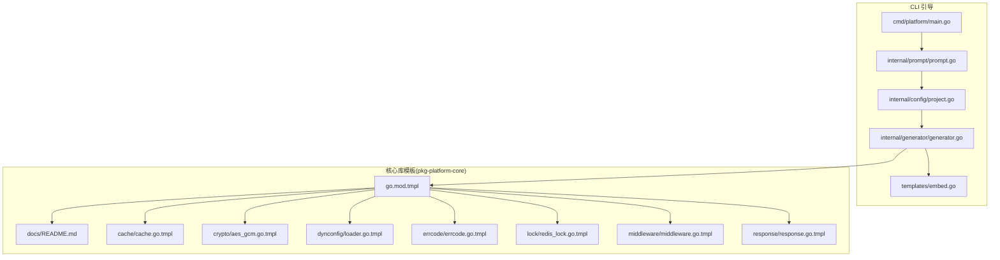
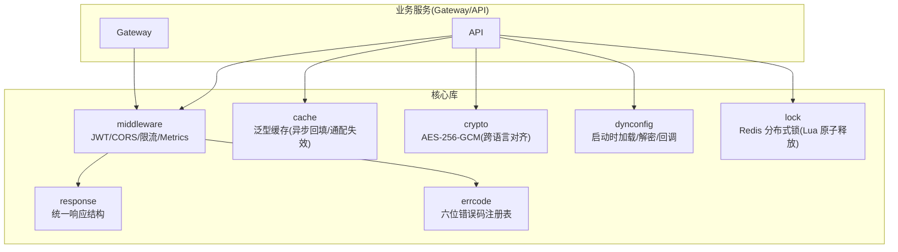
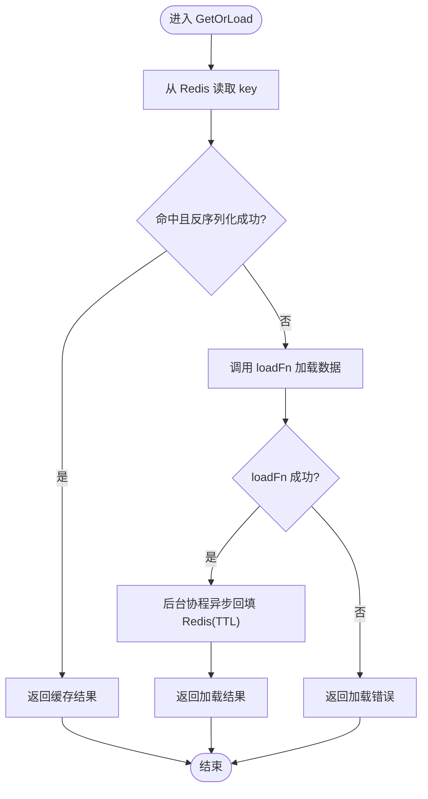
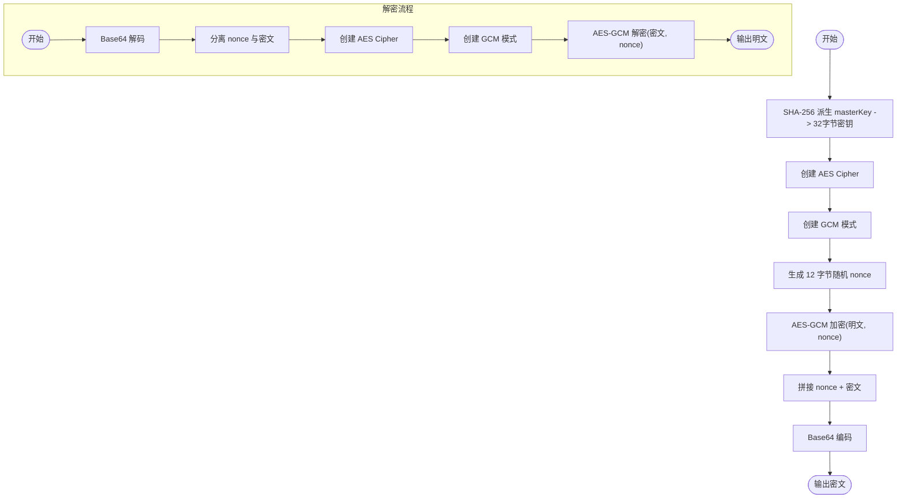
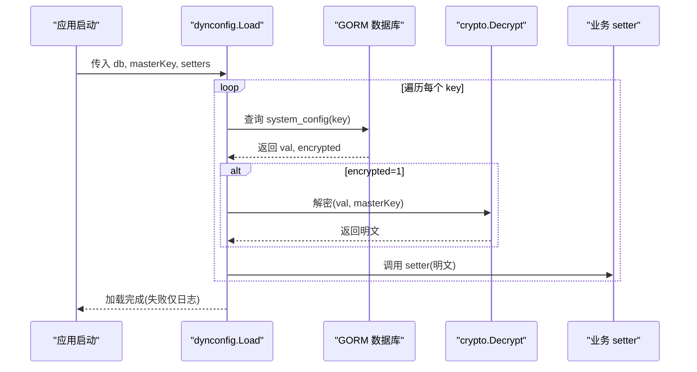
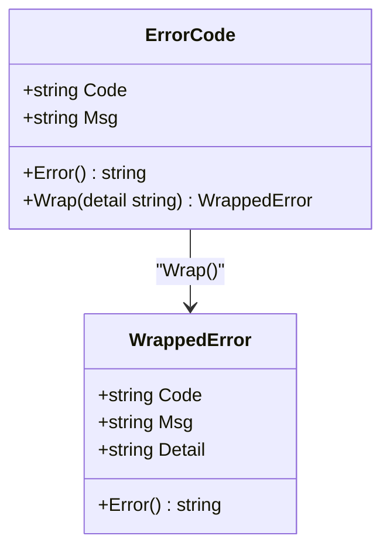
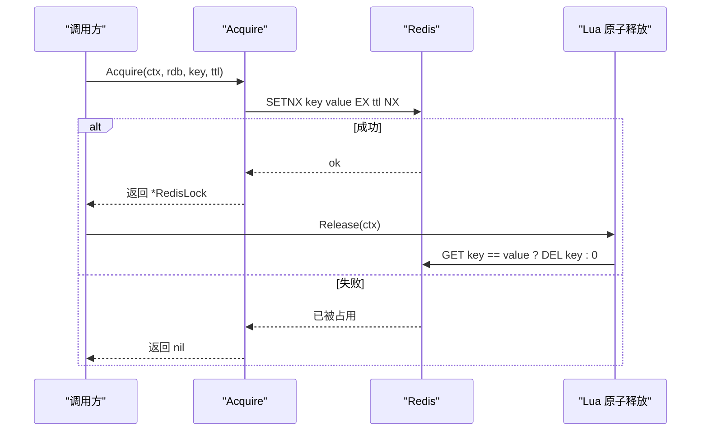
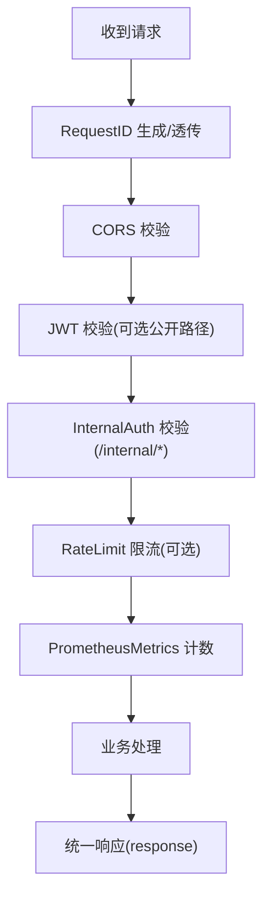
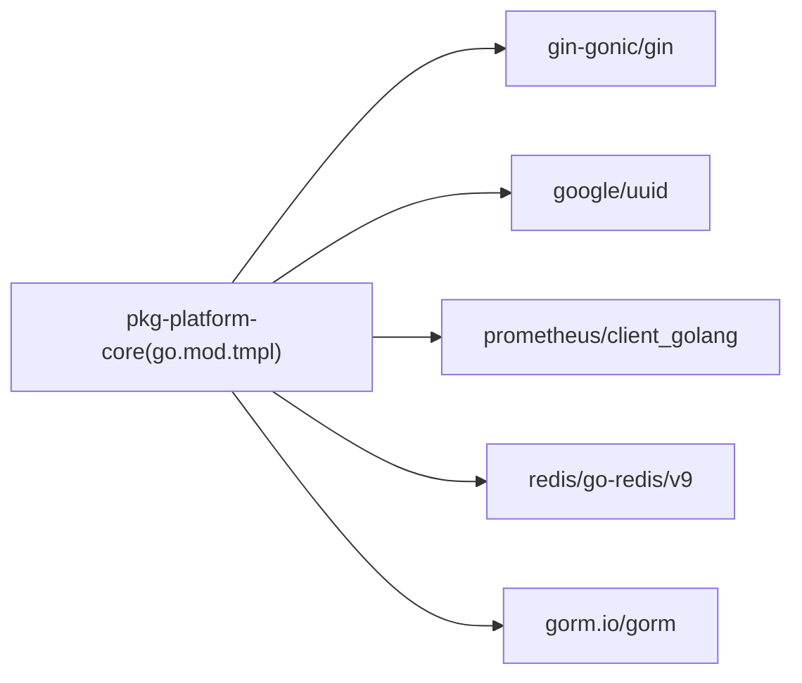

# 核心库

<cite>
**本文引用的文件**
- [go.mod](file://go.mod)
- [cmd/platform/main.go](file://cmd/platform/main.go)
- [internal/config/project.go](file://internal/config/project.go)
- [internal/generator/generator.go](file://internal/generator/generator.go)
- [internal/prompt/prompt.go](file://internal/prompt/prompt.go)
- [templates/embed.go](file://templates/embed.go)
- [templates/files/pkg-platform-core/go.mod.tmpl](file://templates/files/pkg-platform-core/go.mod.tmpl)
- [templates/files/pkg-platform-core/cache/cache.go.tmpl](file://templates/files/pkg-platform-core/cache/cache.go.tmpl)
- [templates/files/pkg-platform-core/crypto/aes_gcm.go.tmpl](file://templates/files/pkg-platform-core/crypto/aes_gcm.go.tmpl)
- [templates/files/pkg-platform-core/dynconfig/loader.go.tmpl](file://templates/files/pkg-platform-core/dynconfig/loader.go.tmpl)
- [templates/files/pkg-platform-core/errcode/errcode.go.tmpl](file://templates/files/pkg-platform-core/errcode/errcode.go.tmpl)
- [templates/files/pkg-platform-core/lock/redis_lock.go.tmpl](file://templates/files/pkg-platform-core/lock/redis_lock.go.tmpl)
- [templates/files/pkg-platform-core/middleware/middleware.go.tmpl](file://templates/files/pkg-platform-core/middleware/middleware.go.tmpl)
- [templates/files/pkg-platform-core/response/response.go.tmpl](file://templates/files/pkg-platform-core/response/response.go.tmpl)
- [templates/files/pkg-platform-core/docs/README.md](file://templates/files/pkg-platform-core/docs/README.md)
</cite>

## 目录
1. [简介](#简介)
2. [项目结构](#项目结构)
3. [核心组件](#核心组件)
4. [架构总览](#架构总览)
5. [详细组件分析](#详细组件分析)
6. [依赖分析](#依赖分析)
7. [性能考虑](#性能考虑)
8. [故障排查指南](#故障排查指南)
9. [结论](#结论)
10. [附录](#附录)

## 简介
本文件系统性梳理平台核心库的设计理念、模块划分与功能特性，覆盖缓存管理、加密算法、动态配置、错误码定义、分布式锁与中间件等核心模块。文档同时给出接口规范、使用方法、集成方式、最佳实践与性能优化建议，并说明单元测试、文档生成与版本管理策略。

## 项目结构
平台核心库位于模板工程的 pkg-platform-core 子树中，通过 Go 模块化组织，采用“包即能力”的设计：每个包聚焦单一职责，通过接口或回调与业务解耦，便于在网关与 API 服务中复用。

图示来源
- [cmd/platform/main.go:1-98](file://cmd/platform/main.go#L1-L98)
- [internal/prompt/prompt.go:1-131](file://internal/prompt/prompt.go#L1-L131)
- [internal/config/project.go:1-121](file://internal/config/project.go#L1-L121)
- [internal/generator/generator.go:1-158](file://internal/generator/generator.go#L1-L158)
- [templates/embed.go:1-12](file://templates/embed.go#L1-L12)
- [templates/files/pkg-platform-core/go.mod.tmpl:1-12](file://templates/files/pkg-platform-core/go.mod.tmpl#L1-L12)
- [templates/files/pkg-platform-core/docs/README.md:1-23](file://templates/files/pkg-platform-core/docs/README.md#L1-L23)

章节来源
- [go.mod:1-37](file://go.mod#L1-L37)
- [cmd/platform/main.go:1-98](file://cmd/platform/main.go#L1-L98)
- [internal/config/project.go:1-121](file://internal/config/project.go#L1-L121)
- [internal/generator/generator.go:1-158](file://internal/generator/generator.go#L1-L158)
- [internal/prompt/prompt.go:1-131](file://internal/prompt/prompt.go#L1-L131)
- [templates/embed.go:1-12](file://templates/embed.go#L1-L12)
- [templates/files/pkg-platform-core/go.mod.tmpl:1-12](file://templates/files/pkg-platform-core/go.mod.tmpl#L1-L12)
- [templates/files/pkg-platform-core/docs/README.md:1-23](file://templates/files/pkg-platform-core/docs/README.md#L1-L23)

## 核心组件
- 缓存管理(cache): 提供 Cache-Aside 泛型实现，支持异步回填、通配符失效与原生字节读写。
- 加密算法(crypto): 提供 AES-256-GCM 加解密，与 Python 端 SHA-256 派生 + AES-GCM 完全对齐。
- 动态配置(dynconfig): 应用启动时从 system_config 表加载并解密配置，通过 setter 回调写入业务配置，优雅降级。
- 错误码(errcode): 六位业务错误码注册表，统一错误包装与 HTTP 状态码解耦。
- 分布式锁(lock): 基于 Redis SETNX + Lua 原子释放的互斥锁，防止误删。
- 中间件(middleware): 提供 RequestID、CORS、JWT、内部认证、限流与指标采集等通用中间件。
- 统一响应(response): 与 Java Response<T> 对齐的统一响应结构与状态码语义。

章节来源
- [templates/files/pkg-platform-core/cache/cache.go.tmpl:1-93](file://templates/files/pkg-platform-core/cache/cache.go.tmpl#L1-L93)
- [templates/files/pkg-platform-core/crypto/aes_gcm.go.tmpl:1-72](file://templates/files/pkg-platform-core/crypto/aes_gcm.go.tmpl#L1-L72)
- [templates/files/pkg-platform-core/dynconfig/loader.go.tmpl:1-136](file://templates/files/pkg-platform-core/dynconfig/loader.go.tmpl#L1-L136)
- [templates/files/pkg-platform-core/errcode/errcode.go.tmpl:1-84](file://templates/files/pkg-platform-core/errcode/errcode.go.tmpl#L1-L84)
- [templates/files/pkg-platform-core/lock/redis_lock.go.tmpl:1-49](file://templates/files/pkg-platform-core/lock/redis_lock.go.tmpl#L1-L49)
- [templates/files/pkg-platform-core/middleware/middleware.go.tmpl:1-202](file://templates/files/pkg-platform-core/middleware/middleware.go.tmpl#L1-L202)
- [templates/files/pkg-platform-core/response/response.go.tmpl:1-78](file://templates/files/pkg-platform-core/response/response.go.tmpl#L1-L78)

## 架构总览
核心库以“包即能力”为核心，围绕以下设计原则构建：
- 业务无关：通过接口/回调与业务解耦，避免引入具体模型。
- 优雅降级：Redis/加密失败不阻断启动，仅记录日志。
- 跨语言对齐：加密派生与算法与 Python 端完全兼容。
- 测试独立：单元测试无需外部依赖，集成测试覆盖 Redis/数据库。

图示来源
- [templates/files/pkg-platform-core/docs/README.md:17-23](file://templates/files/pkg-platform-core/docs/README.md#L17-L23)
- [templates/files/pkg-platform-core/cache/cache.go.tmpl:1-93](file://templates/files/pkg-platform-core/cache/cache.go.tmpl#L1-L93)
- [templates/files/pkg-platform-core/crypto/aes_gcm.go.tmpl:1-72](file://templates/files/pkg-platform-core/crypto/aes_gcm.go.tmpl#L1-L72)
- [templates/files/pkg-platform-core/dynconfig/loader.go.tmpl:1-136](file://templates/files/pkg-platform-core/dynconfig/loader.go.tmpl#L1-L136)
- [templates/files/pkg-platform-core/errcode/errcode.go.tmpl:1-84](file://templates/files/pkg-platform-core/errcode/errcode.go.tmpl#L1-L84)
- [templates/files/pkg-platform-core/lock/redis_lock.go.tmpl:1-49](file://templates/files/pkg-platform-core/lock/redis_lock.go.tmpl#L1-L49)
- [templates/files/pkg-platform-core/middleware/middleware.go.tmpl:1-202](file://templates/files/pkg-platform-core/middleware/middleware.go.tmpl#L1-L202)
- [templates/files/pkg-platform-core/response/response.go.tmpl:1-78](file://templates/files/pkg-platform-core/response/response.go.tmpl#L1-L78)

## 详细组件分析

### 缓存管理(cache)
- 设计要点
  - 泛型 GetOrLoad：先查 Redis，miss 则调用 loadFn，成功后异步回填，不阻塞主流程。
  - InvalidatePattern：按通配符批量删除，使用 SCAN 避免 KEYS 阻塞。
  - 不预设 key 命名规范，建议 cache:<entity>:<id>。
- 关键接口
  - GetOrLoad[T](ctx, key, ttl, loadFn) -> (T, error)
  - Set(ctx, key, data, ttl) error
  - Get(ctx, key) ([]byte, error)
  - Invalidate(ctx, key) error
  - InvalidatePattern(ctx, pattern) error
- 使用方法
  - 在业务侧提供 loadFn，调用 GetOrLoad 获取或加载数据。
  - 需要失效时调用 Invalidate 或 InvalidatePattern。
- 集成方式
  - 依赖 Redis 客户端，注入到 Service 构造函数。
- 最佳实践
  - TTL 设置合理，避免缓存击穿与雪崩。
  - key 命名遵循约定，便于失效与运维。
  - 异常场景下回填失败不应影响主流程，日志记录即可。
- 性能优化
  - 异步回填减少主路径延迟。
  - 批量扫描失效时控制游标步长，避免大批次阻塞。

图示来源
- [templates/files/pkg-platform-core/cache/cache.go.tmpl:28-58](file://templates/files/pkg-platform-core/cache/cache.go.tmpl#L28-L58)

章节来源
- [templates/files/pkg-platform-core/cache/cache.go.tmpl:1-93](file://templates/files/pkg-platform-core/cache/cache.go.tmpl#L1-L93)

### 加密算法(crypto)
- 设计要点
  - AES-256-GCM 加解密，密文格式包含 nonce 与 tag。
  - 通过 SHA-256 将任意长度 masterKey 派生为 32 字节密钥，与 Python 端完全对齐。
- 关键接口
  - Encrypt(plaintext, masterKey) -> string, error
  - Decrypt(ciphertextB64, masterKey) -> string, error
- 使用方法
  - 生成密文：Encrypt(明文, masterKey)
  - 解密密文：Decrypt(Base64密文, masterKey)
- 集成方式
  - 作为工具包直接导入，无需外部依赖。
- 最佳实践
  - masterKey 由运维安全存储，避免硬编码。
  - 密文传输与存储均使用 Base64。
- 性能优化
  - 派生一次密钥，重复使用，避免频繁计算。

图示来源
- [templates/files/pkg-platform-core/crypto/aes_gcm.go.tmpl:18-71](file://templates/files/pkg-platform-core/crypto/aes_gcm.go.tmpl#L18-L71)

章节来源
- [templates/files/pkg-platform-core/crypto/aes_gcm.go.tmpl:1-72](file://templates/files/pkg-platform-core/crypto/aes_gcm.go.tmpl#L1-L72)

### 动态配置(dynconfig)
- 设计要点
  - 应用启动时加载 system_config 表，逐项调用 setter。
  - 加密字段使用 masterKey 解密，失败或缺失仅记录日志，不影响启动。
  - 支持自定义表名/列名与日志前缀。
- 关键接口
  - Load(db, masterKey, setters)
  - LoadWithOptions(db, masterKey, setters, Options)
- 使用方法
  - 业务侧准备 setters 映射，键为配置项名，值为 setter 函数。
  - 调用 Load 或 LoadWithOptions 完成加载。
- 集成方式
  - 依赖 GORM 连接数据库，依赖 crypto 包进行解密。
- 最佳实践
  - 将敏感配置标记 encrypted=1 并加密存储。
  - 未就绪的凭据允许跳过，后续可通过管理端补写。
- 性能优化
  - 单次加载，避免热更新带来的复杂度。

图示来源
- [templates/files/pkg-platform-core/dynconfig/loader.go.tmpl:64-116](file://templates/files/pkg-platform-core/dynconfig/loader.go.tmpl#L64-L116)

章节来源
- [templates/files/pkg-platform-core/dynconfig/loader.go.tmpl:1-136](file://templates/files/pkg-platform-core/dynconfig/loader.go.tmpl#L1-L136)

### 错误码(errcode)
- 设计要点
  - 六位业务错误码，按业务域分段；与 HTTP 状态码解耦。
  - 通过 ErrorCode.Wrap 携带运行时上下文，Code/Msg 来自注册表。
- 关键类型与接口
  - ErrorCode: Code, Msg
  - New(code, msg) -> ErrorCode
  - ErrorCode.Wrap(detail) -> WrappedError
  - WrappedError: Code, Msg, Detail
- 使用方法
  - 在各业务包内集中声明全局错误码变量。
  - 发生错误时返回 WrappedError 或直接返回 ErrorCode。
- 集成方式
  - 与 response 包配合，统一返回格式与 HTTP 状态码映射。
- 最佳实践
  - 前端按 Code 翻译，后端仅提供稳定契约。
  - 通用错误码集中定义，避免重复与冲突。

图示来源
- [templates/files/pkg-platform-core/errcode/errcode.go.tmpl:11-45](file://templates/files/pkg-platform-core/errcode/errcode.go.tmpl#L11-L45)

章节来源
- [templates/files/pkg-platform-core/errcode/errcode.go.tmpl:1-84](file://templates/files/pkg-platform-core/errcode/errcode.go.tmpl#L1-L84)

### 分布式锁(lock)
- 设计要点
  - 基于 Redis SETNX + Lua 原子释放，仅释放自己持有的锁。
  - 自动过期 ttl 防止死锁。
- 关键接口
  - Acquire(ctx, rdb, key, ttl) -> (*RedisLock, error)
  - RedisLock.Release(ctx)
- 使用方法
  - 成功获取锁后 defer Release。
  - 获取失败时返回统一错误码。
- 集成方式
  - 依赖 Redis 客户端，key 建议 cache:<resource>:<id>。
- 最佳实践
  - 锁粒度尽量细，避免长时间持锁。
  - 释放锁时使用 Lua 原子操作，确保幂等安全。

图示来源
- [templates/files/pkg-platform-core/lock/redis_lock.go.tmpl:30-48](file://templates/files/pkg-platform-core/lock/redis_lock.go.tmpl#L30-L48)

章节来源
- [templates/files/pkg-platform-core/lock/redis_lock.go.tmpl:1-49](file://templates/files/pkg-platform-core/lock/redis_lock.go.tmpl#L1-L49)

### 中间件(middleware)
- 能力概览
  - RequestID：生成/透传 X-Request-ID。
  - InternalAuth：校验 X-Internal-Secret，保护 /internal/*。
  - CORS：白名单 Origin + AllowCredentials。
  - JWT：Bearer 校验 + 公开路径白名单 + 过期返回 403。
  - RateLimit：Redis 固定窗口限流，fail-open。
  - PrometheusMetrics：采集 http_requests_total/duration/in_flight。
- 关键接口
  - RequestID() gin.HandlerFunc
  - InternalAuth(secret) gin.HandlerFunc
  - CORS(allowedOrigins, extraHeaders...) gin.HandlerFunc
  - JWT(validator, opts) gin.HandlerFunc
  - RateLimit(redisClient, key, limit, window) gin.HandlerFunc
  - PrometheusMetrics() gin.HandlerFunc
- 使用方法
  - 在路由前注册中间件，按需组合。
  - JWT 需实现 JWTValidator 接口。
- 集成方式
  - 依赖 Gin、Redis、Prometheus 客户端。
- 最佳实践
  - RequestID 保持全链路一致。
  - CORS 白名单严格配置，避免泄露。
  - 限流参数结合业务峰值评估。

图示来源
- [templates/files/pkg-platform-core/middleware/middleware.go.tmpl:24-201](file://templates/files/pkg-platform-core/middleware/middleware.go.tmpl#L24-L201)
- [templates/files/pkg-platform-core/response/response.go.tmpl:26-77](file://templates/files/pkg-platform-core/response/response.go.tmpl#L26-L77)

章节来源
- [templates/files/pkg-platform-core/middleware/middleware.go.tmpl:1-202](file://templates/files/pkg-platform-core/middleware/middleware.go.tmpl#L1-L202)
- [templates/files/pkg-platform-core/response/response.go.tmpl:1-78](file://templates/files/pkg-platform-core/response/response.go.tmpl#L1-L78)

### 统一响应(response)
- 设计要点
  - 与 Java Response<T> 对齐：{code, msg, data}。
  - HTTP 状态码语义：200 成功；400 业务错误；401 未登录；403 Forbidden；406 需要订阅；500 服务端错误。
- 关键接口
  - OK(c, data)
  - OKPage(c, data, totalSize)
  - Err(c, httpStatus, code, msg)
  - BadRequest/Unauthorized/Forbidden/PaymentRequired/NotAcceptable/InternalError
- 使用方法
  - 成功返回 OK/OKPage；失败返回对应错误码。
- 集成方式
  - 与 errcode/middleware 配合，统一错误展示与状态码。

章节来源
- [templates/files/pkg-platform-core/response/response.go.tmpl:1-78](file://templates/files/pkg-platform-core/response/response.go.tmpl#L1-L78)

## 依赖分析
- 模块依赖
  - 核心库模块：github.com/gin-gonic/gin、github.com/google/uuid、github.com/prometheus/client_golang、github.com/redis/go-redis/v9、gorm.io/gorm。
- 外部依赖与集成点
  - Redis：缓存、分布式锁、限流。
  - Prometheus：指标采集。
  - Gin：HTTP 中间件与路由。
  - GORM：动态配置加载。
- 耦合与内聚
  - 各包内聚高、对外仅暴露接口/回调，降低业务耦合。
  - 通过模板注入模块路径，避免硬编码。

图示来源
- [templates/files/pkg-platform-core/go.mod.tmpl:5-11](file://templates/files/pkg-platform-core/go.mod.tmpl#L5-L11)

章节来源
- [templates/files/pkg-platform-core/go.mod.tmpl:1-12](file://templates/files/pkg-platform-core/go.mod.tmpl#L1-L12)

## 性能考虑
- 缓存
  - 异步回填降低主路径延迟；合理设置 TTL，避免击穿与雪崩。
- 加密
  - 派生密钥一次复用，避免重复计算。
- 动态配置
  - 启动时一次性加载，避免热更新带来的复杂度与抖动。
- 分布式锁
  - 锁粒度细化，缩短持锁时间；原子释放避免误删。
- 中间件
  - RequestID/CORS/JWT/Ratelimit 组合使用，注意顺序与开销。
  - 限流 fail-open，避免单点故障扩大。

## 故障排查指南
- 缓存
  - 现象：GetOrLoad 返回空或异常。
  - 排查：确认 key 命名、TTL 设置、Redis 连接；检查异步回填日志。
- 加密
  - 现象：Decrypt 报错或密钥不匹配。
  - 排查：确认 masterKey 一致、密文格式正确、Base64 编解码无误。
- 动态配置
  - 现象：某些凭据未生效。
  - 排查：检查 system_config 表记录、encrypted 标记、masterKey 设置；查看日志跳过项。
- 分布式锁
  - 现象：无法获取锁或误释放。
  - 排查：确认 key 命名唯一、ttl 合理、Release 使用 Lua 原子释放。
- 中间件
  - 现象：CORS/鉴权/限流异常。
  - 排查：核对白名单、Header/Query 参数、限流参数与 Redis 连接。

章节来源
- [templates/files/pkg-platform-core/cache/cache.go.tmpl:28-92](file://templates/files/pkg-platform-core/cache/cache.go.tmpl#L28-L92)
- [templates/files/pkg-platform-core/crypto/aes_gcm.go.tmpl:46-71](file://templates/files/pkg-platform-core/crypto/aes_gcm.go.tmpl#L46-L71)
- [templates/files/pkg-platform-core/dynconfig/loader.go.tmpl:78-115](file://templates/files/pkg-platform-core/dynconfig/loader.go.tmpl#L78-L115)
- [templates/files/pkg-platform-core/lock/redis_lock.go.tmpl:30-48](file://templates/files/pkg-platform-core/lock/redis_lock.go.tmpl#L30-L48)
- [templates/files/pkg-platform-core/middleware/middleware.go.tmpl:70-201](file://templates/files/pkg-platform-core/middleware/middleware.go.tmpl#L70-L201)

## 结论
平台核心库以“包即能力、业务无关、优雅降级、跨语言对齐、测试独立”为设计原则，提供缓存、加密、动态配置、错误码、分布式锁与中间件等通用能力，适配网关与 API 服务的高可用需求。通过清晰的接口规范与最佳实践，可在保证一致性的同时提升开发效率与系统稳定性。

## 附录
- 单元测试
  - 各包提供独立测试，无需外部依赖；集成测试覆盖 Redis/数据库。
- 文档生成
  - 通过 docs/README.md 生成包索引与设计原则。
- 版本管理
  - Go 模块版本与依赖版本在 go.mod.tmpl 中统一管理；CLI 与核心库版本解耦，按需升级。

章节来源
- [templates/files/pkg-platform-core/docs/README.md:1-23](file://templates/files/pkg-platform-core/docs/README.md#L1-L23)
- [templates/files/pkg-platform-core/go.mod.tmpl:1-12](file://templates/files/pkg-platform-core/go.mod.tmpl#L1-L12)